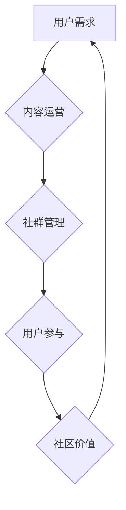

                 

## 技术社区运营：从0到10000用户

> 关键词：技术社区、用户增长、运营策略、内容运营、社群管理、用户参与、社区建设、线上社区

## 1. 背景介绍

在当今数字化时代，技术社区已成为技术人员交流、学习、分享和协作的重要平台。无论是开源软件开发、人工智能研究还是游戏开发，技术社区都扮演着不可或缺的角色。一个成功的技术社区能够聚集大量活跃用户，形成强大的知识共享和创新生态系统。然而，从零用户到拥有10000名用户的技术社区运营是一个充满挑战的过程，需要精心策划和执行。

## 2. 核心概念与联系

### 2.1  社区运营的核心概念

技术社区运营的核心概念包括：

* **用户价值:**  社区运营的首要目标是为用户提供价值，例如：获取知识、解决问题、建立人脉、展示技能等。
* **用户参与:**  活跃的用户参与是社区成功的关键。社区运营需要鼓励用户积极参与，例如：提问、回答、分享、讨论等。
* **内容运营:**  高质量的内容是吸引和留住用户的关键。社区运营需要持续输出有价值的内容，例如：技术文章、教程、案例分享、行业资讯等。
* **社群管理:**  良好的社群管理可以维护社区的秩序和氛围，营造积极友好的互动环境。社区运营需要制定社区规则，管理用户行为，处理冲突等。

### 2.2  社区运营架构



## 3. 核心算法原理 & 具体操作步骤

### 3.1  算法原理概述

用户增长算法是技术社区运营的核心算法之一，其目的是通过分析用户行为数据，预测用户增长趋势，并制定相应的运营策略。常用的用户增长算法包括：

* **病毒式传播模型:**  基于用户推荐和分享机制，实现用户快速增长。
* **增长漏斗模型:**  将用户增长过程分为多个阶段，分析每个阶段的用户流失原因，优化用户体验。
* **用户画像分析:**  通过分析用户数据，构建用户画像，精准定位目标用户群体。

### 3.2  算法步骤详解

1. **数据收集:**  收集用户行为数据，例如：注册信息、登录记录、帖子浏览、评论点赞等。
2. **数据清洗:**  对收集到的数据进行清洗，去除无效数据，保证数据质量。
3. **数据分析:**  使用统计分析、机器学习等方法，分析用户行为数据，发现用户增长规律。
4. **模型构建:**  根据分析结果，构建用户增长模型，预测用户增长趋势。
5. **策略制定:**  根据模型预测结果，制定相应的运营策略，例如：内容运营、社群管理、用户推广等。
6. **效果评估:**  定期评估运营策略的效果，根据评估结果进行调整优化。

### 3.3  算法优缺点

* **优点:**  能够有效预测用户增长趋势，为社区运营提供数据支持。
* **缺点:**  需要大量的数据支持，算法模型的准确性依赖于数据质量。

### 3.4  算法应用领域

用户增长算法广泛应用于技术社区运营、社交媒体平台、电商平台等领域。

## 4. 数学模型和公式 & 详细讲解 & 举例说明

### 4.1  数学模型构建

用户增长模型可以采用指数增长模型或Logistic增长模型。

* **指数增长模型:**  假设用户增长率与现有用户数量成正比，其数学表达式为：

$$
N(t) = N_0 * e^{rt}
$$

其中：

* $N(t)$ 是时间 $t$ 时刻的用户数量。
* $N_0$ 是初始用户数量。
* $r$ 是用户增长率。
* $e$ 是自然常数。

* **Logistic增长模型:**  考虑用户增长受到环境容量的限制，其数学表达式为：

$$
N(t) = \frac{K}{1 + Ae^{-rt}}
$$

其中：

* $K$ 是环境容量，即用户增长最终达到饱和值。
* $A$ 是一个常数，用于调整增长曲线形状。

### 4.2  公式推导过程

指数增长模型的推导过程基于用户增长率与现有用户数量成正比的假设。Logistic增长模型的推导过程则基于用户增长受到环境容量限制的假设。

### 4.3  案例分析与讲解

假设一个技术社区的初始用户数量为100，用户增长率为0.1，则根据指数增长模型，用户数量在1年后将达到110.51人。

如果假设该社区的环境容量为1000，则根据Logistic增长模型，用户数量在1年后将达到219.34人。

## 5. 项目实践：代码实例和详细解释说明

### 5.1  开发环境搭建

* **操作系统:**  Linux/macOS/Windows
* **编程语言:**  Python
* **开发工具:**  VS Code/Atom/Sublime Text
* **数据库:**  MySQL/PostgreSQL

### 5.2  源代码详细实现

```python
# 用户增长模型示例代码
import numpy as np
import matplotlib.pyplot as plt

# 参数设置
N0 = 100  # 初始用户数量
r = 0.1  # 用户增长率
K = 1000  # 环境容量

# 时间步长
t = np.arange(0, 10, 0.1)

# 指数增长模型
N_exp = N0 * np.exp(r * t)

# Logistic增长模型
N_logistic = K / (1 + np.exp(-r * t))

# 绘制用户增长曲线
plt.plot(t, N_exp, label='指数增长模型')
plt.plot(t, N_logistic, label='Logistic增长模型')
plt.xlabel('时间 (年)')
plt.ylabel('用户数量')
plt.title('用户增长模型')
plt.legend()
plt.show()
```

### 5.3  代码解读与分析

* 该代码首先定义了用户增长模型的参数，包括初始用户数量、用户增长率和环境容量。
* 然后，使用 NumPy 库生成时间步长，并根据指数增长模型和Logistic增长模型公式计算出用户数量随时间变化的曲线。
* 最后，使用 Matplotlib 库绘制用户增长曲线，并添加标签和标题。

### 5.4  运行结果展示

运行该代码将生成一个用户增长曲线图，展示了指数增长模型和Logistic增长模型的用户增长趋势。

## 6. 实际应用场景

### 6.1  内容运营

* **用户画像分析:**  根据用户数据，分析用户兴趣、需求和行为模式，为内容创作提供方向。
* **内容推荐:**  根据用户历史行为，推荐相关内容，提高用户粘性。
* **内容分发:**  根据用户活跃度和兴趣，优化内容分发策略，提高内容曝光率。

### 6.2  社群管理

* **用户分群:**  根据用户兴趣和行为，将用户分群，进行精准运营。
* **社区规则制定:**  制定社区规则，维护社区秩序和氛围。
* **用户行为监控:**  监控用户行为，及时发现和处理问题。

### 6.3  用户推广

* **病毒式传播:**  鼓励用户分享社区内容，实现用户快速增长。
* **社交媒体推广:**  利用社交媒体平台推广社区，吸引新用户。
* **线下活动:**  举办线下活动，扩大社区影响力。

### 6.4  未来应用展望

随着人工智能技术的不断发展，技术社区运营将更加智能化和个性化。例如：

* **智能内容推荐:**  利用机器学习算法，为用户推荐更精准的内容。
* **个性化社区体验:**  根据用户喜好，定制个性化社区体验。
* **自动社群管理:**  利用人工智能技术，自动管理社区秩序和氛围。

## 7. 工具和资源推荐

### 7.1  学习资源推荐

* **书籍:**  《社区运营实战》、《用户增长黑客》、《社交媒体营销》
* **网站:**  社区运营博客、技术社区论坛、在线课程平台

### 7.2  开发工具推荐

* **社区平台:**  Discourse、NodeBB、Flarum
* **数据分析工具:**  Google Analytics、Mixpanel
* **用户增长工具:**  GrowthHackers、App Annie

### 7.3  相关论文推荐

* **用户增长模型:**  "A Model for Predicting User Growth in Online Communities"
* **社区运营策略:**  "Effective Strategies for Community Building and Management"

## 8. 总结：未来发展趋势与挑战

### 8.1  研究成果总结

技术社区运营是一个不断发展和演进的领域。从用户增长算法到内容运营策略，从社群管理到用户推广，技术社区运营已经积累了丰富的经验和成果。

### 8.2  未来发展趋势

未来，技术社区运营将更加智能化、个性化和数据化。人工智能技术将被更加广泛地应用于社区运营，例如：智能内容推荐、个性化社区体验、自动社群管理等。

### 8.3  面临的挑战

技术社区运营也面临着一些挑战，例如：

* **用户留存率:**  如何提高用户留存率，避免用户流失。
* **社区活跃度:**  如何保持社区的活跃度，避免社区沉寂。
* **内容质量:**  如何保证社区内容的质量，避免低质量内容泛滥。

### 8.4  研究展望

未来，技术社区运营的研究将更加注重以下几个方面：

* **用户行为分析:**  更深入地分析用户行为，挖掘用户需求和痛点。
* **个性化运营:**  根据用户个性化需求，提供定制化社区体验。
* **人工智能应用:**  探索人工智能技术在社区运营中的更多应用场景。


## 9. 附录：常见问题与解答

### 9.1  常见问题

* 如何吸引用户加入社区？
* 如何提高用户活跃度？
* 如何保证社区内容的质量？

### 9.2  解答

* **如何吸引用户加入社区？** 可以通过内容运营、社群管理、用户推广等方式吸引用户加入社区。
* **如何提高用户活跃度？** 可以通过举办活动、提供优质内容、营造良好的社区氛围等方式提高用户活跃度。
* **如何保证社区内容的质量？** 可以制定社区规则，审核用户提交的内容，鼓励用户积极参与内容创作等方式保证社区内容的质量。


作者：禅与计算机程序设计艺术 / Zen and the Art of Computer Programming 
<end_of_turn>

