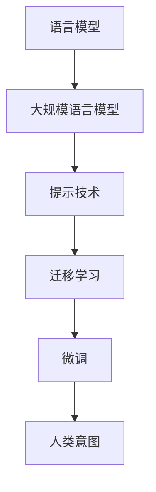

                 

# LLM与人类意图的完美融合之路

## 1. 背景介绍

### 1.1 问题由来

伴随着人工智能技术的迅猛发展，语言模型（Language Model, LM）尤其是大规模语言模型（Large Language Models, LLMs）已经变得越来越强大。这类模型通过大规模无标签文本数据的预训练，学习到了语言模式和语义表达，可以生成语法正确、逻辑合理的自然语言文本。这些模型已经在机器翻译、问答系统、文本摘要、代码生成等领域取得了突破性的成果，展现了其卓越的语言理解和生成能力。

然而，尽管大模型表现出色，但在许多实际应用中，模型输出的结果与人类预期还存在一定的差距。例如，尽管模型可以生成连贯的文本，但往往缺乏对上下文语境的理解和精准响应，无法完全理解用户意图。因此，如何将大模型与人类意图完美融合，实现更为精准、自然的人机交互，成为当前研究的重要课题。

### 1.2 问题核心关键点

为了解决这个问题，研究者们提出了一系列方法，包括使用提示（Prompt）、迁移学习（Transfer Learning）、微调（Fine-Tuning）等。这些方法的核心是：通过与人类输入的交互，动态引导模型生成符合人类期望的输出。这一过程不仅涉及模型本身的训练和优化，还需要对输入格式进行精心设计，引导模型按期望方式输出。

提示（Prompt）技术是一种常见的方法，通过在输入文本中添加提示模板（Template），指导模型生成特定的文本。例如，“请给出一个关于人工智能的简单定义”，模型通过解析这个提示，生成符合预期的回答。尽管提示技术可以显著提升模型的生成质量，但在复杂场景下，仍需要进一步优化和调整，以达到最佳效果。

## 2. 核心概念与联系

### 2.1 核心概念概述

在探讨如何实现LLM与人类意图的完美融合时，我们首先必须理解以下几个核心概念：

- **语言模型（Language Model, LM）**：通过大规模无标签文本数据进行预训练，学习语言结构和语义表达的模型。
- **大规模语言模型（Large Language Models, LLMs）**：参数量超过数亿，能够生成连贯、合理自然语言的模型。
- **提示（Prompt）**：用于引导模型生成符合特定要求的输出，可以是文本、图像、音频等多种形式。
- **迁移学习（Transfer Learning）**：将一个领域的知识迁移到另一个领域，通过预训练模型进行微调以适应新任务。
- **微调（Fine-Tuning）**：在预训练模型的基础上，使用下游任务的少量标注数据，通过有监督学习优化模型在新任务上的性能。

这些概念之间的联系可以通过以下Mermaid流程图来展示：



这个流程图展示了语言模型到大规模语言模型，再到提示、迁移学习、微调的过程，最终实现与人类意图的完美融合。

## 3. 核心算法原理 & 具体操作步骤

### 3.1 算法原理概述

基于人类意图的LLM融合，实际上是一种条件生成（Conditional Generation）的过程。这一过程的核心在于：通过精心设计的提示，动态引导LLM生成符合人类意图的结果。这种提示通常包含特定的任务描述、目标标签等，帮助模型更好地理解输入文本，并产生期望的输出。

在算法层面，这一过程可以形式化地表示为：

$$
P(Y|X, P) = \frac{P(Y|X)}{P(Y)}
$$

其中，$X$ 为输入文本，$Y$ 为目标输出，$P$ 为提示模板。目标是最大化$P(Y|X, P)$，即在给定输入和提示的情况下，生成目标输出的概率。

### 3.2 算法步骤详解

#### 步骤1: 准备预训练模型和数据集

- 选择合适的预训练模型（如GPT-3、BERT等）作为初始化参数。
- 准备下游任务的标注数据集，划分为训练集、验证集和测试集。数据集应包含多样的输入形式，例如文本、图像、音频等。

#### 步骤2: 设计提示模板

- 根据具体任务设计提示模板，引导模型输出期望的结果。例如，对于生成文本任务，可以设计类似“给出一个关于[主题]的介绍”的提示。
- 对不同的输入格式，提示模板的设计也会有所不同。例如，对于文本输入，提示可以包含特定的关键词、句子结构等；对于图像输入，提示可以包含图片的描述、类别等。

#### 步骤3: 执行微调

- 在预训练模型的基础上，使用下游任务的少量标注数据进行微调。微调过程可以使用多种优化算法，如Adam、SGD等，设置合适的学习率、批大小、迭代轮数等超参数。
- 在训练过程中，需要不断调整提示模板，以找到最优的引导效果。可以通过交叉验证等方式，在验证集上评估模型性能，并根据评估结果进行调整。

#### 步骤4: 生成输出

- 使用训练好的模型和优化后的提示模板，对新的输入进行推理生成。
- 对生成结果进行后处理，例如去除冗余信息、优化句子结构等，以提升最终输出的质量和可读性。

### 3.3 算法优缺点

#### 优点：

- **高效性**：通过精心设计的提示模板，可以在不需要大量标注数据的情况下，实现快速高效的任务适配。
- **适应性**：提示技术可以在不同任务和场景下灵活应用，无需重新训练整个模型。
- **多样性**：提示技术支持多种输入形式，适用于各种NLP和多媒体任务。

#### 缺点：

- **复杂度**：设计有效的提示模板需要丰富的经验和技巧，对于复杂任务和场景，可能需要反复试验和调整。
- **过拟合风险**：提示模板可能过拟合特定输入，导致模型在其他输入上表现不佳。
- **依赖提示质量**：提示模板的质量直接影响模型的输出结果，若提示设计不当，可能无法引导模型生成期望的输出。

### 3.4 算法应用领域

提示技术已经广泛应用于多种NLP任务，例如：

- **问答系统**：通过提示模板，引导模型生成精确的回答，如智能客服、智能助手等。
- **文本摘要**：通过提示模板，指导模型生成简洁的摘要，如新闻摘要、文档总结等。
- **机器翻译**：通过提示模板，帮助模型理解和生成多语言文本，如自动翻译、字幕生成等。
- **生成式对话**：通过提示模板，控制对话流程和内容，如智能聊天机器人、虚拟角色对话等。
- **代码生成**：通过提示模板，指导模型生成符合规范的代码，如代码自动补全、自动编写文档等。

这些应用场景展示了提示技术在大规模语言模型融合中的广泛应用，推动了NLP技术向更智能、更灵活的方向发展。

## 4. 数学模型和公式 & 详细讲解 & 举例说明

### 4.1 数学模型构建

基于人类意图的LLM融合问题可以形式化地表示为条件生成问题，其中$X$为输入文本，$Y$为目标输出，$P$为提示模板。模型的目标是在给定输入和提示的情况下，最大化生成目标输出的概率。

### 4.2 公式推导过程

条件生成问题的形式化表示为：

$$
P(Y|X, P) = \frac{P(Y|X)}{P(Y)}
$$

其中，$P(Y|X)$为在给定输入$X$的情况下生成目标输出$Y$的概率，$P(Y)$为目标输出的概率。在实际应用中，通常使用最大化似然估计（Maximum Likelihood Estimation,MLE）进行模型训练。

条件生成模型的优化目标可以表示为：

$$
\min_{\theta} -\sum_{i=1}^N\log P(Y_i|X_i, P)
$$

其中，$\theta$为模型的参数，$N$为训练样本数，$Y_i$为目标输出，$X_i$为输入文本。

在优化过程中，可以使用梯度下降等优化算法，根据损失函数的梯度更新模型参数。

### 4.3 案例分析与讲解

以问答系统为例，假设输入为问题文本$X$，输出为答案文本$Y$，提示模板为$P$。模型的目标是在给定问题$X$和提示$P$的情况下，生成正确答案$Y$。

在训练过程中，模型将问题$X$和提示$P$作为输入，通过优化算法调整模型参数$\theta$，以最小化预测输出$Y$与实际答案的差距。在测试阶段，输入新的问题$X$和优化后的提示$P$，模型生成答案$Y$作为输出。

## 5. 项目实践：代码实例和详细解释说明

### 5.1 开发环境搭建

进行LLM与人类意图融合的实践，需要搭建完善的开发环境。以下是使用Python和PyTorch进行开发的典型流程：

1. 安装Anaconda，创建虚拟环境。
2. 安装PyTorch，使用CUDA加速。
3. 安装相关的NLP库，如NLTK、spaCy等。
4. 准备预训练模型，如GPT-3、BERT等。
5. 准备下游任务的数据集，划分为训练集、验证集和测试集。

### 5.2 源代码详细实现

以下是一个简单的问答系统实现示例：

```python
import torch
from transformers import GPT2Tokenizer, GPT2LMHeadModel

# 加载预训练模型和分词器
model = GPT2LMHeadModel.from_pretrained('gpt2')
tokenizer = GPT2Tokenizer.from_pretrained('gpt2')

# 定义提示模板
prompts = ['这是一个关于[主题]的问题']

# 准备训练数据
train_data = [(X1, Y1), (X2, Y2), ...]  # X为问题，Y为答案

# 定义优化器
optimizer = torch.optim.Adam(model.parameters(), lr=1e-5)

# 训练过程
for epoch in range(10):
    # 前向传播
    for X, Y in train_data:
        inputs = tokenizer.encode(X, return_tensors='pt')
        with torch.no_grad():
            outputs = model.generate(inputs, max_length=128)
        loss = loss_function(outputs, Y)
        
        # 反向传播和参数更新
        optimizer.zero_grad()
        loss.backward()
        optimizer.step()
        
    # 验证过程
    for X, Y in dev_data:
        inputs = tokenizer.encode(X, return_tensors='pt')
        with torch.no_grad():
            outputs = model.generate(inputs, max_length=128)
        loss = loss_function(outputs, Y)
        
    # 保存模型
    torch.save(model.state_dict(), 'model_checkpoint')

# 推理过程
for X in test_data:
    inputs = tokenizer.encode(X, return_tensors='pt')
    with torch.no_grad():
        outputs = model.generate(inputs, max_length=128)
    Y = tokenizer.decode(outputs, skip_special_tokens=True)
    print(Y)
```

### 5.3 代码解读与分析

- **加载预训练模型和分词器**：使用HuggingFace提供的预训练模型和分词器，简化模型加载过程。
- **定义提示模板**：根据任务需求设计提示模板，可以是简单的占位符，也可以是更复杂的文本描述。
- **准备训练数据**：将问题-答案对作为训练数据集，其中X为问题，Y为答案。
- **定义优化器**：选择合适的优化算法和超参数，进行模型参数优化。
- **训练过程**：通过前向传播、计算损失、反向传播和参数更新，不断优化模型。
- **验证过程**：在验证集上评估模型性能，避免过拟合。
- **保存模型**：训练好的模型保存为checkpoint，以便后续使用。
- **推理过程**：对新的问题文本进行推理，生成答案文本。

## 6. 实际应用场景

### 6.1 智能客服系统

在智能客服系统中，LLM与人类意图的融合可以通过提示技术实现。当用户输入问题时，系统自动解析问题内容，生成对应的提示模板，指导模型生成最佳答案。通过不断优化提示模板和模型参数，系统能够提供高效、准确的客服服务。

### 6.2 文本摘要

在文本摘要任务中，LLM与人类意图的融合可以通过提示技术实现。例如，用户希望生成特定主题的新闻摘要，系统根据用户输入的主题，生成包含关键词和句子结构的提示模板，指导模型生成简洁明了的摘要。通过调整提示模板和优化模型参数，系统能够在短时间内生成高质量的摘要。

### 6.3 机器翻译

在机器翻译任务中，LLM与人类意图的融合可以通过提示技术实现。例如，用户希望将英文翻译成中文，系统自动解析输入文本，生成包含语言对和翻译方向的提示模板，指导模型生成准确的翻译结果。通过不断优化提示模板和模型参数，系统能够提供高质量的翻译服务。

### 6.4 未来应用展望

随着LLM与人类意图的融合技术不断发展，未来将有更多的应用场景得以实现：

- **自然语言生成**：LLM能够生成符合人类意图的高质量文本，如小说创作、剧本编写等。
- **虚拟角色对话**：LLM能够生成符合人类意图的多轮对话，如虚拟角色、游戏NPC等。
- **智能推荐**：LLM能够生成符合人类偏好的推荐内容，如个性化新闻、商品推荐等。
- **智能医疗**：LLM能够生成符合医生意图的治疗方案，如病历记录、药物推荐等。

## 7. 工具和资源推荐

### 7.1 学习资源推荐

为了帮助开发者系统掌握LLM与人类意图的融合技术，这里推荐一些优质的学习资源：

1. **自然语言处理基础**：Stanford NLP课程和《自然语言处理综论》书籍，介绍了NLP基础和经典模型。
2. **深度学习框架**：PyTorch和TensorFlow的官方文档和示例代码，提供了丰富的学习资源。
3. **提示技术**：HuggingFace官方文档和相关论文，介绍了提示技术的基本原理和应用案例。
4. **大语言模型**：《Transformers》书籍和HuggingFace官方文档，介绍了各类预训练语言模型的实现和应用。

### 7.2 开发工具推荐

以下是几款用于LLM与人类意图融合开发的常用工具：

1. **PyTorch**：基于Python的开源深度学习框架，提供了丰富的NLP库和模型实现。
2. **TensorFlow**：由Google主导开发的深度学习框架，支持大规模工程应用。
3. **HuggingFace Transformers库**：提供了丰富的预训练语言模型和提示模板，方便快速开发。
4. **Jupyter Notebook**：交互式开发环境，便于模型训练和调试。
5. **TensorBoard**：TensorFlow配套的可视化工具，实时监测模型训练状态。

### 7.3 相关论文推荐

LLM与人类意图的融合技术涉及多学科交叉，以下是几篇具有代表性的相关论文：

1. **《Longformer: The Long-Document Transformer for Language Understanding》**：提出了Longformer模型，适用于长文本理解和生成任务。
2. **《GPT-3: Language Models are Unsupervised Multitask Learners》**：展示了GPT-3模型的强大zero-shot学习能力，推动了LLM技术的发展。
3. **《AdaLoRA: Adaptive Low-Rank Adaptation for Parameter-Efficient Fine-Tuning》**：提出了一种参数高效的微调方法，减少了模型训练成本。
4. **《Prompt-Based Learning》**：介绍了提示技术的原理和应用，展示了其在多种任务中的效果。
5. **《A Survey on Natural Language Generation Techniques》**：综述了自然语言生成技术的最新进展，介绍了LLM在其中的应用。

## 8. 总结：未来发展趋势与挑战

### 8.1 研究成果总结

本文对基于人类意图的LLM融合技术进行了全面系统的介绍。首先阐述了LLM和微调的基本原理，其次详细讲解了提示技术的实现步骤，并提供了代码实现示例。同时，本文还探讨了LLM在实际应用中的多种场景，展示了其广泛的应用前景。

通过本文的系统梳理，可以看到，LLM与人类意图的融合技术正在成为NLP领域的重要范式，极大地拓展了语言模型的应用边界，催生了更多的落地场景。LLM在各种任务中的应用展示了其卓越的语言理解和生成能力，推动了NLP技术的不断进步。

### 8.2 未来发展趋势

展望未来，LLM与人类意图的融合技术将呈现以下几个发展趋势：

1. **技术多样化**：未来的融合技术将融合更多前沿技术，如知识表示、因果推理、多模态学习等，提升LLM的推理和生成能力。
2. **应用场景广泛化**：LLM将在更多领域得到应用，如智能医疗、金融、教育等，推动各行各业向智能化方向发展。
3. **模型规模化**：随着硬件算力的提升，未来的LLM将具备更大的参数量，能够在更复杂的任务中表现出色。
4. **智能化程度提升**：未来的LLM将具备更强的自主学习能力，能够更好地理解人类意图，提供更准确的输出。

### 8.3 面临的挑战

尽管LLM与人类意图的融合技术已经取得了显著进展，但在实际应用中仍面临诸多挑战：

1. **数据质量问题**：高质量的数据是LLM训练和微调的基础，但在实际应用中，获取高质量的数据往往需要大量人力和资源。
2. **模型鲁棒性**：LLM在面对特定任务和场景时，可能出现泛化性能差、鲁棒性不足等问题。
3. **计算资源需求**：大规模LLM的训练和推理需要大量的计算资源，如何在保证性能的同时降低资源消耗，仍需进一步优化。
4. **伦理和安全问题**：LLM的生成内容可能存在偏见、歧视等问题，需要对其输出进行严格的监管和审查。
5. **交互体验优化**：在智能交互场景中，如何提升用户体验，减少人机交互中的误解和困惑，仍需进一步研究。

### 8.4 研究展望

面对这些挑战，未来的研究需要在以下几个方面寻求新的突破：

1. **数据获取与标注**：探索无监督和半监督学习技术，降低数据标注成本，提升数据质量。
2. **模型优化与压缩**：开发高效的模型优化和压缩方法，降低计算资源需求，提升模型推理速度。
3. **伦理与安全**：引入伦理导向的评估指标，制定严格的监管机制，确保LLM的输出符合人类价值观和伦理道德。
4. **交互体验优化**：研究交互界面的优化设计，提升人机交互的自然度和流畅度，减少误解和困惑。

这些研究方向的探索，必将引领LLM与人类意图的融合技术迈向更高的台阶，为构建安全、可靠、可解释、可控的智能系统铺平道路。面向未来，LLM与人类意图的融合技术还需要与其他人工智能技术进行更深入的融合，如知识表示、因果推理、强化学习等，多路径协同发力，共同推动自然语言理解和智能交互系统的进步。

## 9. 附录：常见问题与解答

**Q1：LLM与人类意图融合的实现难点是什么？**

A: 实现LLM与人类意图的融合主要难点在于：
1. 设计有效的提示模板：提示模板的设计需要丰富的经验和技巧，不同任务和场景需要不同的提示。
2. 优化模型参数：在提示模板不变的情况下，需要不断调整模型参数，以找到最优的生成效果。
3. 处理长文本和多模态数据：LLM在处理长文本和多模态数据时，可能会出现性能瓶颈，需要优化模型结构和计算图。

**Q2：如何设计有效的提示模板？**

A: 设计有效的提示模板需要考虑以下几个方面：
1. 简洁明了：提示模板应尽量简洁明了，避免冗余信息。
2. 精准导向：提示模板应精准导向，引导模型生成符合预期的输出。
3. 多样性：提示模板应具有多样性，适用于不同任务和场景。
4. 迭代优化：提示模板应不断迭代优化，根据模型输出结果进行调整。

**Q3：LLM在处理长文本和多模态数据时需要注意哪些问题？**

A: 在处理长文本和多模态数据时，LLM需要注意以下几个问题：
1. 计算资源消耗：长文本和多模态数据处理需要大量的计算资源，需要优化模型结构和计算图。
2. 数据格式统一：不同类型的数据格式不同，需要统一为模型可以处理的格式。
3. 数据融合问题：不同类型的数据需要有效融合，以提高模型对真实世界的理解能力。

**Q4：LLM与人类意图的融合技术在实际应用中有哪些挑战？**

A: LLM与人类意图的融合技术在实际应用中面临以下几个挑战：
1. 数据获取与标注：高质量的数据是LLM训练和微调的基础，但获取高质量的数据往往需要大量人力和资源。
2. 模型鲁棒性：LLM在面对特定任务和场景时，可能出现泛化性能差、鲁棒性不足等问题。
3. 计算资源需求：大规模LLM的训练和推理需要大量的计算资源，如何在保证性能的同时降低资源消耗，仍需进一步优化。
4. 伦理与安全：LLM的生成内容可能存在偏见、歧视等问题，需要对其输出进行严格的监管和审查。
5. 交互体验优化：在智能交互场景中，如何提升用户体验，减少人机交互中的误解和困惑，仍需进一步研究。

**Q5：LLM与人类意图的融合技术如何与其他技术结合？**

A: LLM与人类意图的融合技术可以与其他技术结合，如知识表示、因果推理、多模态学习等，提升模型性能和应用效果：
1. 知识表示：将符号化的先验知识，如知识图谱、逻辑规则等，与神经网络模型进行融合，增强模型的推理能力。
2. 因果推理：引入因果推断方法，增强模型的因果关系分析能力，避免过拟合和误导。
3. 多模态学习：融合视觉、听觉等多模态数据，提升模型对真实世界的理解能力。

通过与其他技术的结合，LLM将具备更强的自主学习能力，能够更好地理解人类意图，提供更准确的输出。

---

作者：禅与计算机程序设计艺术 / Zen and the Art of Computer Programming

