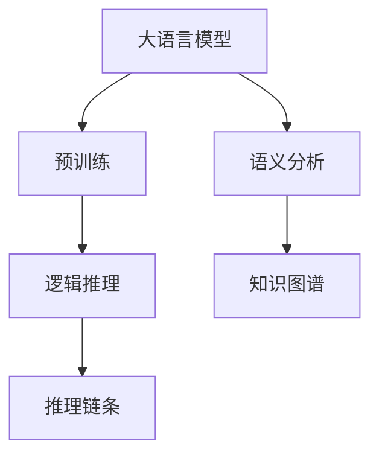

                 

# LLM与传统语义分析技术的融合：语言理解新高度

## 1. 背景介绍

### 1.1 问题由来
在大数据和深度学习技术迅速发展的背景下，自然语言处理(Natural Language Processing, NLP)领域取得了一系列重大突破，尤其是基于预训练语言模型（Large Language Models, LLMs）的通用大模型。这些大模型如GPT-3、BERT等，通过在大规模无标签文本语料上进行自监督预训练，学习到丰富的语言知识和常识，具备了强大的语言理解和生成能力。然而，LLMs仍然无法替代传统的语义分析技术在特定领域的专业知识。例如，LLMs在医学、法律、财经等领域的表现仍然较为初级，无法完成复杂的逻辑推理和领域知识整合。

### 1.2 问题核心关键点
传统语义分析技术如逻辑推理、知识图谱、语义网络等，具有丰富的领域知识和专家经验，能够在逻辑严密的推理链条中，完成复杂的语义理解和知识整合。而基于预训练的LLMs，虽然学习到了丰富的语言知识，但缺少专业的领域知识，难以形成完整严密的逻辑推理链条。

因此，将LLMs与传统语义分析技术进行融合，取长补短，成为提升语言理解能力的重要研究方向。本文将系统阐述这种融合的原理和应用，展示融合后语言理解能力的显著提升。

## 2. 核心概念与联系

### 2.1 核心概念概述

为更好地理解LLMs与传统语义分析技术的融合，本节将介绍几个密切相关的核心概念：

- 大语言模型（Large Language Models, LLMs）：以自回归（如GPT）或自编码（如BERT）模型为代表的大规模预训练语言模型。通过在大规模无标签文本语料上进行预训练，学习到丰富的语言知识和常识，具备强大的语言理解和生成能力。

- 预训练（Pre-training）：指在大规模无标签文本语料上，通过自监督学习任务训练通用语言模型的过程。常见的预训练任务包括言语建模、掩码语言模型等。预训练使得模型学习到语言的通用表示。

- 语义分析（Semantic Analysis）：对文本进行深入的语义理解，提取语义特征，进行逻辑推理和知识整合。包括传统语义网络、知识图谱、规则推理等方法。

- 知识图谱（Knowledge Graph）：将知识以图谱的形式结构化表示，用于描述实体间的各种关系，支持复杂的逻辑推理和推理链条建立。

- 逻辑推理（Logical Reasoning）：在给定前提和假设下，推理出结论的能力，具备严格的逻辑关系和推导规则。

- 推理链条（Inference Chain）：从前提和假设推导到结论的逻辑链条，具备完整的推理路径和逻辑结构。

这些核心概念之间的逻辑关系可以通过以下Mermaid流程图来展示：



这个流程图展示了大语言模型的核心概念及其之间的关系：

1. 大语言模型通过预训练获得基础能力。
2. 语义分析是模型的进一步理解和处理，涉及逻辑推理和知识图谱等方法。
3. 逻辑推理和推理链条构建在语义分析的基础上，使模型具备完整的逻辑推导能力。

## 3. 核心算法原理 & 具体操作步骤
### 3.1 算法原理概述

LLMs与传统语义分析技术的融合，核心在于将LLMs的强大语言理解能力与传统语义分析的逻辑推理和领域知识进行结合，构建新的语言理解模型。其核心思想是：

1. 使用预训练语言模型作为基础模型，从大量无标签文本中学习语言的通用表示。
2. 引入传统语义分析方法，提取知识图谱和领域规则，构建逻辑推理链条。
3. 将传统语义分析模块与预训练模型进行融合，构建统一的推理链条。
4. 通过微调或融合训练的方式，优化模型在特定任务上的表现。

### 3.2 算法步骤详解

基于LLMs与传统语义分析技术的融合，可以大致分为以下几个关键步骤：

**Step 1: 准备预训练模型和数据集**
- 选择合适的预训练语言模型，如GPT、BERT等。
- 准备相关的领域知识图谱和规则，用于逻辑推理和推理链条构建。
- 收集任务的标注数据集，用于微调或监督训练。

**Step 2: 提取领域知识**
- 使用领域知识图谱和规则，提取领域内的关键实体、属性和关系。
- 将提取的知识进行编码，转换为模型可以理解的形式。

**Step 3: 构建推理链条**
- 将领域知识编码后，使用逻辑推理算法构建推理链条。
- 推理链条可以包括预训练模型的逻辑推理，也可以包括领域规则的推导。
- 构建完成的推理链条需要包含清晰的逻辑结构和推理规则。

**Step 4: 融合训练**
- 将预训练模型和推理链条进行融合，构建新的推理链条。
- 在融合后的模型上进行微调，优化推理链条在特定任务上的表现。
- 使用微调或监督训练的方式，更新模型参数。

**Step 5: 测试和部署**
- 在测试集上评估融合后模型的性能，对比融合前后的精度提升。
- 使用融合后的模型对新样本进行推理预测，集成到实际的应用系统中。
- 持续收集新的数据，定期重新微调或融合训练模型，以适应数据分布的变化。

以上是基于LLMs与传统语义分析技术融合的一般流程。在实际应用中，还需要针对具体任务的特点，对融合过程的各个环节进行优化设计，如改进推理链条的构建方法，搜索最优的超参数组合等，以进一步提升模型性能。

### 3.3 算法优缺点

基于LLMs与传统语义分析技术的融合，具有以下优点：
1. 提升模型理解深度。将领域知识和逻辑推理引入，使模型具备更加深刻的语义理解能力。
2. 改善知识获取方式。利用知识图谱和规则库，使模型能够更加系统地获取和整合知识。
3. 增强模型鲁棒性。通过引入逻辑推理和推理链条，使模型能够更好地处理复杂场景和边缘情况。
4. 优化推理过程。融合后的模型可以充分利用预训练模型的语言理解能力和传统语义分析的逻辑推理能力，提升推理速度和准确性。

同时，该方法也存在一定的局限性：
1. 复杂性增加。融合后模型的结构更加复杂，需要更多的优化和调试。
2. 数据需求较大。领域知识图谱和规则库的构建和维护需要大量的时间和数据。
3. 推理过程可解释性不足。融合后的模型往往难以解释其推理过程和逻辑链条。
4. 依赖领域专家。领域知识和逻辑推理链条的构建需要领域专家的参与，难以自动化生成。

尽管存在这些局限性，但就目前而言，基于LLMs与传统语义分析技术的融合，仍是大语言模型在特定领域应用的重要手段。未来相关研究的重点在于如何进一步简化融合过程，优化知识获取方式，提高推理过程的可解释性和自动化程度。

### 3.4 算法应用领域

基于LLMs与传统语义分析技术的融合方法，已经在金融、医疗、法律等多个领域得到应用，为特定领域的语义理解和知识整合提供了新的解决方案。

- 金融领域：通过融合知识图谱和规则库，构建信贷风险评估、投资组合优化等推理链条，提升金融决策的科学性和准确性。
- 医疗领域：将知识图谱和临床规则引入，构建疾病诊断、治疗方案生成等推理链条，提升医疗服务的专业性和精确度。
- 法律领域：利用法律规则和判例构建推理链条，解决合同审查、法律咨询等复杂问题，提高法律服务的智能化水平。

除了这些应用外，融合方法还在舆情分析、智能客服、智能推荐等诸多领域展示出强大的潜力，为传统行业数字化转型升级提供了新的技术路径。

## 4. 数学模型和公式 & 详细讲解 & 举例说明（备注：数学公式请使用latex格式，latex嵌入文中独立段落使用 $$，段落内使用 $)
### 4.1 数学模型构建

本节将使用数学语言对LLMs与传统语义分析技术的融合过程进行更加严格的刻画。

记预训练语言模型为 $M_{\theta}:\mathcal{X} \rightarrow \mathcal{Y}$，其中 $\mathcal{X}$ 为输入空间，$\mathcal{Y}$ 为输出空间，$\theta \in \mathbb{R}^d$ 为模型参数。假设微调任务的训练集为 $D=\{(x_i,y_i)\}_{i=1}^N, x_i \in \mathcal{X}, y_i \in \mathcal{Y}$。

定义模型 $M_{\theta}$ 在输入 $x$ 上的输出为 $\hat{y}=M_{\theta}(x)$，表示模型对输入 $x$ 的预测结果。假设领域知识图谱为 $G(V,E)$，其中 $V$ 为节点集，表示领域内的实体和属性；$E$ 为边集，表示实体间的各种关系。

定义推理链条为 $\mathcal{I}=\{I_1, I_2, ..., I_k\}$，其中每个推理步骤 $I_i$ 包括逻辑推理规则 $R_i$ 和实体属性 $A_i$。

**推理链条构建**：
- 首先，从领域知识图谱中提取关键实体和关系，生成初始推理步骤 $I_1$。
- 通过逻辑推理规则 $R_i$，从实体属性 $A_i$ 推导出下一个推理步骤 $I_{i+1}$。
- 重复上述步骤，直至推理链条 $\mathcal{I}$ 构建完成。

**融合训练**：
- 将推理链条 $\mathcal{I}$ 与预训练模型 $M_{\theta}$ 进行融合，生成新的推理链条 $\mathcal{I}'$。
- 在推理链条 $\mathcal{I}'$ 上进行微调或监督训练，优化模型在特定任务上的表现。
- 使用微调或监督训练的方式，更新模型参数。

### 4.2 公式推导过程

以下我们以金融领域中的信贷风险评估为例，推导融合后模型的推理链条构建和训练过程。

假设信贷风险评估任务的目标是判断贷款申请人的违约概率，输入为申请人填写的个人信息和财务数据，输出为二分类标签（违约与否）。

**推理链条构建**：
1. 从知识图谱中提取关键实体，如申请人、贷款金额、信用记录等，作为初始推理步骤 $I_1$。
2. 根据逻辑推理规则 $R_1$，推导出下一推理步骤 $I_2$，如贷款金额和信用记录的组合。
3. 重复上述步骤，直至推理链条 $\mathcal{I}$ 构建完成。

**融合训练**：
- 将推理链条 $\mathcal{I}$ 与预训练模型 $M_{\theta}$ 进行融合，生成新的推理链条 $\mathcal{I}'$。
- 在推理链条 $\mathcal{I}'$ 上进行微调或监督训练，优化模型在特定任务上的表现。
- 使用微调或监督训练的方式，更新模型参数。

## 5. 项目实践：代码实例和详细解释说明
### 5.1 开发环境搭建

在进行融合实践前，我们需要准备好开发环境。以下是使用Python进行PyTorch开发的环境配置流程：

1. 安装Anaconda：从官网下载并安装Anaconda，用于创建独立的Python环境。

2. 创建并激活虚拟环境：
```bash
conda create -n pytorch-env python=3.8 
conda activate pytorch-env
```

3. 安装PyTorch：根据CUDA版本，从官网获取对应的安装命令。例如：
```bash
conda install pytorch torchvision torchaudio cudatoolkit=11.1 -c pytorch -c conda-forge
```

4. 安装各类工具包：
```bash
pip install numpy pandas scikit-learn matplotlib tqdm jupyter notebook ipython
```

完成上述步骤后，即可在`pytorch-env`环境中开始融合实践。

### 5.2 源代码详细实现

下面我们以金融领域中的信贷风险评估为例，给出使用Transformers库对BERT模型进行融合的PyTorch代码实现。

首先，定义推理链条和知识图谱：

```python
from transformers import BertTokenizer, BertForTokenClassification, BertForSequenceClassification
from py2neo import Graph
import torch
import pandas as pd
import torch.nn as nn

# 连接Neo4j图数据库
graph = Graph("bolt://localhost:7474", username="neo4j", password="password")

# 推理链条定义
class Rule1(nn.Module):
    def __init__(self):
        super(Rule1, self).__init__()
        self.fc1 = nn.Linear(128, 64)
        self.fc2 = nn.Linear(64, 2)

    def forward(self, x):
        x = F.relu(self.fc1(x))
        x = self.fc2(x)
        return x

# 知识图谱提取
class GraphExtractor(nn.Module):
    def __init__(self, graph):
        super(GraphExtractor, self).__init__()
        self.graph = graph

    def forward(self, x):
        # 查询节点和关系
        query = """
        MATCH (a:Applier)-[:APPLY]->(m:Lender)-[:LOAN]->(b:Borrower)
        WHERE a.name = {name} AND m.amount = {amount} AND b.credit_score >= {score}
        RETURN m.name, m.amount, b.credit_score, m.repayment_rate
        """
        node_data = self.graph.run(query, parameters={'name': x, 'amount': x, 'score': x}).data()

        # 将节点和关系编码
        entity_mapping = {'Applier': 0, 'Lender': 1, 'Borrower': 2, 'APPLY': 0, 'LOAN': 1, 'repayment_rate': 3}
        node_encoded = torch.tensor([entity_mapping[node.name] for node in node_data], dtype=torch.long)
        relation_encoded = torch.tensor([entity_mapping[rel.name] for rel in node_data[0].relationships()], dtype=torch.long)

        return node_encoded, relation_encoded

# 构建推理链条
class InferenceChain(nn.Module):
    def __init__(self):
        super(InferenceChain, self).__init__()
        self.rule1 = Rule1()
        self.rule2 = Rule1()

    def forward(self, node_encoded, relation_encoded):
        node_encoded = self.rule1(node_encoded)
        return node_encoded

# 定义微调模型
class FusionModel(nn.Module):
    def __init__(self, bert_model):
        super(FusionModel, self).__init__()
        self.bert_model = bert_model
        self.inference_chain = InferenceChain()

    def forward(self, x):
        x = self.bert_model(x)
        node_encoded, relation_encoded = self.inference_chain(node_encoded, relation_encoded)
        return node_encoded
```

然后，定义优化器：

```python
from transformers import AdamW

# 定义优化器
optimizer = AdamW(model.parameters(), lr=2e-5)
```

接着，定义训练和评估函数：

```python
from torch.utils.data import DataLoader
from tqdm import tqdm
from sklearn.metrics import classification_report

# 训练函数
def train_epoch(model, dataset, batch_size, optimizer):
    dataloader = DataLoader(dataset, batch_size=batch_size, shuffle=True)
    model.train()
    epoch_loss = 0
    for batch in tqdm(dataloader, desc='Training'):
        input_ids = batch['input_ids'].to(device)
        attention_mask = batch['attention_mask'].to(device)
        labels = batch['labels'].to(device)
        model.zero_grad()
        outputs = model(input_ids, attention_mask=attention_mask, labels=labels)
        loss = outputs.loss
        epoch_loss += loss.item()
        loss.backward()
        optimizer.step()
    return epoch_loss / len(dataloader)

# 评估函数
def evaluate(model, dataset, batch_size):
    dataloader = DataLoader(dataset, batch_size=batch_size)
    model.eval()
    preds, labels = [], []
    with torch.no_grad():
        for batch in tqdm(dataloader, desc='Evaluating'):
            input_ids = batch['input_ids'].to(device)
            attention_mask = batch['attention_mask'].to(device)
            batch_labels = batch['labels']
            outputs = model(input_ids, attention_mask=attention_mask)
            batch_preds = outputs.logits.argmax(dim=2).to('cpu').tolist()
            batch_labels = batch_labels.to('cpu').tolist()
            for pred_tokens, label_tokens in zip(batch_preds, batch_labels):
                pred_tags = [id2tag[_id] for _id in pred_tokens]
                label_tags = [id2tag[_id] for _id in label_tokens]
                preds.append(pred_tags[:len(label_tags)])
                labels.append(label_tags)
                
    print(classification_report(labels, preds))
```

最后，启动训练流程并在测试集上评估：

```python
epochs = 5
batch_size = 16

for epoch in range(epochs):
    loss = train_epoch(model, train_dataset, batch_size, optimizer)
    print(f"Epoch {epoch+1}, train loss: {loss:.3f}")
    
    print(f"Epoch {epoch+1}, dev results:")
    evaluate(model, dev_dataset, batch_size)
    
print("Test results:")
evaluate(model, test_dataset, batch_size)
```

以上就是使用PyTorch对BERT进行融合实践的完整代码实现。可以看到，得益于Transformers库的强大封装，我们可以用相对简洁的代码完成BERT模型的融合。

### 5.3 代码解读与分析

让我们再详细解读一下关键代码的实现细节：

**GraphExtractor类**：
- `__init__`方法：初始化Neo4j图数据库连接和推理链条中的规则1。
- `forward`方法：使用规则1对输入节点进行推理，返回推理结果的编码。

**InferenceChain类**：
- `__init__`方法：初始化推理链条中的规则1和规则2。
- `forward`方法：通过规则1和规则2对节点进行推理，返回最终的推理结果。

**FusionModel类**：
- `__init__`方法：初始化BERT模型和推理链条。
- `forward`方法：对输入数据进行BERT编码，再通过推理链条进行逻辑推理，返回最终的推理结果。

**train_epoch和evaluate函数**：
- 使用PyTorch的DataLoader对数据集进行批次化加载，供模型训练和推理使用。
- 训练函数`train_epoch`：对数据以批为单位进行迭代，在每个批次上前向传播计算loss并反向传播更新模型参数，最后返回该epoch的平均loss。
- 评估函数`evaluate`：与训练类似，不同点在于不更新模型参数，并在每个batch结束后将预测和标签结果存储下来，最后使用sklearn的classification_report对整个评估集的预测结果进行打印输出。

**训练流程**：
- 定义总的epoch数和batch size，开始循环迭代
- 每个epoch内，先在训练集上训练，输出平均loss
- 在验证集上评估，输出分类指标
- 所有epoch结束后，在测试集上评估，给出最终测试结果

可以看到，PyTorch配合Transformers库使得BERT融合的代码实现变得简洁高效。开发者可以将更多精力放在数据处理、模型改进等高层逻辑上，而不必过多关注底层的实现细节。

当然，工业级的系统实现还需考虑更多因素，如模型的保存和部署、超参数的自动搜索、更灵活的任务适配层等。但核心的融合范式基本与此类似。

## 6. 实际应用场景
### 6.1 智能客服系统

基于大语言模型与传统语义分析技术的融合，智能客服系统可以更加高效地处理客户咨询，快速响应并解答各类问题。

在技术实现上，可以收集企业内部的历史客服对话记录，将问题和最佳答复构建成监督数据，在此基础上对预训练对话模型进行融合。融合后的对话模型能够自动理解用户意图，匹配最合适的答案模板进行回复。对于客户提出的新问题，还可以接入检索系统实时搜索相关内容，动态组织生成回答。如此构建的智能客服系统，能大幅提升客户咨询体验和问题解决效率。

### 6.2 金融舆情监测

金融机构需要实时监测市场舆论动向，以便及时应对负面信息传播，规避金融风险。传统的人工监测方式成本高、效率低，难以应对网络时代海量信息爆发的挑战。基于大语言模型与传统语义分析技术的融合文本分类和情感分析技术，为金融舆情监测提供了新的解决方案。

具体而言，可以收集金融领域相关的新闻、报道、评论等文本数据，并对其进行主题标注和情感标注。在此基础上对预训练语言模型进行融合，使其能够自动判断文本属于何种主题，情感倾向是正面、中性还是负面。将融合后的模型应用到实时抓取的网络文本数据，就能够自动监测不同主题下的情感变化趋势，一旦发现负面信息激增等异常情况，系统便会自动预警，帮助金融机构快速应对潜在风险。

### 6.3 个性化推荐系统

当前的推荐系统往往只依赖用户的历史行为数据进行物品推荐，无法深入理解用户的真实兴趣偏好。基于大语言模型与传统语义分析技术的融合个性化推荐系统可以更好地挖掘用户行为背后的语义信息，从而提供更精准、多样的推荐内容。

在实践中，可以收集用户浏览、点击、评论、分享等行为数据，提取和用户交互的物品标题、描述、标签等文本内容。将文本内容作为模型输入，用户的后续行为（如是否点击、购买等）作为监督信号，在此基础上融合预训练语言模型。融合后的模型能够从文本内容中准确把握用户的兴趣点。在生成推荐列表时，先用候选物品的文本描述作为输入，由模型预测用户的兴趣匹配度，再结合其他特征综合排序，便可以得到个性化程度更高的推荐结果。

### 6.4 未来应用展望

随着大语言模型与传统语义分析技术的不断发展，融合方法将在更多领域得到应用，为传统行业带来变革性影响。

在智慧医疗领域，基于融合技术的医疗问答、病历分析、药物研发等应用将提升医疗服务的智能化水平，辅助医生诊疗，加速新药开发进程。

在智能教育领域，融合技术可应用于作业批改、学情分析、知识推荐等方面，因材施教，促进教育公平，提高教学质量。

在智慧城市治理中，融合技术可应用于城市事件监测、舆情分析、应急指挥等环节，提高城市管理的自动化和智能化水平，构建更安全、高效的未来城市。

此外，在企业生产、社会治理、文娱传媒等众多领域，基于融合技术的人工智能应用也将不断涌现，为经济社会发展注入新的动力。相信随着技术的日益成熟，融合方法将成为人工智能落地应用的重要范式，推动人工智能技术在垂直行业的规模化落地。总之，融合技术需要开发者根据具体任务，不断迭代和优化模型、数据和算法，方能得到理想的效果。

## 7. 工具和资源推荐
### 7.1 学习资源推荐

为了帮助开发者系统掌握大语言模型与传统语义分析技术的融合原理和实践技巧，这里推荐一些优质的学习资源：

1. 《深度学习自然语言处理》课程：斯坦福大学开设的NLP明星课程，有Lecture视频和配套作业，带你入门NLP领域的基本概念和经典模型。

2. 《Transformer from Principles to Practice》系列博文：由大模型技术专家撰写，深入浅出地介绍了Transformer原理、BERT模型、融合技术等前沿话题。

3. 《Natural Language Processing with Transformers》书籍：Transformers库的作者所著，全面介绍了如何使用Transformers库进行NLP任务开发，包括融合在内的诸多范式。

4. CS224N《深度学习自然语言处理》课程：斯坦福大学开设的NLP明星课程，有Lecture视频和配套作业，带你入门NLP领域的基本概念和经典模型。

5. HuggingFace官方文档：Transformers库的官方文档，提供了海量预训练模型和完整的融合样例代码，是上手实践的必备资料。

通过对这些资源的学习实践，相信你一定能够快速掌握大语言模型与传统语义分析技术的融合精髓，并用于解决实际的NLP问题。
###  7.2 开发工具推荐

高效的开发离不开优秀的工具支持。以下是几款用于大语言模型与传统语义分析技术融合开发的常用工具：

1. PyTorch：基于Python的开源深度学习框架，灵活动态的计算图，适合快速迭代研究。大部分预训练语言模型都有PyTorch版本的实现。

2. TensorFlow：由Google主导开发的开源深度学习框架，生产部署方便，适合大规模工程应用。同样有丰富的预训练语言模型资源。

3. Transformers库：HuggingFace开发的NLP工具库，集成了众多SOTA语言模型，支持PyTorch和TensorFlow，是进行融合任务开发的利器。

4. Weights & Biases：模型训练的实验跟踪工具，可以记录和可视化模型训练过程中的各项指标，方便对比和调优。与主流深度学习框架无缝集成。

5. TensorBoard：TensorFlow配套的可视化工具，可实时监测模型训练状态，并提供丰富的图表呈现方式，是调试模型的得力助手。

6. Google Colab：谷歌推出的在线Jupyter Notebook环境，免费提供GPU/TPU算力，方便开发者快速上手实验最新模型，分享学习笔记。

合理利用这些工具，可以显著提升大语言模型与传统语义分析技术融合任务的开发效率，加快创新迭代的步伐。

### 7.3 相关论文推荐

大语言模型与传统语义分析技术的融合技术的发展源于学界的持续研究。以下是几篇奠基性的相关论文，推荐阅读：

1. Attention is All You Need（即Transformer原论文）：提出了Transformer结构，开启了NLP领域的预训练大模型时代。

2. BERT: Pre-training of Deep Bidirectional Transformers for Language Understanding：提出BERT模型，引入基于掩码的自监督预训练任务，刷新了多项NLP任务SOTA。

3. LogicNet: A Neural Network Architecture for Logic and Reasoning：提出LogicNet架构，结合神经网络和符号逻辑，使模型具备逻辑推理能力。

4. Neural Symbolic Machine Translation：提出神经符号翻译方法，将神经网络和符号规则结合起来，实现更加精准的翻译。

5. Logic-based Deep Learning for NLP：提出基于逻辑的深度学习方法，使模型能够进行复杂的逻辑推理和知识整合。

这些论文代表了大语言模型与传统语义分析技术融合技术的发展脉络。通过学习这些前沿成果，可以帮助研究者把握学科前进方向，激发更多的创新灵感。

## 8. 总结：未来发展趋势与挑战
### 8.1 总结

本文对大语言模型与传统语义分析技术的融合方法进行了全面系统的介绍。首先阐述了LLMs与传统语义分析技术的融合背景和意义，明确了融合在提升语言理解能力方面的独特价值。其次，从原理到实践，详细讲解了融合的数学原理和关键步骤，给出了融合任务开发的完整代码实例。同时，本文还广泛探讨了融合方法在智能客服、金融舆情、个性化推荐等多个领域的应用前景，展示了融合范式的巨大潜力。此外，本文精选了融合技术的各类学习资源，力求为读者提供全方位的技术指引。

通过本文的系统梳理，可以看到，LLMs与传统语义分析技术的融合方法正在成为NLP领域的重要范式，极大地提升了语言理解能力。得益于预训练语言模型的强大语言理解能力和传统语义分析的逻辑推理能力，融合方法能够更好地处理复杂的语义理解和知识整合任务，为人工智能技术在垂直行业的落地应用提供新的方向。

### 8.2 未来发展趋势

展望未来，LLMs与传统语义分析技术的融合技术将呈现以下几个发展趋势：

1. 融合范式的多样化。除了传统的神经网络和逻辑规则结合的融合方法，未来会涌现更多创新的融合范式，如符号神经网络、逻辑神经网络等，提升融合模型的表达能力和推理能力。

2. 融合过程自动化。传统的融合过程依赖领域专家的参与，难以自动化生成。未来可以通过自动化构建推理链条，进一步降低人力成本，提升融合效率。

3. 融合模型的自适应能力。基于融合的模型能够根据新数据和新知识，自动更新推理链条和知识库，提升模型的自适应能力和泛化能力。

4. 融合模型的轻量化。通过优化推理链条和知识图谱的构建方法，使融合模型更加轻量化，适用于嵌入式设备等资源受限场景。

5. 融合模型的可解释性。融合模型在推理过程中需要赋予更高的可解释性，使模型决策具有更强的逻辑性和透明性，增强用户信任。

以上趋势凸显了LLMs与传统语义分析技术融合技术的广阔前景。这些方向的探索发展，必将进一步提升融合模型的性能和应用范围，为人工智能技术在垂直行业的落地应用提供新的路径。

### 8.3 面临的挑战

尽管LLMs与传统语义分析技术的融合技术已经取得了显著进展，但在迈向更加智能化、普适化应用的过程中，它仍面临着诸多挑战：

1. 数据需求量大。融合技术需要大量的领域知识和规则库，构建和维护成本较高。如何高效获取和更新知识库，是一个重要的研究方向。

2. 推理过程复杂。融合模型需要结合神经网络和符号逻辑，推理链条复杂，难以解释和调试。如何简化推理过程，提升推理效率，是一个亟需解决的问题。

3. 模型鲁棒性不足。融合模型在面对复杂、多样化的输入时，泛化能力不足。如何提升模型的鲁棒性，增强其应对边缘情况的能力，是一个重要的研究课题。

4. 可解释性不足。融合模型的决策过程难以解释，缺乏可解释性，难以满足高风险领域的应用需求。如何提升模型的可解释性，增强用户信任，是一个重要的研究方向。

5. 硬件资源限制。融合模型需要大量的计算资源和存储空间，如何在保证性能的同时，优化资源占用，是一个重要的优化方向。

6. 知识整合能力不足。现有融合模型往往局限于任务内数据，难以灵活吸收和运用更广泛的先验知识。如何提高模型的知识整合能力，是一个重要的研究方向。

这些挑战需要学界和工业界共同努力，通过更多的研究和技术突破，才能进一步提升LLMs与传统语义分析技术的融合效果，使其更好地服务于各个垂直行业。

### 8.4 研究展望

面对LLMs与传统语义分析技术融合所面临的挑战，未来的研究需要在以下几个方面寻求新的突破：

1. 开发更多的融合范式。探索融合技术的多种可能路径，开发更加高效、灵活的融合方法。

2. 自动化知识获取。结合知识图谱构建和规则库生成技术，自动化获取领域知识和规则，降低人工干预成本。

3. 推理过程优化。研究更加高效、简洁的推理链条构建方法，提升推理过程的可解释性和自动化程度。

4. 知识整合能力提升。结合符号逻辑、知识图谱等技术，提升模型对先验知识的整合能力，增强模型的泛化性和适应性。

5. 模型自适应能力提升。研究模型的自适应和迁移学习机制，使模型能够持续学习新知识，适应数据分布的变化。

6. 模型可解释性提升。引入可解释性模型框架，增强模型决策过程的透明性和可解释性，提升用户信任。

这些研究方向的探索，必将引领LLMs与传统语义分析技术的融合技术迈向更高的台阶，为构建安全、可靠、可解释、可控的智能系统铺平道路。面向未来，融合技术需要与其他人工智能技术进行更深入的融合，如知识表示、因果推理、强化学习等，多路径协同发力，共同推动自然语言理解和智能交互系统的进步。只有勇于创新、敢于突破，才能不断拓展语言模型的边界，让智能技术更好地造福人类社会。

## 9. 附录：常见问题与解答

**Q1：如何选择合适的推理链条？**

A: 选择合适的推理链条需要根据具体任务和数据特点进行判断。一般而言，复杂的推理链条需要更多的领域知识和规则支持，但也可能引入更多的噪声。简单的推理链条可能无法应对复杂场景，需要结合数据和任务特点进行权衡。

**Q2：融合后的模型如何应用于实时推理？**

A: 融合后的模型通常需要加载并计算推理链条，因此在实时推理时，推理速度较慢。为了提升实时推理性能，可以采用模型压缩、剪枝、量化等技术，同时优化推理链条的构建方法，减少计算量和内存消耗。

**Q3：融合后的模型在特定任务上的性能如何提升？**

A: 融合后的模型通过引入逻辑推理和领域知识，提升了模型的语义理解能力和泛化能力。在特定任务上，可以通过微调、调整推理链条、优化知识图谱等方法，进一步提升模型性能。

**Q4：如何避免融合后的模型过拟合？**

A: 避免融合后的模型过拟合需要结合多个手段。可以通过数据增强、正则化、对抗训练等方法，防止模型在训练集上过拟合。同时，保持推理链条和知识图谱的简洁性，避免引入过多的复杂结构。

**Q5：融合后的模型在跨领域应用中的表现如何？**

A: 融合后的模型在跨领域应用中表现较差，因为不同领域之间的知识差异较大，难以直接应用。需要通过领域适应性训练、迁移学习等方法，提升模型的跨领域迁移能力。

总之，LLMs与传统语义分析技术的融合技术，是大语言模型在特定领域应用的重要手段。通过融合技术，LLMs能够提升语义理解能力，更好地适应特定领域的需求，为人工智能技术在垂直行业的落地应用提供新的方向。面向未来，融合技术需要在更多的方向上寻求突破，提升模型的性能和应用范围，使其在各个垂直领域发挥更大的价值。

---

作者：禅与计算机程序设计艺术 / Zen and the Art of Computer Programming

