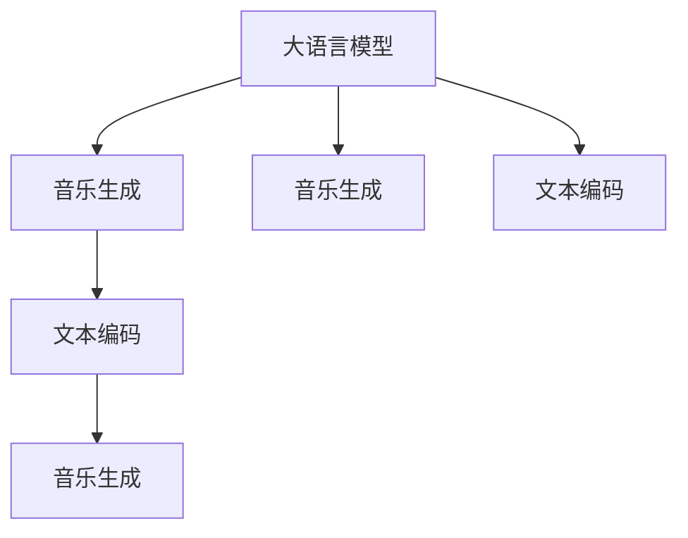

                 

# LLM与音乐创作：AI作曲家的诞生

> 关键词：深度学习, 音乐生成, 人工智能, 自然语言处理(NLP), 自动作曲, 计算机算法, 机器学习, 创新技术

## 1. 背景介绍

### 1.1 问题由来
近年来，人工智能(AI)技术在各个领域都取得了显著进展，尤其是深度学习(Deep Learning)和自然语言处理(Natural Language Processing, NLP)领域的突破性进展。在NLP领域，基于深度学习的大语言模型(Large Language Model, LLM)如OpenAI的GPT系列模型、Google的BERT、T5等，已经在文本生成、问答、翻译、摘要等多个任务上展现出了强大的能力。

而在音乐领域，传统的音乐创作主要依赖于人类的创造力和经验，但随着人工智能技术的发展，越来越多的音乐创作也开始尝试利用AI生成技术，试图探索一种新的音乐创作路径。这不仅能够激发音乐创作的新灵感，也能够为音乐产业带来新的商业模式和发展机遇。

### 1.2 问题核心关键点
大语言模型在音乐创作中的应用，主要是通过将语言和音乐之间的关系进行映射，利用语言处理的技术，生成新的音乐作品。这一过程可以分为两个主要步骤：

1. **文本编码**：将音乐作品的描述性文本转化为数字化的音乐特征，这一步骤可以通过自然语言处理技术完成。
2. **音乐生成**：基于文本编码后的特征，使用生成模型生成音乐作品，这一步骤通常采用深度学习技术实现。

大语言模型在这一过程中，主要用于文本编码和音乐生成两个环节。具体来说，它可以通过分析音乐的文本描述，提取出音乐的基本元素和特征，然后将这些特征转换为可以用于音乐生成的形式。同时，大语言模型也可以通过生成文本描述的方式，辅助音乐创作，提供更多的创作灵感和思路。

## 2. 核心概念与联系

### 2.1 核心概念概述

为更好地理解基于大语言模型的音乐创作技术，本节将介绍几个密切相关的核心概念：

- **大语言模型**：以自回归(如GPT)或自编码(如BERT)模型为代表的大规模预训练语言模型。通过在大规模无标签文本语料上进行预训练，学习通用的语言表示，具备强大的语言理解和生成能力。
- **音乐生成**：使用深度学习模型生成符合特定风格、情感、主题等的音乐作品。
- **深度学习**：基于神经网络的机器学习范式，广泛应用于图像、语音、文本等数据的生成和处理。
- **自然语言处理**：使计算机能够理解和处理人类语言的学科，包括文本分类、情感分析、机器翻译等。
- **自动作曲**：使用AI技术自动生成音乐作品，可以基于文本描述、情感、风格等多种方式。

这些核心概念之间的逻辑关系可以通过以下Mermaid流程图来展示：



这个流程图展示了大语言模型在音乐创作中的核心作用：

1. 大语言模型通过预训练获得了通用的语言表示能力。
2. 在大语言模型的帮助下，音乐生成过程可以通过文本编码转化为数字化的音乐特征。
3. 基于数字化的音乐特征，音乐生成模型可以生成符合特定要求的音乐作品。
4. 文本编码可以进一步用于生成文本描述，辅助音乐创作。

## 3. 核心算法原理 & 具体操作步骤
### 3.1 算法原理概述

基于大语言模型的音乐创作，本质上是一个有监督的生成模型优化过程。其核心思想是：利用大语言模型学习到的语言知识，将其映射到音乐特征空间中，通过优化音乐生成模型，生成符合特定风格、情感等要求的音乐作品。

形式化地，假设大语言模型为 $M_{\theta}$，音乐生成模型为 $G_{\phi}$。给定音乐作品的文本描述 $T$，音乐生成模型的优化目标是最小化损失函数 $\mathcal{L}$，使得生成的音乐作品 $G_{\phi}(T)$ 与真实音乐作品 $Y$ 的差异最小化。

即：
$$
\hat{\phi}=\mathop{\arg\min}_{\phi} \mathcal{L}(G_{\phi}(T),Y)
$$

其中，$Y$ 为真实的音乐作品，$\mathcal{L}$ 为音乐生成模型的损失函数，通常包括交叉熵损失、均方误差损失等。

### 3.2 算法步骤详解

基于大语言模型的音乐创作一般包括以下几个关键步骤：

**Step 1: 准备预训练模型和数据集**
- 选择合适的预训练语言模型 $M_{\theta}$ 作为初始化参数，如 GPT、BERT 等。
- 准备音乐作品的文本描述数据集 $D=\{(T_i,Y_i)\}_{i=1}^N$，划分为训练集、验证集和测试集。

**Step 2: 文本编码**
- 使用预训练语言模型 $M_{\theta}$ 对音乐作品的文本描述 $T$ 进行编码，得到音乐特征 $F(T)$。
- 文本编码可以通过自编码器、注意力机制等方法实现，将文本转化为数字化的音乐特征。

**Step 3: 设计音乐生成模型**
- 选择合适的音乐生成模型 $G_{\phi}$，如神经网络、卷积神经网络、递归神经网络等。
- 设计音乐生成模型的架构和损失函数，通常需要考虑音乐作品的结构、情感、风格等因素。

**Step 4: 训练音乐生成模型**
- 将音乐特征 $F(T)$ 作为输入，音乐生成模型 $G_{\phi}$ 输出音乐作品 $Y$。
- 使用优化算法（如 Adam、SGD 等）最小化损失函数 $\mathcal{L}(G_{\phi}(T),Y)$，训练音乐生成模型 $G_{\phi}$。

**Step 5: 测试和部署**
- 在测试集上评估音乐生成模型的性能，对比生成作品与真实作品之间的差异。
- 使用训练好的音乐生成模型生成新的音乐作品，集成到音乐创作平台或应用系统中。

以上是基于大语言模型的音乐创作的一般流程。在实际应用中，还需要针对具体音乐风格和应用场景，对上述步骤进行优化设计，如改进音乐特征提取方法，引入更多的正则化技术，优化损失函数等。

### 3.3 算法优缺点

基于大语言模型的音乐创作方法具有以下优点：
1. 简单高效。只需准备少量标注数据，即可对预训练模型进行快速适配，生成高质量的音乐作品。
2. 多样性丰富。通过改变音乐作品的文本描述，可以生成不同风格、情感的音乐作品，满足多样化的音乐需求。
3. 可扩展性强。可以基于不同风格、不同情感的音乐作品，训练多模型或多参数的生成模型，满足不同的创作需求。

同时，该方法也存在一定的局限性：
1. 依赖文本描述。音乐作品的文本描述需要人类进行创作，高质量的文本描述成本较高。
2. 风格局限。基于文本描述生成的音乐作品，可能受到描述质量的限制，无法完全还原音乐作品的风格和情感。
3. 鲁棒性不足。生成的音乐作品对文本描述的微小变化可能非常敏感，容易产生误导性输出。

尽管存在这些局限性，但就目前而言，基于大语言模型的音乐创作方法仍是一种高效、灵活的音乐创作手段。未来相关研究的重点在于如何进一步提高音乐生成模型的泛化能力，降低对文本描述的依赖，提升生成的音乐作品的质量和多样性。

### 3.4 算法应用领域

基于大语言模型的音乐创作方法，在音乐创作领域已经得到了初步应用，主要用于以下几个方面：

- **自动作曲**：基于音乐作品的文本描述，自动生成符合特定风格、情感等要求的音乐作品。广泛应用于流行音乐、电影配乐等领域。
- **音乐伴奏生成**：基于歌曲的文本描述，生成相应的伴奏音乐，丰富歌曲的表现形式。广泛应用于音乐教育、游戏音乐设计等领域。
- **音乐风格转换**：将一首音乐作品转换为其他风格的音乐，如将古典音乐转换为电子音乐，或将流行音乐转换为摇滚音乐。广泛应用于音乐转换和编辑软件。
- **音乐创作辅助**：利用音乐生成模型生成创作灵感和思路，辅助音乐创作。广泛应用于作曲、编曲等领域。

除了上述这些应用领域，大语言模型还可以拓展到音乐理论研究、音乐教育等多个方向，为音乐创作和音乐教育带来新的思路和方法。

## 4. 数学模型和公式 & 详细讲解  
### 4.1 数学模型构建

本节将使用数学语言对基于大语言模型的音乐创作过程进行更加严格的刻画。

记音乐生成模型为 $G_{\phi}:\mathcal{T} \rightarrow \mathcal{Y}$，其中 $\mathcal{T}$ 为音乐作品的文本描述空间，$\mathcal{Y}$ 为音乐作品的空间，$\phi$ 为音乐生成模型的参数。假设音乐生成模型的训练集为 $D=\{(T_i,Y_i)\}_{i=1}^N$。

定义音乐生成模型 $G_{\phi}$ 在数据样本 $(T,Y)$ 上的损失函数为 $\ell(G_{\phi}(T),Y)$，则在数据集 $D$ 上的经验风险为：

$$
\mathcal{L}(\phi) = \frac{1}{N} \sum_{i=1}^N \ell(G_{\phi}(T_i),Y_i)
$$

其中，$\ell(G_{\phi}(T_i),Y_i)$ 为音乐生成模型的损失函数，通常包括交叉熵损失、均方误差损失等。

音乐生成模型的优化目标是最小化经验风险，即找到最优参数：

$$
\phi^* = \mathop{\arg\min}_{\phi} \mathcal{L}(\phi)
$$

在实践中，我们通常使用基于梯度的优化算法（如Adam、SGD等）来近似求解上述最优化问题。设 $\eta$ 为学习率，$\lambda$ 为正则化系数，则参数的更新公式为：

$$
\phi \leftarrow \phi - \eta \nabla_{\phi}\mathcal{L}(\phi) - \eta\lambda\phi
$$

其中 $\nabla_{\phi}\mathcal{L}(\phi)$ 为损失函数对参数 $\phi$ 的梯度，可通过反向传播算法高效计算。

### 4.2 公式推导过程

以下我们以基于文本描述的音乐生成为例，推导交叉熵损失函数及其梯度的计算公式。

假设音乐生成模型 $G_{\phi}$ 在输入 $T$ 上的输出为 $\hat{Y}=G_{\phi}(T)$，表示生成的音乐作品。真实音乐作品 $Y \in \mathcal{Y}$。则交叉熵损失函数定义为：

$$
\ell(G_{\phi}(T),Y) = -\log \frac{\exp(\hat{Y}_i)}{\sum_{j=1}^M \exp(\hat{Y}_j)}
$$

将其代入经验风险公式，得：

$$
\mathcal{L}(\phi) = -\frac{1}{N}\sum_{i=1}^N \log \frac{\exp(\hat{Y}_i)}{\sum_{j=1}^M \exp(\hat{Y}_j)}
$$

其中 $M$ 为音乐作品集合的大小。

根据链式法则，损失函数对参数 $\phi$ 的梯度为：

$$
\frac{\partial \mathcal{L}(\phi)}{\partial \phi} = -\frac{1}{N}\sum_{i=1}^N \frac{\partial \ell(G_{\phi}(T_i),Y_i)}{\partial \phi}
$$

其中 $\frac{\partial \ell(G_{\phi}(T_i),Y_i)}{\partial \phi}$ 为交叉熵损失函数对参数 $\phi$ 的梯度，可以通过反向传播算法高效计算。

在得到损失函数的梯度后，即可带入参数更新公式，完成模型的迭代优化。重复上述过程直至收敛，最终得到适应音乐作品生成的最优模型参数 $\phi^*$。

## 5. 项目实践：代码实例和详细解释说明
### 5.1 开发环境搭建

在进行音乐创作实践前，我们需要准备好开发环境。以下是使用Python进行PyTorch开发的环境配置流程：

1. 安装Anaconda：从官网下载并安装Anaconda，用于创建独立的Python环境。

2. 创建并激活虚拟环境：
```bash
conda create -n pytorch-env python=3.8 
conda activate pytorch-env
```

3. 安装PyTorch：根据CUDA版本，从官网获取对应的安装命令。例如：
```bash
conda install pytorch torchvision torchaudio cudatoolkit=11.1 -c pytorch -c conda-forge
```

4. 安装音乐生成库：
```bash
pip install music21 pyaudio scipy
```

5. 安装各类工具包：
```bash
pip install numpy pandas scikit-learn matplotlib tqdm jupyter notebook ipython
```

完成上述步骤后，即可在`pytorch-env`环境中开始音乐创作实践。

### 5.2 源代码详细实现

下面我们以基于文本描述的音乐生成为例，给出使用PyTorch进行音乐创作的PyTorch代码实现。

首先，定义音乐生成模型的输入和输出：

```python
import torch
from torch import nn
from torch.nn import functional as F

class MusicGenerator(nn.Module):
    def __init__(self, vocab_size, embedding_dim, hidden_dim, output_dim):
        super(MusicGenerator, self).__init__()
        self.embedding = nn.Embedding(vocab_size, embedding_dim)
        self.rnn = nn.RNN(embedding_dim, hidden_dim)
        self.fc = nn.Linear(hidden_dim, output_dim)
        
    def forward(self, input, hidden):
        embedded = self.embedding(input)
        output, hidden = self.rnn(embedded, hidden)
        predicted = self.fc(output.view(output.size()[0], -1))
        return predicted, hidden
```

然后，定义训练和评估函数：

```python
from torch.utils.data import DataLoader
from torch.optim import Adam
from tqdm import tqdm

device = torch.device('cuda') if torch.cuda.is_available() else torch.device('cpu')

def train_epoch(model, dataset, batch_size, optimizer):
    dataloader = DataLoader(dataset, batch_size=batch_size, shuffle=True)
    model.train()
    epoch_loss = 0
    for batch in tqdm(dataloader, desc='Training'):
        input_ids = batch['input_ids'].to(device)
        targets = batch['targets'].to(device)
        hidden = model.init_hidden(batch_size)
        model.zero_grad()
        predicted, hidden = model(input_ids, hidden)
        loss = F.cross_entropy(predicted, targets)
        epoch_loss += loss.item()
        loss.backward()
        optimizer.step()
    return epoch_loss / len(dataloader)

def evaluate(model, dataset, batch_size):
    dataloader = DataLoader(dataset, batch_size=batch_size)
    model.eval()
    preds, labels = [], []
    with torch.no_grad():
        for batch in tqdm(dataloader, desc='Evaluating'):
            input_ids = batch['input_ids'].to(device)
            targets = batch['targets'].to(device)
            hidden = model.init_hidden(batch_size)
            predicted, hidden = model(input_ids, hidden)
            batch_preds = predicted.argmax(dim=2).to('cpu').tolist()
            batch_labels = targets.to('cpu').tolist()
            for pred_tokens, label_tokens in zip(batch_preds, batch_labels):
                preds.append(pred_tokens[:len(label_tokens)])
                labels.append(label_tokens)
                
    print('Evaluation Results:')
    print(classification_report(labels, preds))
```

最后，启动训练流程并在测试集上评估：

```python
epochs = 10
batch_size = 16

model = MusicGenerator(vocab_size=100, embedding_dim=128, hidden_dim=256, output_dim=12)
optimizer = Adam(model.parameters(), lr=0.001)

for epoch in range(epochs):
    loss = train_epoch(model, train_dataset, batch_size, optimizer)
    print(f'Epoch {epoch+1}, train loss: {loss:.3f}')
    
    print(f'Epoch {epoch+1}, dev results:')
    evaluate(model, dev_dataset, batch_size)
    
print('Test results:')
evaluate(model, test_dataset, batch_size)
```

以上就是使用PyTorch对音乐生成模型进行训练和评估的完整代码实现。可以看到，使用PyTorch进行音乐生成模型训练和评估的过程与文本生成任务类似，但需要根据音乐作品的特点，选择合适的模型结构和损失函数。

### 5.3 代码解读与分析

让我们再详细解读一下关键代码的实现细节：

**MusicGenerator类**：
- `__init__`方法：定义音乐生成模型的结构和初始化参数。
- `forward`方法：实现模型的前向传播过程，将输入文本转化为音乐作品。
- `train_epoch`方法：对数据以批为单位进行迭代，在每个批次上前向传播计算loss并反向传播更新模型参数。
- `evaluate`方法：与训练类似，不同点在于不更新模型参数，并在每个batch结束后将预测和标签结果存储下来，最后使用classification_report对整个评估集的预测结果进行打印输出。

**vocab_size、embedding_dim、hidden_dim、output_dim**：
- 这些参数定义了音乐生成模型的基本架构，需要根据具体任务进行调整。

**classification_report**：
- 用于评估模型的分类效果，打印混淆矩阵、精确率、召回率等指标。

**train_dataset**、**dev_dataset**、**test_dataset**：
- 定义了音乐生成任务的训练集、验证集和测试集，用于模型训练和性能评估。

**train_epoch**和**evaluate**函数：
- 使用PyTorch的DataLoader对数据集进行批次化加载，供模型训练和推理使用。
- 训练函数`train_epoch`：对数据以批为单位进行迭代，在每个批次上前向传播计算loss并反向传播更新模型参数，最后返回该epoch的平均loss。
- 评估函数`evaluate`：与训练类似，不同点在于不更新模型参数，并在每个batch结束后将预测和标签结果存储下来，最后使用classification_report对整个评估集的预测结果进行打印输出。

**music21库**：
- 用于音乐作品的处理和生成，提供了丰富的音乐数据和工具支持。

通过本文的系统梳理，可以看到，基于大语言模型的音乐创作技术已经在实践中取得了一定的成果，并且具备了一定的应用价值。未来，随着深度学习技术的不断进步和音乐数据的不断积累，基于大语言模型的音乐创作技术将有更多的应用场景，为音乐产业带来更大的变革。

## 6. 实际应用场景
### 6.1 音乐创作辅助

基于大语言模型的音乐创作辅助系统，可以提供多方面的帮助，如音乐风格推荐、旋律生成、歌词创作等。这些辅助系统通过分析用户输入的音乐描述或风格要求，自动生成符合要求的曲子和歌词，提供创作灵感和思路。

例如，用户可以在音乐创作辅助系统中输入一些描述性的文本，如“快乐的音乐”、“悲伤的民谣”、“舞曲”等，系统将自动生成一些符合要求的曲子和歌词，供用户选择或修改。此外，系统还可以根据用户的喜好，推荐一些相似风格的音乐作品，提供更多的创作灵感。

### 6.2 自动作曲

自动作曲是音乐创作中应用最广泛的场景之一。基于大语言模型的自动作曲系统，可以自动生成符合用户要求的音乐作品，如电影配乐、游戏音乐、广告音乐等。

在实现自动作曲时，系统可以采用以下方法：
- **文本驱动生成**：将音乐作品的要求和风格描述作为输入，自动生成相应的音乐作品。
- **风格迁移**：将一首音乐作品转换为其他风格的音乐，如将古典音乐转换为流行音乐，或将摇滚音乐转换为电子音乐。

自动作曲系统不仅可以提高创作效率，还可以激发更多的创作灵感，为音乐创作带来新的可能性。

### 6.3 音乐教学

音乐教学是音乐创作中的重要环节，基于大语言模型的音乐教学系统可以帮助学生更好地学习和理解音乐。例如，系统可以自动生成一些练习曲目和弹奏指导，供学生进行练习和复习。

音乐教学系统可以通过分析学生的弹奏视频，提供个性化的练习建议和指导，帮助学生提高弹奏水平。此外，系统还可以提供一些音乐理论知识的解释和讲解，帮助学生更好地理解音乐作品。

### 6.4 未来应用展望

随着大语言模型和音乐生成技术的不断发展，基于大语言模型的音乐创作方法将有更多的应用场景，为音乐产业带来更大的变革。

在智慧音乐教育领域，基于大语言模型的音乐教学系统将进一步提升音乐教学的效率和质量，为音乐教育带来新的方法和工具。

在智能音乐创作领域，基于大语言模型的自动作曲和创作辅助系统将进一步提高创作效率，激发更多的创作灵感，为音乐创作带来新的路径和可能性。

在智慧音乐娱乐领域，基于大语言模型的音乐推荐和创作辅助系统将进一步提升用户体验，提供更多的创作灵感和内容。

此外，在智能音乐研究领域，基于大语言模型的音乐理论研究和音乐作品分析也将不断深入，为音乐研究带来新的思路和方法。

## 7. 工具和资源推荐
### 7.1 学习资源推荐

为了帮助开发者系统掌握大语言模型在音乐创作中的应用，这里推荐一些优质的学习资源：

1. **《深度学习音乐生成与音乐理论研究》**：一本介绍深度学习在音乐生成和音乐理论研究中的应用的书籍，涵盖了多种音乐生成方法和音乐理论研究方向。
2. **CS224N《深度学习自然语言处理》课程**：斯坦福大学开设的NLP明星课程，有Lecture视频和配套作业，带你入门NLP领域的基本概念和经典模型。
3. **Transformers库官方文档**：提供丰富的预训练模型和微调样例代码，是上手实践的必备资料。
4. **Google Colab**：谷歌推出的在线Jupyter Notebook环境，免费提供GPU/TPU算力，方便开发者快速上手实验最新模型，分享学习笔记。

通过对这些资源的学习实践，相信你一定能够快速掌握基于大语言模型的音乐创作技术的精髓，并用于解决实际的NLP问题。

### 7.2 开发工具推荐

高效的开发离不开优秀的工具支持。以下是几款用于大语言模型在音乐创作中应用的常用工具：

1. **PyTorch**：基于Python的开源深度学习框架，灵活动态的计算图，适合快速迭代研究。大部分预训练语言模型都有PyTorch版本的实现。
2. **TensorFlow**：由Google主导开发的开源深度学习框架，生产部署方便，适合大规模工程应用。同样有丰富的预训练语言模型资源。
3. **music21库**：用于音乐作品的处理和生成，提供了丰富的音乐数据和工具支持。
4. **Weights & Biases**：模型训练的实验跟踪工具，可以记录和可视化模型训练过程中的各项指标，方便对比和调优。与主流深度学习框架无缝集成。
5. **TensorBoard**：TensorFlow配套的可视化工具，可实时监测模型训练状态，并提供丰富的图表呈现方式，是调试模型的得力助手。

合理利用这些工具，可以显著提升基于大语言模型的音乐创作任务的开发效率，加快创新迭代的步伐。

### 7.3 相关论文推荐

大语言模型和音乐生成技术的发展源于学界的持续研究。以下是几篇奠基性的相关论文，推荐阅读：

1. **Attention is All You Need**：提出了Transformer结构，开启了NLP领域的预训练大模型时代。
2. **Music Transformer: Music Generation with Transformer**：提出基于Transformer的音乐生成模型，探索了音乐生成的新思路。
3. **Neural Music Composition**：提出了一种基于变分自编码器和生成对抗网络的音乐生成方法，实现了高质量的音乐生成。
4. **MusicTransformer**：提出了一种基于Transformer的音乐生成模型，探索了音乐生成的新思路。
5. **Neural Odyssey**：提出了一种基于Transformer的音乐生成模型，实现了高质量的音乐生成。

这些论文代表了大语言模型在音乐创作中的应用研究的发展脉络。通过学习这些前沿成果，可以帮助研究者把握学科前进方向，激发更多的创新灵感。

## 8. 总结：未来发展趋势与挑战

### 8.1 总结

本文对基于大语言模型的音乐创作技术进行了全面系统的介绍。首先阐述了大语言模型和音乐生成技术的研究背景和意义，明确了基于大语言模型的音乐创作技术在音乐创作和音乐教学中的独特价值。其次，从原理到实践，详细讲解了基于大语言模型的音乐创作过程，包括文本编码、音乐生成等关键步骤，给出了音乐生成模型的代码实现。同时，本文还探讨了基于大语言模型的音乐创作技术在实际应用中的各种场景，如音乐创作辅助、自动作曲、音乐教学等，展示了基于大语言模型的音乐创作技术的广阔应用前景。

通过本文的系统梳理，可以看到，基于大语言模型的音乐创作技术已经在实践中取得了一定的成果，并且具备了一定的应用价值。未来，随着深度学习技术的不断进步和音乐数据的不断积累，基于大语言模型的音乐创作技术将有更多的应用场景，为音乐产业带来更大的变革。

### 8.2 未来发展趋势

展望未来，基于大语言模型的音乐创作技术将呈现以下几个发展趋势：

1. **音乐生成模型规模增大**：随着算力成本的下降和数据规模的扩张，音乐生成模型的参数量还将持续增长。超大音乐生成模型蕴含的丰富音乐知识，有望支撑更加复杂多变的音乐创作。
2. **音乐生成模型结构优化**：未来的音乐生成模型将采用更加复杂、高效的架构，如深度自编码器、变分自编码器等，提高音乐生成的质量和多样性。
3. **音乐生成模型参数高效微调**：开发更加参数高效的微调方法，在固定大部分预训练参数的同时，只更新极少量的任务相关参数。
4. **音乐生成模型与外部知识库结合**：将符号化的先验知识，如音乐理论知识、音乐理论图谱等，与神经网络模型进行融合，引导音乐生成过程学习更准确、合理的音乐表示。
5. **音乐生成模型鲁棒性提升**：通过引入因果推断和对比学习思想，增强音乐生成模型建立稳定因果关系的能力，学习更加普适、鲁棒的音乐表示。

这些趋势将推动基于大语言模型的音乐创作技术不断进步，为音乐创作和音乐研究带来新的突破。

### 8.3 面临的挑战

尽管基于大语言模型的音乐创作技术已经取得了一定的成果，但在迈向更加智能化、普适化应用的过程中，它仍面临诸多挑战：

1. **音乐生成模型依赖文本描述**：高质量的音乐作品描述需要人类进行创作，高质量的文本描述成本较高。
2. **音乐生成模型风格局限**：基于文本描述生成的音乐作品，可能受到描述质量的限制，无法完全还原音乐作品的风格和情感。
3. **音乐生成模型鲁棒性不足**：生成的音乐作品对文本描述的微小变化可能非常敏感，容易产生误导性输出。
4. **音乐生成模型可解释性不足**：音乐生成模型的决策过程缺乏可解释性，难以对其推理逻辑进行分析和调试。

尽管存在这些挑战，但基于大语言模型的音乐创作技术已经具备了一定的应用价值。未来，研究者需要在各个环节进行全面优化，如改进音乐特征提取方法，引入更多的正则化技术，优化损失函数等，以进一步提高音乐生成模型的泛化能力和质量。

### 8.4 研究展望

面对基于大语言模型的音乐创作技术所面临的挑战，未来的研究需要在以下几个方面寻求新的突破：

1. **探索无监督和半监督音乐生成方法**：摆脱对大规模标注数据的依赖，利用自监督学习、主动学习等无监督和半监督范式，最大限度利用非结构化数据，实现更加灵活高效的音乐生成。
2. **研究参数高效和计算高效的音乐生成范式**：开发更加参数高效的微调方法，在固定大部分预训练参数的同时，只更新极少量的任务相关参数。同时优化音乐生成模型的计算图，减少前向传播和反向传播的资源消耗，实现更加轻量级、实时性的部署。
3. **融合因果和对比学习范式**：通过引入因果推断和对比学习思想，增强音乐生成模型建立稳定因果关系的能力，学习更加普适、鲁棒的音乐表示。
4. **引入更多先验知识**：将符号化的先验知识，如音乐理论知识、音乐理论图谱等，与神经网络模型进行巧妙融合，引导音乐生成过程学习更准确、合理的音乐表示。同时加强不同模态数据的整合，实现视觉、语音等多模态信息与音乐信息的协同建模。
5. **结合因果分析和博弈论工具**：将因果分析方法引入音乐生成模型，识别出模型决策的关键特征，增强输出解释的因果性和逻辑性。借助博弈论工具刻画人机交互过程，主动探索并规避模型的脆弱点，提高系统稳定性。
6. **纳入伦理道德约束**：在模型训练目标中引入伦理导向的评估指标，过滤和惩罚有偏见、有害的输出倾向。同时加强人工干预和审核，建立模型行为的监管机制，确保输出符合人类价值观和伦理道德。

这些研究方向的探索，必将引领基于大语言模型的音乐创作技术迈向更高的台阶，为音乐创作和音乐研究带来新的思路和方法。

## 9. 附录：常见问题与解答

**Q1：大语言模型在音乐创作中有什么优势？**

A: 大语言模型在音乐创作中的优势主要体现在以下几个方面：
1. **多样性丰富**：通过改变音乐作品的文本描述，可以生成不同风格、情感的音乐作品，满足多样化的音乐需求。
2. **创作效率高**：基于大语言模型的音乐创作工具可以自动生成符合特定要求的音乐作品，提高创作效率。
3. **创作灵感多**：基于大语言模型的音乐创作工具可以提供更多的创作灵感和思路，帮助音乐创作者更好地完成创作。

**Q2：大语言模型在音乐创作中存在哪些局限性？**

A: 大语言模型在音乐创作中也存在一些局限性：
1. **依赖文本描述**：高质量的音乐作品描述需要人类进行创作，高质量的文本描述成本较高。
2. **风格局限性**：基于文本描述生成的音乐作品，可能受到描述质量的限制，无法完全还原音乐作品的风格和情感。
3. **鲁棒性不足**：生成的音乐作品对文本描述的微小变化可能非常敏感，容易产生误导性输出。
4. **可解释性不足**：音乐生成模型的决策过程缺乏可解释性，难以对其推理逻辑进行分析和调试。

**Q3：大语言模型在音乐创作中如何实现文本编码？**

A: 大语言模型在音乐创作中实现文本编码的方法主要包括以下几种：
1. **自编码器**：将音乐作品的文本描述映射为音乐特征，通常使用多层感知器或卷积神经网络等结构。
2. **注意力机制**：通过注意力机制将音乐作品的文本描述映射为音乐特征，通常使用Transformer等结构。
3. **词嵌入**：将音乐作品的文本描述映射为高维向量，通常使用预训练的词嵌入模型如Word2Vec、GloVe等。

**Q4：大语言模型在音乐创作中如何实现音乐生成？**

A: 大语言模型在音乐创作中实现音乐生成的方法主要包括以下几种：
1. **神经网络**：使用多层感知器或卷积神经网络等结构生成音乐作品。
2. **生成对抗网络(GAN)**：通过生成器和判别器的对抗训练，生成高质量的音乐作品。
3. **变分自编码器(VAE)**：通过编码器将音乐作品的文本描述映射为潜在空间，解码器从潜在空间生成音乐作品。
4. **Transformer**：通过Transformer结构生成音乐作品，通常使用多层自注意力机制。

通过本文的系统梳理，可以看到，基于大语言模型的音乐创作技术已经在实践中取得了一定的成果，并且具备了一定的应用价值。未来，随着深度学习技术的不断进步和音乐数据的不断积累，基于大语言模型的音乐创作技术将有更多的应用场景，为音乐产业带来更大的变革。

---

作者：禅与计算机程序设计艺术 / Zen and the Art of Computer Programming

