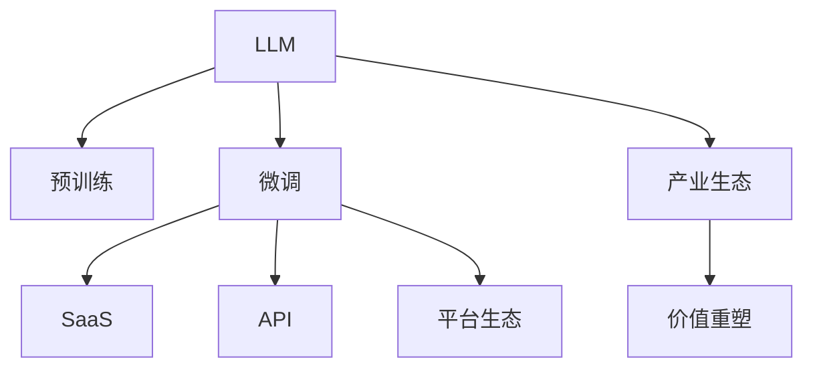

                 

# LLM产业链:AI价值重塑的新机遇

> 关键词：大规模语言模型(LLM)、产业生态、价值重塑、技术创新、应用场景、商业化路径

## 1. 背景介绍

### 1.1 问题由来
近年来，随着人工智能技术的快速发展和深度学习的突破，大规模语言模型(LLM)在自然语言处理(NLP)、机器翻译、文本生成等领域取得了显著进展。LLM通过在大规模无标签文本数据上进行预训练，学习了丰富的语言知识和常识，具备强大的自然语言理解与生成能力。其典型代表包括OpenAI的GPT系列模型、Google的BERT、T5等。

然而，尽管LLM在技术上取得了巨大成功，但在商业化应用中仍面临诸多挑战。如何将其转化为可行的商业产品，并实现大规模落地，成为行业关注的焦点。本文将探讨LLM的产业链布局及其在AI价值重塑中的新机遇。

### 1.2 问题核心关键点
LLM产业链的建设涉及技术研发、市场推广、商业变现等多个环节，其核心关键点包括：

1. **技术创新**：持续提升模型性能，探索新算法、新架构、新应用场景，提升产品竞争力。
2. **商业变现**：通过多样化的商业化策略，如SaaS、API、平台生态等，实现LLM价值的最大化。
3. **生态建设**：构建开放的生态系统，吸引开发者、合作伙伴、用户，共同推动LLM技术的普及和应用。
4. **价值重塑**：结合LLM技术，重新定义行业标准、应用模式、用户需求，创造新的市场需求和价值。

## 2. 核心概念与联系

### 2.1 核心概念概述

为更好地理解LLM产业链及其与AI价值重塑的关系，本节将介绍几个关键概念：

- **大规模语言模型(LLM)**：以自回归(如GPT)或自编码(如BERT)模型为代表的大规模预训练语言模型。通过在大规模无标签文本语料上进行预训练，学习通用的语言表示，具备强大的语言理解和生成能力。
- **预训练(Pre-training)**：指在大规模无标签文本语料上，通过自监督学习任务训练通用语言模型的过程。常见的预训练任务包括言语建模、遮挡语言模型等。
- **微调(Fine-tuning)**：指在预训练模型的基础上，使用下游任务的少量标注数据，通过有监督地训练来优化模型在特定任务上的性能。
- **产业生态**：由技术开发者、合作伙伴、用户、监管机构等共同构成的生态系统，影响着LLM的商业化进程和价值实现。
- **商业化路径**：将LLM技术转化为商业产品的路径和方法，包括SaaS、API、平台生态等。
- **价值重塑**：通过LLM技术的应用，重新定义和优化现有的商业模式、应用场景、用户体验，创造新的商业价值。

这些概念之间的逻辑关系可以通过以下Mermaid流程图来展示：



这个流程图展示了LLM的核心概念及其之间的关系：

1. LLM通过预训练获得基础能力。
2. 微调使得模型具备针对特定任务的能力，可适配于不同的应用场景。
3. SaaS、API等商业化路径将LLM转化为可用的商业产品和服务。
4. 平台生态为开发者、用户等提供工具、支持，促进LLM技术的普及。
5. 产业生态构建了LLM技术的市场环境，推动了其商业化和价值实现。
6. 价值重塑体现在LLM技术的广泛应用和创新带来的新商业模式的涌现。

## 3. 核心算法原理 & 具体操作步骤
### 3.1 算法原理概述

LLM产业链的建设不仅依赖于模型的技术创新，还需要考虑其商业化和应用推广。因此，本文将重点介绍LLM的算法原理和操作步骤。

### 3.2 算法步骤详解

#### 3.2.1 技术研发

**Step 1: 确定商业化方向**
- 调研市场需求和用户痛点，确定LLM在特定领域的应用方向。
- 分析现有技术优势和潜在风险，评估商业化的可行性。

**Step 2: 模型选择与定制**
- 根据商业化需求，选择适合的预训练模型或进行自定义模型设计。
- 根据应用场景，定制模型架构，优化性能和资源消耗。

**Step 3: 数据收集与处理**
- 收集并清洗用于微调和评估的数据集，确保数据的质量和多样性。
- 进行数据增强，丰富训练样本，提高模型泛化能力。

**Step 4: 模型微调**
- 选择合适的微调方法，如全参数微调、参数高效微调等。
- 设置合适的超参数，包括学习率、批大小、迭代轮数等。
- 进行模型训练和评估，优化模型性能。

**Step 5: 性能测试与优化**
- 在独立测试集上测试模型性能，评估模型泛化能力。
- 根据测试结果，进行模型微调，提升模型效果。

#### 3.2.2 市场推广

**Step 1: 制定营销策略**
- 根据目标市场和用户需求，制定营销策略，包括定位、定价、渠道等。
- 利用社交媒体、技术博客、行业会议等渠道进行宣传推广。

**Step 2: 构建用户社区**
- 建立用户社区，吸引开发者、合作伙伴和用户参与。
- 提供技术支持、案例分享、开发者文档等资源，提升用户黏性。

**Step 3: 合作伙伴关系**
- 寻找行业合作伙伴，建立生态系统。
- 合作开发定制化解决方案，扩展应用场景。

**Step 4: 客户反馈与优化**
- 收集用户反馈，了解实际使用中的问题。
- 根据反馈进行模型优化和改进，提升用户体验。

#### 3.2.3 商业变现

**Step 1: 产品化**
- 将微调后的模型封装为产品，如SaaS、API等。
- 设计友好的用户界面，降低使用门槛。

**Step 2: 定价策略**
- 根据市场需求和成本，制定合理的价格策略。
- 考虑按需付费、订阅制等不同模式，灵活定价。

**Step 3: 用户获取与留存**
- 通过免费试用、邀请推荐等方式获取用户。
- 提供增值服务，提升用户黏性和留存率。

### 3.3 算法优缺点

#### 3.3.1 技术研发

**优点**：
1. **灵活性高**：可以根据具体应用场景和用户需求，灵活调整模型架构和参数。
2. **性能优异**：通过微调，可以显著提升模型在特定任务上的表现。
3. **快速迭代**：新算法、新架构的出现，可以迅速应用到现有模型中。

**缺点**：
1. **资源消耗高**：大规模预训练模型和微调过程对算力和内存要求较高。
2. **训练时间长**：特别是在数据集较大时，训练时间较长。
3. **成本高昂**：数据收集和模型微调所需的时间和人力成本较高。

#### 3.3.2 市场推广

**优点**：
1. **用户基础大**：通过构建生态系统和社区，可以吸引大量用户参与。
2. **市场响应快**：可以迅速调整营销策略，灵活应对市场变化。
3. **品牌效应强**：知名技术公司往往拥有较强的品牌影响力和用户信任度。

**缺点**：
1. **市场竞争激烈**：NLP领域竞争激烈，产品差异化难度较大。
2. **用户需求多变**：不同用户需求各异，产品需要频繁迭代。
3. **市场推广成本高**：需要投入大量资源进行推广和营销。

#### 3.3.3 商业变现

**优点**：
1. **模式多样**：通过SaaS、API、平台生态等多样化的商业化路径，最大化LLM价值。
2. **用户获取快**：快速生成产品和方案，吸引用户。
3. **收入稳定**：通过按需付费、订阅制等模式，实现收入稳定增长。

**缺点**：
1. **市场适应性差**：不同行业和应用场景需求差异较大，需要定制化解决方案。
2. **服务质量控制**：如何保证产品质量和用户体验，是商业变现中的重要挑战。
3. **价格敏感度高**：用户对价格的敏感度较高，定价策略需要精准平衡。

### 3.4 算法应用领域

LLM产业链涉及的领域广泛，以下列举几个典型应用：

1. **自然语言处理(NLP)**：文本分类、情感分析、命名实体识别、机器翻译、文本摘要等。
2. **智能客服**：智能问答、用户引导、故障诊断等。
3. **医疗健康**：病历分析、药物研发、健康咨询等。
4. **金融服务**：风险评估、舆情监测、智能投顾等。
5. **教育培训**：智能批改、学情分析、知识推荐等。
6. **智能家居**：语音识别、自然语言交互、内容生成等。

## 4. 数学模型和公式 & 详细讲解  
### 4.1 数学模型构建

#### 4.1.1 预训练模型

预训练模型通常基于Transformer架构，通过在大量无标签文本数据上进行自监督训练，学习语言表示。以BERT为例，其预训练任务包括掩码语言模型(Masked Language Model, MLM)和下一句预测(Next Sentence Prediction, NSP)。预训练模型的训练目标最小化预测误差，即：

$$
\min_{\theta} \mathcal{L}(\theta, D) = \mathcal{L}_{MLM}(\theta, D) + \mathcal{L}_{NSP}(\theta, D)
$$

其中 $D$ 为训练数据集，$\mathcal{L}_{MLM}$ 和 $\mathcal{L}_{NSP}$ 分别为掩码语言模型和下一句预测的损失函数。

#### 4.1.2 微调模型

微调模型在预训练模型的基础上，通过下游任务的少量标注数据进行有监督学习。以二分类任务为例，假设模型在输入 $x$ 上的输出为 $\hat{y}=M_{\theta}(x) \in [0,1]$，则二分类交叉熵损失函数定义为：

$$
\ell(M_{\theta}(x),y) = -[y\log \hat{y} + (1-y)\log (1-\hat{y})]
$$

微调的目标是最小化经验风险，即：

$$
\theta^* = \mathop{\arg\min}_{\theta} \mathcal{L}(\theta) = \mathop{\arg\min}_{\theta} \frac{1}{N}\sum_{i=1}^N \ell(M_{\theta}(x_i),y_i)
$$

### 4.2 公式推导过程

#### 4.2.1 预训练模型推导

BERT模型的预训练任务包括掩码语言模型和下一句预测。以掩码语言模型为例，其训练目标是在掩码位置填充正确单词，即：

$$
\min_{\theta} \mathcal{L}_{MLM}(\theta, D) = -\frac{1}{N}\sum_{i=1}^N \log P(x_i^{[mask]})
$$

其中 $x_i^{[mask]}$ 为输入文本中用掩码符号标记的位置，$P$ 为模型在该位置上输出正确单词的概率。

#### 4.2.2 微调模型推导

以二分类任务为例，模型在输入 $x$ 上的输出为 $\hat{y}=M_{\theta}(x) \in [0,1]$，则二分类交叉熵损失函数为：

$$
\ell(M_{\theta}(x),y) = -[y\log \hat{y} + (1-y)\log (1-\hat{y})]
$$

微调的目标是最小化经验风险，即：

$$
\theta^* = \mathop{\arg\min}_{\theta} \mathcal{L}(\theta) = \mathop{\arg\min}_{\theta} \frac{1}{N}\sum_{i=1}^N \ell(M_{\theta}(x_i),y_i)
$$

其中 $x_i$ 为输入文本，$y_i$ 为标注标签。

### 4.3 案例分析与讲解

#### 4.3.1 实例分析

以智能客服为例，假设目标是训练一个智能问答系统，用于解答客户的常见问题。可以收集历史客服对话记录，标注问题和答案，作为微调数据集。微调模型的输入为客户的提问，输出为最合适的答案。

#### 4.3.2 实现步骤

1. **数据准备**：收集历史对话记录，标注问题和答案，划分为训练集、验证集和测试集。
2. **模型选择**：选择BERT作为预训练模型，作为微调的初始参数。
3. **模型微调**：在训练集上微调模型，最小化二分类交叉熵损失。
4. **模型评估**：在验证集上评估模型性能，根据评估结果调整超参数。
5. **模型部署**：将微调后的模型部署到客服系统中，实时解答客户问题。

## 5. 项目实践：代码实例和详细解释说明
### 5.1 开发环境搭建

在进行LLM产业链开发前，需要准备好开发环境。以下是使用Python进行PyTorch开发的环境配置流程：

1. 安装Anaconda：从官网下载并安装Anaconda，用于创建独立的Python环境。

2. 创建并激活虚拟环境：
```bash
conda create -n pytorch-env python=3.8 
conda activate pytorch-env
```

3. 安装PyTorch：根据CUDA版本，从官网获取对应的安装命令。例如：
```bash
conda install pytorch torchvision torchaudio cudatoolkit=11.1 -c pytorch -c conda-forge
```

4. 安装Transformers库：
```bash
pip install transformers
```

5. 安装各类工具包：
```bash
pip install numpy pandas scikit-learn matplotlib tqdm jupyter notebook ipython
```

完成上述步骤后，即可在`pytorch-env`环境中开始项目开发。

### 5.2 源代码详细实现

这里我们以智能客服系统的构建为例，给出使用Transformers库对BERT模型进行微调的PyTorch代码实现。

首先，定义智能客服任务的输入和输出：

```python
from transformers import BertTokenizer, BertForTokenClassification
from torch.utils.data import Dataset

class ChatDataset(Dataset):
    def __init__(self, texts, labels):
        self.texts = texts
        self.labels = labels
        self.tokenizer = BertTokenizer.from_pretrained('bert-base-cased')

    def __len__(self):
        return len(self.texts)

    def __getitem__(self, item):
        text = self.texts[item]
        label = self.labels[item]

        encoding = self.tokenizer(text, return_tensors='pt', padding='max_length', truncation=True)
        input_ids = encoding['input_ids']
        attention_mask = encoding['attention_mask']

        return {'input_ids': input_ids, 
                'attention_mask': attention_mask,
                'labels': torch.tensor(label, dtype=torch.long)}
```

然后，定义模型和优化器：

```python
model = BertForTokenClassification.from_pretrained('bert-base-cased', num_labels=2)

optimizer = AdamW(model.parameters(), lr=2e-5)
```

接着，定义训练和评估函数：

```python
from torch.utils.data import DataLoader
from tqdm import tqdm
from sklearn.metrics import accuracy_score

device = torch.device('cuda') if torch.cuda.is_available() else torch.device('cpu')
model.to(device)

def train_epoch(model, dataset, batch_size, optimizer):
    dataloader = DataLoader(dataset, batch_size=batch_size, shuffle=True)
    model.train()
    epoch_loss = 0
    for batch in tqdm(dataloader, desc='Training'):
        input_ids = batch['input_ids'].to(device)
        attention_mask = batch['attention_mask'].to(device)
        labels = batch['labels'].to(device)
        model.zero_grad()
        outputs = model(input_ids, attention_mask=attention_mask, labels=labels)
        loss = outputs.loss
        epoch_loss += loss.item()
        loss.backward()
        optimizer.step()
    return epoch_loss / len(dataloader)

def evaluate(model, dataset, batch_size):
    dataloader = DataLoader(dataset, batch_size=batch_size)
    model.eval()
    preds, labels = [], []
    with torch.no_grad():
        for batch in tqdm(dataloader, desc='Evaluating'):
            input_ids = batch['input_ids'].to(device)
            attention_mask = batch['attention_mask'].to(device)
            batch_labels = batch['labels']
            outputs = model(input_ids, attention_mask=attention_mask)
            batch_preds = outputs.logits.argmax(dim=2).to('cpu').tolist()
            batch_labels = batch_labels.to('cpu').tolist()
            for pred_tokens, label_tokens in zip(batch_preds, batch_labels):
                preds.append(pred_tokens[:len(label_tokens)])
                labels.append(label_tokens)

    return accuracy_score(labels, preds)
```

最后，启动训练流程并在测试集上评估：

```python
epochs = 5
batch_size = 16

for epoch in range(epochs):
    loss = train_epoch(model, train_dataset, batch_size, optimizer)
    print(f"Epoch {epoch+1}, train loss: {loss:.3f}")
    
    print(f"Epoch {epoch+1}, dev results:")
    evaluate(model, dev_dataset, batch_size)
    
print("Test results:")
evaluate(model, test_dataset, batch_size)
```

以上就是使用PyTorch对BERT进行智能客服系统微调的完整代码实现。可以看到，得益于Transformers库的强大封装，我们可以用相对简洁的代码完成BERT模型的加载和微调。

### 5.3 代码解读与分析

让我们再详细解读一下关键代码的实现细节：

**ChatDataset类**：
- `__init__`方法：初始化文本、标签、分词器等关键组件。
- `__len__`方法：返回数据集的样本数量。
- `__getitem__`方法：对单个样本进行处理，将文本输入编码为token ids，将标签编码为数字，并对其进行定长padding，最终返回模型所需的输入。

**model和optimizer定义**：
- 选择BERT作为预训练模型，设置标签数为2。
- 定义AdamW优化器，设置学习率为2e-5。

**训练和评估函数**：
- 使用PyTorch的DataLoader对数据集进行批次化加载，供模型训练和推理使用。
- 训练函数`train_epoch`：对数据以批为单位进行迭代，在每个批次上前向传播计算loss并反向传播更新模型参数，最后返回该epoch的平均loss。
- 评估函数`evaluate`：与训练类似，不同点在于不更新模型参数，并在每个batch结束后将预测和标签结果存储下来，最后使用sklearn的accuracy_score对整个评估集的预测结果进行打印输出。

**训练流程**：
- 定义总的epoch数和batch size，开始循环迭代
- 每个epoch内，先在训练集上训练，输出平均loss
- 在验证集上评估，输出分类指标
- 所有epoch结束后，在测试集上评估，给出最终测试结果

可以看到，PyTorch配合Transformers库使得BERT微调的代码实现变得简洁高效。开发者可以将更多精力放在数据处理、模型改进等高层逻辑上，而不必过多关注底层的实现细节。

当然，工业级的系统实现还需考虑更多因素，如模型的保存和部署、超参数的自动搜索、更灵活的任务适配层等。但核心的微调范式基本与此类似。

## 6. 实际应用场景
### 6.1 智能客服系统

基于大语言模型微调的对话技术，可以广泛应用于智能客服系统的构建。传统客服往往需要配备大量人力，高峰期响应缓慢，且一致性和专业性难以保证。而使用微调后的对话模型，可以7x24小时不间断服务，快速响应客户咨询，用自然流畅的语言解答各类常见问题。

在技术实现上，可以收集企业内部的历史客服对话记录，将问题和最佳答复构建成监督数据，在此基础上对预训练对话模型进行微调。微调后的对话模型能够自动理解用户意图，匹配最合适的答案模板进行回复。对于客户提出的新问题，还可以接入检索系统实时搜索相关内容，动态组织生成回答。如此构建的智能客服系统，能大幅提升客户咨询体验和问题解决效率。

### 6.2 金融舆情监测

金融机构需要实时监测市场舆论动向，以便及时应对负面信息传播，规避金融风险。传统的人工监测方式成本高、效率低，难以应对网络时代海量信息爆发的挑战。基于大语言模型微调的文本分类和情感分析技术，为金融舆情监测提供了新的解决方案。

具体而言，可以收集金融领域相关的新闻、报道、评论等文本数据，并对其进行主题标注和情感标注。在此基础上对预训练语言模型进行微调，使其能够自动判断文本属于何种主题，情感倾向是正面、中性还是负面。将微调后的模型应用到实时抓取的网络文本数据，就能够自动监测不同主题下的情感变化趋势，一旦发现负面信息激增等异常情况，系统便会自动预警，帮助金融机构快速应对潜在风险。

### 6.3 个性化推荐系统

当前的推荐系统往往只依赖用户的历史行为数据进行物品推荐，无法深入理解用户的真实兴趣偏好。基于大语言模型微调技术，个性化推荐系统可以更好地挖掘用户行为背后的语义信息，从而提供更精准、多样的推荐内容。

在实践中，可以收集用户浏览、点击、评论、分享等行为数据，提取和用户交互的物品标题、描述、标签等文本内容。将文本内容作为模型输入，用户的后续行为（如是否点击、购买等）作为监督信号，在此基础上微调预训练语言模型。微调后的模型能够从文本内容中准确把握用户的兴趣点。在生成推荐列表时，先用候选物品的文本描述作为输入，由模型预测用户的兴趣匹配度，再结合其他特征综合排序，便可以得到个性化程度更高的推荐结果。

### 6.4 未来应用展望

随着大语言模型微调技术的发展，其在更多领域的应用前景将更加广阔。

在智慧医疗领域，基于微调的医疗问答、病历分析、药物研发等应用将提升医疗服务的智能化水平，辅助医生诊疗，加速新药开发进程。

在智能教育领域，微调技术可应用于作业批改、学情分析、知识推荐等方面，因材施教，促进教育公平，提高教学质量。

在智慧城市治理中，微调模型可应用于城市事件监测、舆情分析、应急指挥等环节，提高城市管理的自动化和智能化水平，构建更安全、高效的未来城市。

此外，在企业生产、社会治理、文娱传媒等众多领域，基于大模型微调的人工智能应用也将不断涌现，为经济社会发展注入新的动力。相信随着技术的日益成熟，微调方法将成为人工智能落地应用的重要范式，推动人工智能技术在垂直行业的规模化落地。

## 7. 工具和资源推荐
### 7.1 学习资源推荐

为了帮助开发者系统掌握LLM产业链的理论基础和实践技巧，这里推荐一些优质的学习资源：

1. 《Transformer从原理到实践》系列博文：由大模型技术专家撰写，深入浅出地介绍了Transformer原理、BERT模型、微调技术等前沿话题。

2. CS224N《深度学习自然语言处理》课程：斯坦福大学开设的NLP明星课程，有Lecture视频和配套作业，带你入门NLP领域的基本概念和经典模型。

3. 《Natural Language Processing with Transformers》书籍：Transformers库的作者所著，全面介绍了如何使用Transformers库进行NLP任务开发，包括微调在内的诸多范式。

4. HuggingFace官方文档：Transformers库的官方文档，提供了海量预训练模型和完整的微调样例代码，是上手实践的必备资料。

5. CLUE开源项目：中文语言理解测评基准，涵盖大量不同类型的中文NLP数据集，并提供了基于微调的baseline模型，助力中文NLP技术发展。

通过对这些资源的学习实践，相信你一定能够快速掌握LLM微调的精髓，并用于解决实际的NLP问题。
###  7.2 开发工具推荐

高效的开发离不开优秀的工具支持。以下是几款用于LLM微调开发的常用工具：

1. PyTorch：基于Python的开源深度学习框架，灵活动态的计算图，适合快速迭代研究。大部分预训练语言模型都有PyTorch版本的实现。

2. TensorFlow：由Google主导开发的开源深度学习框架，生产部署方便，适合大规模工程应用。同样有丰富的预训练语言模型资源。

3. Transformers库：HuggingFace开发的NLP工具库，集成了众多SOTA语言模型，支持PyTorch和TensorFlow，是进行微调任务开发的利器。

4. Weights & Biases：模型训练的实验跟踪工具，可以记录和可视化模型训练过程中的各项指标，方便对比和调优。与主流深度学习框架无缝集成。

5. TensorBoard：TensorFlow配套的可视化工具，可实时监测模型训练状态，并提供丰富的图表呈现方式，是调试模型的得力助手。

6. Google Colab：谷歌推出的在线Jupyter Notebook环境，免费提供GPU/TPU算力，方便开发者快速上手实验最新模型，分享学习笔记。

合理利用这些工具，可以显著提升LLM微调的开发效率，加快创新迭代的步伐。

### 7.3 相关论文推荐

大语言模型和微调技术的发展源于学界的持续研究。以下是几篇奠基性的相关论文，推荐阅读：

1. Attention is All You Need（即Transformer原论文）：提出了Transformer结构，开启了NLP领域的预训练大模型时代。

2. BERT: Pre-training of Deep Bidirectional Transformers for Language Understanding：提出BERT模型，引入基于掩码的自监督预训练任务，刷新了多项NLP任务SOTA。

3. Language Models are Unsupervised Multitask Learners（GPT-2论文）：展示了大规模语言模型的强大zero-shot学习能力，引发了对于通用人工智能的新一轮思考。

4. Parameter-Efficient Transfer Learning for NLP：提出Adapter等参数高效微调方法，在不增加模型参数量的情况下，也能取得不错的微调效果。

5. Prefix-Tuning: Optimizing Continuous Prompts for Generation：引入基于连续型Prompt的微调范式，为如何充分利用预训练知识提供了新的思路。

6. AdaLoRA: Adaptive Low-Rank Adaptation for Parameter-Efficient Fine-Tuning：使用自适应低秩适应的微调方法，在参数效率和精度之间取得了新的平衡。

这些论文代表了大语言模型微调技术的发展脉络。通过学习这些前沿成果，可以帮助研究者把握学科前进方向，激发更多的创新灵感。

## 8. 总结：未来发展趋势与挑战
### 8.1 总结

本文对基于监督学习的大语言模型微调方法进行了全面系统的介绍。首先阐述了LLM产业链的建设及其与AI价值重塑的关系，明确了LLM技术在推动NLP领域发展中的重要作用。其次，从原理到实践，详细讲解了LLM的算法原理和操作步骤。最后，探讨了LLM在智能客服、金融舆情、个性化推荐等多个行业领域的应用前景，展示了其广阔的发展空间。

通过本文的系统梳理，可以看到，LLM产业链建设涉及技术研发、市场推广、商业变现等多个环节，其成功与否不仅依赖于模型的技术创新，更取决于市场推广和商业变现的策略。唯有从多个维度协同发力，才能将LLM技术转化为可行的商业产品，并实现大规模落地。

### 8.2 未来发展趋势

展望未来，LLM产业链建设将呈现以下几个发展趋势：

1. **技术创新持续推进**：随着深度学习算法和硬件性能的提升，LLM模型将不断进步，性能和鲁棒性将进一步提高。
2. **市场推广多样化**：LLM技术将应用于更多垂直领域，如智慧医疗、智能教育、智慧城市等，市场推广策略将更加多样化。
3. **商业变现多样化**：LLM产业链将衍生出更多的商业化路径，如SaaS、API、平台生态等，形成多层次、多渠道的变现模式。
4. **生态系统更加开放**：LLM产业链将吸引更多的开发者、合作伙伴和用户参与，形成更加开放、动态的生态系统。
5. **价值重塑更加深刻**：LLM技术将重新定义行业标准、应用模式、用户体验，创造更多的商业价值。

### 8.3 面临的挑战

尽管LLM产业链建设取得了显著进展，但仍面临诸多挑战：

1. **技术复杂性高**：LLM模型构建涉及数据收集、预训练、微调等多个环节，技术门槛较高。
2. **市场竞争激烈**：NLP领域竞争激烈，需要不断创新以保持竞争力。
3. **商业模式待探索**：如何构建有效的商业模式，实现LLM技术的商业化，仍需深入探索。
4. **用户体验优化**：如何在提高性能的同时，优化用户体验，提升用户黏性，是挑战之一。
5. **数据隐私保护**：如何保护用户数据隐私，避免数据泄露风险，是必须考虑的重要问题。

### 8.4 研究展望

面对LLM产业链建设所面临的挑战，未来的研究需要在以下几个方面寻求新的突破：

1. **提升模型性能**：通过优化算法和架构，提升模型在特定任务上的表现。
2. **降低技术门槛**：开发更易用的工具和框架，降低技术难度，促进普及。
3. **多样化商业模式**：探索多样化的商业化路径，实现更灵活的商业模式。
4. **优化用户体验**：通过技术创新和设计优化，提升用户界面和交互体验。
5. **强化数据隐私保护**：加强数据隐私保护技术研究，确保用户数据安全。

## 9. 附录：常见问题与解答

**Q1：如何评估微调后的LLM模型性能？**

A: 微调后的LLM模型性能评估通常包括准确率、召回率、F1分数等指标。在二分类任务中，可以使用accuracy_score、precision、recall等评估指标；在多分类任务中，可以使用accuracy_score、precision、recall、F1-score等指标。对于对话系统，还可以评估响应准确率、对话连贯性、情感一致性等指标。

**Q2：在微调过程中如何避免过拟合？**

A: 避免过拟合的方法包括数据增强、正则化、早停策略等。数据增强可以通过回译、近义替换等方式扩充训练集；正则化包括L2正则、Dropout等；早停策略可以监控验证集上的性能，及时停止训练。此外，采用参数高效微调技术，只更新少量任务相关参数，也可以有效缓解过拟合风险。

**Q3：在微调过程中如何选择超参数？**

A: 超参数的选择通常需要进行多次实验和调参。常见的超参数包括学习率、批大小、迭代轮数、正则化系数等。可以通过网格搜索、随机搜索等方法寻找最优的超参数组合。同时，可以考虑使用自动调参工具，如Hyperopt、Optuna等，自动寻找最优超参数配置。

**Q4：在微调过程中如何进行数据预处理？**

A: 数据预处理是微调的重要环节，包括数据清洗、特征提取、数据增强等。数据清洗可以去除噪声、重复数据；特征提取可以通过分词、编码等手段将文本转换为模型可接受的输入；数据增强可以通过回译、近义替换、词汇扩展等方式扩充训练集。

**Q5：如何构建智能客服系统？**

A: 构建智能客服系统需要收集历史对话记录，标注问题和答案，构建监督数据集。选择合适的预训练模型，如BERT，进行微调。微调后的模型可以实时处理客户咨询，提供自然流畅的回答。对于复杂问题，可以接入检索系统，动态生成回答。

通过以上问答，我们可以更好地理解LLM产业链建设的技术细节和实践要点。未来，随着LLM技术的持续发展，其产业链建设将更加完善，为AI价值重塑带来更多机遇。

