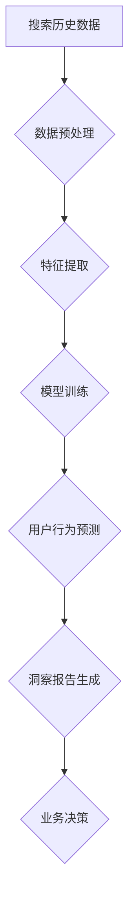

                 

## 搜索历史分析:AI驱动的用户行为洞察

> 关键词：搜索历史分析、用户行为洞察、人工智能、机器学习、自然语言处理、推荐系统、数据挖掘

## 1. 背景介绍

在当今数据爆炸的时代，用户搜索历史已成为宝贵的资源，蕴含着丰富的用户行为信息。通过对搜索历史的分析，我们可以深入了解用户的兴趣、需求、偏好以及潜在行为模式。这对于企业和组织来说，具有重要的商业价值，可以帮助他们优化产品和服务、提升用户体验、精准进行营销推广等。

传统的搜索历史分析方法主要依赖于统计分析和规则匹配，其分析深度和准确性有限。随着人工智能技术的快速发展，特别是机器学习和自然语言处理领域的突破，AI驱动的搜索历史分析方法应运而生，能够更深入、更精准地挖掘用户行为洞察。

## 2. 核心概念与联系

**2.1 核心概念**

* **搜索历史:** 用户在搜索引擎或其他平台上进行的搜索记录，包括搜索关键词、搜索时间、搜索结果点击等信息。
* **用户行为洞察:** 通过对搜索历史数据的分析，获取用户兴趣、需求、偏好、行为模式等方面的见解。
* **人工智能 (AI):** 人工智能是指模拟人类智能的计算机系统，包括机器学习、深度学习、自然语言处理等技术。
* **机器学习 (ML):** 机器学习是一种人工智能技术，通过算法训练，使计算机能够从数据中学习，并做出预测或决策。
* **自然语言处理 (NLP):** 自然语言处理是指让计算机能够理解、处理和生成人类语言的技术。

**2.2 架构图**



**2.3 联系**

搜索历史分析的核心是利用人工智能技术，从海量搜索历史数据中挖掘用户行为洞察。数据预处理阶段将原始搜索历史数据清洗、转换、格式化，以便后续分析。特征提取阶段将搜索历史数据转换为机器学习模型可以理解的特征向量。模型训练阶段利用机器学习算法，训练模型以预测用户未来的搜索行为或兴趣。用户行为预测结果可以用于生成洞察报告，帮助企业和组织做出更精准的业务决策。

## 3. 核心算法原理 & 具体操作步骤

**3.1 算法原理概述**

常用的搜索历史分析算法包括：

* **协同过滤:** 基于用户的相似性或物品的相似性，推荐用户可能感兴趣的搜索结果。
* **基于内容的推荐:** 根据用户的搜索历史和搜索结果的主题内容，推荐相关搜索结果。
* **深度学习:** 利用深度神经网络，从搜索历史数据中学习更复杂的特征，进行更精准的用户行为预测。

**3.2 算法步骤详解**

以协同过滤算法为例，其具体操作步骤如下：

1. **构建用户-物品交互矩阵:** 将用户和搜索结果作为矩阵的行和列，用户对搜索结果的交互行为（点击、收藏等）作为矩阵的元素。
2. **计算用户相似度:** 利用余弦相似度等算法，计算用户之间的相似度。
3. **推荐算法:** 对于给定用户，找到与其相似度最高的其他用户，并推荐这些用户喜欢的搜索结果。

**3.3 算法优缺点**

* **协同过滤:**
    * **优点:** 可以推荐用户可能感兴趣但从未搜索过的结果。
    * **缺点:** 当用户数据稀疏时，算法效果不佳。
* **基于内容的推荐:**
    * **优点:** 可以推荐与用户搜索历史相关的结果。
    * **缺点:** 难以捕捉用户隐含的兴趣。
* **深度学习:**
    * **优点:** 可以学习更复杂的特征，提高推荐精度。
    * **缺点:** 需要大量的数据进行训练，训练成本较高。

**3.4 算法应用领域**

* **搜索引擎优化 (SEO):** 分析用户搜索历史，了解用户搜索关键词和意图，优化网站内容和关键词策略。
* **个性化推荐:** 为用户推荐个性化的搜索结果、产品和服务。
* **市场营销:** 分析用户搜索历史，了解用户兴趣和需求，进行精准的广告投放和营销推广。

## 4. 数学模型和公式 & 详细讲解 & 举例说明

**4.1 数学模型构建**

协同过滤算法的数学模型可以表示为：

$$
r_{ui} = \frac{\sum_{v \in N(u)} s_{uv} \cdot r_{vi}}{\sum_{v \in N(u)} s_{uv}}
$$

其中：

* $r_{ui}$ 表示用户 $u$ 对物品 $i$ 的评分或交互行为。
* $s_{uv}$ 表示用户 $u$ 和用户 $v$ 的相似度。
* $r_{vi}$ 表示用户 $v$ 对物品 $i$ 的评分或交互行为。
* $N(u)$ 表示与用户 $u$ 相似的用户集合。

**4.2 公式推导过程**

该公式基于用户的相似性进行预测。对于给定用户 $u$ 和物品 $i$，算法首先找到与用户 $u$ 相似的用户集合 $N(u)$，然后根据这些相似用户的评分或交互行为，对用户 $u$ 对物品 $i$ 的评分或交互行为进行预测。

**4.3 案例分析与讲解**

假设有两个用户 $u$ 和 $v$，他们都对电影 $i$ 和电影 $j$ 进行评分。如果用户 $u$ 和 $v$ 的相似度较高，则可以认为用户 $u$ 对电影 $j$ 的评分也可能与用户 $v$ 的评分相似。

## 5. 项目实践：代码实例和详细解释说明

**5.1 开发环境搭建**

* Python 3.x
* Jupyter Notebook
* scikit-learn
* pandas
* numpy

**5.2 源代码详细实现**

```python
import pandas as pd
from sklearn.metrics.pairwise import cosine_similarity

# 加载搜索历史数据
data = pd.read_csv('search_history.csv')

# 构建用户-物品交互矩阵
user_item_matrix = data.pivot_table(index='user_id', columns='item_id', values='interaction', fill_value=0)

# 计算用户相似度
user_similarity = cosine_similarity(user_item_matrix)

# 推荐算法
def recommend_items(user_id, top_n=5):
    # 找到与给定用户相似的用户
    similar_users = user_similarity[user_id].argsort()[:-top_n-1:-1]

    # 获取相似用户喜欢的物品
    recommended_items = user_item_matrix.iloc[similar_users].mean().sort_values(ascending=False)

    return recommended_items.index.tolist()

# 获取用户 ID
user_id = 1

# 推荐物品
recommended_items = recommend_items(user_id)

# 打印推荐结果
print(f'推荐给用户 {user_id} 的物品：{recommended_items}')
```

**5.3 代码解读与分析**

该代码首先加载搜索历史数据，构建用户-物品交互矩阵。然后利用余弦相似度计算用户之间的相似度。最后，定义一个推荐算法函数，根据给定用户 ID，找到与其相似度最高的相似用户，并推荐这些用户喜欢的物品。

**5.4 运行结果展示**

运行该代码后，将输出给定用户 ID 的推荐物品列表。

## 6. 实际应用场景

**6.1 搜索引擎优化 (SEO)**

搜索引擎可以利用用户搜索历史数据，分析用户搜索关键词和意图，优化网站内容和关键词策略，提高网站在搜索结果中的排名。

**6.2 个性化推荐**

电商平台、流媒体平台等可以利用用户搜索历史数据，为用户推荐个性化的商品、电影、音乐等，提升用户体验和转化率。

**6.3 市场营销**

广告平台可以利用用户搜索历史数据，精准地投放广告，提高广告点击率和转化率。

**6.4 未来应用展望**

随着人工智能技术的不断发展，搜索历史分析将应用于更广泛的领域，例如：

* **医疗保健:** 分析患者的搜索历史，预测患者的健康状况和潜在疾病。
* **教育:** 分析学生的搜索历史，个性化推荐学习资源和教学方法。
* **金融:** 分析用户的搜索历史，识别潜在的金融风险和欺诈行为。

## 7. 工具和资源推荐

**7.1 学习资源推荐**

* **书籍:**
    * 《推荐系统》
    * 《深度学习》
* **在线课程:**
    * Coursera: Machine Learning
    * edX: Artificial Intelligence

**7.2 开发工具推荐**

* **Python:** 
    * scikit-learn
    * pandas
    * numpy
* **Spark:** 
    * Apache Spark MLlib

**7.3 相关论文推荐**

* **协同过滤:**
    * "Collaborative Filtering: A User-Based Approach"
* **深度学习:**
    * "Deep Learning for Recommender Systems"

## 8. 总结：未来发展趋势与挑战

**8.1 研究成果总结**

AI驱动的搜索历史分析方法取得了显著的成果，能够更深入、更精准地挖掘用户行为洞察。

**8.2 未来发展趋势**

* **更精准的预测:** 利用更先进的机器学习算法和深度学习模型，提高用户行为预测的精度。
* **更个性化的推荐:** 基于用户的多方面信息，例如搜索历史、浏览记录、购买记录等，提供更个性化的推荐。
* **更智能的交互:** 利用自然语言处理技术，实现与用户的更智能的交互，例如语音搜索、对话式推荐等。

**8.3 面临的挑战**

* **数据隐私:** 搜索历史数据包含用户的敏感信息，如何保护用户隐私是需要解决的关键问题。
* **算法公平性:** 算法模型可能存在偏见，导致推荐结果不公平，需要进行算法公平性评估和改进。
* **解释性:** 深度学习模型的决策过程难以解释，需要开发更可解释的模型，提高算法的透明度。

**8.4 研究展望**

未来，搜索历史分析将继续朝着更精准、更个性化、更智能的方向发展，为用户提供更优质的体验，并为企业和组织带来更大的价值。

## 9. 附录：常见问题与解答

**9.1 如何处理搜索历史数据中的缺失值？**

可以使用多种方法处理缺失值，例如：

* **删除含有缺失值的记录:** 这种方法简单粗暴，可能会导致数据丢失。
* **用平均值或中位数填充缺失值:** 这种方法简单易行，但可能会影响数据的准确性。
* **使用机器学习算法进行预测:** 这种方法更复杂，但可以获得更准确的结果。

**9.2 如何评估搜索历史分析算法的性能？**

常用的评估指标包括：

* **准确率:** 算法预测正确的结果占总结果的比例。
* **召回率:** 算法预测出的正确结果占所有真实结果的比例。
* **F1-score:** 准确率和召回率的调和平均值。

**9.3 如何保护用户隐私？**

* **匿名化数据:** 将用户个人信息从搜索历史数据中移除。
* **差分隐私:** 添加噪声到数据中，保护用户隐私的同时保留数据的统计信息。
* **联邦学习:** 在不共享原始数据的情况下，训练机器学习模型。


作者：禅与计算机程序设计艺术 / Zen and the Art of Computer Programming 
<end_of_turn>

