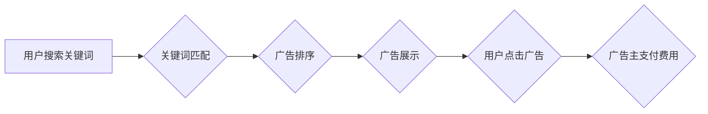

                 

## 搜索引擎广告模式的局限性

> 关键词：搜索引擎广告、广告模式、点击率、用户体验、算法优化、隐私问题、可持续发展

## 1. 背景介绍

搜索引擎广告模式，作为互联网商业模式的重要组成部分，在过去几十年中经历了飞速发展。从最初的文本广告到如今的图像、视频、购物等多形式广告，搜索引擎广告已经成为企业获取流量、提升品牌知名度和促进销售的重要途径。然而，随着搜索引擎广告模式的不断演进，其自身的局限性也逐渐显现，引发了越来越多的讨论和关注。

### 1.1  搜索引擎广告模式的演变

早期搜索引擎广告主要依靠关键词匹配，广告主根据用户搜索的关键词投放广告，并根据点击率（CTR）进行计费。随着技术的进步，搜索引擎广告模式逐渐演进，引入了更复杂的算法和策略，例如：

* **位置竞价:** 广告主根据广告位置竞价，更高的竞价能够获得更显眼的位置。
* **质量评分:** 搜索引擎会根据广告的质量、相关性等因素进行评分，高评分的广告更容易获得展示机会。
* **用户画像:** 通过分析用户的搜索历史、浏览行为等数据，搜索引擎可以构建用户画像，精准投放广告。
* **机器学习:** 机器学习算法被广泛应用于搜索引擎广告，例如预测用户点击行为、优化广告投放策略等。

### 1.2  搜索引擎广告模式的局限性

尽管搜索引擎广告模式取得了显著的成功，但其也面临着一些挑战和局限性：

* **点击率下降:** 随着广告的泛滥，用户对广告的接受度逐渐降低，点击率持续下降。
* **用户体验下降:** 过多的广告可能会影响用户体验，导致用户流失。
* **算法优化难度:** 搜索引擎算法不断更新，广告主需要不断优化广告策略才能保持竞争力。
* **隐私问题:** 搜索引擎广告模式需要收集和分析用户的个人数据，引发了隐私保护的担忧。
* **可持续发展:** 搜索引擎广告模式的盈利模式依赖于广告收入，如果广告收入持续下降，将面临可持续发展的挑战。

## 2. 核心概念与联系

搜索引擎广告模式的核心概念包括：

* **关键词:** 用户在搜索引擎中输入的词语。
* **广告主:** 希望通过搜索引擎广告推广产品的企业或个人。
* **广告:** 用于推广产品的文字、图片、视频等信息。
* **点击率 (CTR):** 用户点击广告的比例。
* **广告成本:** 广告主为展示广告支付的费用。

搜索引擎广告模式的运作流程可以概括为以下步骤：



### 2.1  关键词匹配

关键词匹配是搜索引擎广告模式的基础。广告主根据目标用户可能搜索的关键词选择投放广告。关键词匹配可以分为以下几种类型：

* **完全匹配:** 用户搜索的关键词与广告主设置的关键词完全一致。
* **词组匹配:** 用户搜索的关键词包含广告主设置的关键词词组。
* **广泛匹配:** 用户搜索的关键词与广告主设置的关键词相关，即使不完全包含。

### 2.2  广告排序

搜索引擎会根据多种因素对广告进行排序，例如：

* **广告质量评分:** 包括广告的相关性、点击率、用户体验等因素。
* **竞价:** 广告主为广告位置竞价，更高的竞价能够获得更显眼的位置。
* **用户画像:** 根据用户的搜索历史、浏览行为等数据，精准投放广告。

### 2.3  广告展示

排序后的广告将被展示在搜索结果页面中，通常位于搜索结果列表的顶部或右侧。

### 2.4  用户点击广告

用户点击广告后，将跳转到广告主的网站或landing page。

### 2.5  广告主支付费用

广告主根据点击次数或展示次数支付费用。

## 3. 核心算法原理 & 具体操作步骤

### 3.1  算法原理概述

搜索引擎广告模式的核心算法主要包括：

* **关键词匹配算法:** 用于匹配用户搜索的关键词与广告主的关键词。
* **广告排序算法:** 用于根据多种因素对广告进行排序。
* **点击率预测算法:** 用于预测用户点击广告的概率。
* **广告投放策略算法:** 用于优化广告投放策略，例如预算分配、时间段控制等。

这些算法通常基于机器学习技术，通过训练大量的历史数据来学习用户行为模式，并不断优化算法模型。

### 3.2  算法步骤详解

**关键词匹配算法:**

1. 将用户搜索的关键词进行分词和词性标注。
2. 将分词后的关键词与广告主的关键词进行匹配，判断是否符合匹配规则。
3. 根据匹配结果，确定用户搜索的关键词与哪些广告相关。

**广告排序算法:**

1. 收集用户搜索的关键词、广告主设置的关键词、广告内容、广告位置等信息。
2. 计算每个广告的质量评分，包括广告的相关性、点击率、用户体验等因素。
3. 根据广告的质量评分、竞价、用户画像等因素，对广告进行排序。

**点击率预测算法:**

1. 收集用户点击历史数据，包括用户搜索的关键词、广告内容、广告位置等信息。
2. 使用机器学习算法训练点击率预测模型。
3. 根据用户搜索的关键词、广告内容、广告位置等信息，预测用户点击广告的概率。

**广告投放策略算法:**

1. 根据广告主的预算、目标用户、竞价策略等信息，制定广告投放策略。
2. 使用机器学习算法优化广告投放策略，例如预算分配、时间段控制等。

### 3.3  算法优缺点

**优点:**

* **精准投放:** 能够根据用户搜索的关键词和行为模式精准投放广告。
* **高效转化:** 通过优化算法模型，提高广告的点击率和转化率。
* **数据驱动:** 基于大量数据分析，不断优化广告投放策略。

**缺点:**

* **算法复杂:** 搜索引擎广告算法非常复杂，需要专业的技术人员进行开发和维护。
* **数据依赖:** 算法的准确性依赖于数据的质量和数量。
* **黑盒效应:** 算法模型的内部机制难以理解，导致难以解释算法的决策结果。

### 3.4  算法应用领域

搜索引擎广告算法广泛应用于以下领域:

* **搜索引擎广告:** 谷歌、百度等搜索引擎使用广告算法为用户展示相关广告。
* **社交媒体广告:** Facebook、Twitter等社交媒体平台使用广告算法为用户展示个性化广告。
* **电商广告:** 淘宝、京东等电商平台使用广告算法为用户推荐商品。
* **内容平台广告:** YouTube、Netflix等内容平台使用广告算法为用户展示视频广告。

## 4. 数学模型和公式 & 详细讲解 & 举例说明

### 4.1  数学模型构建

搜索引擎广告模式的数学模型通常基于概率论和统计学，用于预测用户点击行为、优化广告投放策略等。

**点击率预测模型:**

一个简单的点击率预测模型可以表示为：

$$CTR = \frac{Clicks}{Impressions}$$

其中：

* CTR: 点击率
* Clicks: 点击次数
* Impressions: 展示次数

### 4.2  公式推导过程

更复杂的点击率预测模型通常使用逻辑回归、支持向量机等机器学习算法，并考虑更多的因素，例如：

* 用户特征: 年龄、性别、兴趣爱好等。
* 广告特征: 广告标题、广告内容、广告位置等。
* 搜索环境: 搜索时间、搜索设备等。

这些模型通过训练大量的历史数据，学习用户点击行为的模式，并预测用户点击特定广告的概率。

### 4.3  案例分析与讲解

假设一个广告主希望投放广告，目标用户是25-35岁男性，感兴趣于科技产品。

可以使用机器学习算法训练一个点击率预测模型，并根据用户的特征、广告特征和搜索环境，预测用户点击该广告的概率。

如果模型预测用户点击概率较高，则广告主可以提高广告投放预算，并选择更显眼的位置展示广告。

## 5. 项目实践：代码实例和详细解释说明

### 5.1  开发环境搭建

为了实现搜索引擎广告模式的项目实践，需要搭建相应的开发环境，包括：

* **编程语言:** Python、Java等。
* **机器学习库:** scikit-learn、TensorFlow等。
* **数据存储:** MySQL、MongoDB等。
* **云服务:** AWS、Azure等。

### 5.2  源代码详细实现

以下是一个简单的Python代码示例，用于实现关键词匹配算法：

```python
def keyword_match(user_query, ad_keywords):
  """
  实现关键词匹配算法

  Args:
    user_query: 用户搜索的关键词
    ad_keywords: 广告主的关键词列表

  Returns:
    匹配结果列表
  """
  user_keywords = user_query.split()
  matched_keywords = []
  for keyword in ad_keywords:
    if any(user_keyword in keyword for user_keyword in user_keywords):
      matched_keywords.append(keyword)
  return matched_keywords

# 示例使用
user_query = "python编程教程"
ad_keywords = ["python教程", "编程语言", "python入门"]
matched_keywords = keyword_match(user_query, ad_keywords)
print(f"匹配关键词: {matched_keywords}")
```

### 5.3  代码解读与分析

该代码首先将用户搜索的关键词进行分词，然后遍历广告主的关键词列表，判断每个广告关键词是否包含用户搜索的关键词。

如果包含，则将该关键词添加到匹配结果列表中。

### 5.4  运行结果展示

运行该代码后，输出结果为：

```
匹配关键词: ['python教程']
```

这表明用户搜索的关键词 "python编程教程" 与广告主设置的关键词 "python教程" 匹配。

## 6. 实际应用场景

搜索引擎广告模式广泛应用于各种实际场景，例如：

* **电商平台:** 为用户推荐相关商品，提高转化率。
* **旅游平台:** 为用户推荐旅游目的地、酒店、机票等服务。
* **教育平台:** 为用户推荐在线课程、培训机构等服务。
* **金融平台:** 为用户推荐理财产品、贷款服务等。

### 6.4  未来应用展望

随着人工智能技术的不断发展，搜索引擎广告模式将更加智能化、个性化。

例如：

* **更精准的广告投放:** 利用深度学习算法，更精准地预测用户点击行为，并根据用户兴趣爱好、行为模式等信息，个性化推荐广告。
* **更丰富的广告形式:** 除了文本、图片、视频广告，未来还将出现更多形式的广告，例如增强现实（AR）、虚拟现实（VR）广告等。
* **更注重用户体验:** 搜索引擎广告将更加注重用户体验，避免过度广告化，提供更优质的搜索体验。

## 7. 工具和资源推荐

### 7.1  学习资源推荐

* **书籍:**
    * 《搜索引擎优化》
    * 《广告算法》
    * 《机器学习》
* **在线课程:**
    * Coursera: 搜索引擎优化课程
    * Udacity: 机器学习课程
    * edX: 广告算法课程

### 7.2  开发工具推荐

* **编程语言:** Python、Java
* **机器学习库:** scikit-learn、TensorFlow
* **数据存储:** MySQL、MongoDB
* **云服务:** AWS、Azure

### 7.3  相关论文推荐

* **论文:**
    * 《基于深度学习的搜索引擎广告点击率预测》
    * 《搜索引擎广告排序算法研究》
    * 《搜索引擎广告的隐私问题》

## 8. 总结：未来发展趋势与挑战

### 8.1  研究成果总结

搜索引擎广告模式在过去几十年中取得了显著的成功，为企业提供了有效的营销工具，也为用户带来了更丰富的搜索体验。

### 8.2  未来发展趋势

未来搜索引擎广告模式将更加智能化、个性化、注重用户体验。

人工智能技术将进一步推动广告算法的优化，提供更精准的广告投放和更丰富的广告形式。

### 8.3  面临的挑战

搜索引擎广告模式也面临着一些挑战，例如：

* **点击率下降:** 用户对广告的接受度逐渐降低，点击率持续下降。
* **用户隐私保护:** 搜索引擎广告模式需要收集和分析用户的个人数据，引发了隐私保护的担忧。
* **可持续发展:** 搜索引擎广告模式的盈利模式依赖于广告收入，如果广告收入持续下降，将面临可持续发展的挑战。

### 8.4  研究展望

未来研究方向包括：

* **开发更有效的广告算法:** 提高广告的点击率和转化率，同时兼顾用户体验。
* **加强用户隐私保护:** 开发更安全的广告投放机制，保护用户的个人数据。
* **探索新的广告模式:** 寻找新的广告模式，例如基于价值交换的广告模式，以解决可持续发展问题。

## 9. 附录：常见问题与解答

### 9.1  常见问题

* **什么是搜索引擎广告？**

搜索引擎广告是指在搜索引擎结果页面中展示广告，并根据广告点击次数或展示次数计费的商业模式。

* **如何设置搜索引擎广告？**

需要选择一个广告平台，例如谷歌广告、百度推广等，并根据目标用户、预算、竞价策略等信息设置广告投放策略。

* **如何优化搜索引擎广告？**

需要不断分析广告数据，优化广告文案、关键词、目标用户等信息，提高广告的点击率和转化率。

### 9.2  解答

* **搜索引擎广告的优势:** 精准投放、高效转化、数据驱动。
* **搜索引擎广告的劣势:** 算法复杂、数据依赖、黑盒效应。
* **搜索引擎广告的未来发展趋势:** 智能化、个性化、注重用户体验。


作者：禅与计算机程序设计艺术 / Zen and the Art of Computer Programming<end_of_turn>

