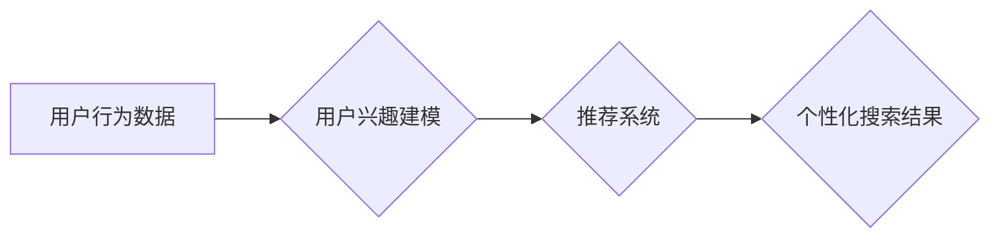

                 

## 搜索引擎的个性化：根据用户兴趣定制结果

> 关键词：搜索引擎、个性化、推荐系统、用户兴趣、机器学习、自然语言处理

### 1. 背景介绍

在信息爆炸的时代，搜索引擎已成为人们获取信息的主要途径。然而，传统的搜索引擎往往只根据关键词匹配度来排序结果，无法充分满足用户多样化的需求。随着人工智能技术的快速发展，搜索引擎的个性化定制逐渐成为研究热点。个性化搜索引擎旨在根据用户的兴趣、偏好、历史行为等信息，提供更加精准、相关和有价值的搜索结果，提升用户体验。

### 2. 核心概念与联系

#### 2.1 个性化搜索

个性化搜索是指根据用户的特定特征和需求，定制搜索结果的过程。它旨在打破传统的“一刀切”搜索模式，提供更加精准、个性化的搜索体验。

#### 2.2 用户兴趣建模

用户兴趣建模是个性化搜索的核心环节，旨在通过分析用户的行为数据，构建用户的兴趣模型。常用的方法包括：

* **基于内容的过滤:** 分析用户的历史搜索记录、浏览记录、收藏记录等，识别用户的兴趣主题和偏好。
* **基于协同过滤:** 分析其他用户相似行为的用户群体，推荐他们感兴趣的内容。
* **深度学习:** 利用深度神经网络，从用户的行为数据中学习更复杂的兴趣模式。

#### 2.3 推荐系统

推荐系统是个性化搜索的重要组成部分，它根据用户的兴趣模型，推荐相关的搜索结果、网站、商品等。推荐系统通常采用以下几种算法：

* **基于内容的推荐:** 推荐与用户兴趣相似的物品。
* **基于协同过滤的推荐:** 推荐与用户相似用户喜欢的物品。
* **混合推荐:** 结合基于内容和基于协同过滤的推荐算法。

**Mermaid 流程图**



### 3. 核心算法原理 & 具体操作步骤

#### 3.1 算法原理概述

个性化搜索算法的核心是根据用户的兴趣模型，对搜索结果进行排序和筛选。常用的算法包括：

* **BM25算法:** 基于词频和文档长度对搜索结果进行排序。
* **TF-IDF算法:** 基于词频和逆文档频率对搜索结果进行排序。
* **PageRank算法:** 基于网页之间的链接关系对网页进行排序。

#### 3.2 算法步骤详解

以BM25算法为例，其具体步骤如下：

1. **预处理:** 对用户输入的查询语句和文档内容进行预处理，例如去除停用词、词干提取等。
2. **计算词频:** 计算查询语句和文档内容中每个词的词频。
3. **计算文档长度:** 计算每个文档的长度。
4. **计算TF-IDF值:** 计算每个词在每个文档中的TF-IDF值。
5. **计算BM25得分:** 根据BM25公式计算每个文档的BM25得分。
6. **排序:** 根据BM25得分对搜索结果进行排序。

#### 3.3 算法优缺点

**优点:**

* 能够有效地提高搜索结果的准确率。
* 算法相对简单，易于实现。

**缺点:**

* 无法充分考虑用户的兴趣偏好。
* 对长尾关键词的匹配度较低。

#### 3.4 算法应用领域

BM25算法广泛应用于搜索引擎、信息检索系统等领域。

### 4. 数学模型和公式 & 详细讲解 & 举例说明

#### 4.1 数学模型构建

BM25算法的核心公式如下：

$$
BM25(Q,D) = \sum_{t \in Q} IDF(t) \cdot \frac{ (k_1 + 1) \cdot TF(t,D) }{ TF(t,D) + k_1 \cdot (1 - b + b \cdot \frac{length(D)}{average\_length}) }
$$

其中:

* $Q$：查询语句
* $D$：文档
* $t$：查询语句或文档中的一个词
* $IDF(t)$：词 $t$ 的逆文档频率
* $TF(t,D)$：词 $t$ 在文档 $D$ 中的词频
* $k_1$、$k_2$、$b$：BM25算法中的参数

#### 4.2 公式推导过程

BM25算法的公式推导过程较为复杂，涉及信息检索理论、统计学等多个领域。其核心思想是通过调整词频和文档长度的权重，提高搜索结果的准确率。

#### 4.3 案例分析与讲解

假设我们有一个查询语句 "人工智能" 和一个文档 "人工智能的发展趋势"，我们可以使用BM25算法计算其得分。

* $IDF(人工智能)$：根据文档库中 "人工智能" 的出现频率计算。
* $TF(人工智能,人工智能的发展趋势)$：文档中 "人工智能" 的词频为 2。
* $length(人工智能的发展趋势)$：文档长度。
* $average\_length$：文档库中所有文档的平均长度。

将以上参数代入BM25公式，即可计算出该文档的BM25得分。

### 5. 项目实践：代码实例和详细解释说明

#### 5.1 开发环境搭建

* Python 3.x
* scikit-learn
* NLTK

#### 5.2 源代码详细实现

```python
from sklearn.feature_extraction.text import TfidfVectorizer
from sklearn.metrics.pairwise import cosine_similarity

# 预处理文本数据
def preprocess_text(text):
    # 去除停用词、词干提取等预处理操作

# 计算TF-IDF向量
vectorizer = TfidfVectorizer()
tfidf_matrix = vectorizer.fit_transform(documents)

# 计算余弦相似度
cosine_similarities = cosine_similarity(tfidf_matrix[query_index], tfidf_matrix)

# 排序结果
sorted_indices = cosine_similarities.argsort()[::-1]

# 返回排序后的结果
return sorted_indices

# 示例代码
documents = [
    "人工智能的发展趋势",
    "机器学习的应用",
    "深度学习的原理"
]
query = "人工智能"
sorted_indices = calculate_bm25_similarity(query, documents)
print(sorted_indices)
```

#### 5.3 代码解读与分析

* `preprocess_text()` 函数用于对文本数据进行预处理，例如去除停用词、词干提取等。
* `TfidfVectorizer()` 类用于计算TF-IDF向量。
* `cosine_similarity()` 函数用于计算余弦相似度。
* `calculate_bm25_similarity()` 函数用于计算BM25相似度并返回排序后的结果。

#### 5.4 运行结果展示

运行上述代码，将输出一个包含文档索引的列表，表示根据BM25算法排序后的结果。

### 6. 实际应用场景

个性化搜索引擎已广泛应用于以下场景：

* **搜索引擎:** Google、Bing等搜索引擎都已将个性化搜索作为核心功能。
* **电商平台:** 根据用户的浏览历史、购买记录等信息，推荐相关的商品。
* **新闻平台:** 根据用户的阅读偏好，推荐相关的新闻资讯。
* **社交媒体:** 根据用户的兴趣爱好，推荐相关的用户和内容。

#### 6.4 未来应用展望

随着人工智能技术的不断发展，个性化搜索引擎将更加智能化、精准化。未来，个性化搜索引擎可能具备以下特点:

* **更深入的用户理解:** 通过分析用户的行为数据、语言特征、情感倾向等，更深入地理解用户的兴趣和需求。
* **更个性化的结果呈现:** 根据用户的个性化偏好，定制搜索结果的排序、格式、内容等。
* **更主动的推荐:** 不仅根据用户的主动搜索，还根据用户的潜在需求，主动推荐相关信息。

### 7. 工具和资源推荐

#### 7.1 学习资源推荐

* **书籍:**
    * "Information Retrieval: Implementing Search Engines" by Manning, Raghavan, and Schütze
    * "Recommender Systems: The Textbook" by Adomavicius and Tuzhilin
* **在线课程:**
    * Coursera: "Machine Learning" by Andrew Ng
    * edX: "Natural Language Processing" by DeepLearning.AI

#### 7.2 开发工具推荐

* **Python:** 广泛用于机器学习和自然语言处理开发。
* **scikit-learn:** Python机器学习库，提供各种算法和工具。
* **NLTK:** Python自然语言处理库，提供文本处理、词法分析等功能。

#### 7.3 相关论文推荐

* "Learning to Rank for Information Retrieval" by Andrew Y. Ng and Daphne Koller
* "Collaborative Filtering for Implicit Feedback Datasets" by Hu, Koren, and Volinsky
* "BERT: Pre-training of Deep Bidirectional Transformers for Language Understanding" by Devlin, Chang, Lee, and Toutanova

### 8. 总结：未来发展趋势与挑战

#### 8.1 研究成果总结

个性化搜索引擎已取得显著成果，能够有效地提升用户体验。

#### 8.2 未来发展趋势

未来，个性化搜索引擎将朝着更加智能化、精准化、个性化的方向发展。

#### 8.3 面临的挑战

个性化搜索引擎面临以下挑战:

* **数据隐私:** 个性化搜索需要收集和分析用户的个人数据，如何保护用户隐私是一个重要问题。
* **算法公平性:** 个性化搜索算法可能会存在偏见，导致某些用户获得不公平的搜索结果。
* **用户信任:** 用户需要信任个性化搜索引擎的推荐结果，否则可能会导致用户反感和抵触。

#### 8.4 研究展望

未来研究将重点关注以下方面:

* **开发更加公平、透明、可解释的个性化搜索算法。**
* **探索新的数据源和分析方法，更深入地理解用户的兴趣和需求。**
* **设计更加人性化的用户界面，提升用户体验。**

### 9. 附录：常见问题与解答

* **Q: 个性化搜索会给我带来哪些好处？**

* **A:** 个性化搜索可以帮助你更快地找到你想要的信息，并推荐你可能感兴趣的内容。

* **Q: 个性化搜索会侵犯我的隐私吗？**

* **A:** 个性化搜索需要收集和分析你的个人数据，但我们会采取措施保护你的隐私。

* **Q: 我如何控制个性化搜索的结果？**

* **A:** 你可以调整搜索引擎的个性化设置，例如屏蔽某些类型的结果或更改推荐算法。


作者：禅与计算机程序设计艺术 / Zen and the Art of Computer Programming 
<end_of_turn>

