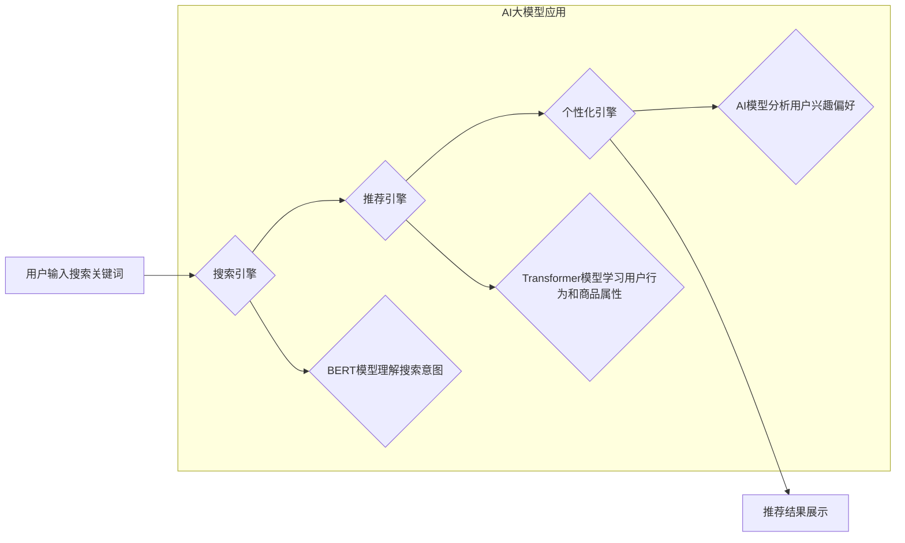

                 

## 1. 背景介绍

在当今数据爆炸的时代，电商平台面临着巨大的挑战，如何精准推荐商品给用户，提高转化率和用户体验，成为平台发展的重要课题。传统的搜索推荐系统主要依赖于基于规则和基于内容的算法，但这些方法难以捕捉用户行为的复杂性和商品属性的多样性。近年来，随着深度学习技术的快速发展，基于AI的大模型在搜索推荐领域展现出巨大的潜力，能够更有效地理解用户需求，提供个性化推荐，从而提升电商平台的整体效能。

## 2. 核心概念与联系

### 2.1 搜索推荐系统

搜索推荐系统是电商平台的核心功能之一，旨在帮助用户快速找到所需商品，并根据用户的兴趣和偏好，推荐相关商品。传统的搜索推荐系统主要包括以下几个模块：

* **搜索引擎:** 处理用户搜索关键词，并返回相关商品列表。
* **推荐引擎:** 基于用户行为、商品属性等数据，推荐用户可能感兴趣的商品。
* **个性化引擎:** 根据用户的历史行为、偏好等信息，对推荐结果进行个性化排序和展示。

### 2.2 AI 大模型

AI大模型是指在海量数据上训练的深度学习模型，具有强大的泛化能力和学习能力。常见的AI大模型包括：

* **Transformer模型:** 擅长处理序列数据，例如文本和代码，在自然语言处理领域取得了突破性进展。
* **BERT模型:** 基于Transformer架构，专门用于理解文本语义，在搜索引擎和推荐系统中应用广泛。
* **GPT模型:** 能够生成流畅的文本，在聊天机器人、文本摘要等领域表现出色。

### 2.3 AI 大模型在搜索推荐系统中的应用

AI大模型可以应用于搜索推荐系统的各个模块，例如：

* **搜索引擎:** 使用BERT模型理解用户搜索意图，提高搜索结果的准确性和相关性。
* **推荐引擎:** 使用Transformer模型学习用户行为和商品属性之间的关系，提供更精准的商品推荐。
* **个性化引擎:** 使用AI大模型分析用户的兴趣偏好，对推荐结果进行个性化排序和展示。

**Mermaid 流程图**



## 3. 核心算法原理 & 具体操作步骤

### 3.1 算法原理概述

在搜索推荐系统中，AI大模型通常采用以下几种核心算法：

* **协同过滤:** 基于用户的历史行为和商品的购买记录，预测用户对商品的兴趣。
* **内容过滤:** 基于商品的属性和描述，推荐与用户兴趣相符的商品。
* **深度学习:** 使用深度神经网络学习用户行为和商品属性之间的复杂关系，提供更精准的推荐。

### 3.2 算法步骤详解

以深度学习算法为例，其具体操作步骤如下：

1. **数据预处理:** 收集用户行为数据、商品属性数据等，并进行清洗、转换、编码等操作，使其适合深度学习模型的训练。
2. **模型构建:** 选择合适的深度学习模型架构，例如Transformer模型，并根据具体任务进行参数调整。
3. **模型训练:** 使用训练数据训练深度学习模型，并通过评估指标，例如准确率、召回率等，评估模型的性能。
4. **模型部署:** 将训练好的模型部署到生产环境中，用于实时推荐商品。
5. **模型监控与优化:** 持续监控模型的性能，并根据用户反馈和数据变化，对模型进行调整和优化。

### 3.3 算法优缺点

**深度学习算法**

* **优点:** 能够学习用户行为和商品属性之间的复杂关系，提供更精准的推荐。
* **缺点:** 需要海量数据进行训练，训练时间长，模型参数复杂，部署成本高。

### 3.4 算法应用领域

深度学习算法在搜索推荐系统中的应用领域广泛，例如：

* **电商平台:** 推荐商品、个性化广告、用户画像分析等。
* **社交媒体:** 推荐好友、内容推荐、兴趣标签分析等。
* **音乐平台:** 推荐歌曲、音乐人、播放列表等。
* **视频平台:** 推荐视频、用户订阅、内容分类等。

## 4. 数学模型和公式 & 详细讲解 & 举例说明

### 4.1 数学模型构建

在深度学习模型中，常用的数学模型包括：

* **神经网络:** 由多个层级的神经元组成，通过连接和激活函数，学习数据之间的关系。
* **损失函数:** 用于衡量模型预测结果与真实值的差距，引导模型学习。
* **优化算法:** 用于更新模型参数，使模型的损失函数最小化。

### 4.2 公式推导过程

例如，在协同过滤算法中，可以使用矩阵分解模型来预测用户对商品的评分。

假设用户集合为U，商品集合为I，用户-商品评分矩阵为R，则可以将R分解为两个低维矩阵：

* 用户特征矩阵：P，每个用户对应一个向量，表示其兴趣偏好。
* 商品特征矩阵：Q，每个商品对应一个向量，表示其属性特征。

用户对商品的评分可以表示为：

$$r_{ui} = p_u^T q_i + \epsilon$$

其中：

* $r_{ui}$ 表示用户u对商品i的评分。
* $p_u$ 表示用户u的特征向量。
* $q_i$ 表示商品i的特征向量。
* $\epsilon$ 表示误差项。

通过最小化损失函数，可以学习到用户和商品的特征向量，从而预测用户对商品的评分。

### 4.3 案例分析与讲解

例如，在电商平台中，可以使用协同过滤算法推荐商品。

假设用户A喜欢购买服装和电子产品，用户B喜欢购买书籍和音乐。

根据用户的购买记录，可以学习到用户A和用户B的特征向量。

如果用户C购买了书籍，则可以根据用户B的特征向量，推荐用户C购买音乐。

## 5. 项目实践：代码实例和详细解释说明

### 5.1 开发环境搭建

* **操作系统:** Linux或macOS
* **编程语言:** Python
* **深度学习框架:** TensorFlow或PyTorch
* **其他工具:** Git、Jupyter Notebook

### 5.2 源代码详细实现

```python
# 使用TensorFlow构建协同过滤模型
import tensorflow as tf

# 定义用户-商品评分矩阵
ratings = tf.constant([[5, 4, 3],
                      [3, 5, 2],
                      [2, 3, 5]])

# 定义用户特征矩阵和商品特征矩阵
user_factors = tf.Variable(tf.random.normal([3, 10]))
item_factors = tf.Variable(tf.random.normal([3, 10]))

# 计算预测评分
predictions = tf.matmul(user_factors, item_factors, transpose_b=True)

# 定义损失函数
loss = tf.reduce_mean(tf.square(predictions - ratings))

# 定义优化器
optimizer = tf.keras.optimizers.Adam()

# 训练模型
for epoch in range(100):
    with tf.GradientTape() as tape:
        loss_value = loss
    gradients = tape.gradient(loss_value, [user_factors, item_factors])
    optimizer.apply_gradients(zip(gradients, [user_factors, item_factors]))

# 打印训练结果
print(loss_value)
```

### 5.3 代码解读与分析

* 代码首先定义了用户-商品评分矩阵、用户特征矩阵和商品特征矩阵。
* 然后计算预测评分，并定义损失函数和优化器。
* 最后使用训练数据训练模型，并打印训练结果。

### 5.4 运行结果展示

训练完成后，可以将训练好的模型用于预测用户对商品的评分。

## 6. 实际应用场景

### 6.1 电商平台商品推荐

AI大模型可以根据用户的浏览历史、购买记录、收藏列表等数据，推荐用户可能感兴趣的商品。

### 6.2 个性化广告推荐

AI大模型可以根据用户的兴趣偏好、行为特征等数据，推荐个性化的广告，提高广告点击率和转化率。

### 6.3 内容推荐

AI大模型可以根据用户的阅读习惯、观看历史等数据，推荐用户可能感兴趣的文章、视频、音乐等内容。

### 6.4 未来应用展望

AI大模型在搜索推荐系统中的应用前景广阔，未来可能应用于：

* **更精准的推荐:** 使用更复杂的深度学习模型，学习用户行为和商品属性之间的更深层次关系，提供更精准的推荐。
* **多模态推荐:** 将文本、图像、视频等多种数据类型融合在一起，提供更丰富的推荐体验。
* **实时推荐:** 使用实时数据流，动态更新推荐结果，提供更及时和个性化的推荐。

## 7. 工具和资源推荐

### 7.1 学习资源推荐

* **书籍:**
    * Deep Learning by Ian Goodfellow, Yoshua Bengio, and Aaron Courville
    * Hands-On Machine Learning with Scikit-Learn, Keras & TensorFlow by Aurélien Géron
* **在线课程:**
    * TensorFlow Tutorials: https://www.tensorflow.org/tutorials
    * PyTorch Tutorials: https://pytorch.org/tutorials/

### 7.2 开发工具推荐

* **深度学习框架:** TensorFlow, PyTorch
* **数据处理工具:** Pandas, NumPy
* **机器学习库:** Scikit-learn

### 7.3 相关论文推荐

* BERT: Pre-training of Deep Bidirectional Transformers for Language Understanding
* Transformer: Attention Is All You Need
* Collaborative Filtering for Recommender Systems

## 8. 总结：未来发展趋势与挑战

### 8.1 研究成果总结

AI大模型在搜索推荐系统中的应用取得了显著成果，能够提供更精准、个性化的推荐，提升电商平台的转化率和用户体验。

### 8.2 未来发展趋势

未来，AI大模型在搜索推荐系统中的应用将朝着以下方向发展：

* **更深层次的模型:** 使用更复杂的深度学习模型，学习用户行为和商品属性之间的更深层次关系。
* **多模态融合:** 将文本、图像、视频等多种数据类型融合在一起，提供更丰富的推荐体验。
* **实时推荐:** 使用实时数据流，动态更新推荐结果，提供更及时和个性化的推荐。

### 8.3 面临的挑战

AI大模型在搜索推荐系统中的应用也面临着一些挑战：

* **数据隐私:** 如何保护用户数据隐私，是AI大模型应用中的重要问题。
* **模型解释性:** 深度学习模型的决策过程难以解释，如何提高模型的解释性，是未来研究的重要方向。
* **模型公平性:** 如何避免AI模型产生偏见，确保推荐结果公平公正，也是需要解决的问题。

### 8.4 研究展望

未来，需要进一步研究AI大模型在搜索推荐系统中的应用，解决上述挑战，并探索新的应用场景，推动搜索推荐系统的智能化发展。

## 9. 附录：常见问题与解答

* **Q1: AI大模型的训练需要大量数据吗？**

* **A1:** 是的，AI大模型的训练需要海量数据，才能学习到用户行为和商品属性之间的复杂关系。

* **Q2: AI大模型的部署成本高吗？**

* **A2:** AI大模型的部署成本相对较高，需要强大的计算资源和存储空间。

* **Q3: 如何评估AI大模型的性能？**

* **A3:** 可以使用准确率、召回率、F1-score等指标来评估AI大模型的性能。


作者：禅与计算机程序设计艺术 / Zen and the Art of Computer Programming 
<end_of_turn>

