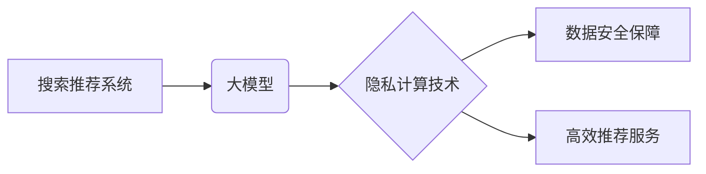

                 

## 搜索推荐系统的隐私计算：大模型时代的新技术

> 关键词：隐私计算、搜索推荐、大模型、联邦学习、差分隐私、同态加密、数据安全

## 1. 背景介绍

随着互联网的蓬勃发展，搜索引擎和推荐系统已成为人们获取信息和发现内容的重要途径。这些系统依赖于海量用户数据进行训练和个性化推荐，但同时也带来了用户隐私泄露的风险。近年来，数据隐私保护日益受到重视，如何保障用户数据安全的同时实现高效的搜索推荐成为了一个重要的研究课题。

大模型的出现为搜索推荐带来了新的机遇和挑战。大模型拥有强大的学习能力，能够从海量数据中提取更深层的特征，从而提供更精准的推荐结果。然而，大模型的训练和部署也更加依赖于数据规模和质量，这进一步加剧了用户隐私泄露的风险。

隐私计算作为一种新兴的技术，旨在解决数据隐私保护问题。它通过对数据进行加密、匿名化等处理，使得数据能够在不泄露原始信息的情况下进行分析和利用。隐私计算技术为大模型时代下的搜索推荐系统提供了新的解决方案，能够有效保障用户隐私的同时实现高效的推荐服务。

## 2. 核心概念与联系

**2.1 核心概念**

* **搜索推荐系统:**  通过分析用户行为和兴趣，为用户提供个性化的搜索结果和推荐内容的系统。
* **大模型:**  参数规模庞大、训练数据海量的人工智能模型，能够学习复杂的数据模式并进行高精度预测。
* **隐私计算:**  一种能够在不泄露原始数据的情况下进行数据分析和利用的技术。

**2.2 架构关系**



**2.3 联系分析**

搜索推荐系统依赖于海量用户数据进行训练和个性化推荐，而大模型能够从海量数据中提取更深层的特征，从而提供更精准的推荐结果。然而，大模型的训练和部署也更加依赖于数据规模和质量，这进一步加剧了用户隐私泄露的风险。隐私计算技术能够在不泄露原始数据的情况下进行数据分析和利用，为大模型时代下的搜索推荐系统提供了新的解决方案，能够有效保障用户隐私的同时实现高效的推荐服务。

## 3. 核心算法原理 & 具体操作步骤

**3.1 算法原理概述**

隐私计算在搜索推荐系统中的应用主要基于以下几种核心算法：

* **联邦学习:**  将模型训练任务分散到多个数据拥有者本地，通过模型参数的迭代更新，在不共享原始数据的情况下实现模型训练。
* **差分隐私:**  通过对数据进行噪声添加，保证数据隐私的同时，使得模型训练能够获得足够的信息。
* **同态加密:**  对数据进行加密处理，使得数据能够在加密状态下进行运算，从而实现数据安全分析。

**3.2 算法步骤详解**

以联邦学习为例，其具体操作步骤如下：

1. **模型初始化:**  中央服务器将初始模型参数分发给各个数据拥有者。
2. **本地训练:**  每个数据拥有者使用本地数据对模型参数进行训练，并计算出模型参数的梯度。
3. **参数聚合:**  每个数据拥有者将训练得到的模型参数梯度发送回中央服务器。中央服务器对所有梯度进行聚合，更新全局模型参数。
4. **模型更新:**  中央服务器将更新后的模型参数分发给各个数据拥有者。
5. **重复步骤2-4:**  重复上述步骤，直到模型训练达到预设的目标。

**3.3 算法优缺点**

* **联邦学习:**  优点：能够有效保护用户隐私，无需将原始数据共享。缺点：训练效率较低，模型性能可能不如集中式训练。
* **差分隐私:**  优点：能够提供严格的隐私保证。缺点：可能会导致模型性能下降。
* **同态加密:**  优点：能够实现数据在加密状态下的运算。缺点：计算复杂度高，效率较低。

**3.4 算法应用领域**

* **搜索推荐系统:**  实现个性化推荐，同时保障用户隐私。
* **医疗健康:**  分析患者数据，发现疾病规律，同时保护患者隐私。
* **金融科技:**  进行风险评估，防范欺诈，同时保障用户数据安全。

## 4. 数学模型和公式 & 详细讲解 & 举例说明

**4.1 数学模型构建**

联邦学习的数学模型可以概括为以下公式：

$$
\theta_t = \text{Agg}\left(\{ \theta_{i,t-1} + \eta_i \nabla L_i(\theta_{i,t-1})\} \right)
$$

其中：

* $\theta_t$：第t轮迭代后的全局模型参数。
* $\theta_{i,t-1}$：第i个数据拥有者在第t-1轮迭代后的本地模型参数。
* $\eta_i$：第i个数据拥有者的学习率。
* $\nabla L_i(\theta_{i,t-1})$：第i个数据拥有者在第t-1轮迭代后，针对本地数据计算的模型损失函数梯度。
* $\text{Agg}$：参数聚合函数，例如平均聚合。

**4.2 公式推导过程**

联邦学习的训练过程本质上是一个迭代更新的过程。每个数据拥有者根据本地数据对模型参数进行更新，然后将更新后的参数发送回中央服务器进行聚合。中央服务器将聚合后的参数作为下一轮迭代的初始参数，并将其分发给各个数据拥有者。

**4.3 案例分析与讲解**

假设有两个数据拥有者，分别拥有用户A和用户B的数据。用户A和用户B的兴趣偏好不同，因此他们的本地模型参数也会有所差异。在联邦学习的训练过程中，每个数据拥有者都会根据本地数据对模型参数进行更新，然后将更新后的参数发送回中央服务器。中央服务器将两个数据拥有者的参数进行平均聚合，得到全局模型参数。

在后续的迭代过程中，全局模型参数会不断更新，最终形成一个能够兼顾用户A和用户B兴趣偏好的推荐模型。

## 5. 项目实践：代码实例和详细解释说明

**5.1 开发环境搭建**

* Python 3.7+
* TensorFlow/PyTorch
* 联邦学习框架（例如: Flower, TensorFlow Federated）

**5.2 源代码详细实现**

```python
# 使用 TensorFlow Federated 实现联邦学习

import tensorflow as tf
from tensorflow_federated import computation_types as tff_comp
from tensorflow_federated import learning as tffl

# 定义模型
model = tf.keras.Sequential([
    tf.keras.layers.Dense(10, activation='relu'),
    tf.keras.layers.Dense(1, activation='sigmoid')
])

# 定义联邦学习算法
def create_federated_learning_algorithm(
    model_fn,
    client_epochs=1,
    optimizer_fn=tf.keras.optimizers.SGD,
    learning_rate=0.01
):
    # ...

# 训练联邦学习模型
federated_learner = create_federated_learning_algorithm(model)
federated_learner.train(clients_data)

```

**5.3 代码解读与分析**

* 代码首先定义了模型和联邦学习算法。
* 然后，使用联邦学习框架进行模型训练，将数据分散到各个客户端，并通过迭代更新的方式训练模型。

**5.4 运行结果展示**

* 训练完成后，可以评估模型的性能，例如准确率、召回率等。
* 可以将训练好的模型部署到生产环境中，为用户提供个性化的推荐服务。

## 6. 实际应用场景

**6.1 搜索引擎推荐**

* 利用用户搜索历史、点击行为等数据，为用户推荐相关搜索结果。
* 通过联邦学习技术，保护用户隐私的同时实现个性化推荐。

**6.2 电商平台推荐**

* 根据用户的购买历史、浏览记录等数据，推荐相关商品。
* 通过差分隐私技术，保证用户隐私的同时实现精准推荐。

**6.3 内容平台推荐**

* 根据用户的阅读习惯、观看记录等数据，推荐相关内容。
* 通过同态加密技术，在不泄露用户数据的情况下实现内容推荐。

**6.4 未来应用展望**

* 随着隐私计算技术的不断发展，其在搜索推荐系统中的应用场景将会更加广泛。
* 未来，隐私计算技术将与其他人工智能技术相结合，例如自然语言处理、计算机视觉等，为用户提供更加智能化、个性化的服务。

## 7. 工具和资源推荐

**7.1 学习资源推荐**

* **书籍:**
    * 《隐私计算：原理与实践》
    * 《联邦学习：原理与应用》
* **在线课程:**
    * Coursera: 隐私计算
    * edX: 联邦学习

**7.2 开发工具推荐**

* **TensorFlow Federated:**  一个开源的联邦学习框架。
* **PySyft:**  一个用于隐私计算的Python库。
* **OpenMined:**  一个开源的隐私计算平台。

**7.3 相关论文推荐**

* 《联邦学习:一种分布式机器学习方法》
* 《差分隐私:一种对数据隐私的保护方法》
* 《同态加密:一种对数据安全性的保护方法》

## 8. 总结：未来发展趋势与挑战

**8.1 研究成果总结**

隐私计算技术为大模型时代下的搜索推荐系统提供了新的解决方案，能够有效保障用户隐私的同时实现高效的推荐服务。

**8.2 未来发展趋势**

* **模型效率提升:**  研究更高效的联邦学习算法，降低模型训练时间和资源消耗。
* **隐私保护增强:**  探索更强大的隐私保护技术，例如多方计算、零知识证明等。
* **应用场景拓展:**  将隐私计算技术应用于更多搜索推荐场景，例如个性化广告推荐、推荐系统公平性等。

**8.3 面临的挑战**

* **数据异构性:**  不同数据拥有者的数据格式、质量等可能存在差异，需要开发更灵活的数据处理机制。
* **安全风险:**  联邦学习和隐私计算技术本身也存在安全风险，需要加强安全防护措施。
* **标准化与规范化:**  缺乏统一的隐私计算标准和规范，需要加强行业合作，推动标准化发展。

**8.4 研究展望**

未来，隐私计算技术将继续发展，为大模型时代下的搜索推荐系统提供更安全、更有效的解决方案。


## 9. 附录：常见问题与解答

**9.1 Q: 联邦学习和差分隐私有什么区别？**

**A:** 联邦学习和差分隐私都是隐私计算技术，但它们的工作机制不同。联邦学习将模型训练任务分散到多个数据拥有者本地，通过模型参数的迭代更新，在不共享原始数据的情况下实现模型训练。而差分隐私通过对数据进行噪声添加，保证数据隐私的同时，使得模型训练能够获得足够的信息。

**9.2 Q: 隐私计算技术是否能够完全保障用户隐私？**

**A:** 任何技术都无法完全保障用户隐私。隐私计算技术能够有效降低隐私泄露风险，但仍然存在一些潜在的风险。例如，攻击者可能能够通过分析模型输出结果，推断出部分用户隐私信息。

**9.3 Q: 隐私计算技术是否会影响模型性能？**

**A:** 隐私计算技术可能会对模型性能产生一定的影响，例如，差分隐私可能会导致模型性能下降。但是，随着技术的不断发展，隐私计算技术对模型性能的影响将会越来越小。


作者：禅与计算机程序设计艺术 / Zen and the Art of Computer Programming 
<end_of_turn>

