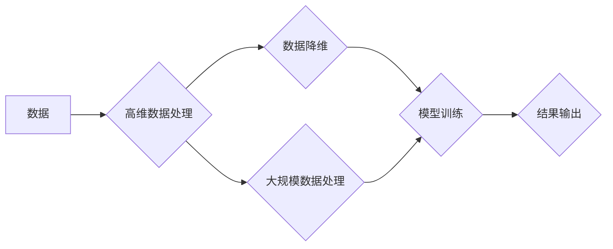

                 

## 无监督学习的可扩展性挑战:高维数据和大规模数据

> 关键词：无监督学习、高维数据、大规模数据、可扩展性、算法效率、数据降维、模型复杂度

## 1. 背景介绍

无监督学习作为机器学习的重要分支，旨在从未标记的数据中学习数据内在的结构和规律。它在数据挖掘、模式识别、异常检测等领域有着广泛的应用。然而，随着数据规模和维度不断增长，无监督学习算法的可扩展性面临着严峻挑战。

高维数据是指数据特征维度非常高的场景，例如文本数据、图像数据、基因数据等。高维数据带来的挑战包括：

* **维度灾难:**  随着维度增加，数据点之间的距离变得更加相似，算法难以有效地发现数据结构。
* **过拟合:** 高维数据容易导致模型过拟合，即模型在训练数据上表现良好，但在测试数据上表现差。
* **计算复杂度:**  高维数据计算复杂度急剧增加，难以在有限时间内完成训练。

大规模数据是指数据量非常庞大的场景，例如社交网络数据、传感器数据、电商交易数据等。大规模数据带来的挑战包括：

* **存储和处理成本:**  存储和处理海量数据需要大量的计算资源和存储空间。
* **训练时间:**  训练大型模型需要花费大量时间，甚至需要分布式计算环境。
* **算法效率:**  传统的无监督学习算法难以有效地处理大规模数据。

## 2. 核心概念与联系

无监督学习的核心目标是发现数据中的隐藏结构和规律，而高维数据和大规模数据的存在使得这一目标更加困难。

**Mermaid 流程图:**



**核心概念:**

* **数据降维:**  将高维数据转换为低维数据，减少数据维度，同时尽量保留数据信息。
* **模型复杂度:**  模型的复杂度是指模型参数的数量和结构的复杂程度。模型复杂度过高容易导致过拟合，而过低则难以学习数据中的复杂结构。
* **算法效率:**  算法的效率是指算法在处理数据时的计算时间和资源消耗。

**联系:**

高维数据和大规模数据共同构成了无监督学习的可扩展性挑战。数据降维可以有效地解决高维数据带来的维度灾难问题，而算法效率和模型复杂度的控制则是应对大规模数据挑战的关键。

## 3. 核心算法原理 & 具体操作步骤

### 3.1  算法原理概述

**k-means聚类算法**是一种经典的无监督学习算法，用于将数据点划分为若干个簇。其核心思想是迭代地将数据点分配到最近的质心，并不断更新质心的位置，直到达到收敛。

### 3.2  算法步骤详解

1. **初始化:**  随机选择k个数据点作为初始质心。
2. **分配:**  将每个数据点分配到距离其最近的质心所在的簇。
3. **更新:**  计算每个簇的质心，并将其作为新的质心。
4. **重复:**  重复步骤2和步骤3，直到质心的位置不再发生变化或达到最大迭代次数。

### 3.3  算法优缺点

**优点:**

* 算法简单易懂，易于实现。
* 能够有效地处理大规模数据。

**缺点:**

* 算法对初始质心的选择敏感，不同的初始质心可能导致不同的聚类结果。
* 难以处理非球形簇。
* 需要事先指定簇的数量k。

### 3.4  算法应用领域

k-means聚类算法广泛应用于以下领域:

* **客户群分析:** 将客户根据消费行为、购买习惯等特征进行分类。
* **图像分割:** 将图像分割成不同的区域，例如前景和背景。
* **异常检测:**  将异常数据点从正常数据集中分离出来。

## 4. 数学模型和公式 & 详细讲解 & 举例说明

### 4.1  数学模型构建

k-means聚类算法的目标是找到k个质心，使得每个数据点到其所属质心的距离最小。

**数学模型:**

*  **距离度量:**  通常使用欧氏距离作为距离度量。
*  **目标函数:**  最小化所有数据点到其所属质心的总距离。

### 4.2  公式推导过程

**目标函数:**

$$J(C) = \sum_{i=1}^{n} \min_{j=1}^{k} ||x_i - c_j||^2$$

其中:

* $J(C)$ 是目标函数，表示所有数据点到其所属质心的总距离。
* $n$ 是数据点的数量。
* $k$ 是簇的数量。
* $x_i$ 是第i个数据点。
* $c_j$ 是第j个质心。
* $||x_i - c_j||^2$ 是数据点 $x_i$ 到质心 $c_j$ 的欧氏距离平方。

**迭代更新公式:**

$$c_j = \frac{\sum_{i=1}^{n} \delta(i,j) x_i}{\sum_{i=1}^{n} \delta(i,j)}$$

其中:

* $\delta(i,j)$ 是指示函数，当数据点 $x_i$ 属于簇 $j$ 时为1，否则为0。

### 4.3  案例分析与讲解

假设我们有5个数据点，需要将其聚类成2个簇。

1. **初始化:**  随机选择两个数据点作为初始质心。
2. **分配:**  将每个数据点分配到距离其最近的质心所在的簇。
3. **更新:**  计算每个簇的质心，并将其作为新的质心。
4. **重复:**  重复步骤2和步骤3，直到质心的位置不再发生变化。

通过迭代更新，最终可以得到两个簇的质心，并将数据点分配到相应的簇中。

## 5. 项目实践：代码实例和详细解释说明

### 5.1  开发环境搭建

* Python 3.x
* scikit-learn 库

### 5.2  源代码详细实现

```python
from sklearn.cluster import KMeans
import numpy as np

# 生成随机数据
np.random.seed(0)
X = np.random.rand(100, 2)

# 创建 KMeans 模型，簇数量为 2
kmeans = KMeans(n_clusters=2, random_state=0)

# 训练模型
kmeans.fit(X)

# 获取聚类结果
labels = kmeans.labels_

# 获取质心坐标
centroids = kmeans.cluster_centers_

# 打印结果
print("聚类标签:", labels)
print("质心坐标:", centroids)
```

### 5.3  代码解读与分析

*  `KMeans(n_clusters=2, random_state=0)`: 创建 KMeans 模型，指定簇数量为 2，并设置随机种子以确保每次运行结果一致。
*  `kmeans.fit(X)`: 训练模型，将数据 X 分配到相应的簇中。
*  `kmeans.labels_`: 获取每个数据点的聚类标签。
*  `kmeans.cluster_centers_`: 获取每个簇的质心坐标。

### 5.4  运行结果展示

运行代码后，会输出每个数据点的聚类标签和每个簇的质心坐标。

## 6. 实际应用场景

k-means聚类算法在实际应用中有着广泛的应用场景，例如:

* **客户群分析:**  根据客户的购买行为、消费习惯等特征进行聚类，以便针对不同客户群进行个性化营销。
* **图像分割:** 将图像分割成不同的区域，例如前景和背景，以便进行图像识别和分析。
* **异常检测:**  将异常数据点从正常数据集中分离出来，以便进行故障诊断和风险控制。

### 6.4  未来应用展望

随着数据规模和复杂度的不断增长，k-means聚类算法的应用场景将会更加广泛。例如:

* **大规模数据分析:**  利用分布式计算技术，将 k-means 算法应用于海量数据的分析。
* **深度学习结合:**  将 k-means 算法与深度学习模型结合，提高聚类效果。
* **动态聚类:**  研究动态聚类算法，能够随着数据变化而自动调整簇结构。

## 7. 工具和资源推荐

### 7.1  学习资源推荐

* **书籍:**
    *  《机器学习》 - 周志华
    *  《Python机器学习》 - Sebastian Raschka
* **在线课程:**
    *  Coursera: Machine Learning
    *  edX: Introduction to Artificial Intelligence

### 7.2  开发工具推荐

* **Python:**  Python 是机器学习领域最常用的编程语言。
* **scikit-learn:**  scikit-learn 是 Python 的一个机器学习库，包含了各种经典的机器学习算法，包括 k-means 聚类算法。
* **TensorFlow/PyTorch:**  TensorFlow 和 PyTorch 是深度学习框架，可以用于构建和训练深度学习模型。

### 7.3  相关论文推荐

*  Lloyd, J. (1982). Least squares quantization in PCM. IEEE Transactions on Information Theory, 28(2), 129-137.
*  MacQueen, J. B. (1967). Some methods for classification and analysis of multivariate observations. Proceedings of the fifth Berkeley symposium on mathematical statistics and probability, 1, 281-297.

## 8. 总结：未来发展趋势与挑战

### 8.1  研究成果总结

k-means 聚类算法是一种经典的无监督学习算法，在数据分析和模式识别领域有着广泛的应用。

### 8.2  未来发展趋势

*  **算法效率提升:**  研究更高效的 k-means 算法，能够处理更大规模的数据。
*  **鲁棒性增强:**  研究更鲁棒的 k-means 算法，能够更好地应对噪声数据和异常数据。
*  **动态聚类:**  研究动态聚类算法，能够随着数据变化而自动调整簇结构。

### 8.3  面临的挑战

*  **高维数据处理:**  高维数据带来的维度灾难问题仍然是 k-means 算法面临的挑战。
*  **大规模数据处理:**  处理海量数据需要更高的计算资源和更有效的算法。
*  **簇数量确定:**  k-means 算法需要事先指定簇的数量，这在实际应用中往往难以确定。

### 8.4  研究展望

未来，k-means 聚类算法的研究将继续朝着更高效、更鲁棒、更智能的方向发展，并将在更多领域得到应用。


## 9. 附录：常见问题与解答

**Q1: k-means 算法的簇数量如何确定？**

**A1:**  簇数量的确定是一个重要的问题，常用的方法包括：

*  **肘部法:**  绘制误差平方和与簇数量之间的关系曲线，找到曲线的拐点作为最佳簇数量。
*  **Silhouette 分析:**  计算每个数据点属于其簇的相似度和与其他簇的相似度，选择使 Silhouette 值最大的簇数量。

**Q2: k-means 算法对初始质心的选择敏感吗？**

**A2:**  是的，k-means 算法对初始质心的选择敏感。不同的初始质心可能导致不同的聚类结果。为了解决这个问题，可以采用随机选择多个初始质心，并选择最终聚类效果最好的结果。

**Q3: k-means 算法只能处理球形簇吗？**

**A3:**  不完全正确。k-means 算法对簇形状有一定的限制，难以处理非球形簇。但是，可以通过一些改进算法，例如 DBSCAN，来处理非球形簇。


作者：禅与计算机程序设计艺术 / Zen and the Art of Computer Programming 
<end_of_turn>

