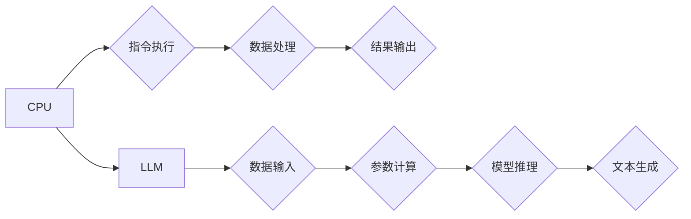

                 

## 时刻推理 VS 时钟周期:LLM与CPU的本质区别

> 关键词：大型语言模型 (LLM)、CPU、GPU、时刻推理、时钟周期、并行计算、深度学习、Transformer、自然语言处理

## 1. 背景介绍

近年来，人工智能领域取得了令人瞩目的进展，其中大型语言模型 (LLM) 的出现尤为引人注目。这些模型，例如 GPT-3、LaMDA 和 BERT，展现出惊人的文本生成、理解和翻译能力，引发了人们对人工智能未来的无限遐想。然而，与传统 CPU 不同，LLM 的工作机制和性能评估标准存在显著差异，这使得我们必须重新审视计算能力的本质。

传统 CPU 擅长执行指令，其性能通常以时钟周期为单位衡量。每个时钟周期，CPU 可以执行一条指令，并行度有限。而 LLM 则依赖于深度学习算法，通过大量数据训练，学习语言的复杂模式和关系。其推理过程并非简单的指令执行，而是通过神经网络的激活和传递，在海量参数之间进行复杂的计算。

## 2. 核心概念与联系

### 2.1  CPU

CPU (中央处理器) 是计算机系统中执行指令的核心部件。其工作原理基于时钟周期，每个时钟周期执行一条指令。CPU 的性能主要取决于时钟频率、指令集架构和缓存大小等因素。

### 2.2  LLM

LLM (大型语言模型) 是基于深度学习算法训练的强大人工智能模型。其核心是 Transformer 架构，通过自注意力机制学习语言的上下文关系和语义信息。LLM 的推理过程涉及大量的参数计算，并依赖于 GPU 的并行计算能力。

### 2.3  关系

CPU 和 LLM 虽然在工作机制和性能评估标准上存在差异，但它们共同构成了现代计算体系。CPU 负责执行 LLM 的基础计算任务，而 LLM 利用 CPU 的计算能力进行深度学习训练和推理。

**Mermaid 流程图**



## 3. 核心算法原理 & 具体操作步骤

### 3.1  算法原理概述

LLM 的核心算法是 Transformer 架构，其主要特点是自注意力机制和多头注意力机制。自注意力机制允许模型关注输入序列中的不同位置，学习词语之间的上下文关系。多头注意力机制则通过多个注意力头，从不同的角度捕捉语义信息，提高模型的表达能力。

### 3.2  算法步骤详解

1. **词嵌入:** 将输入文本中的每个词语转换为向量表示，捕捉词语的语义信息。
2. **多头注意力:** 利用多个注意力头，从不同的角度关注输入序列中的词语，学习词语之间的上下文关系。
3. **前馈神经网络:** 对每个词语的注意力输出进行进一步处理，提取更深层的语义特征。
4. **位置编码:** 将词语在序列中的位置信息编码到向量表示中，帮助模型理解词语的顺序关系。
5. **解码:** 根据输入序列和编码后的信息，生成目标文本序列。

### 3.3  算法优缺点

**优点:**

* 强大的文本理解和生成能力
* 可以处理长文本序列
* 具有良好的泛化能力

**缺点:**

* 训练成本高
* 计算资源需求大
* 难以解释模型的决策过程

### 3.4  算法应用领域

* 自然语言处理 (NLP): 文本分类、情感分析、机器翻译、问答系统等
* 人机交互: 聊天机器人、语音助手等
* 代码生成: 自动生成代码片段
* 内容创作: 自动生成文章、诗歌、剧本等

## 4. 数学模型和公式 & 详细讲解 & 举例说明

### 4.1  数学模型构建

LLM 的数学模型主要基于神经网络，其核心是 Transformer 架构。Transformer 架构由编码器和解码器组成，每个部分由多个注意力层和前馈神经网络层构成。

### 4.2  公式推导过程

Transformer 架构的核心是自注意力机制，其计算公式如下:

$$
Attention(Q, K, V) = softmax(\frac{QK^T}{\sqrt{d_k}})V
$$

其中:

* $Q$ 是查询矩阵
* $K$ 是键矩阵
* $V$ 是值矩阵
* $d_k$ 是键向量的维度
* $softmax$ 函数将注意力权重归一化

### 4.3  案例分析与讲解

假设我们有一个句子 "The cat sat on the mat"，将其转换为词向量表示，得到 $Q$, $K$, $V$ 三个矩阵。通过自注意力机制计算，可以得到每个词语对其他词语的注意力权重，例如 "cat" 对 "sat" 的注意力权重较高，表明这两个词语在语义上相关。

## 5. 项目实践：代码实例和详细解释说明

### 5.1  开发环境搭建

使用 Python 语言和 TensorFlow 或 PyTorch 深度学习框架进行 LLM 的开发。

### 5.2  源代码详细实现

```python
import tensorflow as tf

# 定义 Transformer 模型
class Transformer(tf.keras.Model):
    def __init__(self, vocab_size, embedding_dim, num_heads, num_layers):
        super(Transformer, self).__init__()
        self.embedding = tf.keras.layers.Embedding(vocab_size, embedding_dim)
        self.transformer_layers = tf.keras.layers.StackedRNNCells([
            tf.keras.layers.Attention(num_heads=num_heads)
            for _ in range(num_layers)
        ])

    def call(self, inputs):
        # 词嵌入
        embedded_inputs = self.embedding(inputs)
        # Transformer 层处理
        outputs = self.transformer_layers(embedded_inputs)
        return outputs

# 实例化模型
model = Transformer(vocab_size=10000, embedding_dim=128, num_heads=8, num_layers=6)

# 训练模型
model.compile(optimizer='adam', loss='categorical_crossentropy', metrics=['accuracy'])
model.fit(train_data, train_labels, epochs=10)
```

### 5.3  代码解读与分析

* 代码定义了一个 Transformer 模型，包含词嵌入层和 Transformer 层。
* 词嵌入层将输入词语转换为向量表示。
* Transformer 层利用自注意力机制和前馈神经网络层进行文本处理。
* 模型使用 Adam 优化器，交叉熵损失函数和准确率指标进行训练。

### 5.4  运行结果展示

训练完成后，模型可以用于文本生成、分类、翻译等任务。

## 6. 实际应用场景

### 6.1  聊天机器人

LLM 可以用于构建更智能、更自然的聊天机器人，能够理解用户的意图，并提供更精准的回复。

### 6.2  机器翻译

LLM 可以学习语言之间的语义关系，实现更准确、更流畅的机器翻译。

### 6.3  文本摘要

LLM 可以自动生成文本摘要，提取文本的关键信息，节省用户阅读时间。

### 6.4  未来应用展望

LLM 的应用场景还在不断扩展，未来可能应用于：

* 自动写作
* 代码生成
* 药物研发
* 科学研究

## 7. 工具和资源推荐

### 7.1  学习资源推荐

* **书籍:**
    * 《深度学习》
    * 《自然语言处理》
* **在线课程:**
    * Coursera: 深度学习
    * Udacity: 自然语言处理
* **博客:**
    * The Gradient
    * Towards Data Science

### 7.2  开发工具推荐

* **Python:** 广泛用于深度学习开发
* **TensorFlow:** 开源深度学习框架
* **PyTorch:** 开源深度学习框架
* **Hugging Face:** 提供预训练 LLM 模型和工具

### 7.3  相关论文推荐

* Attention Is All You Need
* BERT: Pre-training of Deep Bidirectional Transformers for Language Understanding
* GPT-3: Language Models are Few-Shot Learners

## 8. 总结：未来发展趋势与挑战

### 8.1  研究成果总结

LLM 在文本理解和生成方面取得了显著进展，展现出强大的应用潜力。

### 8.2  未来发展趋势

* 模型规模进一步扩大
* 训练效率和数据效率提升
* 跨模态理解和生成
* 更加安全、可靠和可解释的 LLM

### 8.3  面临的挑战

* 计算资源需求巨大
* 训练数据质量和规模
* 模型可解释性和安全性
* 伦理和社会影响

### 8.4  研究展望

未来研究将集中在解决上述挑战，开发更加高效、安全、可靠和可解释的 LLM，并将其应用于更广泛的领域。

## 9. 附录：常见问题与解答

### 9.1  LLM 和 RNN 的区别

LLM 基于 Transformer 架构，而 RNN 基于循环神经网络。Transformer 具有更强的并行计算能力，可以处理更长的文本序列，并且能够更好地捕捉长距离依赖关系。

### 9.2  如何训练 LLM

训练 LLM 需要大量的文本数据和强大的计算资源。常用的训练方法包括监督学习、自监督学习和半监督学习。

### 9.3  LLM 的应用场景有哪些

LLM 的应用场景非常广泛，包括自然语言处理、人机交互、代码生成、内容创作等。

作者：禅与计算机程序设计艺术 / Zen and the Art of Computer Programming


<end_of_turn>

