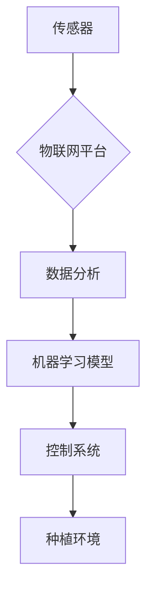

                 

## 智能园艺创业：家庭种植的科技支持

> 关键词：智能园艺、物联网、传感器、机器学习、数据分析、家庭种植、农业科技、垂直农场

## 1. 背景介绍

随着全球人口增长和城市化进程加速，传统农业面临着土地资源短缺、环境污染和生产效率低下等挑战。与此同时，人们对健康、新鲜和可持续的食物需求日益增长。智能园艺作为一种融合了农业和信息技术的创新模式，正逐渐成为解决这些问题的关键。

智能园艺利用传感器、物联网、数据分析和机器学习等先进技术，实现对种植环境的精准监测和控制，从而提高作物产量、品质和资源利用效率。它为家庭种植提供了全新的可能性，让每个人都能在家中轻松种植新鲜、健康的食材。

## 2. 核心概念与联系

智能园艺的核心概念包括：

* **物联网 (IoT):** 通过传感器、网络和数据平台，实现对种植环境的实时监测和控制。
* **传感器:** 用于监测土壤湿度、温度、光照、气体浓度等关键参数。
* **数据分析:** 对传感器数据进行分析，识别种植环境中的异常情况和潜在问题。
* **机器学习:** 利用算法从数据中学习，预测作物生长情况和优化种植方案。

**核心概念架构图:**



## 3. 核心算法原理 & 具体操作步骤

### 3.1  算法原理概述

智能园艺中常用的算法包括：

* **时间序列分析:** 用于预测作物生长情况和优化浇水、施肥等操作。
* **分类算法:** 用于识别作物病虫害和预测产量。
* **回归算法:** 用于优化种植环境参数，例如温度、湿度和光照。

### 3.2  算法步骤详解

以时间序列分析为例，其具体操作步骤如下：

1. **数据采集:** 收集土壤湿度、温度、光照等关键参数的历史数据。
2. **数据预处理:** 对采集到的数据进行清洗、转换和特征提取。
3. **模型选择:** 选择合适的时序分析模型，例如ARIMA、LSTM等。
4. **模型训练:** 利用历史数据训练选定的模型。
5. **模型评估:** 使用测试数据评估模型的预测精度。
6. **预测:** 利用训练好的模型预测未来作物生长情况。

### 3.3  算法优缺点

**优点:**

* 能够准确预测作物生长情况。
* 能够优化种植环境参数，提高作物产量和品质。
* 能够降低人工成本和资源消耗。

**缺点:**

* 需要大量的历史数据进行训练。
* 模型的准确性受数据质量和模型选择的影响。
* 需要专业的技术人员进行模型开发和维护。

### 3.4  算法应用领域

时间序列分析在智能园艺中的应用领域包括：

* **作物生长预测:** 预测作物成熟时间、产量和品质。
* **浇水和施肥优化:** 根据作物生长需求，自动调节浇水和施肥量。
* **病虫害预警:** 识别作物病虫害的早期迹象，及时采取防治措施。

## 4. 数学模型和公式 & 详细讲解 & 举例说明

### 4.1  数学模型构建

智能园艺中常用的数学模型包括：

* **Logistic回归模型:** 用于预测作物病虫害的发生概率。
* **线性回归模型:** 用于预测作物产量和品质。
* **ARIMA模型:** 用于预测作物生长情况。

### 4.2  公式推导过程

以Logistic回归模型为例，其目标函数为：

$$
L(w) = -\sum_{i=1}^{n} y_i \log(p_i) + (1-y_i) \log(1-p_i)
$$

其中：

* $w$ 为模型参数
* $n$ 为样本数量
* $y_i$ 为第 $i$ 个样本的真实标签 (0 或 1)
* $p_i$ 为模型预测的第 $i$ 个样本的概率

### 4.3  案例分析与讲解

假设我们想要预测番茄病虫害的发生概率，可以使用Logistic回归模型。我们可以收集番茄生长环境数据、病虫害发生情况等信息，并将其作为训练数据。通过训练模型，我们可以得到一个预测模型，用于预测新的番茄样本的病虫害发生概率。

## 5. 项目实践：代码实例和详细解释说明

### 5.1  开发环境搭建

智能园艺项目可以使用Python语言进行开发，常用的库包括：

* **NumPy:** 用于数值计算
* **Pandas:** 用于数据处理
* **Scikit-learn:** 用于机器学习算法
* **TensorFlow/PyTorch:** 用于深度学习算法

### 5.2  源代码详细实现

以下是一个简单的Python代码示例，用于预测番茄病虫害的发生概率：

```python
import pandas as pd
from sklearn.linear_model import LogisticRegression

# 加载数据
data = pd.read_csv("tomato_data.csv")

# 划分训练集和测试集
X_train, X_test, y_train, y_test = train_test_split(data.drop("disease", axis=1), data["disease"], test_size=0.2)

# 创建Logistic回归模型
model = LogisticRegression()

# 训练模型
model.fit(X_train, y_train)

# 评估模型性能
accuracy = model.score(X_test, y_test)
print("模型准确率:", accuracy)

# 预测新样本的病虫害发生概率
new_data = pd.DataFrame({
    "temperature": [25],
    "humidity": [70],
    "light": [6]
})
prediction = model.predict(new_data)
print("预测结果:", prediction)
```

### 5.3  代码解读与分析

这段代码首先加载了番茄生长环境数据和病虫害发生情况数据。然后，将数据划分成训练集和测试集。接着，创建了一个Logistic回归模型，并使用训练集训练模型。最后，评估了模型的性能，并使用模型预测新样本的病虫害发生概率。

### 5.4  运行结果展示

运行结果会显示模型的准确率和对新样本的预测结果。

## 6. 实际应用场景

智能园艺技术在家庭种植中具有广泛的应用场景：

* **家庭菜园:** 利用智能传感器和控制系统，实现对家庭菜园的精准管理，提高作物产量和品质。
* **垂直农场:** 在有限的空间内，利用垂直种植技术和智能控制系统，实现高效的作物生产。
* **室内种植:** 在室内环境下，利用LED灯光和智能控制系统，种植各种蔬菜、水果和花卉。

### 6.4  未来应用展望

未来，智能园艺技术将更加智能化、自动化和个性化。例如：

* **人工智能驱动的种植方案:** 利用人工智能算法，根据用户的需求和种植环境，自动制定个性化的种植方案。
* **无人化管理:** 利用机器人技术，实现对种植环境的自动监测、控制和维护。
* **可持续农业:** 利用智能园艺技术，减少水资源消耗、化肥使用和环境污染，实现可持续农业发展。

## 7. 工具和资源推荐

### 7.1  学习资源推荐

* **书籍:**
    * 《智能农业》
    * 《物联网技术》
    * 《机器学习实战》
* **在线课程:**
    * Coursera: 智能农业课程
    * edX: 物联网技术课程
    * Udacity: 机器学习课程

### 7.2  开发工具推荐

* **物联网平台:**
    * AWS IoT Core
    * Azure IoT Hub
    * Google Cloud IoT Core
* **数据分析工具:**
    * Jupyter Notebook
    * RStudio
* **机器学习库:**
    * Scikit-learn
    * TensorFlow
    * PyTorch

### 7.3  相关论文推荐

* **智能园艺中的机器学习应用:**
    * "Machine Learning for Precision Agriculture: A Review"
    * "Deep Learning for Crop Disease Detection: A Comprehensive Review"
* **智能园艺中的物联网技术应用:**
    * "Internet of Things in Smart Agriculture: A Review"
    * "Wireless Sensor Networks for Precision Agriculture: A Survey"

## 8. 总结：未来发展趋势与挑战

### 8.1  研究成果总结

智能园艺技术在近年来取得了显著的进展，为家庭种植提供了新的可能性。

### 8.2  未来发展趋势

未来，智能园艺技术将朝着更加智能化、自动化和个性化的方向发展。

### 8.3  面临的挑战

智能园艺技术还面临着一些挑战，例如：

* **数据安全和隐私保护:** 智能园艺系统收集大量的用户数据，需要确保数据的安全和隐私。
* **技术成本:** 智能园艺技术的开发和部署成本较高，需要降低成本才能推广应用。
* **技术标准:** 目前，智能园艺技术的标准化程度不高，需要制定统一的标准才能促进产业发展。

### 8.4  研究展望

未来，需要加强智能园艺技术的研发和应用，推动其在家庭种植领域的普及和发展。


## 9. 附录：常见问题与解答

* **Q1: 智能园艺系统需要多少成本才能搭建？**

* **A1:** 智能园艺系统的成本取决于系统的规模、功能和使用的设备。小型家庭种植系统成本相对较低，而大型垂直农场系统成本则较高。

* **Q2: 智能园艺系统是否需要专业技术人员操作？**

* **A2:** 一些简单的智能园艺系统可以由普通用户操作，而复杂的系统则需要专业技术人员进行维护和管理。

* **Q3: 智能园艺系统是否能保证作物产量和品质？**

* **A3:** 智能园艺系统可以提高作物产量和品质，但最终的产量和品质还取决于多种因素，例如作物品种、种植环境和管理水平。


作者：禅与计算机程序设计艺术 / Zen and the Art of Computer Programming 
<end_of_turn>

