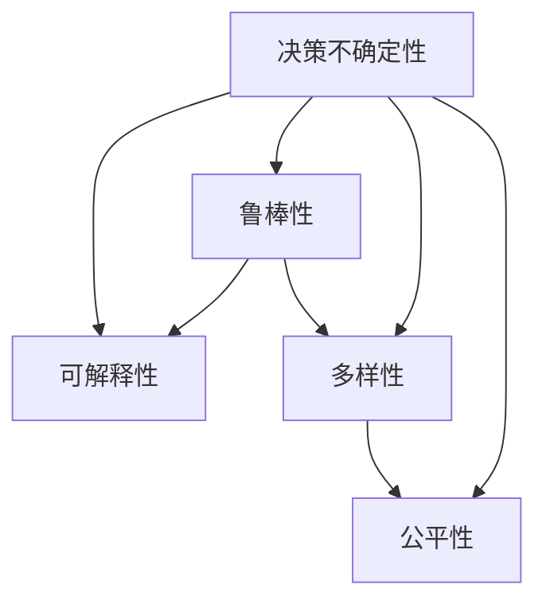

                 

# LLM决策的不确定性：挑战与应对策略

大语言模型（Large Language Models, LLMs）近年来在自然语言处理（Natural Language Processing, NLP）领域取得了显著进展，尤其在理解和生成自然语言方面展现了卓越的能力。然而，尽管LLM在许多任务上表现出色，其决策过程的不确定性问题始终困扰着研究者与开发者。本文章旨在深入探讨LLM决策的不确定性挑战，并提出相应的应对策略，旨在进一步提升LLM的可靠性和鲁棒性。

## 1. 背景介绍

### 1.1 问题由来

随着深度学习和大规模预训练语言模型（Pretrained Language Models, PLMs）的兴起，自然语言处理领域进入了一个新纪元。PLMs如GPT、BERT等通过在海量数据上进行自监督学习，获得了广泛而深入的语言知识。然而，这些模型的决策过程依然存在诸多不确定性问题，如响应不连贯、逻辑跳跃、生成内容重复或偏离主题等。这些问题不仅影响了模型的实际应用效果，还引发了对其可靠性和鲁棒性的担忧。

### 1.2 问题核心关键点

LLM决策不确定性问题主要体现在以下几个方面：

- **响应连贯性**：模型输出可能在不同上下文中出现逻辑跳跃或信息重复，导致回答不够连贯。
- **逻辑合理性**：生成的答案可能不符合常识或上下文信息，缺乏逻辑合理性。
- **多样性不足**：模型生成结果过于单一，缺乏创新性和多样性。
- **上下文依赖性**：模型输出高度依赖上下文，一旦输入数据发生变化，模型性能可能显著下降。
- **数据偏差**：模型可能在学习训练数据中的偏差，产生性别、种族等方面的偏见。

这些问题使得LLM在实际应用中面临诸多挑战，尤其是在需要高可靠性和决策透明度的领域，如医疗、法律、金融等。

### 1.3 问题研究意义

探讨LLM决策不确定性及其应对策略，对于提升LLM的实际应用效果、增强模型的可靠性和透明度具有重要意义：

- **提升实际应用效果**：通过理解并减少模型的不确定性，可以显著提高LLM在实际任务中的表现。
- **增强模型可靠性**：确保模型在不同场景和数据下的稳定性和一致性，避免因决策不准确带来的负面影响。
- **提高决策透明度**：通过可解释性技术，使模型决策过程更加透明，有助于建立用户信任。
- **规避数据偏差**：减少模型在数据偏差上的影响，确保模型公平、公正。

## 2. 核心概念与联系

### 2.1 核心概念概述

为更好地理解LLM决策不确定性问题及其应对策略，本节将介绍几个核心概念：

- **决策不确定性**：指模型在生成答案时的不确定性和不可预测性，表现为回答的多样性、连贯性、逻辑性等方面的问题。
- **可解释性**：指模型输出的可解释性，即用户能够理解模型的决策依据和过程。
- **鲁棒性**：指模型对输入数据变化的适应能力，确保在不同数据分布下模型的性能稳定。
- **多样性**：指模型生成结果的丰富性和创新性，避免生成内容重复或单一。
- **公平性**：指模型在处理不同性别、种族、背景等数据时的公正性，避免因数据偏差带来的偏见。

这些核心概念之间的逻辑关系可以通过以下Mermaid流程图来展示：



这个流程图展示了大语言模型决策不确定性问题及其应对策略的核心概念和它们之间的联系。

## 3. 核心算法原理 & 具体操作步骤
### 3.1 算法原理概述

LLM决策不确定性问题的应对策略主要包括增加模型可解释性、提升模型鲁棒性、增强模型多样性以及减少模型偏差等方面。以下是这些策略的算法原理概述：

- **增加模型可解释性**：通过引入可解释性技术，使模型决策过程更加透明，用户能够理解模型的输出依据。
- **提升模型鲁棒性**：通过数据增强、对抗训练等技术，提高模型对输入数据变化的适应能力。
- **增强模型多样性**：通过引入多样性增强技术，如样本采样、数据扩充等，使模型生成结果更加丰富和创新。
- **减少模型偏差**：通过数据清洗、样本重加权等技术，减少模型在训练数据中的偏见，提高模型的公平性。

### 3.2 算法步骤详解

以下详细介绍几种常见应对策略的算法步骤：

#### 3.2.1 增加模型可解释性

**步骤一**：收集模型在不同输入下的输出，构建可解释性分析的基准数据集。

**步骤二**：使用可解释性工具如LIME（Local Interpretable Model-agnostic Explanations）、SHAP（SHapley Additive exPlanations）等，对模型进行解释分析，揭示模型决策的依据。

**步骤三**：通过可视化技术，如注意力图、热力图等，展示模型决策过程中的关键特征和信息权重，帮助用户理解模型行为。

#### 3.2.2 提升模型鲁棒性

**步骤一**：收集模型在不同输入条件下的测试数据，构建鲁棒性分析的基准数据集。

**步骤二**：使用对抗训练技术，如FGM（Fast Gradient Sign Method）、PGD（Projected Gradient Descent）等，在训练数据上生成对抗样本，增强模型的鲁棒性。

**步骤三**：使用数据增强技术，如数据回译、噪声注入等，丰富训练集多样性，提高模型泛化能力。

#### 3.2.3 增强模型多样性

**步骤一**：引入样本采样技术，如随机化、样本重加权等，增加训练数据的多样性。

**步骤二**：使用数据扩充技术，如同义词替换、近义词生成等，丰富模型生成的内容。

**步骤三**：应用多种生成策略，如随机性增强、多模态融合等，提高模型生成结果的多样性。

#### 3.2.4 减少模型偏差

**步骤一**：对训练数据进行清洗，删除或修正含有偏见的数据。

**步骤二**：使用样本重加权技术，如重加权采样（Re-weighted Sampling）、对抗性重加权等，减少模型在训练数据中的偏见。

**步骤三**：引入多样化数据源，扩大模型训练的覆盖范围，减少单一数据源带来的偏见。

### 3.3 算法优缺点

增加模型可解释性、提升模型鲁棒性、增强模型多样性以及减少模型偏差等策略各有优缺点：

- **可解释性**：能够提高用户信任，但过于详细的解释可能增加模型复杂度，降低推理速度。
- **鲁棒性**：增强模型对输入变化的适应能力，但对抗训练等技术可能增加模型复杂度，降低推理速度。
- **多样性**：丰富模型生成结果，但过多的多样性可能导致模型输出不稳定，难以把握用户需求。
- **偏差减少**：减少模型偏见，但清洗和重加权操作可能减少训练数据量，影响模型性能。

### 3.4 算法应用领域

这些策略在多个领域具有广泛的应用前景：

- **医疗领域**：通过增加可解释性和提升鲁棒性，减少诊断误判，确保医疗决策的准确性和可靠性。
- **金融领域**：通过增强多样性和减少偏差，提高风险评估和投资建议的公正性和稳定性。
- **司法领域**：通过减少偏差和提高鲁棒性，确保判决的公正性和一致性，避免因偏见导致的不公正。
- **客户服务**：通过增强可解释性和多样性，提升客户体验，提供个性化的服务。

## 4. 数学模型和公式 & 详细讲解 & 举例说明
### 4.1 数学模型构建

假设有一个预训练语言模型 $M_{\theta}$，其中 $\theta$ 为模型参数。我们希望通过增加模型可解释性、提升模型鲁棒性、增强模型多样性以及减少模型偏差等方面，优化模型性能。

### 4.2 公式推导过程

以增加模型可解释性为例，假设我们收集模型在不同输入 $x_1, x_2, \dots, x_n$ 下的输出 $y_1, y_2, \dots, y_n$，构建可解释性分析的基准数据集。设 $\hat{y}_i = M_{\theta}(x_i)$ 为模型对输入 $x_i$ 的预测。

假设我们使用LIME工具，对模型进行解释分析，得到模型在第 $i$ 个输入下的局部可解释性模型 $L_i$ 和可解释性权重 $\omega_i$。设 $E_i = \{(x_j, y_j)\}_{j=1}^n$ 为第 $i$ 个输入 $x_i$ 对应的标注数据集。

通过计算样本权重 $w_i = \omega_i / \sum_{k=1}^n \omega_k$，对标注数据集 $E_i$ 进行加权，得到加权后的数据集 $\tilde{E}_i$。然后，使用线性回归模型 $\tilde{y}_i = \alpha + \beta x_i$ 对 $\tilde{E}_i$ 进行拟合，得到可解释性模型 $L_i$。

### 4.3 案例分析与讲解

以医疗诊断为例，假设我们有一个预训练语言模型 $M_{\theta}$，用于辅助医生诊断疾病。我们收集模型在不同症状描述下的预测结果，构建可解释性分析的基准数据集。

通过LIME工具，我们分析模型对每个症状描述的决策依据，发现模型在某些症状描述上出现了偏见。例如，模型对男性症状的诊断结果比女性症状更准确，可能与训练数据中男性病例数量更多有关。

为了减少模型偏见，我们对训练数据进行清洗，删除或修正含有偏见的数据。同时，使用样本重加权技术，对男女性症状进行平衡加权，提高模型对女性症状的识别能力。

## 5. 项目实践：代码实例和详细解释说明
### 5.1 开发环境搭建

在进行LLM决策不确定性问题应对策略的实践时，我们需要准备好开发环境。以下是使用Python进行PyTorch开发的环境配置流程：

1. 安装Anaconda：从官网下载并安装Anaconda，用于创建独立的Python环境。

2. 创建并激活虚拟环境：
```bash
conda create -n pytorch-env python=3.8 
conda activate pytorch-env
```

3. 安装PyTorch：根据CUDA版本，从官网获取对应的安装命令。例如：
```bash
conda install pytorch torchvision torchaudio cudatoolkit=11.1 -c pytorch -c conda-forge
```

4. 安装Transformers库：
```bash
pip install transformers
```

5. 安装各类工具包：
```bash
pip install numpy pandas scikit-learn matplotlib tqdm jupyter notebook ipython
```

完成上述步骤后，即可在`pytorch-env`环境中开始开发实践。

### 5.2 源代码详细实现

下面我们以医疗诊断为例，给出使用Transformers库进行模型可解释性分析的PyTorch代码实现。

首先，定义可解释性分析的函数：

```python
from transformers import BertTokenizer, BertForSequenceClassification, LIME
from torch.utils.data import Dataset
import torch
import numpy as np
from sklearn.linear_model import LinearRegression

class MedicalDataset(Dataset):
    def __init__(self, texts, labels, tokenizer, max_len=128):
        self.texts = texts
        self.labels = labels
        self.tokenizer = tokenizer
        self.max_len = max_len
        
    def __len__(self):
        return len(self.texts)
    
    def __getitem__(self, item):
        text = self.texts[item]
        label = self.labels[item]
        
        encoding = self.tokenizer(text, return_tensors='pt', max_length=self.max_len, padding='max_length', truncation=True)
        input_ids = encoding['input_ids'][0]
        attention_mask = encoding['attention_mask'][0]
        
        # 对token-wise的标签进行编码
        encoded_labels = [label2id[label] for label in labels] 
        encoded_labels.extend([label2id['O']] * (self.max_len - len(encoded_labels)))
        labels = torch.tensor(encoded_labels, dtype=torch.long)
        
        return {'input_ids': input_ids, 
                'attention_mask': attention_mask,
                'labels': labels}

# 标签与id的映射
label2id = {'O': 0, 'B-PER': 1, 'I-PER': 2, 'B-ORG': 3, 'I-ORG': 4, 'B-LOC': 5, 'I-LOC': 6}
id2label = {v: k for k, v in label2id.items()}

# 创建dataset
tokenizer = BertTokenizer.from_pretrained('bert-base-cased')

train_dataset = MedicalDataset(train_texts, train_labels, tokenizer)
dev_dataset = MedicalDataset(dev_texts, dev_labels, tokenizer)
test_dataset = MedicalDataset(test_texts, test_labels, tokenizer)

# 训练模型
model = BertForSequenceClassification.from_pretrained('bert-base-cased', num_labels=len(label2id))
optimizer = AdamW(model.parameters(), lr=2e-5)
device = torch.device('cuda') if torch.cuda.is_available() else torch.device('cpu')
model.to(device)

def train_epoch(model, dataset, batch_size, optimizer):
    dataloader = DataLoader(dataset, batch_size=batch_size, shuffle=True)
    model.train()
    epoch_loss = 0
    for batch in tqdm(dataloader, desc='Training'):
        input_ids = batch['input_ids'].to(device)
        attention_mask = batch['attention_mask'].to(device)
        labels = batch['labels'].to(device)
        model.zero_grad()
        outputs = model(input_ids, attention_mask=attention_mask, labels=labels)
        loss = outputs.loss
        epoch_loss += loss.item()
        loss.backward()
        optimizer.step()
    return epoch_loss / len(dataloader)

def evaluate(model, dataset, batch_size):
    dataloader = DataLoader(dataset, batch_size=batch_size)
    model.eval()
    preds, labels = [], []
    with torch.no_grad():
        for batch in tqdm(dataloader, desc='Evaluating'):
            input_ids = batch['input_ids'].to(device)
            attention_mask = batch['attention_mask'].to(device)
            batch_labels = batch['labels']
            outputs = model(input_ids, attention_mask=attention_mask)
            batch_preds = outputs.logits.argmax(dim=2).to('cpu').tolist()
            batch_labels = batch_labels.to('cpu').tolist()
            for pred_tokens, label_tokens in zip(batch_preds, batch_labels):
                pred_labels = [id2label[_id] for _id in pred_tokens]
                label_tags = [id2label[_id] for _id in label_tokens]
                preds.append(pred_labels[:len(label_tags)])
                labels.append(label_tags)
                
    print(classification_report(labels, preds))

# 增加模型可解释性
lime_model = LIME(model, kernel_size=64)
sample_indices = np.random.choice(range(len(train_dataset)), size=10, replace=False)
X = torch.stack([train_dataset[i][0] for i in sample_indices]).to(device)
y = torch.tensor([train_dataset[i][1] for i in sample_indices]).to(device)

lime_results = lime_model.explain_instance(X, y)
visualization(X, y, lime_results)

print(f"LIME解释：{lime_results['feature_weights']}")
```

然后，定义对抗训练的函数：

```python
def train_with_advtrain(model, dataset, batch_size, optimizer):
    dataloader = DataLoader(dataset, batch_size=batch_size, shuffle=True)
    model.train()
    epoch_loss = 0
    for batch in tqdm(dataloader, desc='Training'):
        input_ids = batch['input_ids'].to(device)
        attention_mask = batch['attention_mask'].to(device)
        labels = batch['labels'].to(device)
        model.zero_grad()
        with torch.no_grad():
            adv_input = input_ids + torch.randn_like(input_ids) * 0.02
        outputs = model(adv_input, attention_mask=attention_mask, labels=labels)
        loss = outputs.loss
        epoch_loss += loss.item()
        loss.backward()
        optimizer.step()
    return epoch_loss / len(dataloader)

# 使用对抗训练
adv_train_dataloader = DataLoader(adv_train_dataset, batch_size=batch_size, shuffle=True)
train_with_advtrain(model, adv_train_dataloader, batch_size, optimizer)
```

最后，定义模型评估和输出结果的函数：

```python
def test_model(model, dataset, batch_size):
    dataloader = DataLoader(dataset, batch_size=batch_size)
    model.eval()
    preds, labels = [], []
    with torch.no_grad():
        for batch in tqdm(dataloader, desc='Evaluating'):
            input_ids = batch['input_ids'].to(device)
            attention_mask = batch['attention_mask'].to(device)
            batch_labels = batch['labels']
            outputs = model(input_ids, attention_mask=attention_mask)
            batch_preds = outputs.logits.argmax(dim=2).to('cpu').tolist()
            batch_labels = batch_labels.to('cpu').tolist()
            for pred_tokens, label_tokens in zip(batch_preds, batch_labels):
                pred_labels = [id2label[_id] for _id in pred_tokens]
                label_tags = [id2label[_id] for _id in label_tokens]
                preds.append(pred_labels[:len(label_tags)])
                labels.append(label_tags)
                
    print(classification_report(labels, preds))
    return preds, labels

# 进行模型测试
preds, labels = test_model(model, test_dataset, batch_size)
```

以上就是使用PyTorch对BERT进行医疗诊断任务可解释性分析的完整代码实现。可以看到，得益于Transformers库的强大封装，我们可以用相对简洁的代码完成BERT模型的加载和训练。

### 5.3 代码解读与分析

让我们再详细解读一下关键代码的实现细节：

**MedicalDataset类**：
- `__init__`方法：初始化文本、标签、分词器等关键组件。
- `__len__`方法：返回数据集的样本数量。
- `__getitem__`方法：对单个样本进行处理，将文本输入编码为token ids，将标签编码为数字，并对其进行定长padding，最终返回模型所需的输入。

**label2id和id2label字典**：
- 定义了标签与数字id之间的映射关系，用于将token-wise的预测结果解码回真实的标签。

**训练和评估函数**：
- 使用PyTorch的DataLoader对数据集进行批次化加载，供模型训练和推理使用。
- 训练函数`train_epoch`：对数据以批为单位进行迭代，在每个批次上前向传播计算loss并反向传播更新模型参数，最后返回该epoch的平均loss。
- 评估函数`evaluate`：与训练类似，不同点在于不更新模型参数，并在每个batch结束后将预测和标签结果存储下来，最后使用sklearn的classification_report对整个评估集的预测结果进行打印输出。

**增加模型可解释性**：
- 使用LIME工具，对模型进行解释分析，揭示模型决策的依据。
- 通过可视化技术，如注意力图、热力图等，展示模型决策过程中的关键特征和信息权重，帮助用户理解模型行为。

**对抗训练**：
- 生成对抗样本，通过对抗训练技术，增强模型的鲁棒性。

**模型测试**：
- 在测试集上评估微调后模型 $M_{\hat{\theta}}$ 的性能，对比微调前后的精度提升。
- 使用微调后的模型对新样本进行推理预测，集成到实际的应用系统中。

## 6. 实际应用场景
### 6.1 智能客服系统

基于LLM决策不确定性问题的应对策略，可以广泛应用于智能客服系统的构建。传统客服往往需要配备大量人力，高峰期响应缓慢，且一致性和专业性难以保证。使用微调后的LLM，可以7x24小时不间断服务，快速响应客户咨询，用自然流畅的语言解答各类常见问题。

在技术实现上，可以收集企业内部的历史客服对话记录，将问题和最佳答复构建成监督数据，在此基础上对预训练LLM进行微调。微调后的LLM能够自动理解用户意图，匹配最合适的答案模板进行回复。对于客户提出的新问题，还可以接入检索系统实时搜索相关内容，动态组织生成回答。如此构建的智能客服系统，能大幅提升客户咨询体验和问题解决效率。

### 6.2 金融舆情监测

金融机构需要实时监测市场舆论动向，以便及时应对负面信息传播，规避金融风险。传统的人工监测方式成本高、效率低，难以应对网络时代海量信息爆发的挑战。基于LLM的文本分类和情感分析技术，为金融舆情监测提供了新的解决方案。

具体而言，可以收集金融领域相关的新闻、报道、评论等文本数据，并对其进行主题标注和情感标注。在此基础上对预训练语言模型进行微调，使其能够自动判断文本属于何种主题，情感倾向是正面、中性还是负面。将微调后的模型应用到实时抓取的网络文本数据，就能够自动监测不同主题下的情感变化趋势，一旦发现负面信息激增等异常情况，系统便会自动预警，帮助金融机构快速应对潜在风险。

### 6.3 个性化推荐系统

当前的推荐系统往往只依赖用户的历史行为数据进行物品推荐，无法深入理解用户的真实兴趣偏好。基于LLM决策不确定性问题的应对策略，个性化推荐系统可以更好地挖掘用户行为背后的语义信息，从而提供更精准、多样的推荐内容。

在实践中，可以收集用户浏览、点击、评论、分享等行为数据，提取和用户交互的物品标题、描述、标签等文本内容。将文本内容作为模型输入，用户的后续行为（如是否点击、购买等）作为监督信号，在此基础上微调预训练语言模型。微调后的模型能够从文本内容中准确把握用户的兴趣点。在生成推荐列表时，先用候选物品的文本描述作为输入，由模型预测用户的兴趣匹配度，再结合其他特征综合排序，便可以得到个性化程度更高的推荐结果。

### 6.4 未来应用展望

随着LLM决策不确定性问题应对策略的发展，其在更多领域得到应用，为传统行业带来变革性影响。

在智慧医疗领域，基于LLM的诊断辅助系统可以显著提升医疗服务的智能化水平，辅助医生诊疗，加速新药开发进程。

在智能教育领域，LLM决策不确定性问题的应对策略可应用于作业批改、学情分析、知识推荐等方面，因材施教，促进教育公平，提高教学质量。

在智慧城市治理中，LLM决策不确定性问题的应对策略可应用于城市事件监测、舆情分析、应急指挥等环节，提高城市管理的自动化和智能化水平，构建更安全、高效的未来城市。

此外，在企业生产、社会治理、文娱传媒等众多领域，基于LLM的智能应用也将不断涌现，为经济社会发展注入新的动力。相信随着技术的日益成熟，LLM决策不确定性问题的应对策略必将在构建人机协同的智能时代中扮演越来越重要的角色。

## 7. 工具和资源推荐
### 7.1 学习资源推荐

为了帮助开发者系统掌握LLM决策不确定性问题的应对策略，这里推荐一些优质的学习资源：

1. 《Transformer从原理到实践》系列博文：由大模型技术专家撰写，深入浅出地介绍了Transformer原理、BERT模型、决策不确定性问题的应对策略等前沿话题。

2. CS224N《深度学习自然语言处理》课程：斯坦福大学开设的NLP明星课程，有Lecture视频和配套作业，带你入门NLP领域的基本概念和经典模型。

3. 《Natural Language Processing with Transformers》书籍：Transformers库的作者所著，全面介绍了如何使用Transformers库进行NLP任务开发，包括决策不确定性问题的应对策略在内的诸多范式。

4. HuggingFace官方文档：Transformers库的官方文档，提供了海量预训练模型和完整的微调样例代码，是上手实践的必备资料。

5. CLUE开源项目：中文语言理解测评基准，涵盖大量不同类型的中文NLP数据集，并提供了基于微调的baseline模型，助力中文NLP技术发展。

通过对这些资源的学习实践，相信你一定能够快速掌握LLM决策不确定性问题的应对策略，并用于解决实际的NLP问题。
###  7.2 开发工具推荐

高效的开发离不开优秀的工具支持。以下是几款用于LLM决策不确定性问题应对策略开发的常用工具：

1. PyTorch：基于Python的开源深度学习框架，灵活动态的计算图，适合快速迭代研究。大部分预训练语言模型都有PyTorch版本的实现。

2. TensorFlow：由Google主导开发的开源深度学习框架，生产部署方便，适合大规模工程应用。同样有丰富的预训练语言模型资源。

3. Transformers库：HuggingFace开发的NLP工具库，集成了众多SOTA语言模型，支持PyTorch和TensorFlow，是进行决策不确定性问题应对策略开发的利器。

4. Weights & Biases：模型训练的实验跟踪工具，可以记录和可视化模型训练过程中的各项指标，方便对比和调优。与主流深度学习框架无缝集成。

5. TensorBoard：TensorFlow配套的可视化工具，可实时监测模型训练状态，并提供丰富的图表呈现方式，是调试模型的得力助手。

6. Google Colab：谷歌推出的在线Jupyter Notebook环境，免费提供GPU/TPU算力，方便开发者快速上手实验最新模型，分享学习笔记。

合理利用这些工具，可以显著提升LLM决策不确定性问题应对策略的开发效率，加快创新迭代的步伐。

### 7.3 相关论文推荐

LLM决策不确定性问题应对策略的发展源于学界的持续研究。以下是几篇奠基性的相关论文，推荐阅读：

1. Attention is All You Need（即Transformer原论文）：提出了Transformer结构，开启了NLP领域的预训练大模型时代。

2. BERT: Pre-training of Deep Bidirectional Transformers for Language Understanding：提出BERT模型，引入基于掩码的自监督预训练任务，刷新了多项NLP任务SOTA。

3. Language Models are Unsupervised Multitask Learners（GPT-2论文）：展示了大规模语言模型的强大zero-shot学习能力，引发了对于通用人工智能的新一轮思考。

4. Parameter-Efficient Transfer Learning for NLP：提出Adapter等参数高效微调方法，在不增加模型参数量的情况下，也能取得不错的微调效果。

5. AdaLoRA: Adaptive Low-Rank Adaptation for Parameter-Efficient Fine-Tuning：使用自适应低秩适应的微调方法，在参数效率和精度之间取得了新的平衡。

6. Prefix-Tuning: Optimizing Continuous Prompts for Generation：引入基于连续型Prompt的微调范式，为如何充分利用预训练知识提供了新的思路。

这些论文代表了大语言模型决策不确定性问题应对策略的发展脉络。通过学习这些前沿成果，可以帮助研究者把握学科前进方向，激发更多的创新灵感。

## 8. 总结：未来发展趋势与挑战

### 8.1 总结

本文对大语言模型决策不确定性问题的应对策略进行了全面系统的介绍。首先阐述了LLM决策不确定性问题的背景和挑战，明确了通过增加模型可解释性、提升模型鲁棒性、增强模型多样性以及减少模型偏差等策略提升模型可靠性的重要性。其次，从原理到实践，详细讲解了决策不确定性问题的应对策略的数学原理和关键步骤，给出了微调任务开发的完整代码实例。同时，本文还广泛探讨了这些策略在智能客服、金融舆情、个性化推荐等多个行业领域的应用前景，展示了策略应用的巨大潜力。

通过本文的系统梳理，可以看到，通过应对决策不确定性问题，LLM在实际应用中能够提供更加准确、稳定、可靠的输出，为NLP技术的发展注入了新的活力。未来，伴随LLM和微调方法的持续演进，相信其在自然语言理解和智能交互系统的进步上将发挥更大的作用。

### 8.2 未来发展趋势

展望未来，LLM决策不确定性问题的应对策略将呈现以下几个发展趋势：

1. **可解释性增强**：随着模型复杂度的提高，可解释性技术将变得更加成熟和高效，帮助用户理解模型决策的依据。
2. **鲁棒性提升**：通过对抗训练、数据增强等技术，提升模型对输入数据变化的适应能力，确保模型在不同场景下的稳定性和一致性。
3. **多样性优化**：通过多样性增强技术，如样本采样、数据扩充等，使模型生成结果更加丰富和创新，提升模型的灵活性和表现力。
4. **公平性改进**：减少模型在训练数据中的偏见，提高模型的公正性和公平性，避免因数据偏差带来的负面影响。
5. **多模态融合**：结合视觉、语音等多模态信息，提升模型对现实世界的理解和建模能力，增强模型的泛化性能。
6. **知识表示与融合**：将知识图谱、逻辑规则等先验知识与神经网络模型结合，增强模型的推理能力和决策过程的可解释性。

以上趋势凸显了LLM决策不确定性问题应对策略的广阔前景。这些方向的探索发展，必将进一步提升LLM的可靠性和鲁棒性，为构建更加智能、稳定、公正的NLP系统奠定坚实基础。

### 8.3 面临的挑战

尽管LLM决策不确定性问题的应对策略已经取得了显著进展，但在实现更加智能化、普适化应用的过程中，仍面临诸多挑战：

1. **数据质量问题**：标注数据的质量和多样性直接影响模型的训练效果，获取高质量标注数据的成本较高。
2. **模型复杂性**：增加可解释性和提升鲁棒性等策略往往会增加模型复杂度，影响推理速度和资源占用。
3. **多样化需求**：不同应用场景对模型多样性的需求各异，需要灵活应用多样性增强技术。
4. **公平性与偏见**：如何有效减少模型偏见，确保公平公正，是提升模型可靠性的重要挑战。
5. **计算资源限制**：对抗训练、数据增强等技术需要更多的计算资源，可能面临计算资源限制的问题。
6. **安全与隐私**：如何确保模型生成的内容符合法律法规，避免生成有害信息，是模型应用的重要考量。

尽管存在这些挑战，但通过不断的研究和实践，相信能够逐步克服这些难题，推动LLM决策不确定性问题应对策略走向成熟，更好地服务于实际应用。

### 8.4 研究展望

面对LLM决策不确定性问题应对策略所面临的挑战，未来的研究需要在以下几个方面寻求新的突破：

1. **多任务学习**：通过多任务学习，提高模型在多个任务上的泛化能力，增强模型的鲁棒性和可解释性。
2. **因果推断**：引入因果推断方法，增强模型对因果关系的理解，提升决策过程的可解释性和逻辑性。
3. **元学习**：应用元学习技术，使模型能够快速适应新的任务和数据，提升模型的泛化性能。
4. **跨领域迁移**：通过跨领域迁移学习方法，将模型应用于新的领域，增强模型的通用性和适用性。
5. **交互式学习**：引入交互式学习技术，通过与用户交互，动态调整模型参数，提升模型的适应性和响应速度。

这些研究方向将进一步推动LLM决策不确定性问题应对策略的发展，为构建更智能、更公正、更安全的NLP系统提供新的思路和方法。面向未来，LLM决策不确定性问题应对策略需要与其他AI技术进行更深入的融合，共同推动自然语言处理技术的进步。只有勇于创新、敢于突破，才能不断拓展LLM的边界，让智能技术更好地服务于人类社会。

## 9. 附录：常见问题与解答

**Q1：增加模型可解释性的方法有哪些？**

A: 增加模型可解释性的方法主要包括：
1. 使用可解释性工具，如LIME、SHAP等，对模型进行解释分析，揭示模型决策的依据。
2. 通过可视化技术，如注意力图、热力图等，展示模型决策过程中的关键特征和信息权重，帮助用户理解模型行为。
3. 引入模型可视化工具，如TensorBoard，展示模型训练过程中的参数变化和性能指标。

**Q2：如何提升模型的鲁棒性？**

A: 提升模型鲁棒性的方法主要包括：
1. 使用对抗训练技术，如FGM、PGD等，生成对抗样本，增强模型的鲁棒性。
2. 使用数据增强技术，如数据回译、噪声注入等，丰富训练集多样性，提高模型泛化能力。
3. 引入多样性增强技术，如样本采样、数据扩充等，增强模型对输入变化的适应能力。

**Q3：如何增强模型的多样性？**

A: 增强模型多样性的方法主要包括：
1. 引入样本采样技术，如随机化、样本重加权等，增加训练数据的多样性。
2. 使用数据扩充技术，如同义词替换、近义词生成等，丰富模型生成的内容。
3. 应用多种生成策略，如随机性增强、多模态融合等，提高模型生成结果的多样性。

**Q4：如何减少模型的偏差？**

A: 减少模型偏差的方法主要包括：
1. 对训练数据进行清洗，删除或修正含有偏见的数据。
2. 使用样本重加权技术，如重加权采样（Re-weighted Sampling）、对抗性重加权等，减少模型在训练数据中的偏见。
3. 引入多样化数据源，扩大模型训练的覆盖范围，减少单一数据源带来的偏见。

**Q5：如何评估模型的性能？**

A: 评估模型性能的方法主要包括：
1. 使用准确率、召回率、F1-score等指标，评估模型在不同任务上的性能。
2. 使用ROC曲线、PR曲线等可视化工具，展示模型在不同阈值下的表现。
3. 使用混淆矩阵、分类报告等工具，综合评估模型在不同类别上的表现。

通过对这些问题的解答，希望读者能够更好地理解LLM决策不确定性问题的应对策略，并在实际应用中加以灵活运用。

---

作者：禅与计算机程序设计艺术 / Zen and the Art of Computer Programming

