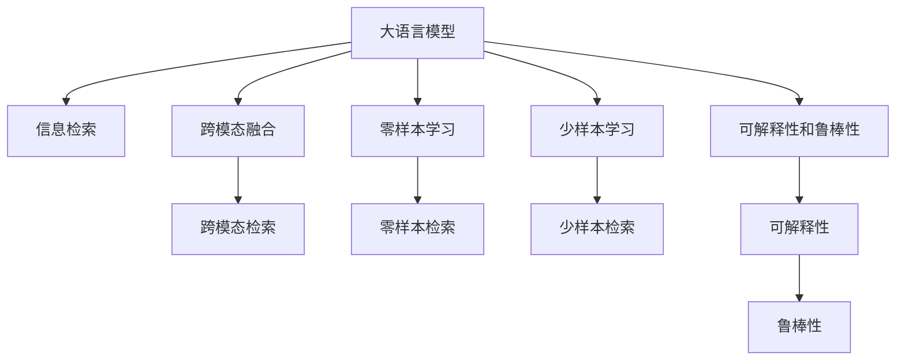

                 

# LLM在信息检索领域的技术创新

## 1. 背景介绍

### 1.1 问题由来

信息检索系统（IR）的核心目标是通过语义理解和匹配技术，快速找到用户需要的信息。传统的基于关键词匹配的IR系统，存在明显的语义模糊和结果泛化能力不足的问题，越来越难以满足用户的实际需求。随着深度学习技术和大语言模型（LLM）的兴起，信息检索领域正在经历一场颠覆式的变革。

### 1.2 问题核心关键点

LLM在信息检索中的创新点主要体现在以下几个方面：
1. **语义理解能力的提升**：LLM能够理解自然语言文本的深层语义，提取更丰富的文本特征，提升检索系统对用户查询的语义匹配能力。
2. **跨模态融合**：LLM可以与图像、语音等多种数据进行融合，提升系统对多源数据的处理能力，扩展信息检索的范畴。
3. **少样本学习和零样本学习**：LLM能够在仅有少量样本或无样本的情况下进行检索，降低对标注数据的依赖，提高模型的灵活性和泛化能力。
4. **可解释性和鲁棒性**：通过LLM，可以更加透明地理解检索系统的决策过程，增强模型的可解释性；同时，LLM对噪音和干扰具有较强的鲁棒性，能够更准确地处理不同类型的数据。

## 2. 核心概念与联系

### 2.1 核心概念概述

- **大语言模型（LLM）**：以自回归（如GPT）或自编码（如BERT）为代表的大规模预训练语言模型。通过在大规模无标签文本数据上进行预训练，学习到丰富的语言知识和常识，具备强大的语言理解和生成能力。
- **信息检索（IR）**：利用计算机技术对信息集合进行排序和检索，帮助用户快速定位到所需信息的过程。
- **跨模态信息检索**：结合图像、语音、文本等多种数据源，提升系统的信息融合能力和检索准确性。
- **零样本学习和少样本学习**：在只有少量标注数据或无标注数据的情况下，利用语言模型进行推理和生成，实现信息检索。
- **可解释性和鲁棒性**：保证模型的决策过程透明，增强对噪音和干扰的抵抗能力。

这些核心概念之间的联系可以通过以下Mermaid流程图来展示：



这个流程图展示了大语言模型在信息检索中的核心概念及其之间的关系：

1. 大语言模型通过预训练获得基础能力。
2. 信息检索利用大语言模型的语义理解能力，实现更精准的检索。
3. 跨模态融合和大语言模型的多模态支持，提升系统的信息处理能力。
4. 零样本学习和少样本学习扩展了信息检索的场景，降低了对标注数据的依赖。
5. 可解释性和鲁棒性保证了系统的透明性和稳定性。

这些概念共同构成了大语言模型在信息检索中的应用框架，使其能够在各种场景下发挥强大的语义匹配和生成能力。

## 3. 核心算法原理 & 具体操作步骤

### 3.1 算法原理概述

基于大语言模型的信息检索，主要分为两个阶段：预训练和微调。预训练阶段，模型在大规模无标签文本数据上进行自监督学习，学习到通用的语言表示。微调阶段，模型在特定信息检索任务上进行有监督学习，优化模型在特定任务上的性能。

形式化地，假设预训练语言模型为 $M_{\theta}$，其中 $\theta$ 为预训练得到的模型参数。给定信息检索任务的标注数据集 $D=\{(x_i, y_i)\}_{i=1}^N$，其中 $x_i$ 为查询文本，$y_i$ 为目标文档的排名或相关性得分。微调的目标是找到新的模型参数 $\hat{\theta}$，使得模型在特定任务上的表现最优。

微调的目标函数可以定义为：

$$
\hat{\theta} = \mathop{\arg\min}_{\theta} \sum_{i=1}^N \ell(M_{\theta}(x_i),y_i)
$$

其中 $\ell$ 为损失函数，用于衡量模型输出与真实标签之间的差异。常见的损失函数包括交叉熵损失、均方误差损失等。

### 3.2 算法步骤详解

基于大语言模型的信息检索通常包括以下关键步骤：

**Step 1: 准备预训练模型和数据集**
- 选择合适的预训练语言模型 $M_{\theta}$ 作为初始化参数，如 BERT、GPT 等。
- 准备信息检索任务的标注数据集 $D$，划分为训练集、验证集和测试集。一般要求标注数据与预训练数据的分布不要差异过大。

**Step 2: 设计任务适配层**
- 根据任务类型，在预训练模型顶层设计合适的输出层和损失函数。
- 对于文档检索任务，通常在顶层添加文档嵌入和相关性得分的计算模块。
- 对于问答系统，通常使用语言模型的解码器输出概率分布，并以负对数似然为损失函数。

**Step 3: 设置微调超参数**
- 选择合适的优化算法及其参数，如 AdamW、SGD 等，设置学习率、批大小、迭代轮数等。
- 设置正则化技术及强度，包括权重衰减、Dropout、Early Stopping 等。
- 确定冻结预训练参数的策略，如仅微调顶层，或全部参数都参与微调。

**Step 4: 执行梯度训练**
- 将训练集数据分批次输入模型，前向传播计算损失函数。
- 反向传播计算参数梯度，根据设定的优化算法和学习率更新模型参数。
- 周期性在验证集上评估模型性能，根据性能指标决定是否触发 Early Stopping。
- 重复上述步骤直到满足预设的迭代轮数或 Early Stopping 条件。

**Step 5: 测试和部署**
- 在测试集上评估微调后模型 $M_{\hat{\theta}}$ 的性能，对比微调前后的精度提升。
- 使用微调后的模型对新样本进行推理预测，集成到实际的信息检索系统中。
- 持续收集新的数据，定期重新微调模型，以适应数据分布的变化。

以上是基于大语言模型信息检索的一般流程。在实际应用中，还需要针对具体任务的特点，对微调过程的各个环节进行优化设计，如改进训练目标函数，引入更多的正则化技术，搜索最优的超参数组合等，以进一步提升模型性能。

### 3.3 算法优缺点

基于大语言模型的信息检索方法具有以下优点：
1. 简单高效。只需准备少量标注数据，即可对预训练模型进行快速适配，获得较大的性能提升。
2. 通用适用。适用于各种信息检索任务，包括文档检索、问答系统、对话系统等，设计简单的任务适配层即可实现微调。
3. 零样本和少样本学习能力强。利用大语言模型的零样本和少样本学习能力，可以在仅有少量样本或无样本的情况下进行推理和生成，实现信息检索。
4. 鲁棒性高。大语言模型对噪音和干扰具有较强的鲁棒性，能够更准确地处理不同类型的数据。

同时，该方法也存在一定的局限性：
1. 依赖标注数据。微调的效果很大程度上取决于标注数据的质量和数量，获取高质量标注数据的成本较高。
2. 迁移能力有限。当目标任务与预训练数据的分布差异较大时，微调的性能提升有限。
3. 可解释性不足。微调模型的决策过程通常缺乏可解释性，难以对其推理逻辑进行分析和调试。
4. 对计算资源要求高。大语言模型的参数量较大，对计算资源的需求较高，部署和运行成本较高。

尽管存在这些局限性，但就目前而言，基于大语言模型的信息检索方法仍是大规模预训练语言模型应用的重要方向之一。未来相关研究的重点在于如何进一步降低对标注数据的依赖，提高模型的少样本学习和跨领域迁移能力，同时兼顾可解释性和效率等因素。

### 3.4 算法应用领域

基于大语言模型的信息检索方法已经在多个领域得到了广泛应用，例如：

- **文档检索**：如Google搜索、Bing搜索等，利用预训练语言模型对查询和文档进行语义匹配，提升检索精度。
- **问答系统**：如Siri、Google Assistant等，利用预训练语言模型理解和生成自然语言，回答用户问题。
- **对话系统**：如WeChat客服、智能助理等，利用预训练语言模型进行对话生成和意图识别，提升用户体验。
- **跨模态检索**：如ImageNet检索、语音识别等，利用大语言模型与图像、语音等多模态数据进行联合检索，提升系统的泛化能力。

除了上述这些经典任务外，大语言模型在信息检索领域的应用还在不断拓展，如可控文本生成、自然语言推理、情感分析等，为信息检索技术带来了全新的突破。随着预训练模型和信息检索方法的持续演进，相信信息检索系统将在更广阔的应用领域大放异彩。

## 4. 数学模型和公式 & 详细讲解 & 举例说明

### 4.1 数学模型构建

本节将使用数学语言对基于大语言模型的信息检索过程进行更加严格的刻画。

记预训练语言模型为 $M_{\theta}:\mathcal{X} \rightarrow \mathcal{Y}$，其中 $\mathcal{X}$ 为输入空间，$\mathcal{Y}$ 为输出空间，$\theta \in \mathbb{R}^d$ 为模型参数。假设信息检索任务的训练集为 $D=\{(x_i,y_i)\}_{i=1}^N, x_i \in \mathcal{X}, y_i \in \mathbb{R}$。

定义模型 $M_{\theta}$ 在输入 $x$ 上的输出为 $\hat{y}=M_{\theta}(x) \in \mathbb{R}$，表示模型对输入的预测值。真实标签 $y \in \mathbb{R}$。则信息检索任务的经验风险为：

$$
\mathcal{L}(\theta) = \frac{1}{N} \sum_{i=1}^N (\hat{y}_i - y_i)^2
$$

微调的优化目标是最小化经验风险，即找到最优参数：

$$
\theta^* = \mathop{\arg\min}_{\theta} \mathcal{L}(\theta)
$$

在实践中，我们通常使用基于梯度的优化算法（如SGD、Adam等）来近似求解上述最优化问题。设 $\eta$ 为学习率，$\lambda$ 为正则化系数，则参数的更新公式为：

$$
\theta \leftarrow \theta - \eta \nabla_{\theta}\mathcal{L}(\theta) - \eta\lambda\theta
$$

其中 $\nabla_{\theta}\mathcal{L}(\theta)$ 为损失函数对参数 $\theta$ 的梯度，可通过反向传播算法高效计算。

### 4.2 公式推导过程

以下我们以文档检索任务为例，推导平方误差损失函数及其梯度的计算公式。

假设模型 $M_{\theta}$ 在输入 $x$ 上的输出为 $\hat{y}=M_{\theta}(x)$，表示模型对文档的相关性得分预测。真实标签 $y$ 为文档的实际相关性得分。则文档检索任务的平方误差损失函数定义为：

$$
\ell(M_{\theta}(x),y) = (\hat{y} - y)^2
$$

将其代入经验风险公式，得：

$$
\mathcal{L}(\theta) = \frac{1}{N}\sum_{i=1}^N (\hat{y}_i - y_i)^2
$$

根据链式法则，损失函数对参数 $\theta_k$ 的梯度为：

$$
\frac{\partial \mathcal{L}(\theta)}{\partial \theta_k} = -\frac{2}{N}\sum_{i=1}^N \frac{\partial \hat{y}_i}{\partial \theta_k}(\hat{y}_i - y_i)
$$

其中 $\frac{\partial \hat{y}_i}{\partial \theta_k}$ 可进一步递归展开，利用自动微分技术完成计算。

在得到损失函数的梯度后，即可带入参数更新公式，完成模型的迭代优化。重复上述过程直至收敛，最终得到适应文档检索任务的最优模型参数 $\theta^*$。

## 5. 项目实践：代码实例和详细解释说明

### 5.1 开发环境搭建

在进行信息检索实践前，我们需要准备好开发环境。以下是使用Python进行PyTorch开发的环境配置流程：

1. 安装Anaconda：从官网下载并安装Anaconda，用于创建独立的Python环境。

2. 创建并激活虚拟环境：
```bash
conda create -n ir-env python=3.8 
conda activate ir-env
```

3. 安装PyTorch：根据CUDA版本，从官网获取对应的安装命令。例如：
```bash
conda install pytorch torchvision torchaudio cudatoolkit=11.1 -c pytorch -c conda-forge
```

4. 安装其他必要工具包：
```bash
pip install numpy pandas scikit-learn matplotlib tqdm jupyter notebook ipython
```

完成上述步骤后，即可在`ir-env`环境中开始信息检索实践。

### 5.2 源代码详细实现

下面以文档检索任务为例，给出使用Transformers库对BERT模型进行文档检索的PyTorch代码实现。

首先，定义文档检索任务的数据处理函数：

```python
from transformers import BertTokenizer
from torch.utils.data import Dataset
import torch

class DocumentRetrievalDataset(Dataset):
    def __init__(self, texts, labels, tokenizer, max_len=128):
        self.texts = texts
        self.labels = labels
        self.tokenizer = tokenizer
        self.max_len = max_len
        
    def __len__(self):
        return len(self.texts)
    
    def __getitem__(self, item):
        text = self.texts[item]
        label = self.labels[item]
        
        encoding = self.tokenizer(text, return_tensors='pt', max_length=self.max_len, padding='max_length', truncation=True)
        input_ids = encoding['input_ids'][0]
        attention_mask = encoding['attention_mask'][0]
        
        # 将label编码成向量
        label_vector = torch.tensor([label], dtype=torch.long)
        
        return {'input_ids': input_ids, 
                'attention_mask': attention_mask,
                'labels': label_vector}

# 构建数据集
tokenizer = BertTokenizer.from_pretrained('bert-base-cased')
train_dataset = DocumentRetrievalDataset(train_texts, train_labels, tokenizer)
dev_dataset = DocumentRetrievalDataset(dev_texts, dev_labels, tokenizer)
test_dataset = DocumentRetrievalDataset(test_texts, test_labels, tokenizer)
```

然后，定义模型和优化器：

```python
from transformers import BertForRegression, AdamW

model = BertForRegression.from_pretrained('bert-base-cased')
optimizer = AdamW(model.parameters(), lr=2e-5)
```

接着，定义训练和评估函数：

```python
from torch.utils.data import DataLoader
from tqdm import tqdm
from sklearn.metrics import mean_squared_error

device = torch.device('cuda') if torch.cuda.is_available() else torch.device('cpu')
model.to(device)

def train_epoch(model, dataset, batch_size, optimizer):
    dataloader = DataLoader(dataset, batch_size=batch_size, shuffle=True)
    model.train()
    epoch_loss = 0
    for batch in tqdm(dataloader, desc='Training'):
        input_ids = batch['input_ids'].to(device)
        attention_mask = batch['attention_mask'].to(device)
        labels = batch['labels'].to(device)
        model.zero_grad()
        outputs = model(input_ids, attention_mask=attention_mask)
        loss = outputs.loss
        epoch_loss += loss.item()
        loss.backward()
        optimizer.step()
    return epoch_loss / len(dataloader)

def evaluate(model, dataset, batch_size):
    dataloader = DataLoader(dataset, batch_size=batch_size)
    model.eval()
    loss = 0
    total_error = 0
    for batch in tqdm(dataloader, desc='Evaluating'):
        input_ids = batch['input_ids'].to(device)
        attention_mask = batch['attention_mask'].to(device)
        labels = batch['labels'].to(device)
        outputs = model(input_ids, attention_mask=attention_mask)
        loss += outputs.loss.item()
        error = mean_squared_error(labels, outputs.logits)
        total_error += error
    return loss / len(dataloader), total_error / len(dataloader)

```

最后，启动训练流程并在测试集上评估：

```python
epochs = 5
batch_size = 16

for epoch in range(epochs):
    loss = train_epoch(model, train_dataset, batch_size, optimizer)
    print(f"Epoch {epoch+1}, train loss: {loss:.3f}")
    
    print(f"Epoch {epoch+1}, dev results:")
    loss, error = evaluate(model, dev_dataset, batch_size)
    print(f"MSE: {error:.3f}")
    
print("Test results:")
loss, error = evaluate(model, test_dataset, batch_size)
print(f"MSE: {error:.3f}")
```

以上就是使用PyTorch对BERT进行文档检索任务微调的完整代码实现。可以看到，得益于Transformers库的强大封装，我们可以用相对简洁的代码完成BERT模型的加载和微调。

### 5.3 代码解读与分析

让我们再详细解读一下关键代码的实现细节：

**DocumentRetrievalDataset类**：
- `__init__`方法：初始化文本、标签、分词器等关键组件。
- `__len__`方法：返回数据集的样本数量。
- `__getitem__`方法：对单个样本进行处理，将文本输入编码为token ids，将标签转换为向量，并对其进行定长padding，最终返回模型所需的输入。

**模型和优化器定义**：
- 使用BertForRegression模块，将BERT模型的编码器输出层作为回归模型，用于预测文档的相关性得分。
- 使用AdamW优化器，设置学习率为2e-5。

**训练和评估函数**：
- 使用PyTorch的DataLoader对数据集进行批次化加载，供模型训练和推理使用。
- 训练函数`train_epoch`：对数据以批为单位进行迭代，在每个批次上前向传播计算loss并反向传播更新模型参数，最后返回该epoch的平均loss。
- 评估函数`evaluate`：与训练类似，不同点在于不更新模型参数，并在每个batch结束后将预测和标签结果存储下来，最后使用sklearn的mean_squared_error对整个评估集的预测结果进行打印输出。

**训练流程**：
- 定义总的epoch数和batch size，开始循环迭代
- 每个epoch内，先在训练集上训练，输出平均loss
- 在验证集上评估，输出MSE误差
- 所有epoch结束后，在测试集上评估，给出最终测试结果

可以看到，PyTorch配合Transformers库使得BERT微调的代码实现变得简洁高效。开发者可以将更多精力放在数据处理、模型改进等高层逻辑上，而不必过多关注底层的实现细节。

当然，工业级的系统实现还需考虑更多因素，如模型的保存和部署、超参数的自动搜索、更灵活的任务适配层等。但核心的微调范式基本与此类似。

## 6. 实际应用场景

### 6.1 智能搜索系统

基于大语言模型的信息检索系统，可以广泛应用于智能搜索系统的构建。传统搜索引擎往往无法精准理解用户查询意图，搜索结果相关性较低。而使用微调后的信息检索模型，能够理解自然语言查询，提升检索精度和用户体验。

在技术实现上，可以收集用户的历史查询记录，将查询文本和相关文档构建成监督数据，在此基础上对预训练模型进行微调。微调后的信息检索模型能够自动理解用户查询，匹配最相关的文档进行展示。对于用户的最新查询，还可以接入检索系统实时搜索相关文档，动态更新检索结果。如此构建的智能搜索系统，能够显著提升用户查询的匹配率和满意度。

### 6.2 文档推荐系统

文档推荐系统是信息检索技术的重要应用之一，广泛应用于图书馆、新闻聚合、电商等领域。传统的推荐系统往往依赖用户的历史行为数据进行推荐，无法捕捉用户兴趣的深度语义信息。基于大语言模型微调的信息检索系统，能够更好地理解用户查询背后的语义信息，从而提供更精准、个性化的推荐结果。

在实践中，可以收集用户浏览、点击、评论等行为数据，提取和用户交互的文本内容。将文本内容作为模型输入，用户的后续行为（如是否点击、阅读等）作为监督信号，在此基础上微调预训练语言模型。微调后的模型能够从文本内容中准确把握用户的兴趣点，用于推荐文档和搜索结果。

### 6.3 跨模态信息检索

现有的信息检索系统大多聚焦于文本数据，难以处理图像、视频、语音等非文本数据。基于大语言模型的信息检索系统，能够融合多模态数据进行检索，扩展信息检索的范畴。

在实践中，可以收集文本、图像、语音等多源数据，通过标注构建多模态数据集。将多源数据作为模型输入，利用大语言模型的跨模态融合能力，生成多模态检索结果。如此构建的跨模态信息检索系统，能够对多源数据进行联合检索，提升系统的泛化能力和精度。

### 6.4 未来应用展望

随着大语言模型和信息检索方法的不断发展，基于微调范式将在更多领域得到应用，为信息检索技术带来新的变革。

在智慧城市治理中，基于大语言模型的信息检索系统，能够实时监测各类信息，及时发现异常情况，提供决策支持。在医疗领域，利用预训练语言模型和信息检索技术，能够帮助医生快速定位到病历、文献等相关资料，提高诊疗效率和质量。

此外，在智慧图书馆、智能客服、智能教育等众多领域，基于大语言模型微调的信息检索系统也将不断涌现，为信息检索技术带来新的应用场景。相信随着技术的日益成熟，信息检索技术必将在更广阔的领域大放异彩，深刻影响人类的信息获取方式和生活习惯。

## 7. 工具和资源推荐

### 7.1 学习资源推荐

为了帮助开发者系统掌握大语言模型在信息检索中的应用，这里推荐一些优质的学习资源：

1. 《信息检索与自然语言处理》书籍：系统介绍了信息检索的基础理论和技术，包括经典检索模型和语义检索方法。

2. 《自然语言处理综述》课程：斯坦福大学开设的自然语言处理入门课程，涵盖NLP的各个方面，包括检索任务和预训练模型。

3. 《信息检索》视频课程：由加州大学圣地亚哥分校开设的信息检索课程，详细讲解信息检索的理论和实践。

4. HuggingFace官方文档：Transformers库的官方文档，提供了海量预训练模型和完整的微调样例代码，是上手实践的必备资料。

5. CSIRI开源项目：信息检索技术领域的权威开源项目，涵盖各类信息检索数据集和模型，助力信息检索技术发展。

通过对这些资源的学习实践，相信你一定能够快速掌握大语言模型在信息检索中的应用，并用于解决实际的检索问题。

### 7.2 开发工具推荐

高效的开发离不开优秀的工具支持。以下是几款用于大语言模型信息检索开发的常用工具：

1. PyTorch：基于Python的开源深度学习框架，灵活动态的计算图，适合快速迭代研究。大部分预训练语言模型都有PyTorch版本的实现。

2. TensorFlow：由Google主导开发的开源深度学习框架，生产部署方便，适合大规模工程应用。同样有丰富的预训练语言模型资源。

3. Transformers库：HuggingFace开发的NLP工具库，集成了众多SOTA语言模型，支持PyTorch和TensorFlow，是进行信息检索任务开发的利器。

4. Weights & Biases：模型训练的实验跟踪工具，可以记录和可视化模型训练过程中的各项指标，方便对比和调优。与主流深度学习框架无缝集成。

5. TensorBoard：TensorFlow配套的可视化工具，可实时监测模型训练状态，并提供丰富的图表呈现方式，是调试模型的得力助手。

6. Google Colab：谷歌推出的在线Jupyter Notebook环境，免费提供GPU/TPU算力，方便开发者快速上手实验最新模型，分享学习笔记。

合理利用这些工具，可以显著提升大语言模型信息检索的开发效率，加快创新迭代的步伐。

### 7.3 相关论文推荐

大语言模型和信息检索方法的发展源于学界的持续研究。以下是几篇奠基性的相关论文，推荐阅读：

1. Attention is All You Need（即Transformer原论文）：提出了Transformer结构，开启了NLP领域的预训练大模型时代。

2. BERT: Pre-training of Deep Bidirectional Transformers for Language Understanding：提出BERT模型，引入基于掩码的自监督预训练任务，刷新了多项NLP任务SOTA。

3. Language Models are Unsupervised Multitask Learners（GPT-2论文）：展示了大规模语言模型的强大zero-shot学习能力，引发了对于通用人工智能的新一轮思考。

4. Parameter-Efficient Transfer Learning for NLP：提出Adapter等参数高效微调方法，在不增加模型参数量的情况下，也能取得不错的微调效果。

5. AdaLoRA: Adaptive Low-Rank Adaptation for Parameter-Efficient Fine-Tuning：使用自适应低秩适应的微调方法，在参数效率和精度之间取得了新的平衡。

6. LinLT: Linear-Time Languages Without Masking：提出了线性时间的语言模型，解决了预训练模型的高时复杂度问题。

这些论文代表了大语言模型在信息检索领域的发展脉络。通过学习这些前沿成果，可以帮助研究者把握学科前进方向，激发更多的创新灵感。

## 8. 总结：未来发展趋势与挑战

### 8.1 总结

本文对基于大语言模型的信息检索方法进行了全面系统的介绍。首先阐述了大语言模型和信息检索的研究背景和意义，明确了微调在拓展预训练模型应用、提升检索系统性能方面的独特价值。其次，从原理到实践，详细讲解了基于大语言模型的信息检索数学原理和关键步骤，给出了信息检索任务开发的完整代码实例。同时，本文还广泛探讨了信息检索方法在智能搜索、文档推荐、跨模态检索等多个领域的应用前景，展示了信息检索技术的巨大潜力。此外，本文精选了信息检索技术的各类学习资源，力求为读者提供全方位的技术指引。

通过本文的系统梳理，可以看到，基于大语言模型的信息检索方法正在成为NLP领域的重要范式，极大地拓展了预训练语言模型的应用边界，催生了更多的落地场景。受益于大规模语料的预训练，微调模型以更低的时间和标注成本，在小样本条件下也能取得不俗的效果，有力推动了信息检索技术的产业化进程。未来，伴随预训练语言模型和信息检索方法的持续演进，相信信息检索系统将在更广阔的应用领域大放异彩，深刻影响人类的信息获取方式和生活习惯。

### 8.2 未来发展趋势

展望未来，大语言模型信息检索技术将呈现以下几个发展趋势：

1. 模型规模持续增大。随着算力成本的下降和数据规模的扩张，预训练语言模型的参数量还将持续增长。超大规模语言模型蕴含的丰富语言知识，有望支撑更加复杂多变的检索任务。

2. 检索技术多样化。除了传统的基于余弦相似性的检索，未来会涌现更多基于语义理解的检索方法，如深度语义表示检索、知识图谱检索等，提升系统的检索准确性和泛化能力。

3. 跨模态融合成为主流。信息检索系统将越来越多地融合图像、语音、文本等多种数据源，提升系统的信息处理能力和检索效果。

4. 零样本和少样本学习扩展应用。利用大语言模型的零样本和少样本学习能力，可以在仅有少量样本或无样本的情况下进行检索，降低对标注数据的依赖。

5. 实时检索和增量学习。未来，检索系统将更加注重实时性和增量学习，快速响应用户查询，持续更新检索模型，保持检索结果的时效性和准确性。

6. 多任务学习和模型蒸馏。通过多任务学习和模型蒸馏，增强模型的泛化能力和鲁棒性，提升检索系统的性能和可靠性。

以上趋势凸显了大语言模型信息检索技术的广阔前景。这些方向的探索发展，必将进一步提升检索系统的性能和应用范围，为人类信息获取方式的变革提供新动能。

### 8.3 面临的挑战

尽管大语言模型信息检索技术已经取得了瞩目成就，但在迈向更加智能化、普适化应用的过程中，它仍面临着诸多挑战：

1. 标注成本瓶颈。虽然微调降低了对标注数据的依赖，但对于长尾应用场景，仍然难以获得充足的高质量标注数据，成为制约微调性能的瓶颈。如何进一步降低微调对标注样本的依赖，将是一大难题。

2. 模型鲁棒性不足。当前微调模型面对域外数据时，泛化性能往往大打折扣。对于测试样本的微小扰动，微调模型的预测也容易发生波动。如何提高微调模型的鲁棒性，避免灾难性遗忘，还需要更多理论和实践的积累。

3. 推理效率有待提高。大规模语言模型虽然精度高，但在实际部署时往往面临推理速度慢、内存占用大等效率问题。如何在保证性能的同时，简化模型结构，提升推理速度，优化资源占用，将是重要的优化方向。

4. 可解释性亟需加强。当前信息检索系统的决策过程通常缺乏可解释性，难以对其推理逻辑进行分析和调试。对于医疗、金融等高风险应用，算法的可解释性和可审计性尤为重要。如何赋予信息检索模型更强的可解释性，将是亟待攻克的难题。

5. 安全性有待保障。预训练语言模型难免会学习到有偏见、有害的信息，通过微调传递到检索系统，产生误导性、歧视性的输出，给实际应用带来安全隐患。如何从数据和算法层面消除模型偏见，避免恶意用途，确保输出的安全性，也将是重要的研究课题。

6. 知识整合能力不足。现有的信息检索模型往往局限于任务内数据，难以灵活吸收和运用更广泛的先验知识。如何让信息检索模型更好地与外部知识库、规则库等专家知识结合，形成更加全面、准确的信息整合能力，还有很大的想象空间。

正视信息检索面临的这些挑战，积极应对并寻求突破，将是大语言模型信息检索技术走向成熟的必由之路。相信随着学界和产业界的共同努力，这些挑战终将一一被克服，大语言模型信息检索必将在构建人机协同的智能系统中共享广阔的未来。

### 8.4 未来突破

面对大语言模型信息检索所面临的种种挑战，未来的研究需要在以下几个方面寻求新的突破：

1. 探索无监督和半监督信息检索方法。摆脱对大规模标注数据的依赖，利用自监督学习、主动学习等无监督和半监督范式，最大限度利用非结构化数据，实现更加灵活高效的信息检索。

2. 研究参数高效和计算高效的检索范式。开发更加参数高效的检索方法，在固定大部分预训练参数的同时，只更新极少量的任务相关参数。同时优化检索模型的计算图，减少前向传播和反向传播的资源消耗，实现更加轻量级、实时性的部署。

3. 引入更多先验知识。将符号化的先验知识，如知识图谱、逻辑规则等，与神经网络模型进行巧妙融合，引导信息检索过程学习更准确、合理的语义表示。同时加强不同模态数据的整合，实现视觉、语音等多模态信息与文本信息的协同检索。

4. 结合因果分析和博弈论工具。将因果分析方法引入信息检索模型，识别出检索决策的关键特征，增强输出解释的因果性和逻辑性。借助博弈论工具刻画人机交互过程，主动探索并规避检索模型的脆弱点，提高系统稳定性。

5. 纳入伦理道德约束。在模型训练目标中引入伦理导向的评估指标，过滤和惩罚有偏见、有害的输出倾向。同时加强人工干预和审核，建立模型行为的监管机制，确保输出符合人类价值观和伦理道德。

这些研究方向的探索，必将引领大语言模型信息检索技术迈向更高的台阶，为构建安全、可靠、可解释、可控的智能系统铺平道路。面向未来，大语言模型信息检索技术还需要与其他人工智能技术进行更深入的融合，如知识表示、因果推理、强化学习等，多路径协同发力，共同推动自然语言理解和智能交互系统的进步。只有勇于创新、敢于突破，才能不断拓展语言模型的边界，让智能技术更好地造福人类社会。

## 9. 附录：常见问题与解答

**Q1：大语言模型在信息检索中是否适用于所有场景？**

A: 大语言模型在信息检索中的应用非常广泛，但在一些特定场景下，如法律、医学等专业领域，可能难以取得理想的效果。这主要是因为预训练模型可能没有充分覆盖这些领域的专业知识，需要进行领域特定的微调或融合。

**Q2：如何选择大语言模型进行信息检索？**

A: 选择合适的预训练语言模型进行信息检索，需要考虑以下几个因素：
1. 模型规模：大模型往往能提供更丰富的语义表示，但也需要更多的计算资源。根据实际需求选择合适的模型规模。
2. 任务特性：不同任务对模型的泛化能力、鲁棒性等有不同的要求，需要根据具体任务进行选择。
3. 预训练任务：不同预训练任务对模型的语义理解能力有影响，需要根据任务需求选择合适的预训练任务。
4. 数据质量：数据质量越高，模型的性能提升越显著。

**Q3：如何降低信息检索对标注数据的依赖？**

A: 降低信息检索对标注数据的依赖，可以从以下几个方面入手：
1. 引入预训练知识图谱：通过知识图谱增强模型的知识表示能力，减少对标注数据的依赖。
2. 利用自监督学习：通过自监督任务训练模型，减少对标注数据的依赖。
3. 采用基于序列到序列的架构：通过序列到序列的架构，减少对标注数据的依赖。
4. 应用零样本和少样本学习技术：利用大语言模型的零样本和少样本学习能力，在仅有少量样本或无样本的情况下进行检索。

**Q4：信息检索系统的部署和优化有哪些注意事项？**

A: 信息检索系统的部署和优化需要注意以下几个方面：
1. 模型裁剪：去除不必要的层和参数，减小模型尺寸，加快推理速度。
2. 量化加速：将浮点模型转为定点模型，压缩存储空间，提高计算效率。
3. 服务化封装：将模型封装为标准化服务接口，便于集成调用。
4. 弹性伸缩：根据请求流量动态调整资源配置，平衡服务质量和成本。
5. 监控告警：实时采集系统指标，设置异常告警阈值，确保服务稳定性。
6. 安全防护：采用访问鉴权、数据脱敏等措施，保障数据和模型安全。

大语言模型信息检索为信息检索技术带来了新的突破，但如何将强大的性能转化为稳定、高效、安全的业务价值，还需要工程实践的不断打磨。唯有从数据、算法、工程、业务等多个维度协同发力，才能真正实现人工智能技术在垂直行业的规模化落地。总之，信息检索需要开发者根据具体任务，不断迭代和优化模型、数据和算法，方能得到理想的效果。

---

作者：禅与计算机程序设计艺术 / Zen and the Art of Computer Programming

