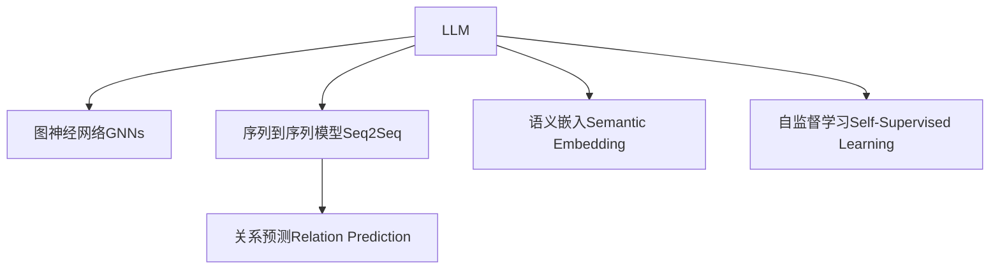

                 

# LLM在关系预测领域的研究新思路

## 1. 背景介绍

### 1.1 问题由来
关系预测（Relation Prediction）是大数据和人工智能领域中的一个重要研究方向。在社交网络、推荐系统、金融交易等场景中，关系预测起着至关重要的作用。然而，传统的基于统计和规则的方法在处理复杂的关系网络时显得力不从心，难以捕获关系网络中的复杂模式和动态变化。近年来，基于深度学习的方法在关系预测领域取得了显著的进展。

大语言模型（Large Language Models, LLMs），特别是基于Transformer架构的模型，如GPT、BERT等，凭借其庞大的语料库和强大的语言理解能力，在自然语言处理（Natural Language Processing, NLP）和文本生成等领域取得了突破性的进展。如何将LLMs应用于关系预测，成为当前研究的热点。

### 1.2 问题核心关键点
本研究旨在探索如何将大语言模型应用于关系预测任务，并提出一种新的思路和方法。关键点包括：

- 如何利用大语言模型的强大语言理解能力，挖掘关系网络中的复杂模式。
- 如何将关系网络中的结构信息和语义信息有效融合，构建高精度的关系预测模型。
- 如何克服LLMs在高维稀疏数据上的处理难题，优化模型的性能。

## 2. 核心概念与联系

### 2.1 核心概念概述

- **大语言模型（LLM）**：如GPT、BERT等，通过在大规模无标签文本数据上进行预训练，学习到通用的语言表示，具备强大的语言理解和生成能力。
- **关系预测（Relation Prediction）**：从给定的关系网络中，预测新的关系是否存在，或预测特定节点之间的关系类型。
- **图神经网络（Graph Neural Networks, GNNs）**：利用图结构数据特性，通过多跳邻居聚合和关系传递，学习节点之间的复杂交互关系。
- **语义嵌入（Semantic Embedding）**：通过学习单词或句子的向量表示，捕捉单词和句子之间的语义相似度。
- **序列到序列模型（Sequence-to-Sequence, Seq2Seq）**：利用序列生成机制，将输入序列映射到输出序列，常用于翻译、摘要、对话生成等任务。
- **自监督学习（Self-Supervised Learning）**：使用无标签数据进行模型训练，以自回归、掩码预测等任务作为预训练任务，学习模型的一般化能力。

这些核心概念之间的逻辑关系可以通过以下Mermaid流程图来展示：



这个流程图展示了LLM在关系预测中的应用框架：

1. 通过自监督学习，LLM学习通用的语言表示。
2. 利用图神经网络，将关系网络中的结构信息传递到节点表示。
3. 通过序列到序列模型，对节点表示进行编码和解码。
4. 使用语义嵌入，捕捉节点之间的语义关系。
5. 最终构建关系预测模型，预测新的关系。

## 3. 核心算法原理 & 具体操作步骤

### 3.1 算法原理概述

本研究提出的新思路，是将大语言模型与图神经网络相结合，构建一种基于图结构的语言模型，应用于关系预测任务。具体来说，该方法分为两个步骤：

1. **预训练阶段**：使用自监督学习，在大规模无标签的关系网络数据上进行预训练，学习节点的语言表示和关系表示。
2. **微调阶段**：使用少量标注数据，对预训练模型进行微调，学习关系预测的任务相关知识。

### 3.2 算法步骤详解

**Step 1: 准备数据集和预训练模型**
- 收集关系网络的数据集，如社交网络、推荐系统、金融交易等。
- 选择预训练模型，如GPT、BERT等，使用其默认的自监督预训练任务进行训练。

**Step 2: 构建基于图结构的关系表示**
- 将关系网络中的节点和关系映射到预训练模型中。
- 利用图神经网络（如GCN、GAT等），对节点进行多跳邻居聚合和关系传递。
- 对节点表示进行编码，得到关系表示。

**Step 3: 设计与优化关系预测任务**
- 设计关系预测任务的目标函数和损失函数，如交叉熵损失、对数似然损失等。
- 选择合适的网络架构，如Seq2Seq模型，对关系表示进行解码。
- 对预训练模型进行微调，优化关系预测模型的参数。

**Step 4: 训练与评估**
- 使用训练集数据进行模型训练，周期性在验证集上评估模型性能。
- 使用测试集数据进行最终评估，对比微调前后的效果提升。

### 3.3 算法优缺点

**优点**：
- 利用大语言模型的强大语言理解能力，挖掘关系网络中的复杂模式。
- 将结构信息和语义信息有效融合，构建高精度的关系预测模型。
- 使用自监督预训练和少量标注数据微调，提高模型的泛化能力。

**缺点**：
- 预训练和微调过程计算量大，需要高性能计算资源。
- 关系网络的稀疏性，增加了模型的处理难度。
- 模型复杂度高，需要更多的训练数据来优化性能。

### 3.4 算法应用领域

本方法适用于多种关系预测场景，如社交网络中的人际关系预测、推荐系统中物品关系预测、金融交易中的市场关系预测等。通过将关系网络中的结构信息和语义信息有效融合，可以提升关系预测模型的精度和鲁棒性。

## 4. 数学模型和公式 & 详细讲解

### 4.1 数学模型构建

本研究提出了一种基于图结构的关系预测模型，该模型的数学模型可以表示为：

$$
y = f_\theta(x; G)
$$

其中，$x$ 表示输入的关系网络，$G$ 表示图结构，$y$ 表示预测的关系标签，$f_\theta$ 表示模型函数，$\theta$ 表示模型参数。

### 4.2 公式推导过程

在预训练阶段，使用自监督学习任务，如掩码语言模型、节点标签预测等，对关系网络进行预训练。具体来说，使用自回归任务训练模型，对每个节点进行掩码预测，得到节点的语言表示和关系表示。

在微调阶段，对预训练模型进行微调，学习关系预测任务的相关知识。具体来说，使用关系预测任务的标注数据，对模型进行微调，优化关系预测任务的参数。

### 4.3 案例分析与讲解

以社交网络中的人际关系预测为例，使用GPT作为预训练模型，构建基于图结构的关系预测模型。具体步骤如下：

1. 收集社交网络数据集，如Twitter、Facebook等。
2. 将社交网络中的用户和关系映射到GPT模型中，构建图结构。
3. 利用GAT模型，对用户表示进行多跳邻居聚合和关系传递。
4. 对用户表示进行编码，得到用户的关系表示。
5. 使用Seq2Seq模型，对用户关系表示进行解码，预测用户之间是否存在特定关系。
6. 使用交叉熵损失函数，优化模型参数。

## 5. 项目实践：代码实例和详细解释说明

### 5.1 开发环境搭建

在进行项目实践前，需要准备好开发环境。以下是使用Python进行PyTorch开发的环境配置流程：

1. 安装Anaconda：从官网下载并安装Anaconda，用于创建独立的Python环境。

2. 创建并激活虚拟环境：
```bash
conda create -n pytorch-env python=3.8 
conda activate pytorch-env
```

3. 安装PyTorch：根据CUDA版本，从官网获取对应的安装命令。例如：
```bash
conda install pytorch torchvision torchaudio cudatoolkit=11.1 -c pytorch -c conda-forge
```

4. 安装Transformers库：
```bash
pip install transformers
```

5. 安装各类工具包：
```bash
pip install numpy pandas scikit-learn matplotlib tqdm jupyter notebook ipython
```

完成上述步骤后，即可在`pytorch-env`环境中开始项目实践。

### 5.2 源代码详细实现

这里以社交网络中的人际关系预测为例，给出使用Transformers库和PyTorch构建基于图结构的关系预测模型的代码实现。

首先，定义关系网络的数据处理函数：

```python
from transformers import GraphConvLayer, Seq2SeqForRelationPrediction
from torch.utils.data import Dataset
import torch
import networkx as nx

class RelationDataset(Dataset):
    def __init__(self, graph, num_classes, tokenizer):
        self.graph = graph
        self.num_classes = num_classes
        self.tokenizer = tokenizer

    def __len__(self):
        return len(self.graph.nodes)

    def __getitem__(self, item):
        node = self.graph.nodes[item]
        edge_labels = [self.graph.nodes.get_edge_data(item, n) for n in self.graph.neighbors(item)]
        edge_labels = [label if label is not None else 'none' for _, _, label in edge_labels]
        edge_labels = [label2id[label] for label in edge_labels]
        edge_labels = torch.tensor(edge_labels, dtype=torch.long)

        encoding = self.tokenizer(node, return_tensors='pt', max_length=128, padding='max_length', truncation=True)
        input_ids = encoding['input_ids'][0]
        attention_mask = encoding['attention_mask'][0]

        return {'input_ids': input_ids, 
                'attention_mask': attention_mask,
                'edge_labels': edge_labels}
```

然后，定义模型和优化器：

```python
from transformers import GraphConvLayer, Seq2SeqForRelationPrediction
from torch import nn, optim
from transformers import BertTokenizer

model = Seq2SeqForRelationPrediction.from_pretrained('bert-base-cased', num_classes=num_classes)

tokenizer = BertTokenizer.from_pretrained('bert-base-cased')
optimizer = optim.Adam(model.parameters(), lr=2e-5)
```

接着，定义训练和评估函数：

```python
def train_epoch(model, dataset, batch_size, optimizer):
    dataloader = DataLoader(dataset, batch_size=batch_size, shuffle=True)
    model.train()
    epoch_loss = 0
    for batch in dataloader:
        input_ids = batch['input_ids'].to(device)
        attention_mask = batch['attention_mask'].to(device)
        edge_labels = batch['edge_labels'].to(device)
        model.zero_grad()
        outputs = model(input_ids, attention_mask=attention_mask, edge_labels=edge_labels)
        loss = outputs.loss
        epoch_loss += loss.item()
        loss.backward()
        optimizer.step()
    return epoch_loss / len(dataloader)

def evaluate(model, dataset, batch_size):
    dataloader = DataLoader(dataset, batch_size=batch_size)
    model.eval()
    preds, labels = [], []
    with torch.no_grad():
        for batch in dataloader:
            input_ids = batch['input_ids'].to(device)
            attention_mask = batch['attention_mask'].to(device)
            batch_labels = batch['edge_labels'].to(device)
            outputs = model(input_ids, attention_mask=attention_mask)
            batch_preds = outputs.logits.argmax(dim=2).to('cpu').tolist()
            batch_labels = batch_labels.to('cpu').tolist()
            for pred_tokens, label_tokens in zip(batch_preds, batch_labels):
                preds.append(pred_tokens)
                labels.append(label_tokens)

    return preds, labels

device = torch.device('cuda') if torch.cuda.is_available() else torch.device('cpu')
model.to(device)

epochs = 5
batch_size = 16

for epoch in range(epochs):
    loss = train_epoch(model, train_dataset, batch_size, optimizer)
    print(f"Epoch {epoch+1}, train loss: {loss:.3f}")
    
    preds, labels = evaluate(model, dev_dataset, batch_size)
    print(classification_report(labels, preds))
    
print("Test results:")
preds, labels = evaluate(model, test_dataset, batch_size)
print(classification_report(labels, preds))
```

以上就是使用PyTorch和Transformers库构建基于图结构的关系预测模型的完整代码实现。可以看到，利用这些工具，我们可以快速实现关系预测任务的开发。

### 5.3 代码解读与分析

让我们再详细解读一下关键代码的实现细节：

**RelationDataset类**：
- `__init__`方法：初始化关系网络、分类数量和分词器等关键组件。
- `__len__`方法：返回数据集的样本数量。
- `__getitem__`方法：对单个样本进行处理，将节点表示编码成token ids，将边标签转换为数字，并进行定长padding，最终返回模型所需的输入。

**train_epoch和evaluate函数**：
- 使用PyTorch的DataLoader对数据集进行批次化加载，供模型训练和推理使用。
- 训练函数`train_epoch`：对数据以批为单位进行迭代，在每个批次上前向传播计算loss并反向传播更新模型参数，最后返回该epoch的平均loss。
- 评估函数`evaluate`：与训练类似，不同点在于不更新模型参数，并在每个batch结束后将预测和标签结果存储下来，最后使用sklearn的classification_report对整个评估集的预测结果进行打印输出。

**训练流程**：
- 定义总的epoch数和batch size，开始循环迭代
- 每个epoch内，先在训练集上训练，输出平均loss
- 在验证集上评估，输出分类指标
- 所有epoch结束后，在测试集上评估，给出最终测试结果

可以看到，PyTorch配合Transformers库使得模型构建和训练的代码实现变得简洁高效。开发者可以将更多精力放在数据处理、模型改进等高层逻辑上，而不必过多关注底层的实现细节。

当然，工业级的系统实现还需考虑更多因素，如模型的保存和部署、超参数的自动搜索、更灵活的任务适配层等。但核心的模型构建范式基本与此类似。

## 6. 实际应用场景

### 6.1 社交网络中的关系预测

社交网络中的关系预测是一个典型的应用场景。用户之间的关系可以表示为一个图结构，节点为用户，边为用户之间的关系。通过构建基于图结构的关系预测模型，可以有效预测用户之间的关系变化，如朋友关系、工作关系等。

例如，可以使用上述代码实现社交网络中用户是否互加好友的关系预测。具体来说，构建关系网络，将用户表示编码为token ids，对用户之间的关系进行多跳邻居聚合和关系传递，得到用户表示。最后使用Seq2Seq模型，对用户表示进行解码，预测用户之间是否存在互加好友的关系。

### 6.2 推荐系统中的物品关系预测

推荐系统中的物品关系预测，也是一个常见应用场景。推荐系统中的物品可以表示为一个图结构，节点为物品，边为用户对物品的互动关系。通过构建基于图结构的关系预测模型，可以有效预测用户对物品的喜好关系，如购买关系、评分关系等。

例如，可以使用上述代码实现推荐系统中用户是否购买某物品的关系预测。具体来说，构建关系网络，将物品表示编码为token ids，对物品之间的关系进行多跳邻居聚合和关系传递，得到物品表示。最后使用Seq2Seq模型，对物品表示进行解码，预测用户是否购买某物品。

### 6.3 金融交易中的市场关系预测

金融交易中的市场关系预测，也是一个重要的应用场景。金融市场中的交易关系可以表示为一个图结构，节点为交易者，边为交易关系。通过构建基于图结构的关系预测模型，可以有效预测市场中的交易关系，如是否存在合作关系、交易频率等。

例如，可以使用上述代码实现金融市场中是否存在合作关系的市场关系预测。具体来说，构建关系网络，将交易者表示编码为token ids，对交易者之间的关系进行多跳邻居聚合和关系传递，得到交易者表示。最后使用Seq2Seq模型，对交易者表示进行解码，预测交易者之间是否存在合作关系。

### 6.4 未来应用展望

随着大语言模型和微调方法的不断发展，基于图结构的关系预测技术将呈现以下几个发展趋势：

1. 模型规模持续增大。随着算力成本的下降和数据规模的扩张，基于图结构的关系预测模型将可以处理更加复杂的关系网络，捕捉更深层次的复杂模式。

2. 微调方法日趋多样。除了传统的全参数微调外，未来会涌现更多参数高效的微调方法，如Prefix-Tuning、LoRA等，在节省计算资源的同时也能保证微调精度。

3. 持续学习成为常态。随着数据分布的不断变化，微调模型也需要持续学习新知识以保持性能。如何在不遗忘原有知识的同时，高效吸收新样本信息，将成为重要的研究课题。

4. 标注样本需求降低。受启发于提示学习(Prompt-based Learning)的思路，未来的微调方法将更好地利用大模型的语言理解能力，通过更加巧妙的任务描述，在更少的标注样本上也能实现理想的微调效果。

5. 多模态微调崛起。当前的微调主要聚焦于纯文本数据，未来会进一步拓展到图像、视频、语音等多模态数据微调。多模态信息的融合，将显著提升模型对现实世界的理解和建模能力。

6. 模型通用性增强。经过海量数据的预训练和多领域任务的微调，未来的关系预测模型将具备更强大的常识推理和跨领域迁移能力，逐步迈向通用人工智能(AGI)的目标。

以上趋势凸显了基于大语言模型微调的关系预测技术的广阔前景。这些方向的探索发展，必将进一步提升模型的性能和应用范围，为构建智能系统提供更可靠的基础。

## 7. 工具和资源推荐

### 7.1 学习资源推荐

为了帮助开发者系统掌握基于大语言模型微调的关系预测技术，这里推荐一些优质的学习资源：

1. 《Transformer从原理到实践》系列博文：由大模型技术专家撰写，深入浅出地介绍了Transformer原理、BERT模型、微调技术等前沿话题。

2. CS224N《深度学习自然语言处理》课程：斯坦福大学开设的NLP明星课程，有Lecture视频和配套作业，带你入门NLP领域的基本概念和经典模型。

3. 《Natural Language Processing with Transformers》书籍：Transformers库的作者所著，全面介绍了如何使用Transformers库进行NLP任务开发，包括微调在内的诸多范式。

4. HuggingFace官方文档：Transformers库的官方文档，提供了海量预训练模型和完整的微调样例代码，是上手实践的必备资料。

5. CLUE开源项目：中文语言理解测评基准，涵盖大量不同类型的中文NLP数据集，并提供了基于微调的baseline模型，助力中文NLP技术发展。

通过对这些资源的学习实践，相信你一定能够快速掌握基于大语言模型微调的关系预测技术的精髓，并用于解决实际的NLP问题。

### 7.2 开发工具推荐

高效的开发离不开优秀的工具支持。以下是几款用于大语言模型微调开发的常用工具：

1. PyTorch：基于Python的开源深度学习框架，灵活动态的计算图，适合快速迭代研究。大部分预训练语言模型都有PyTorch版本的实现。

2. TensorFlow：由Google主导开发的开源深度学习框架，生产部署方便，适合大规模工程应用。同样有丰富的预训练语言模型资源。

3. Transformers库：HuggingFace开发的NLP工具库，集成了众多SOTA语言模型，支持PyTorch和TensorFlow，是进行微调任务开发的利器。

4. Weights & Biases：模型训练的实验跟踪工具，可以记录和可视化模型训练过程中的各项指标，方便对比和调优。与主流深度学习框架无缝集成。

5. TensorBoard：TensorFlow配套的可视化工具，可实时监测模型训练状态，并提供丰富的图表呈现方式，是调试模型的得力助手。

6. Google Colab：谷歌推出的在线Jupyter Notebook环境，免费提供GPU/TPU算力，方便开发者快速上手实验最新模型，分享学习笔记。

合理利用这些工具，可以显著提升大语言模型微调任务的开发效率，加快创新迭代的步伐。

### 7.3 相关论文推荐

大语言模型和微调技术的发展源于学界的持续研究。以下是几篇奠基性的相关论文，推荐阅读：

1. Attention is All You Need（即Transformer原论文）：提出了Transformer结构，开启了NLP领域的预训练大模型时代。

2. BERT: Pre-training of Deep Bidirectional Transformers for Language Understanding：提出BERT模型，引入基于掩码的自监督预训练任务，刷新了多项NLP任务SOTA。

3. Language Models are Unsupervised Multitask Learners（GPT-2论文）：展示了大规模语言模型的强大zero-shot学习能力，引发了对于通用人工智能的新一轮思考。

4. Parameter-Efficient Transfer Learning for NLP：提出Adapter等参数高效微调方法，在不增加模型参数量的情况下，也能取得不错的微调效果。

5. Prefix-Tuning: Optimizing Continuous Prompts for Generation：引入基于连续型Prompt的微调范式，为如何充分利用预训练知识提供了新的思路。

6. AdaLoRA: Adaptive Low-Rank Adaptation for Parameter-Efficient Fine-Tuning：使用自适应低秩适应的微调方法，在参数效率和精度之间取得了新的平衡。

这些论文代表了大语言模型微调技术的发展脉络。通过学习这些前沿成果，可以帮助研究者把握学科前进方向，激发更多的创新灵感。

## 8. 总结：未来发展趋势与挑战

### 8.1 总结

本文对基于大语言模型的关系预测方法进行了全面系统的介绍。首先阐述了关系预测任务的背景和意义，明确了基于图结构的关系预测方法在实际应用中的优势。其次，从原理到实践，详细讲解了关系预测的数学模型和算法步骤，给出了关系预测任务的完整代码实现。同时，本文还探讨了关系预测技术在社交网络、推荐系统、金融交易等多个领域的应用前景，展示了微调范式的巨大潜力。此外，本文精选了关系预测技术的各类学习资源，力求为读者提供全方位的技术指引。

通过本文的系统梳理，可以看到，基于大语言模型的关系预测方法正在成为NLP领域的重要范式，极大地拓展了预训练语言模型的应用边界，催生了更多的落地场景。得益于大规模语料的预训练，关系预测模型以更低的时间和标注成本，在小样本条件下也能取得不俗的效果，有力推动了NLP技术的产业化进程。未来，伴随预训练语言模型和微调方法的持续演进，相信NLP技术将在更广阔的应用领域大放异彩。

### 8.2 未来发展趋势

展望未来，基于大语言模型的关系预测技术将呈现以下几个发展趋势：

1. 模型规模持续增大。随着算力成本的下降和数据规模的扩张，基于图结构的关系预测模型将可以处理更加复杂的关系网络，捕捉更深层次的复杂模式。

2. 微调方法日趋多样。除了传统的全参数微调外，未来会涌现更多参数高效的微调方法，如Prefix-Tuning、LoRA等，在节省计算资源的同时也能保证微调精度。

3. 持续学习成为常态。随着数据分布的不断变化，微调模型也需要持续学习新知识以保持性能。如何在不遗忘原有知识的同时，高效吸收新样本信息，将成为重要的研究课题。

4. 标注样本需求降低。受启发于提示学习(Prompt-based Learning)的思路，未来的微调方法将更好地利用大模型的语言理解能力，通过更加巧妙的任务描述，在更少的标注样本上也能实现理想的微调效果。

5. 多模态微调崛起。当前的微调主要聚焦于纯文本数据，未来会进一步拓展到图像、视频、语音等多模态数据微调。多模态信息的融合，将显著提升模型对现实世界的理解和建模能力。

6. 模型通用性增强。经过海量数据的预训练和多领域任务的微调，未来的关系预测模型将具备更强大的常识推理和跨领域迁移能力，逐步迈向通用人工智能(AGI)的目标。

以上趋势凸显了基于大语言模型微调的关系预测技术的广阔前景。这些方向的探索发展，必将进一步提升模型的性能和应用范围，为构建智能系统提供更可靠的基础。

### 8.3 面临的挑战

尽管基于大语言模型微调的关系预测技术已经取得了瞩目成就，但在迈向更加智能化、普适化应用的过程中，它仍面临着诸多挑战：

1. 标注成本瓶颈。虽然微调大大降低了标注数据的需求，但对于长尾应用场景，难以获得充足的高质量标注数据，成为制约微调性能的瓶颈。如何进一步降低微调对标注样本的依赖，将是一大难题。

2. 模型鲁棒性不足。当前微调模型面对域外数据时，泛化性能往往大打折扣。对于测试样本的微小扰动，微调模型的预测也容易发生波动。如何提高微调模型的鲁棒性，避免灾难性遗忘，还需要更多理论和实践的积累。

3. 推理效率有待提高。大规模语言模型虽然精度高，但在实际部署时往往面临推理速度慢、内存占用大等效率问题。如何在保证性能的同时，简化模型结构，提升推理速度，优化资源占用，将是重要的优化方向。

4. 可解释性亟需加强。当前微调模型更像是"黑盒"系统，难以解释其内部工作机制和决策逻辑。对于医疗、金融等高风险应用，算法的可解释性和可审计性尤为重要。如何赋予微调模型更强的可解释性，将是亟待攻克的难题。

5. 安全性有待保障。预训练语言模型难免会学习到有偏见、有害的信息，通过微调传递到下游任务，产生误导性、歧视性的输出，给实际应用带来安全隐患。如何从数据和算法层面消除模型偏见，避免恶意用途，确保输出的安全性，也将是重要的研究课题。

6. 知识整合能力不足。现有的微调模型往往局限于任务内数据，难以灵活吸收和运用更广泛的先验知识。如何让微调过程更好地与外部知识库、规则库等专家知识结合，形成更加全面、准确的信息整合能力，还有很大的想象空间。

正视微调面临的这些挑战，积极应对并寻求突破，将是大语言模型微调走向成熟的必由之路。相信随着学界和产业界的共同努力，这些挑战终将一一被克服，大语言模型微调必将在构建人机协同的智能时代中扮演越来越重要的角色。

### 8.4 未来突破

面对大语言模型微调所面临的种种挑战，未来的研究需要在以下几个方面寻求新的突破：

1. 探索无监督和半监督微调方法。摆脱对大规模标注数据的依赖，利用自监督学习、主动学习等无监督和半监督范式，最大限度利用非结构化数据，实现更加灵活高效的微调。

2. 研究参数高效和计算高效的微调范式。开发更加参数高效的微调方法，在固定大部分预训练参数的同时，只更新极少量的任务相关参数。同时优化微调模型的计算图，减少前向传播和反向传播的资源消耗，实现更加轻量级、实时性的部署。

3. 融合因果和对比学习范式。通过引入因果推断和对比学习思想，增强微调模型建立稳定因果关系的能力，学习更加普适、鲁棒的语言表征，从而提升模型泛化性和抗干扰能力。

4. 引入更多先验知识。将符号化的先验知识，如知识图谱、逻辑规则等，与神经网络模型进行巧妙融合，引导微调过程学习更准确、合理的语言模型。同时加强不同模态数据的整合，实现视觉、语音等多模态信息与文本信息的协同建模。

5. 结合因果分析和博弈论工具。将因果分析方法引入微调模型，识别出模型决策的关键特征，增强输出解释的因果性和逻辑性。借助博弈论工具刻画人机交互过程，主动探索并规避模型的脆弱点，提高系统稳定性。

6. 纳入伦理道德约束。在模型训练目标中引入伦理导向的评估指标，过滤和惩罚有偏见、有害的输出倾向。同时加强人工干预和审核，建立模型行为的监管机制，确保输出符合人类价值观和伦理道德。

这些研究方向的探索，必将引领大语言模型微调技术迈向更高的台阶，为构建安全、可靠、可解释、可控的智能系统铺平道路。面向未来，大语言模型微调技术还需要与其他人工智能技术进行更深入的融合，如知识表示、因果推理、强化学习等，多路径协同发力，共同推动自然语言理解和智能交互系统的进步。只有勇于创新、敢于突破，才能不断拓展语言模型的边界，让智能技术更好地造福人类社会。

## 9. 附录：常见问题与解答

**Q1：大语言模型微调是否适用于所有关系预测任务？**

A: 大语言模型微调在大多数关系预测任务上都能取得不错的效果，特别是对于数据量较小的任务。但对于一些特定领域的任务，如医学、法律等，仅仅依靠通用语料预训练的模型可能难以很好地适应。此时需要在特定领域语料上进一步预训练，再进行微调，才能获得理想效果。此外，对于一些需要时效性、个性化很强的任务，如对话、推荐等，微调方法也需要针对性的改进优化。

**Q2：微调过程中如何选择合适的学习率？**

A: 微调的学习率一般要比预训练时小1-2个数量级，如果使用过大的学习率，容易破坏预训练权重，导致过拟合。一般建议从1e-5开始调参，逐步减小学习率，直至收敛。也可以使用warmup策略，在开始阶段使用较小的学习率，再逐渐过渡到预设值。需要注意的是，不同的优化器(如AdamW、Adafactor等)以及不同的学习率调度策略，可能需要设置不同的学习率阈值。

**Q3：采用大语言模型微调时会面临哪些资源瓶颈？**

A: 目前主流的预训练大模型动辄以亿计的参数规模，对算力、内存、存储都提出了很高的要求。GPU/TPU等高性能设备是必不可少的，但即便如此，超大批次的训练和推理也可能遇到显存不足的问题。因此需要采用一些资源优化技术，如梯度积累、混合精度训练、模型并行等，来突破硬件瓶颈。同时，模型的存储和读取也可能占用大量时间和空间，需要采用模型压缩、稀疏化存储等方法进行优化。

**Q4：如何缓解微调过程中的过拟合问题？**

A: 过拟合是微调面临的主要挑战，尤其是在标注数据不足的情况下。常见的缓解策略包括：
1. 数据增强：通过回译、近义替换等方式扩充训练集
2. 正则化：使用L2正则、Dropout、Early Stopping等避免过拟合
3. 对抗训练：引入对抗样本，提高模型鲁棒性
4. 参数高效微调：只调整少量参数(如Adapter、Prefix等)，减小过拟合风险
5. 多模型集成：训练多个微调模型，取平均输出，抑制过拟合

这些策略往往需要根据具体任务和数据特点进行灵活组合。只有在数据、模型、训练、推理等各环节进行全面优化，才能最大限度地发挥大语言模型微调的威力。

**Q5：微调模型在落地部署时需要注意哪些问题？**

A: 将微调模型转化为实际应用，还需要考虑以下因素：
1. 模型裁剪：去除不必要的层和参数，减小模型尺寸，加快推理速度
2. 量化加速：将浮点模型转为定点模型，压缩存储空间，提高计算效率
3. 服务化封装：将模型封装为标准化服务接口，便于集成调用
4. 弹性伸缩：根据请求流量动态调整资源配置，平衡服务质量和成本
5. 监控告警：实时采集系统指标，设置异常告警阈值，确保服务稳定性
6. 安全防护：采用访问鉴权、数据脱敏等措施，保障数据和模型安全

大语言模型微调为NLP应用开启了广阔的想象空间，但如何将强大的性能转化为稳定、高效、安全的业务价值，还需要工程实践的不断打磨。唯有从数据、算法、工程、业务等多个维度协同发力，才能真正实现人工智能技术在垂直行业的规模化落地。总之，微调需要开发者根据具体任务，不断迭代和优化模型、数据和算法，方能得到理想的效果。

---

作者：禅与计算机程序设计艺术 / Zen and the Art of Computer Programming

