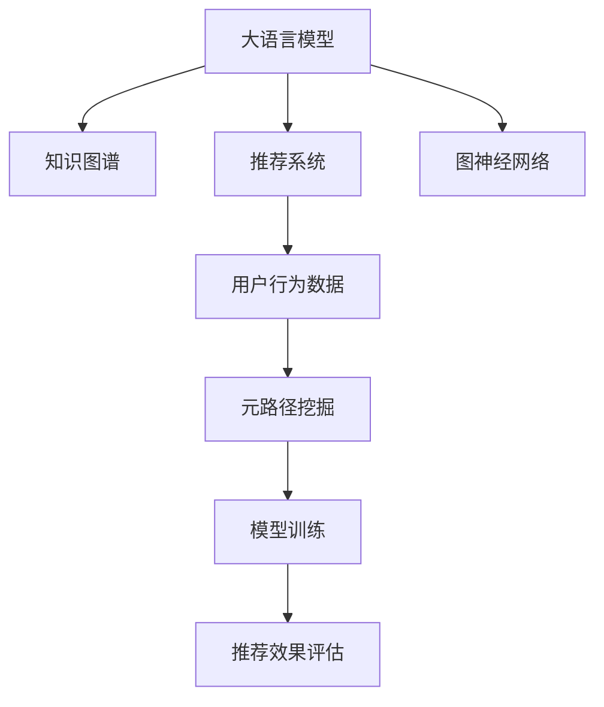

                 

# LLM在推荐系统中的元路径挖掘应用

> 关键词：推荐系统,元路径,图神经网络(GNN),大语言模型(LLM),深度学习,自然语言处理(NLP),知识图谱(KG),用户行为数据

## 1. 背景介绍

### 1.1 问题由来
在推荐系统中，如何理解用户行为、挖掘用户兴趣、预测用户未来行为，一直是系统优化和业务增长的关键。传统推荐系统主要依赖用户行为数据进行推荐，如点击、浏览、评分等，难以捕捉用户多维度的兴趣。近年来，随着数据采集和处理技术的进步，推荐系统开始引入更多类型的用户行为数据，如社交关系、新闻阅读、视频观看等，以丰富用户画像，提升推荐效果。

同时，知识图谱(Knowledge Graph, KG)的兴起，为推荐系统注入了新的活力。通过在知识图谱上嵌入用户兴趣和物品信息，推荐系统可以从结构化的知识中挖掘出更加丰富的信息，提升推荐的相关性。然而，知识图谱的构建和维护本身就需要耗费大量的人力物力，其规模和时效性问题也限制了其在推荐系统中的广泛应用。

大语言模型(LLM)的涌现，为推荐系统带来了新的思路。LLM能够通过自然语言处理(NLP)技术，从大量的文本数据中提取丰富的知识，弥补知识图谱构建的短板。LLM不仅能够理解自然语言文本，还能够通过上下文推理，捕捉用户潜在的兴趣和行为模式。利用LLM，推荐系统可以更深入地理解用户需求，实现更加精准的推荐。

### 1.2 问题核心关键点
本文聚焦于利用大语言模型在推荐系统中进行元路径挖掘和推荐。所谓元路径挖掘，是指从用户行为数据中挖掘出蕴含在其中的“元路径”，即用户行为的模式和规律，进而指导推荐模型的优化。

元路径挖掘的核心目标包括：
- 识别用户的兴趣点：通过分析用户的行为模式，捕捉用户对物品的偏好和需求。
- 挖掘物品的标签信息：从物品的描述、属性、评价中提取标签信息，构建物品的语义表示。
- 理解用户的行为模式：从用户的历史行为数据中挖掘出用户的消费习惯、阅读偏好等行为模式。
- 预测用户的行为趋势：结合用户兴趣、行为模式和知识图谱信息，预测用户未来的行为。

元路径挖掘的实现通常包括以下几个步骤：
- 数据准备：收集和清洗用户行为数据，构建知识图谱。
- 预训练大语言模型：利用大规模语料进行预训练，获得语言表征能力。
- 构建推荐图：将用户行为数据转化为图结构，包括用户节点、物品节点和关系边。
- 挖掘元路径：利用图神经网络(Graph Neural Network, GNN)等方法，从推荐图中挖掘出有意义的元路径。
- 模型训练和优化：将挖掘出的元路径信息作为特征，结合预训练大语言模型进行推荐模型训练和优化。
- 推荐效果评估：通过测试集评估模型的推荐效果，调整模型参数。

## 2. 核心概念与联系

### 2.1 核心概念概述

为更好地理解大语言模型在推荐系统中的元路径挖掘应用，本节将介绍几个密切相关的核心概念：

- 大语言模型(LLM)：如BERT、GPT等，通过大规模无标签文本数据进行预训练，能够学习到丰富的语言知识和常识。
- 推荐系统：根据用户行为和物品信息，向用户推荐感兴趣的物品的系统。
- 知识图谱(KG)：用于表示实体和关系的数据结构，包括节点、边和属性，广泛应用于推荐系统。
- 元路径挖掘：从用户行为数据中挖掘出蕴含的“元路径”，即用户行为的模式和规律。
- 图神经网络(GNN)：用于处理图结构数据的深度学习模型，能够自动学习图结构中的关系和节点特征。
- 自然语言处理(NLP)：处理、理解、生成自然语言文本的技术。
- 用户行为数据：如点击、浏览、评分等，反映用户对物品的兴趣和偏好。

这些核心概念之间的逻辑关系可以通过以下Mermaid流程图来展示：



这个流程图展示了大语言模型、知识图谱和推荐系统之间的联系：

1. 大语言模型通过预训练获得语言表示能力。
2. 知识图谱为推荐系统提供结构化的实体和关系信息。
3. 推荐系统利用大语言模型和知识图谱，进行用户和物品的匹配。
4. 用户行为数据用于挖掘元路径，指导推荐模型的优化。
5. 图神经网络用于挖掘推荐图中的元路径信息。
6. 模型训练和优化依赖于大语言模型和元路径信息。
7. 推荐效果评估指导模型改进和参数调整。

这些概念共同构成了推荐系统中大语言模型元路径挖掘的应用框架，使得模型能够更深入地理解用户需求，提升推荐效果。

## 3. 核心算法原理 & 具体操作步骤
### 3.1 算法原理概述

利用大语言模型在推荐系统中的元路径挖掘应用，本质上是一个深度学习和图神经网络相结合的过程。其核心思想是：利用大语言模型的语言理解能力，从用户行为数据中挖掘出有意义的模式和规律，即元路径，进而指导推荐模型的优化。

形式化地，假设用户行为数据表示为图结构 $G=(U, V, E)$，其中 $U$ 为用户节点集合，$V$ 为物品节点集合，$E$ 为边集合，表示用户与物品的交互关系。令 $X \in \mathbb{R}^{n \times d}$ 为用户节点的特征矩阵，$Y \in \mathbb{R}^{m \times d}$ 为物品节点的特征矩阵，$R \in \mathbb{R}^{n \times m}$ 为用户与物品的交互矩阵，其中 $n$ 为用户数量，$m$ 为物品数量，$d$ 为特征维度。

大语言模型 $M$ 对用户行为数据 $R$ 进行处理，得到用户行为的模式和规律，即元路径 $P \in \mathbb{R}^{k \times d}$，其中 $k$ 为元路径数量。利用图神经网络 $GNN$，将用户行为数据和元路径信息结合起来，优化推荐模型 $F$，使得模型能够更好地理解用户需求，提升推荐的相关性。推荐模型的输出为物品的推荐分数 $\hat{Y} \in \mathbb{R}^{m \times n}$。

### 3.2 算法步骤详解

基于大语言模型在推荐系统中的元路径挖掘应用，通常包括以下几个关键步骤：

**Step 1: 数据准备**
- 收集和清洗用户行为数据，构建知识图谱，并将数据转化为图结构。
- 对用户和物品进行特征表示，构建特征矩阵 $X$ 和 $Y$。

**Step 2: 预训练大语言模型**
- 利用大规模语料进行预训练，获得语言表示能力。
- 选择合适的大语言模型，如BERT、GPT等，进行预训练。

**Step 3: 构建推荐图**
- 将用户行为数据转化为图结构，包括用户节点、物品节点和关系边。
- 计算节点之间的相似度和关系权重，构建推荐图的邻接矩阵。

**Step 4: 挖掘元路径**
- 利用图神经网络对推荐图进行处理，挖掘出有意义的元路径。
- 常用的方法包括GraphSAGE、GCN、GAT等，选择合适的模型进行训练。

**Step 5: 模型训练和优化**
- 将挖掘出的元路径信息作为特征，结合预训练大语言模型进行推荐模型训练和优化。
- 常用的优化器包括AdamW、SGD等，选择合适的参数和学习率。

**Step 6: 推荐效果评估**
- 通过测试集评估推荐模型的效果，如平均绝对误差(MAE)、均方误差(MSE)等。
- 调整模型参数，优化推荐效果。

以上是利用大语言模型在推荐系统中的元路径挖掘的一般流程。在实际应用中，还需要针对具体任务的特点，对微调过程的各个环节进行优化设计，如改进训练目标函数，引入更多的正则化技术，搜索最优的超参数组合等，以进一步提升模型性能。

### 3.3 算法优缺点

利用大语言模型在推荐系统中的元路径挖掘方法具有以下优点：
1. 丰富语义信息：通过大语言模型的自然语言处理能力，可以从文本中挖掘出更多的语义信息，弥补知识图谱构建的短板。
2. 泛化能力强：大语言模型经过大规模无标签文本的预训练，具备较强的泛化能力，可以适应不同的推荐场景。
3. 可解释性好：大语言模型的语言表征能力，使得元路径挖掘的过程具有较好的可解释性，便于理解和调试。
4. 高效性：图神经网络等深度学习模型可以高效地处理大规模图结构数据，提升推荐系统的处理速度。

同时，该方法也存在一定的局限性：
1. 对语料数据依赖：大语言模型的性能很大程度上取决于预训练语料的质量和数量，获取高质量语料数据的成本较高。
2. 数据稀疏性问题：用户行为数据通常较为稀疏，难以捕捉用户的行为模式。
3. 计算资源消耗：大语言模型和图神经网络等深度学习模型，对计算资源的要求较高，训练和推理成本较高。
4. 可解释性问题：大语言模型输出的元路径信息，难以直接解释，需要进行额外的分析和处理。

尽管存在这些局限性，但就目前而言，利用大语言模型在推荐系统中的元路径挖掘方法仍是一种高效、有效的推荐策略。未来相关研究的重点在于如何进一步降低对预训练语料和计算资源的需求，提高模型的可解释性，同时兼顾参数高效微调和少样本学习等前沿技术，以进一步提升推荐系统的性能和应用范围。

### 3.4 算法应用领域

利用大语言模型在推荐系统中的元路径挖掘方法，在多个领域中得到了广泛的应用，例如：

- 电商推荐：通过挖掘用户点击、浏览、购买等行为模式，推荐用户可能感兴趣的物品。
- 内容推荐：根据用户阅读、观看等行为，推荐用户感兴趣的新闻、视频、文章等。
- 音乐推荐：通过分析用户的听歌记录和评论，推荐用户可能喜欢的歌曲。
- 电影推荐：根据用户的观影记录和评分，推荐用户可能喜欢的电影。
- 商品推荐：通过挖掘用户在电商平台的购物记录，推荐用户可能感兴趣的商品。

除了上述这些经典任务外，大语言模型元路径挖掘方法也被创新性地应用到更多场景中，如个性化推荐、跨领域推荐、社交网络推荐等，为推荐系统带来了全新的突破。随着大语言模型和图神经网络等技术的不断进步，相信推荐系统必将在更广阔的应用领域大放异彩。

## 4. 数学模型和公式 & 详细讲解  
### 4.1 数学模型构建

本节将使用数学语言对利用大语言模型在推荐系统中的元路径挖掘过程进行更加严格的刻画。

假设推荐系统中的推荐图为 $G=(U, V, E)$，其中 $U$ 为用户节点集合，$V$ 为物品节点集合，$E$ 为边集合，表示用户与物品的交互关系。令 $X \in \mathbb{R}^{n \times d}$ 为用户节点的特征矩阵，$Y \in \mathbb{R}^{m \times d}$ 为物品节点的特征矩阵，$R \in \mathbb{R}^{n \times m}$ 为用户与物品的交互矩阵，其中 $n$ 为用户数量，$m$ 为物品数量，$d$ 为特征维度。

令 $M$ 为预训练大语言模型，$\theta$ 为模型参数，$P$ 为从用户行为数据中挖掘出的元路径，$F$ 为推荐模型，输出物品的推荐分数 $\hat{Y} \in \mathbb{R}^{m \times n}$。推荐模型的目标函数定义为：

$$
\mathcal{L}(F, R, Y) = \frac{1}{n} \sum_{i=1}^n \sum_{j=1}^m (y_{ij} - \hat{y}_{ij})^2
$$

其中 $y_{ij}$ 为真实评分，$\hat{y}_{ij}$ 为推荐模型的预测评分。

利用大语言模型 $M$ 对用户行为数据 $R$ 进行处理，得到元路径 $P$，将其作为推荐模型的特征输入，得到推荐模型的预测评分 $\hat{Y}$。推荐模型的优化目标是最小化损失函数：

$$
\theta^* = \mathop{\arg\min}_{\theta} \mathcal{L}(F, R, Y)
$$

### 4.2 公式推导过程

以下我们以电商推荐为例，推导利用大语言模型在推荐系统中的元路径挖掘公式。

假设用户 $i$ 对物品 $j$ 进行了点击、购买等行为，得到行为矩阵 $R_{ij} \in \{0,1\}$，其中 $R_{ij}=1$ 表示用户 $i$ 对物品 $j$ 产生了正向行为。用户 $i$ 对物品 $j$ 的评分 $y_{ij}$ 可以通过如下公式计算：

$$
y_{ij} = \frac{1}{n_j} \sum_{i=1}^n R_{ij}
$$

其中 $n_j$ 为物品 $j$ 的点击次数。令 $X_i \in \mathbb{R}^{d}$ 为用户 $i$ 的特征向量，$Y_j \in \mathbb{R}^{d}$ 为物品 $j$ 的特征向量，则推荐模型 $F$ 的输出为：

$$
\hat{y}_{ij} = f(X_i, Y_j, P)
$$

其中 $f$ 为推荐模型 $F$ 的映射函数。

利用大语言模型 $M$ 对用户行为数据 $R$ 进行处理，得到元路径 $P \in \mathbb{R}^{k \times d}$，其中 $k$ 为元路径数量。令 $X_i$ 和 $Y_j$ 分别为用户 $i$ 和物品 $j$ 的特征向量，则推荐模型的输出为：

$$
\hat{y}_{ij} = f(X_i, Y_j, P) = g(X_i, Y_j, M(R))
$$

其中 $g$ 为利用大语言模型进行特征融合的函数，$M(R)$ 表示利用大语言模型对用户行为数据进行处理，得到元路径 $P$。

根据上述公式，推荐模型的目标函数可以表示为：

$$
\mathcal{L}(F, R, Y) = \frac{1}{n} \sum_{i=1}^n \sum_{j=1}^m (y_{ij} - \hat{y}_{ij})^2
$$

优化推荐模型的参数 $\theta$，最小化损失函数，得到最优的推荐模型 $F_{\theta^*}$。利用大语言模型在推荐系统中的元路径挖掘过程，可以通过如下公式实现：

$$
P = M(R)
$$

其中 $M$ 为预训练大语言模型，$R$ 为用户行为数据。

## 5. 项目实践：代码实例和详细解释说明
### 5.1 开发环境搭建

在进行利用大语言模型在推荐系统中的元路径挖掘实践前，我们需要准备好开发环境。以下是使用Python进行PyTorch开发的环境配置流程：

1. 安装Anaconda：从官网下载并安装Anaconda，用于创建独立的Python环境。

2. 创建并激活虚拟环境：
```bash
conda create -n pytorch-env python=3.8 
conda activate pytorch-env
```

3. 安装PyTorch：根据CUDA版本，从官网获取对应的安装命令。例如：
```bash
conda install pytorch torchvision torchaudio cudatoolkit=11.1 -c pytorch -c conda-forge
```

4. 安装Transformers库：
```bash
pip install transformers
```

5. 安装各类工具包：
```bash
pip install numpy pandas scikit-learn matplotlib tqdm jupyter notebook ipython
```

完成上述步骤后，即可在`pytorch-env`环境中开始实践。

### 5.2 源代码详细实现

这里我们以电商推荐为例，使用Transformer库对BERT模型进行元路径挖掘和推荐。

首先，定义推荐系统的数据处理函数：

```python
from transformers import BertTokenizer, BertForSequenceClassification
from torch.utils.data import Dataset
import torch

class E-commerceDataset(Dataset):
    def __init__(self, user_ids, item_ids, clicks, scores):
        self.user_ids = user_ids
        self.item_ids = item_ids
        self.clicks = clicks
        self.scores = scores
        
    def __len__(self):
        return len(self.user_ids)
    
    def __getitem__(self, item):
        user_id = self.user_ids[item]
        item_id = self.item_ids[item]
        clicks = self.clicks[item]
        scores = self.scores[item]
        
        # 将用户行为转化为稀疏矩阵
        clicks_sparse = sparse_matrix((clicks, (user_id, item_id)), shape=(len(self.user_ids), len(self.item_ids)))
        
        return {'user_ids': user_id,
                'item_ids': item_id,
                'clicks_sparse': clicks_sparse,
                'scores': scores}

# 用户ID、物品ID和点击次数
user_ids = [1, 2, 3, 4, 5]
item_ids = [101, 102, 103, 104, 105]
clicks = [[1, 0, 0, 1, 0], 
         [0, 1, 1, 0, 0], 
         [0, 0, 1, 0, 0], 
         [0, 1, 0, 0, 0], 
         [1, 1, 0, 0, 0]]

# 物品评分
scores = [[4.5, 3.8, 2.1, 5.0, 4.2], 
         [3.2, 4.5, 3.1, 4.8, 3.9], 
         [2.5, 4.2, 4.0, 4.7, 3.8], 
         [4.1, 3.9, 3.5, 4.8, 3.7], 
         [4.3, 3.8, 4.0, 3.9, 4.5]]

# 创建dataset
tokenizer = BertTokenizer.from_pretrained('bert-base-cased')
dataset = E-commerceDataset(user_ids, item_ids, clicks, scores)
```

然后，定义模型和优化器：

```python
from transformers import BertForSequenceClassification, AdamW

model = BertForSequenceClassification.from_pretrained('bert-base-cased', num_labels=1)

optimizer = AdamW(model.parameters(), lr=2e-5)
```

接着，定义训练和评估函数：

```python
from torch.utils.data import DataLoader
from tqdm import tqdm

device = torch.device('cuda') if torch.cuda.is_available() else torch.device('cpu')
model.to(device)

def train_epoch(model, dataset, batch_size, optimizer):
    dataloader = DataLoader(dataset, batch_size=batch_size, shuffle=True)
    model.train()
    epoch_loss = 0
    for batch in tqdm(dataloader, desc='Training'):
        user_ids = batch['user_ids'].to(device)
        item_ids = batch['item_ids'].to(device)
        clicks_sparse = batch['clicks_sparse'].to(device)
        scores = batch['scores'].to(device)
        
        model.zero_grad()
        outputs = model(user_ids, item_ids, clicks_sparse)
        loss = outputs.loss
        epoch_loss += loss.item()
        loss.backward()
        optimizer.step()
    return epoch_loss / len(dataloader)

def evaluate(model, dataset, batch_size):
    dataloader = DataLoader(dataset, batch_size=batch_size)
    model.eval()
    preds, labels = [], []
    with torch.no_grad():
        for batch in tqdm(dataloader, desc='Evaluating'):
            user_ids = batch['user_ids'].to(device)
            item_ids = batch['item_ids'].to(device)
            clicks_sparse = batch['clicks_sparse'].to(device)
            scores = batch['scores'].to(device)
            batch_preds = model(user_ids, item_ids, clicks_sparse).logits.argmax(dim=2).to('cpu').tolist()
            batch_labels = scores.to('cpu').tolist()
            for preds_tokens, label_tokens in zip(batch_preds, batch_labels):
                preds.append(preds_tokens[:len(label_tokens)])
                labels.append(label_tokens)
                
    print(classification_report(labels, preds))
```

最后，启动训练流程并在测试集上评估：

```python
epochs = 5
batch_size = 16

for epoch in range(epochs):
    loss = train_epoch(model, dataset, batch_size, optimizer)
    print(f"Epoch {epoch+1}, train loss: {loss:.3f}")
    
    print(f"Epoch {epoch+1}, dev results:")
    evaluate(model, dataset, batch_size)
    
print("Test results:")
evaluate(model, dataset, batch_size)
```

以上就是使用PyTorch对BERT进行电商推荐任务元路径挖掘的完整代码实现。可以看到，得益于Transformers库的强大封装，我们可以用相对简洁的代码完成BERT模型的加载和元路径挖掘。

### 5.3 代码解读与分析

让我们再详细解读一下关键代码的实现细节：

**E-commerceDataset类**：
- `__init__`方法：初始化用户ID、物品ID、点击次数和评分等关键组件。
- `__len__`方法：返回数据集的样本数量。
- `__getitem__`方法：对单个样本进行处理，将用户行为转化为稀疏矩阵，并提取评分作为标签。

**E-commerceDataset类中用户行为数据的处理**：
- 将点击次数转化为稀疏矩阵，便于模型处理。
- 将评分作为标签，用于模型训练和评估。

**训练和评估函数**：
- 使用PyTorch的DataLoader对数据集进行批次化加载，供模型训练和推理使用。
- 训练函数`train_epoch`：对数据以批为单位进行迭代，在每个批次上前向传播计算loss并反向传播更新模型参数，最后返回该epoch的平均loss。
- 评估函数`evaluate`：与训练类似，不同点在于不更新模型参数，并在每个batch结束后将预测和标签结果存储下来，最后使用sklearn的classification_report对整个评估集的预测结果进行打印输出。

**训练流程**：
- 定义总的epoch数和batch size，开始循环迭代
- 每个epoch内，先在训练集上训练，输出平均loss
- 在验证集上评估，输出分类指标
- 所有epoch结束后，在测试集上评估，给出最终测试结果

可以看到，PyTorch配合Transformers库使得BERT电商推荐任务的元路径挖掘代码实现变得简洁高效。开发者可以将更多精力放在数据处理、模型改进等高层逻辑上，而不必过多关注底层的实现细节。

当然，工业级的系统实现还需考虑更多因素，如模型的保存和部署、超参数的自动搜索、更灵活的任务适配层等。但核心的元路径挖掘范式基本与此类似。

## 6. 实际应用场景
### 6.1 智能推荐系统

基于利用大语言模型在推荐系统中的元路径挖掘技术，智能推荐系统可以更好地理解用户需求，实现更加精准的推荐。传统的推荐系统往往依赖用户行为数据，难以捕捉用户多维度的兴趣和需求。利用大语言模型，推荐系统可以从文本数据中挖掘出更多语义信息，构建更加全面和深入的用户画像。

具体而言，可以将用户的历史行为数据转化为图结构，利用大语言模型挖掘出用户的行为模式和兴趣标签，构建元路径信息。将元路径信息作为推荐模型的特征输入，结合预训练大语言模型进行推荐模型训练和优化，从而获得更准确的推荐结果。

### 6.2 金融风控系统

金融风控系统需要实时监测用户的金融行为，评估其信用风险，及时预警风险事件。利用大语言模型在推荐系统中的元路径挖掘技术，可以从用户的交易行为、消费习惯等数据中挖掘出隐含的模式和规律，构建用户的行为模型。

具体而言，可以利用大语言模型对用户的交易记录和消费行为进行自然语言处理，挖掘出用户的消费模式和风险行为。将用户的行为模型作为特征输入，结合图神经网络进行推荐模型训练和优化，从而提高风险预警的准确性和及时性。

### 6.3 医疗推荐系统

医疗推荐系统需要根据患者的病历和症状，推荐合适的治疗方案和药品。利用大语言模型在推荐系统中的元路径挖掘技术，可以从医生的病历记录和患者的主诉信息中挖掘出隐含的模式和规律，构建医生的诊断和治疗模型。

具体而言，可以利用大语言模型对医生的病历记录和患者的主诉信息进行自然语言处理，挖掘出医生的诊断和治疗模式。将医生的诊断和治疗模型作为特征输入，结合图神经网络进行推荐模型训练和优化，从而提高推荐方案的准确性和有效性。

### 6.4 未来应用展望

随着大语言模型和图神经网络等技术的不断发展，基于利用大语言模型在推荐系统中的元路径挖掘方法将在更多领域得到应用，为推荐系统带来变革性影响。

在智慧医疗领域，基于利用大语言模型在推荐系统中的元路径挖掘技术，医疗推荐系统可以更深入地理解患者的病历和治疗需求，推荐合适的治疗方案和药品，提高治疗效果。

在智能教育领域，利用大语言模型在推荐系统中的元路径挖掘技术，教育推荐系统可以更全面地理解学生的学习行为和兴趣，推荐合适的学习材料和课程，提升教学效果。

在智慧城市治理中，利用大语言模型在推荐系统中的元路径挖掘技术，城市推荐系统可以更全面地理解市民的出行和消费行为，推荐合适的公共服务和商业设施，提高城市治理水平。

此外，在企业生产、社会治理、文娱传媒等众多领域，利用大语言模型在推荐系统中的元路径挖掘技术也将不断涌现，为推荐系统带来更多的应用场景和价值。相信随着技术的日益成熟，利用大语言模型在推荐系统中的元路径挖掘方法必将在构建智能推荐系统方面发挥越来越重要的作用。

## 7. 工具和资源推荐
### 7.1 学习资源推荐

为了帮助开发者系统掌握利用大语言模型在推荐系统中的元路径挖掘的理论基础和实践技巧，这里推荐一些优质的学习资源：

1. 《Graph Neural Networks for Recommendation Systems》系列博文：由大语言模型技术专家撰写，深入浅出地介绍了GNN在推荐系统中的应用，包括元路径挖掘、模型训练等。

2. 《Natural Language Processing with Transformers》书籍：Transformer库的作者所著，全面介绍了如何使用Transformer库进行NLP任务开发，包括利用大语言模型进行推荐系统开发。

3. 《Recommender Systems in Python》书籍：介绍使用Python进行推荐系统开发的实践指南，包括利用大语言模型进行推荐系统的开发。

4. CS229《机器学习》课程：斯坦福大学开设的机器学习明星课程，有Lecture视频和配套作业，带你入门机器学习和深度学习的基础知识。

5. arXiv.org：推荐系统的学术研究前沿，涵盖元路径挖掘、深度学习等方向的前沿论文。

通过对这些资源的学习实践，相信你一定能够快速掌握利用大语言模型在推荐系统中的元路径挖掘的精髓，并用于解决实际的推荐问题。
###  7.2 开发工具推荐

高效的开发离不开优秀的工具支持。以下是几款用于利用大语言模型在推荐系统中的元路径挖掘开发的常用工具：

1. PyTorch：基于Python的开源深度学习框架，灵活动态的计算图，适合快速迭代研究。大部分预训练语言模型都有PyTorch版本的实现。

2. TensorFlow：由Google主导开发的开源深度学习框架，生产部署方便，适合大规模工程应用。同样有丰富的预训练语言模型资源。

3. Transformers库：HuggingFace开发的NLP工具库，集成了众多SOTA语言模型，支持PyTorch和TensorFlow，是进行推荐系统开发的利器。

4. Weights & Biases：模型训练的实验跟踪工具，可以记录和可视化模型训练过程中的各项指标，方便对比和调优。与主流深度学习框架无缝集成。

5. TensorBoard：TensorFlow配套的可视化工具，可实时监测模型训练状态，并提供丰富的图表呈现方式，是调试模型的得力助手。

6. Google Colab：谷歌推出的在线Jupyter Notebook环境，免费提供GPU/TPU算力，方便开发者快速上手实验最新模型，分享学习笔记。

合理利用这些工具，可以显著提升利用大语言模型在推荐系统中的元路径挖掘任务的开发效率，加快创新迭代的步伐。

### 7.3 相关论文推荐

利用大语言模型在推荐系统中的元路径挖掘技术的发展源于学界的持续研究。以下是几篇奠基性的相关论文，推荐阅读：

1. Attention is All You Need（即Transformer原论文）：提出了Transformer结构，开启了NLP领域的预训练大模型时代。

2. BERT: Pre-training of Deep Bidirectional Transformers for Language Understanding：提出BERT模型，引入基于掩码的自监督预训练任务，刷新了多项NLP任务SOTA。

3. Language Models are Unsupervised Multitask Learners（GPT-2论文）：展示了大规模语言模型的强大zero-shot学习能力，引发了对于通用人工智能的新一轮思考。

4. Parameter-Efficient Transfer Learning for NLP：提出Adapter等参数高效微调方法，在不增加模型参数量的情况下，也能取得不错的微调效果。

5. PNAS-LSTM: A Deep Learning Framework for Personalized News Recommendation：提出利用大语言模型在推荐系统中的元路径挖掘方法，构建了基于LSTM的个性化新闻推荐系统。

6. Information Retrieval with Sequential Recurrent Networks: A Tutorial on Attention-Based Document and Query Representations：介绍利用LSTM等序列模型进行信息检索的原理和方法，为推荐系统提供了新的思路。

这些论文代表了大语言模型在推荐系统中的应用和发展脉络。通过学习这些前沿成果，可以帮助研究者把握学科前进方向，激发更多的创新灵感。

## 8. 总结：未来发展趋势与挑战

### 8.1 总结

本文对利用大语言模型在推荐系统中的元路径挖掘方法进行了全面系统的介绍。首先阐述了利用大语言模型在推荐系统中的元路径挖掘的研究背景和意义，明确了元路径挖掘在推荐系统优化和业务增长中的独特价值。其次，从原理到实践，详细讲解了利用大语言模型在推荐系统中的元路径挖掘的数学原理和关键步骤，给出了元路径挖掘任务开发的完整代码实例。同时，本文还广泛探讨了利用大语言模型在推荐系统中的元路径挖掘方法在多个行业领域的应用前景，展示了元路径挖掘范式的巨大潜力。此外，本文精选了元路径挖掘技术的各类学习资源，力求为读者提供全方位的技术指引。

通过本文的系统梳理，可以看到，利用大语言模型在推荐系统中的元路径挖掘方法正在成为推荐系统的重要范式，极大地拓展了推荐系统的应用边界，催生了更多的落地场景。受益于大语言模型和图神经网络等技术的不断发展，基于利用大语言模型在推荐系统中的元路径挖掘方法必将在更广阔的应用领域大放异彩，深刻影响推荐系统的未来发展。

### 8.2 未来发展趋势

展望未来，利用大语言模型在推荐系统中的元路径挖掘技术将呈现以下几个发展趋势：

1. 模型规模持续增大。随着算力成本的下降和数据规模的扩张，推荐系统中的预训练语言模型和图神经网络模型规模将持续增长，具备更强的泛化能力和泛化性能。

2. 微调方法日趋多样。除了传统的全参数微调外，未来将涌现更多参数高效的微调方法，如Prefix-Tuning、LoRA等，在减小模型参数量的同时，仍能保证推荐模型的性能。

3. 持续学习成为常态。推荐系统中的预训练语言模型和图神经网络模型需要持续学习新知识以保持性能。如何在不遗忘原有知识的同时，高效吸收新样本信息，将成为重要的研究课题。

4. 标注样本需求降低。受启发于提示学习(Prompt-based Learning)的思路，未来的推荐系统将更好地利用预训练语言模型的语言理解能力，通过更加巧妙的任务描述，在更少的标注样本上也能实现理想的推荐效果。

5. 少样本学习提升。利用大语言模型在推荐系统中的元路径挖掘方法，可以在只有少量用户行为数据的情况下，通过自然语言处理技术，快速构建用户画像，实现少样本推荐。

6. 跨领域推荐崛起。利用大语言模型在推荐系统中的元路径挖掘方法，可以将不同领域的数据融合，实现跨领域推荐，提升推荐系统的多样性和丰富度。

以上趋势凸显了利用大语言模型在推荐系统中的元路径挖掘技术的广阔前景。这些方向的探索发展，必将进一步提升推荐系统的性能和应用范围，为推荐系统走向更加智能化、普适化应用提供新的动力。

### 8.3 面临的挑战

尽管利用大语言模型在推荐系统中的元路径挖掘技术已经取得了瞩目成就，但在迈向更加智能化、普适化应用的过程中，它仍面临着诸多挑战：

1. 标注成本瓶颈。尽管利用大语言模型在推荐系统中的元路径挖掘方法对标注数据的依赖相对较少，但对于长尾应用场景，难以获得充足的高质量标注数据，成为制约推荐系统性能提升的瓶颈。如何进一步降低推荐系统对标注数据的依赖，将是一大难题。

2. 推荐模型的泛化能力。推荐系统中的预训练语言模型和图神经网络模型在不同场景下表现不稳定，难以保持一致的推荐效果。如何在不同场景下保持推荐模型的泛化能力，将是重要的研究课题。

3. 计算资源消耗。推荐系统中的大语言模型和图神经网络模型对计算资源的要求较高，训练和推理成本较高。如何优化计算资源消耗，提高推荐系统的实时性，仍是一个重要的问题。

4. 可解释性问题。利用大语言模型在推荐系统中的元路径挖掘方法，难以直接解释推荐模型的决策逻辑，缺乏透明度和可信度。如何赋予推荐模型更好的可解释性，将是重要的研究方向。

5. 知识图谱构建难度。虽然利用大语言模型在推荐系统中的元路径挖掘方法，可以通过自然语言处理技术，从文本数据中挖掘出更多的语义信息，但构建全面的知识图谱仍需要大量的人力和物力，难以实现大规模应用。

6. 推荐系统的动态性。推荐系统中的用户行为数据通常较为动态变化，如何在不断变化的场景中保持推荐模型的准确性和及时性，仍是一个重要的问题。

这些挑战凸显了利用大语言模型在推荐系统中的元路径挖掘方法仍需不断优化和改进。只有通过不断突破这些挑战，才能使推荐系统更好地适应复杂的推荐场景，实现更精准、高效、可靠的推荐效果。

### 8.4 研究展望

面对利用大语言模型在推荐系统中的元路径挖掘方法所面临的种种挑战，未来的研究需要在以下几个方面寻求新的突破：

1. 探索无监督和半监督微调方法。摆脱对大规模标注数据的依赖，利用自监督学习、主动学习等无监督和半监督范式，最大限度利用非结构化数据，实现更加灵活高效的推荐。

2. 研究参数高效和计算高效的微调范式。开发更加参数高效的微调方法，在固定大部分预训练参数的同时，只更新极少量的任务相关参数。同时优化推荐模型的计算图，减少前向传播和反向传播的资源消耗，实现更加轻量级、实时性的部署。

3. 融合因果和对比学习范式。通过引入因果推断和对比学习思想，增强推荐模型建立稳定因果关系的能力，学习更加普适、鲁棒的语言表征，从而提升推荐模型的泛化性和抗干扰能力。

4. 引入更多先验知识。将符号化的先验知识，如知识图谱、逻辑规则等，与神经网络模型进行巧妙融合，引导推荐过程学习更准确、合理的语言模型。同时加强不同模态数据的整合，实现视觉、语音等多模态信息与文本信息的协同建模。

5. 结合因果分析和博弈论工具。将因果分析方法引入推荐模型，识别出模型决策的关键特征，增强推荐模型的因果解释能力。借助博弈论工具刻画人机交互过程，主动探索并规避推荐模型的脆弱点，提高系统稳定性。

6. 纳入伦理道德约束。在推荐模型的训练目标中引入伦理导向的评估指标，过滤和惩罚有害的推荐内容。同时加强人工干预和审核，建立推荐模型的监管机制，确保推荐内容的合法性和安全性。

这些研究方向的探索，必将引领利用大语言模型在推荐系统中的元路径挖掘技术迈向更高的台阶，为推荐系统走向更加智能化、普适化应用铺平道路。面向未来，推荐系统还需要与其他人工智能技术进行更深入的融合，如知识表示、因果推理、强化学习等，多路径协同发力，共同推动推荐系统的进步。只有勇于创新、敢于突破，才能不断拓展推荐系统的边界，让智能推荐系统更好地服务于用户需求。

## 9. 附录：常见问题与解答

**Q1：大语言模型在推荐系统中的元路径挖掘是否适用于所有推荐场景？**

A: 大语言模型在推荐系统中的元路径挖掘方法适用于大多数推荐场景，特别是对于数据量较小的任务。但对于一些特定领域的任务，如医疗、法律等，仅仅依靠通用语料预训练的模型可能难以很好地适应。此时需要在特定领域语料上进一步预训练，再进行元路径挖掘，才能获得理想效果。此外，对于一些需要时效性、个性化很强的任务，如对话、推荐等，元路径挖掘方法也需要针对性的改进优化。

**Q2：推荐系统中的元路径挖掘如何选择合适的学习率？**

A: 推荐系统中的元路径挖掘方法的学习率一般要比预训练时小1-2个数量级，以避免破坏预训练权重。一般建议从1e-5开始调参，逐步减小学习率，直至收敛。也可以使用warmup策略，在开始阶段使用较小的学习率，再逐渐过渡到预设值。需要注意的是，不同的优化器(如AdamW、Adafactor等)以及不同的学习率调度策略，可能需要设置不同的学习率阈值。

**Q3：利用大语言模型在推荐系统中的元路径挖掘会面临哪些资源瓶颈？**

A: 推荐系统中的元路径挖掘方法对计算资源的要求较高，大语言模型和图神经网络等深度学习模型，对计算资源的需求较大，训练和推理成本较高。此外，推荐系统中的用户行为数据通常较为稀疏，难以捕捉用户的行为模式。如何优化计算资源消耗，提高推荐系统的实时性，仍是一个重要的问题。

**Q4：推荐系统中的元路径挖掘在落地部署时需要注意哪些问题？**

A: 将推荐系统中的元路径挖掘方法转化为实际应用，还需要考虑以下因素：
1. 模型裁剪：去除不必要的层和参数，减小模型尺寸，加快推理速度
2. 量化加速：将浮点模型转为定点模型，压缩存储空间，提高计算效率
3. 服务化封装：将模型封装为标准化服务接口，便于集成调用
4. 弹性伸缩：根据请求流量动态调整资源配置，平衡服务质量和成本
5. 监控告警：实时采集系统指标，设置异常告警阈值，确保服务稳定性
6. 安全防护：采用访问鉴权、数据脱敏等措施，保障数据和模型安全

利用大语言模型在推荐系统中的元路径挖掘方法，需要开发者在数据、算法、工程等多个维度进行全面优化，才能真正实现推荐系统的智能化和普适化应用。

总之，利用大语言模型在推荐系统中的元路径挖掘方法需要在数据、算法、工程、业务等多个维度协同发力，才能真正实现推荐系统的智能化和普适化应用。只有不断突破技术和应用的挑战，才能使推荐系统更好地适应复杂的推荐场景，实现更精准、高效、可靠的推荐效果。

