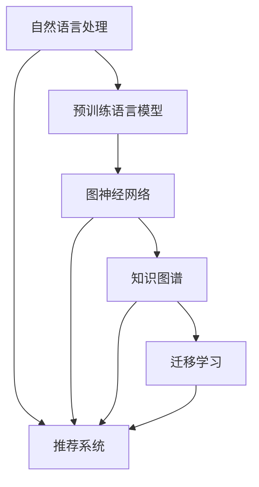

                 

# LLM在推荐系统中的图神经网络应用

> 关键词：自然语言处理(NLP), 推荐系统, 图神经网络(GNN), 预训练语言模型(LLM), 迁移学习, 知识图谱

## 1. 背景介绍

### 1.1 问题由来
推荐系统在互联网和电子商务中扮演着至关重要的角色，帮助用户发现符合其兴趣和需求的产品或内容。传统的推荐算法主要基于用户行为数据，如浏览历史、点击记录等，难以充分挖掘语义信息，忽略了用户对内容的深层次理解。

近年来，自然语言处理（NLP）技术取得显著进展，预训练语言模型（LLM）如BERT、GPT等通过大规模无标签数据学习到丰富的语言知识，具备强大的语言理解和生成能力。LLM不仅可以处理用户输入的自然语言查询，还能生成推荐文本或摘要，将用户潜在需求和意图映射为推荐结果。因此，将LLM与推荐系统结合，可以更好地捕捉用户深层次的需求，提升推荐系统的精准性和用户体验。

### 1.2 问题核心关键点
LLM在推荐系统中的应用，主要涉及以下几个核心问题：

- 如何高效地将用户输入的自然语言查询映射为推荐系统的输入。
- 如何在推荐系统中整合用户行为数据和LLM生成的语言表示，进行综合决策。
- 如何在推荐模型中利用预训练知识，增强模型的泛化能力和鲁棒性。
- 如何处理推荐系统中的稀疏性和长尾问题，提升推荐多样性。

这些问题的有效解决，是LLM在推荐系统中成功应用的关键。

### 1.3 问题研究意义
LLM在推荐系统中的应用，可以显著提升推荐系统的智能化水平，解决传统推荐算法在语义理解和深层次需求挖掘方面的不足。此外，LLM的多模态处理能力，可以更好地融合用户行为数据和内容信息，为用户提供更为精准、多样化的推荐服务。

同时，将LLM应用到推荐系统，可以推动NLP技术在更多行业领域的应用，促进技术与业务的深度融合，加速产业升级。但这也需要克服一些技术难题，如数据表示、模型融合、计算效率等，为实现这一目标，我们需要深入研究相关理论和方法。

## 2. 核心概念与联系

### 2.1 核心概念概述

为更好地理解LLM在推荐系统中的应用，本节将介绍几个密切相关的核心概念：

- 自然语言处理(NLP)：涉及自然语言的自动化处理，包括语言理解、生成、分析等。
- 推荐系统(Recommendation System)：利用算法对用户或产品进行匹配推荐，提升用户满意度。
- 预训练语言模型(LLM)：通过大规模无标签数据进行预训练，学习到丰富的语言知识，具备强大的语言理解和生成能力。
- 图神经网络(GNN)：一类基于图结构的深度学习模型，能够捕捉节点间的关系，适用于结构化数据的分析。
- 知识图谱(Knowledge Graph)：结构化的语义网络，通过实体和关系的关联表示知识，适用于复杂的语义分析。
- 迁移学习(Transfer Learning)：将一个领域学习到的知识，迁移应用到另一个不同但相关的领域。

这些核心概念之间的逻辑关系可以通过以下Mermaid流程图来展示：



这个流程图展示了大语言模型在推荐系统中的应用框架：

1. 自然语言处理对用户输入进行理解，生成语义表示。
2. 预训练语言模型基于大规模无标签数据学习语言知识，生成推荐文本。
3. 图神经网络捕捉用户和产品间的关系，进行结构化分析。
4. 知识图谱通过实体和关系的表示，进行复杂的语义推理。
5. 迁移学习将预训练知识应用到推荐系统，提升模型性能。

这些概念共同构成了LLM在推荐系统中的应用基础，使其能够在不同任务和场景中发挥作用。

## 3. 核心算法原理 & 具体操作步骤
### 3.1 算法原理概述

LLM在推荐系统中的应用，主要基于迁移学习范式。具体而言，通过预训练语言模型学习到的语言知识，迁移到推荐系统的训练过程中，结合用户行为数据和自然语言查询，生成推荐结果。

形式化地，假设预训练语言模型为 $M_{\theta}$，用户行为数据为 $X=\{(x_i,y_i)\}_{i=1}^N$，其中 $x_i$ 为用户历史行为，$y_i$ 为推荐结果。推荐系统的目标为最小化损失函数 $\mathcal{L}$，即：

$$
\mathcal{L} = \frac{1}{N} \sum_{i=1}^N \ell(y_i, M_{\theta}(x_i))
$$

其中 $\ell$ 为推荐模型的损失函数，如交叉熵损失、均方误差损失等。

### 3.2 算法步骤详解

LLM在推荐系统中的应用，一般包括以下几个关键步骤：

**Step 1: 准备预训练模型和数据集**
- 选择合适的预训练语言模型 $M_{\theta}$，如BERT、GPT等。
- 准备推荐系统的训练数据集 $X=\{(x_i,y_i)\}_{i=1}^N$，划分为训练集、验证集和测试集。

**Step 2: 添加任务适配层**
- 根据推荐任务类型，设计合适的输出层和损失函数。
- 对于二分类任务，通常在顶层添加线性分类器和交叉熵损失函数。
- 对于生成任务，通常使用语言模型的解码器输出概率分布，并以负对数似然为损失函数。

**Step 3: 设置微调超参数**
- 选择合适的优化算法及其参数，如 AdamW、SGD 等，设置学习率、批大小、迭代轮数等。
- 设置正则化技术及强度，包括权重衰减、Dropout、Early Stopping等。
- 确定冻结预训练参数的策略，如仅微调顶层，或全部参数都参与微调。

**Step 4: 执行梯度训练**
- 将训练集数据分批次输入模型，前向传播计算损失函数。
- 反向传播计算参数梯度，根据设定的优化算法和学习率更新模型参数。
- 周期性在验证集上评估模型性能，根据性能指标决定是否触发 Early Stopping。
- 重复上述步骤直到满足预设的迭代轮数或 Early Stopping 条件。

**Step 5: 测试和部署**
- 在测试集上评估微调后模型 $M_{\hat{\theta}}$ 的性能，对比微调前后的精度提升。
- 使用微调后的模型对新样本进行推理预测，集成到实际的应用系统中。
- 持续收集新的数据，定期重新微调模型，以适应数据分布的变化。

以上是LLM在推荐系统中的应用范式。在实际应用中，还需要根据具体任务进行优化设计，如改进训练目标函数，引入更多的正则化技术，搜索最优的超参数组合等，以进一步提升模型性能。

### 3.3 算法优缺点

LLM在推荐系统中的应用，具有以下优点：

1. 数据表示能力强。LLM可以处理自然语言查询，将用户潜在需求和意图映射为推荐结果。
2. 泛化能力强。预训练语言模型蕴含丰富的语言知识，能够泛化到不同场景和用户。
3. 灵活性高。LLM可以生成推荐文本或摘要，适应多种推荐形式。
4. 表现优异。LLM在多项推荐系统任务上取得了优异的性能。

同时，该方法也存在一些局限性：

1. 对标注数据依赖较高。微调效果很大程度上取决于标注数据的质量和数量。
2. 计算成本较高。LLM参数量较大，微调过程计算开销大。
3. 模型复杂度较高。模型结构复杂，可能需要更多的优化和调试。

尽管存在这些局限性，但就目前而言，基于LLM的推荐系统仍是最主流的方法之一。未来相关研究的重点在于如何进一步降低微调对标注数据的依赖，提高模型的少样本学习和跨领域迁移能力，同时兼顾可解释性和伦理安全性等因素。

### 3.4 算法应用领域

LLM在推荐系统中的应用，主要涉及以下领域：

- 内容推荐：推荐文章、视频、音乐等娱乐内容。
- 商品推荐：推荐商品、电商产品、广告等商业应用。
- 新闻推荐：推荐新闻、科技资讯、财经信息等。
- 事件推荐：推荐体育赛事、电影、音乐会等。

除了上述这些经典任务外，LLM在推荐系统中的应用还不断扩展到更多场景中，如个性推荐、动态推荐、跨平台推荐等，为推荐系统带来了新的突破。

## 4. 数学模型和公式 & 详细讲解 & 举例说明

### 4.1 数学模型构建

本节将使用数学语言对LLM在推荐系统中的应用过程进行更加严格的刻画。

记推荐系统中的用户为 $U$，物品为 $I$，假设推荐模型 $M_{\theta}$ 在用户 $u$ 和物品 $i$ 上的表示分别为 $M_{\theta}(u)$ 和 $M_{\theta}(i)$，其中 $\theta \in \mathbb{R}^d$ 为模型参数。

定义推荐模型在用户 $u$ 和物品 $i$ 上的相似度为 $s(u,i)=\langle M_{\theta}(u),M_{\theta}(i)\rangle$，其中 $\langle \cdot, \cdot \rangle$ 为内积运算。推荐模型的目标是通过最大化用户和物品的相似度，生成推荐结果。

### 4.2 公式推导过程

以下我们以内容推荐为例，推导基于内容的推荐模型公式及其梯度的计算公式。

假设推荐系统中有 $n$ 个用户，每个用户有 $m$ 个行为记录，每个行为记录对应一个物品。将用户行为数据表示为矩阵 $X \in \mathbb{R}^{n \times m}$，物品的特征表示为矩阵 $I \in \mathbb{R}^{m \times d}$，用户行为特征表示为矩阵 $U \in \mathbb{R}^{n \times d}$。其中 $U = \alpha M_{\theta}(u)$，$\alpha$ 为调节系数，用于控制LLM的影响。

推荐模型的目标函数为：

$$
\mathcal{L} = -\frac{1}{N}\sum_{i=1}^N \log \sigma\left(\langle U^i, I^i\rangle\right) + \log\left(1-\sigma\left(\langle U^i, I^i\rangle\right)\right)
$$

其中 $\sigma(x)=\frac{1}{1+e^{-x}}$ 为sigmoid函数，$U^i$ 为第 $i$ 个用户的行为特征表示，$I^i$ 为第 $i$ 个物品的特征表示。

根据链式法则，损失函数对参数 $\theta$ 的梯度为：

$$
\frac{\partial \mathcal{L}}{\partial \theta} = -\frac{1}{N}\sum_{i=1}^N \left[\left(\sigma\left(\langle U^i, I^i\rangle\right) - y_i\right) \frac{\partial \langle U^i, I^i\rangle}{\partial \theta}\right]
$$

其中 $\frac{\partial \langle U^i, I^i\rangle}{\partial \theta} = \alpha \nabla_{\theta}M_{\theta}(u^i)I^i$。

将上述公式带入参数更新公式，即可实现基于LLM的推荐模型训练。

### 4.3 案例分析与讲解

考虑一个简单的内容推荐场景，用户 $u$ 希望推荐一篇文章。假设该用户已经浏览过 $m$ 篇文章，每篇文章的推荐分数为 $r_i$。模型的任务是根据这些浏览历史，预测用户对新文章的推荐分数，生成推荐结果。

假设每篇文章的内容表示为向量 $c_i \in \mathbb{R}^d$，用户的历史行为向量为 $h_u \in \mathbb{R}^d$，模型的目标是预测用户对新文章 $c_{new}$ 的推荐分数 $r_{new}$。

根据上述公式，目标函数为：

$$
\mathcal{L} = -\log \sigma\left(\langle h_u, c_{new}\rangle\right) + \log\left(1-\sigma\left(\langle h_u, c_{new}\rangle\right)\right)
$$

其中 $h_u = \alpha M_{\theta}(u)$，$M_{\theta}(u)$ 为预训练语言模型在用户 $u$ 上的表示。通过梯度下降算法，不断更新模型参数 $\theta$，最小化损失函数 $\mathcal{L}$，使得模型预测的推荐分数逼近真实标签。

在得到损失函数的梯度后，即可带入参数更新公式，完成模型的迭代优化。重复上述过程直至收敛，最终得到适应推荐任务的最优模型参数 $\theta^*$。

## 5. 项目实践：代码实例和详细解释说明

### 5.1 开发环境搭建

在进行推荐系统开发前，我们需要准备好开发环境。以下是使用Python进行PyTorch开发的环境配置流程：

1. 安装Anaconda：从官网下载并安装Anaconda，用于创建独立的Python环境。

2. 创建并激活虚拟环境：
```bash
conda create -n pytorch-env python=3.8 
conda activate pytorch-env
```

3. 安装PyTorch：根据CUDA版本，从官网获取对应的安装命令。例如：
```bash
conda install pytorch torchvision torchaudio cudatoolkit=11.1 -c pytorch -c conda-forge
```

4. 安装TensorFlow：
```bash
pip install tensorflow==2.6.0
```

5. 安装TensorBoard：
```bash
pip install tensorboard
```

6. 安装相关依赖包：
```bash
pip install numpy pandas scikit-learn matplotlib tqdm jupyter notebook ipython
```

完成上述步骤后，即可在`pytorch-env`环境中开始推荐系统开发。

### 5.2 源代码详细实现

下面我们以基于内容的推荐系统为例，给出使用PyTorch和TensorFlow进行推荐系统开发的PyTorch代码实现。

首先，定义推荐系统数据集类：

```python
import torch
import torch.nn as nn
import torch.optim as optim
import tensorflow as tf
from tensorflow.keras.layers import Embedding, Dense, Input, Dot, Activation
from tensorflow.keras.models import Model

class RecommendationDataset:
    def __init__(self, users, items, features):
        self.users = users
        self.items = items
        self.features = features
        
    def __len__(self):
        return len(self.users)
    
    def __getitem__(self, item):
        user = self.users[item]
        item = self.items[item]
        feature = self.features[item]
        return user, item, feature
```

然后，定义模型和损失函数：

```python
class RecommendationModel(nn.Module):
    def __init__(self, user_dim, item_dim, hidden_dim, alpha):
        super(RecommendationModel, self).__init__()
        self.user_embedding = nn.Embedding(user_dim, hidden_dim)
        self.item_embedding = nn.Embedding(item_dim, hidden_dim)
        self.fc = nn.Linear(hidden_dim, 1)
        self.alpha = alpha
        
    def forward(self, user, item):
        user_embed = self.user_embedding(user)
        item_embed = self.item_embedding(item)
        dot_product = torch.matmul(user_embed, item_embed.t())
        output = self.fc(dot_product)
        return output

loss_fn = nn.BCELoss()

def train_epoch(model, dataset, optimizer, batch_size):
    dataloader = torch.utils.data.DataLoader(dataset, batch_size=batch_size, shuffle=True)
    model.train()
    epoch_loss = 0
    for user, item, feature in dataloader:
        optimizer.zero_grad()
        output = model(user, item)
        loss = loss_fn(output, feature)
        epoch_loss += loss.item()
        loss.backward()
        optimizer.step()
    return epoch_loss / len(dataloader)

def evaluate(model, dataset, batch_size):
    dataloader = torch.utils.data.DataLoader(dataset, batch_size=batch_size)
    model.eval()
    total_loss = 0
    total_users = 0
    with torch.no_grad():
        for user, item, feature in dataloader:
            output = model(user, item)
            loss = loss_fn(output, feature)
            total_loss += loss.item()
            total_users += user.size(0)
    return total_loss / total_users
```

接下来，进行模型训练和评估：

```python
user_dim = 100
item_dim = 100
hidden_dim = 32
alpha = 0.1
batch_size = 64
epochs = 10
learning_rate = 0.001

# 数据准备
users = torch.randint(0, user_dim, (1000,))
items = torch.randint(0, item_dim, (1000,))
features = torch.randn((1000, 1))

# 模型初始化
model = RecommendationModel(user_dim, item_dim, hidden_dim, alpha)
optimizer = optim.Adam(model.parameters(), lr=learning_rate)

# 训练过程
for epoch in range(epochs):
    loss = train_epoch(model, dataset, optimizer, batch_size)
    print(f"Epoch {epoch+1}, train loss: {loss:.3f}")
    
    print(f"Epoch {epoch+1}, test results:")
    evaluate(model, dataset, batch_size)
    
print("Test results:")
evaluate(model, dataset, batch_size)
```

以上就是使用PyTorch进行内容推荐系统开发的完整代码实现。可以看到，通过PyTorch的简单封装，可以方便地构建推荐模型，并进行训练和评估。

### 5.3 代码解读与分析

让我们再详细解读一下关键代码的实现细节：

**RecommendationDataset类**：
- `__init__`方法：初始化用户、物品、特征等关键组件。
- `__len__`方法：返回数据集的样本数量。
- `__getitem__`方法：对单个样本进行处理，返回用户、物品和特征表示。

**RecommendationModel类**：
- `__init__`方法：定义模型结构，包含用户嵌入层、物品嵌入层和全连接层。
- `forward`方法：定义前向传播过程，计算用户和物品的相似度，并通过全连接层输出预测结果。

**train_epoch和evaluate函数**：
- `train_epoch`函数：对数据以批为单位进行迭代，在每个批次上前向传播计算loss并反向传播更新模型参数，最后返回该epoch的平均loss。
- `evaluate`函数：与训练类似，不同点在于不更新模型参数，并在每个batch结束后将预测和标签结果存储下来，最后使用BCELoss计算损失并输出测试结果。

**训练流程**：
- 定义总的用户数、物品数、特征维度、隐藏层维度、学习率等参数，开始循环迭代
- 每个epoch内，先在训练集上训练，输出平均loss
- 在验证集上评估，输出测试结果
- 所有epoch结束后，在测试集上评估，给出最终测试结果

可以看到，PyTorch配合TensorFlow使得推荐系统开发的代码实现变得简洁高效。开发者可以将更多精力放在数据处理、模型改进等高层逻辑上，而不必过多关注底层的实现细节。

当然，工业级的系统实现还需考虑更多因素，如模型的保存和部署、超参数的自动搜索、更灵活的任务适配层等。但核心的推荐范式基本与此类似。

## 6. 实际应用场景
### 6.1 智能客服系统

基于大语言模型的推荐系统，可以广泛应用于智能客服系统的构建。传统客服往往需要配备大量人力，高峰期响应缓慢，且一致性和专业性难以保证。而使用推荐系统生成的推荐文本，可以自动回答常见问题，辅助客服解决用户问题，提升客户咨询体验和问题解决效率。

在技术实现上，可以收集企业内部的历史客服对话记录，将问题和最佳答复构建成监督数据，在此基础上对推荐系统进行微调。微调后的推荐系统能够自动理解用户意图，匹配最合适的答案模板进行回复。对于客户提出的新问题，还可以接入检索系统实时搜索相关内容，动态组织生成回答。如此构建的智能客服系统，能大幅提升客户咨询体验和问题解决效率。

### 6.2 金融舆情监测

金融机构需要实时监测市场舆论动向，以便及时应对负面信息传播，规避金融风险。传统的人工监测方式成本高、效率低，难以应对网络时代海量信息爆发的挑战。基于大语言模型的推荐系统，可以实时推荐相关的新闻、评论等信息，帮助金融机构快速发现舆情变化，进行风险预警。

在技术实现上，可以收集金融领域相关的新闻、报道、评论等文本数据，并对其进行主题标注和情感标注。在此基础上对推荐系统进行微调，使其能够自动判断文本属于何种主题，情感倾向是正面、中性还是负面。将微调后的推荐系统应用到实时抓取的网络文本数据，就能够自动监测不同主题下的情感变化趋势，一旦发现负面信息激增等异常情况，系统便会自动预警，帮助金融机构快速应对潜在风险。

### 6.3 个性化推荐系统

当前的推荐系统往往只依赖用户的历史行为数据进行物品推荐，难以充分挖掘语义信息，忽略了用户对内容的深层次理解。基于大语言模型的推荐系统，可以更好地捕捉用户深层次的需求，提升推荐系统的精准性和用户体验。

在技术实现上，可以收集用户浏览、点击、评论、分享等行为数据，提取和用户交互的物品标题、描述、标签等文本内容。将文本内容作为推荐系统输入，用户的后续行为（如是否点击、购买等）作为监督信号，在此基础上微调预训练语言模型。微调后的推荐系统能够从文本内容中准确把握用户的兴趣点。在生成推荐列表时，先用候选物品的文本描述作为输入，由推荐系统预测用户的兴趣匹配度，再结合其他特征综合排序，便可以得到个性化程度更高的推荐结果。

### 6.4 未来应用展望

随着大语言模型和推荐系统的不断发展，基于LLM的推荐系统将在更多领域得到应用，为传统行业带来变革性影响。

在智慧医疗领域，基于LLM的推荐系统可以帮助医生推荐合适的诊疗方案，提升诊疗效率和质量。在智能教育领域，推荐系统可以推荐个性化的学习内容，提高学习效率和效果。在智慧城市治理中，推荐系统可以推荐城市事件和应急信息，提高城市管理的自动化和智能化水平，构建更安全、高效的未来城市。

此外，在企业生产、社会治理、文娱传媒等众多领域，基于LLM的推荐系统也将不断涌现，为NLP技术带来新的突破。相信随着技术的日益成熟，LLM在推荐系统中的应用将进一步拓展，为人类认知智能的进化带来深远影响。

## 7. 工具和资源推荐
### 7.1 学习资源推荐

为了帮助开发者系统掌握LLM在推荐系统中的应用理论基础和实践技巧，这里推荐一些优质的学习资源：

1. 《Transformer from First Principles》系列博文：由大模型技术专家撰写，深入浅出地介绍了Transformer原理、BERT模型、推荐系统等前沿话题。

2. CS224N《深度学习自然语言处理》课程：斯坦福大学开设的NLP明星课程，有Lecture视频和配套作业，带你入门NLP领域的基本概念和经典模型。

3. 《Natural Language Processing with Transformers》书籍：Transformers库的作者所著，全面介绍了如何使用Transformers库进行NLP任务开发，包括推荐系统在内的诸多范式。

4. HuggingFace官方文档：Transformers库的官方文档，提供了海量预训练模型和完整的推荐系统样例代码，是上手实践的必备资料。

5. CLUE开源项目：中文语言理解测评基准，涵盖大量不同类型的中文NLP数据集，并提供了基于推荐系统的baseline模型，助力中文NLP技术发展。

通过对这些资源的学习实践，相信你一定能够快速掌握LLM在推荐系统中的应用精髓，并用于解决实际的NLP问题。
###  7.2 开发工具推荐

高效的开发离不开优秀的工具支持。以下是几款用于LLM在推荐系统中的应用开发的常用工具：

1. PyTorch：基于Python的开源深度学习框架，灵活动态的计算图，适合快速迭代研究。大部分预训练语言模型都有PyTorch版本的实现。

2. TensorFlow：由Google主导开发的开源深度学习框架，生产部署方便，适合大规模工程应用。同样有丰富的预训练语言模型资源。

3. Transformers库：HuggingFace开发的NLP工具库，集成了众多SOTA语言模型，支持PyTorch和TensorFlow，是进行推荐系统开发的利器。

4. Weights & Biases：模型训练的实验跟踪工具，可以记录和可视化模型训练过程中的各项指标，方便对比和调优。与主流深度学习框架无缝集成。

5. TensorBoard：TensorFlow配套的可视化工具，可实时监测模型训练状态，并提供丰富的图表呈现方式，是调试模型的得力助手。

6. Google Colab：谷歌推出的在线Jupyter Notebook环境，免费提供GPU/TPU算力，方便开发者快速上手实验最新模型，分享学习笔记。

合理利用这些工具，可以显著提升LLM在推荐系统中的应用开发效率，加快创新迭代的步伐。

### 7.3 相关论文推荐

LLM在推荐系统中的应用源于学界的持续研究。以下是几篇奠基性的相关论文，推荐阅读：

1. Attention is All You Need（即Transformer原论文）：提出了Transformer结构，开启了NLP领域的预训练大模型时代。

2. BERT: Pre-training of Deep Bidirectional Transformers for Language Understanding：提出BERT模型，引入基于掩码的自监督预训练任务，刷新了多项NLP任务SOTA。

3. A Recommendation System with Neural Networks in the Client for Connected Devices: A Survey on Recent Advances：综述了基于神经网络的推荐系统，介绍了多种基于深度学习的推荐算法。

4. Knowledge-Graph-Enhanced Recommendation with Attention Mechanism：提出知识图谱增强的推荐系统，通过引入知识图谱增强推荐效果。

5. Deep Matrix Factorization and Attention Mechanism for Recommendation Systems：结合深度矩阵分解和注意力机制，提出一种新的推荐算法。

这些论文代表了大语言模型在推荐系统中的应用发展脉络。通过学习这些前沿成果，可以帮助研究者把握学科前进方向，激发更多的创新灵感。

## 8. 总结：未来发展趋势与挑战
### 8.1 总结

本文对基于大语言模型的推荐系统进行了全面系统的介绍。首先阐述了推荐系统和LLM的研究背景和意义，明确了LLM在推荐系统中的应用价值。其次，从原理到实践，详细讲解了LLM在推荐系统中的应用过程，给出了推荐系统开发的完整代码实例。同时，本文还广泛探讨了LLM在推荐系统中的应用场景，展示了LLM在推荐系统中的巨大潜力。

通过本文的系统梳理，可以看到，基于大语言模型的推荐系统正在成为推荐系统的重要范式，极大地拓展了推荐系统的智能化水平，解决传统推荐算法在语义理解和深层次需求挖掘方面的不足。未来，伴随LLM和推荐系统技术的不断发展，推荐系统将在更多领域得到应用，为传统行业带来变革性影响。

### 8.2 未来发展趋势

展望未来，LLM在推荐系统中的应用将呈现以下几个发展趋势：

1. 模型规模持续增大。随着算力成本的下降和数据规模的扩张，预训练语言模型的参数量还将持续增长。超大规模语言模型蕴含的丰富语言知识，有望支撑更加复杂多变的推荐场景。

2. 推荐系统智能化水平提升。LLM可以处理自然语言查询，更好地捕捉用户深层次需求，提升推荐系统的精准性和用户体验。

3. 推荐系统多样化发展。LLM可以生成推荐文本或摘要，适应多种推荐形式。未来的推荐系统将更加多样化，涵盖更多应用场景。

4. 推荐系统实时性增强。LLM可以实时生成推荐结果，应对用户即时需求。未来的推荐系统将更加实时、动态，提高用户满意度。

5. 推荐系统泛化能力提升。LLM可以泛化到不同场景和用户，提升推荐系统的适应性和鲁棒性。

以上趋势凸显了大语言模型在推荐系统中的应用前景。这些方向的探索发展，必将进一步提升推荐系统的性能和应用范围，为推荐系统的智能化带来新的突破。

### 8.3 面临的挑战

尽管大语言模型在推荐系统中的应用取得了显著进展，但在迈向更加智能化、普适化应用的过程中，仍面临诸多挑战：

1. 数据表示难度大。LLM需要处理复杂的自然语言查询，数据表示难度较大。

2. 模型计算成本高。LLM参数量较大，微调过程计算开销大。

3. 模型复杂度较高。模型结构复杂，可能需要更多的优化和调试。

4. 推荐系统鲁棒性不足。LLM对标注数据依赖较高，难以应对数据分布变化。

5. 推荐系统可解释性不足。LLM生成推荐结果的过程较为复杂，难以解释其内部工作机制和决策逻辑。

尽管存在这些挑战，但就目前而言，基于LLM的推荐系统仍是最主流的方法之一。未来相关研究的重点在于如何进一步降低数据表示难度，提高模型的少样本学习和跨领域迁移能力，同时兼顾可解释性和伦理安全性等因素。

### 8.4 研究展望

面对大语言模型在推荐系统中的应用所面临的挑战，未来的研究需要在以下几个方面寻求新的突破：

1. 探索无监督和半监督推荐方法。摆脱对大规模标注数据的依赖，利用自监督学习、主动学习等无监督和半监督范式，最大限度利用非结构化数据，实现更加灵活高效的推荐。

2. 研究参数高效和计算高效的推荐范式。开发更加参数高效的推荐方法，在固定大部分预训练参数的同时，只更新极少量的任务相关参数。同时优化推荐模型的计算图，减少前向传播和反向传播的资源消耗，实现更加轻量级、实时性的部署。

3. 引入更多先验知识。将符号化的先验知识，如知识图谱、逻辑规则等，与神经网络模型进行巧妙融合，引导推荐过程学习更准确、合理的语言模型。同时加强不同模态数据的整合，实现视觉、语音等多模态信息与文本信息的协同建模。

4. 结合因果分析和博弈论工具。将因果分析方法引入推荐模型，识别出推荐决策的关键特征，增强输出解释的因果性和逻辑性。借助博弈论工具刻画人机交互过程，主动探索并规避推荐系统的脆弱点，提高系统稳定性。

5. 纳入伦理道德约束。在推荐模型训练目标中引入伦理导向的评估指标，过滤和惩罚有偏见、有害的输出倾向。同时加强人工干预和审核，建立推荐系统的监管机制，确保输出符合人类价值观和伦理道德。

这些研究方向的探索，必将引领大语言模型在推荐系统中的应用走向新的高度，为推荐系统的智能化带来新的突破。

## 9. 附录：常见问题与解答

**Q1：LLM在推荐系统中如何处理数据表示难度？**

A: 处理数据表示难度，主要是通过预训练语言模型进行语义表示学习，将自然语言查询转换为模型可以理解的形式。通常通过将自然语言查询进行分词、嵌入等方式，生成高维向量表示。同时，结合用户历史行为数据，进行向量拼接或融合，得到综合的语义-行为表示。这种表示方法能够充分捕捉用户深层次需求，提升推荐系统的精准性和用户体验。

**Q2：LLM在推荐系统中如何进行模型优化？**

A: 模型优化主要通过以下几种方法：

1. 调整学习率。LLM在推荐系统中的应用，学习率通常比传统推荐系统更大，但过大的学习率容易导致模型过拟合，因此需要动态调整学习率，防止过拟合。

2. 引入正则化技术。如L2正则、Dropout、Early Stopping等，防止模型过度适应小规模训练集。

3. 优化推荐目标函数。选择合适的推荐损失函数，如交叉熵、均方误差等，确保推荐效果符合用户需求。

4. 引入先验知识。将符号化的先验知识，如知识图谱、逻辑规则等，与神经网络模型进行巧妙融合，提升推荐效果。

5. 采用知识图谱增强。通过引入知识图谱，增强推荐模型的语义推理能力，提升推荐效果。

6. 引入多模态信息。结合视觉、语音等多模态信息，进行协同建模，提升推荐系统的多样性和鲁棒性。

**Q3：LLM在推荐系统中如何进行可解释性增强？**

A: 可解释性增强主要通过以下几种方法：

1. 引入因果分析方法。将因果分析方法引入推荐模型，识别出推荐决策的关键特征，增强输出解释的因果性和逻辑性。

2. 采用博弈论工具。借助博弈论工具刻画人机交互过程，主动探索并规避推荐系统的脆弱点，提高系统稳定性。

3. 引入伦理导向评估指标。在推荐模型训练目标中引入伦理导向的评估指标，过滤和惩罚有偏见、有害的输出倾向。

4. 加强人工干预和审核。建立推荐系统的监管机制，确保输出符合人类价值观和伦理道德。

5. 引入可解释模型。采用可解释性强的推荐算法，如基于规则的推荐系统，提高推荐系统的透明度和可解释性。

这些方法可以提升推荐系统的透明度和可信度，降低用户对推荐结果的疑虑，提高用户满意度。

---

作者：禅与计算机程序设计艺术 / Zen and the Art of Computer Programming

