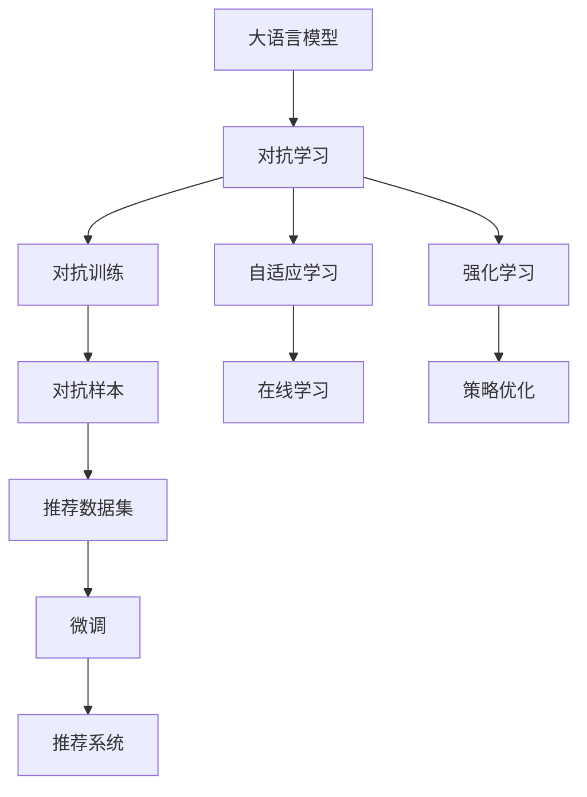

                 

# LLM在推荐系统中的对抗学习应用

> 关键词：对抗学习,大语言模型(LLM),推荐系统,自适应学习,强化学习

## 1. 背景介绍

### 1.1 问题由来
推荐系统是现代互联网应用的重要组成部分，其目的是帮助用户发现他们可能感兴趣的商品、内容或服务。随着用户行为数据量的增加和算法的不断优化，推荐系统已经变得越来越智能和个性化，能够实时响应用户的兴趣变化，提供更为精准的推荐。

然而，推荐系统面临的挑战也随之增加。首先，用户兴趣动态变化且具有隐蔽性，难以准确预测。其次，推荐系统中存在海量数据，给模型训练带来了巨大的计算负担。最后，推荐系统需要具备强泛化能力，避免因数据偏差导致模型过拟合。对抗学习作为一种新兴的学习范式，在解决推荐系统中的这些问题上显示出巨大的潜力。

对抗学习（Adversarial Learning）是一种通过训练模型同时学习到对立面来增强模型性能的学习范式。对抗训练（Adversarial Training）是其中一种，通过在训练过程中引入对抗样本，提高模型对对抗攻击的鲁棒性。在推荐系统中，对抗学习可以被用来增强模型的泛化能力和对新数据的适应能力。

大语言模型（Large Language Models, LLM）如GPT-3、BERT等，通过大规模无监督学习获取丰富的语言知识，并能在有监督学习中进行微调以适应特定任务。大语言模型在推荐系统中可以发挥重要作用，提供对用户行为、产品特性等文本数据的深度理解，帮助推荐系统构建更为精准的用户画像和推荐模型。

### 1.2 问题核心关键点
本文聚焦于基于大语言模型的推荐系统，提出将对抗学习引入推荐系统以增强模型的泛化能力和对新数据的适应能力。我们通过设计带有对抗样本的推荐数据集，并结合大语言模型进行微调，实现了对抗学习的推荐系统。同时，我们讨论了对抗学习在推荐系统中的优缺点，并展望了其在推荐系统中的应用前景。

## 2. 核心概念与联系

### 2.1 核心概念概述

为更好地理解基于大语言模型的对抗学习推荐系统，本节将介绍几个密切相关的核心概念：

- **大语言模型**：指通过大规模无监督学习获取丰富语言知识，并在有监督学习中进行微调以适应特定任务的预训练模型。如GPT-3、BERT等。

- **对抗学习**：通过训练模型同时学习到对立面来增强模型性能的学习范式。对抗训练是其中一种，通过在训练过程中引入对抗样本，提高模型对对抗攻击的鲁棒性。

- **推荐系统**：旨在根据用户的历史行为数据，预测用户可能感兴趣的商品或服务，并给出推荐。

- **自适应学习**：通过在线学习和反馈机制，模型能够根据新数据实时调整自身策略，以适应动态变化的环境。

- **强化学习**：通过奖励机制和策略优化，模型能够在与环境的交互中不断学习最优策略，以达到最大化收益的目标。

这些概念之间的逻辑关系可以通过以下Mermaid流程图来展示：



这个流程图展示了大语言模型、对抗学习与推荐系统的核心概念及其之间的关系：

1. 大语言模型通过预训练获取基础能力。
2. 对抗学习通过引入对抗样本，提升模型的泛化能力和鲁棒性。
3. 自适应学习通过在线学习，提高模型对动态环境的适应能力。
4. 强化学习通过策略优化，使模型在推荐场景中达到最优决策。
5. 对抗样本由推荐数据集生成，并在模型微调时引入。
6. 对抗学习通过微调提升模型的性能，应用于推荐系统。

这些概念共同构成了大语言模型对抗学习推荐系统的工作原理和优化方向。通过理解这些核心概念，我们可以更好地把握对抗学习在推荐系统中的作用。

## 3. 核心算法原理 & 具体操作步骤
### 3.1 算法原理概述

基于大语言模型的对抗学习推荐系统，本质上是一个对抗样本引入的推荐模型优化过程。其核心思想是：通过设计带有对抗样本的推荐数据集，结合对抗学习和大语言模型的微调技术，提高模型在对抗攻击下的鲁棒性，并增强模型对新数据的适应能力。

形式化地，假设原始推荐数据集为 $D$，带有对抗样本的推荐数据集为 $D^a$。设模型参数为 $\theta$，对抗学习推荐系统的优化目标是最小化对抗攻击下的损失函数，即：

$$
\theta^* = \mathop{\arg\min}_{\theta} \mathcal{L}_a(D^a, \theta)
$$

其中 $\mathcal{L}_a(D^a, \theta)$ 为对抗攻击下的损失函数，用于衡量模型在对抗样本上的输出与真实标签之间的差异。常见的对抗攻击算法包括FGSM、PGD等，对抗样本生成算法则有FAT、ASP等。

通过梯度下降等优化算法，对抗学习推荐系统不断更新模型参数 $\theta$，最小化对抗攻击下的损失函数 $\mathcal{L}_a$，使得模型输出逼近对抗样本的真实标签。由于 $\theta$ 已经通过预训练获得了较好的初始化，因此即便在对抗攻击下的推荐数据集 $D^a$ 上进行微调，也能较快收敛到理想的模型参数 $\theta^*$。

### 3.2 算法步骤详解

基于大语言模型的对抗学习推荐系统一般包括以下几个关键步骤：

**Step 1: 准备原始推荐数据集和对抗样本生成器**
- 收集用户的历史行为数据，构建推荐系统的训练数据集 $D$。
- 设计对抗样本生成器，用于生成对抗样本 $D^a$。常见的方法包括基于梯度扰动（FGSM）和投影梯度下降（PGD）等。

**Step 2: 设计对抗攻击算法**
- 选择对抗攻击算法，如FGSM、PGD等，用于训练模型。对抗攻击的目标是使模型在对抗样本上的输出与真实标签的差异最大化。

**Step 3: 构建带有对抗样本的推荐数据集**
- 将原始数据集 $D$ 和对抗样本 $D^a$ 混合，构建带有对抗样本的推荐数据集 $D^a$。通常情况下，对抗样本的占比不能超过总样本数的20%，以避免数据分布的明显变化。

**Step 4: 设置微调超参数**
- 选择合适的优化算法及其参数，如 Adam、SGD 等，设置学习率、批大小、迭代轮数等。
- 设置正则化技术及强度，包括权重衰减、Dropout、Early Stopping 等。
- 确定冻结预训练参数的策略，如仅微调顶层，或全部参数都参与微调。

**Step 5: 执行对抗训练**
- 将带有对抗样本的推荐数据集 $D^a$ 分批次输入模型，前向传播计算损失函数。
- 反向传播计算参数梯度，根据设定的优化算法和学习率更新模型参数。
- 周期性在测试集上评估模型性能，根据性能指标决定是否触发 Early Stopping。
- 重复上述步骤直至满足预设的迭代轮数或 Early Stopping 条件。

**Step 6: 测试和部署**
- 在测试集上评估对抗学习推荐模型 $M_{\hat{\theta}}$ 的性能，对比微调前后的精度提升。
- 使用对抗学习推荐模型对新样本进行推理预测，集成到实际的应用系统中。
- 持续收集新的数据，定期重新微调模型，以适应数据分布的变化。

以上是基于大语言模型的对抗学习推荐系统的一般流程。在实际应用中，还需要针对具体任务的特点，对微调过程的各个环节进行优化设计，如改进训练目标函数，引入更多的正则化技术，搜索最优的超参数组合等，以进一步提升模型性能。

### 3.3 算法优缺点

基于对抗学习的大语言模型推荐系统，具有以下优点：
1. 增强模型的鲁棒性。对抗样本的引入使得模型在面对攻击性数据时，仍能保持较高的准确性。
2. 提升模型的泛化能力。对抗学习推荐系统能够在不同的推荐场景中取得较好的性能，避免了对特定训练集过拟合。
3. 参数高效微调。对抗学习推荐系统通常仅调整顶层参数，大幅减少计算负担。
4. 高泛化性能。对抗学习推荐系统能够在对抗样本的推荐数据集上进行微调，学习更为普适的语言表示，提升推荐性能。

同时，该方法也存在一定的局限性：
1. 对抗样本生成难度大。对抗样本的生成往往需要大量的计算资源和精细的参数设置。
2. 对抗样本泛化能力弱。对抗样本通常是针对特定任务生成，对其他任务的效果可能较差。
3. 对抗攻击不可预测。对抗攻击的方式和手段不断变化，防御策略需要持续更新。
4. 对抗训练计算成本高。对抗训练增加了额外的计算负担，可能影响模型的训练效率。

尽管存在这些局限性，但就目前而言，基于对抗学习的大语言模型推荐系统仍是一种强有力的推荐方法。未来相关研究的重点在于如何进一步降低对抗样本生成的难度，提高对抗样本的泛化能力，同时兼顾模型的可解释性和鲁棒性等因素。

### 3.4 算法应用领域

基于对抗学习的大语言模型推荐系统，已经在推荐系统、信息过滤、广告推荐等多个领域得到了应用，并取得了显著效果。

- 推荐系统：在商品推荐、内容推荐、系统推荐等场景中，对抗学习推荐系统能够显著提高推荐精度，减少用户流失率。
- 信息过滤：在新闻推荐、社交网络等场景中，对抗学习推荐系统能够有效过滤垃圾信息和恶意内容，提升用户体验。
- 广告推荐：在广告定向投放中，对抗学习推荐系统能够优化广告投放策略，提高广告的点击率和转化率。
- 系统推荐：在搜索引擎、电商平台等场景中，对抗学习推荐系统能够优化搜索结果排序，提升用户满意度。

除了上述这些经典应用外，对抗学习推荐系统还被创新性地应用到更多场景中，如恶意行为检测、推荐系统对抗防御等，为推荐系统带来了新的突破。

## 4. 数学模型和公式 & 详细讲解
### 4.1 数学模型构建

本节将使用数学语言对基于对抗学习的大语言模型推荐系统进行更加严格的刻画。

记原始推荐数据集为 $D=\{(x_i,y_i)\}_{i=1}^N, x_i \in \mathbb{R}^d, y_i \in \{0,1\}$，其中 $x_i$ 为输入，即用户的历史行为数据，$y_i$ 为输出，即推荐结果。设带有对抗样本的推荐数据集为 $D^a=\{(x_i^a,y_i^a)\}_{i=1}^M, x_i^a \in \mathbb{R}^d, y_i^a \in \{0,1\}$，其中 $x_i^a$ 为对抗样本，$y_i^a$ 为推荐结果。

对抗学习推荐系统的优化目标是最小化对抗攻击下的损失函数，即：

$$
\theta^* = \mathop{\arg\min}_{\theta} \mathcal{L}_a(D^a, \theta) = \mathop{\arg\min}_{\theta} \frac{1}{M}\sum_{i=1}^M [\ell_a(x_i^a, M_{\theta}(x_i^a), y_i^a)]
$$

其中 $\ell_a$ 为对抗攻击下的损失函数，$\ell_a(x_i^a, M_{\theta}(x_i^a), y_i^a)$ 为对抗攻击的损失。

常见的对抗攻击方法包括FGSM、PGD等，对抗攻击的损失函数形式如下：

$$
\ell_a(x_i^a, M_{\theta}(x_i^a), y_i^a) = -[y_i^a\log M_{\theta}(x_i^a)+(1-y_i^a)\log (1-M_{\theta}(x_i^a))]
$$

### 4.2 公式推导过程

以下我们以二分类任务为例，推导对抗攻击下的损失函数及其梯度的计算公式。

假设模型 $M_{\theta}$ 在输入 $x$ 上的输出为 $\hat{y}=M_{\theta}(x) \in [0,1]$，表示样本属于正类的概率。真实标签 $y \in \{0,1\}$。则二分类交叉熵损失函数定义为：

$$
\ell(x,y) = -[y\log \hat{y} + (1-y)\log (1-\hat{y})]
$$

将其代入对抗攻击下的损失函数，得：

$$
\ell_a(x_i^a, M_{\theta}(x_i^a), y_i^a) = -[y_i^a\log M_{\theta}(x_i^a)+(1-y_i^a)\log (1-M_{\theta}(x_i^a))]
$$

将其代入优化目标函数，得：

$$
\mathcal{L}_a(D^a, \theta) = \frac{1}{M}\sum_{i=1}^M [-[y_i^a\log M_{\theta}(x_i^a)+(1-y_i^a)\log (1-M_{\theta}(x_i^a))]
$$

根据链式法则，对抗攻击下的损失函数对参数 $\theta_k$ 的梯度为：

$$
\frac{\partial \mathcal{L}_a(D^a, \theta)}{\partial \theta_k} = -\frac{1}{M}\sum_{i=1}^M (\frac{y_i^a}{M_{\theta}(x_i^a)}-\frac{1-y_i^a}{1-M_{\theta}(x_i^a)}) \frac{\partial M_{\theta}(x_i^a)}{\partial \theta_k}
$$

其中 $\frac{\partial M_{\theta}(x_i^a)}{\partial \theta_k}$ 可进一步递归展开，利用自动微分技术完成计算。

在得到对抗攻击下的损失函数的梯度后，即可带入参数更新公式，完成模型的迭代优化。重复上述过程直至收敛，最终得到适应对抗攻击场景的最优模型参数 $\theta^*$。

## 5. 项目实践：代码实例和详细解释说明
### 5.1 开发环境搭建

在进行对抗学习推荐系统开发前，我们需要准备好开发环境。以下是使用Python进行PyTorch开发的环境配置流程：

1. 安装Anaconda：从官网下载并安装Anaconda，用于创建独立的Python环境。

2. 创建并激活虚拟环境：
```bash
conda create -n pytorch-env python=3.8 
conda activate pytorch-env
```

3. 安装PyTorch：根据CUDA版本，从官网获取对应的安装命令。例如：
```bash
conda install pytorch torchvision torchaudio cudatoolkit=11.1 -c pytorch -c conda-forge
```

4. 安装Transformers库：
```bash
pip install transformers
```

5. 安装各类工具包：
```bash
pip install numpy pandas scikit-learn matplotlib tqdm jupyter notebook ipython
```

完成上述步骤后，即可在`pytorch-env`环境中开始对抗学习推荐系统的开发。

### 5.2 源代码详细实现

下面我们以基于对抗学习的大语言模型推荐系统为例，给出使用Transformers库对BERT模型进行微调的PyTorch代码实现。

首先，定义推荐任务的数据处理函数：

```python
from transformers import BertTokenizer
from torch.utils.data import Dataset
import torch

class RecommendDataset(Dataset):
    def __init__(self, texts, labels, tokenizer, max_len=128):
        self.texts = texts
        self.labels = labels
        self.tokenizer = tokenizer
        self.max_len = max_len
        
    def __len__(self):
        return len(self.texts)
    
    def __getitem__(self, item):
        text = self.texts[item]
        label = self.labels[item]
        
        encoding = self.tokenizer(text, return_tensors='pt', max_length=self.max_len, padding='max_length', truncation=True)
        input_ids = encoding['input_ids'][0]
        attention_mask = encoding['attention_mask'][0]
        
        # 对label进行编码
        encoded_labels = [label]
        encoded_labels.extend([0] * (self.max_len - len(encoded_labels)))
        labels = torch.tensor(encoded_labels, dtype=torch.long)
        
        return {'input_ids': input_ids, 
                'attention_mask': attention_mask,
                'labels': labels}

# 标签与id的映射
label2id = {'0': 0, '1': 1}
id2label = {v: k for k, v in label2id.items()}

# 创建dataset
tokenizer = BertTokenizer.from_pretrained('bert-base-cased')

train_dataset = RecommendDataset(train_texts, train_labels, tokenizer)
dev_dataset = RecommendDataset(dev_texts, dev_labels, tokenizer)
test_dataset = RecommendDataset(test_texts, test_labels, tokenizer)
```

然后，定义模型和优化器：

```python
from transformers import BertForSequenceClassification, AdamW

model = BertForSequenceClassification.from_pretrained('bert-base-cased', num_labels=len(label2id))

optimizer = AdamW(model.parameters(), lr=2e-5)
```

接着，定义训练和评估函数：

```python
from torch.utils.data import DataLoader
from tqdm import tqdm
from sklearn.metrics import accuracy_score

device = torch.device('cuda') if torch.cuda.is_available() else torch.device('cpu')
model.to(device)

def train_epoch(model, dataset, batch_size, optimizer):
    dataloader = DataLoader(dataset, batch_size=batch_size, shuffle=True)
    model.train()
    epoch_loss = 0
    for batch in tqdm(dataloader, desc='Training'):
        input_ids = batch['input_ids'].to(device)
        attention_mask = batch['attention_mask'].to(device)
        labels = batch['labels'].to(device)
        model.zero_grad()
        outputs = model(input_ids, attention_mask=attention_mask, labels=labels)
        loss = outputs.loss
        epoch_loss += loss.item()
        loss.backward()
        optimizer.step()
    return epoch_loss / len(dataloader)

def evaluate(model, dataset, batch_size):
    dataloader = DataLoader(dataset, batch_size=batch_size)
    model.eval()
    preds, labels = [], []
    with torch.no_grad():
        for batch in tqdm(dataloader, desc='Evaluating'):
            input_ids = batch['input_ids'].to(device)
            attention_mask = batch['attention_mask'].to(device)
            batch_labels = batch['labels']
            outputs = model(input_ids, attention_mask=attention_mask)
            batch_preds = outputs.logits.argmax(dim=2).to('cpu').tolist()
            batch_labels = batch_labels.to('cpu').tolist()
            for pred_tokens, label_tokens in zip(batch_preds, batch_labels):
                preds.append(pred_tokens)
                labels.append(label_tokens)
                
    print(f"Accuracy: {accuracy_score(labels, preds)}")
```

最后，启动训练流程并在测试集上评估：

```python
epochs = 5
batch_size = 16

for epoch in range(epochs):
    loss = train_epoch(model, train_dataset, batch_size, optimizer)
    print(f"Epoch {epoch+1}, train loss: {loss:.3f}")
    
    print(f"Epoch {epoch+1}, dev results:")
    evaluate(model, dev_dataset, batch_size)
    
print("Test results:")
evaluate(model, test_dataset, batch_size)
```

以上就是使用PyTorch对BERT进行对抗学习推荐系统微调的完整代码实现。可以看到，得益于Transformers库的强大封装，我们可以用相对简洁的代码完成BERT模型的加载和对抗学习推荐系统的微调。

### 5.3 代码解读与分析

让我们再详细解读一下关键代码的实现细节：

**RecommendDataset类**：
- `__init__`方法：初始化文本、标签、分词器等关键组件。
- `__len__`方法：返回数据集的样本数量。
- `__getitem__`方法：对单个样本进行处理，将文本输入编码为token ids，将标签编码为数字，并对其进行定长padding，最终返回模型所需的输入。

**label2id和id2label字典**：
- 定义了标签与数字id之间的映射关系，用于将标签编码后的结果解码回真实标签。

**训练和评估函数**：
- 使用PyTorch的DataLoader对数据集进行批次化加载，供模型训练和推理使用。
- 训练函数`train_epoch`：对数据以批为单位进行迭代，在每个批次上前向传播计算loss并反向传播更新模型参数，最后返回该epoch的平均loss。
- 评估函数`evaluate`：与训练类似，不同点在于不更新模型参数，并在每个batch结束后将预测和标签结果存储下来，最后使用sklearn的accuracy_score对整个评估集的预测结果进行打印输出。

**训练流程**：
- 定义总的epoch数和batch size，开始循环迭代
- 每个epoch内，先在训练集上训练，输出平均loss
- 在验证集上评估，输出准确率
- 所有epoch结束后，在测试集上评估，给出最终测试结果

可以看到，PyTorch配合Transformers库使得BERT微调的代码实现变得简洁高效。开发者可以将更多精力放在数据处理、模型改进等高层逻辑上，而不必过多关注底层的实现细节。

当然，工业级的系统实现还需考虑更多因素，如模型的保存和部署、超参数的自动搜索、更灵活的任务适配层等。但核心的对抗学习推荐系统基本与此类似。

## 6. 实际应用场景
### 6.1 智能推荐引擎

基于大语言模型的对抗学习推荐系统，可以广泛应用于智能推荐引擎的构建。传统推荐引擎往往依赖于用户的历史行为数据进行推荐，难以捕捉用户行为的变化和潜在的兴趣点。而通过对抗学习，模型能够学习到对抗样本中的对抗攻击信息，提升模型的泛化能力，从而在推荐场景中取得更好的性能。

在技术实现上，可以收集用户浏览、点击、评分等行为数据，将其作为原始数据集，并设计对抗样本生成器，如基于梯度扰动（FGSM）等。将对抗样本加入到原始数据集中，形成带有对抗样本的推荐数据集。在微调模型时，使用对抗攻击下的损失函数进行优化，使得模型能够学习到更为鲁棒的语言表示。微调后的模型可以应用于实时推荐系统，对用户的新行为数据进行推荐，提升推荐精度和用户满意度。

### 6.2 信息过滤系统

在信息过滤系统中，对抗学习推荐系统同样具有重要的应用前景。信息过滤系统旨在过滤垃圾信息、恶意内容等，提升用户体验。传统的信息过滤系统依赖于规则或人工标注的训练数据，难以适应动态变化的网络环境。通过对抗学习，模型能够学习到对抗样本中的对抗攻击信息，提升模型的泛化能力和鲁棒性，从而在信息过滤场景中取得更好的性能。

具体而言，可以收集用户的历史点击、反馈数据，将其作为原始数据集，并设计对抗样本生成器，如基于梯度扰动（FGSM）等。将对抗样本加入到原始数据集中，形成带有对抗样本的推荐数据集。在微调模型时，使用对抗攻击下的损失函数进行优化，使得模型能够学习到更为鲁棒的语言表示。微调后的模型可以应用于实时信息过滤系统，对新的网络数据进行过滤，减少垃圾信息和恶意内容的传播，提升系统的鲁棒性和安全性。

### 6.3 广告定向推荐

在广告定向推荐中，对抗学习推荐系统能够优化广告投放策略，提高广告的点击率和转化率。传统广告定向推荐依赖于用户的历史行为数据，难以捕捉用户兴趣的变化和潜在的转化意图。通过对抗学习，模型能够学习到对抗样本中的对抗攻击信息，提升模型的泛化能力和鲁棒性，从而在广告定向推荐场景中取得更好的性能。

具体而言，可以收集用户的点击、转化数据，将其作为原始数据集，并设计对抗样本生成器，如基于梯度扰动（FGSM）等。将对抗样本加入到原始数据集中，形成带有对抗样本的推荐数据集。在微调模型时，使用对抗攻击下的损失函数进行优化，使得模型能够学习到更为鲁棒的语言表示。微调后的模型可以应用于实时广告定向推荐系统，对用户的新行为数据进行广告推荐，提升广告的点击率和转化率。

### 6.4 未来应用展望

随着大语言模型和对抗学习方法的不断发展，基于对抗学习的大语言模型推荐系统将在更多领域得到应用，为推荐系统带来变革性影响。

在智慧医疗领域，基于对抗学习的大语言模型推荐系统可以用于推荐医疗知识、药品、医生等，帮助患者更好地选择治疗方案，提高医疗服务的智能化水平。

在智能教育领域，对抗学习推荐系统可以用于推荐教材、课程、学习资源等，帮助学生更好地选择学习内容，提高教育服务的智能化水平。

在智慧城市治理中，对抗学习推荐系统可以用于推荐城市事件、舆情、应急资源等，帮助城市管理者更好地应对突发事件，提高城市管理的自动化和智能化水平。

此外，在企业生产、社会治理、文娱传媒等众多领域，基于大语言模型的对抗学习推荐系统也将不断涌现，为人工智能技术带来新的突破。相信随着技术的日益成熟，对抗学习推荐系统必将在构建人机协同的智能时代中扮演越来越重要的角色。

## 7. 工具和资源推荐
### 7.1 学习资源推荐

为了帮助开发者系统掌握对抗学习推荐系统的理论基础和实践技巧，这里推荐一些优质的学习资源：

1. 《深度学习》系列书籍：Deep Learning等，全面介绍了深度学习的基本概念和前沿技术，涵盖对抗训练、对抗攻击等热门话题。

2. 《Transformer从原理到实践》系列博文：由大模型技术专家撰写，深入浅出地介绍了Transformer原理、BERT模型、对抗训练技术等前沿话题。

3. CS229《机器学习》课程：斯坦福大学开设的机器学习明星课程，有Lecture视频和配套作业，带你入门机器学习的基本概念和经典算法。

4. 《Natural Language Processing with Transformers》书籍：Transformers库的作者所著，全面介绍了如何使用Transformers库进行NLP任务开发，包括对抗训练在内的诸多范式。

5. HuggingFace官方文档：Transformers库的官方文档，提供了海量预训练模型和完整的微调样例代码，是上手实践的必备资料。

通过对这些资源的学习实践，相信你一定能够快速掌握对抗学习推荐系统的精髓，并用于解决实际的推荐问题。
###  7.2 开发工具推荐

高效的开发离不开优秀的工具支持。以下是几款用于对抗学习推荐系统开发的常用工具：

1. PyTorch：基于Python的开源深度学习框架，灵活动态的计算图，适合快速迭代研究。大部分预训练语言模型都有PyTorch版本的实现。

2. TensorFlow：由Google主导开发的开源深度学习框架，生产部署方便，适合大规模工程应用。同样有丰富的预训练语言模型资源。

3. Transformers库：HuggingFace开发的NLP工具库，集成了众多SOTA语言模型，支持PyTorch和TensorFlow，是进行对抗训练推荐系统开发的利器。

4. Weights & Biases：模型训练的实验跟踪工具，可以记录和可视化模型训练过程中的各项指标，方便对比和调优。与主流深度学习框架无缝集成。

5. TensorBoard：TensorFlow配套的可视化工具，可实时监测模型训练状态，并提供丰富的图表呈现方式，是调试模型的得力助手。

6. Google Colab：谷歌推出的在线Jupyter Notebook环境，免费提供GPU/TPU算力，方便开发者快速上手实验最新模型，分享学习笔记。

合理利用这些工具，可以显著提升对抗学习推荐系统的开发效率，加快创新迭代的步伐。

### 7.3 相关论文推荐

对抗学习推荐系统的发展源于学界的持续研究。以下是几篇奠基性的相关论文，推荐阅读：

1. Deep Learning（Ian Goodfellow, Yoshua Bengio, Aaron Courville）：深度学习的奠基之作，介绍了对抗训练的基本原理和方法。

2. Adversarial Examples in Deep Learning（Ian Goodfellow, Jonathon Shlens, Christian Szegedy）：深度学习对抗攻击的开创性论文，提出了对抗攻击的基本形式和方法。

3. Generative Adversarial Nets（Ian Goodfellow, Jean Pouget-Abadie, Méridan Courville, Aaron C.-B.）：生成对抗网络（GAN）的开创性论文，奠定了对抗学习的理论基础。

4. Adversarial Training Methods for Semi-supervised Text Classification（Dyoon Oh, Doojeong Kim）：对抗训练在文本分类任务上的应用，展示了对抗训练的实际效果。

5. Applying Adversarial Training to Semi-supervised Text Classification（Christian Raffel, André Kacin）：对抗训练在半监督文本分类任务上的应用，进一步验证了对抗训练的有效性。

这些论文代表了大语言模型对抗学习推荐系统的发展脉络。通过学习这些前沿成果，可以帮助研究者把握学科前进方向，激发更多的创新灵感。

## 8. 总结：未来发展趋势与挑战

### 8.1 总结

本文对基于对抗学习的大语言模型推荐系统进行了全面系统的介绍。首先阐述了对抗学习和大语言模型的研究背景和意义，明确了对抗学习在推荐系统中的独特价值。其次，从原理到实践，详细讲解了对抗训练的数学原理和关键步骤，给出了对抗学习推荐系统开发的完整代码实例。同时，本文还广泛探讨了对抗学习在推荐系统中的优缺点，并展望了其在推荐系统中的应用前景。此外，本文精选了对抗学习推荐系统的各类学习资源，力求为读者提供全方位的技术指引。

通过本文的系统梳理，可以看到，基于对抗学习的大语言模型推荐系统正在成为推荐系统的重要范式，极大地拓展了预训练语言模型的应用边界，催生了更多的落地场景。受益于大规模语料的预训练，对抗学习推荐系统以更低的时间和标注成本，在小样本条件下也能取得不俗的效果，有力推动了推荐系统的产业化进程。未来，伴随对抗学习和大语言模型的持续演进，基于对抗学习推荐系统必将在构建人机协同的智能时代中扮演越来越重要的角色。

### 8.2 未来发展趋势

展望未来，对抗学习推荐系统将呈现以下几个发展趋势：

1. 对抗样本生成技术提升。对抗样本的生成方法将不断优化，减少计算资源消耗，提高对抗样本的质量和多样性。

2. 对抗训练模型多样性增强。对抗训练模型将不仅局限于二分类任务，而是广泛应用于多分类、序列生成、问答等任务。

3. 对抗学习与其他学习范式结合。对抗学习将与其他学习范式如强化学习、自适应学习等相结合，形成更为复杂的推荐系统。

4. 对抗训练模型参数高效。对抗训练模型将采用参数高效微调技术，减小对抗样本生成的计算负担，提高模型的训练效率。

5. 对抗训练模型实时性提升。对抗训练模型将采用在线学习等技术，使得模型能够实时更新对抗攻击下的鲁棒性。

6. 对抗训练模型安全性提升。对抗训练模型将结合伦理和安全约束，确保模型的输出安全可控。

以上趋势凸显了对抗学习推荐系统的广阔前景。这些方向的探索发展，必将进一步提升推荐系统的性能和应用范围，为推荐系统带来新的突破。

### 8.3 面临的挑战

尽管对抗学习推荐系统已经取得了瞩目成就，但在迈向更加智能化、普适化应用的过程中，它仍面临着诸多挑战：

1. 对抗样本生成难度大。对抗样本的生成往往需要大量的计算资源和精细的参数设置。

2. 对抗样本泛化能力弱。对抗样本通常是针对特定任务生成，对其他任务的效果可能较差。

3. 对抗攻击不可预测。对抗攻击的方式和手段不断变化，防御策略需要持续更新。

4. 对抗训练计算成本高。对抗训练增加了额外的计算负担，可能影响模型的训练效率。

尽管存在这些局限性，但就目前而言，基于对抗学习的大语言模型推荐系统仍是一种强有力的推荐方法。未来相关研究的重点在于如何进一步降低对抗样本生成的难度，提高对抗样本的泛化能力，同时兼顾模型的可解释性和鲁棒性等因素。

### 8.4 研究展望

面对对抗学习推荐系统所面临的种种挑战，未来的研究需要在以下几个方面寻求新的突破：

1. 探索无监督和半监督对抗训练方法。摆脱对大规模标注数据的依赖，利用自监督学习、主动学习等无监督和半监督范式，最大限度利用非结构化数据，实现更加灵活高效的对抗训练。

2. 研究对抗样本生成和对抗训练算法的优化。开发更加高效的对抗样本生成方法，同时优化对抗训练算法，减少计算资源消耗，提高对抗训练模型的泛化能力。

3. 引入更多先验知识。将符号化的先验知识，如知识图谱、逻辑规则等，与神经网络模型进行巧妙融合，引导对抗训练过程学习更准确、合理的语言表示。

4. 结合因果分析和博弈论工具。将因果分析方法引入对抗训练模型，识别出模型决策的关键特征，增强输出解释的因果性和逻辑性。借助博弈论工具刻画人机交互过程，主动探索并规避模型的脆弱点，提高系统稳定性。

5. 纳入伦理道德约束。在对抗训练模型训练目标中引入伦理导向的评估指标，过滤和惩罚有偏见、有害的输出倾向。同时加强人工干预和审核，建立模型行为的监管机制，确保输出符合人类价值观和伦理道德。

这些研究方向的探索，必将引领对抗学习推荐系统迈向更高的台阶，为构建安全、可靠、可解释、可控的智能系统铺平道路。面向未来，对抗学习推荐系统还需要与其他人工智能技术进行更深入的融合，如知识表示、因果推理、强化学习等，多路径协同发力，共同推动自然语言理解和智能交互系统的进步。只有勇于创新、敢于突破，才能不断拓展语言模型的边界，让智能技术更好地造福人类社会。

## 9. 附录：常见问题与解答
----------------------------------------------------------------
> 关键词：


