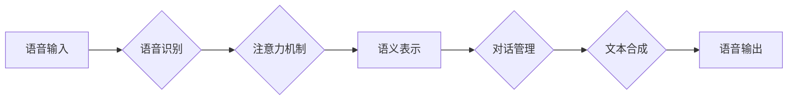

                 

## 智能语音助手在日常生活中的注意力应用

> 关键词：智能语音助手、注意力机制、自然语言理解、深度学习、对话系统、用户体验、隐私保护

## 1. 背景介绍

智能语音助手，如 Siri、Alexa 和 Google Assistant，已经成为我们日常生活不可或缺的一部分。它们能够理解我们的语音指令，并执行相应的任务，例如设置提醒、播放音乐、查询天气预报等。随着人工智能技术的不断发展，智能语音助手的功能越来越强大，应用场景也越来越广泛。

然而，在提供便捷服务的同时，智能语音助手也面临着一些挑战，其中之一就是如何更好地理解用户的意图和需求。传统的语音识别和自然语言理解技术往往难以捕捉用户的潜在意图和上下文信息，导致智能语音助手无法准确理解用户的请求，从而影响用户体验。

注意力机制作为一种新兴的深度学习技术，能够有效地解决这个问题。它能够帮助智能语音助手聚焦于用户语音中的关键信息，从而更准确地理解用户的意图和需求。

## 2. 核心概念与联系

### 2.1 注意力机制

注意力机制是一种模仿人类注意力机制的机器学习技术。它允许模型在处理输入数据时，根据数据的 relevance 和 importance，分配不同的权重，从而聚焦于关键信息。

### 2.2 语音助手架构

传统的语音助手架构通常包括以下几个模块：

* **语音识别:** 将语音信号转换为文本。
* **自然语言理解:** 将文本转换为机器可理解的语义表示。
* **对话管理:** 根据用户意图，选择合适的回复并进行对话管理。
* **文本合成:** 将机器生成的回复转换为语音。

### 2.3 注意力机制在语音助手中的应用

注意力机制可以应用于语音助手中的各个模块，例如：

* **语音识别:** 使用注意力机制可以帮助模型聚焦于语音信号中的关键音素，提高识别准确率。
* **自然语言理解:** 使用注意力机制可以帮助模型聚焦于文本中的关键词语，更好地理解用户意图。
* **对话管理:** 使用注意力机制可以帮助模型聚焦于对话历史中的关键信息，进行更自然流畅的对话。

**Mermaid 流程图**



## 3. 核心算法原理 & 具体操作步骤

### 3.1 算法原理概述

注意力机制的核心思想是学习一个权重向量，用于分配输入数据中的不同部分不同的关注度。这些权重向量可以根据输入数据的特征和上下文信息进行动态调整。

常见的注意力机制类型包括：

* **自注意力机制 (Self-Attention):**  用于捕捉输入序列中不同元素之间的关系。
* **交叉注意力机制 (Cross-Attention):** 用于捕捉两个不同序列之间的关系。

### 3.2 算法步骤详解

1. **计算注意力权重:**  使用一个注意力函数计算每个输入元素与其他元素之间的相关性，并生成一个注意力权重向量。
2. **加权求和:**  将注意力权重与输入元素相乘，并进行加权求和，得到一个新的表示向量。

### 3.3 算法优缺点

**优点:**

* 能够有效地捕捉输入数据中的关键信息。
* 可以处理长序列数据。
* 在许多自然语言处理任务中取得了优异的性能。

**缺点:**

* 计算复杂度较高。
* 训练数据量较大。

### 3.4 算法应用领域

注意力机制在自然语言处理领域有着广泛的应用，例如：

* 机器翻译
* 文本摘要
* 问答系统
* 情感分析

## 4. 数学模型和公式 & 详细讲解 & 举例说明

### 4.1 数学模型构建

假设我们有一个输入序列 $X = \{x_1, x_2, ..., x_n\}$，其中每个元素 $x_i$ 代表一个词向量。我们想要学习一个注意力机制来计算每个词 $x_i$ 与其他词之间的相关性。

**注意力函数:**

$$
\text{Attention}(x_i, X) = \frac{\exp(e_{i,j})}{\sum_{k=1}^{n} \exp(e_{i,k})}
$$

其中，$e_{i,j}$ 是词 $x_i$ 与词 $x_j$ 之间的相关性得分，可以由一个神经网络计算得到。

**加权求和:**

$$
\text{Context}(x_i) = \sum_{j=1}^{n} \text{Attention}(x_i, X) \cdot x_j
$$

其中，$\text{Context}(x_i)$ 是词 $x_i$ 的上下文向量，它包含了词 $x_i$ 与其他词之间的关系信息。

### 4.2 公式推导过程

注意力函数的目的是计算每个词 $x_i$ 与其他词之间的相关性得分。我们可以使用一个神经网络来计算这个得分，例如一个多层感知机 (MLP)。

$$
e_{i,j} = MLP(x_i, x_j)
$$

其中，$MLP$ 是一个多层感知机，它将两个词向量 $x_i$ 和 $x_j$ 作为输入，并输出一个相关性得分。

### 4.3 案例分析与讲解

例如，在机器翻译任务中，我们可以使用注意力机制来帮助模型关注源语言句子中与目标语言句子中对应词语相关的部分。

## 5. 项目实践：代码实例和详细解释说明

### 5.1 开发环境搭建

* Python 3.6+
* TensorFlow 或 PyTorch

### 5.2 源代码详细实现

```python
import tensorflow as tf

# 定义注意力机制
def attention_layer(inputs, query, key, value):
    # 计算相关性得分
    scores = tf.matmul(query, key, transpose_b=True)
    # 应用 softmax 函数归一化得分
    attention_weights = tf.nn.softmax(scores, axis=-1)
    # 计算加权求和
    context = tf.matmul(attention_weights, value)
    return context

# 定义模型
class AttentionModel(tf.keras.Model):
    def __init__(self):
        super(AttentionModel, self).__init__()
        self.embedding = tf.keras.layers.Embedding(vocab_size, embedding_dim)
        self.encoder = tf.keras.layers.LSTM(units=hidden_dim)
        self.decoder = tf.keras.layers.LSTM(units=hidden_dim)
        self.attention_layer = attention_layer

    def call(self, inputs):
        # 嵌入词向量
        embedded_inputs = self.embedding(inputs)
        # 编码器
        encoder_outputs = self.encoder(embedded_inputs)
        # 解码器
        decoder_outputs = self.decoder(encoder_outputs)
        # 注意力机制
        context = self.attention_layer(encoder_outputs, decoder_outputs, encoder_outputs, encoder_outputs)
        # 拼接上下文向量和解码器输出
        combined_outputs = tf.concat([decoder_outputs, context], axis=-1)
        # 输出层
        outputs = tf.keras.layers.Dense(vocab_size, activation='softmax')(combined_outputs)
        return outputs

# 实例化模型
model = AttentionModel()
```

### 5.3 代码解读与分析

* 首先，我们定义了一个注意力层，它计算每个词与其他词之间的相关性得分，并使用 softmax 函数归一化得分。
* 然后，我们定义了一个注意力模型，它包含一个嵌入层、一个编码器、一个解码器和一个注意力层。
* 嵌入层将词转换为词向量。
* 编码器将输入序列编码为一个隐藏状态。
* 解码器根据隐藏状态生成输出序列。
* 注意力层帮助解码器关注编码器输出中的关键信息。

### 5.4 运行结果展示

* 训练模型后，我们可以使用它来翻译句子、生成文本等。

## 6. 实际应用场景

### 6.1 智能语音助手

* **个性化服务:**  根据用户的语音习惯和偏好，提供个性化的服务，例如推荐音乐、新闻或其他内容。
* **上下文感知:**  理解用户的对话上下文，提供更自然流畅的对话体验。
* **多模态交互:**  结合语音、图像、文本等多模态信息，提供更丰富的交互体验。

### 6.2 其他应用场景

* **教育:**  提供个性化的学习辅导和知识问答。
* **医疗:**  辅助医生诊断疾病、提供医疗咨询。
* **娱乐:**  提供个性化的游戏体验、故事阅读等。

### 6.3 未来应用展望

* **更强大的自然语言理解能力:**  能够理解更复杂、更模糊的语言表达。
* **更个性化的用户体验:**  能够根据用户的个性化需求提供定制化的服务。
* **更安全的隐私保护:**  能够更好地保护用户的隐私信息。

## 7. 工具和资源推荐

### 7.1 学习资源推荐

* **书籍:**
    * 《深度学习》
    * 《自然语言处理》
* **在线课程:**
    * Coursera: 深度学习
    * Udacity: 自然语言处理
* **博客:**
    * TensorFlow Blog
    * PyTorch Blog

### 7.2 开发工具推荐

* **TensorFlow:**  开源深度学习框架。
* **PyTorch:**  开源深度学习框架。
* **Hugging Face Transformers:**  预训练语言模型库。

### 7.3 相关论文推荐

* Attention Is All You Need
* BERT: Pre-training of Deep Bidirectional Transformers for Language Understanding

## 8. 总结：未来发展趋势与挑战

### 8.1 研究成果总结

注意力机制在语音助手领域取得了显著的成果，能够有效地提高语音识别的准确率和自然语言理解的能力。

### 8.2 未来发展趋势

* **更强大的注意力机制:**  开发更强大的注意力机制，能够更好地捕捉长序列数据中的关系。
* **多模态注意力机制:**  结合语音、图像、文本等多模态信息，开发更强大的多模态注意力机制。
* **可解释性:**  提高注意力机制的可解释性，帮助用户理解模型的决策过程。

### 8.3 面临的挑战

* **计算复杂度:**  注意力机制的计算复杂度较高，需要更高效的算法和硬件支持。
* **数据需求:**  训练强大的注意力模型需要大量的训练数据。
* **隐私保护:**  智能语音助手需要处理用户的敏感信息，需要采取有效的隐私保护措施。

### 8.4 研究展望

未来，注意力机制将在语音助手领域继续发挥重要作用，推动智能语音助手技术的发展。


## 9. 附录：常见问题与解答

* **Q: 注意力机制是如何工作的？**
    * **A:** 注意力机制通过计算每个输入元素与其他元素之间的相关性得分，并使用 softmax 函数归一化得分，从而分配不同的权重，聚焦于关键信息。
* **Q: 注意力机制有哪些类型？**
    * **A:** 常见的注意力机制类型包括自注意力机制和交叉注意力机制。
* **Q: 注意力机制有哪些应用场景？**
    * **A:** 注意力机制在自然语言处理领域有着广泛的应用，例如机器翻译、文本摘要、问答系统和情感分析。


作者：禅与计算机程序设计艺术 / Zen and the Art of Computer Programming 
<end_of_turn>

