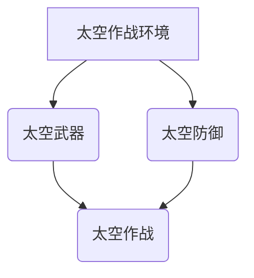

                 

## 未来的太空军事：2050年的太空武器与太空战争

> 关键词：太空武器、太空战争、人工智能、激光武器、太空防御、太空作战、太空资源争夺、国际合作

### 1. 背景介绍

21世纪初，人类迈出了探索太空的步伐，从月球到火星，我们的足迹不断延伸。然而，随着太空探索的深入，太空也逐渐成为新的战略高地，太空军事化趋势日益明显。2050年，太空将成为人类文明的新战场，太空武器和太空战争将成为现实。

当前，各国已开始积极布局太空军事力量，发展太空武器技术，并制定太空作战计划。美国、俄罗斯、中国、印度等国家都在积极推进太空军备竞赛，这将对国际安全格局产生深远影响。

### 2. 核心概念与联系

太空军事的核心概念包括：

* **太空作战环境:** 指太空中的物理环境、技术环境和政治环境，包括太空中的微重力、辐射、真空等物理条件，以及卫星通信、导航、侦察等技术条件，以及国际法、太空条约等政治环境。
* **太空武器:** 指用于在太空环境中攻击、防御或控制目标的武器系统，包括激光武器、微波武器、反卫星导弹、太空拦截器等。
* **太空防御:** 指用于保护国家和地区在太空中的利益的措施，包括反卫星防御系统、太空监测预警系统、太空救援系统等。
* **太空作战:** 指在太空环境中进行的军事行动，包括太空侦察、太空攻击、太空防御等。

**太空军事核心概念关系图:**



### 3. 核心算法原理 & 具体操作步骤

#### 3.1  算法原理概述

太空武器的研发和应用离不开先进的算法支持。例如，激光武器的瞄准和跟踪需要精确的算法计算，反卫星导弹的拦截需要复杂的轨迹预测算法，太空防御系统需要强大的威胁识别和评估算法。

#### 3.2  算法步骤详解

以激光武器为例，其瞄准和跟踪算法通常包括以下步骤：

1. **目标识别:** 利用雷达、光学传感器等设备对目标进行识别，确定目标的类型、位置、速度等信息。
2. **轨迹预测:** 基于目标的运动轨迹和环境因素，预测目标未来的运动轨迹。
3. **激光束瞄准:** 根据目标的预测轨迹，计算出激光束的发射角度和时间，使激光束能够准确击中目标。
4. **激光束跟踪:** 在激光束飞行过程中，不断跟踪目标的运动轨迹，并对激光束的发射角度和时间进行微调，确保激光束始终命中目标。

#### 3.3  算法优缺点

* **优点:** 精确度高、速度快、攻击范围广。
* **缺点:** 受大气影响较大、能量消耗大、成本高。

#### 3.4  算法应用领域

* **激光武器:** 用于攻击地面目标、空中目标、太空目标。
* **反卫星导弹:** 用于拦截和摧毁敌方卫星。
* **太空防御系统:** 用于监测和防御太空威胁。

### 4. 数学模型和公式 & 详细讲解 & 举例说明

#### 4.1  数学模型构建

太空武器的研发和应用需要建立数学模型来描述其工作原理和性能。例如，激光武器的能量传输模型可以描述激光束在传播过程中能量的损耗，反卫星导弹的轨迹预测模型可以描述导弹在太空环境中的运动轨迹。

#### 4.2  公式推导过程

以激光武器为例，其能量传输模型可以描述为：

$$P_d = P_s \cdot \frac{A_d}{A_s} \cdot \frac{1}{e^{L/L_a}}$$

其中：

* $P_d$：目标接收到的能量
* $P_s$：激光器的发射功率
* $A_d$：目标的接收面积
* $A_s$：激光器的发射面积
* $L$：激光束传播距离
* $L_a$：激光束的衰减长度

#### 4.3  案例分析与讲解

假设激光器的发射功率为100kW，目标的接收面积为1平方米，激光束传播距离为100公里，激光束的衰减长度为10公里。根据公式，目标接收到的能量为：

$$P_d = 100 \cdot 10^3 \cdot \frac{1}{1} \cdot \frac{1}{e^{100/10}} \approx 36.8 \text{ W}$$

### 5. 项目实践：代码实例和详细解释说明

#### 5.1  开发环境搭建

开发太空武器相关的代码需要搭建相应的开发环境，包括操作系统、编译器、编程语言、仿真软件等。例如，可以使用Linux操作系统、GCC编译器、C++编程语言、STK仿真软件等。

#### 5.2  源代码详细实现

以下是一个简单的激光武器瞄准算法的C++代码示例：

```cpp
#include <iostream>
#include <cmath>

using namespace std;

struct Target {
    double x;
    double y;
    double vx;
    double vy;
};

double calculateLaserAngle(Target target, double distance) {
    double angle = atan2(target.y, target.x);
    return angle;
}

int main() {
    Target target;
    target.x = 100;
    target.y = 50;
    target.vx = 1;
    target.vy = 2;

    double distance = 1000;

    double angle = calculateLaserAngle(target, distance);

    cout << "Laser angle: " << angle << endl;

    return 0;
}
```

#### 5.3  代码解读与分析

该代码定义了一个`Target`结构体来表示目标的坐标和速度，并定义了一个`calculateLaserAngle`函数来计算激光束的发射角度。该函数使用`atan2`函数计算目标相对于激光器的角度，并返回该角度。

#### 5.4  运行结果展示

运行该代码后，将输出激光束的发射角度。

### 6. 实际应用场景

太空武器的实际应用场景包括：

* **太空防御:** 用于防御敌方卫星的攻击，保护国家和地区的太空利益。
* **太空侦察:** 用于对敌方太空活动进行侦察，获取情报信息。
* **太空攻击:** 用于攻击敌方太空目标，例如卫星、空间站等。
* **太空资源争夺:** 用于争夺太空资源，例如矿产、水资源等。

### 6.4  未来应用展望

未来，太空武器将更加智能化、自动化、精确化。人工智能、量子计算等新技术将被广泛应用于太空武器的研发和应用，使太空武器更加强大、高效。

### 7. 工具和资源推荐

#### 7.1  学习资源推荐

* **书籍:** 《太空武器与太空战争》
* **网站:** 美国空军太空司令部网站、俄罗斯联邦国防部网站

#### 7.2  开发工具推荐

* **仿真软件:** STK、SpaceEngine
* **编程语言:** C++, Python

#### 7.3  相关论文推荐

* **论文:** “太空武器的未来发展趋势”
* **论文:** “人工智能在太空武器中的应用”

### 8. 总结：未来发展趋势与挑战

#### 8.1  研究成果总结

太空武器的研发和应用是一个复杂的系统工程，需要多学科交叉融合。近年来，在人工智能、激光技术、材料科学等领域的突破，为太空武器的研发提供了新的技术支撑。

#### 8.2  未来发展趋势

未来，太空武器将朝着以下方向发展：

* **智能化:** 利用人工智能技术，使太空武器更加智能化、自动化。
* **小型化:** 开发小型化、轻量化的太空武器，方便部署和使用。
* **多功能化:** 将多种功能集成到太空武器中，例如攻击、防御、侦察等。

#### 8.3  面临的挑战

太空武器的研发和应用也面临着一些挑战：

* **国际安全:** 太空武器的出现将加剧太空军备竞赛，威胁国际安全稳定。
* **技术难度:** 太空武器的研发需要克服许多技术难题，例如太空环境的恶劣条件、能量传输的效率等。
* **伦理道德:** 太空武器的应用涉及到伦理道德问题，例如对平民的伤害、太空环境的污染等。

#### 8.4  研究展望

未来，需要加强国际合作，制定国际规则和规范，防止太空武器的滥用。同时，需要加强太空武器的研发和应用研究，探索太空武器的和平利用途径。

### 9. 附录：常见问题与解答

**Q1: 太空武器会对地球造成什么影响？**

A1: 太空武器的爆炸或碎片可能会对地球大气层造成损害，增加太空垃圾数量，影响地球环境。

**Q2: 太空武器的研发和应用是否违反国际法？**

A2: 目前，国际法对太空武器的规定尚不完善，存在争议。

**Q3: 太空武器的未来发展趋势是什么？**

A3: 未来，太空武器将更加智能化、自动化、精确化。

作者：禅与计算机程序设计艺术 / Zen and the Art of Computer Programming 


<end_of_turn>

