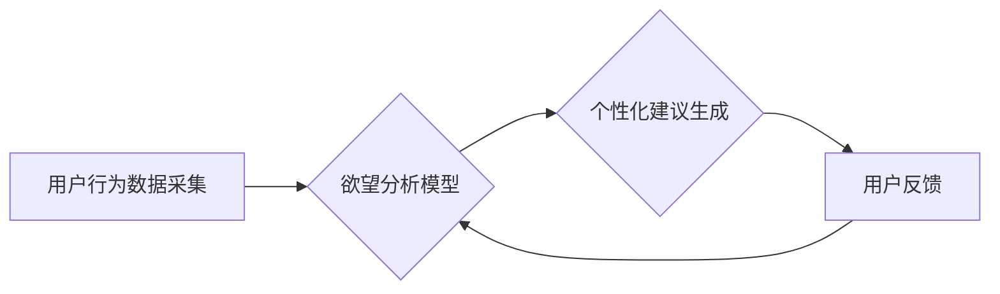

                 

## 欲望智能调节器程序员：AI辅助的自我管理系统开发者

> 关键词：人工智能、自我管理、欲望调节、算法、机器学习、行为分析、个人成长、效率提升、未来趋势

## 1. 背景介绍

在当今信息爆炸的时代，我们面临着前所未有的选择和诱惑。从社交媒体的无尽信息流到各种娱乐平台的吸引力，我们的注意力和时间都被不断拉扯。如何有效地管理自己的欲望，专注于重要的事情，并实现个人目标，成为了一个越来越迫切的问题。

传统的自我管理方法，例如制定计划、设定目标和自我激励，虽然有效，但往往难以持久。随着人工智能技术的快速发展，我们有机会利用AI的力量，构建一个更加智能、个性化的自我管理系统。

## 2. 核心概念与联系

**2.1 欲望智能调节器程序员**

“欲望智能调节器程序员”是指利用人工智能技术，开发能够帮助用户理解、管理和调节欲望的软件系统。该系统通过对用户的行为、情绪和环境进行分析，提供个性化的建议和干预措施，帮助用户更好地控制自己的行为，实现自我提升。

**2.2 系统架构**



**2.3 核心概念联系**

* **用户行为数据采集:** 通过手机、电脑、智能设备等收集用户的行为数据，例如浏览记录、社交媒体互动、睡眠时间、运动量等。
* **欲望分析模型:** 利用机器学习算法，分析用户的行为数据，识别用户的欲望模式和触发因素。
* **个性化建议生成:** 根据用户的欲望分析结果，生成个性化的建议和干预措施，例如提醒用户休息、避免特定网站、设定时间限制等。
* **用户反馈:** 收集用户的反馈信息，不断优化和改进欲望分析模型和建议策略。

## 3. 核心算法原理 & 具体操作步骤

**3.1 算法原理概述**

欲望智能调节器程序的核心算法基于机器学习和深度学习技术。通过训练大量的用户行为数据，模型能够学习到用户的欲望模式和触发因素。

**3.2 算法步骤详解**

1. **数据预处理:** 收集用户行为数据，进行清洗、格式化和特征提取。
2. **模型选择:** 选择合适的机器学习算法，例如决策树、支持向量机、神经网络等。
3. **模型训练:** 利用训练数据，训练机器学习模型，学习用户的欲望模式和触发因素。
4. **模型评估:** 使用测试数据，评估模型的性能，例如准确率、召回率、F1-score等。
5. **模型部署:** 将训练好的模型部署到生产环境，实时分析用户的行为数据，并生成个性化的建议。

**3.3 算法优缺点**

* **优点:**
    * **个性化:** 根据用户的具体情况，提供个性化的建议和干预措施。
    * **智能化:** 利用人工智能技术，自动分析用户行为，无需人工干预。
    * **高效性:** 可以快速识别用户的欲望模式和触发因素，并提供及时有效的建议。
* **缺点:**
    * **数据依赖:** 算法的性能取决于训练数据的质量和数量。
    * **隐私安全:** 需要收集用户的敏感行为数据，需要妥善保护用户隐私。
    * **伦理问题:** 如何避免算法被滥用，例如控制用户的行为或剥夺用户的自由意志？

**3.4 算法应用领域**

* **个人成长:** 帮助用户管理时间、提高效率、克服拖延症等。
* **健康管理:** 帮助用户控制饮食、戒烟、戒酒等。
* **心理健康:** 帮助用户缓解压力、焦虑、抑郁等情绪问题。
* **教育培训:** 帮助学生提高学习效率、克服学习障碍等。

## 4. 数学模型和公式 & 详细讲解 & 举例说明

**4.1 数学模型构建**

我们可以使用马尔科夫决策过程（MDP）来建模用户的欲望调节过程。

* **状态空间:** 用户的当前状态，例如情绪、注意力、时间等。
* **动作空间:** 用户可以采取的行动，例如浏览网页、玩游戏、学习等。
* **奖励函数:** 用户采取特定行动后获得的奖励，例如获得知识、获得娱乐、获得成就感等。
* **转移概率:** 从一个状态到另一个状态的概率，取决于用户采取的行动和环境因素。

**4.2 公式推导过程**

MDP的目标是找到一个策略，使得用户在长期内获得最大的总奖励。可以使用动态规划算法或强化学习算法来求解MDP问题。

**Bellman方程:**

$$
V(s) = \max_a \left[ R(s, a) + \gamma \sum_{s'} P(s' | s, a) V(s') \right]
$$

其中：

* $V(s)$ 是状态 $s$ 的价值函数。
* $R(s, a)$ 是采取动作 $a$ 在状态 $s$ 时获得的奖励。
* $\gamma$ 是折扣因子，表示未来奖励的价值。
* $P(s' | s, a)$ 是从状态 $s$ 采取动作 $a$ 到状态 $s'$ 的转移概率。

**4.3 案例分析与讲解**

假设用户处于“无聊”状态，可以选择“浏览社交媒体”或“学习新技能”两种行动。

* 浏览社交媒体可以获得短期娱乐奖励，但长期来看可能导致注意力分散和时间浪费。
* 学习新技能可以获得长期知识和技能奖励，但短期内可能感到枯燥乏味。

根据Bellman方程，我们可以计算两种行动的价值函数，并选择价值函数最高的行动。

## 5. 项目实践：代码实例和详细解释说明

**5.1 开发环境搭建**

* 操作系统：Windows/macOS/Linux
* 编程语言：Python
* 库依赖：NumPy、Pandas、Scikit-learn、TensorFlow/PyTorch

**5.2 源代码详细实现**

```python
# 导入必要的库
import numpy as np
from sklearn.model_selection import train_test_split
from sklearn.linear_model import LogisticRegression

# 加载用户行为数据
data = pd.read_csv("user_behavior.csv")

# 特征工程
features = data[['浏览时间', '社交媒体互动次数', '睡眠时间']]
target = data['欲望强度']

# 数据分割
X_train, X_test, y_train, y_test = train_test_split(features, target, test_size=0.2)

# 训练逻辑回归模型
model = LogisticRegression()
model.fit(X_train, y_train)

# 模型评估
accuracy = model.score(X_test, y_test)
print(f"模型准确率: {accuracy}")

# 生成个性化建议
new_user_data = pd.DataFrame({'浏览时间': [2], '社交媒体互动次数': [10], '睡眠时间': [7]})
prediction = model.predict(new_user_data)
if prediction[0] == 1:
    print("建议您减少社交媒体互动时间，并保证充足的睡眠")
else:
    print("您的欲望强度较低，建议您保持良好的生活习惯")
```

**5.3 代码解读与分析**

* 代码首先导入必要的库，并加载用户行为数据。
* 然后进行特征工程，提取用户行为特征，并定义目标变量“欲望强度”。
* 使用train_test_split函数将数据分割成训练集和测试集。
* 训练逻辑回归模型，并使用测试集评估模型的性能。
* 最后，使用训练好的模型生成个性化建议。

**5.4 运行结果展示**

运行代码后，会输出模型的准确率以及针对新用户数据的个性化建议。

## 6. 实际应用场景

**6.1 个人时间管理**

* 帮助用户识别时间浪费的活动，并提供建议，例如减少社交媒体使用时间、设定工作时间限制等。
* 帮助用户制定合理的计划，并提醒用户完成任务。

**6.2 健康生活习惯**

* 帮助用户监测饮食、运动和睡眠等健康指标，并提供个性化的建议，例如提醒用户补充水分、进行适当的运动等。
* 帮助用户戒烟、戒酒等不良习惯。

**6.3 学习效率提升**

* 帮助学生识别学习效率低的环节，并提供建议，例如调整学习方法、设定学习目标等。
* 帮助学生克服拖延症，提高学习专注力。

**6.4 未来应用展望**

* **更精准的个性化建议:** 利用更先进的机器学习算法和深度学习模型，对用户的行为数据进行更深入的分析，提供更精准的个性化建议。
* **多模态数据融合:** 将文本、图像、音频等多模态数据融合到模型中，获得更全面的用户画像，并提供更丰富的建议。
* **增强现实和虚拟现实技术:** 利用AR/VR技术，将建议以更生动的方式呈现给用户，提高用户体验。

## 7. 工具和资源推荐

**7.1 学习资源推荐**

* **书籍:**
    * 《深度学习》 by Ian Goodfellow, Yoshua Bengio, Aaron Courville
    * 《强化学习：算法、策略和应用》 by Richard S. Sutton, Andrew G. Barto
* **在线课程:**
    * Coursera: Machine Learning by Andrew Ng
    * Udacity: Deep Learning Nanodegree
* **博客和网站:**
    * Towards Data Science
    * Machine Learning Mastery

**7.2 开发工具推荐**

* **编程语言:** Python
* **机器学习库:** Scikit-learn, TensorFlow, PyTorch
* **数据分析库:** Pandas, NumPy
* **开发环境:** Jupyter Notebook, VS Code

**7.3 相关论文推荐**

* **强化学习在个性化推荐中的应用:**
    * "Deep Reinforcement Learning for Personalized Recommendation" by Wang et al.
* **深度学习在用户行为预测中的应用:**
    * "Deep Learning for User Behavior Prediction" by Chen et al.

## 8. 总结：未来发展趋势与挑战

**8.1 研究成果总结**

欲望智能调节器程序的开发取得了显著进展，利用人工智能技术，可以帮助用户更好地理解和管理自己的欲望，实现自我提升。

**8.2 未来发展趋势**

* **更精准的个性化建议:** 利用更先进的机器学习算法和深度学习模型，对用户的行为数据进行更深入的分析，提供更精准的个性化建议。
* **多模态数据融合:** 将文本、图像、音频等多模态数据融合到模型中，获得更全面的用户画像，并提供更丰富的建议。
* **增强现实和虚拟现实技术:** 利用AR/VR技术，将建议以更生动的方式呈现给用户，提高用户体验。

**8.3 面临的挑战**

* **数据隐私和安全:** 欲望智能调节器程序需要收集用户的敏感行为数据，需要妥善保护用户隐私。
* **算法的公平性和可解释性:** 算法的训练数据可能存在偏差，导致算法输出结果不公平。需要提高算法的可解释性，让用户了解算法是如何做出决定的。
* **伦理问题:** 如何避免算法被滥用，例如控制用户的行为或剥夺用户的自由意志？需要制定相应的伦理规范和法律法规。

**8.4 研究展望**

未来，欲望智能调节器程序将朝着更智能、更个性化、更安全的方向发展。


## 9. 附录：常见问题与解答

**9.1 如何保证算法的公平性和可解释性？**

* 使用来自不同背景和群体的数据来训练模型，减少数据偏差。
* 使用可解释性高的机器学习算法，例如决策树，更容易理解模型的决策过程。
* 开发工具和技术，帮助用户理解算法的输出结果，并提供反馈。

**9.2 如何保护用户的隐私数据？**

* 使用加密技术保护用户的敏感数据。
* 采用匿名化技术，去除用户的个人识别信息。
* 明确告知用户数据的使用目的和方式，并获得用户的同意。

**9.3 如何避免算法被滥用？**

* 制定相应的伦理规范和法律法规，规范算法的开发和使用。
* 开发安全机制，防止恶意攻击和数据泄露。
* 鼓励用户参与算法的监督和评估，确保算法的公正性和透明度。


作者：禅与计算机程序设计艺术 / Zen and the Art of Computer Programming 
<end_of_turn>

