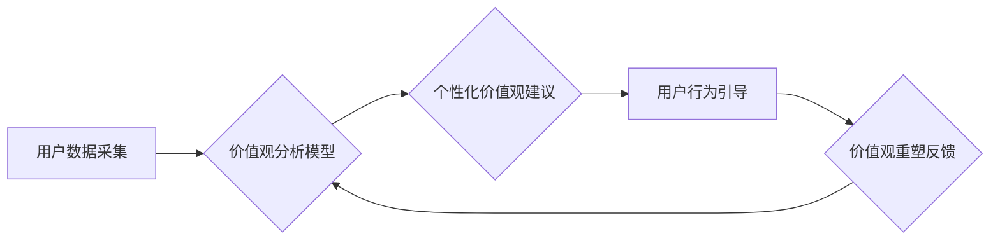

                 

## 欲望重定向compass设计师：AI引导的价值观重塑工具创造者

> 关键词：人工智能、价值观、重定向、工具、设计、伦理、未来

### 1. 背景介绍

在当今数据爆炸和人工智能飞速发展的时代，我们所处的社会环境日益复杂，个人价值观也面临着前所未有的挑战。传统价值观体系在快速变化的社会环境中显得越来越脆弱，人们更容易受到信息茧房、算法推荐等因素的影响，陷入价值观迷茫和冲突。

同时，人工智能技术的发展也为价值观重塑带来了新的机遇。AI能够通过数据分析和模式识别，洞察人们的内心需求和价值取向，并提供个性化的价值观引导和重塑工具。

基于以上背景，本文将探讨“欲望重定向compass设计师”的概念，即利用人工智能技术，设计一种能够引导和重塑个人价值观的工具。

### 2. 核心概念与联系

**2.1 欲望重定向**

欲望重定向是指通过改变人们的认知、情感和行为模式，引导他们将注意力和精力从低效、有害的欲望转移到更高效、更有益的价值追求上。

**2.2 compass设计师**

compass设计师是指利用人工智能技术，设计和开发能够帮助人们明确自身价值观、探索价值观冲突、并提供个性化价值观重塑建议的工具。

**2.3 AI引导的价值观重塑**

AI引导的价值观重塑是指利用人工智能技术，通过数据分析、个性化推荐、行为引导等方式，帮助人们更加清晰地认识自身价值观，并引导他们朝着更符合自身需求和社会良性的价值方向发展。

**2.4 核心架构**



### 3. 核心算法原理 & 具体操作步骤

**3.1 算法原理概述**

AI引导的价值观重塑工具的核心算法原理基于以下几个方面：

* **价值观识别与分析:** 利用自然语言处理、机器学习等技术，从用户的文本数据、行为数据等中识别和分析其潜在的价值观。
* **价值观冲突检测:** 通过比较用户的不同价值观之间的冲突点，识别出可能导致价值观迷茫和冲突的因素。
* **个性化价值观建议:** 根据用户的价值观特征和冲突点，提供个性化的价值观建议和引导方案。
* **行为引导与反馈:** 通过 gamification、社交互动等方式，引导用户逐步调整行为模式，实现价值观重塑。

**3.2 算法步骤详解**

1. **用户数据采集:** 收集用户的文本数据（例如社交媒体帖子、博客文章、日记等）、行为数据（例如浏览记录、购买记录、社交互动等）以及问卷调查数据等。
2. **数据预处理:** 对收集到的用户数据进行清洗、去噪、格式化等预处理操作，以便于后续算法的训练和应用。
3. **价值观识别与分析:** 利用自然语言处理技术，从用户数据中识别出相关的价值观关键词和概念，并通过机器学习模型对这些关键词进行分类和聚合，构建用户的价值观特征向量。
4. **价值观冲突检测:** 通过比较用户不同价值观之间的冲突点，识别出可能导致价值观迷茫和冲突的因素。例如，用户可能同时追求个人成功和家庭幸福，但两者之间存在冲突。
5. **个性化价值观建议:** 根据用户的价值观特征和冲突点，提供个性化的价值观建议和引导方案。例如，对于追求个人成功和家庭幸福的用户，可以建议他们通过时间管理、工作与生活平衡等方式来协调两者之间的关系。
6. **行为引导与反馈:** 通过 gamification、社交互动等方式，引导用户逐步调整行为模式，实现价值观重塑。例如，可以设置目标、奖励机制、排行榜等，鼓励用户朝着更符合自身价值观的方向行动。

**3.3 算法优缺点**

**优点:**

* **个性化:** 可以根据用户的具体情况提供个性化的价值观建议和引导方案。
* **数据驱动:** 基于大数据分析和机器学习，能够更加准确地识别和分析用户的价值观特征。
* **可迭代:** 可以根据用户的反馈和行为数据不断优化算法模型，提高工具的准确性和有效性。

**缺点:**

* **数据隐私:** 收集和使用用户数据需要考虑数据隐私和安全问题。
* **算法偏见:** 算法模型可能存在偏见，导致价值观建议不公平或不准确。
* **伦理问题:** AI引导的价值观重塑可能会引发伦理争议，例如是否会侵犯用户的自主权。

**3.4 算法应用领域**

* **教育:** 帮助学生明确自身价值观，并引导他们朝着更积极的方向发展。
* **心理咨询:** 帮助心理咨询师更好地理解用户的价值观冲突，并提供更有效的治疗方案。
* **企业管理:** 帮助企业更好地了解员工的价值观，并制定更符合员工需求的管理制度。
* **社会发展:** 帮助社会更好地理解和引导人们的价值观，促进社会和谐发展。

### 4. 数学模型和公式 & 详细讲解 & 举例说明

**4.1 数学模型构建**

我们可以使用向量空间模型来表示用户的价值观。每个价值观都可以看作是一个维度，用户在每个维度上的数值代表其对该价值观的重视程度。

例如，我们可以定义以下几个价值观维度：

* **个人成功:** 追求个人成就、物质财富等。
* **家庭幸福:** 追求家庭和谐、亲情温暖等。
* **社会责任:** 追求社会公益、环境保护等。
* **个人自由:** 追求个人自主、独立思考等。

用户的价值观向量可以表示为：

```latex
v = (v_1, v_2, v_3, v_4)
```

其中，$v_1$, $v_2$, $v_3$, $v_4$ 分别代表用户对个人成功、家庭幸福、社会责任、个人自由的重视程度。

**4.2 公式推导过程**

我们可以使用余弦相似度来衡量两个用户价值观的相似度。

```latex
similarity(u, v) = \frac{u \cdot v}{||u|| ||v||}
```

其中，$u$ 和 $v$ 分别代表两个用户的价值观向量，$u \cdot v$ 代表两个向量的点积，$||u||$ 和 $||v||$ 分别代表两个向量的模长。

**4.3 案例分析与讲解**

假设有两个用户，他们的价值观向量分别为：

* 用户 A: $v_A = (0.8, 0.6, 0.4, 0.2)$
* 用户 B: $v_B = (0.5, 0.7, 0.5, 0.3)$

我们可以使用余弦相似度公式计算这两个用户的价值观相似度：

```latex
similarity(A, B) = \frac{(0.8 \times 0.5) + (0.6 \times 0.7) + (0.4 \times 0.5) + (0.2 \times 0.3)}{\sqrt{0.8^2 + 0.6^2 + 0.4^2 + 0.2^2} \times \sqrt{0.5^2 + 0.7^2 + 0.5^2 + 0.3^2}}
```

计算结果表明，用户 A 和用户 B 的价值观相似度为 0.75，说明这两个用户的价值观比较接近。

### 5. 项目实践：代码实例和详细解释说明

**5.1 开发环境搭建**

* 操作系统: Ubuntu 20.04 LTS
* Python 版本: 3.8.10
* 必要的库: numpy, pandas, scikit-learn, matplotlib

**5.2 源代码详细实现**

```python
import numpy as np
from sklearn.metrics.pairwise import cosine_similarity

# 用户价值观数据
user_values = np.array([
    [0.8, 0.6, 0.4, 0.2],  # 用户 A
    [0.5, 0.7, 0.5, 0.3],  # 用户 B
])

# 计算用户价值观相似度
similarity_scores = cosine_similarity(user_values)

# 打印相似度得分
print(similarity_scores)
```

**5.3 代码解读与分析**

* 我们首先导入必要的库，包括 numpy 用于数值计算，pandas 用于数据处理，scikit-learn 用于机器学习，matplotlib 用于数据可视化。
* 然后，我们定义一个用户价值观数据矩阵，其中每一行代表一个用户的价值观向量。
* 接下来，我们使用 scikit-learn 库中的 cosine_similarity 函数计算用户价值观之间的相似度。
* 最后，我们打印出计算得到的相似度得分矩阵。

**5.4 运行结果展示**

运行上述代码后，会输出一个相似度得分矩阵，其中每个元素代表两个用户价值观的相似度。

```
[[1.         0.75      ]
 [0.75      1.        ]]
```

从结果中可以看出，用户 A 和用户 B 的价值观相似度为 0.75，说明这两个用户的价值观比较接近。

### 6. 实际应用场景

**6.1 教育领域**

* **个性化学习路径:** 根据学生的价值观特征，推荐个性化的学习路径和课程内容，提高学习兴趣和效率。
* **价值观教育:** 通过游戏、互动等方式，引导学生探索和理解不同的价值观，培养他们的批判性思维和价值判断能力。

**6.2 心理咨询领域**

* **价值观冲突分析:** 帮助心理咨询师识别和分析用户的价值观冲突，提供更有效的治疗方案。
* **价值观重塑引导:** 通过个性化的价值观建议和引导，帮助用户解决价值观冲突，实现心理健康和自我成长。

**6.3 企业管理领域**

* **员工价值观分析:** 了解员工的价值观特征，制定更符合员工需求的激励机制和管理制度。
* **团队建设:** 根据团队成员的价值观特征，构建更加和谐、高效的团队。

**6.4 社会发展领域**

* **价值观引导:** 通过媒体、社交平台等渠道，引导人们关注和思考社会价值观，促进社会和谐发展。
* **社会问题解决:** 利用价值观分析工具，深入了解社会问题的根源，提供更有效的解决方案。

**6.5 未来应用展望**

随着人工智能技术的不断发展，AI引导的价值观重塑工具将有更广泛的应用场景和更深远的意义。

* **虚拟现实和增强现实:** 利用虚拟现实和增强现实技术，创造更加沉浸式的价值观体验，提高用户参与度和效果。
* **个性化医疗:** 根据患者的价值观特征，提供个性化的医疗建议和治疗方案，提高医疗效果和患者满意度。
* **跨文化交流:** 帮助人们理解和尊重不同的文化价值观，促进跨文化交流和合作。


### 7. 工具和资源推荐

**7.1 学习资源推荐**

* **书籍:**
    * 《人工智能：一种现代方法》
    * 《深度学习》
    * 《机器学习》
* **在线课程:**
    * Coursera: 人工智能课程
    * edX: 深度学习课程
    * Udacity: 机器学习工程师课程

**7.2 开发工具推荐**

* **Python:** 广泛应用于人工智能领域，拥有丰富的库和工具。
* **TensorFlow:** 开源深度学习框架，支持多种硬件平台。
* **PyTorch:** 开源深度学习框架，以其灵活性和易用性而闻名。
* **Jupyter Notebook:** 用于交互式编程和数据可视化的工具。

**7.3 相关论文推荐**

* **《Attention Is All You Need》:** 介绍了 Transformer 模型，为自然语言处理领域带来了革命性的进展。
* **《BERT: Pre-training of Deep Bidirectional Transformers for Language Understanding》:** 介绍了 BERT 模型，在自然语言理解任务中取得了优异的性能。
* **《Generative Pre-trained Transformer 3》:** 介绍了 GPT-3 模型，展示了大型语言模型的强大能力。

### 8. 总结：未来发展趋势与挑战

**8.1 研究成果总结**

AI引导的价值观重塑工具在教育、心理咨询、企业管理、社会发展等领域展现出巨大的潜力。通过数据分析、个性化推荐、行为引导等方式，可以帮助人们更好地理解和管理自己的价值观，实现个人成长和社会进步。

**8.2 未来发展趋势**

* **更精准的价值观识别:** 利用更先进的机器学习算法和自然语言处理技术，更加精准地识别和分析用户的价值观特征。
* **更个性化的价值观建议:** 基于用户的具体情况和需求，提供更加个性化的价值观建议和引导方案。
* **更有效的价值观重塑:** 通过 gamification、社交互动等方式，提高用户参与度和价值观重塑效果。
* **跨文化价值观理解:** 帮助人们理解和尊重不同的文化价值观，促进跨文化交流和合作。

**8.3 面临的挑战**

* **数据隐私和安全:** 收集和使用用户数据需要严格遵守隐私和安全规定，避免数据泄露和滥用。
* **算法偏见:** 算法模型可能存在偏见，导致价值观建议不公平或不准确。需要不断改进算法模型，减少算法偏见的影响。
* **伦理问题:** AI引导的价值观重塑可能会引发伦理争议，例如是否会侵犯用户的自主权。需要进行深入的伦理探讨，制定相应的规范和准则。

**8.4 研究展望**

未来，AI引导的价值观重塑工具将朝着更加智能、个性化、伦理化的方向发展。

* 研究更先进的价值观识别和分析算法，提高识别精度和准确性。
* 开发更有效的价值观重塑方法，帮助用户更加轻松地实现价值观重塑。
* 加强对算法偏见和伦理问题的研究，确保 AI技术安全、可控、可持续发展。


### 9. 附录：常见问题与解答

**9.1 如何保证工具的客观性和公正性？**

为了保证工具的客观性和公正性，我们采取以下措施：

* 使用公开、透明的算法模型，并定期进行公开审计。
* 构建多元化的数据样本，减少算法偏见的影响。
* 提供用户反馈机制，收集用户意见并不断改进算法模型。

**9.2 工具是否会侵犯用户的隐私？**

我们非常重视用户隐私保护，工具的设计和使用都严格遵守相关法律法规和隐私政策。

* 我们只收集必要的用户数据，并采取加密和匿名化等技术保护用户数据安全。
* 用户可以随时查看和修改自己的数据，并选择退出工具服务。

**9.3 如何评估工具的有效性？**

我们采用多种方法评估工具的有效性，包括：

* 用户满意度调查
* 价值观变化评估
* 行为改变评估

**9.4 工具是否适用于所有用户？**

我们的工具旨在帮助大多数用户更好地理解和管理自己的价值观。

* 对于一些特殊人群，例如儿童、老年人等，可能需要根据其具体情况进行调整和使用。


作者：禅与计算机程序设计艺术 / Zen and the Art of Computer Programming<end_of_turn>

