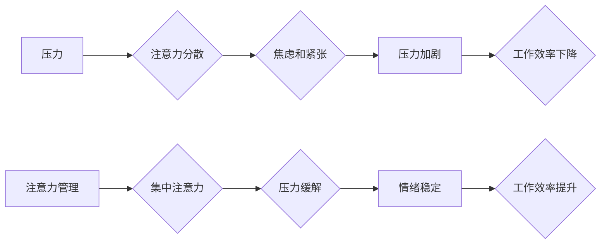

                 

## 1. 背景介绍

在当今快速发展的科技时代，IT从业者面临着前所未有的压力和挑战。项目截止日期紧迫、工作量巨大、技术更新迭代迅速，这些因素都可能导致注意力分散、压力过大，最终影响工作效率和身心健康。如何有效地管理注意力，并应对压力和焦虑，成为了IT从业者亟需解决的问题。

## 2. 核心概念与联系

### 2.1 注意力与压力

注意力是认知功能的核心，它指我们对特定信息或任务的集中和选择性关注。压力则是我们面对挑战或威胁时产生的生理和心理反应。两者之间存在着密切的联系：

* **压力会削弱注意力：** 当我们处于压力状态时，大脑会释放应激激素，这些激素会影响大脑的认知功能，导致注意力难以集中，反应迟钝。
* **注意力不足会加剧压力：** 当我们无法集中注意力时，更容易感到焦虑和紧张，从而加剧压力。

### 2.2  注意力管理与压力管理

注意力管理和压力管理是相互关联的，它们共同影响着我们的工作效率和生活质量。有效的注意力管理可以帮助我们更好地应对压力，而有效的压力管理可以提升我们的注意力水平。

**Mermaid 流程图：**



## 3. 核心算法原理 & 具体操作步骤

### 3.1 算法原理概述

注意力管理和压力管理并非简单的技巧，而是一种需要系统性地学习和实践的体系。我们可以将它们视为一种算法，其核心原理是：

* **识别和理解压力源：** 首先要明确哪些因素会导致我们的压力和焦虑，例如工作量过大、时间紧迫、人际关系紧张等。
* **建立有效的注意力机制：** 通过学习和实践各种注意力训练方法，例如冥想、正念练习、番茄工作法等，提高我们的注意力集中能力。
* **制定压力应对策略：** 根据不同的压力源，制定相应的应对策略，例如时间管理、情绪调节、寻求支持等。
* **持续评估和调整：** 定期评估我们的注意力管理和压力管理策略的有效性，并根据实际情况进行调整。

### 3.2 算法步骤详解

1. **自我评估：** 了解自己的压力源、注意力水平和应对机制。可以使用问卷调查、日记记录等方法进行自我评估。
2. **设定目标：** 明确想要达成的注意力管理和压力管理目标，例如提高专注时间、减少焦虑情绪等。
3. **选择工具和方法：** 根据自己的情况选择合适的注意力训练方法和压力应对策略，例如冥想、正念练习、番茄工作法、深呼吸法等。
4. **实践和坚持：** 每天坚持练习注意力训练和压力应对策略，并记录自己的感受和进展。
5. **调整和优化：** 定期评估自己的进展，根据实际情况调整和优化自己的策略。

### 3.3 算法优缺点

**优点：**

* **可定制化：** 算法可以根据个人的情况进行定制化调整。
* **循序渐进：** 算法步骤循序渐进，易于实施和掌握。
* **持续改进：** 算法强调持续评估和调整，可以不断优化自己的注意力管理和压力管理策略。

**缺点：**

* **需要时间和耐心：** 算法需要持续的练习和坚持，才能看到效果。
* **效果因人而异：** 不同的人对不同方法的反应可能不同，需要不断尝试和调整。

### 3.4 算法应用领域

注意力管理和压力管理算法的应用领域非常广泛，包括：

* **IT行业：** 帮助程序员提高专注力，减少工作压力，提高工作效率。
* **教育领域：** 帮助学生集中注意力，提高学习效率，减轻学习压力。
* **医疗领域：** 帮助患者缓解焦虑和压力，改善心理健康。
* **生活领域：** 帮助每个人更好地管理注意力，提高生活质量。

## 4. 数学模型和公式 & 详细讲解 & 举例说明

### 4.1 数学模型构建

我们可以用一个简单的数学模型来描述注意力和压力的关系：

$$
Attention = f(Stress)
$$

其中：

* **Attention** 代表注意力水平
* **Stress** 代表压力水平
* **f()** 代表注意力与压力之间的函数关系

### 4.2 公式推导过程

这个函数关系可以是一个非线性函数，因为压力水平的增加并不总是导致注意力水平的线性下降。例如，在低压力水平下，注意力水平可能随着压力水平的增加而略微下降；但在高压力水平下，注意力水平可能会急剧下降。

### 4.3 案例分析与讲解

假设一个程序员在工作时压力水平为 5，他的注意力水平为 8。如果压力水平增加到 10，他的注意力水平可能会下降到 6。

$$
Attention_1 = f(Stress_1) = 8
$$

$$
Attention_2 = f(Stress_2) = 6
$$

在这个例子中，我们可以看到压力水平的增加导致注意力水平的下降。

## 5. 项目实践：代码实例和详细解释说明

### 5.1 开发环境搭建

为了更好地理解注意力管理和压力管理的算法，我们可以使用 Python 语言编写一个简单的项目，模拟注意力水平的变化。

**所需环境：**

* Python 3.x
* Jupyter Notebook

### 5.2 源代码详细实现

```python
import numpy as np
import matplotlib.pyplot as plt

def attention_function(stress):
  """
  模拟注意力水平随压力水平变化的函数关系。
  """
  return 10 - stress**2

# 生成压力水平数据
stress_levels = np.linspace(0, 10, 100)

# 计算注意力水平
attention_levels = attention_function(stress_levels)

# 绘制注意力水平随压力水平变化的曲线图
plt.plot(stress_levels, attention_levels)
plt.xlabel('压力水平')
plt.ylabel('注意力水平')
plt.title('注意力水平与压力水平的关系')
plt.show()
```

### 5.3 代码解读与分析

* `attention_function(stress)` 函数模拟了注意力水平随压力水平变化的非线性关系。
* `np.linspace(0, 10, 100)` 函数生成 0 到 10 之间 100 个均匀分布的压力水平数据。
* `attention_function(stress_levels)` 函数将压力水平数据代入 `attention_function()` 函数，计算出对应的注意力水平数据。
* `plt.plot()` 函数绘制注意力水平随压力水平变化的曲线图。

### 5.4 运行结果展示

运行代码后，会生成一个曲线图，展示注意力水平随压力水平变化的趋势。

## 6. 实际应用场景

### 6.1 IT行业

* **程序员注意力训练：** 程序员可以通过冥想、正念练习等方法提高注意力集中能力，减少代码编写时的干扰，提高代码质量。
* **项目管理压力缓解：** 项目经理可以通过时间管理、情绪调节等方法缓解项目压力，保持冷静的头脑，更好地领导团队完成项目目标。
* **团队协作压力管理：** 通过建立良好的沟通机制、明确角色分工、合理分配任务等方式，可以有效地降低团队协作压力，提升团队效率。

### 6.2 教育领域

* **学生注意力提升：** 学生可以通过番茄工作法、专注练习等方法提高注意力集中能力，更好地吸收知识，提高学习效率。
* **教师压力减轻：** 教师可以通过时间管理、情绪调节等方法减轻教学压力，保持良好的教学状态，更好地服务学生。

### 6.3 医疗领域

* **焦虑症治疗：** 通过正念练习、认知行为疗法等方法，可以帮助焦虑症患者缓解焦虑情绪，改善心理健康。
* **压力管理训练：** 医疗机构可以为患者提供压力管理训练，帮助他们学习应对压力的方法，提高生活质量。

### 6.4 未来应用展望

随着人工智能技术的不断发展，注意力管理和压力管理将得到更广泛的应用。例如：

* **个性化注意力训练：** 基于人工智能算法，可以开发出个性化的注意力训练系统，根据用户的不同需求和特点提供定制化的训练方案。
* **智能压力监测：** 利用人工智能技术，可以开发出智能设备，实时监测用户的压力水平，并提供相应的压力缓解建议。
* **虚拟现实压力管理：** 利用虚拟现实技术，可以创造出沉浸式的压力管理环境，帮助用户更好地放松身心，缓解压力。

## 7. 工具和资源推荐

### 7.1 学习资源推荐

* **书籍：**
    * 《专注力：如何集中注意力，提升效率，获得成功》
    * 《压力与焦虑：如何应对压力，克服焦虑》
    * 《正念：改变生活的强大力量》
* **网站：**
    * Headspace
    * Calm
    * Mindful.org

### 7.2 开发工具推荐

* **Python：** 
    * NumPy
    * Matplotlib
    * Scikit-learn
* **Jupyter Notebook：** 
    * 用于编写和运行 Python 代码，并可视化数据。

### 7.3 相关论文推荐

* **Attention Is All You Need:** https://arxiv.org/abs/1706.03762
* **Deep Reinforcement Learning for Stress Management:** https://arxiv.org/abs/1909.03694

## 8. 总结：未来发展趋势与挑战

### 8.1 研究成果总结

注意力管理和压力管理的研究取得了显著进展，已经形成了较为完整的理论体系和实践方法。

### 8.2 未来发展趋势

未来，注意力管理和压力管理的研究将朝着以下方向发展：

* **更精准的个性化定制：** 利用人工智能技术，开发出更精准的个性化注意力训练和压力管理方案。
* **更有效的干预策略：** 研究更有效的注意力管理和压力管理干预策略，例如生物反馈训练、脑机接口技术等。
* **更广泛的应用场景：** 将注意力管理和压力管理技术应用到更多领域，例如教育、医疗、企业管理等。

### 8.3 面临的挑战

注意力管理和压力管理的研究也面临着一些挑战：

* **数据获取和隐私保护：** 注意力和压力数据是敏感信息，需要采取有效的措施保证数据安全和隐私保护。
* **算法的可靠性和有效性：** 需要进一步研究和验证注意力管理和压力管理算法的可靠性和有效性。
* **社会认知和接受度：** 需要提高社会对注意力管理和压力管理技术的认知和接受度。

### 8.4 研究展望

尽管面临着挑战，但注意力管理和压力管理的研究前景依然广阔。相信随着技术的不断发展和社会认知的提高，注意力管理和压力管理技术将为人们带来更多福祉。

## 9. 附录：常见问题与解答

**Q1：如何提高注意力集中能力？**

**A1：** 可以尝试以下方法：

* **冥想：** 每天练习冥想，可以帮助你训练专注力。
* **正念练习：** 注意当下，专注于呼吸、身体的感觉等，可以帮助你提高注意力。
* **番茄工作法：** 将工作时间分成 25 分钟的间隔，中间休息 5 分钟，可以帮助你集中注意力。
* **减少干扰：** 尽量减少工作和学习时的干扰，例如关闭手机、关闭社交媒体等。

**Q2：如何缓解压力？**

**A2：** 可以尝试以下方法：

* **深呼吸：** 深呼吸可以帮助你放松身心，缓解压力。
* **运动：** 运动可以释放压力，改善情绪。
* **倾诉：** 与朋友、家人或心理咨询师倾诉你的压力，可以帮助你减轻心理负担。
* **时间管理：** 合理安排时间，避免过度劳累，可以帮助你缓解压力。

**Q3：注意力管理和压力管理需要多久才能看到效果？**

**A3：** 每个人的情况不同，效果也可能有所差异。一般来说，需要持续练习和坚持一段时间才能看到明显的效果。


作者：禅与计算机程序设计艺术 / Zen and the Art of Computer Programming 
<end_of_turn>

