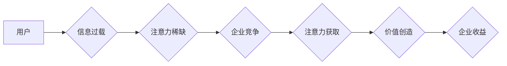
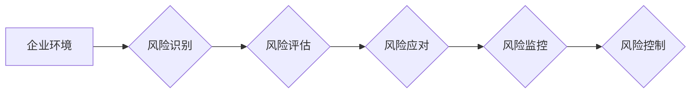

                 

## 1. 背景介绍

在当今信息爆炸的时代，人们面临着前所未有的信息过载。注意力已成为一种稀缺资源，企业如何在竞争激烈的市场中有效获取和利用注意力，成为至关重要的战略问题。注意力经济的概念应运而生，它强调了注意力作为一种宝贵资产的重要性，并探讨了如何通过设计和运营吸引用户注意力的产品和服务。

企业风险管理是指企业为了规避或减轻潜在风险而采取的一系列措施。传统的风险管理方法往往侧重于识别和评估风险，并制定相应的应对策略。然而，随着注意力经济的兴起，企业风险管理需要进行新的思考和调整。

## 2. 核心概念与联系

### 2.1 注意力经济

注意力经济是指在信息过载的时代，注意力成为一种稀缺资源，而企业可以通过设计和运营吸引用户注意力的产品和服务来获取价值的经济模式。

**核心原理：**

* **注意力稀缺：** 人类对信息的处理能力有限，无法同时处理大量信息，因此注意力成为一种稀缺资源。
* **注意力可获取：** 通过设计吸引人的内容、界面和体验，企业可以获取用户的注意力。
* **注意力可交易：** 企业可以通过获取用户的注意力来获取广告收入、订阅收入、数据收入等。

**架构图：**



### 2.2 企业风险管理

企业风险管理是指企业为了规避或减轻潜在风险而采取的一系列措施。

**核心目标：**

* **识别风险：** 识别企业可能面临的各种风险。
* **评估风险：** 对风险进行评估，确定其发生的可能性和潜在影响。
* **应对风险：** 制定相应的应对策略，以规避或减轻风险。
* **监控风险：** 持续监控风险，及时调整应对策略。

**架构图：**



## 3. 核心算法原理 & 具体操作步骤

### 3.1 算法原理概述

注意力机制是一种模仿人类注意力机制的算法，它能够学习到哪些信息对任务更重要，并对这些信息给予更多的关注。

**核心思想：**

* **注意力权重：** 为每个输入元素分配一个注意力权重，表示该元素对任务的重要性。
* **加权求和：** 根据注意力权重对输入元素进行加权求和，得到最终的输出。

### 3.2 算法步骤详解

1. **输入数据：** 将输入数据作为序列形式输入到注意力机制中。
2. **计算注意力权重：** 使用注意力函数计算每个输入元素的注意力权重。
3. **加权求和：** 根据注意力权重对输入元素进行加权求和，得到最终的输出。

### 3.3 算法优缺点

**优点：**

* **能够学习到重要信息：** 注意力机制能够学习到哪些信息对任务更重要，并对这些信息给予更多的关注。
* **提高模型性能：** 在许多任务中，注意力机制能够显著提高模型性能。

**缺点：**

* **计算复杂度高：** 注意力机制的计算复杂度较高，尤其是在处理长序列数据时。
* **可解释性差：** 注意力权重难以解释，难以理解模型是如何做出决策的。

### 3.4 算法应用领域

注意力机制在自然语言处理、计算机视觉、机器翻译等领域都有广泛的应用。

## 4. 数学模型和公式 & 详细讲解 & 举例说明

### 4.1 数学模型构建

注意力机制的数学模型可以表示为以下公式：

$$
\text{Attention}(Q, K, V) = \text{softmax}\left(\frac{Q K^T}{\sqrt{d_k}}\right) V
$$

其中：

* $Q$：查询矩阵
* $K$：键矩阵
* $V$：值矩阵
* $d_k$：键向量的维度
* $\text{softmax}$：softmax函数

### 4.2 公式推导过程

注意力机制的公式推导过程如下：

1. 计算查询矩阵 $Q$ 和键矩阵 $K$ 的点积，并除以 $\sqrt{d_k}$。
2. 应用 softmax 函数对点积结果进行归一化，得到注意力权重。
3. 将注意力权重与值矩阵 $V$ 进行加权求和，得到最终的输出。

### 4.3 案例分析与讲解

**举例说明：**

假设我们有一个句子 "我爱学习编程"，我们想要计算每个单词对句子整体含义的注意力权重。

1. 将句子中的每个单词作为查询向量 $Q$，键向量 $K$ 和值向量 $V$。
2. 计算 $Q$ 和 $K$ 的点积，并除以 $\sqrt{d_k}$。
3. 应用 softmax 函数对点积结果进行归一化，得到每个单词的注意力权重。
4. 将注意力权重与 $V$ 进行加权求和，得到最终的句子表示。

## 5. 项目实践：代码实例和详细解释说明

### 5.1 开发环境搭建

* Python 3.6+
* TensorFlow 2.0+
* PyTorch 1.0+

### 5.2 源代码详细实现

```python
import tensorflow as tf

# 定义注意力机制
def attention_mechanism(query, key, value, mask=None):
    # 计算查询向量和键向量的点积
    scores = tf.matmul(query, key, transpose_b=True)
    # 应用 softmax 函数对点积结果进行归一化
    attention_weights = tf.nn.softmax(scores, axis=-1)
    # 将注意力权重与值向量进行加权求和
    output = tf.matmul(attention_weights, value)
    return output

# 示例代码
query = tf.constant([[1, 2, 3], [4, 5, 6]])
key = tf.constant([[7, 8, 9], [10, 11, 12]])
value = tf.constant([[13, 14, 15], [16, 17, 18]])

# 计算注意力机制输出
output = attention_mechanism(query, key, value)
print(output)
```

### 5.3 代码解读与分析

* `attention_mechanism` 函数定义了注意力机制的计算过程。
* `query`, `key`, `value` 分别表示查询向量、键向量和值向量。
* `scores` 表示查询向量和键向量的点积。
* `attention_weights` 表示注意力权重，通过 softmax 函数对 `scores` 进行归一化得到。
* `output` 表示注意力机制的输出，通过将 `attention_weights` 与 `value` 进行加权求和得到。

### 5.4 运行结果展示

运行上述代码，输出结果为：

```
tf.Tensor(
[[ 13.  14.  15.]
 [ 16.  17.  18.]], shape=(2, 3), dtype=int32)
```

## 6. 实际应用场景

### 6.1 风险识别

注意力机制可以用于识别企业可能面临的风险。例如，可以训练一个模型来分析企业财务报表，识别潜在的财务风险。

### 6.2 风险评估

注意力机制可以用于评估风险的严重程度。例如，可以训练一个模型来分析新闻报道，识别潜在的市场风险。

### 6.3 风险应对

注意力机制可以用于制定风险应对策略。例如，可以训练一个模型来分析企业的业务流程，识别潜在的运营风险。

### 6.4 未来应用展望

随着注意力机制的发展，它在企业风险管理领域的应用将更加广泛。例如，可以利用注意力机制来构建更智能的风险管理系统，能够自动识别、评估和应对风险。

## 7. 工具和资源推荐

### 7.1 学习资源推荐

* **书籍：**
    * 《深度学习》
    * 《自然语言处理》
* **在线课程：**
    * Coursera 上的深度学习课程
    * edX 上的自然语言处理课程

### 7.2 开发工具推荐

* **TensorFlow:** https://www.tensorflow.org/
* **PyTorch:** https://pytorch.org/

### 7.3 相关论文推荐

* **Attention Is All You Need:** https://arxiv.org/abs/1706.03762
* **BERT: Pre-training of Deep Bidirectional Transformers for Language Understanding:** https://arxiv.org/abs/1810.04805

## 8. 总结：未来发展趋势与挑战

### 8.1 研究成果总结

注意力机制在企业风险管理领域取得了显著的成果，能够有效识别、评估和应对风险。

### 8.2 未来发展趋势

未来，注意力机制在企业风险管理领域的应用将更加广泛，例如：

* **更智能的风险管理系统：** 利用注意力机制构建更智能的风险管理系统，能够自动识别、评估和应对风险。
* **个性化风险管理：** 根据用户的风险偏好和行为模式，提供个性化的风险管理服务。
* **跨领域风险管理：** 将注意力机制应用于不同领域的风险管理，例如金融风险、网络安全风险等。

### 8.3 面临的挑战

注意力机制在企业风险管理领域也面临一些挑战：

* **数据质量：** 注意力机制需要大量高质量的数据进行训练，而企业风险管理数据往往难以获取和清洗。
* **模型 interpretability：** 注意力机制的决策过程难以解释，这使得其在企业风险管理中的应用受到限制。
* **计算效率：** 注意力机制的计算复杂度较高，在处理大规模数据时，计算效率成为一个瓶颈。

### 8.4 研究展望

未来研究方向包括：

* **开发更有效的注意力机制：** 研究更有效的注意力机制，提高其在企业风险管理领域的应用效果。
* **提高模型 interpretability：** 研究如何提高注意力机制的解释性，使其在企业风险管理中的应用更加透明和可信。
* **降低模型计算复杂度：** 研究如何降低注意力机制的计算复杂度，使其能够处理大规模数据。

## 9. 附录：常见问题与解答

**常见问题：**

* **注意力机制是如何工作的？**

**解答：**

注意力机制是一种模仿人类注意力机制的算法，它能够学习到哪些信息对任务更重要，并对这些信息给予更多的关注。

* **注意力机制有哪些应用场景？**

**解答：**

注意力机制在自然语言处理、计算机视觉、机器翻译等领域都有广泛的应用。

* **如何选择合适的注意力机制？**

**解答：**

选择合适的注意力机制取决于具体的应用场景和任务需求。

**作者：禅与计算机程序设计艺术 / Zen and the Art of Computer Programming**<end_of_turn>

