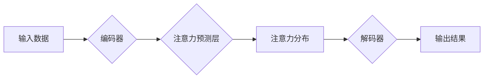

                 

## 深度学习在注意力预测中的应用

> 关键词：深度学习、注意力机制、预测模型、自然语言处理、计算机视觉

## 1. 背景介绍

注意力机制 (Attention Mechanism) 作为深度学习领域的一项重要突破，在自然语言处理 (NLP) 和计算机视觉 (CV) 等领域取得了显著的成果。它赋予模型的能力去聚焦于输入序列中最重要的部分，从而提升模型的理解能力和预测精度。

注意力机制的应用范围不断扩展，其中注意力预测 (Attention Prediction) 作为其重要分支，旨在预测注意力分布，从而揭示模型在处理输入数据时关注哪些部分。这对于理解模型的决策过程、提高模型的可解释性以及优化模型性能具有重要意义。

传统的注意力机制主要依赖于手工设计的特征工程和规则化策略，而深度学习的应用则使得注意力预测能够更加灵活、高效和准确。深度学习模型能够自动学习输入数据中的复杂关系和特征，从而预测出更精细和更有意义的注意力分布。

## 2. 核心概念与联系

### 2.1 注意力机制

注意力机制的核心思想是模拟人类的注意力机制，在处理信息时，我们往往会将注意力集中在与当前任务最相关的部分，而忽略其他无关的信息。

注意力机制通过计算每个输入元素与目标元素之间的相关性，并根据相关性赋予每个元素不同的权重，从而实现对信息的加权处理。

### 2.2 注意力预测

注意力预测是指利用深度学习模型预测注意力分布，即每个输入元素被模型关注的程度。

注意力预测模型通常由编码器和解码器组成，编码器负责提取输入数据的特征，解码器则根据编码器的输出预测注意力分布。

### 2.3 相关架构

**Mermaid 流程图**



## 3. 核心算法原理 & 具体操作步骤

### 3.1 算法原理概述

注意力预测算法通常基于深度神经网络，利用多层感知机 (MLP) 或卷积神经网络 (CNN) 等结构来提取输入数据的特征，并通过注意力机制计算每个元素的权重。

常见的注意力预测算法包括：

* **Soft Attention:** 使用 softmax 函数将元素权重归一化，得到概率分布，表示每个元素被关注的程度。
* **Hard Attention:** 选择一个或多个元素作为关注点，忽略其他元素。
* **Self-Attention:** 计算序列中每个元素与自身和其他元素之间的相关性，用于捕捉序列中的长距离依赖关系。

### 3.2 算法步骤详解

1. **输入数据预处理:** 将输入数据转换为模型可处理的格式，例如词嵌入、图像特征等。
2. **编码器:** 使用编码器网络提取输入数据的特征表示，例如使用 RNN 或 Transformer 等结构。
3. **注意力预测层:** 计算每个元素的注意力权重，可以使用 Soft Attention、Hard Attention 或 Self-Attention 等机制。
4. **解码器:** 使用解码器网络根据注意力分布和编码器的输出生成最终结果，例如生成文本、识别图像等。

### 3.3 算法优缺点

**优点:**

* **提高模型性能:** 注意力机制能够帮助模型聚焦于重要信息，从而提高模型的预测精度。
* **增强模型可解释性:** 注意力分布可以直观地展示模型关注哪些部分，从而提高模型的可解释性。
* **处理长序列数据:** Self-Attention 机制能够有效地捕捉序列中的长距离依赖关系，适用于处理长序列数据。

**缺点:**

* **计算复杂度高:** 注意力机制的计算复杂度较高，尤其是在处理长序列数据时。
* **参数量大:** 注意力机制通常需要大量的参数，训练成本较高。
* **可解释性仍然有限:** 尽管注意力分布可以提供一些信息，但模型的决策过程仍然难以完全理解。

### 3.4 算法应用领域

注意力预测算法在以下领域具有广泛的应用:

* **自然语言处理:** 文本摘要、机器翻译、问答系统、情感分析等。
* **计算机视觉:** 图像识别、目标检测、图像分割等。
* **语音识别:** 语音转文本、语音情感识别等。
* **推荐系统:** 用户兴趣预测、商品推荐等。

## 4. 数学模型和公式 & 详细讲解 & 举例说明

### 4.1 数学模型构建

注意力预测模型通常由以下几个部分组成:

* **编码器:** 用于提取输入数据的特征表示。
* **注意力层:** 用于计算每个元素的注意力权重。
* **解码器:** 用于根据注意力分布和编码器的输出生成最终结果。

### 4.2 公式推导过程

**Soft Attention:**

假设输入序列长度为 $T$，编码器输出的特征向量为 $h_1, h_2, ..., h_T$。

注意力权重计算公式:

$$
a_{ij} = \frac{exp(score(h_i, h_j))}{\sum_{k=1}^{T} exp(score(h_i, h_k))}
$$

其中，$score(h_i, h_j)$ 表示元素 $h_i$ 和 $h_j$ 之间的相关性，可以使用点积、余弦相似度等方式计算。

注意力分布计算公式:

$$
\alpha_i = \sum_{j=1}^{T} a_{ij}
$$

最终输出:

$$
c_i = \sum_{j=1}^{T} \alpha_{ij} h_j
$$

**Hard Attention:**

Hard Attention 选择一个或多个元素作为关注点，忽略其他元素。

选择机制可以使用贪婪算法、随机采样等方式实现。

### 4.3 案例分析与讲解

**文本摘要:**

使用 Soft Attention 的注意力预测模型可以帮助我们理解模型在生成文本摘要时关注哪些部分。

例如，在摘要一篇新闻文章时，模型可能会将注意力集中在标题、重要事件和人物等部分，而忽略一些无关细节。

**图像识别:**

使用 Hard Attention 的注意力预测模型可以帮助我们理解模型在识别图像时关注哪些部分。

例如，在识别一只猫的图像时，模型可能会将注意力集中在猫的头部、耳朵和尾巴等特征部分，而忽略背景信息。

## 5. 项目实践：代码实例和详细解释说明

### 5.1 开发环境搭建

* Python 3.6+
* TensorFlow/PyTorch
* CUDA (可选)

### 5.2 源代码详细实现

```python
import tensorflow as tf

# 定义编码器网络
class Encoder(tf.keras.Model):
    def __init__(self, embedding_dim, hidden_dim):
        super(Encoder, self).__init__()
        self.embedding = tf.keras.layers.Embedding(vocab_size, embedding_dim)
        self.rnn = tf.keras.layers.LSTM(hidden_dim)

    def call(self, inputs):
        x = self.embedding(inputs)
        x = self.rnn(x)
        return x

# 定义注意力层
class AttentionLayer(tf.keras.layers.Layer):
    def __init__(self, hidden_dim):
        super(AttentionLayer, self).__init__()
        self.W1 = tf.keras.layers.Dense(hidden_dim)
        self.W2 = tf.keras.layers.Dense(1)

    def call(self, encoder_outputs, decoder_hidden):
        # 计算注意力权重
        scores = self.W2(tf.nn.tanh(self.W1(tf.concat([encoder_outputs, decoder_hidden], axis=-1))))
        # 归一化注意力权重
        attention_weights = tf.nn.softmax(scores, axis=1)
        # 计算加权平均值
        context_vector = tf.matmul(attention_weights, encoder_outputs)
        return context_vector, attention_weights

# 定义解码器网络
class Decoder(tf.keras.Model):
    def __init__(self, embedding_dim, hidden_dim, vocab_size):
        super(Decoder, self).__init__()
        self.embedding = tf.keras.layers.Embedding(vocab_size, embedding_dim)
        self.rnn = tf.keras.layers.LSTM(hidden_dim)
        self.fc = tf.keras.layers.Dense(vocab_size)

    def call(self, inputs, encoder_outputs, attention_weights):
        # 嵌入输入词
        x = self.embedding(inputs)
        # 连接编码器输出和注意力权重
        x = tf.concat([x, attention_weights], axis=-1)
        # 通过 RNN 处理
        x = self.rnn(x)
        # 输出预测概率
        output = self.fc(x)
        return output

# 定义整个模型
class AttentionModel(tf.keras.Model):
    def __init__(self, embedding_dim, hidden_dim, vocab_size):
        super(AttentionModel, self).__init__()
        self.encoder = Encoder(embedding_dim, hidden_dim)
        self.attention_layer = AttentionLayer(hidden_dim)
        self.decoder = Decoder(embedding_dim, hidden_dim, vocab_size)

    def call(self, inputs, targets):
        encoder_outputs = self.encoder(inputs)
        decoder_outputs = []
        for t in range(targets.shape[1]):
            context_vector, attention_weights = self.attention_layer(encoder_outputs, decoder_hidden)
            decoder_input = targets[:, t]
            decoder_output = self.decoder(decoder_input, encoder_outputs, attention_weights)
            decoder_outputs.append(decoder_output)
        return tf.stack(decoder_outputs, axis=1)

# 实例化模型
model = AttentionModel(embedding_dim=128, hidden_dim=256, vocab_size=10000)

# 训练模型
model.compile(optimizer='adam', loss='sparse_categorical_crossentropy', metrics=['accuracy'])
model.fit(train_inputs, train_targets, epochs=10)
```

### 5.3 代码解读与分析

* **编码器:** 使用 LSTM 网络提取输入序列的特征表示。
* **注意力层:** 计算每个元素的注意力权重，并生成注意力分布。
* **解码器:** 根据注意力分布和编码器的输出生成最终结果。
* **模型训练:** 使用 Adam 优化器和交叉熵损失函数训练模型。

### 5.4 运行结果展示

训练完成后，可以使用模型对新的输入数据进行预测，并观察模型的注意力分布。

## 6. 实际应用场景

### 6.1 自然语言处理

* **文本摘要:** 使用注意力预测模型可以生成更准确、更相关的文本摘要。
* **机器翻译:** 注意力机制可以帮助模型更好地理解源语言和目标语言之间的关系，从而提高翻译质量。
* **问答系统:** 注意力预测模型可以帮助模型识别用户问题中的关键信息，并找到最相关的答案。

### 6.2 计算机视觉

* **图像识别:** 注意力机制可以帮助模型识别图像中的关键特征，从而提高识别精度。
* **目标检测:** 注意力预测模型可以帮助模型定位图像中的目标，并识别目标类别。
* **图像分割:** 注意力机制可以帮助模型分割图像中的不同区域，例如人、车、建筑物等。

### 6.3 其他领域

* **语音识别:** 注意力机制可以帮助模型识别语音中的关键音素，从而提高语音识别精度。
* **推荐系统:** 注意力预测模型可以帮助模型理解用户的兴趣偏好，并推荐更相关的商品或服务。

### 6.4 未来应用展望

随着深度学习技术的不断发展，注意力预测模型的应用场景将会更加广泛。

例如，注意力机制可以应用于药物研发、医疗诊断、金融风险评估等领域，帮助我们更好地理解复杂数据，并做出更准确的决策。

## 7. 工具和资源推荐

### 7.1 学习资源推荐

* **书籍:**
    * Deep Learning by Ian Goodfellow, Yoshua Bengio, and Aaron Courville
    * Attention Is All You Need by Vaswani et al.
* **论文:**
    * "Attention Is All You Need" (https://arxiv.org/abs/1706.03762)
    * "BERT: Pre-training of Deep Bidirectional Transformers for Language Understanding" (https://arxiv.org/abs/1810.04805)
* **在线课程:**
    * Coursera: Deep Learning Specialization
    * Udacity: Deep Learning Nanodegree

### 7.2 开发工具推荐

* **TensorFlow:** https://www.tensorflow.org/
* **PyTorch:** https://pytorch.org/
* **Keras:** https://keras.io/

### 7.3 相关论文推荐

* "Self-Attention with Relative Positional Encodings for Sequence Classification" (https://arxiv.org/abs/1803.02155)
* "Multi-Head Attention for Machine Translation" (https://arxiv.org/abs/1706.03762)
* "Transformer-XL: Attentive Language Models Beyond a Fixed-Length Context" (https://arxiv.org/abs/1901.08316)

## 8. 总结：未来发展趋势与挑战

### 8.1 研究成果总结

注意力机制在深度学习领域取得了显著的成果，尤其是在自然语言处理和计算机视觉领域。注意力预测模型能够帮助我们更好地理解模型的决策过程，并提高模型的性能。

### 8.2 未来发展趋势

* **更有效的注意力机制:** 研究更有效的注意力机制，例如基于图神经网络的注意力机制、基于强化学习的注意力机制等。
* **跨模态注意力:** 研究跨模态注意力机制，例如将文本和图像等不同模态的信息融合在一起。
* **可解释性增强:** 研究更可解释的注意力机制，例如可视化注意力分布、解释注意力权重等。

### 8.3 面临的挑战

* **计算复杂度:** 注意力机制的计算复杂度较高，尤其是在处理长序列数据时。
* **参数量:** 注意力机制通常需要大量的参数，训练成本较高。
* **可解释性:** 尽管注意力分布可以提供一些信息，但模型的决策过程仍然难以完全理解。

### 8.4 研究展望

未来，注意力机制将会在更多领域得到应用，例如药物研发、医疗诊断、金融风险评估等。

研究人员将继续探索更有效的、更可解释的注意力机制，以更好地理解和利用深度学习模型的潜力。

## 9. 附录：常见问题与解答

**Q1: 注意力机制和传统特征工程有什么区别？**

**A1:** 传统特征工程需要人工设计特征，而注意力机制则能够自动学习输入数据的特征表示。

**Q2: 注意力机制的计算复杂度如何？**

**A2:** 注意力机制的计算复杂度较高，尤其是在处理长序列数据时。

**Q3: 如何解释注意力权重？**

**A3:** 注意力权重表示模型对每个元素的关注程度。

**Q4: 注意力机制有哪些应用场景？**

**A4:** 注意力机制在自然语言处理、计算机视觉、语音识别等领域都有广泛的应用。


作者：禅与计算机程序设计艺术 / Zen and the Art of Computer Programming<end_of_turn>

