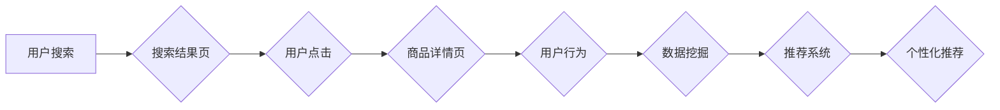

                 

## 用户点击流：电商搜索的数据金矿

> 关键词：用户点击流、电商搜索、数据挖掘、推荐系统、机器学习、深度学习、自然语言处理

### 1. 背景介绍

在当今数据爆炸的时代，电商平台积累了海量用户行为数据，其中用户点击流数据作为最为直接的反映用户意图和偏好的信息，蕴藏着巨大的商业价值。用户点击流是指用户在浏览电商平台时，从搜索结果页到商品详情页、购物车、下单页等各个环节所点击的路径和行为序列。

电商平台可以通过分析用户点击流数据，深入了解用户的购物习惯、偏好和需求，从而实现以下目标：

* **个性化推荐:** 根据用户的点击历史和浏览记录，推荐更符合用户兴趣的商品，提高转化率。
* **搜索结果优化:** 分析用户点击行为，调整搜索结果排序，提升用户搜索体验和商品曝光率。
* **用户画像构建:** 通过分析用户的点击流，构建用户画像，了解用户的年龄、性别、兴趣爱好、消费习惯等信息，为精准营销提供数据支持。
* **运营策略优化:** 分析用户点击流的趋势和规律，优化电商平台的运营策略，例如促销活动、商品摆放等。

### 2. 核心概念与联系

用户点击流数据分析的核心概念包括：

* **点击流:** 用户在电商平台上浏览和交互的路径和行为序列。
* **用户行为:** 用户在电商平台上执行的所有操作，例如搜索、浏览、点击、加入购物车、下单等。
* **数据挖掘:** 从海量用户点击流数据中提取有价值的信息和模式。
* **推荐系统:** 基于用户点击流数据，推荐用户感兴趣的商品或内容。
* **机器学习:** 利用算法从数据中学习，提高推荐系统的准确性和个性化程度。

**用户点击流数据分析流程图:**



### 3. 核心算法原理 & 具体操作步骤

#### 3.1 算法原理概述

用户点击流数据分析常用的算法包括：

* **协同过滤:** 基于用户的相似性或商品的相似性，推荐用户可能感兴趣的商品。
* **基于内容的推荐:** 根据商品的属性和描述，推荐与用户兴趣相符的商品。
* **深度学习:** 利用深度神经网络，从用户点击流数据中学习更复杂的模式，提高推荐系统的准确性。

#### 3.2 算法步骤详解

以协同过滤算法为例，其具体操作步骤如下：

1. **构建用户-商品交互矩阵:** 将用户和商品作为矩阵的行和列，用户对商品的交互行为（例如点击、购买）作为矩阵的元素。
2. **计算用户相似度:** 使用余弦相似度等方法计算用户之间的相似度，例如两个用户对相同商品的交互行为相似度较高，则认为这两个用户相似。
3. **计算商品相似度:** 使用余弦相似度等方法计算商品之间的相似度，例如两个商品经常被用户一起购买，则认为这两个商品相似。
4. **推荐商品:** 对于一个用户，根据其相似用户的交互行为，推荐用户可能感兴趣的商品。

#### 3.3 算法优缺点

**协同过滤算法:**

* **优点:** 可以发现用户之间的隐性关系，推荐个性化商品。
* **缺点:** 对于新用户或新商品，由于缺乏交互数据，难以进行推荐。

**基于内容的推荐算法:**

* **优点:** 不需要用户交互数据，可以推荐与用户兴趣相符的商品。
* **缺点:** 难以捕捉用户细微的兴趣变化，推荐结果可能不够个性化。

**深度学习算法:**

* **优点:** 可以学习更复杂的模式，提高推荐系统的准确性。
* **缺点:** 需要大量的训练数据，训练成本较高。

#### 3.4 算法应用领域

用户点击流数据分析算法广泛应用于以下领域：

* **电商推荐:** 推荐商品、广告、优惠券等。
* **内容推荐:** 推荐新闻、视频、音乐等内容。
* **社交推荐:** 推荐好友、群组、活动等。
* **搜索引擎优化:** 优化搜索结果排序，提高用户搜索体验。

### 4. 数学模型和公式 & 详细讲解 & 举例说明

#### 4.1 数学模型构建

用户点击流数据分析常用的数学模型包括：

* **贝叶斯网络:** 用于建模用户行为之间的依赖关系。
* **马尔科夫链:** 用于建模用户在电商平台上的浏览路径。
* **潜在语义分析 (LSA):** 用于挖掘用户点击流数据中的隐含语义。

#### 4.2 公式推导过程

以马尔科夫链为例，其状态转移概率公式如下：

$$P(s_t|s_{t-1})$$

其中：

* $s_t$ 表示用户在时间 $t$ 的状态。
* $s_{t-1}$ 表示用户在时间 $t-1$ 的状态。

#### 4.3 案例分析与讲解

假设用户在电商平台上浏览商品的路径为：搜索结果页 -> 商品详情页 -> 加入购物车 -> 下单页。

我们可以将每个页面作为马尔科夫链的状态，并根据用户点击行为计算状态转移概率。例如，从搜索结果页到商品详情页的转移概率可以表示为：

$$P(\text{商品详情页}|\text{搜索结果页})$$

通过分析这些状态转移概率，我们可以了解用户在电商平台上的浏览路径和行为模式。

### 5. 项目实践：代码实例和详细解释说明

#### 5.1 开发环境搭建

* **操作系统:** Linux/macOS/Windows
* **编程语言:** Python
* **库依赖:** pandas, numpy, scikit-learn, TensorFlow/PyTorch

#### 5.2 源代码详细实现

```python
import pandas as pd
from sklearn.feature_extraction.text import TfidfVectorizer

# 加载用户点击流数据
data = pd.read_csv('user_clickstream.csv')

# 提取商品描述
product_descriptions = data['product_description'].values

# 使用 TF-IDF 向量化商品描述
vectorizer = TfidfVectorizer()
product_vectors = vectorizer.fit_transform(product_descriptions)

# 计算商品之间的余弦相似度
cosine_similarities = product_vectors.dot(product_vectors.T) / (product_vectors.norm(axis=1) * product_vectors.norm(axis=1).T)

# 推荐与用户最近点击商品相似的商品
user_id = 123
clicked_product_id = data[data['user_id'] == user_id]['product_id'].values[0]
similar_product_ids = cosine_similarities[clicked_product_id].argsort()[:-6:-1]
```

#### 5.3 代码解读与分析

* 该代码首先加载用户点击流数据，并提取商品描述。
* 然后使用 TF-IDF 向量化技术将商品描述转换为向量表示。
* 接着计算商品之间的余弦相似度，用于衡量商品之间的相似程度。
* 最后，根据用户最近点击的商品，推荐与该商品相似的商品。

#### 5.4 运行结果展示

运行该代码后，会输出与用户最近点击商品相似的商品列表。

### 6. 实际应用场景

#### 6.1 个性化推荐

电商平台可以根据用户的点击流数据，推荐个性化的商品，例如：

* **基于浏览历史的推荐:** 推荐用户之前浏览过的商品或与之相关的商品。
* **基于购买历史的推荐:** 推荐用户之前购买过的商品或与之相关的商品。
* **基于兴趣标签的推荐:** 推荐与用户兴趣标签相关的商品。

#### 6.2 搜索结果优化

电商平台可以分析用户点击行为，优化搜索结果排序，例如：

* **点击率排序:** 将点击率高的商品排在前面。
* **用户兴趣排序:** 根据用户的点击历史和浏览记录，推荐用户可能感兴趣的商品。
* **商品相关性排序:** 根据商品的属性和描述，推荐与用户搜索关键词相关的商品。

#### 6.3 用户画像构建

电商平台可以分析用户的点击流数据，构建用户画像，例如：

* **用户年龄:** 根据用户的点击行为，推测用户的年龄段。
* **用户性别:** 根据用户的点击行为，推测用户的性别。
* **用户兴趣爱好:** 根据用户的点击行为，分析用户的兴趣爱好。
* **用户消费习惯:** 根据用户的点击行为，分析用户的消费习惯。

#### 6.4 未来应用展望

用户点击流数据分析在未来将有更广泛的应用场景，例如：

* **个性化营销:** 根据用户的点击流数据，进行精准营销，提高营销效果。
* **用户体验优化:** 分析用户的点击行为，优化电商平台的用户体验。
* **新产品开发:** 分析用户的点击流数据，了解用户的需求，为新产品开发提供参考。

### 7. 工具和资源推荐

#### 7.1 学习资源推荐

* **书籍:**
    * 《推荐系统》
    * 《机器学习》
    * 《深度学习》
* **在线课程:**
    * Coursera: Recommender Systems
    * edX: Machine Learning
    * Udacity: Deep Learning

#### 7.2 开发工具推荐

* **Python:** 
    * pandas
    * numpy
    * scikit-learn
    * TensorFlow/PyTorch
* **Hadoop/Spark:** 用于处理海量用户点击流数据。
* **Elasticsearch:** 用于存储和检索用户点击流数据。

#### 7.3 相关论文推荐

* **Collaborative Filtering for Implicit Feedback Datasets**
* **Matrix Factorization Techniques for Recommender Systems**
* **Deep Learning for Recommender Systems**

### 8. 总结：未来发展趋势与挑战

#### 8.1 研究成果总结

用户点击流数据分析已经取得了显著的成果，例如：

* **个性化推荐:** 提高了用户体验和转化率。
* **搜索结果优化:** 提升了用户搜索体验。
* **用户画像构建:** 为精准营销提供了数据支持。

#### 8.2 未来发展趋势

未来用户点击流数据分析将朝着以下方向发展：

* **更精准的推荐:** 利用深度学习等先进算法，提高推荐系统的准确性和个性化程度。
* **更全面的用户画像:** 结合用户行为、社交关系、地理位置等多方面数据，构建更全面的用户画像。
* **更智能的运营策略:** 利用数据分析，制定更智能的运营策略，例如促销活动、商品摆放等。

#### 8.3 面临的挑战

用户点击流数据分析也面临一些挑战：

* **数据质量:** 用户点击流数据可能存在噪声和缺失值，需要进行数据清洗和预处理。
* **数据隐私:** 用户点击流数据包含用户的隐私信息，需要进行数据保护和安全处理。
* **算法复杂度:** 一些先进的算法计算复杂度较高，需要更高效的算法和计算资源。

#### 8.4 研究展望

未来用户点击流数据分析的研究方向包括：

* **开发更鲁棒的算法:** 能够处理噪声数据和缺失值，提高算法的稳定性和准确性。
* **探索新的数据源:** 结合用户行为、社交关系、地理位置等多方面数据，构建更全面的用户画像。
* **研究数据隐私保护技术:** 保护用户隐私信息，同时实现数据分析的有效性。


### 9. 附录：常见问题与解答

**Q1: 如何处理用户点击流数据中的噪声和缺失值？**

**A1:** 可以使用以下方法处理用户点击流数据中的噪声和缺失值：

* **数据清洗:** 删除明显错误的数据，例如重复数据、异常值等。
* **数据填充:** 使用平均值、中位数等方法填充缺失值。
* **数据降维:** 使用主成分分析等方法降低数据维度，减少噪声的影响。

**Q2: 如何保护用户隐私信息？**

**A2:** 可以使用以下方法保护用户隐私信息：

* **数据匿名化:** 删除用户个人识别信息，例如姓名、地址等。
* **差分隐私:** 添加噪声到数据中，保护用户隐私的同时，保证数据分析的有效性。
* **联邦学习:** 在不共享原始数据的情况下，训练机器学习模型。


作者：禅与计算机程序设计艺术 / Zen and the Art of Computer Programming 
<end_of_turn>

