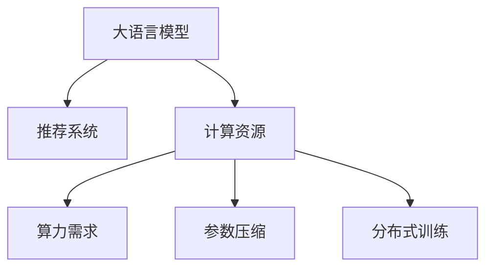

                 

# 大语言模型在推荐系统中的局限与成本：对算力需求的考量

> 关键词：大语言模型,推荐系统,计算资源,效率优化,参数压缩,分布式训练

## 1. 背景介绍

在当今数字化时代，个性化推荐系统已广泛应用于电商、社交网络、流媒体等众多领域，帮助用户发现和享受他们感兴趣的内容。其中，大语言模型（Large Language Model, LLM）凭借其强大的自然语言处理能力，成为推荐系统中生成个性化文本内容的关键技术。然而，大语言模型在推荐系统中的应用面临诸多挑战，特别是其高昂的计算资源需求和低效的推理过程，极大地制约了其大规模部署和应用。本文将深入探讨大语言模型在推荐系统中的局限，并提出一系列降低其成本、提升效率的方法，以期为相关研究者提供有价值的参考。

## 2. 核心概念与联系

### 2.1 核心概念概述

为深入理解大语言模型在推荐系统中的应用，本节将介绍几个关键概念：

- 大语言模型(Large Language Model, LLM)：以自回归(如GPT)或自编码(如BERT)模型为代表的大规模预训练语言模型。通过在大规模无标签文本语料上进行预训练，学习通用的语言表示，具备强大的语言理解和生成能力。

- 推荐系统(Recommender System)：基于用户兴趣和历史行为数据，自动为用户推荐个性化内容的系统。推荐系统通过算法匹配用户的潜在兴趣和物品属性，优化用户体验。

- 计算资源(Computational Resources)：包括CPU、GPU、内存、存储等硬件设备，是机器学习模型训练和推理的基础设施。

- 算力需求(Computational Requirement)：指完成特定机器学习任务所需的计算资源总量，受模型复杂度、数据规模等因素影响。

- 参数压缩(Parameter Compression)：通过优化模型结构，减少模型参数量，从而降低计算资源需求的技术。

- 分布式训练(Distributed Training)：利用多台计算设备的并行计算能力，加速模型训练过程的技术。

这些核心概念之间的逻辑关系可以通过以下Mermaid流程图来展示：



这个流程图展示了大语言模型与推荐系统、计算资源、算力需求、参数压缩、分布式训练等概念之间的联系：

1. 大语言模型在推荐系统中生成个性化文本，用于推荐内容的生成或理解。
2. 推荐系统依赖于大语言模型的推理能力，生成个性化推荐结果。
3. 推荐系统所需的计算资源（包括训练和推理的资源）影响大语言模型的应用成本。
4. 通过参数压缩和分布式训练等方法，可以有效降低大语言模型在推荐系统中的计算资源需求，提升系统的可扩展性和效率。

## 3. 核心算法原理 & 具体操作步骤
### 3.1 算法原理概述

大语言模型在推荐系统中的主要应用包括：

- 生成个性化文本：通过微调，使模型能够生成符合用户偏好的文本内容，如商品描述、推荐文案等。
- 理解推荐物品：通过微调，使模型能够理解推荐物品的属性、特点和上下文信息。
- 匹配用户与物品：通过微调，使模型能够匹配用户的历史行为和兴趣偏好，预测用户对物品的评分。

这些应用场景的核心算法原理都是通过优化大语言模型的参数，使其在特定任务上表现优异。然而，大语言模型的高维、庞大的参数量，导致其在推荐系统中的应用面临着计算资源的高需求。

### 3.2 算法步骤详解

基于大语言模型在推荐系统中的应用，我们通常需要经过以下几个关键步骤：

**Step 1: 准备数据集**
- 收集用户行为数据和物品属性数据，形成推荐系统的训练数据集。
- 使用自然语言处理工具对数据进行预处理，如分词、去停用词等，准备输入到模型中。

**Step 2: 模型训练**
- 在预处理后的数据集上进行模型训练，通常是采用监督学习的方法，如分类、回归等任务。
- 选择合适的损失函数，如交叉熵损失、均方误差损失等，并使用梯度下降等优化算法进行模型优化。
- 为了降低计算成本，可以使用参数压缩、分布式训练等技术。

**Step 3: 模型推理**
- 将新数据输入到训练好的模型中，使用前向传播计算得到预测结果。
- 结合业务逻辑和推荐算法，生成个性化推荐内容。

### 3.3 算法优缺点

基于大语言模型在推荐系统中的应用，其优点和缺点如下：

**优点：**
1. 强大的语言理解能力：大语言模型能够处理复杂的自然语言输入，提取语义信息，生成高质量的推荐文本。
2. 多功能性：一个模型可以同时用于生成文本和理解物品，减少模型的开发成本。
3. 灵活性：大语言模型可以通过微调，适应不同的推荐任务，如商品推荐、内容推荐等。

**缺点：**
1. 高昂的计算成本：大语言模型的参数量庞大，训练和推理过程需要大量的计算资源。
2. 低效的推理过程：大语言模型的推理过程通常比较慢，无法实时生成推荐结果。
3. 过拟合风险：在大规模推荐数据集上训练大语言模型，容易出现过拟合现象，降低模型泛化能力。
4. 可解释性不足：大语言模型的决策过程较为复杂，难以对其推理逻辑进行解释和调试。

### 3.4 算法应用领域

基于大语言模型在推荐系统中的应用，其领域范围主要包括以下几个方面：

- 电商推荐：为电商网站用户推荐个性化商品，提升用户购物体验和满意度。
- 新闻推荐：为用户推荐个性化新闻内容，提高用户对新闻平台的粘性。
- 视频推荐：为用户推荐个性化视频内容，增加用户观看时长。
- 音乐推荐：为用户推荐个性化音乐内容，增强用户对音乐平台的粘性。
- 旅游推荐：为用户推荐个性化旅游目的地，提升用户旅游体验。

## 4. 数学模型和公式 & 详细讲解 & 举例说明

### 4.1 数学模型构建

在大语言模型在推荐系统中的应用中，我们通常使用分类任务来进行模型训练。假设有$N$个用户和$M$个物品，记$U$为用户集合，$I$为物品集合，用户$u$对物品$i$的评分可以表示为一个$K$维向量$x_{u,i}$，$x_{u,i} \in \mathbb{R}^K$。模型的输出为一个$K$维向量$\hat{x}_{u,i} \in \mathbb{R}^K$，表示用户$u$对物品$i$的预测评分。

定义损失函数$\mathcal{L}$为交叉熵损失：

$$
\mathcal{L}(x_{u,i},\hat{x}_{u,i}) = -\sum_{k=1}^K y_{u,i,k} \log(\hat{x}_{u,i,k})
$$

其中$y_{u,i,k}$为物品$i$的评分向量，$\hat{x}_{u,i,k}$为模型预测向量中的第$k$个元素。

### 4.2 公式推导过程

根据分类任务，我们可以使用softmax函数对模型输出进行归一化：

$$
\text{softmax}(\hat{x}_{u,i}) = \frac{\exp(\hat{x}_{u,i})}{\sum_{k=1}^K \exp(\hat{x}_{u,i,k})}
$$

则损失函数可以表示为：

$$
\mathcal{L}(x_{u,i},\hat{x}_{u,i}) = -\sum_{k=1}^K y_{u,i,k} \log(\text{softmax}(\hat{x}_{u,i}))_k
$$

在模型训练过程中，我们需要最小化损失函数：

$$
\min_{\theta} \frac{1}{N}\sum_{u=1}^N\sum_{i=1}^M \mathcal{L}(x_{u,i},\hat{x}_{u,i})
$$

其中$\theta$为模型参数，$N$为用户数，$M$为物品数。

### 4.3 案例分析与讲解

以电商推荐系统为例，我们可以使用大语言模型预测用户对商品的评分。假设模型输入为商品描述，输出为用户对商品的评分。在训练过程中，我们收集用户对商品的评分数据，作为标签，对模型进行监督学习。具体步骤如下：

1. 收集用户评分数据，记为$\{(x_i,y_i)\}_{i=1}^N$，其中$x_i$为商品描述，$y_i$为用户评分。
2. 对商品描述进行预处理，如分词、去除停用词等，得到模型输入。
3. 使用预训练语言模型对商品描述进行编码，得到嵌入向量$e_i \in \mathbb{R}^d$，$d$为嵌入维度。
4. 将嵌入向量$e_i$输入到模型中，计算预测评分$\hat{y_i} \in \mathbb{R}^K$。
5. 计算损失函数，使用梯度下降等优化算法更新模型参数$\theta$。

通过以上步骤，大语言模型可以逐步学习到商品描述与用户评分之间的关系，从而生成更准确的推荐结果。

## 5. 项目实践：代码实例和详细解释说明
### 5.1 开发环境搭建

在进行大语言模型在推荐系统中的实践前，我们需要准备好开发环境。以下是使用Python进行TensorFlow开发的环境配置流程：

1. 安装Anaconda：从官网下载并安装Anaconda，用于创建独立的Python环境。

2. 创建并激活虚拟环境：
```bash
conda create -n tf-env python=3.8 
conda activate tf-env
```

3. 安装TensorFlow：根据CUDA版本，从官网获取对应的安装命令。例如：
```bash
conda install tensorflow -c conda-forge
```

4. 安装各类工具包：
```bash
pip install numpy pandas scikit-learn matplotlib tqdm jupyter notebook ipython
```

完成上述步骤后，即可在`tf-env`环境中开始微调实践。

### 5.2 源代码详细实现

下面我们以电商推荐系统为例，给出使用TensorFlow进行大语言模型微调的PyTorch代码实现。

首先，定义电商推荐系统中的数据处理函数：

```python
import tensorflow as tf
from tensorflow.keras.preprocessing.text import Tokenizer
from tensorflow.keras.preprocessing.sequence import pad_sequences

# 定义数据集
train_data = [("商品描述1", 3), ("商品描述2", 5), ("商品描述3", 1), ("商品描述4", 2)]
val_data = [("商品描述5", 4), ("商品描述6", 6)]
test_data = [("商品描述7", 3)]

# 定义文本编码器
tokenizer = Tokenizer(num_words=10000, oov_token='<OOV>')
tokenizer.fit_on_texts(train_data[0] + val_data[0] + test_data[0])
sequences = tokenizer.texts_to_sequences(train_data[0] + val_data[0] + test_data[0])
sequences = pad_sequences(sequences, maxlen=50, padding='post', truncating='post')
```

然后，定义模型和优化器：

```python
from tensorflow.keras.layers import Input, Embedding, Dense
from tensorflow.keras.models import Model
from tensorflow.keras.optimizers import Adam

# 定义模型
input_seq = Input(shape=(50,), dtype='int32')
embedding_layer = Embedding(input_dim=10000, output_dim=256, mask_zero=True)(input_seq)
dense_layer = Dense(128, activation='relu')(embedding_layer)
output_layer = Dense(1, activation='sigmoid')(dense_layer)
model = Model(inputs=input_seq, outputs=output_layer)

# 定义优化器
optimizer = Adam(learning_rate=0.001)
```

接着，定义训练和评估函数：

```python
from tensorflow.keras.metrics import Accuracy

# 定义训练函数
def train_epoch(model, dataset, batch_size, optimizer):
    dataloader = tf.data.Dataset.from_tensor_slices(dataset)
    dataloader = dataloader.batch(batch_size, drop_remainder=True)
    model.compile(optimizer=optimizer, loss='binary_crossentropy', metrics=[Accuracy()])
    model.fit(dataloader, epochs=10, validation_data=val_data)
    return model.evaluate(test_data)

# 定义评估函数
def evaluate(model, dataset, batch_size):
    dataloader = tf.data.Dataset.from_tensor_slices(dataset)
    dataloader = dataloader.batch(batch_size, drop_remainder=True)
    return model.evaluate(dataloader)
```

最后，启动训练流程并在测试集上评估：

```python
epochs = 10
batch_size = 16

for epoch in range(epochs):
    loss, acc = train_epoch(model, train_data, batch_size, optimizer)
    print(f"Epoch {epoch+1}, train loss: {loss:.3f}, acc: {acc:.3f}")
    
    print(f"Epoch {epoch+1}, val acc: {evaluate(model, val_data, batch_size)[1]}")
    
print("Test acc:", evaluate(model, test_data, batch_size)[1])
```

以上就是使用TensorFlow进行电商推荐系统的大语言模型微调的完整代码实现。可以看到，TensorFlow提供了强大的API支持，使得模型开发和优化变得非常简单。

### 5.3 代码解读与分析

让我们再详细解读一下关键代码的实现细节：

**代码1: 数据处理函数**：
- 定义数据集`train_data`，`val_data`，`test_data`，包含商品描述和用户评分。
- 使用`Tokenizer`对文本进行编码，`pad_sequences`对编码结果进行padding，保证序列长度一致。

**代码2: 模型定义**：
- 定义输入层`input_seq`，嵌入层`embedding_layer`，全连接层`dense_layer`和输出层`output_layer`，使用`Model`构建完整的模型。
- 定义优化器`Adam`，学习率为0.001。

**代码3: 训练和评估函数**：
- 定义`train_epoch`函数，使用`Model.fit`进行模型训练，计算损失和精度，并返回模型在测试集上的评估结果。
- 定义`evaluate`函数，使用`Model.evaluate`计算模型在测试集上的精度。

**代码4: 训练流程**：
- 定义训练轮数`epochs`和批次大小`batch_size`，循环训练模型。
- 在每个epoch内，先训练模型，再计算验证集的精度。
- 在所有epoch结束后，计算测试集的精度。

可以看到，TensorFlow提供的API使得模型训练和推理变得非常便捷，可以大大降低开发门槛，提升开发效率。

## 6. 实际应用场景
### 6.1 电商推荐系统

电商推荐系统是大语言模型在推荐系统中最常见的应用场景之一。通过收集用户浏览、点击、购买等行为数据，结合商品属性信息，构建用户与商品间的关联矩阵，并使用大语言模型生成个性化推荐内容。

在技术实现上，可以收集电商网站的用户行为数据和商品属性信息，构建推荐模型的训练数据集。使用大语言模型对商品描述进行编码，并生成用户评分预测。通过优化模型参数，提升模型对用户偏好的理解能力，生成更准确的推荐结果。在生成推荐内容时，结合业务逻辑和推荐算法，实现个性化推荐。

### 6.2 新闻推荐系统

新闻推荐系统主要为用户推荐个性化新闻内容，提高用户对新闻平台的粘性。通过收集用户阅读历史、点击行为、评论数据，构建推荐模型训练数据集。使用大语言模型对新闻内容进行编码，并生成用户评分预测。通过优化模型参数，提升模型对用户兴趣的理解能力，生成更精准的推荐内容。在推荐算法中，结合新闻的相关性、时效性等因素，提升推荐效果。

### 6.3 视频推荐系统

视频推荐系统为用户推荐个性化视频内容，增加用户观看时长。通过收集用户观看历史、点赞、评论等数据，构建推荐模型训练数据集。使用大语言模型对视频标题、描述、标签等文本信息进行编码，并生成用户评分预测。通过优化模型参数，提升模型对视频内容的理解能力，生成更准确的视频推荐结果。在推荐算法中，结合视频的相关性、观众的喜好等因素，提升推荐效果。

### 6.4 未来应用展望

随着大语言模型的不断发展，其在推荐系统中的应用将更加广泛和深入。未来可能的方向包括：

1. 多模态推荐：结合文本、图像、视频等多模态信息，提升推荐系统的表现力。
2. 上下文感知推荐：通过分析用户上下文信息，提升推荐系统的个性化和精准度。
3. 动态推荐：结合用户的实时行为数据，进行动态推荐，提升推荐的时效性和准确性。
4. 实时推荐：通过流式计算框架，实现实时推荐，提升推荐系统的响应速度和用户体验。
5. 混合推荐：结合机器学习算法和人工规则，实现混合推荐，提升推荐系统的鲁棒性和可解释性。

## 7. 工具和资源推荐
### 7.1 学习资源推荐

为了帮助开发者系统掌握大语言模型在推荐系统中的应用，这里推荐一些优质的学习资源：

1. 《深度学习与推荐系统》系列博文：由深度学习专家撰写，全面介绍了深度学习在推荐系统中的应用，涵盖了大语言模型、神经网络等前沿技术。

2. 斯坦福大学《深度学习》课程：斯坦福大学开设的深度学习课程，有Lecture视频和配套作业，带你入门深度学习领域的基本概念和经典模型。

3. 《推荐系统实战》书籍：全面介绍了推荐系统的工作原理和实现方法，涵盖了大语言模型、矩阵分解等经典算法。

4. TensorFlow官方文档：TensorFlow的官方文档，提供了海量预训练语言模型和完整的推荐系统开发样例，是上手实践的必备资料。

5. Kaggle推荐系统竞赛：提供丰富的推荐系统竞赛数据集和挑战，助力你提升推荐系统的开发和优化能力。

通过对这些资源的学习实践，相信你一定能够快速掌握大语言模型在推荐系统中的应用，并用于解决实际的推荐问题。

### 7.2 开发工具推荐

高效的开发离不开优秀的工具支持。以下是几款用于大语言模型在推荐系统中的开发工具：

1. TensorFlow：基于Python的开源深度学习框架，灵活动态的计算图，适合快速迭代研究。

2. PyTorch：基于Python的开源深度学习框架，支持动态图和静态图，具有灵活的API和良好的可扩展性。

3. Weights & Biases：模型训练的实验跟踪工具，可以记录和可视化模型训练过程中的各项指标，方便对比和调优。

4. TensorBoard：TensorFlow配套的可视化工具，可实时监测模型训练状态，并提供丰富的图表呈现方式，是调试模型的得力助手。

5. HuggingFace Transformers：提供了丰富的预训练语言模型和工具库，方便进行大语言模型的微调和推理。

6. Keras：基于TensorFlow或Theano的高级API，使得模型开发更加简洁高效。

合理利用这些工具，可以显著提升大语言模型在推荐系统中的开发效率，加快创新迭代的步伐。

### 7.3 相关论文推荐

大语言模型在推荐系统中的应用源于学界的持续研究。以下是几篇奠基性的相关论文，推荐阅读：

1. "Neural Collaborative Filtering using Matrix Factorization"：介绍了矩阵分解方法在推荐系统中的应用，是推荐系统中的经典算法。

2. "A Neural Probabilistic Language Model"：提出了基于神经网络的语言模型，为自然语言处理领域带来了新的思路。

3. "Word Embeddings as Key Features for Recommender Systems"：提出使用词嵌入作为推荐系统的特征，提高了推荐系统的表现力。

4. "Deep Learning in Recommendation Systems"：全面介绍了深度学习在推荐系统中的应用，涵盖了大语言模型、卷积神经网络等前沿技术。

5. "Multimodal Recommendation Systems: A Survey and Outlook"：介绍了多模态推荐系统的工作原理和最新进展，涵盖了文本、图像、视频等多模态信息的整合。

这些论文代表了大语言模型在推荐系统中的应用研究的发展脉络。通过学习这些前沿成果，可以帮助研究者把握学科前进方向，激发更多的创新灵感。

## 8. 总结：未来发展趋势与挑战

### 8.1 总结

本文对大语言模型在推荐系统中的应用进行了全面系统的介绍。首先阐述了大语言模型和推荐系统研究背景和意义，明确了微调在拓展预训练模型应用、提升下游任务性能方面的独特价值。其次，从原理到实践，详细讲解了监督微调的数学原理和关键步骤，给出了推荐系统开发的完整代码实例。同时，本文还广泛探讨了微调方法在电商、新闻、视频等多个行业领域的应用前景，展示了微调范式的巨大潜力。此外，本文精选了微调技术的各类学习资源，力求为读者提供全方位的技术指引。

通过本文的系统梳理，可以看到，基于大语言模型的微调方法正在成为推荐系统的重要范式，极大地拓展了预训练模型应用边界，催生了更多的落地场景。受益于大规模语料的预训练，微调模型以更低的时间和标注成本，在小样本条件下也能取得不错的效果，有力推动了推荐系统的产业化进程。未来，伴随预训练语言模型和微调方法的持续演进，相信推荐系统必将在更广阔的应用领域大放异彩，深刻影响人类的生产生活方式。

### 8.2 未来发展趋势

展望未来，大语言模型微调技术将呈现以下几个发展趋势：

1. 模型规模持续增大。随着算力成本的下降和数据规模的扩张，预训练语言模型的参数量还将持续增长。超大规模语言模型蕴含的丰富语言知识，有望支撑更加复杂多变的推荐任务微调。

2. 微调方法日趋多样。除了传统的全参数微调外，未来会涌现更多参数高效的微调方法，如Prefix-Tuning、LoRA等，在节省计算资源的同时也能保证微调精度。

3. 持续学习成为常态。随着数据分布的不断变化，微调模型也需要持续学习新知识以保持性能。如何在不遗忘原有知识的同时，高效吸收新样本信息，将成为重要的研究课题。

4. 标注样本需求降低。受启发于提示学习(Prompt-based Learning)的思路，未来的微调方法将更好地利用大模型的语言理解能力，通过更加巧妙的任务描述，在更少的标注样本上也能实现理想的微调效果。

5. 参数压缩技术不断优化。通过优化模型结构，减少模型参数量，从而降低计算资源需求的技术，如网络剪枝、参数共享等方法，将在推荐系统中发挥更大作用。

6. 分布式训练技术不断提升。利用多台计算设备的并行计算能力，加速模型训练过程的技术，如数据并行、模型并行等，将在推荐系统中发挥更大作用。

以上趋势凸显了大语言模型微调技术的广阔前景。这些方向的探索发展，必将进一步提升推荐系统的性能和应用范围，为人类认知智能的进化带来深远影响。

### 8.3 面临的挑战

尽管大语言模型微调技术已经取得了瞩目成就，但在迈向更加智能化、普适化应用的过程中，它仍面临着诸多挑战：

1. 标注成本瓶颈。虽然微调大大降低了标注数据的需求，但对于长尾应用场景，难以获得充足的高质量标注数据，成为制约微调性能的瓶颈。如何进一步降低微调对标注样本的依赖，将是一大难题。

2. 模型鲁棒性不足。当前微调模型面对域外数据时，泛化性能往往大打折扣。对于测试样本的微小扰动，微调模型的预测也容易发生波动。如何提高微调模型的鲁棒性，避免灾难性遗忘，还需要更多理论和实践的积累。

3. 推理效率有待提高。大规模语言模型虽然精度高，但在实际部署时往往面临推理速度慢、内存占用大等效率问题。如何在保证性能的同时，简化模型结构，提升推理速度，优化资源占用，将是重要的优化方向。

4. 可解释性亟需加强。当前微调模型更像是"黑盒"系统，难以解释其内部工作机制和决策逻辑。对于医疗、金融等高风险应用，算法的可解释性和可审计性尤为重要。如何赋予微调模型更强的可解释性，将是亟待攻克的难题。

5. 安全性有待保障。预训练语言模型难免会学习到有偏见、有害的信息，通过微调传递到下游任务，产生误导性、歧视性的输出，给实际应用带来安全隐患。如何从数据和算法层面消除模型偏见，避免恶意用途，确保输出的安全性，也将是重要的研究课题。

6. 知识整合能力不足。现有的微调模型往往局限于任务内数据，难以灵活吸收和运用更广泛的先验知识。如何让微调过程更好地与外部知识库、规则库等专家知识结合，形成更加全面、准确的信息整合能力，还有很大的想象空间。

正视微调面临的这些挑战，积极应对并寻求突破，将是大语言模型微调走向成熟的必由之路。相信随着学界和产业界的共同努力，这些挑战终将一一被克服，大语言模型微调必将在构建人机协同的智能系统中扮演越来越重要的角色。

### 8.4 研究展望

面对大语言模型微调所面临的种种挑战，未来的研究需要在以下几个方面寻求新的突破：

1. 探索无监督和半监督微调方法。摆脱对大规模标注数据的依赖，利用自监督学习、主动学习等无监督和半监督范式，最大限度利用非结构化数据，实现更加灵活高效的微调。

2. 研究参数高效和计算高效的微调范式。开发更加参数高效的微调方法，在固定大部分预训练参数的同时，只更新极少量的任务相关参数。同时优化微调模型的计算图，减少前向传播和反向传播的资源消耗，实现更加轻量级、实时性的部署。

3. 融合因果和对比学习范式。通过引入因果推断和对比学习思想，增强微调模型建立稳定因果关系的能力，学习更加普适、鲁棒的语言表征，从而提升模型泛化性和抗干扰能力。

4. 引入更多先验知识。将符号化的先验知识，如知识图谱、逻辑规则等，与神经网络模型进行巧妙融合，引导微调过程学习更准确、合理的语言模型。同时加强不同模态数据的整合，实现视觉、语音等多模态信息与文本信息的协同建模。

5. 结合因果分析和博弈论工具。将因果分析方法引入微调模型，识别出模型决策的关键特征，增强输出解释的因果性和逻辑性。借助博弈论工具刻画人机交互过程，主动探索并规避模型的脆弱点，提高系统稳定性。

6. 纳入伦理道德约束。在模型训练目标中引入伦理导向的评估指标，过滤和惩罚有偏见、有害的输出倾向。同时加强人工干预和审核，建立模型行为的监管机制，确保输出符合人类价值观和伦理道德。

这些研究方向的探索，必将引领大语言模型微调技术迈向更高的台阶，为构建安全、可靠、可解释、可控的智能系统铺平道路。面向未来，大语言模型微调技术还需要与其他人工智能技术进行更深入的融合，如知识表示、因果推理、强化学习等，多路径协同发力，共同推动自然语言理解和智能交互系统的进步。只有勇于创新、敢于突破，才能不断拓展语言模型的边界，让智能技术更好地造福人类社会。

## 9. 附录：常见问题与解答

**Q1：大语言模型微调是否适用于所有推荐任务？**

A: 大语言模型微调在大多数推荐任务上都能取得不错的效果，特别是对于数据量较小的任务。但对于一些特定领域的任务，如医学、法律等，仅仅依靠通用语料预训练的模型可能难以很好地适应。此时需要在特定领域语料上进一步预训练，再进行微调，才能获得理想效果。此外，对于一些需要时效性、个性化很强的任务，如对话、推荐等，微调方法也需要针对性的改进优化。

**Q2：微调过程中如何选择合适的学习率？**

A: 微调的学习率一般要比预训练时小1-2个数量级，如果使用过大的学习率，容易破坏预训练权重，导致过拟合。一般建议从1e-5开始调参，逐步减小学习率，直至收敛。也可以使用warmup策略，在开始阶段使用较小的学习率，再逐渐过渡到预设值。需要注意的是，不同的优化器(如AdamW、Adafactor等)以及不同的学习率调度策略，可能需要设置不同的学习率阈值。

**Q3：采用大语言模型微调时会面临哪些资源瓶颈？**

A: 目前主流的预训练大模型动辄以亿计的参数规模，对算力、内存、存储等硬件设备提出了很高的要求。GPU/TPU等高性能设备是必不可少的，但即便如此，超大批次的训练和推理也可能遇到显存不足的问题。因此需要采用一些资源优化技术，如梯度积累、混合精度训练、模型并行等，来突破硬件瓶颈。同时，模型的存储和读取也可能占用大量时间和空间，需要采用模型压缩、稀疏化存储等方法进行优化。

**Q4：如何缓解微调过程中的过拟合问题？**

A: 过拟合是微调面临的主要挑战，尤其是在标注数据不足的情况下。常见的缓解策略包括：
1. 数据增强：通过回译、近义替换等方式扩充训练集
2. 正则化：使用L2正则、Dropout、Early Stopping等避免过拟合
3. 对抗训练：引入对抗样本，提高模型鲁棒性
4. 参数高效微调：只调整少量参数(如Adapter、Prefix等)，减小过拟合风险
5. 多模型集成：训练多个微调模型，取平均输出，抑制过拟合

这些策略往往需要根据具体任务和数据特点进行灵活组合。只有在数据、模型、训练、推理等各环节进行全面优化，才能最大限度地发挥大语言模型微调的威力。

**Q5：微调模型在落地部署时需要注意哪些问题？**

A: 将微调模型转化为实际应用，还需要考虑以下因素：
1. 模型裁剪：去除不必要的层和参数，减小模型尺寸，加快推理速度
2. 量化加速：将浮点模型转为定点模型，压缩存储空间，提高计算效率
3. 服务化封装：将模型封装为标准化服务接口，便于集成调用
4. 弹性伸缩：根据请求流量动态调整资源配置，平衡服务质量和成本
5. 监控告警：实时采集系统指标，设置异常告警阈值，确保服务稳定性
6. 安全防护：采用访问鉴权、数据脱敏等措施，保障数据和模型安全

大语言模型微调为推荐系统带来了广泛的想象空间，但如何将强大的性能转化为稳定、高效、安全的业务价值，还需要工程实践的不断打磨。唯有从数据、算法、工程、业务等多个维度协同发力，才能真正实现人工智能技术在垂直行业的规模化落地。总之，微调需要开发者根据具体任务，不断迭代和优化模型、数据和算法，方能得到理想的效果。

---

作者：禅与计算机程序设计艺术 / Zen and the Art of Computer Programming

