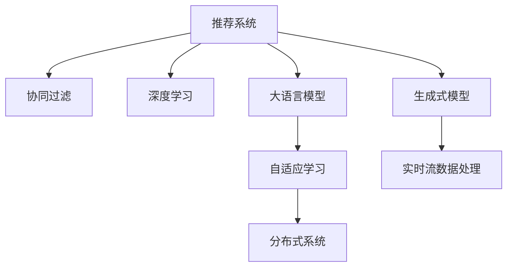

                 

# LLM在推荐系统的性能提升

> 关键词：推荐系统, 语言模型, 用户行为, 内容推荐, 协同过滤, 深度学习, 分布式系统, 推荐算法, 自适应学习

## 1. 背景介绍

### 1.1 问题由来

在数字时代，推荐系统已经深入人们的日常生活，通过智能推荐引擎为用户推送个性化的内容。然而，传统推荐系统大多依赖基于用户历史行为的协同过滤算法，难以应对数据稀疏性和实时性等挑战。近年来，深度学习在推荐系统中得到了广泛应用，利用深度神经网络模型对用户特征、商品属性等进行联合建模，显著提升了推荐系统的准确性和多样性。但随着数据量和模型复杂度的不断增长，推荐系统的计算和存储成本也迅速上升，如何高效地构建推荐模型，成为当前的研究热点。

### 1.2 问题核心关键点

语言模型作为当前深度学习领域的明星技术，已经在多个领域取得了突破性进展，特别是在自然语言处理(NLP)领域。相较于传统的深度神经网络模型，大语言模型(LLM)具有更加强大的表示能力，可以自动学习丰富的语言知识，并生成自然流畅的语言文本。本研究将重点关注如何利用大语言模型改进推荐系统的性能，特别在提升推荐系统对于个性化内容的生成能力和处理实时流数据的效率。

### 1.3 问题研究意义

大语言模型在推荐系统中的应用，不仅可以提升个性化推荐的准确性和多样性，还可以拓展推荐系统的数据范围，从结构化数据延伸到半结构化和非结构化数据，如文本、音频、视频等。此外，大语言模型在实时流数据处理方面的优势，使得其在推荐系统的动态化推荐中具有重要潜力。因此，将大语言模型应用到推荐系统，将推动推荐技术的创新发展，为构建智能、个性化、泛化的推荐系统提供新的技术路径。

## 2. 核心概念与联系

### 2.1 核心概念概述

为更好地理解大语言模型在推荐系统中的应用，本节将介绍几个核心概念：

- 推荐系统(Recommendation System, RS)：利用用户历史行为、商品属性、内容特征等数据，为用户推荐感兴趣的商品、内容、服务等。
- 协同过滤(Collaborative Filtering, CF)：利用用户之间的相似性或商品之间的关联性，进行推荐。
- 深度学习(Deep Learning, DL)：利用多层神经网络模型进行特征学习和模式识别。
- 大语言模型(Large Language Model, LLM)：以自回归或自编码模型为代表的大规模预训练语言模型，如GPT、BERT等。
- 生成式模型(Generative Model)：能够生成自然语言文本或图像等内容的模型，如LSTM、GAN等。
- 分布式系统(Distributed System)：利用多台计算机协同处理任务，提升计算效率和系统鲁棒性。
- 自适应学习(Adaptive Learning)：模型能够根据新数据不断更新知识，以适应数据分布的变化。

这些核心概念之间的逻辑关系可以通过以下Mermaid流程图来展示：



这个流程图展示了大语言模型在推荐系统中的应用场景和与其他技术的联系：

1. 推荐系统通过协同过滤、深度学习等技术，进行推荐预测。
2. 大语言模型可以通过预训练、微调等方法，提高模型的表示能力，从而提升推荐系统的性能。
3. 生成式模型能够基于大语言模型生成的文本内容进行推荐，提升推荐内容的多样性和创意性。
4. 分布式系统能够提升大语言模型和大数据处理的技术效率，处理大规模实时数据。
5. 自适应学习使得大语言模型能够适应数据分布的变化，保持推荐模型的时效性。
6. 实时流数据处理使得大语言模型能够及时响应用户需求，提升推荐系统的实时性。

## 3. 核心算法原理 & 具体操作步骤
### 3.1 算法原理概述

基于大语言模型的推荐系统，主要利用预训练语言模型对用户行为数据进行表示学习，然后通过微调、自适应学习等方法，不断提升模型对个性化推荐的需求的适应性。

其核心思想是：将用户行为数据看作自然语言文本，利用大语言模型对其进行语义表示，然后基于表示结果进行推荐。具体的步骤如下：

1. 收集用户历史行为数据，如浏览记录、点击记录等，转化为自然语言文本。
2. 利用预训练语言模型对文本进行语义表示学习。
3. 通过微调或自适应学习，优化表示结果，提升推荐效果。
4. 结合用户历史行为数据、商品属性信息等，生成个性化推荐结果。

### 3.2 算法步骤详解

基于大语言模型的推荐系统一般包括以下几个关键步骤：

**Step 1: 数据预处理**
- 收集用户行为数据，并转化为自然语言文本。
- 对文本进行分词、清洗等预处理操作，转化为模型可以处理的格式。
- 对文本进行分句、分段落处理，提升语义表示的准确性。

**Step 2: 预训练语言模型**
- 选择合适的预训练语言模型，如GPT、BERT等。
- 在预训练语料库上对模型进行训练，学习语言的通用表示。

**Step 3: 微调或自适应学习**
- 将用户行为数据转化为文本，输入预训练模型进行表示学习。
- 利用微调方法或自适应学习算法，不断调整模型参数，提升模型的个性化推荐能力。

**Step 4: 推荐生成**
- 对表示结果进行解码，生成推荐内容。
- 结合商品属性、用户历史行为等特征，进行综合推荐排序。

### 3.3 算法优缺点

基于大语言模型的推荐系统具有以下优点：

1. 表现能力强：利用大语言模型强大的语义表示能力，能够对用户行为数据进行精细化建模，提升推荐系统的准确性和多样性。
2. 通用性强：大语言模型在多种数据格式上表现良好，能够处理结构化、半结构化和非结构化数据。
3. 实时性强：大语言模型在处理实时流数据方面具有优势，能够及时响应用户需求，提升推荐系统的动态性。

同时，该方法也存在一些局限性：

1. 计算成本高：预训练语言模型需要大量计算资源和时间，微调过程也需要较大计算开销。
2. 数据依赖性强：微调效果依赖于标注数据的质量和数量，高质量标注数据的获取成本较高。
3. 模型复杂度高：大语言模型参数量较大，模型难以在小规模设备上部署。
4. 泛化能力差：由于模型结构复杂，容易过拟合，泛化能力较差。

尽管存在这些局限性，但就目前而言，基于大语言模型的推荐系统仍然是大规模推荐系统中最具潜力的技术之一。未来相关研究的重点在于如何进一步降低计算成本，提高模型的泛化能力，同时兼顾实时性和准确性。

### 3.4 算法应用领域

基于大语言模型的推荐系统已经在多个领域得到了应用，例如：

- 电子商务推荐：基于用户购物记录和商品属性，为用户推荐商品、产品等。
- 新闻推荐：基于用户阅读记录和新闻内容，为用户推荐新闻、文章等。
- 视频推荐：基于用户观看记录和视频内容，为用户推荐视频、电影等。
- 社交媒体推荐：基于用户互动记录和内容特征，为用户推荐文章、视频等。

除了这些常见领域外，大语言模型在更多场景中也有广泛应用前景，如智能客服推荐、金融产品推荐、健康医疗推荐等。通过合理利用大语言模型，可以进一步提升这些领域的推荐系统性能，为用户提供更精准、更个性化的推荐服务。

## 4. 数学模型和公式 & 详细讲解 & 举例说明
### 4.1 数学模型构建

在本节中，我们将使用数学语言对基于大语言模型的推荐系统进行更加严格的刻画。

记用户历史行为数据为 $D=\{(x_i,y_i)\}_{i=1}^N, x_i \in \mathcal{X}, y_i \in \mathcal{Y}$，其中 $x_i$ 为用户行为数据， $y_i$ 为推荐结果。假设大语言模型为 $M_{\theta}$，其中 $\theta$ 为模型参数。

定义模型 $M_{\theta}$ 在用户行为数据 $x$ 上的表示函数为 $\mathbf{f}(x)=M_{\theta}(x)$，其中 $\mathbf{f}(x) \in \mathcal{F}$ 为模型对输入的表示结果， $\mathcal{F}$ 为表示空间的维度。

推荐模型的目标是通过表示函数 $\mathbf{f}(x)$ 对用户行为数据 $D$ 进行建模，然后根据建模结果进行推荐。定义推荐模型在数据集 $D$ 上的经验风险为：

$$
\mathcal{L}(\theta) = \frac{1}{N}\sum_{i=1}^N \ell(\mathbf{f}(x_i),y_i)
$$

其中 $\ell$ 为损失函数，通常采用交叉熵损失、均方误差损失等。

### 4.2 公式推导过程

以二分类任务为例，假设推荐模型需要判断商品是否被用户购买，利用大语言模型表示用户行为数据 $x$，则二分类交叉熵损失函数定义为：

$$
\ell(\mathbf{f}(x),y) = -[y\log \mathbf{f}(x)+(1-y)\log (1-\mathbf{f}(x))]
$$

将损失函数对模型参数 $\theta$ 进行微分，得到梯度：

$$
\frac{\partial \mathcal{L}(\theta)}{\partial \theta} = -\frac{1}{N}\sum_{i=1}^N [y_i\frac{\partial \mathbf{f}(x_i)}{\partial \theta}+\frac{\partial (1-\mathbf{f}(x_i))}{\partial \theta}]
$$

其中 $\frac{\partial \mathbf{f}(x_i)}{\partial \theta}$ 为模型表示函数对参数 $\theta$ 的梯度，可通过反向传播算法高效计算。

### 4.3 案例分析与讲解

以电商平台推荐系统为例，用户浏览记录可以转化为自然语言文本 $x_i$，利用大语言模型进行表示学习，得到表示结果 $\mathbf{f}(x_i)$。假设 $\mathbf{f}(x_i)$ 为 $[0,1]$ 范围内的概率分布，表示商品被用户购买的可能性。真实标签 $y_i$ 为 $0$ 或 $1$，表示商品是否被购买。

在得到表示结果后，可以利用以下方式进行推荐：

1. 利用 $\mathbf{f}(x_i)$ 计算每个商品的推荐得分，得分越高，推荐给用户的可能性越大。
2. 结合商品属性、用户历史行为等特征，进行综合排序，生成推荐列表。

通过以上方法，可以构建基于大语言模型的电商平台推荐系统，实现个性化推荐，提升用户体验。

## 5. 项目实践：代码实例和详细解释说明
### 5.1 开发环境搭建

在进行推荐系统开发前，我们需要准备好开发环境。以下是使用Python进行PyTorch开发的环境配置流程：

1. 安装Anaconda：从官网下载并安装Anaconda，用于创建独立的Python环境。

2. 创建并激活虚拟环境：
```bash
conda create -n pytorch-env python=3.8 
conda activate pytorch-env
```

3. 安装PyTorch：根据CUDA版本，从官网获取对应的安装命令。例如：
```bash
conda install pytorch torchvision torchaudio cudatoolkit=11.1 -c pytorch -c conda-forge
```

4. 安装Transformers库：
```bash
pip install transformers
```

5. 安装各类工具包：
```bash
pip install numpy pandas scikit-learn matplotlib tqdm jupyter notebook ipython
```

完成上述步骤后，即可在`pytorch-env`环境中开始推荐系统开发。

### 5.2 源代码详细实现

下面我们以电商平台推荐系统为例，给出使用Transformers库对BERT模型进行推荐系统微调的PyTorch代码实现。

首先，定义推荐系统的数据处理函数：

```python
from transformers import BertTokenizer
from torch.utils.data import Dataset
import torch

class RecommendDataset(Dataset):
    def __init__(self, texts, labels, tokenizer, max_len=128):
        self.texts = texts
        self.labels = labels
        self.tokenizer = tokenizer
        self.max_len = max_len
        
    def __len__(self):
        return len(self.texts)
    
    def __getitem__(self, item):
        text = self.texts[item]
        label = self.labels[item]
        
        encoding = self.tokenizer(text, return_tensors='pt', max_length=self.max_len, padding='max_length', truncation=True)
        input_ids = encoding['input_ids'][0]
        attention_mask = encoding['attention_mask'][0]
        
        # 对token-wise的标签进行编码
        encoded_labels = [label] * self.max_len
        labels = torch.tensor(encoded_labels, dtype=torch.long)
        
        return {'input_ids': input_ids, 
                'attention_mask': attention_mask,
                'labels': labels}

# 标签与id的映射
label2id = {'0': 0, '1': 1}
id2label = {v: k for k, v in label2id.items()}

# 创建dataset
tokenizer = BertTokenizer.from_pretrained('bert-base-cased')

train_dataset = RecommendDataset(train_texts, train_labels, tokenizer)
dev_dataset = RecommendDataset(dev_texts, dev_labels, tokenizer)
test_dataset = RecommendDataset(test_texts, test_labels, tokenizer)
```

然后，定义模型和优化器：

```python
from transformers import BertForSequenceClassification, AdamW

model = BertForSequenceClassification.from_pretrained('bert-base-cased', num_labels=len(label2id))

optimizer = AdamW(model.parameters(), lr=2e-5)
```

接着，定义训练和评估函数：

```python
from torch.utils.data import DataLoader
from tqdm import tqdm
from sklearn.metrics import classification_report

device = torch.device('cuda') if torch.cuda.is_available() else torch.device('cpu')
model.to(device)

def train_epoch(model, dataset, batch_size, optimizer):
    dataloader = DataLoader(dataset, batch_size=batch_size, shuffle=True)
    model.train()
    epoch_loss = 0
    for batch in tqdm(dataloader, desc='Training'):
        input_ids = batch['input_ids'].to(device)
        attention_mask = batch['attention_mask'].to(device)
        labels = batch['labels'].to(device)
        model.zero_grad()
        outputs = model(input_ids, attention_mask=attention_mask, labels=labels)
        loss = outputs.loss
        epoch_loss += loss.item()
        loss.backward()
        optimizer.step()
    return epoch_loss / len(dataloader)

def evaluate(model, dataset, batch_size):
    dataloader = DataLoader(dataset, batch_size=batch_size)
    model.eval()
    preds, labels = [], []
    with torch.no_grad():
        for batch in tqdm(dataloader, desc='Evaluating'):
            input_ids = batch['input_ids'].to(device)
            attention_mask = batch['attention_mask'].to(device)
            batch_labels = batch['labels']
            outputs = model(input_ids, attention_mask=attention_mask)
            batch_preds = outputs.logits.argmax(dim=2).to('cpu').tolist()
            batch_labels = batch_labels.to('cpu').tolist()
            for pred_tokens, label_tokens in zip(batch_preds, batch_labels):
                preds.append(pred_tokens[:len(label_tokens)])
                labels.append(label_tokens)
                
    print(classification_report(labels, preds))
```

最后，启动训练流程并在测试集上评估：

```python
epochs = 5
batch_size = 16

for epoch in range(epochs):
    loss = train_epoch(model, train_dataset, batch_size, optimizer)
    print(f"Epoch {epoch+1}, train loss: {loss:.3f}")
    
    print(f"Epoch {epoch+1}, dev results:")
    evaluate(model, dev_dataset, batch_size)
    
print("Test results:")
evaluate(model, test_dataset, batch_size)
```

以上就是使用PyTorch对BERT进行电商平台推荐系统微调的完整代码实现。可以看到，得益于Transformers库的强大封装，我们可以用相对简洁的代码完成BERT模型的加载和微调。

### 5.3 代码解读与分析

让我们再详细解读一下关键代码的实现细节：

**RecommendDataset类**：
- `__init__`方法：初始化文本、标签、分词器等关键组件。
- `__len__`方法：返回数据集的样本数量。
- `__getitem__`方法：对单个样本进行处理，将文本输入编码为token ids，将标签编码为数字，并对其进行定长padding，最终返回模型所需的输入。

**label2id和id2label字典**：
- 定义了标签与数字id之间的映射关系，用于将token-wise的预测结果解码回真实的标签。

**训练和评估函数**：
- 使用PyTorch的DataLoader对数据集进行批次化加载，供模型训练和推理使用。
- 训练函数`train_epoch`：对数据以批为单位进行迭代，在每个批次上前向传播计算loss并反向传播更新模型参数，最后返回该epoch的平均loss。
- 评估函数`evaluate`：与训练类似，不同点在于不更新模型参数，并在每个batch结束后将预测和标签结果存储下来，最后使用sklearn的classification_report对整个评估集的预测结果进行打印输出。

**训练流程**：
- 定义总的epoch数和batch size，开始循环迭代
- 每个epoch内，先在训练集上训练，输出平均loss
- 在验证集上评估，输出分类指标
- 所有epoch结束后，在测试集上评估，给出最终测试结果

可以看到，PyTorch配合Transformers库使得BERT微调的代码实现变得简洁高效。开发者可以将更多精力放在数据处理、模型改进等高层逻辑上，而不必过多关注底层的实现细节。

当然，工业级的系统实现还需考虑更多因素，如模型的保存和部署、超参数的自动搜索、更灵活的任务适配层等。但核心的微调范式基本与此类似。

## 6. 实际应用场景
### 6.1 智能客服系统

基于大语言模型的推荐技术，可以广泛应用于智能客服系统的构建。传统客服往往需要配备大量人力，高峰期响应缓慢，且一致性和专业性难以保证。而使用推荐系统对客户问题进行智能推荐，可以大幅提升客服效率和质量。

在技术实现上，可以收集企业内部的历史客服对话记录，将常见问题和最佳答复构建成监督数据，在此基础上对预训练推荐模型进行微调。微调后的推荐模型能够自动推荐最佳答复，提升客服系统的人性化和智能性。对于客户提出的新问题，还可以接入检索系统实时搜索相关内容，动态生成推荐答复。如此构建的智能客服系统，能显著提升客户咨询体验和问题解决效率。

### 6.2 金融产品推荐

金融产品的推荐系统对金融机构的风险控制和客户服务至关重要。传统的基于用户历史行为的推荐方法难以处理复杂多变的金融市场。利用大语言模型对金融市场数据进行建模，能够揭示市场变化趋势和规律，提升推荐系统的时效性和准确性。

具体而言，可以收集金融市场的历史数据和实时数据，将其转化为自然语言文本，利用大语言模型进行表示学习。然后，通过微调或自适应学习，不断优化模型，提升推荐效果。将微调后的模型应用到实时获取的市场数据上，能够自动预测市场趋势，推荐合适的金融产品，帮助客户实现资产增值。

### 6.3 健康医疗推荐

健康医疗推荐系统能够根据患者的病情和历史记录，推荐合适的治疗方案和药品，提升医疗服务水平。传统的推荐系统大多依赖医生的经验和历史数据，难以全面覆盖所有病症和药物。利用大语言模型对医疗数据进行建模，能够自动化地识别疾病和药物之间的关联关系，提升推荐系统的智能化水平。

具体而言，可以收集患者的医疗记录、诊断报告等文本数据，利用大语言模型进行表示学习。然后，通过微调或自适应学习，不断优化模型，提升推荐效果。将微调后的模型应用到实时获取的患者数据上，能够自动推荐合适的治疗方案和药品，提升诊疗效果。

### 6.4 未来应用展望

随着大语言模型和推荐系统的不断发展，基于大语言模型的推荐技术将呈现以下几个发展趋势：

1. 多模态融合：推荐系统不仅仅处理文本数据，还可以处理图像、音频、视频等多模态数据，拓展推荐系统的数据范围。
2. 实时性提升：利用分布式系统和自适应学习，提升推荐系统的实时性，实现动态化推荐。
3. 个性化强化：利用自适应学习和大语言模型，提升推荐系统的个性化推荐能力，满足用户多样化的需求。
4. 动态化调整：利用大语言模型和实时流数据处理，提升推荐系统的动态调整能力，适应数据分布的变化。
5. 知识整合：将外部知识库、规则库等专家知识与推荐系统结合，提升推荐系统的准确性和可信度。

以上趋势凸显了大语言模型在推荐系统中的应用潜力。这些方向的探索发展，必将进一步提升推荐系统的性能和应用范围，为构建智能、个性化、泛化的推荐系统提供新的技术路径。

## 7. 工具和资源推荐
### 7.1 学习资源推荐

为了帮助开发者系统掌握大语言模型在推荐系统中的应用，这里推荐一些优质的学习资源：

1. 《Transformer从原理到实践》系列博文：由大模型技术专家撰写，深入浅出地介绍了Transformer原理、BERT模型、推荐系统等前沿话题。

2. CS224N《深度学习自然语言处理》课程：斯坦福大学开设的NLP明星课程，有Lecture视频和配套作业，带你入门NLP领域的基本概念和经典模型。

3. 《Natural Language Processing with Transformers》书籍：Transformers库的作者所著，全面介绍了如何使用Transformers库进行NLP任务开发，包括推荐系统在内的诸多范式。

4. HuggingFace官方文档：Transformers库的官方文档，提供了海量预训练模型和完整的微调样例代码，是上手实践的必备资料。

5. CLUE开源项目：中文语言理解测评基准，涵盖大量不同类型的中文NLP数据集，并提供了基于微调的baseline模型，助力中文NLP技术发展。

通过对这些资源的学习实践，相信你一定能够快速掌握大语言模型在推荐系统中的应用，并用于解决实际的NLP问题。
###  7.2 开发工具推荐

高效的开发离不开优秀的工具支持。以下是几款用于大语言模型推荐系统开发的常用工具：

1. PyTorch：基于Python的开源深度学习框架，灵活动态的计算图，适合快速迭代研究。大部分预训练语言模型都有PyTorch版本的实现。

2. TensorFlow：由Google主导开发的开源深度学习框架，生产部署方便，适合大规模工程应用。同样有丰富的预训练语言模型资源。

3. Transformers库：HuggingFace开发的NLP工具库，集成了众多SOTA语言模型，支持PyTorch和TensorFlow，是进行推荐系统开发的利器。

4. Weights & Biases：模型训练的实验跟踪工具，可以记录和可视化模型训练过程中的各项指标，方便对比和调优。与主流深度学习框架无缝集成。

5. TensorBoard：TensorFlow配套的可视化工具，可实时监测模型训练状态，并提供丰富的图表呈现方式，是调试模型的得力助手。

6. Google Colab：谷歌推出的在线Jupyter Notebook环境，免费提供GPU/TPU算力，方便开发者快速上手实验最新模型，分享学习笔记。

合理利用这些工具，可以显著提升大语言模型推荐系统的开发效率，加快创新迭代的步伐。

### 7.3 相关论文推荐

大语言模型和推荐系统的研究源于学界的持续研究。以下是几篇奠基性的相关论文，推荐阅读：

1. Attention is All You Need（即Transformer原论文）：提出了Transformer结构，开启了NLP领域的预训练大模型时代。

2. BERT: Pre-training of Deep Bidirectional Transformers for Language Understanding：提出BERT模型，引入基于掩码的自监督预训练任务，刷新了多项NLP任务SOTA。

3. Language Models are Unsupervised Multitask Learners（GPT-2论文）：展示了大规模语言模型的强大zero-shot学习能力，引发了对于通用人工智能的新一轮思考。

4. Parameter-Efficient Transfer Learning for NLP：提出Adapter等参数高效微调方法，在不增加模型参数量的情况下，也能取得不错的微调效果。

5. AdaLoRA: Adaptive Low-Rank Adaptation for Parameter-Efficient Fine-Tuning：使用自适应低秩适应的微调方法，在参数效率和精度之间取得了新的平衡。

这些论文代表了大语言模型和推荐系统的发展脉络。通过学习这些前沿成果，可以帮助研究者把握学科前进方向，激发更多的创新灵感。

## 8. 总结：未来发展趋势与挑战
### 8.1 研究成果总结

本文对基于大语言模型的推荐系统进行了全面系统的介绍。首先阐述了推荐系统的背景和意义，明确了大语言模型在推荐系统中的重要地位。其次，从原理到实践，详细讲解了大语言模型在推荐系统中的应用，包括数据预处理、模型训练、推荐生成等关键步骤。同时，本文还广泛探讨了推荐系统在大语言模型中的典型应用场景，展示了其广泛的应用前景。

通过本文的系统梳理，可以看到，基于大语言模型的推荐系统能够显著提升推荐系统的个性化、实时性和多样性，为推荐系统的发展提供了新的技术路径。

### 8.2 未来发展趋势

展望未来，大语言模型在推荐系统中的应用将呈现以下几个发展趋势：

1. 数据处理的多样化：推荐系统将处理更多类型的非结构化数据，如音频、视频等，拓展推荐系统的数据范围。
2. 模型的实时化：利用分布式系统和自适应学习，提升推荐系统的实时性，实现动态化推荐。
3. 系统的动态化：推荐系统将不断适应数据分布的变化，提升推荐系统的动态调整能力。
4. 知识整合的深入化：将专家知识与推荐系统结合，提升推荐系统的准确性和可信度。

以上趋势凸显了大语言模型在推荐系统中的应用潜力。这些方向的探索发展，必将进一步提升推荐系统的性能和应用范围，为构建智能、个性化、泛化的推荐系统提供新的技术路径。

### 8.3 面临的挑战

尽管大语言模型在推荐系统中的应用取得了显著进展，但在迈向更加智能化、普适化应用的过程中，它仍面临诸多挑战：

1. 数据获取成本高：高质量标注数据的获取成本较高，难以满足推荐系统大规模数据需求。
2. 模型复杂度高：大语言模型参数量较大，难以在小规模设备上部署。
3. 过拟合问题严重：微调过程中容易出现过拟合现象，影响模型的泛化能力。
4. 系统鲁棒性差：推荐系统面对异常数据和噪声数据时，泛化能力较差。
5. 计算资源需求大：大语言模型和推荐系统需要大量计算资源和时间，难以在低成本环境下运行。

尽管存在这些挑战，但通过不断的技术创新和优化，大语言模型在推荐系统中的应用必将取得更大的突破。相信在学界和产业界的共同努力下，这些挑战终将一一被克服，大语言模型推荐系统必将在构建智能、个性化、泛化的推荐系统中发挥重要作用。

### 8.4 研究展望

面对大语言模型推荐系统所面临的挑战，未来的研究需要在以下几个方面寻求新的突破：

1. 无监督和半监督学习：探索无监督和半监督学习范式，降低推荐系统对标注数据的依赖，提升推荐系统的泛化能力。
2. 参数高效微调：开发更加参数高效的微调方法，在固定大部分预训练参数的同时，只更新少量任务相关参数。
3. 实时流数据处理：利用分布式系统和自适应学习，提升推荐系统的实时性，实现动态化推荐。
4. 模型压缩和优化：研究模型压缩和优化方法，提升推荐系统的计算效率和资源利用率。
5. 知识整合和外部知识：将外部知识库、规则库等专家知识与推荐系统结合，提升推荐系统的准确性和可信度。

这些研究方向的探索，必将引领大语言模型推荐系统技术迈向更高的台阶，为构建智能、个性化、泛化的推荐系统提供新的技术路径。

## 9. 附录：常见问题与解答

**Q1：大语言模型在推荐系统中的应用是否适用于所有推荐场景？**

A: 大语言模型在推荐系统中的应用可以广泛适用于各种推荐场景，如电商平台、新闻推荐、视频推荐、智能客服等。但需要注意的是，大语言模型在处理实时流数据时，需要具备较强的分布式处理能力，才能确保推荐系统的实时性和稳定性。

**Q2：大语言模型在推荐系统中是否会出现过拟合问题？**

A: 大语言模型在推荐系统中容易出现过拟合问题，特别是在数据量较小的情况下。为缓解这一问题，可以采用以下方法：

1. 数据增强：通过回译、近义替换等方式扩充训练集。
2. 正则化：使用L2正则、Dropout等技术，防止模型过度拟合。
3. 模型裁剪：去除不必要的层和参数，减小模型尺寸，加快推理速度。
4. 多模型集成：训练多个模型，取平均输出，抑制过拟合。

**Q3：大语言模型在推荐系统中是否适合小规模设备部署？**

A: 大语言模型参数量较大，通常需要高性能设备才能有效运行。但通过模型压缩和优化，可以在小规模设备上部署大语言模型推荐系统。具体而言，可以采用模型剪枝、量化等技术，减小模型尺寸和计算量，提升模型的计算效率。

**Q4：大语言模型在推荐系统中如何处理多模态数据？**

A: 多模态数据处理是大语言模型在推荐系统中的一个重要方向。具体而言，可以采用以下方法：

1. 特征融合：将不同模态的数据特征进行融合，提升推荐系统的综合表现。
2. 模型组合：将不同模态的推荐模型进行组合，实现多模态数据的协同建模。
3. 多模态预训练：在大语言模型上进行多模态预训练，提升模型对多模态数据的理解能力。

**Q5：大语言模型在推荐系统中如何提升推荐系统的个性化能力？**

A: 大语言模型在推荐系统中可以提升推荐系统的个性化能力，具体方法包括：

1. 用户行为建模：利用大语言模型对用户行为数据进行表示学习，提升推荐系统的个性化推荐能力。
2. 自适应学习：利用自适应学习算法，不断优化模型，提升推荐系统的动态调整能力。
3. 上下文信息整合：将上下文信息与推荐模型结合，提升推荐系统的综合表现。

通过这些方法，可以构建更加个性化、智能化的推荐系统，满足用户多样化的需求。

---

作者：禅与计算机程序设计艺术 / Zen and the Art of Computer Programming

