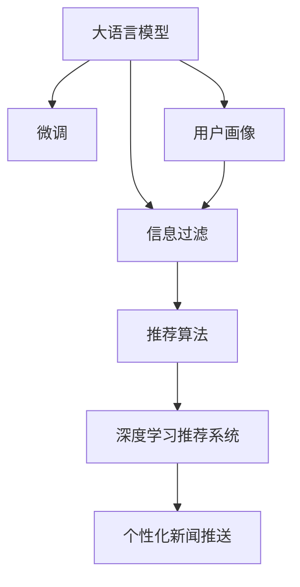

                 

# LLM在智能个性化新闻推送中的应用前景

> 关键词：大语言模型,新闻推送,个性化推荐,信息过滤,用户画像,自然语言处理(NLP),用户行为分析,深度学习,推荐系统

## 1. 背景介绍

### 1.1 问题由来

在信息爆炸的时代，新闻推送已成为许多人获取信息的惯用方式。传统新闻推送系统依赖编辑的人工编排，难以满足用户的个性化需求。与此同时，信息质量参差不齐，用户往往在信息洪流中难以找到真正有价值的内容。

大语言模型（Large Language Model, LLM）的崛起，为个性化新闻推送提供了新的可能。通过海量文本数据预训练，大语言模型能捕捉到丰富的语言特征和语义信息，而微调（Fine-tuning）则能将这些通用的语言能力适应到特定的新闻推送场景中，提供更符合用户兴趣的个性化内容。

### 1.2 问题核心关键点

大语言模型在新闻推送中的应用，核心在于将用户行为数据和自然语言理解能力结合，构建一个高效、智能的推荐系统。关键点包括：
- 构建和更新用户画像：通过记录用户的阅读历史、点赞行为、评论内容等，形成用户兴趣特征，指导新闻内容的推送。
- 设计合理的推送指标：综合考虑新闻内容的多样性、相关性、新鲜性等，构建精准的推荐模型。
- 优化推荐算法：基于模型构建和用户画像，设计个性化推送算法，提升用户体验。
- 确保系统安全和公平：考虑到数据隐私和公平性问题，对用户数据进行脱敏处理，避免偏见。

## 2. 核心概念与联系

### 2.1 核心概念概述

为更好地理解大语言模型在新闻推送中的应用，本节将介绍几个密切相关的核心概念：

- 大语言模型：以Transformer架构为代表的大规模预训练语言模型，如GPT-3、BERT等。通过在海量文本数据上进行预训练，学习到通用的语言表示。
- 微调：指在预训练模型的基础上，使用下游任务的少量标注数据，通过有监督学习优化模型在特定任务上的性能。
- 用户画像：通过记录用户的在线行为，构建用户兴趣和行为特征，用于指导个性化推荐。
- 信息过滤：在大量新闻内容中筛选出与用户兴趣相关的文章，提高新闻推送的精准度和用户满意度。
- 自然语言处理（NLP）：处理和分析人类语言的技术，包括文本分类、情感分析、命名实体识别等。
- 深度学习推荐系统：利用深度学习模型进行新闻推荐，主要采用基于内容的推荐、协同过滤推荐、混合推荐等方法。

这些核心概念之间的逻辑关系可以通过以下Mermaid流程图来展示：



这个流程图展示了大语言模型在新闻推送中的核心概念及其之间的关系：

1. 大语言模型通过预训练获得基础能力。
2. 微调使得模型更好地适应新闻推送场景，提升推荐精度。
3. 用户画像帮助构建个性化的推荐策略。
4. 信息过滤保证推送内容的相关性和新鲜度。
5. 推荐算法基于模型和用户画像，设计推荐逻辑。
6. 个性化新闻推送最终实现用户满意度的提升。

## 3. 核心算法原理 & 具体操作步骤
### 3.1 算法原理概述

大语言模型在新闻推送中的应用，主要通过以下步骤实现：

1. 构建用户画像：利用用户历史阅读数据、点赞行为、评论内容等，构建用户兴趣和行为特征。
2. 设计推送指标：考虑新闻内容的多样性、相关性、新鲜性等因素，设计合理的推荐指标。
3. 进行微调：基于用户画像和推送指标，对大语言模型进行微调，使其能够预测新闻与用户的匹配度。
4. 信息过滤：利用微调后的模型，对新闻库中的内容进行筛选，推荐与用户兴趣相关的新闻。
5. 优化推荐算法：结合用户画像和模型预测结果，设计高效的推荐算法，提高推荐精准度。
6. 持续优化：定期更新用户画像和模型，确保推送内容持续更新，符合用户最新兴趣。

### 3.2 算法步骤详解

**Step 1: 构建用户画像**

用户画像的构建通常包括以下步骤：

1. 数据收集：从新闻平台、社交媒体等渠道，收集用户的阅读记录、点赞行为、评论内容等数据。
2. 数据预处理：对原始数据进行清洗、去重、标准化等预处理操作，确保数据质量。
3. 特征提取：利用自然语言处理技术，如TF-IDF、词向量等，提取新闻内容和用户行为特征。
4. 用户画像构建：通过聚类算法、主题模型等，对用户特征进行建模，构建用户画像。

**Step 2: 设计推送指标**

新闻推送的指标设计需要考虑以下几个方面：

1. 相关性：新闻内容与用户兴趣的契合度。
2. 多样性：新闻内容的多样性和新颖性。
3. 新鲜度：新闻的时效性。
4. 互动性：用户对新闻的互动反馈，如点赞、评论等。
5. 用户满意度：用户对新闻推送的满意度评分。

**Step 3: 进行微调**

微调过程大致包括以下步骤：

1. 数据准备：选择与新闻推送任务相关的数据集，如新闻标题、摘要、分类标签等。
2. 模型选择：选择合适的预训练语言模型，如BERT、GPT-3等。
3. 任务适配：添加任务适配层，如线性分类器、回归器等。
4. 超参数设置：选择适当的学习率、批大小、迭代轮数等超参数。
5. 训练与验证：在训练集上进行模型训练，在验证集上进行参数调整，直到达到满意效果。

**Step 4: 信息过滤**

信息过滤过程大致包括以下步骤：

1. 新闻内容获取：从新闻库中获取待推送的新闻内容。
2. 用户画像匹配：将用户画像特征与新闻内容特征进行匹配，计算匹配度。
3. 新闻排序：基于匹配度和推送指标，对新闻进行排序，选择最符合用户兴趣的几条新闻。

**Step 5: 优化推荐算法**

推荐算法优化过程大致包括以下步骤：

1. 算法选择：选择合适的推荐算法，如基于内容的推荐、协同过滤推荐、混合推荐等。
2. 参数调整：调整推荐算法的超参数，如召回率、精度等。
3. 模型集成：结合不同推荐算法的输出，进行集成优化。
4. 性能评估：对推荐算法进行性能评估，优化推荐效果。

**Step 6: 持续优化**

持续优化过程大致包括以下步骤：

1. 数据更新：定期更新用户画像数据，反映用户最新的兴趣。
2. 模型更新：定期更新微调后的模型，提升新闻推荐的精准度。
3. 反馈调整：收集用户对新闻推送的反馈，调整推荐策略。

### 3.3 算法优缺点

大语言模型在新闻推送中的应用，具有以下优点：

1. 高精度推荐：通过微调，大语言模型能够精准预测新闻与用户的匹配度，提升推荐效果。
2. 自动更新：随着用户兴趣的变化，定期更新用户画像和微调模型，保持推荐内容的时效性。
3. 高效处理：利用大模型的并行计算能力，高效处理大量新闻数据和用户画像数据。

同时，也存在一些缺点：

1. 数据隐私问题：用户行为数据的收集和存储可能涉及隐私保护问题。
2. 模型复杂度：大语言模型的训练和微调需要大量的计算资源和标注数据。
3. 信息过载：推荐算法可能无法完全过滤掉与用户兴趣不相关的信息，造成信息过载。
4. 公平性问题：由于用户画像的构建依赖于用户历史行为数据，可能存在数据偏见和公平性问题。

## 4. 数学模型和公式 & 详细讲解  
### 4.1 数学模型构建

本节将使用数学语言对大语言模型在新闻推送中的应用进行更加严格的刻画。

记用户画像为 $\mathbf{u} \in \mathbb{R}^d$，新闻内容为 $\mathbf{x} \in \mathbb{R}^d$，用户画像与新闻内容的匹配度为 $s(\mathbf{u},\mathbf{x})$，则推荐模型的输出为：

$$
y(\mathbf{u},\mathbf{x}) = \sigma(s(\mathbf{u},\mathbf{x}))
$$

其中，$\sigma(\cdot)$ 为激活函数，如sigmoid函数。

在实际应用中，还需要考虑其他因素，如新闻的多样性、新鲜度、互动性等，构建综合指标函数 $\mathcal{L}$：

$$
\mathcal{L} = \alpha_1 y(\mathbf{u},\mathbf{x}) + \alpha_2 d(\mathbf{x}) + \alpha_3 f(\mathbf{x})
$$

其中，$y(\mathbf{u},\mathbf{x})$ 为新闻内容与用户兴趣的匹配度，$d(\mathbf{x})$ 为新闻的多样性，$f(\mathbf{x})$ 为新闻的新鲜度，$\alpha_1,\alpha_2,\alpha_3$ 为各项指标的权重。

### 4.2 公式推导过程

以下我们以基于内容的推荐为例，推导推荐模型的损失函数及其梯度的计算公式。

假设用户画像为 $\mathbf{u}$，新闻内容为 $\mathbf{x}$，新闻的特征表示为 $\mathbf{h}$，用户画像的特征表示为 $\mathbf{g}$，则推荐模型的输出为：

$$
y(\mathbf{u},\mathbf{x}) = \sigma(\mathbf{u}^\top\mathbf{h})
$$

其中，$\mathbf{h}$ 为新闻内容的隐向量表示，$\mathbf{g}$ 为用户画像的隐向量表示。

推荐模型的损失函数为：

$$
\mathcal{L}(\theta) = -\frac{1}{N}\sum_{i=1}^N [y_i \log y_i + (1-y_i)\log(1-y_i)]
$$

其中，$y_i$ 为第 $i$ 个新闻内容与用户兴趣的匹配度。

根据链式法则，损失函数对 $\theta$ 的梯度为：

$$
\nabla_{\theta}\mathcal{L}(\theta) = -\frac{1}{N}\sum_{i=1}^N (\frac{y_i}{y_i} - \frac{1-y_i}{1-y_i}) \nabla_{\theta}s(\mathbf{u},\mathbf{x})
$$

其中，$\nabla_{\theta}s(\mathbf{u},\mathbf{x})$ 为匹配度函数 $s(\mathbf{u},\mathbf{x})$ 对模型参数 $\theta$ 的梯度。

在得到损失函数的梯度后，即可带入优化算法，完成模型的迭代优化。重复上述过程直至收敛，最终得到适应新闻推送任务的最优模型参数 $\theta^*$。

## 5. 项目实践：代码实例和详细解释说明
### 5.1 开发环境搭建

在进行微调实践前，我们需要准备好开发环境。以下是使用Python进行PyTorch开发的环境配置流程：

1. 安装Anaconda：从官网下载并安装Anaconda，用于创建独立的Python环境。

2. 创建并激活虚拟环境：
```bash
conda create -n pytorch-env python=3.8 
conda activate pytorch-env
```

3. 安装PyTorch：根据CUDA版本，从官网获取对应的安装命令。例如：
```bash
conda install pytorch torchvision torchaudio cudatoolkit=11.1 -c pytorch -c conda-forge
```

4. 安装Transformers库：
```bash
pip install transformers
```

5. 安装各类工具包：
```bash
pip install numpy pandas scikit-learn matplotlib tqdm jupyter notebook ipython
```

完成上述步骤后，即可在`pytorch-env`环境中开始微调实践。

### 5.2 源代码详细实现

这里我们以BERT模型为例，给出一个使用Transformers库对BERT模型进行微调的PyTorch代码实现。

首先，定义新闻推送任务的数据处理函数：

```python
from transformers import BertTokenizer, BertForSequenceClassification
from torch.utils.data import Dataset
import torch

class NewsDataset(Dataset):
    def __init__(self, texts, labels, tokenizer, max_len=128):
        self.texts = texts
        self.labels = labels
        self.tokenizer = tokenizer
        self.max_len = max_len
        
    def __len__(self):
        return len(self.texts)
    
    def __getitem__(self, item):
        text = self.texts[item]
        label = self.labels[item]
        
        encoding = self.tokenizer(text, return_tensors='pt', max_length=self.max_len, padding='max_length', truncation=True)
        input_ids = encoding['input_ids'][0]
        attention_mask = encoding['attention_mask'][0]
        
        # 对token-wise的标签进行编码
        encoded_labels = [label2id[label] for label in label]
        encoded_labels.extend([label2id['O']] * (self.max_len - len(encoded_labels)))
        labels = torch.tensor(encoded_labels, dtype=torch.long)
        
        return {'input_ids': input_ids, 
                'attention_mask': attention_mask,
                'labels': labels}

# 标签与id的映射
label2id = {'positive': 1, 'negative': 0, 'O': 0}
id2label = {v: k for k, v in label2id.items()}

# 创建dataset
tokenizer = BertTokenizer.from_pretrained('bert-base-uncased')

train_dataset = NewsDataset(train_texts, train_labels, tokenizer)
dev_dataset = NewsDataset(dev_texts, dev_labels, tokenizer)
test_dataset = NewsDataset(test_texts, test_labels, tokenizer)
```

然后，定义模型和优化器：

```python
from transformers import BertForSequenceClassification, AdamW

model = BertForSequenceClassification.from_pretrained('bert-base-uncased', num_labels=len(label2id))

optimizer = AdamW(model.parameters(), lr=2e-5)
```

接着，定义训练和评估函数：

```python
from torch.utils.data import DataLoader
from tqdm import tqdm
from sklearn.metrics import classification_report

device = torch.device('cuda') if torch.cuda.is_available() else torch.device('cpu')
model.to(device)

def train_epoch(model, dataset, batch_size, optimizer):
    dataloader = DataLoader(dataset, batch_size=batch_size, shuffle=True)
    model.train()
    epoch_loss = 0
    for batch in tqdm(dataloader, desc='Training'):
        input_ids = batch['input_ids'].to(device)
        attention_mask = batch['attention_mask'].to(device)
        labels = batch['labels'].to(device)
        model.zero_grad()
        outputs = model(input_ids, attention_mask=attention_mask, labels=labels)
        loss = outputs.loss
        epoch_loss += loss.item()
        loss.backward()
        optimizer.step()
    return epoch_loss / len(dataloader)

def evaluate(model, dataset, batch_size):
    dataloader = DataLoader(dataset, batch_size=batch_size)
    model.eval()
    preds, labels = [], []
    with torch.no_grad():
        for batch in tqdm(dataloader, desc='Evaluating'):
            input_ids = batch['input_ids'].to(device)
            attention_mask = batch['attention_mask'].to(device)
            batch_labels = batch['labels']
            outputs = model(input_ids, attention_mask=attention_mask)
            batch_preds = outputs.logits.argmax(dim=2).to('cpu').tolist()
            batch_labels = batch_labels.to('cpu').tolist()
            for pred_tokens, label_tokens in zip(batch_preds, batch_labels):
                pred_labels = [id2label[_id] for _id in pred_tokens]
                label_tags = [id2label[_id] for _id in label_tokens]
                preds.append(pred_labels[:len(label_tags)])
                labels.append(label_tags)
                
    print(classification_report(labels, preds))
```

最后，启动训练流程并在测试集上评估：

```python
epochs = 5
batch_size = 16

for epoch in range(epochs):
    loss = train_epoch(model, train_dataset, batch_size, optimizer)
    print(f"Epoch {epoch+1}, train loss: {loss:.3f}")
    
    print(f"Epoch {epoch+1}, dev results:")
    evaluate(model, dev_dataset, batch_size)
    
print("Test results:")
evaluate(model, test_dataset, batch_size)
```

以上就是使用PyTorch对BERT模型进行新闻推送任务微调的完整代码实现。可以看到，得益于Transformers库的强大封装，我们可以用相对简洁的代码完成BERT模型的加载和微调。

### 5.3 代码解读与分析

让我们再详细解读一下关键代码的实现细节：

**NewsDataset类**：
- `__init__`方法：初始化文本、标签、分词器等关键组件。
- `__len__`方法：返回数据集的样本数量。
- `__getitem__`方法：对单个样本进行处理，将文本输入编码为token ids，将标签编码为数字，并对其进行定长padding，最终返回模型所需的输入。

**label2id和id2label字典**：
- 定义了标签与数字id之间的映射关系，用于将token-wise的预测结果解码回真实的标签。

**训练和评估函数**：
- 使用PyTorch的DataLoader对数据集进行批次化加载，供模型训练和推理使用。
- 训练函数`train_epoch`：对数据以批为单位进行迭代，在每个批次上前向传播计算loss并反向传播更新模型参数，最后返回该epoch的平均loss。
- 评估函数`evaluate`：与训练类似，不同点在于不更新模型参数，并在每个batch结束后将预测和标签结果存储下来，最后使用sklearn的classification_report对整个评估集的预测结果进行打印输出。

**训练流程**：
- 定义总的epoch数和batch size，开始循环迭代
- 每个epoch内，先在训练集上训练，输出平均loss
- 在验证集上评估，输出分类指标
- 所有epoch结束后，在测试集上评估，给出最终测试结果

可以看到，PyTorch配合Transformers库使得BERT微调的新闻推送任务代码实现变得简洁高效。开发者可以将更多精力放在数据处理、模型改进等高层逻辑上，而不必过多关注底层的实现细节。

当然，工业级的系统实现还需考虑更多因素，如模型的保存和部署、超参数的自动搜索、更灵活的任务适配层等。但核心的微调范式基本与此类似。

## 6. 实际应用场景
### 6.1 智能推荐系统

大语言模型在新闻推送中的应用，可以广泛应用于智能推荐系统，如今日头条、腾讯新闻等。传统推荐系统往往依赖于编辑的人工编排，难以满足用户的个性化需求。而使用微调后的新闻推荐模型，可以7x24小时不间断服务，快速推荐符合用户兴趣的新闻，提高用户满意度。

在技术实现上，可以收集用户的历史阅读记录、点赞行为、评论内容等，将新闻和用户兴趣进行匹配，推荐最符合用户口味的新闻。对于用户提出的新问题，还可以接入检索系统实时搜索相关内容，动态生成推荐列表。如此构建的智能推荐系统，能大幅提升用户阅读体验，实现精准的新闻推送。

### 6.2 内容聚合平台

新闻推送平台如网易新闻、新浪新闻等，也可以利用大语言模型进行内容聚合和推荐。通过收集用户阅读记录和点赞数据，构建用户画像，对海量新闻进行筛选和推荐，提升内容聚合的精准度和用户粘性。

具体而言，可以构建用户画像，利用新闻的标题、摘要、分类标签等特征，对新闻进行特征提取和表示，结合用户画像进行匹配度计算。利用微调后的模型，对新闻库中的内容进行排序，选择最符合用户兴趣的几条新闻进行展示。

### 6.3 个性化专题报道

在新闻媒体的专题报道中，利用大语言模型进行个性化推荐，也是一种高效的方法。例如，针对某项重大新闻事件，可以构建专题报道，根据用户画像，推荐相关的新闻报道、专家解读、背景资料等，提升用户对事件的了解和关注。

具体而言，可以构建专题报道的关键词、主题等特征，与用户画像进行匹配，利用微调后的模型，对专题报道进行筛选和推荐。通过个性化的专题报道，满足用户对重大事件的多样化需求，提升用户参与度和新闻媒体的传播效果。

### 6.4 未来应用展望

随着大语言模型和微调方法的不断发展，基于微调范式将在更多领域得到应用，为传统行业带来变革性影响。

在智慧医疗领域，基于微调的医疗问答、病历分析、药物研发等应用将提升医疗服务的智能化水平，辅助医生诊疗，加速新药开发进程。

在智能教育领域，微调技术可应用于作业批改、学情分析、知识推荐等方面，因材施教，促进教育公平，提高教学质量。

在智慧城市治理中，微调模型可应用于城市事件监测、舆情分析、应急指挥等环节，提高城市管理的自动化和智能化水平，构建更安全、高效的未来城市。

此外，在企业生产、社会治理、文娱传媒等众多领域，基于大模型微调的人工智能应用也将不断涌现，为经济社会发展注入新的动力。相信随着技术的日益成熟，微调方法将成为人工智能落地应用的重要范式，推动人工智能技术在垂直行业的规模化落地。总之，微调需要开发者根据具体任务，不断迭代和优化模型、数据和算法，方能得到理想的效果。

## 7. 工具和资源推荐
### 7.1 学习资源推荐

为了帮助开发者系统掌握大语言模型微调的理论基础和实践技巧，这里推荐一些优质的学习资源：

1. 《Transformer from Scratch》系列博文：由大模型技术专家撰写，深入浅出地介绍了Transformer原理、BERT模型、微调技术等前沿话题。

2. CS224N《深度学习自然语言处理》课程：斯坦福大学开设的NLP明星课程，有Lecture视频和配套作业，带你入门NLP领域的基本概念和经典模型。

3. 《Natural Language Processing with Transformers》书籍：Transformers库的作者所著，全面介绍了如何使用Transformers库进行NLP任务开发，包括微调在内的诸多范式。

4. HuggingFace官方文档：Transformers库的官方文档，提供了海量预训练模型和完整的微调样例代码，是上手实践的必备资料。

5. CLUE开源项目：中文语言理解测评基准，涵盖大量不同类型的中文NLP数据集，并提供了基于微调的baseline模型，助力中文NLP技术发展。

通过对这些资源的学习实践，相信你一定能够快速掌握大语言模型微调的精髓，并用于解决实际的NLP问题。
###  7.2 开发工具推荐

高效的开发离不开优秀的工具支持。以下是几款用于大语言模型微调开发的常用工具：

1. PyTorch：基于Python的开源深度学习框架，灵活动态的计算图，适合快速迭代研究。大部分预训练语言模型都有PyTorch版本的实现。

2. TensorFlow：由Google主导开发的开源深度学习框架，生产部署方便，适合大规模工程应用。同样有丰富的预训练语言模型资源。

3. Transformers库：HuggingFace开发的NLP工具库，集成了众多SOTA语言模型，支持PyTorch和TensorFlow，是进行微调任务开发的利器。

4. Weights & Biases：模型训练的实验跟踪工具，可以记录和可视化模型训练过程中的各项指标，方便对比和调优。与主流深度学习框架无缝集成。

5. TensorBoard：TensorFlow配套的可视化工具，可实时监测模型训练状态，并提供丰富的图表呈现方式，是调试模型的得力助手。

6. Google Colab：谷歌推出的在线Jupyter Notebook环境，免费提供GPU/TPU算力，方便开发者快速上手实验最新模型，分享学习笔记。

合理利用这些工具，可以显著提升大语言模型微调任务的开发效率，加快创新迭代的步伐。

### 7.3 相关论文推荐

大语言模型和微调技术的发展源于学界的持续研究。以下是几篇奠基性的相关论文，推荐阅读：

1. Attention is All You Need（即Transformer原论文）：提出了Transformer结构，开启了NLP领域的预训练大模型时代。

2. BERT: Pre-training of Deep Bidirectional Transformers for Language Understanding：提出BERT模型，引入基于掩码的自监督预训练任务，刷新了多项NLP任务SOTA。

3. Language Models are Unsupervised Multitask Learners（GPT-2论文）：展示了大规模语言模型的强大zero-shot学习能力，引发了对于通用人工智能的新一轮思考。

4. Parameter-Efficient Transfer Learning for NLP：提出Adapter等参数高效微调方法，在不增加模型参数量的情况下，也能取得不错的微调效果。

5. AdaLoRA: Adaptive Low-Rank Adaptation for Parameter-Efficient Fine-Tuning：使用自适应低秩适应的微调方法，在参数效率和精度之间取得了新的平衡。

这些论文代表了大语言模型微调技术的发展脉络。通过学习这些前沿成果，可以帮助研究者把握学科前进方向，激发更多的创新灵感。

## 8. 总结：未来发展趋势与挑战
### 8.1 总结

本文对大语言模型在新闻推送中的应用进行了全面系统的介绍。首先阐述了大语言模型和微调技术的研究背景和意义，明确了微调在拓展预训练模型应用、提升新闻推送精度方面的独特价值。其次，从原理到实践，详细讲解了微调模型的数学原理和关键步骤，给出了微调任务开发的完整代码实例。同时，本文还广泛探讨了微调方法在新闻推送、内容聚合、个性化报道等实际应用场景中的应用前景，展示了微调范式的巨大潜力。此外，本文精选了微调技术的各类学习资源，力求为读者提供全方位的技术指引。

通过本文的系统梳理，可以看到，大语言模型微调技术正在成为新闻推荐系统的重要范式，极大地提升了新闻推送的个性化水平和用户满意度。受益于预训练语言模型和微调方法的不断进步，新闻推荐系统有望在更广泛的应用领域发挥更大的作用，推动新闻媒体数字化转型升级。未来，伴随大语言模型微调技术的持续演进，相信其将在更多领域得到应用，为各行各业带来变革性影响。

### 8.2 未来发展趋势

展望未来，大语言模型微调技术将呈现以下几个发展趋势：

1. 模型规模持续增大。随着算力成本的下降和数据规模的扩张，预训练语言模型的参数量还将持续增长。超大规模语言模型蕴含的丰富语言知识，有望支撑更加复杂多变的推荐任务微调。

2. 微调方法日趋多样。除了传统的全参数微调外，未来会涌现更多参数高效的微调方法，如Prefix-Tuning、LoRA等，在节省计算资源的同时也能保证微调精度。

3. 持续学习成为常态。随着数据分布的不断变化，微调模型也需要持续学习新知识以保持性能。如何在不遗忘原有知识的同时，高效吸收新样本信息，将成为重要的研究课题。

4. 标注样本需求降低。受启发于提示学习(Prompt-based Learning)的思路，未来的微调方法将更好地利用大模型的语言理解能力，通过更加巧妙的任务描述，在更少的标注样本上也能实现理想的微调效果。

5. 信息过载问题缓解。推荐算法可能无法完全过滤掉与用户兴趣不相关的信息，造成信息过载。未来通过更高效的信息过滤和推荐策略，能够缓解信息过载问题，提升用户满意度。

6. 多模态融合推荐。推荐系统不仅仅依赖于文本信息，还应融合多模态信息，如视觉、音频、时间序列等，实现更加丰富和多样的推荐。

以上趋势凸显了大语言模型微调技术的广阔前景。这些方向的探索发展，必将进一步提升新闻推荐系统的精准度，为用户提供更优质的阅读体验。

### 8.3 面临的挑战

尽管大语言模型微调技术已经取得了瞩目成就，但在迈向更加智能化、普适化应用的过程中，它仍面临着诸多挑战：

1. 数据隐私问题。用户行为数据的收集和存储可能涉及隐私保护问题。如何保护用户数据隐私，同时提高推荐精度，仍需进一步研究。

2. 模型鲁棒性不足。当前微调模型面对域外数据时，泛化性能往往大打折扣。对于测试样本的微小扰动，微调模型的预测也容易发生波动。如何提高微调模型的鲁棒性，避免灾难性遗忘，还需要更多理论和实践的积累。

3. 推理效率问题。大规模语言模型虽然精度高，但在实际部署时往往面临推理速度慢、内存占用大等效率问题。如何设计更高效的推理模型，提升推荐系统的实时性，优化资源占用，将是重要的优化方向。

4. 知识整合能力不足。现有的微调模型往往局限于任务内数据，难以灵活吸收和运用更广泛的先验知识。如何让微调过程更好地与外部知识库、规则库等专家知识结合，形成更加全面、准确的信息整合能力，还有很大的想象空间。

5. 可解释性亟需加强。当前微调模型更像是"黑盒"系统，难以解释其内部工作机制和决策逻辑。对于高风险应用，算法的可解释性和可审计性尤为重要。如何赋予微调模型更强的可解释性，将是亟待攻克的难题。

6. 安全性问题。预训练语言模型难免会学习到有偏见、有害的信息，通过微调传递到下游任务，产生误导性、歧视性的输出，给实际应用带来安全隐患。如何从数据和算法层面消除模型偏见，避免恶意用途，确保输出的安全性，也将是重要的研究课题。

这些挑战凸显了大语言模型微调技术在实际应用中的复杂性和艰巨性。但正是这些挑战，推动了大语言模型微调技术不断进步，为人工智能技术的发展提供了更多的可能性。未来，伴随着大语言模型微调技术的不断成熟，相信其将在更多领域得到应用，推动人工智能技术在各个行业的落地。

### 8.4 研究展望

面对大语言模型微调所面临的种种挑战，未来的研究需要在以下几个方面寻求新的突破：

1. 探索无监督和半监督微调方法。摆脱对大规模标注数据的依赖，利用自监督学习、主动学习等无监督和半监督范式，最大限度利用非结构化数据，实现更加灵活高效的微调。

2. 研究参数高效和计算高效的微调范式。开发更加参数高效的微调方法，在固定大部分预训练参数的同时，只更新极少量的任务相关参数。同时优化微调模型的计算图，减少前向传播和反向传播的资源消耗，实现更加轻量级、实时性的部署。

3. 融合因果和对比学习范式。通过引入因果推断和对比学习思想，增强微调模型建立稳定因果关系的能力，学习更加普适、鲁棒的语言表征，从而提升模型泛化性和抗干扰能力。

4. 引入更多先验知识。将符号化的先验知识，如知识图谱、逻辑规则等，与神经网络模型进行巧妙融合，引导微调过程学习更准确、合理的语言模型。同时加强不同模态数据的整合，实现视觉、语音等多模态信息与文本信息的协同建模。

5. 结合因果分析和博弈论工具。将因果分析方法引入微调模型，识别出模型决策的关键特征，增强输出解释的因果性和逻辑性。借助博弈论工具刻画人机交互过程，主动探索并规避模型的脆弱点，提高系统稳定性。

6. 纳入伦理道德约束。在模型训练目标中引入伦理导向的评估指标，过滤和惩罚有偏见、有害的输出倾向。同时加强人工干预和审核，建立模型行为的监管机制，确保输出符合人类价值观和伦理道德。

这些研究方向的探索，必将引领大语言模型微调技术迈向更高的台阶，为构建安全、可靠、可解释、可控的智能系统铺平道路。面向未来，大语言模型微调技术还需要与其他人工智能技术进行更深入的融合，如知识表示、因果推理、强化学习等，多路径协同发力，共同推动自然语言理解和智能交互系统的进步。只有勇于创新、敢于突破，才能不断拓展语言模型的边界，让智能技术更好地造福人类社会。

## 9. 附录：常见问题与解答
**Q1：大语言模型微调是否适用于所有新闻推送场景？**

A: 大语言模型微调在大多数新闻推送场景上都能取得不错的效果，特别是对于数据量较小的场景。但对于一些特定领域的新闻推送，如政治、科技、财经等，由于领域的复杂性和信息的敏感性，可能需要额外的处理和验证。

**Q2：微调过程中如何选择合适的学习率？**

A: 微调的学习率一般要比预训练时小1-2个数量级，如果使用过大的学习率，容易破坏预训练权重，导致过拟合。一般建议从1e-5开始调参，逐步减小学习率，直至收敛。也可以使用warmup策略，在开始阶段使用较小的学习率，再逐渐过渡到预设值。

**Q3：如何缓解信息过载问题？**

A: 信息过载是推荐系统面临的主要挑战之一。可以通过以下几种方法缓解信息过载问题：
1. 过滤算法优化：引入更高效的过滤算法，如协同过滤、矩阵分解等。
2. 个性化推荐：通过构建用户画像，对用户进行个性化推荐，避免推荐过多不相关内容。
3. 多模态信息融合：结合用户行为、社交网络等多模态信息，进行更全面的推荐。

**Q4：如何保护用户隐私？**

A: 用户隐私保护是大语言模型微调过程中必须考虑的问题。可以通过以下几种方法保护用户隐私：
1. 数据匿名化：对用户数据进行匿名化处理，保护用户隐私。
2. 差分隐私：在训练过程中引入差分隐私技术，避免模型学习到个人敏感信息。
3. 用户控制：赋予用户对推荐内容的选择权，让用户可以控制自己看到的内容。

**Q5：如何提升推荐模型的鲁棒性？**

A: 推荐模型的鲁棒性是保证推荐系统稳定性的关键。可以通过以下几种方法提升模型的鲁棒性：
1. 正则化：在训练过程中引入L2正则化、Dropout等技术，避免模型过拟合。
2. 对抗训练：在训练过程中加入对抗样本，提高模型的鲁棒性。
3. 多模型集成：训练多个推荐模型，取平均输出，抑制模型的脆弱点。

这些方法可以结合使用，共同提升推荐模型的鲁棒性和稳定性。

---

作者：禅与计算机程序设计艺术 / Zen and the Art of Computer Programming

