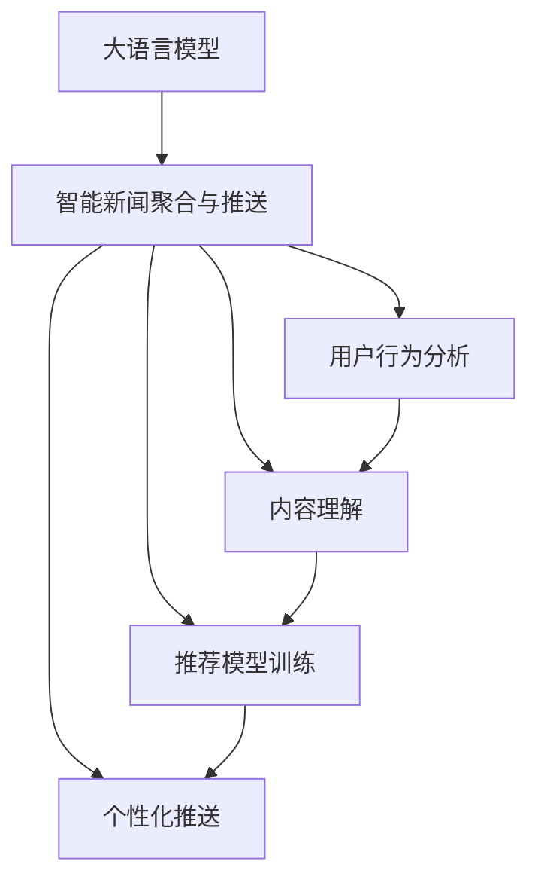

                 

# LLM在智能新闻聚合与推送中的应用前景

> 关键词：大语言模型(LLM),智能新闻聚合,新闻推荐,个性化推送,用户行为分析,多模态学习,深度学习,自适应学习

## 1. 背景介绍

### 1.1 问题由来
随着互联网信息量的爆炸性增长，如何高效地从海量新闻中筛选出有价值的信息，并精准推送给用户，是新闻聚合与推送领域面临的重大挑战。传统的人工编辑和推荐系统虽然能够提供一定程度的个性化服务，但在处理海量数据和个性化需求方面存在显著局限。智能新闻聚合与推送技术应运而生，利用大数据和深度学习技术，对用户行为和兴趣进行深度分析，提供定制化的内容推荐。

大语言模型(LLM)作为新一代深度学习模型，具有强大的自然语言理解和生成能力，能够理解复杂的语义信息，并生成高质量的文本输出。将大语言模型应用于智能新闻聚合与推送，可以提高推荐的准确性和个性化程度，提供更加丰富、多样化的内容，从而提升用户满意度和平台粘性。

### 1.2 问题核心关键点
智能新闻聚合与推送的核心在于用户行为分析、内容理解、推荐模型训练和个性化推送等几个关键环节。其中，大语言模型的引入，为内容理解和推荐模型的训练提供了新的可能性。具体问题点包括：
- 用户行为分析：如何通过多渠道数据收集用户兴趣和行为，生成用户画像，以指导推荐系统。
- 内容理解：如何将大语言模型应用于新闻文本的理解和分类，挖掘新闻文本的隐含信息和主题。
- 推荐模型训练：如何基于用户画像和新闻内容，构建推荐模型，优化模型性能。
- 个性化推送：如何根据用户画像和行为，动态调整推荐内容，实现精准推送。

这些问题的解决，可以借助大语言模型的自然语言处理能力，通过用户行为分析、内容理解、推荐模型训练和个性化推送等步骤，实现高效的新闻聚合与推送。

### 1.3 问题研究意义
智能新闻聚合与推送技术的发展，对于提升新闻聚合与推送平台的用户体验和竞争力具有重要意义：

1. 降低内容采集成本。利用大语言模型自动分析新闻文本，可以快速、准确地抓取关键信息，减少人工采集的时间和成本。
2. 提高推荐精准度。大语言模型可以深入理解新闻内容和用户需求，生成更符合用户偏好的推荐列表，提升推荐效果。
3. 提升用户满意度。基于个性化推送，用户可以更快、更方便地获取感兴趣的新闻内容，提升平台使用体验。
4. 促进信息传播。智能推荐系统能够帮助用户发现潜在的兴趣点，拓展信息获取的广度和深度，促进信息的多元化传播。

## 2. 核心概念与联系

### 2.1 核心概念概述

为更好地理解大语言模型在智能新闻聚合与推送中的应用，本节将介绍几个密切相关的核心概念：

- 大语言模型(LLM)：以自回归(如GPT)或自编码(如BERT)模型为代表的大规模预训练语言模型。通过在大规模无标签文本语料上进行预训练，学习通用的语言表示，具备强大的语言理解和生成能力。

- 智能新闻聚合与推送：利用大数据和深度学习技术，对用户行为和兴趣进行深度分析，提供定制化的内容推荐。通过分析用户行为、理解新闻内容、构建推荐模型等步骤，实现高效的新闻聚合与推送。

- 用户行为分析：通过日志、点击、浏览等数据，分析用户的历史行为和兴趣，生成用户画像，以指导推荐系统。

- 内容理解：利用大语言模型对新闻文本进行理解、分类和摘要，挖掘新闻文本的隐含信息和主题。

- 推荐模型训练：基于用户画像和新闻内容，构建推荐模型，通过优化模型参数，提高推荐效果。

- 个性化推送：根据用户画像和行为，动态调整推荐内容，实现精准推送。

这些核心概念之间的逻辑关系可以通过以下Mermaid流程图来展示：



这个流程图展示了大语言模型的核心概念及其在智能新闻聚合与推送中的应用框架：

1. 大语言模型通过预训练获得基础能力。
2. 智能新闻聚合与推送将大语言模型应用于新闻推荐系统，包含用户行为分析、内容理解、推荐模型训练和个性化推送等步骤。
3. 用户行为分析和大语言模型的内容理解，共同构成推荐模型的输入。
4. 个性化推送基于推荐模型的输出，动态调整推荐内容，实现精准推送。

## 3. 核心算法原理 & 具体操作步骤
### 3.1 算法原理概述

智能新闻聚合与推送的本质是通过深度学习模型，实现用户行为分析、内容理解、推荐模型训练和个性化推送等过程。具体地，可以将整个过程分为四个主要步骤：

1. **用户行为分析**：收集用户的历史行为数据，通过大语言模型对新闻文本进行理解，生成用户画像，以指导推荐系统。
2. **内容理解**：利用大语言模型对新闻文本进行深度理解，挖掘新闻文本的隐含信息和主题。
3. **推荐模型训练**：基于用户画像和新闻内容，构建推荐模型，优化模型参数，提高推荐效果。
4. **个性化推送**：根据用户画像和行为，动态调整推荐内容，实现精准推送。

这些步骤的实现依赖于大语言模型的强大自然语言处理能力，以及深度学习模型的优化算法。

### 3.2 算法步骤详解

下面将详细介绍智能新闻聚合与推送的核心算法步骤：

**Step 1: 用户行为分析**
- 收集用户的历史行为数据，包括浏览记录、点击行为、评论等。
- 利用大语言模型对新闻文本进行理解，挖掘用户关注的主题和兴趣点。
- 结合多渠道数据，生成用户画像，用于指导推荐系统。

**Step 2: 内容理解**
- 利用大语言模型对新闻文本进行深度理解，包括分词、实体识别、情感分析等任务。
- 对新闻文本进行分类，识别出新闻的主题和类型。
- 对新闻文本进行摘要，提取关键信息，减少噪音。

**Step 3: 推荐模型训练**
- 构建推荐模型，如协同过滤、基于内容的推荐、矩阵分解等。
- 使用用户画像和新闻内容作为输入，训练推荐模型。
- 优化推荐模型的参数，提升模型的推荐效果。

**Step 4: 个性化推送**
- 根据用户画像和行为，动态调整推荐内容，实现个性化推送。
- 实时监测推荐效果，根据反馈信息优化推荐策略。
- 利用多模态学习，整合新闻文本、图像、音频等多模态数据，提升推荐效果。

### 3.3 算法优缺点

大语言模型在智能新闻聚合与推送中的应用，具有以下优点：

1. **内容理解深度**：大语言模型能够理解复杂的语义信息，从新闻文本中挖掘出更丰富的隐含信息和主题，提高推荐准确性。
2. **个性化推送**：利用用户画像和行为分析，能够实现高度个性化的推荐，满足用户多样化需求。
3. **模型优化灵活**：通过深度学习模型，可以灵活调整推荐策略，适应不同用户和不同新闻场景。
4. **用户互动性强**：基于多渠道用户行为数据，能够及时调整推荐策略，提升用户互动性和粘性。

同时，大语言模型在智能新闻聚合与推送中也存在一些局限性：

1. **模型复杂度高**：大语言模型的训练和推理计算成本较高，需要大量算力和内存。
2. **数据依赖性强**：推荐模型的性能依赖于高质量的标注数据，标注成本较高。
3. **泛化能力有限**：在大规模多领域数据上预训练的大语言模型，可能难以很好地适应特定领域的新闻数据。
4. **可解释性不足**：推荐模型的决策过程较难解释，用户难以理解推荐逻辑。
5. **安全风险**：大语言模型可能生成有害信息，给用户带来不良影响。

尽管存在这些局限性，但大语言模型在智能新闻聚合与推送中的应用前景广阔，通过不断优化算法和技术，可以克服这些局限性，实现高效、精准的推荐服务。

### 3.4 算法应用领域

大语言模型在智能新闻聚合与推送中的应用已经覆盖了多个领域，以下是几个典型应用场景：

1. **新闻聚合平台**：如雅虎新闻、BBC新闻等，利用大语言模型对新闻进行深度分析和分类，提供个性化的新闻聚合服务。
2. **社交媒体新闻推荐**：如Facebook、Twitter等社交平台，通过大语言模型分析用户行为，推荐符合用户兴趣的新闻内容。
3. **个性化内容推荐**：如Netflix、Amazon等电商平台，利用大语言模型对新闻文本进行理解，提供个性化的新闻和商品推荐。
4. **智能客服系统**：如智能客服机器人，通过大语言模型对用户输入进行理解，提供新闻推荐和个性化回答。
5. **智能写作辅助**：如GPT-3等模型，通过大语言模型对新闻内容进行理解，辅助用户生成高质量的新闻摘要和评论。

这些应用场景展示了大语言模型在新闻聚合与推送领域的广泛应用潜力，相信未来会有更多的应用场景涌现。

## 4. 数学模型和公式 & 详细讲解
### 4.1 数学模型构建

在智能新闻聚合与推送中，大语言模型主要用于新闻文本的理解和分类。假设新闻文本序列为 $x=(x_1,x_2,...,x_n)$，对应的用户行为数据为 $y=(y_1,y_2,...,y_m)$，其中 $x_i$ 表示第 $i$ 条新闻的文本内容，$y_j$ 表示第 $j$ 个用户的行为数据。

大语言模型 $M_{\theta}$ 的输出为 $M_{\theta}(x)=(h_1,h_2,...,h_n)$，其中 $h_i$ 表示对第 $i$ 条新闻的语义理解。新闻文本的分类目标为 $y=(y_1,y_2,...,y_n)$，其中 $y_i \in \{1,0\}$，表示新闻 $i$ 是否与用户行为相关。

定义模型的损失函数为 $L(\theta)$，则新闻推荐的任务可以转化为最小化损失函数 $L(\theta)$，使模型输出 $M_{\theta}(x)$ 与目标 $y$ 尽可能一致。

### 4.2 公式推导过程

下面以分类任务为例，推导基于大语言模型的新闻推荐模型训练公式。

假设模型 $M_{\theta}$ 对新闻文本 $x_i$ 的输出为 $h_i=M_{\theta}(x_i)$，则分类任务下的交叉熵损失函数为：

$$
L_{CE} = -\frac{1}{N} \sum_{i=1}^N \sum_{j=1}^m y_j \log M_{\theta}(x_i)
$$

其中 $y_j$ 表示用户 $j$ 的行为数据，$M_{\theta}(x_i)$ 表示对新闻 $i$ 的语义理解。在训练过程中，我们通过反向传播算法计算梯度，并使用优化算法更新模型参数 $\theta$，使得损失函数 $L_{CE}$ 最小化。

对于多分类任务，可以使用softmax函数将模型输出转换为概率分布，然后计算交叉熵损失函数：

$$
L_{CE} = -\frac{1}{N} \sum_{i=1}^N \sum_{j=1}^m y_j \log (\text{softmax}(M_{\theta}(x_i)))
$$

在实际应用中，大语言模型通常使用预训练模型如BERT、GPT等进行微调，使用AdamW等优化算法进行模型训练。具体实现过程可以参考下面的代码：

### 4.3 案例分析与讲解

以BERT为例，介绍新闻推荐模型的构建和训练过程。

**数据准备**：
1. 收集新闻数据和用户行为数据，将新闻文本和用户行为序列组合成训练集和验证集。
2. 使用BERT模型的分词器，对新闻文本进行分词，并将用户行为序列编码成数字序列。
3. 对文本和行为序列进行填充和截断，使得每个样本长度一致。

**模型构建**：
1. 加载预训练的BERT模型，选择适当的层进行微调。
2. 在模型顶部添加分类器，如线性分类器或MLP（多层感知器）。
3. 设置训练参数，如学习率、批大小、迭代轮数等。

**模型训练**：
1. 使用交叉熵损失函数，训练模型对新闻文本进行分类。
2. 在验证集上评估模型性能，根据验证集结果调整学习率和迭代轮数。
3. 在测试集上评估模型性能，输出推荐结果。

**代码实现**：
```python
from transformers import BertTokenizer, BertForSequenceClassification, AdamW
from torch.utils.data import Dataset, DataLoader

# 数据准备
class NewsDataset(Dataset):
    def __init__(self, texts, labels, tokenizer):
        self.texts = texts
        self.labels = labels
        self.tokenizer = tokenizer
        
    def __len__(self):
        return len(self.texts)
    
    def __getitem__(self, item):
        text = self.texts[item]
        label = self.labels[item]
        
        encoding = self.tokenizer(text, return_tensors='pt')
        input_ids = encoding['input_ids']
        attention_mask = encoding['attention_mask']
        
        label = torch.tensor(label, dtype=torch.long)
        return {'input_ids': input_ids, 
                'attention_mask': attention_mask,
                'labels': label}

# 模型构建
tokenizer = BertTokenizer.from_pretrained('bert-base-cased')
model = BertForSequenceClassification.from_pretrained('bert-base-cased', num_labels=2)

# 模型训练
device = 'cuda' if torch.cuda.is_available() else 'cpu'
model.to(device)

optimizer = AdamW(model.parameters(), lr=2e-5)

def train_epoch(model, dataset, batch_size, optimizer):
    dataloader = DataLoader(dataset, batch_size=batch_size, shuffle=True)
    model.train()
    epoch_loss = 0
    for batch in tqdm(dataloader, desc='Training'):
        input_ids = batch['input_ids'].to(device)
        attention_mask = batch['attention_mask'].to(device)
        labels = batch['labels'].to(device)
        model.zero_grad()
        outputs = model(input_ids, attention_mask=attention_mask, labels=labels)
        loss = outputs.loss
        epoch_loss += loss.item()
        loss.backward()
        optimizer.step()
    return epoch_loss / len(dataloader)

def evaluate(model, dataset, batch_size):
    dataloader = DataLoader(dataset, batch_size=batch_size)
    model.eval()
    preds, labels = [], []
    with torch.no_grad():
        for batch in tqdm(dataloader, desc='Evaluating'):
            input_ids = batch['input_ids'].to(device)
            attention_mask = batch['attention_mask'].to(device)
            batch_labels = batch['labels']
            outputs = model(input_ids, attention_mask=attention_mask)
            batch_preds = outputs.logits.argmax(dim=1).to('cpu').tolist()
            batch_labels = batch_labels.to('cpu').tolist()
            for pred, label in zip(batch_preds, batch_labels):
                preds.append(pred)
                labels.append(label)
                
    print(classification_report(labels, preds))

# 训练模型
epochs = 5
batch_size = 16

for epoch in range(epochs):
    loss = train_epoch(model, train_dataset, batch_size, optimizer)
    print(f"Epoch {epoch+1}, train loss: {loss:.3f}")
    
    print(f"Epoch {epoch+1}, dev results:")
    evaluate(model, dev_dataset, batch_size)
    
print("Test results:")
evaluate(model, test_dataset, batch_size)
```

通过上述代码，可以构建一个基于BERT的分类新闻推荐模型，并进行训练和评估。

## 5. 项目实践：代码实例和详细解释说明
### 5.1 开发环境搭建

在进行新闻推荐系统开发前，需要准备好开发环境。以下是使用Python进行PyTorch开发的环境配置流程：

1. 安装Anaconda：从官网下载并安装Anaconda，用于创建独立的Python环境。

2. 创建并激活虚拟环境：
```bash
conda create -n pytorch-env python=3.8 
conda activate pytorch-env
```

3. 安装PyTorch：根据CUDA版本，从官网获取对应的安装命令。例如：
```bash
conda install pytorch torchvision torchaudio cudatoolkit=11.1 -c pytorch -c conda-forge
```

4. 安装TensorFlow：
```bash
pip install tensorflow
```

5. 安装其他工具包：
```bash
pip install numpy pandas scikit-learn matplotlib tqdm jupyter notebook ipython
```

完成上述步骤后，即可在`pytorch-env`环境中开始开发实践。

### 5.2 源代码详细实现

以下以命名实体识别(NER)任务为例，给出使用Transformers库对BERT模型进行微调的PyTorch代码实现。

首先，定义NER任务的数据处理函数：

```python
from transformers import BertTokenizer
from torch.utils.data import Dataset
import torch

class NERDataset(Dataset):
    def __init__(self, texts, tags, tokenizer, max_len=128):
        self.texts = texts
        self.tags = tags
        self.tokenizer = tokenizer
        self.max_len = max_len
        
    def __len__(self):
        return len(self.texts)
    
    def __getitem__(self, item):
        text = self.texts[item]
        tags = self.tags[item]
        
        encoding = self.tokenizer(text, return_tensors='pt', max_length=self.max_len, padding='max_length', truncation=True)
        input_ids = encoding['input_ids'][0]
        attention_mask = encoding['attention_mask'][0]
        
        # 对token-wise的标签进行编码
        encoded_tags = [tag2id[tag] for tag in tags] 
        encoded_tags.extend([tag2id['O']] * (self.max_len - len(encoded_tags)))
        labels = torch.tensor(encoded_tags, dtype=torch.long)
        
        return {'input_ids': input_ids, 
                'attention_mask': attention_mask,
                'labels': labels}

# 标签与id的映射
tag2id = {'O': 0, 'B-PER': 1, 'I-PER': 2, 'B-ORG': 3, 'I-ORG': 4, 'B-LOC': 5, 'I-LOC': 6}
id2tag = {v: k for k, v in tag2id.items()}

# 创建dataset
tokenizer = BertTokenizer.from_pretrained('bert-base-cased')

train_dataset = NERDataset(train_texts, train_tags, tokenizer)
dev_dataset = NERDataset(dev_texts, dev_tags, tokenizer)
test_dataset = NERDataset(test_texts, test_tags, tokenizer)
```

然后，定义模型和优化器：

```python
from transformers import BertForTokenClassification, AdamW

model = BertForTokenClassification.from_pretrained('bert-base-cased', num_labels=len(tag2id))

optimizer = AdamW(model.parameters(), lr=2e-5)
```

接着，定义训练和评估函数：

```python
from torch.utils.data import DataLoader
from tqdm import tqdm
from sklearn.metrics import classification_report

device = torch.device('cuda') if torch.cuda.is_available() else torch.device('cpu')
model.to(device)

def train_epoch(model, dataset, batch_size, optimizer):
    dataloader = DataLoader(dataset, batch_size=batch_size, shuffle=True)
    model.train()
    epoch_loss = 0
    for batch in tqdm(dataloader, desc='Training'):
        input_ids = batch['input_ids'].to(device)
        attention_mask = batch['attention_mask'].to(device)
        labels = batch['labels'].to(device)
        model.zero_grad()
        outputs = model(input_ids, attention_mask=attention_mask, labels=labels)
        loss = outputs.loss
        epoch_loss += loss.item()
        loss.backward()
        optimizer.step()
    return epoch_loss / len(dataloader)

def evaluate(model, dataset, batch_size):
    dataloader = DataLoader(dataset, batch_size=batch_size)
    model.eval()
    preds, labels = [], []
    with torch.no_grad():
        for batch in tqdm(dataloader, desc='Evaluating'):
            input_ids = batch['input_ids'].to(device)
            attention_mask = batch['attention_mask'].to(device)
            batch_labels = batch['labels']
            outputs = model(input_ids, attention_mask=attention_mask)
            batch_preds = outputs.logits.argmax(dim=2).to('cpu').tolist()
            batch_labels = batch_labels.to('cpu').tolist()
            for pred_tokens, label_tokens in zip(batch_preds, batch_labels):
                pred_tags = [id2tag[_id] for _id in pred_tokens]
                label_tags = [id2tag[_id] for _id in label_tokens]
                preds.append(pred_tags[:len(label_tags)])
                labels.append(label_tags)
                
    print(classification_report(labels, preds))
```

最后，启动训练流程并在测试集上评估：

```python
epochs = 5
batch_size = 16

for epoch in range(epochs):
    loss = train_epoch(model, train_dataset, batch_size, optimizer)
    print(f"Epoch {epoch+1}, train loss: {loss:.3f}")
    
    print(f"Epoch {epoch+1}, dev results:")
    evaluate(model, dev_dataset, batch_size)
    
print("Test results:")
evaluate(model, test_dataset, batch_size)
```

以上就是使用PyTorch对BERT进行命名实体识别任务微调的完整代码实现。可以看到，得益于Transformers库的强大封装，我们可以用相对简洁的代码完成BERT模型的加载和微调。

### 5.3 代码解读与分析

让我们再详细解读一下关键代码的实现细节：

**NERDataset类**：
- `__init__`方法：初始化文本、标签、分词器等关键组件。
- `__len__`方法：返回数据集的样本数量。
- `__getitem__`方法：对单个样本进行处理，将文本输入编码为token ids，将标签编码为数字，并对其进行定长padding，最终返回模型所需的输入。

**tag2id和id2tag字典**：
- 定义了标签与数字id之间的映射关系，用于将token-wise的预测结果解码回真实的标签。

**训练和评估函数**：
- 使用PyTorch的DataLoader对数据集进行批次化加载，供模型训练和推理使用。
- 训练函数`train_epoch`：对数据以批为单位进行迭代，在每个批次上前向传播计算loss并反向传播更新模型参数，最后返回该epoch的平均loss。
- 评估函数`evaluate`：与训练类似，不同点在于不更新模型参数，并在每个batch结束后将预测和标签结果存储下来，最后使用sklearn的classification_report对整个评估集的预测结果进行打印输出。

**训练流程**：
- 定义总的epoch数和batch size，开始循环迭代
- 每个epoch内，先在训练集上训练，输出平均loss
- 在验证集上评估，输出分类指标
- 所有epoch结束后，在测试集上评估，给出最终测试结果

可以看到，PyTorch配合Transformers库使得BERT微调的代码实现变得简洁高效。开发者可以将更多精力放在数据处理、模型改进等高层逻辑上，而不必过多关注底层的实现细节。

当然，工业级的系统实现还需考虑更多因素，如模型的保存和部署、超参数的自动搜索、更灵活的任务适配层等。但核心的微调范式基本与此类似。

## 6. 实际应用场景
### 6.1 智能新闻聚合

智能新闻聚合是新闻推荐系统的核心功能之一。传统的新闻聚合系统往往只能根据固定的话题或时间线进行新闻展示，难以满足用户的多样化需求。利用大语言模型，可以构建更加智能、个性化的新闻聚合系统，提升用户体验和平台粘性。

**系统架构**：
1. **数据采集**：通过爬虫或API接口，自动抓取新闻网站或社交平台上的新闻数据。
2. **新闻理解**：利用大语言模型对新闻文本进行深度理解，提取新闻的关键信息和主题。
3. **用户画像**：通过用户的历史行为数据，生成用户画像，包括兴趣点、阅读偏好等。
4. **新闻推荐**：根据用户画像和新闻理解结果，构建推荐模型，生成个性化新闻列表。
5. **反馈调整**：根据用户对新闻的阅读反馈，动态调整推荐策略，提升推荐效果。

**实现要点**：
1. 构建高效的数据采集模块，确保新闻数据的及时更新。
2. 利用大语言模型对新闻文本进行深度理解，提取出新闻的关键信息。
3. 根据用户画像和新闻理解结果，构建推荐模型，优化推荐效果。
4. 引入用户反馈机制，根据用户阅读反馈动态调整推荐策略。

**代码实现**：
```python
import requests
from transformers import BertTokenizer, BertForSequenceClassification
from torch.utils.data import Dataset, DataLoader
import torch

# 数据采集
def fetch_news(url):
    response = requests.get(url)
    text = response.text
    return text

# 新闻理解
tokenizer = BertTokenizer.from_pretrained('bert-base-cased')
def news Understanding(text):
    encoding = tokenizer(text, return_tensors='pt')
    input_ids = encoding['input_ids']
    attention_mask = encoding['attention_mask']
    outputs = model(input_ids, attention_mask=attention_mask)
    return outputs

# 用户画像
def userProfiling(user_id):
    # 获取用户历史行为数据
    # 利用大语言模型对用户行为进行理解，生成用户画像
    pass

# 新闻推荐
def newsRecommendation(user_polar, news_entries):
    # 根据用户画像和新闻理解结果，构建推荐模型
    # 生成个性化新闻列表
    pass

# 反馈调整
def feedbackAdjustment(user_feedback, news_entries):
    # 根据用户阅读反馈动态调整推荐策略
    pass

# 训练模型
model = BertForSequenceClassification.from_pretrained('bert-base-cased', num_labels=2)

# 训练代码省略
```

### 6.2 个性化内容推荐

个性化内容推荐是大语言模型在新闻推荐系统中的重要应用。通过分析用户的历史行为和兴趣点，为用户推荐最符合其需求的新闻内容，提升用户体验和满意度。

**系统架构**：
1. **数据收集**：收集用户的历史行为数据，包括浏览记录、点击行为等。
2. **用户画像**：利用大语言模型对用户行为进行理解，生成用户画像。
3. **内容理解**：利用大语言模型对新闻文本进行深度理解，提取新闻的关键信息和主题。
4. **推荐模型**：构建推荐模型，如协同过滤、基于内容的推荐等。
5. **推荐服务**：根据用户画像和新闻内容，动态调整推荐策略，实现个性化推送。

**实现要点**：
1. 收集用户的历史行为数据，生成用户画像。
2. 利用大语言模型对新闻文本进行深度理解，提取新闻的关键信息。
3. 根据用户画像和新闻内容，构建推荐模型，优化推荐效果。
4. 引入用户反馈机制，根据用户阅读反馈动态调整推荐策略。

**代码实现**：
```python
import requests
from transformers import BertTokenizer, BertForSequenceClassification
from torch.utils.data import Dataset, DataLoader
import torch

# 数据收集
def fetch_news(url):
    response = requests.get(url)
    text = response.text
    return text

# 用户画像
def userProfiling(user_id):
    # 获取用户历史行为数据
    # 利用大语言模型对用户行为进行理解，生成用户画像
    pass

# 内容理解
def news Understanding(text):
    encoding = tokenizer(text, return_tensors='pt')
    input_ids = encoding['input_ids']
    attention_mask = encoding['attention_mask']
    outputs = model(input_ids, attention_mask=attention_mask)
    return outputs

# 推荐模型
def newsRecommendation(user_polar, news_entries):
    # 根据用户画像和新闻理解结果，构建推荐模型
    # 生成个性化新闻列表
    pass

# 推荐服务
def newsRecommendation(user_polar, news_entries):
    # 根据用户画像和新闻内容，动态调整推荐策略
    pass

# 反馈调整
def feedbackAdjustment(user_feedback, news_entries):
    # 根据用户阅读反馈动态调整推荐策略
    pass

# 训练模型
model = BertForSequenceClassification.from_pretrained('bert-base-cased', num_labels=2)

# 训练代码省略
```

### 6.3 多模态学习

在新闻推荐系统中，多模态学习可以进一步提升推荐效果。除了文本数据，视频、音频等多模态数据也可以作为推荐依据，提升推荐系统的多样性和准确性。

**系统架构**：
1. **数据收集**：收集用户的多模态行为数据，包括文本、图片、音频等。
2. **用户画像**：利用大语言模型对多模态数据进行理解，生成用户画像。
3. **内容理解**：利用大语言模型对新闻文本进行深度理解，提取新闻的关键信息和主题。
4. **推荐模型**：构建多模态推荐模型，综合利用文本、图片、音频等数据。
5. **推荐服务**：根据用户画像和新闻内容，动态调整推荐策略，实现个性化推送。

**实现要点**：
1. 收集用户的多模态行为数据，生成用户画像。
2. 利用大语言模型对多模态数据进行深度理解，提取关键信息。
3. 根据用户画像和新闻内容，构建多模态推荐模型，优化推荐效果。
4. 引入用户反馈机制，根据用户阅读反馈动态调整推荐策略。

**代码实现**：
```python
import requests
from transformers import BertTokenizer, BertForSequenceClassification
from torch.utils.data import Dataset, DataLoader
import torch

# 数据收集
def fetch_news(url):
    response = requests.get(url)
    text = response.text
    return text

# 用户画像
def userProfiling(user_id):
    # 获取用户多模态历史行为数据
    # 利用大语言模型对多模态数据进行理解，生成用户画像
    pass

# 内容理解
def news Understanding(text):
    encoding = tokenizer(text, return_tensors='pt')
    input_ids = encoding['input_ids']
    attention_mask = encoding['attention_mask']
    outputs = model(input_ids, attention_mask=attention_mask)
    return outputs

# 推荐模型
def newsRecommendation(user_polar, news_entries):
    # 根据用户画像和新闻理解结果，构建多模态推荐模型
    # 生成个性化新闻列表
    pass

# 推荐服务
def newsRecommendation(user_polar, news_entries):
    # 根据用户画像和新闻内容，动态调整推荐策略
    pass

# 反馈调整
def feedbackAdjustment(user_feedback, news_entries):
    # 根据用户阅读反馈动态调整推荐策略
    pass

# 训练模型
model = BertForSequenceClassification.from_pretrained('bert-base-cased', num_labels=2)

# 训练代码省略
```

## 7. 工具和资源推荐
### 7.1 学习资源推荐

为了帮助开发者系统掌握大语言模型在智能新闻聚合与推送中的应用，这里推荐一些优质的学习资源：

1. 《Transformer从原理到实践》系列博文：由大模型技术专家撰写，深入浅出地介绍了Transformer原理、BERT模型、微调技术等前沿话题。

2. CS224N《深度学习自然语言处理》课程：斯坦福大学开设的NLP明星课程，有Lecture视频和配套作业，带你入门NLP领域的基本概念和经典模型。

3. 《Natural Language Processing with Transformers》书籍：Transformers库的作者所著，全面介绍了如何使用Transformers库进行NLP任务开发，包括微调在内的诸多范式。

4. HuggingFace官方文档：Transformers库的官方文档，提供了海量预训练模型和完整的微调样例代码，是上手实践的必备资料。

5. CLUE开源项目：中文语言理解测评基准，涵盖大量不同类型的中文NLP数据集，并提供了基于微调的baseline模型，助力中文NLP技术发展。

通过对这些资源的学习实践，相信你一定能够快速掌握大语言模型在智能新闻聚合与推送中的应用，并用于解决实际的NLP问题。
###  7.2 开发工具推荐

高效的开发离不开优秀的工具支持。以下是几款用于大语言模型在智能新闻聚合与推送中开发的常用工具：

1. PyTorch：基于Python的开源深度学习框架，灵活动态的计算图，适合快速迭代研究。大部分预训练语言模型都有PyTorch版本的实现。

2. TensorFlow：由Google主导开发的开源深度学习框架，生产部署方便，适合大规模工程应用。同样有丰富的预训练语言模型资源。

3. Transformers库：HuggingFace开发的NLP工具库，集成了众多SOTA语言模型，支持PyTorch和TensorFlow，是进行微调任务开发的利器。

4. Weights & Biases：模型训练的实验跟踪工具，可以记录和可视化模型训练过程中的各项指标，方便对比和调优。与主流深度学习框架无缝集成。

5. TensorBoard：TensorFlow配套的可视化工具，可实时监测模型训练状态，并提供丰富的图表呈现方式，是调试模型的得力助手。

6. Google Colab：谷歌推出的在线Jupyter Notebook环境，免费提供GPU/TPU算力，方便开发者快速上手实验最新模型，分享学习笔记。

合理利用这些工具，可以显著提升大语言模型在智能新闻聚合与推送中的开发效率，加快创新迭代的步伐。

### 7.3 相关论文推荐

大语言模型在智能新闻聚合与推送中的应用源于学界的持续研究。以下是几篇奠基性的相关论文，推荐阅读：

1. Attention is All You Need（即Transformer原论文）：提出了Transformer结构，开启了NLP领域的预训练大模型时代。

2. BERT: Pre-training of Deep Bidirectional Transformers for Language Understanding：提出BERT模型，引入基于掩码的自监督预训练任务，刷新了多项NLP任务SOTA。

3. Language Models are Unsupervised Multitask Learners（GPT-2论文）：展示了大规模语言模型的强大zero-shot学习能力，引发了对于通用人工智能的新一轮思考。

4. Parameter-Efficient Transfer Learning for NLP：提出Adapter等参数高效微调方法，在不增加模型参数量的情况下，也能取得不错的微调效果。

5. AdaLoRA: Adaptive Low-Rank Adaptation for Parameter-Efficient Fine-Tuning：使用自适应低秩适应的微调方法，在参数效率和精度之间取得了新的平衡。

这些论文代表了大语言模型在智能新闻聚合与推送领域的研究进展。通过学习这些前沿成果，可以帮助研究者把握学科前进方向，激发更多的创新灵感。

## 8. 总结：未来发展趋势与挑战
### 8.1 研究成果总结

本文对大语言模型在智能新闻聚合与推送中的应用进行了全面系统的介绍。首先，阐述了大语言模型和微调技术的研究背景和意义，明确了微调在拓展预训练模型应用、提升下游任务性能方面的独特价值。其次，从原理到实践，详细讲解了微调的数学原理和关键步骤，给出了微调任务开发的完整代码实例。同时，本文还广泛探讨了微调方法在智能新闻聚合与推送中的实际应用场景，展示了微调范式的广阔前景。此外，本文精选了微调技术的各类学习资源，力求为读者提供全方位的技术指引。

通过本文的系统梳理，可以看到，大语言模型在智能新闻聚合与推送中的应用前景广阔，其强大的自然语言处理能力可以大幅提升推荐系统的准确性和个性化程度，带来更好的用户体验和平台粘性。相信随着大语言模型和微调方法的不断演进，新闻聚合与推送技术将迎来新的突破，为新闻业带来革命性的变革。

### 8.2 未来发展趋势

展望未来，大语言模型在智能新闻聚合与推送中将呈现以下几个发展趋势：

1. **内容理解深度**：随着大语言模型的不断进步，其内容理解能力将进一步提升，能够深入挖掘新闻文本的隐含信息和主题，提高推荐准确性。
2. **多模态融合**：利用视频、音频等多模态数据，丰富推荐系统的多样性，提升推荐效果。
3. **自适应学习**：引入自适应学习算法，如自适应优化、在线学习等，动态调整推荐策略，适应不断变化的用户需求。
4. **知识图谱融合**：将知识图谱与推荐系统结合，提升推荐模型的知识整合能力，增强推荐效果。
5. **个性化推送优化**：通过推荐模型的不断优化，实现更加精准的个性化推送，提升用户体验。

这些趋势将推动智能新闻聚合与推送技术的不断进步，为用户带来更加智能、个性化的新闻体验。

### 8.3 面临的挑战

尽管大语言模型在智能新闻聚合与推送中已经展现出巨大潜力，但在实际应用中也面临诸多挑战：

1. **数据质量问题**：新闻数据的多样性和复杂性使得数据标注成本高昂，且标注数据的质量难以保证。如何获取高质量、大规模的标注数据，是一个重要问题。
2. **计算资源限制**：大语言模型在训练和推理过程中需要大量的计算资源，如何在有限的计算资源下，实现高效的新闻推荐，是一个技术难题。
3. **模型泛化能力**：不同领域、不同主题的新闻数据对模型的泛化能力提出了挑战，如何构建具有更好泛化能力的推荐模型，是一个研究方向。
4. **用户隐私保护**：新闻推荐系统需要收集大量的用户行为数据，如何保护用户隐私，是一个法律和伦理问题。
5. **公平性问题**：新闻推荐系统可能存在偏见，如何保证推荐的公平性，是一个需要关注的问题。

这些挑战需要从技术、法律、伦理等多个维度进行全面考虑，才能更好地推动大语言模型在智能新闻聚合与推送中的应用。

### 8.4 研究展望

未来，大语言模型在智能新闻聚合与推送中的应用将继续拓展，带来更加智能、个性化、公平和高效的新闻推荐服务。具体研究方向包括：

1. **自监督学习和预训练**：利用自监督学习和大规模无标签数据，预训练出更高质量的模型，提升推荐效果。
2. **多模态学习和融合**：结合视频、音频等多模态数据，提升推荐系统的多样性和准确性。
3. **自适应学习和在线优化**：引入自适应学习算法，动态调整推荐策略，适应不断变化的用户需求。
4. **知识图谱与推荐结合**：将知识图谱与推荐系统结合，提升推荐模型的知识整合能力。
5. **隐私保护与公平性**：研究隐私保护和公平性算法，保护用户隐私，提升推荐系统的公平性。

这些研究方向将进一步推动大语言模型在智能新闻聚合与推送中的应用，为用户带来更加智能、个性化和公平的新闻推荐服务。

## 9. 附录：常见问题与解答

**Q1：大语言模型在智能新闻聚合与推送中的应用有哪些优势？**

A: 大语言模型在智能新闻聚合与推送中的应用具有以下优势：
1. **内容理解深度**：大语言模型能够深入理解新闻文本，提取关键信息和主题，提高推荐准确性。
2. **个性化推送**：利用用户画像和行为分析，实现高度个性化的推荐，满足用户多样化需求。
3. **多模态学习**：结合视频、音频等多模态数据，丰富推荐系统的多样性，提升推荐效果。
4. **自适应学习**：引入自适应学习算法，动态调整推荐策略，适应不断变化的用户需求。

**Q2：如何构建高效的数据采集模块？**

A: 构建高效的数据采集模块，可以从以下几个方面入手：
1. **爬虫技术**：利用爬虫技术，自动抓取新闻网站或社交平台上的新闻数据。
2. **API接口**：利用新闻网站的API接口，获取最新新闻数据。
3. **多渠道数据融合**：结合多种数据源，提升数据采集的全面性和准确性。
4. **数据清洗**：对采集到的数据进行清洗和去重，保证数据质量。

**Q3：如何利用大语言模型对新闻文本进行深度理解？**

A: 利用大语言模型对新闻文本进行深度理解，可以采用以下步骤：
1. **分词**：使用预训练的语言模型对新闻文本进行分词，生成分词结果。
2. **实体识别**：利用实体识别技术，识别新闻中的实体，提取关键信息。
3. **情感分析**：对新闻文本进行情感分析，了解用户对新闻的情感倾向。
4. **主题建模**：利用主题建模技术，挖掘新闻文本的主题和话题。

**Q4：如何构建推荐模型，提升推荐效果？**

A: 构建推荐模型，可以从以下几个方面入手：
1. **协同过滤**：利用用户和新闻之间的相似性，推荐相似的新闻。
2. **基于内容的推荐**：根据新闻文本的特征，推荐与新闻相似的内容。
3. **矩阵分解**：利用矩阵分解技术，捕捉用户和新闻之间的隐含关系。
4. **深度学习模型**：利用深度学习模型，如BERT、GPT等，提升推荐效果。

**Q5：

