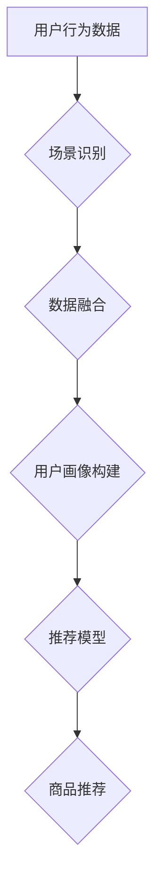

                 

## 电商平台中的多场景推荐策略融合

> 关键词：推荐系统、多场景推荐、场景融合、机器学习、深度学习、个性化推荐、电商平台

## 1. 背景介绍

在当今数据爆炸的时代，电商平台面临着激烈的竞争压力。如何精准地推荐商品给用户，提升用户体验和转化率，成为平台发展的重要课题。传统的推荐系统往往基于单一场景的数据，例如用户浏览历史、购买记录等，难以满足用户在不同场景下的个性化需求。

多场景推荐策略融合旨在打破单一场景的局限，通过整合用户在不同场景下的行为数据，构建更全面的用户画像，从而实现更精准、更个性化的商品推荐。例如，用户在手机端浏览商品信息，在电脑端添加购物车，最终在微信小程序完成购买，这些行为数据都蕴含着用户的潜在需求和偏好。

## 2. 核心概念与联系

**2.1 核心概念**

* **场景:** 指用户在特定时间、地点、状态下进行交互的上下文环境。例如，用户在手机端浏览商品时，场景为“移动购物”；用户在电脑端查看商品详情时，场景为“桌面购物”。
* **场景融合:** 指将不同场景下的用户行为数据整合在一起，构建更全面的用户画像，并利用这些信息进行商品推荐。
* **多场景推荐:** 指根据用户在不同场景下的行为数据，提供个性化的商品推荐。

**2.2 架构图**



**2.3 联系**

多场景推荐策略融合的核心是将不同场景下的用户行为数据进行整合，构建更全面的用户画像。通过分析用户在不同场景下的行为模式，可以更准确地理解用户的需求和偏好，从而提供更精准、更个性化的商品推荐。

## 3. 核心算法原理 & 具体操作步骤

**3.1 算法原理概述**

多场景推荐策略融合通常采用机器学习算法，例如协同过滤、内容过滤、深度学习等，来分析用户行为数据，构建用户画像，并进行商品推荐。

* **协同过滤:** 基于用户的相似性或商品的相似性进行推荐。
* **内容过滤:** 基于商品的特征和用户偏好进行推荐。
* **深度学习:** 利用神经网络模型，从海量数据中学习用户行为模式，进行更精准的推荐。

**3.2 算法步骤详解**

1. **数据收集:** 收集用户在不同场景下的行为数据，例如浏览记录、购买记录、评价记录、搜索记录等。
2. **数据预处理:** 对收集到的数据进行清洗、转换、特征提取等操作，使其适合算法训练。
3. **场景识别:** 利用自然语言处理、机器学习等技术，识别用户在不同场景下的行为模式。
4. **数据融合:** 将不同场景下的用户行为数据进行整合，构建更全面的用户画像。
5. **推荐模型训练:** 利用机器学习算法，对融合后的用户数据进行训练，构建推荐模型。
6. **商品推荐:** 根据用户的当前场景和行为模式，利用训练好的推荐模型，推荐相关的商品。

**3.3 算法优缺点**

* **协同过滤:** 优点：能够发现隐含的用户偏好，推荐个性化商品。缺点：数据稀疏性问题，冷启动问题。
* **内容过滤:** 优点：能够根据商品特征进行推荐，避免数据稀疏性问题。缺点：推荐结果可能过于单一，缺乏个性化。
* **深度学习:** 优点：能够从海量数据中学习更复杂的特征，推荐结果更精准。缺点：训练成本高，需要大量数据支持。

**3.4 算法应用领域**

多场景推荐策略融合广泛应用于电商平台、社交媒体、内容推荐等领域，例如：

* **电商平台:** 根据用户的浏览历史、购买记录、评价记录等数据，推荐个性化的商品。
* **社交媒体:** 根据用户的兴趣爱好、好友关系等数据，推荐相关的新闻、视频、图片等内容。
* **内容推荐:** 根据用户的阅读习惯、观看历史等数据，推荐相关的文章、视频、书籍等内容。

## 4. 数学模型和公式 & 详细讲解 & 举例说明

**4.1 数学模型构建**

多场景推荐策略融合通常采用矩阵分解模型，例如协同过滤中的矩阵分解算法，来构建用户-商品交互矩阵。

假设用户集合为U，商品集合为I，用户-商品交互矩阵为R，其中R(u,i)表示用户u对商品i的评分或交互行为。

**4.2 公式推导过程**

矩阵分解的目标是将用户-商品交互矩阵R分解成两个低维矩阵P和Q，其中P为用户特征矩阵，Q为商品特征矩阵。

$$R \approx P Q^T$$

其中，P(u,k)表示用户u在第k个特征维度上的特征值，Q(i,k)表示商品i在第k个特征维度上的特征值。

**4.3 案例分析与讲解**

假设有一个用户-商品交互矩阵R，其中R(u,i)表示用户u对商品i的评分。

我们可以使用矩阵分解算法将R分解成两个低维矩阵P和Q。

例如，如果用户集合U包含100个用户，商品集合I包含1000个商品，我们可以将P和Q分别分解成100x10和10x100的矩阵。

通过训练P和Q，我们可以得到每个用户和商品在每个特征维度上的特征值。

然后，我们可以根据用户的特征值和商品的特征值，计算出用户对每个商品的评分预测值。

## 5. 项目实践：代码实例和详细解释说明

**5.1 开发环境搭建**

* Python 3.x
* TensorFlow 或 PyTorch
* Jupyter Notebook

**5.2 源代码详细实现**

```python
import tensorflow as tf

# 定义用户-商品交互矩阵
R = tf.constant([[5, 4, 3],
                 [4, 5, 2],
                 [3, 2, 5]])

# 定义用户特征矩阵和商品特征矩阵
P = tf.Variable(tf.random.normal([3, 10]))
Q = tf.Variable(tf.random.normal([10, 3]))

# 计算预测评分
predictions = tf.matmul(P, Q, transpose_b=True)

# 定义损失函数
loss = tf.reduce_mean(tf.square(predictions - R))

# 定义优化器
optimizer = tf.keras.optimizers.Adam()

# 训练模型
for epoch in range(100):
    with tf.GradientTape() as tape:
        loss_value = loss
    gradients = tape.gradient(loss_value, [P, Q])
    optimizer.apply_gradients(zip(gradients, [P, Q]))

# 打印预测评分
print(predictions)
```

**5.3 代码解读与分析**

* 代码首先定义了用户-商品交互矩阵R。
* 然后定义了用户特征矩阵P和商品特征矩阵Q，并使用随机值初始化。
* 计算预测评分，并定义损失函数，用于衡量预测评分与真实评分之间的差异。
* 使用Adam优化器训练模型，通过迭代更新P和Q，最小化损失函数。
* 最后打印预测评分。

**5.4 运行结果展示**

运行代码后，会输出预测评分矩阵，其中每个元素表示模型预测的用户对商品的评分。

## 6. 实际应用场景

**6.1 电商平台商品推荐**

* **个性化推荐:** 根据用户的浏览历史、购买记录、评价记录等数据，推荐个性化的商品。
* **场景化推荐:** 根据用户的当前场景，例如“手机购物”、“桌面购物”、“微信小程序购物”等，推荐相关的商品。
* **跨场景推荐:** 结合用户的不同场景下的行为数据，进行跨场景的商品推荐，例如，用户在手机端浏览商品，在电脑端添加购物车，最终在微信小程序完成购买。

**6.2 社交媒体内容推荐**

* **兴趣推荐:** 根据用户的兴趣爱好、好友关系等数据，推荐相关的新闻、视频、图片等内容。
* **个性化内容流:** 根据用户的阅读习惯、观看历史等数据，构建个性化的内容流，推荐用户感兴趣的内容。

**6.3 内容推荐平台**

* **文章推荐:** 根据用户的阅读习惯、点赞记录等数据，推荐相关的文章。
* **视频推荐:** 根据用户的观看历史、评论记录等数据，推荐相关的视频。
* **书籍推荐:** 根据用户的阅读记录、评分记录等数据，推荐相关的书籍。

**6.4 未来应用展望**

随着人工智能技术的不断发展，多场景推荐策略融合将应用于更多领域，例如：

* **医疗保健:** 根据用户的病史、症状、生活习惯等数据，推荐相关的医疗服务和健康产品。
* **教育:** 根据学生的学习进度、兴趣爱好等数据，推荐相关的学习资源和课程。
* **金融:** 根据用户的投资习惯、风险偏好等数据，推荐相关的理财产品和投资策略。

## 7. 工具和资源推荐

**7.1 学习资源推荐**

* **书籍:**
    * 《推荐系统实践》
    * 《深度学习》
* **在线课程:**
    * Coursera: Recommender Systems
    * Udacity: Deep Learning Nanodegree

**7.2 开发工具推荐**

* **Python:** 
    * TensorFlow
    * PyTorch
* **Spark:** 
    * MLlib

**7.3 相关论文推荐**

* 《Collaborative Filtering for Implicit Feedback Datasets》
* 《Matrix Factorization Techniques for Recommender Systems》

## 8. 总结：未来发展趋势与挑战

**8.1 研究成果总结**

多场景推荐策略融合取得了显著的成果，能够提供更精准、更个性化的商品推荐，提升用户体验和转化率。

**8.2 未来发展趋势**

* **更精准的场景识别:** 利用自然语言处理、机器学习等技术，更精准地识别用户的场景。
* **更复杂的推荐模型:** 利用深度学习等技术，构建更复杂的推荐模型，能够学习更复杂的特征，提供更精准的推荐。
* **个性化推荐的增强:** 结合用户的个性化偏好、行为模式等信息，提供更个性化的推荐。
* **跨平台推荐:** 将不同平台的用户行为数据进行整合，实现跨平台的推荐。

**8.3 面临的挑战**

* **数据隐私保护:** 多场景推荐需要收集用户的海量数据，如何保护用户的隐私安全是一个重要的挑战。
* **数据质量:** 用户行为数据可能存在噪声、缺失等问题，如何提高数据质量是一个重要的挑战。
* **模型解释性:** 深度学习模型的决策过程往往难以解释，如何提高模型的解释性是一个重要的挑战。

**8.4 研究展望**

未来，多场景推荐策略融合将继续朝着更精准、更个性化、更智能的方向发展。


## 9. 附录：常见问题与解答

**9.1 如何处理数据稀疏性问题？**

数据稀疏性是协同过滤算法面临的一个常见问题。

可以使用以下方法处理数据稀疏性问题：

* **基于内容的过滤:** 利用商品的特征信息进行推荐，避免依赖用户-商品交互数据。
* **混合推荐:** 将协同过滤算法与内容过滤算法相结合，利用两种算法的优势。
* **矩阵分解:** 使用矩阵分解算法，将用户-商品交互矩阵分解成低维矩阵，降低数据稀疏性的影响。

**9.2 如何解决冷启动问题？**

冷启动问题是指新用户或新商品缺乏历史数据，难以进行推荐。

可以使用以下方法解决冷启动问题：

* **基于内容的推荐:** 利用新商品的特征信息进行推荐。
* **基于用户的相似性推荐:** 将新用户与已有用户的行为数据进行比较，推荐与相似用户喜欢的商品。
* **人工标注:** 人工标注新商品或新用户的兴趣爱好，提供初始的推荐数据。


作者：禅与计算机程序设计艺术 / Zen and the Art of Computer Programming 
<end_of_turn>

