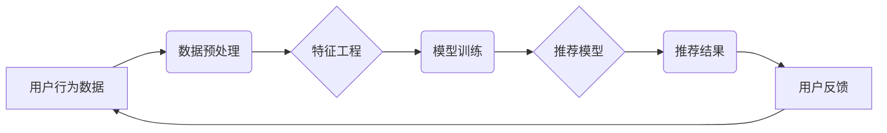

                 

## 电商平台搜索推荐系统的AI 大模型实践：提高转化率与用户体验

> 关键词：电商平台、搜索推荐系统、AI 大模型、转化率、用户体验、深度学习、自然语言处理、推荐算法、个性化推荐

## 1. 背景介绍

在当今数字化时代，电商平台已成为人们购物的首选方式。然而，面对海量商品和用户需求，如何精准匹配用户需求，提高用户购物体验和平台转化率成为了电商平台面临的重大挑战。传统的搜索推荐系统基于规则或基于内容的算法，难以满足用户个性化需求和平台快速发展的要求。

近年来，随着深度学习技术的快速发展，AI 大模型在搜索推荐系统领域展现出巨大的潜力。AI 大模型能够学习用户行为、商品特征等海量数据，构建更精准的推荐模型，从而提升用户体验和平台转化率。

## 2. 核心概念与联系

### 2.1  搜索推荐系统

搜索推荐系统是电商平台的核心功能之一，旨在帮助用户快速找到所需商品，并根据用户的兴趣和偏好提供个性化的商品推荐。

### 2.2  AI 大模型

AI 大模型是指在海量数据上训练的深度学习模型，具有强大的学习和泛化能力。在搜索推荐系统中，AI 大模型可以用于用户画像构建、商品特征提取、推荐模型训练等环节，提升推荐系统的精准度和个性化程度。

### 2.3  核心架构

电商平台搜索推荐系统的AI 大模型实践通常采用以下核心架构：



**流程图说明：**

1. **用户行为数据：** 收集用户浏览、搜索、购买、评价等行为数据。
2. **数据预处理：** 对用户行为数据进行清洗、转换、编码等预处理操作。
3. **特征工程：** 从用户行为数据中提取用户画像、商品特征等关键信息，构建特征向量。
4. **模型训练：** 利用深度学习算法，训练推荐模型，例如协同过滤、深度神经网络等。
5. **推荐模型：** 训练好的推荐模型用于预测用户对商品的兴趣和偏好。
6. **推荐结果：** 推荐模型根据预测结果，生成个性化的商品推荐列表。
7. **用户反馈：** 用户对推荐结果进行点击、购买、评价等反馈，反馈数据用于模型优化和迭代。

## 3. 核心算法原理 & 具体操作步骤

### 3.1  算法原理概述

在电商平台搜索推荐系统中，常用的算法包括：

* **协同过滤算法：** 基于用户之间的相似性和商品之间的相似性，推荐用户可能感兴趣的商品。
* **内容过滤算法：** 基于商品的属性和描述信息，推荐与用户兴趣相符的商品。
* **深度学习算法：** 利用深度神经网络，学习用户行为和商品特征之间的复杂关系，进行更精准的推荐。

### 3.2  算法步骤详解

**协同过滤算法步骤：**

1. **构建用户-商品交互矩阵：** 将用户和商品映射到矩阵中，每个元素表示用户对商品的交互行为（例如评分、购买等）。
2. **计算用户相似度：** 使用余弦相似度等方法，计算用户之间的相似度。
3. **计算商品相似度：** 使用余弦相似度等方法，计算商品之间的相似度。
4. **推荐商品：** 对于给定用户，根据其相似用户或相似商品的交互行为，推荐用户可能感兴趣的商品。

**内容过滤算法步骤：**

1. **提取商品特征：** 从商品的属性、描述信息等中提取特征向量。
2. **构建用户兴趣模型：** 根据用户的历史交互行为，构建用户兴趣模型，例如用户喜欢的商品类别、品牌等。
3. **计算商品与用户兴趣匹配度：** 使用余弦相似度等方法，计算商品特征向量与用户兴趣模型之间的匹配度。
4. **推荐商品：** 推荐与用户兴趣匹配度最高的商品。

**深度学习算法步骤：**

1. **数据预处理：** 对用户行为数据和商品特征数据进行预处理，例如特征提取、编码等。
2. **模型构建：** 使用深度神经网络，构建推荐模型，例如多层感知机、循环神经网络等。
3. **模型训练：** 利用训练数据，训练推荐模型，优化模型参数。
4. **模型评估：** 使用测试数据，评估模型的推荐效果，例如准确率、召回率等。
5. **模型部署：** 将训练好的模型部署到生产环境中，用于实时推荐。

### 3.3  算法优缺点

| 算法类型 | 优点 | 缺点 |
|---|---|---|
| 协同过滤 | 能够发现用户之间的隐性关联，推荐个性化商品 | 需要大量用户交互数据，容易出现冷启动问题 |
| 内容过滤 | 基于商品特征，推荐更精准的商品 | 容易陷入局部最优，缺乏用户个性化 |
| 深度学习 | 能够学习用户行为和商品特征之间的复杂关系，推荐更精准的商品 | 需要大量数据和计算资源，模型训练复杂 |

### 3.4  算法应用领域

* **电商平台商品推荐**
* **社交媒体内容推荐**
* **音乐平台歌曲推荐**
* **视频平台视频推荐**
* **新闻平台新闻推荐**

## 4. 数学模型和公式 & 详细讲解 & 举例说明

### 4.1  数学模型构建

在协同过滤算法中，用户-商品交互矩阵可以表示为一个 $m \times n$ 的矩阵 $R$，其中 $m$ 表示用户数量，$n$ 表示商品数量。每个元素 $R_{ij}$ 表示用户 $i$ 对商品 $j$ 的交互行为。

### 4.2  公式推导过程

**余弦相似度计算公式：**

$$
\text{相似度}(u_i, u_j) = \frac{u_i \cdot u_j}{||u_i|| ||u_j||}
$$

其中：

* $u_i$ 和 $u_j$ 表示用户 $i$ 和用户 $j$ 的特征向量。
* $u_i \cdot u_j$ 表示用户 $i$ 和用户 $j$ 的内积。
* $||u_i||$ 和 $||u_j||$ 表示用户 $i$ 和用户 $j$ 的特征向量长度。

**举例说明：**

假设有两个用户 $u_1$ 和 $u_2$，他们的特征向量分别为：

* $u_1 = [1, 2, 3]$
* $u_2 = [2, 3, 1]$

则他们的余弦相似度为：

$$
\text{相似度}(u_1, u_2) = \frac{1 \cdot 2 + 2 \cdot 3 + 3 \cdot 1}{\sqrt{1^2 + 2^2 + 3^2} \sqrt{2^2 + 3^2 + 1^2}} = \frac{11}{\sqrt{14} \sqrt{14}} = \frac{11}{14}
$$

### 4.3  案例分析与讲解

在电商平台搜索推荐系统中，可以使用协同过滤算法推荐用户可能感兴趣的商品。例如，如果用户 $A$ 和用户 $B$ 对相同的商品都给予了高评分，则可以认为用户 $A$ 和用户 $B$ 的兴趣相似。因此，如果用户 $A$ 浏览了商品 $X$，则可以推荐用户 $B$ 也可能感兴趣的商品 $X$。

## 5. 项目实践：代码实例和详细解释说明

### 5.1  开发环境搭建

* Python 3.x
* TensorFlow 或 PyTorch 深度学习框架
* Scikit-learn 机器学习库
* Pandas 数据处理库
* Matplotlib 数据可视化库

### 5.2  源代码详细实现

```python
# 导入必要的库
import pandas as pd
from sklearn.metrics.pairwise import cosine_similarity

# 加载用户-商品交互数据
data = pd.read_csv('user_item_interactions.csv')

# 构建用户-商品交互矩阵
user_item_matrix = data.pivot_table(index='user_id', columns='item_id', values='rating')

# 计算用户相似度
user_similarity = cosine_similarity(user_item_matrix)

# 获取用户 $A$ 的相似用户
user_A_id = 1
similar_users = user_similarity[user_A_id].argsort()[:-6:-1]  # 排序获取前 5 个相似用户

# 推荐商品
recommended_items = []
for user_B_id in similar_users:
    for item_id in user_item_matrix.columns:
        if user_item_matrix.loc[user_B_id, item_id] > 0 and item_id not in recommended_items:
            recommended_items.append(item_id)

# 打印推荐结果
print(f'推荐给用户 {user_A_id} 的商品：{recommended_items}')
```

### 5.3  代码解读与分析

* 首先，加载用户-商品交互数据，并构建用户-商品交互矩阵。
* 然后，使用余弦相似度计算用户之间的相似度。
* 接下来，获取用户 $A$ 的相似用户，并遍历相似用户的交互行为，推荐用户 $A$ 可能感兴趣的商品。

### 5.4  运行结果展示

运行上述代码，将输出用户 $A$ 的推荐商品列表。

## 6. 实际应用场景

### 6.1  电商平台商品推荐

电商平台可以利用 AI 大模型构建个性化商品推荐系统，根据用户的浏览历史、购买记录、评价等信息，推荐用户可能感兴趣的商品，提高用户购物体验和转化率。

### 6.2  搜索结果排序

AI 大模型可以学习用户搜索行为和商品特征之间的关系，对搜索结果进行排序，将更符合用户需求的商品排在前面，提升用户搜索体验。

### 6.3  用户画像构建

AI 大模型可以分析用户的行为数据，构建用户画像，例如用户的年龄、性别、兴趣爱好等，为用户提供更精准的个性化服务。

### 6.4  未来应用展望

* **多模态推荐：** 将文本、图像、视频等多模态数据融合到推荐系统中，提供更丰富的用户体验。
* **实时推荐：** 利用实时数据流，进行动态的商品推荐，满足用户不断变化的需求。
* **个性化营销：** 基于用户画像，进行精准的营销推广，提高营销效果。

## 7. 工具和资源推荐

### 7.1  学习资源推荐

* **深度学习书籍：** 《深度学习》 (Ian Goodfellow, Yoshua Bengio, Aaron Courville)
* **在线课程：** Coursera, edX, Udacity 等平台提供深度学习相关的课程。
* **开源项目：** TensorFlow, PyTorch 等深度学习框架的官方文档和开源项目。

### 7.2  开发工具推荐

* **Python:** 作为深度学习开发的主要语言。
* **TensorFlow:** Google 开发的开源深度学习框架。
* **PyTorch:** Facebook 开发的开源深度学习框架。
* **Jupyter Notebook:** 用于深度学习代码开发和可视化分析的工具。

### 7.3  相关论文推荐

* **Collaborative Filtering for Implicit Feedback Datasets** (Rendle et al., 2010)
* **Deep Learning Recommendations for Everyone** (Wang-Cheng Kang et al., 2019)
* **Neural Collaborative Filtering** (He et al., 2017)

## 8. 总结：未来发展趋势与挑战

### 8.1  研究成果总结

AI 大模型在电商平台搜索推荐系统中取得了显著的成果，能够提升推荐精准度和用户体验。

### 8.2  未来发展趋势

* **模型复杂度提升：** 探索更复杂的深度学习模型，例如 Transformer、Graph Neural Network 等，提升推荐效果。
* **数据融合与多模态推荐：** 将文本、图像、视频等多模态数据融合到推荐系统中，提供更丰富的用户体验。
* **个性化与可解释性：** 提升推荐系统的个性化程度，并提高模型的可解释性，帮助用户理解推荐结果。

### 8.3  面临的挑战

* **数据质量与隐私保护：** 确保推荐系统训练数据质量，并保护用户隐私。
* **模型训练成本与效率：** 降低模型训练成本和时间，提高模型训练效率。
* **算法公平性与可控性：** 确保推荐算法公平公正，并提高模型的可控性。

### 8.4  研究展望

未来，AI 大模型在电商平台搜索推荐系统领域将继续发挥重要作用，推动推荐系统的智能化、个性化和可解释性发展。


## 9. 附录：常见问题与解答

**Q1：如何解决冷启动问题？**

**A1：** 冷启动问题是指新用户或新商品缺乏历史交互数据，难以进行推荐。可以采用以下方法解决：

* **基于内容过滤：** 利用商品的属性和描述信息，推荐与用户兴趣相符的商品。
* **基于流行度过滤：** 推荐平台上受欢迎的商品。
* **用户反馈引导：** 鼓励用户对新商品进行评分或评价，收集更多数据。

**Q2：如何评估推荐系统的效果？**

**A2：** 推荐系统的效果可以评估以下指标：

* **点击率 (CTR)：** 用户点击推荐商品的比例。
* **转化率 (CVR)：** 用户点击推荐商品后购买商品的比例。
* **平均评分 (Average Rating)：** 用户对推荐商品的平均评分。
* **用户满意度 (User Satisfaction)：** 用户对推荐系统的满意度。

**Q3：如何保证推荐系统的公平性？**

**A3：** 确保推荐算法公平公正，避免歧视或偏见，可以通过以下方法：

* **数据预处理：** 剔除可能导致偏见的特征。
* **算法设计：** 使用公平性算法，例如对抗训练。
* **模型评估：** 使用公平性指标评估模型性能。


作者：禅与计算机程序设计艺术 / Zen and the Art of Computer Programming


<end_of_turn>

