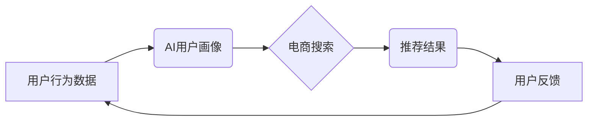

                 

## 电商搜索中的AI用户画像动态更新

> 关键词：AI用户画像、电商搜索、动态更新、机器学习、深度学习、推荐系统

## 1. 背景介绍

在当今数据爆炸的时代，电商平台积累了海量用户行为数据，这些数据蕴藏着丰富的用户画像信息。传统的静态用户画像难以捕捉用户行为的动态变化，导致推荐结果缺乏个性化和时效性，从而影响用户体验和转化率。

AI技术的发展为构建动态更新的用户画像提供了新的机遇。通过机器学习和深度学习算法，电商平台可以实时分析用户行为数据，构建动态的用户画像，并根据用户画像的变化及时调整推荐策略，提升用户体验和商业效益。

## 2. 核心概念与联系

### 2.1 AI用户画像

AI用户画像是指利用人工智能技术，基于用户行为数据、偏好信息、社交关系等多维度数据，构建一个动态、多层次、个性化的用户画像。

### 2.2 电商搜索

电商搜索是指用户在电商平台上输入关键词或商品名称，系统根据用户搜索历史、浏览记录、购买行为等信息，返回与用户需求匹配的商品列表。

### 2.3 动态更新

动态更新是指用户画像根据用户行为数据实时变化，并不断更新和完善，以反映用户最新的兴趣、需求和偏好。

**核心概念关系架构图**



## 3. 核心算法原理 & 具体操作步骤

### 3.1 算法原理概述

构建动态更新的AI用户画像主要依赖于机器学习和深度学习算法。常见的算法包括：

* **协同过滤算法:** 基于用户之间的相似性或商品之间的相似性，推荐用户可能感兴趣的商品。
* **内容过滤算法:** 基于商品的特征和用户历史偏好，推荐与用户兴趣相符的商品。
* **深度学习推荐算法:** 利用深度神经网络，从海量用户行为数据中学习用户兴趣和偏好，进行更精准的商品推荐。

### 3.2 算法步骤详解

1. **数据收集:** 收集用户行为数据，包括搜索历史、浏览记录、购买记录、评价信息、购物车信息等。
2. **数据预处理:** 对收集到的数据进行清洗、转换、特征提取等预处理操作，以便于算法训练。
3. **模型训练:** 选择合适的机器学习或深度学习算法，对预处理后的数据进行训练，构建用户画像模型。
4. **模型评估:** 使用测试数据对模型进行评估，并根据评估结果进行模型调优。
5. **动态更新:** 实时收集用户行为数据，并根据数据更新用户画像模型，保证用户画像的时效性和准确性。

### 3.3 算法优缺点

| 算法类型 | 优点 | 缺点 |
|---|---|---|
| 协同过滤 | 能够发现用户之间的隐性关联，推荐个性化商品 | 数据稀疏性问题，冷启动问题 |
| 内容过滤 | 基于商品特征，推荐与用户兴趣相符的商品 | 容易陷入局部最优，缺乏多样性 |
| 深度学习 | 能够学习用户兴趣和偏好的复杂关系，推荐更精准的商品 | 需要大量数据进行训练，模型复杂度高 |

### 3.4 算法应用领域

* **电商推荐:** 根据用户画像，推荐个性化商品，提升用户转化率。
* **内容推荐:** 根据用户兴趣，推荐个性化内容，提升用户粘性。
* **广告投放:** 根据用户画像，精准投放广告，提升广告效果。
* **用户画像分析:** 分析用户画像，洞察用户需求和行为模式，为产品开发和市场营销提供决策支持。

## 4. 数学模型和公式 & 详细讲解 & 举例说明

### 4.1 数学模型构建

协同过滤算法的核心是计算用户之间或商品之间的相似度。常用的相似度度量方法包括余弦相似度和皮尔逊相关系数。

**余弦相似度:**

$$
\text{相似度} = \frac{\mathbf{u} \cdot \mathbf{v}}{\|\mathbf{u}\| \|\mathbf{v}\|}
$$

其中，$\mathbf{u}$ 和 $\mathbf{v}$ 分别表示两个用户的向量表示，$\cdot$ 表示向量点积，$\|\mathbf{u}\|$ 和 $\|\mathbf{v}\|$ 分别表示两个向量的模长。

**皮尔逊相关系数:**

$$
\text{相关系数} = \frac{\sum_{i=1}^{n}(u_i - \bar{u})(v_i - \bar{v})}{\sqrt{\sum_{i=1}^{n}(u_i - \bar{u})^2} \sqrt{\sum_{i=1}^{n}(v_i - \bar{v})^2}}
$$

其中，$u_i$ 和 $v_i$ 分别表示两个用户在第 $i$ 个商品上的评分，$\bar{u}$ 和 $\bar{v}$ 分别表示两个用户的平均评分。

### 4.2 公式推导过程

余弦相似度的推导过程基于向量空间模型。用户和商品可以看作是向量空间中的点，用户之间的相似度可以通过向量之间的夹角来度量。余弦相似度等于两个向量的夹角的余弦值，夹角越小，相似度越高。

皮尔逊相关系数的推导过程基于统计学中的相关分析。相关系数度量了两个变量之间的线性相关性。

### 4.3 案例分析与讲解

假设有两个用户A和B，他们在以下三个商品上的评分如下：

| 商品 | 用户A评分 | 用户B评分 |
|---|---|---|
| 商品1 | 5 | 4 |
| 商品2 | 3 | 2 |
| 商品3 | 4 | 5 |

我们可以使用余弦相似度或皮尔逊相关系数来计算用户A和B之间的相似度。

## 5. 项目实践：代码实例和详细解释说明

### 5.1 开发环境搭建

* Python 3.x
* scikit-learn
* pandas
* numpy

### 5.2 源代码详细实现

```python
import pandas as pd
from sklearn.metrics.pairwise import cosine_similarity

# 加载用户评分数据
data = pd.read_csv('user_rating.csv')

# 构建用户评分矩阵
user_item_matrix = data.pivot_table(index='user_id', columns='item_id', values='rating')

# 计算用户之间的余弦相似度
user_similarity = cosine_similarity(user_item_matrix)

# 打印用户相似度矩阵
print(user_similarity)
```

### 5.3 代码解读与分析

* 首先，我们使用pandas库加载用户评分数据。
* 然后，我们使用pivot_table方法构建用户评分矩阵，其中行表示用户ID，列表示商品ID，值表示用户对商品的评分。
* 接着，我们使用scikit-learn库中的cosine_similarity函数计算用户之间的余弦相似度。
* 最后，我们打印用户相似度矩阵，其中每个元素表示两个用户之间的相似度。

### 5.4 运行结果展示

运行上述代码后，会输出一个用户相似度矩阵，其中每个元素表示两个用户之间的相似度。相似度值介于0和1之间，值越大，表示两个用户之间的相似度越高。

## 6. 实际应用场景

### 6.1 个性化推荐

根据用户画像，电商平台可以为用户推荐个性化的商品，提升用户体验和转化率。例如，如果用户经常购买运动鞋，电商平台可以推荐用户其他运动品牌或运动相关的商品。

### 6.2 内容推荐

根据用户兴趣，电商平台可以推荐个性化的内容，提升用户粘性。例如，如果用户喜欢阅读时尚类文章，电商平台可以推荐用户其他时尚类文章或视频。

### 6.3 广告投放

根据用户画像，电商平台可以精准投放广告，提升广告效果。例如，如果用户经常购买化妆品，电商平台可以向用户投放化妆品广告。

### 6.4 用户画像分析

分析用户画像，洞察用户需求和行为模式，为产品开发和市场营销提供决策支持。例如，电商平台可以分析用户画像，了解用户最喜欢的商品类别、价格区间、购买时间等信息，从而制定更有效的营销策略。

### 6.5 未来应用展望

随着人工智能技术的不断发展，AI用户画像的应用场景将更加广泛。例如，可以利用AI用户画像进行精准的客户服务、个性化的教育推荐、智能的医疗诊断等。

## 7. 工具和资源推荐

### 7.1 学习资源推荐

* **书籍:**
    * 《推荐系统实践》
    * 《深度学习》
* **在线课程:**
    * Coursera: Machine Learning
    * edX: Deep Learning

### 7.2 开发工具推荐

* **Python:** 
    * scikit-learn
    * pandas
    * numpy
* **Spark:** 
    * Apache Spark MLlib

### 7.3 相关论文推荐

* **Collaborative Filtering for Implicit Feedback Datasets**
* **Deep Learning for Recommender Systems**

## 8. 总结：未来发展趋势与挑战

### 8.1 研究成果总结

AI用户画像技术在电商搜索、推荐系统等领域取得了显著成果，能够为用户提供更个性化、更精准的服务。

### 8.2 未来发展趋势

* **多模态用户画像:** 将文本、图像、视频等多模态数据融合到用户画像中，构建更全面的用户画像。
* **动态更新与实时分析:** 利用实时数据流，动态更新用户画像，并进行实时分析，以满足用户不断变化的需求。
* **个性化模型训练:** 基于用户的个性化需求，训练个性化的用户画像模型，提供更精准的推荐服务。

### 8.3 面临的挑战

* **数据隐私保护:** 用户数据隐私保护是一个重要的挑战，需要开发更加安全可靠的数据处理和分析技术。
* **算法解释性:** 深度学习模型的解释性较差，难以理解模型的决策过程，需要开发更加可解释的算法模型。
* **模型公平性:** 用户画像模型可能存在偏见，导致推荐结果不公平，需要开发更加公平的算法模型。

### 8.4 研究展望

未来，AI用户画像技术将继续发展，并应用于更多领域。研究者将继续探索新的算法模型、数据处理技术和应用场景，以构建更智能、更个性化的用户体验。

## 9. 附录：常见问题与解答

### 9.1 如何构建用户画像？

构建用户画像需要收集用户行为数据，并使用机器学习或深度学习算法进行分析和建模。

### 9.2 如何评估用户画像的准确性？

可以使用用户反馈、点击率、转化率等指标来评估用户画像的准确性。

### 9.3 如何保证用户数据隐私？

可以使用数据加密、匿名化等技术来保护用户数据隐私。


作者：禅与计算机程序设计艺术 / Zen and the Art of Computer Programming 
<end_of_turn>

