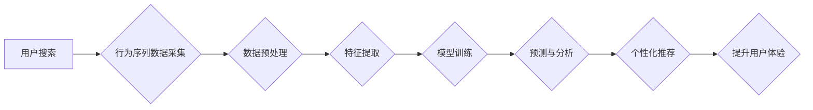

                 

## 电商搜索中的AI用户行为序列分析

> 关键词：电商搜索、用户行为序列、AI分析、推荐系统、深度学习、序列模型、自然语言处理

## 1. 背景介绍

在当今数字经济时代，电商平台已成为人们获取商品和服务的首选方式。用户在电商平台上的搜索行为是其消费决策的重要环节，蕴含着丰富的消费意图和偏好信息。传统的电商搜索引擎主要依靠关键词匹配和商品属性检索，难以捕捉用户行为背后的复杂逻辑和潜在需求。

随着人工智能技术的快速发展，AI用户行为序列分析成为电商搜索领域的新兴热点。通过对用户搜索历史、浏览记录、购买行为等序列数据的分析，可以挖掘用户潜在需求，个性化推荐商品，提升用户体验和转化率。

## 2. 核心概念与联系

### 2.1 用户行为序列

用户行为序列是指用户在电商平台上进行一系列交互行为的记录，例如：搜索关键词、浏览商品、加入购物车、下单购买等。这些行为之间存在着一定的关联性和时间依赖性，可以反映用户的兴趣偏好、消费习惯和决策过程。

### 2.2 AI序列分析

AI序列分析是指利用人工智能技术对用户行为序列进行分析和挖掘，以获取用户行为背后的潜在模式和规律。常用的AI序列分析方法包括：

* **统计模型:**  例如Markov链、Hidden Markov模型等，可以分析用户行为之间的转移概率和隐藏状态。
* **机器学习模型:**  例如支持向量机、决策树、随机森林等，可以根据历史数据预测用户的未来行为。
* **深度学习模型:**  例如循环神经网络(RNN)、长短期记忆网络(LSTM)、Transformer等，可以学习用户行为序列的复杂非线性关系。

### 2.3 电商搜索场景

在电商搜索场景中，AI用户行为序列分析可以应用于以下几个方面：

* **个性化推荐:**  根据用户的搜索历史和浏览记录，推荐与其兴趣相关的商品。
* **搜索结果排序:**  根据用户的行为序列，调整搜索结果的排序，提升用户搜索体验。
* **搜索建议:**  根据用户的输入，预测其可能搜索的关键词，提供智能搜索建议。
* **用户画像构建:**  通过分析用户的行为序列，构建其个性化的用户画像，为精准营销提供支持。

**Mermaid 流程图**



## 3. 核心算法原理 & 具体操作步骤

### 3.1 算法原理概述

本文将重点介绍循环神经网络(RNN)及其变体LSTM在电商搜索中的应用。RNN是一种专门设计用于处理序列数据的深度学习模型，其核心特点是具有记忆机制，可以捕捉序列数据中的时间依赖性。

LSTM是一种改进的RNN结构，通过引入门控机制，可以更有效地学习长序列数据中的信息，解决传统RNN的梯度消失问题。

### 3.2 算法步骤详解

1. **数据预处理:** 收集用户行为序列数据，进行清洗、格式化和编码。例如，将搜索关键词转换为词向量表示，将用户行为转换为数字标签。
2. **特征提取:** 从预处理后的数据中提取特征，例如：关键词频率、商品类别、用户属性等。
3. **模型训练:** 使用LSTM模型对提取的特征进行训练，学习用户行为序列的潜在模式和规律。训练过程中，需要设置合适的模型参数，例如：隐藏层大小、学习率等。
4. **预测与分析:** 将训练好的模型应用于新的用户行为序列数据，预测用户的未来行为，例如：下一个搜索关键词、下一个点击的商品等。

### 3.3 算法优缺点

**优点:**

* 能够捕捉序列数据中的时间依赖性，学习复杂的用户行为模式。
* 具有较强的泛化能力，可以应用于不同的电商搜索场景。

**缺点:**

* 训练时间较长，需要大量的训练数据。
* 模型参数较多，需要进行细致的调优。

### 3.4 算法应用领域

* **电商搜索推荐:**  根据用户的搜索历史和浏览记录，推荐与其兴趣相关的商品。
* **个性化广告投放:**  根据用户的行为序列，精准投放广告，提升广告效果。
* **用户行为分析:**  分析用户的行为模式，了解其消费习惯和偏好，为产品开发和市场营销提供 insights。

## 4. 数学模型和公式 & 详细讲解 & 举例说明

### 4.1 数学模型构建

LSTM模型的核心是其门控机制，通过三个门控：输入门、遗忘门和输出门，控制信息的流动和记忆。

**输入门:**  决定哪些信息会被添加到细胞状态中。

**遗忘门:**  决定哪些信息会被从细胞状态中遗忘。

**输出门:**  决定哪些信息会被从细胞状态中输出。

### 4.2 公式推导过程

LSTM模型的数学公式比较复杂，这里只列出一些关键公式：

* **输入门:**  $i_t = \sigma(W_i * [h_{t-1}, x_t] + b_i)$
* **遗忘门:**  $f_t = \sigma(W_f * [h_{t-1}, x_t] + b_f)$
* **候选细胞状态:**  $\tilde{C}_t = \tanh(W_c * [h_{t-1}, x_t] + b_c)$
* **细胞状态:**  $C_t = f_t * C_{t-1} + i_t * \tilde{C}_t$
* **输出门:**  $o_t = \sigma(W_o * [h_{t-1}, x_t] + b_o)$
* **输出:**  $h_t = o_t * \tanh(C_t)$

其中，$x_t$ 是当前时间步的输入，$h_{t-1}$ 是上一个时间步的输出，$C_t$ 是当前时间步的细胞状态，$W$ 和 $b$ 分别是权重矩阵和偏置向量，$\sigma$ 是 sigmoid 函数，$\tanh$ 是 hyperbolic tangent 函数。

### 4.3 案例分析与讲解

假设用户在电商平台上搜索了以下关键词序列：

"手机", "华为手机", "华为P50", "华为P50价格"

我们可以使用LSTM模型分析这个序列，并预测用户的下一个搜索行为。

通过训练LSTM模型，我们可以学习到用户在搜索手机时，会逐渐细化搜索范围，最终关注具体的商品信息和价格。因此，LSTM模型可以预测用户的下一个搜索行为为 "华为P50购买" 或 "华为P50评价"。

## 5. 项目实践：代码实例和详细解释说明

### 5.1 开发环境搭建

* Python 3.6+
* TensorFlow/Keras

### 5.2 源代码详细实现

```python
from tensorflow.keras.models import Sequential
from tensorflow.keras.layers import LSTM, Dense

# 定义LSTM模型
model = Sequential()
model.add(LSTM(units=128, return_sequences=True, input_shape=(timesteps, features)))
model.add(LSTM(units=64))
model.add(Dense(units=1, activation='sigmoid'))

# 编译模型
model.compile(loss='binary_crossentropy', optimizer='adam', metrics=['accuracy'])

# 训练模型
model.fit(X_train, y_train, epochs=10, batch_size=32)

# 评估模型
loss, accuracy = model.evaluate(X_test, y_test)
print('Test Loss:', loss)
print('Test Accuracy:', accuracy)
```

### 5.3 代码解读与分析

* **导入必要的库:**  TensorFlow/Keras库用于构建和训练LSTM模型。
* **定义LSTM模型:**  使用Sequential模型构建一个多层LSTM网络。
* **编译模型:**  设置模型的损失函数、优化器和评价指标。
* **训练模型:**  使用训练数据训练模型，设置训练轮数和批处理大小。
* **评估模型:**  使用测试数据评估模型的性能。

### 5.4 运行结果展示

训练完成后，可以查看模型的训练损失和测试准确率，评估模型的性能。

## 6. 实际应用场景

### 6.1 个性化推荐

电商平台可以利用用户行为序列分析，为用户提供个性化的商品推荐。例如，根据用户的搜索历史和浏览记录，推荐与其兴趣相关的商品，提升用户购物体验。

### 6.2 搜索结果排序

电商平台可以根据用户的行为序列，调整搜索结果的排序，提升用户搜索体验。例如，将用户之前点击过的商品排在前面，提高用户找到所需商品的效率。

### 6.3 搜索建议

电商平台可以根据用户的输入，预测其可能搜索的关键词，提供智能搜索建议。例如，当用户输入 "手机" 时，可以建议 "华为手机", "苹果手机", "小米手机" 等关键词。

### 6.4 未来应用展望

随着人工智能技术的不断发展，AI用户行为序列分析在电商搜索领域的应用将更加广泛和深入。例如：

* **更精准的个性化推荐:**  利用更先进的深度学习模型，例如Transformer，可以更精准地理解用户的需求，提供更个性化的商品推荐。
* **更智能的搜索建议:**  结合自然语言处理技术，可以更智能地理解用户的搜索意图，提供更精准的搜索建议。
* **更丰富的用户画像:**  通过分析用户的行为序列，可以构建更丰富的用户画像，为产品开发和市场营销提供更精准的 insights。

## 7. 工具和资源推荐

### 7.1 学习资源推荐

* **书籍:**
    * 深度学习
    * 自然语言处理
* **在线课程:**
    * Coursera: 深度学习
    * Udacity: 自然语言处理
* **博客:**
    * TensorFlow Blog
    * Keras Blog

### 7.2 开发工具推荐

* **TensorFlow:**  开源深度学习框架
* **Keras:**  基于TensorFlow的高级API
* **PyTorch:**  另一个流行的深度学习框架

### 7.3 相关论文推荐

* **Recurrent Neural Network for Sequence Learning**
* **Long Short-Term Memory**
* **Attention Is All You Need**

## 8. 总结：未来发展趋势与挑战

### 8.1 研究成果总结

AI用户行为序列分析在电商搜索领域取得了显著的成果，例如：

* **提升用户体验:**  个性化推荐、搜索结果排序和搜索建议等功能，提升了用户的购物体验。
* **提高转化率:**  精准的商品推荐，提高了用户的购买意愿和转化率。
* **挖掘用户需求:**  分析用户的行为序列，可以挖掘用户的潜在需求，为产品开发和市场营销提供 insights。

### 8.2 未来发展趋势

* **更精准的模型:**  利用更先进的深度学习模型，例如Transformer，可以更精准地理解用户的需求，提供更个性化的商品推荐。
* **更丰富的特征:**  结合更多用户数据，例如用户画像、地理位置等，可以构建更丰富的特征，提升模型的预测精度。
* **更个性化的服务:**  根据用户的行为序列，提供更个性化的服务，例如定制化商品推荐、个性化营销等。

### 8.3 面临的挑战

* **数据隐私:**  用户行为数据涉及用户的隐私信息，需要妥善处理和保护。
* **模型解释性:**  深度学习模型的决策过程比较复杂，难以解释，需要研究更可解释的模型。
* **模型鲁棒性:**  模型需要能够应对各种异常数据和场景，提高模型的鲁棒性。

### 8.4 研究展望

未来，AI用户行为序列分析将在电商搜索领域继续发挥重要作用，为用户提供更智能、更个性化的购物体验。


## 9. 附录：常见问题与解答

**Q1: LSTM模型的优势是什么？**

**A1:** LSTM模型能够捕捉序列数据中的时间依赖性，学习复杂的用户行为模式，具有较强的泛化能力。

**Q2: 如何处理用户行为序列中的缺失数据？**

**A2:** 可以使用多种方法处理缺失数据，例如：

* 使用平均值或中位数填充缺失值。
* 使用机器学习模型预测缺失值。
* 使用特殊的标记表示缺失值。

**Q3: 如何评估LSTM模型的性能？**

**A3:** 可以使用多种指标评估LSTM模型的性能，例如：

* 准确率
* 召回率
* F1-score
* AUC

**Q4: 如何选择LSTM模型的超参数？**

**A4:** 可以使用交叉验证等方法选择LSTM模型的超参数，例如：

* 隐藏层大小
* 学习率
* 训练轮数

**Q5: 如何部署LSTM模型？**

**A5:** 可以使用多种方法部署LSTM模型，例如：

* 使用云平台提供的服务，例如AWS SageMaker、Google Cloud AI Platform。
* 部署到本地服务器。
* 使用容器技术，例如Docker，部署到不同的环境中。


作者：禅与计算机程序设计艺术 / Zen and the Art of Computer Programming 
<end_of_turn>

