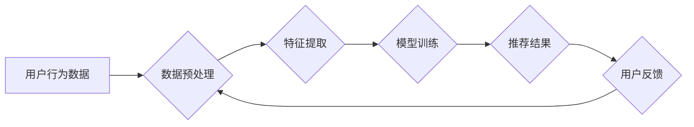

                 

## 电商搜索的用户隐式反馈挖掘与利用

> 关键词：电商搜索、用户隐式反馈、推荐系统、协同过滤、矩阵分解、深度学习、自然语言处理

## 1. 背景介绍

在当今数据爆炸的时代，电商平台面临着海量商品和用户，如何精准推荐用户感兴趣的商品，提升用户体验和转化率成为关键挑战。传统的电商搜索主要依赖用户显式反馈，如关键词搜索、评分、评论等，但这些反馈往往是主观且不全面。用户隐式反馈，即用户在浏览、点击、购买等行为中无意间产生的数据，蕴含着丰富的用户偏好信息，为精准推荐提供了新的思路。

用户隐式反馈的挖掘与利用，能够帮助电商平台：

* **提升搜索结果的精准度:** 通过分析用户浏览、点击等行为，更准确地理解用户的搜索意图，推荐更符合用户需求的商品。
* **个性化推荐:** 根据用户的历史行为和偏好，提供个性化的商品推荐，提升用户体验和购买意愿。
* **发现用户潜在需求:** 通过挖掘用户隐式反馈中的模式和趋势，发现用户潜在的需求，为新品开发和市场营销提供参考。

## 2. 核心概念与联系

### 2.1 用户隐式反馈

用户隐式反馈是指用户在与系统交互过程中，无意间产生的行为数据，例如：

* **浏览行为:** 用户浏览商品的页面、点击商品图片、查看商品详情等。
* **搜索行为:** 用户输入的搜索关键词、搜索结果的点击次数、搜索结果的停留时间等。
* **购买行为:** 用户添加商品到购物车、购买商品、评价商品等。

这些行为数据虽然没有直接表达用户意图，但蕴含着用户的兴趣、偏好和需求信息。

### 2.2 推荐系统

推荐系统旨在根据用户的历史行为和偏好，预测用户对商品的兴趣，并推荐相关的商品。推荐系统可以分为以下几类：

* **基于内容的推荐:** 根据商品的属性和描述，推荐与用户历史行为相似的商品。
* **基于协同过滤的推荐:** 根据其他用户对商品的评分和行为，推荐用户可能感兴趣的商品。
* **基于混合方法的推荐:** 结合多种推荐算法，提高推荐的准确性和个性化程度。

### 2.3 隐式反馈在推荐系统中的应用

用户隐式反馈可以作为推荐系统的训练数据，用于构建更精准的推荐模型。例如，可以利用用户浏览和点击行为数据，训练基于协同过滤的推荐模型，预测用户对商品的兴趣。

**Mermaid 流程图**



## 3. 核心算法原理 & 具体操作步骤

### 3.1 算法原理概述

协同过滤算法是基于用户行为相似性的推荐算法，它假设用户对相似的商品有相似的偏好。协同过滤算法可以分为以下两种类型：

* **用户-基于协同过滤:** 根据用户之间的行为相似度，推荐用户可能感兴趣的商品。
* **商品-基于协同过滤:** 根据商品之间的相似度，推荐用户可能感兴趣的商品。

### 3.2 算法步骤详解

**用户-基于协同过滤:**

1. **数据收集:** 收集用户对商品的评分或行为数据。
2. **用户相似度计算:** 计算用户之间的相似度，常用的方法包括余弦相似度、皮尔逊相关系数等。
3. **推荐商品:** 对于给定用户，找到与该用户行为最相似的用户，并推荐这些用户喜欢的商品。

**商品-基于协同过滤:**

1. **数据收集:** 收集用户对商品的评分或行为数据。
2. **商品相似度计算:** 计算商品之间的相似度，常用的方法包括余弦相似度、皮尔逊相关系数等。
3. **推荐商品:** 对于给定用户，找到与用户喜欢的商品最相似的商品，并推荐这些商品。

### 3.3 算法优缺点

**优点:**

* 能够发现用户隐含的偏好。
* 不需要商品的显式特征信息。
* 推荐结果个性化程度高。

**缺点:**

* 数据稀疏性问题: 当用户对商品的评分或行为数据较少时，算法难以准确计算用户或商品之间的相似度。
* 冷启动问题: 当新用户或新商品加入系统时，算法难以对其进行推荐。
* 算法复杂度高: 计算用户或商品之间的相似度需要消耗大量的计算资源。

### 3.4 算法应用领域

协同过滤算法广泛应用于以下领域:

* **电商推荐:** 推荐商品、店铺、优惠券等。
* **音乐推荐:** 推荐歌曲、艺术家、专辑等。
* **电影推荐:** 推荐电影、演员、导演等。
* **社交推荐:** 推荐朋友、群组、活动等。

## 4. 数学模型和公式 & 详细讲解 & 举例说明

### 4.1 数学模型构建

协同过滤算法的核心是计算用户或商品之间的相似度。常用的相似度度量方法包括余弦相似度和皮尔逊相关系数。

**余弦相似度:**

$$
\text{相似度} = \frac{\mathbf{u} \cdot \mathbf{v}}{\|\mathbf{u}\| \|\mathbf{v}\|}
$$

其中，$\mathbf{u}$ 和 $\mathbf{v}$ 是两个用户的评分向量，$\cdot$ 表示点积，$\|\mathbf{u}\|$ 和 $\|\mathbf{v}\|$ 表示向量的模长。

**皮尔逊相关系数:**

$$
\text{相似度} = \frac{\sum_{i=1}^{n}(u_i - \bar{u})(v_i - \bar{v})}{\sqrt{\sum_{i=1}^{n}(u_i - \bar{u})^2} \sqrt{\sum_{i=1}^{n}(v_i - \bar{v})^2}}
$$

其中，$u_i$ 和 $v_i$ 是两个用户对第 $i$ 个商品的评分，$\bar{u}$ 和 $\bar{v}$ 是两个用户的平均评分。

### 4.2 公式推导过程

余弦相似度的推导过程如下:

1. 两个向量的点积表示两个向量在同一方向上的投影长度。
2. 向量的模长表示向量的长度。
3. 将点积除以两个向量的模长乘积，得到两个向量在同一方向上的投影长度与总长度的比值，即余弦相似度。

皮尔逊相关系数的推导过程如下:

1. 计算两个用户的评分与各自平均评分的偏差。
2. 计算两个用户评分偏差的乘积之和。
3. 计算两个用户评分偏差的平方和的平方根。
4. 将两个用户评分偏差的乘积之和除以两个用户评分偏差的平方和的平方根，得到皮尔逊相关系数。

### 4.3 案例分析与讲解

假设有两个用户A和B，他们对三个商品的评分如下:

| 商品 | 用户A | 用户B |
|---|---|---|
| 商品1 | 5 | 4 |
| 商品2 | 3 | 5 |
| 商品3 | 4 | 3 |

我们可以使用余弦相似度计算用户A和B之间的相似度:

1. 将用户A和B的评分向量表示为:

$$
\mathbf{u} = [5, 3, 4]
$$

$$
\mathbf{v} = [4, 5, 3]
$$

2. 计算两个向量的点积:

$$
\mathbf{u} \cdot \mathbf{v} = 5 \cdot 4 + 3 \cdot 5 + 4 \cdot 3 = 20 + 15 + 12 = 47
$$

3. 计算两个向量的模长:

$$
\|\mathbf{u}\| = \sqrt{5^2 + 3^2 + 4^2} = \sqrt{50}
$$

$$
\|\mathbf{v}\| = \sqrt{4^2 + 5^2 + 3^2} = \sqrt{50}
$$

4. 计算余弦相似度:

$$
\text{相似度} = \frac{47}{\sqrt{50} \sqrt{50}} = \frac{47}{50} = 0.94
$$

因此，用户A和B之间的余弦相似度为0.94，说明他们之间的行为相似度较高。

## 5. 项目实践：代码实例和详细解释说明

### 5.1 开发环境搭建

* **操作系统:** Linux/macOS/Windows
* **编程语言:** Python
* **库:** pandas, numpy, scikit-learn

### 5.2 源代码详细实现

```python
import pandas as pd
from sklearn.metrics.pairwise import cosine_similarity

# 加载用户评分数据
ratings_data = pd.read_csv('ratings.csv')

# 计算用户之间的余弦相似度
user_similarity = cosine_similarity(ratings_data)

# 获取用户A和用户B之间的相似度
user_A_id = 1
user_B_id = 2
similarity_score = user_similarity[user_A_id - 1][user_B_id - 1]

# 打印相似度
print(f'用户{user_A_id}和用户{user_B_id}之间的相似度为: {similarity_score}')
```

### 5.3 代码解读与分析

* **加载用户评分数据:** 使用pandas库读取用户评分数据，数据格式为CSV文件，包含用户ID、商品ID和评分信息。
* **计算用户之间的余弦相似度:** 使用scikit-learn库的cosine_similarity函数计算用户之间的余弦相似度矩阵。
* **获取用户A和用户B之间的相似度:** 根据用户ID获取用户之间的相似度值。
* **打印相似度:** 打印用户A和用户B之间的相似度值。

### 5.4 运行结果展示

运行上述代码后，会输出用户A和用户B之间的余弦相似度值。

## 6. 实际应用场景

### 6.1 电商搜索推荐

在电商搜索场景中，用户隐式反馈可以用于提升搜索结果的精准度。例如，当用户搜索“手机”时，系统可以根据用户浏览和点击历史记录，推荐与用户兴趣相符的手机型号。

### 6.2 个性化商品推荐

电商平台可以利用用户隐式反馈，为用户提供个性化的商品推荐。例如，根据用户的浏览和购买历史，推荐用户可能感兴趣的商品类别、品牌或款式。

### 6.3 新品推荐

电商平台可以利用用户隐式反馈，预测用户对新品的兴趣，并推荐相关新品。例如，根据用户对相似商品的浏览和购买行为，推荐用户可能感兴趣的新产品。

### 6.4 未来应用展望

随着数据量的不断增长和算法的不断改进，用户隐式反馈的挖掘与利用将发挥更加重要的作用。未来，用户隐式反馈可以应用于以下领域:

* **更精准的个性化推荐:** 利用深度学习等先进算法，挖掘用户更深层的兴趣和偏好，提供更精准的个性化推荐。
* **用户行为预测:** 利用用户隐式反馈预测用户的未来行为，例如购买意愿、浏览路径等，为电商平台提供更有效的营销策略。
* **商品推荐优化:** 利用用户隐式反馈优化商品的展示顺序和推荐策略，提升用户体验和转化率。

## 7. 工具和资源推荐

### 7.1 学习资源推荐

* **书籍:**
    * 推荐系统实践
    * 算法导论
* **在线课程:**
    * Coursera: Machine Learning
    * edX: Introduction to Artificial Intelligence

### 7.2 开发工具推荐

* **Python:** 
    * pandas
    * numpy
    * scikit-learn
* **Spark:** 
    * 用于大规模数据处理

### 7.3 相关论文推荐

* **Collaborative Filtering for Implicit Feedback Datasets**
* **Matrix Factorization Techniques for Recommender Systems**

## 8. 总结：未来发展趋势与挑战

### 8.1 研究成果总结

用户隐式反馈的挖掘与利用已经取得了显著的成果，为电商平台提供了更精准的推荐和个性化服务。

### 8.2 未来发展趋势

* **深度学习:** 利用深度学习算法挖掘用户隐式反馈中的更深层信息，提升推荐的精准度和个性化程度。
* **多模态数据融合:** 将用户隐式反馈与其他数据类型，如文本、图像、视频等融合，构建更全面的用户画像，提供更精准的推荐。
* **联邦学习:** 利用联邦学习技术，在保护用户隐私的前提下，协同训练推荐模型，提升推荐的准确性和泛化能力。

### 8.3 面临的挑战

* **数据稀疏性:** 用户隐式反馈数据往往是稀疏的，难以准确计算用户或商品之间的相似度。
* **冷启动问题:** 当新用户或新商品加入系统时，算法难以对其进行推荐。
* **用户隐私保护:** 用户隐式反馈数据包含用户的个人信息，需要采取有效的措施保护用户隐私。

### 8.4 研究展望

未来，用户隐式反馈的挖掘与利用将继续是一个重要的研究方向。研究者需要探索新的算法和技术，解决数据稀疏性、冷启动问题和用户隐私保护等挑战，为电商平台提供更精准、个性化和安全的推荐服务。

## 9. 附录：常见问题与解答

**问题 1:** 如何处理用户隐式反馈数据中的噪声？

**解答:** 可以使用数据清洗和预处理技术，例如删除异常值、填充缺失值等，降低数据噪声的影响。

**问题 2:** 如何解决用户隐式反馈数据稀疏性问题？

**解答:** 可以使用矩阵分解等算法，将用户和商品之间的关系表示为低维向量，降低数据稀疏性的影响。

**问题 3:** 如何保护用户隐私？

**解答:** 可以使用差分隐私等隐私保护技术，保护用户隐式反馈数据的隐私。


作者：禅与计算机程序设计艺术 / Zen and the Art of Computer Programming<end_of_turn>

