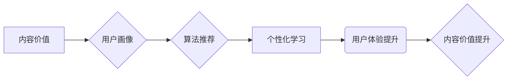

                 

## 知识付费创业中的内容价值提升

> 关键词：知识付费、内容价值、算法推荐、用户画像、个性化学习、数据驱动、内容运营

### 1. 背景介绍

知识付费行业近年来发展迅速，从线上课程、付费咨询到会员体系，各种模式层出不穷。然而，随着市场竞争的加剧，单纯依靠内容数量和价格优势难以维持长期发展。如何提升内容价值，打造用户粘性，成为知识付费创业者面临的共同挑战。

传统的内容生产模式往往是“生产者中心”，注重内容的专业性和深度，而忽略了用户的个性化需求和学习体验。随着人工智能技术的快速发展，数据驱动、算法推荐、个性化学习等技术为知识付费行业提供了新的机遇。

### 2. 核心概念与联系

#### 2.1 内容价值

内容价值是指内容能够为用户带来的实际利益或价值，包括知识、技能、娱乐、情感等方面的满足。

#### 2.2 用户画像

用户画像是指对目标用户进行细致的描述，包括用户的基本信息、兴趣爱好、学习习惯、消费行为等，以便更好地理解用户的需求和偏好。

#### 2.3 算法推荐

算法推荐是指利用机器学习算法，根据用户的历史行为、兴趣偏好等数据，推荐用户可能感兴趣的内容。

#### 2.4 个性化学习

个性化学习是指根据用户的学习水平、学习目标、学习风格等特点，定制化的学习路径和学习内容。

**核心概念与联系流程图**



### 3. 核心算法原理 & 具体操作步骤

#### 3.1 算法原理概述

知识付费平台可以通过以下算法原理提升内容价值：

* **协同过滤算法:** 

根据用户的历史行为和相似用户对内容的评价，推荐用户可能感兴趣的内容。

* **内容基准算法:** 

根据内容的主题、标签、关键词等特征，推荐与用户兴趣相符的内容。

* **深度学习算法:** 

利用深度神经网络，从海量用户数据中学习用户偏好，进行更精准的推荐。

#### 3.2 算法步骤详解

**协同过滤算法步骤:**

1. **数据收集:** 收集用户对内容的评分、浏览记录、购买记录等数据。
2. **用户相似度计算:** 计算用户之间的相似度，例如使用余弦相似度或皮尔逊相关系数。
3. **推荐内容:** 根据用户与相似用户的评分或行为，推荐用户可能感兴趣的内容。

**内容基准算法步骤:**

1. **内容特征提取:** 从内容中提取主题、标签、关键词等特征。
2. **用户兴趣建模:** 根据用户的历史行为和偏好，构建用户兴趣模型。
3. **内容推荐:** 根据用户兴趣模型和内容特征，推荐与用户兴趣相符的内容。

#### 3.3 算法优缺点

**协同过滤算法:**

* **优点:** 可以发现用户之间的隐性关联，推荐个性化内容。
* **缺点:** 数据稀疏性问题，新用户或新内容难以推荐。

**内容基准算法:**

* **优点:** 不需要用户历史数据，可以推荐新内容。
* **缺点:** 难以捕捉用户细微的兴趣偏好。

#### 3.4 算法应用领域

* **电商推荐:** 推荐商品、优惠券等。
* **视频平台推荐:** 推荐视频、电视剧等。
* **音乐平台推荐:** 推荐歌曲、专辑等。
* **新闻平台推荐:** 推荐新闻、文章等。

### 4. 数学模型和公式 & 详细讲解 & 举例说明

#### 4.1 数学模型构建

协同过滤算法的数学模型可以表示为用户-物品评分矩阵，其中每个元素代表用户对物品的评分。

**用户-物品评分矩阵:**

```
| 用户 | 物品1 | 物品2 | 物品3 |
|---|---|---|---|
| 用户1 | 5 | 3 | 4 |
| 用户2 | 4 | 5 | 2 |
| 用户3 | 3 | 4 | 5 |
```

#### 4.2 公式推导过程

**余弦相似度:**

$$
\text{相似度} = \frac{\mathbf{u} \cdot \mathbf{v}}{\|\mathbf{u}\| \|\mathbf{v}\|}
$$

其中:

* $\mathbf{u}$ 和 $\mathbf{v}$ 是两个用户的评分向量。
* $\cdot$ 表示向量点积。
* $\|\mathbf{u}\|$ 和 $\|\mathbf{v}\|$ 是两个向量的模长。

#### 4.3 案例分析与讲解

假设有两个用户，用户1对电影A评分为5，电影B评分为3，电影C评分为4；用户2对电影A评分为4，电影B评分为5，电影C评分为2。

我们可以计算用户1和用户2的余弦相似度:

$$
\text{相似度} = \frac{(5 \times 4) + (3 \times 5) + (4 \times 2)}{(5^2 + 3^2 + 4^2)^{1/2} \times (4^2 + 5^2 + 2^2)^{1/2}} = 0.75
$$

相似度为0.75，表明用户1和用户2的兴趣偏好相似。因此，我们可以推荐用户2可能喜欢的电影，例如用户1评分较高的电影。

### 5. 项目实践：代码实例和详细解释说明

#### 5.1 开发环境搭建

* Python 3.x
* scikit-learn 库
* pandas 库
* numpy 库

#### 5.2 源代码详细实现

```python
import pandas as pd
from sklearn.metrics.pairwise import cosine_similarity

# 加载用户-物品评分数据
data = pd.read_csv('ratings.csv')

# 构建用户-物品评分矩阵
user_item_matrix = data.pivot_table(index='user_id', columns='item_id', values='rating')

# 计算用户之间的余弦相似度
user_similarity = cosine_similarity(user_item_matrix)

# 获取用户1的相似用户
user1_id = 1
similar_users = user_similarity[user1_id].argsort()[:-6:-1]  # 排序获取相似度最高的5个用户

# 推荐用户1可能喜欢的物品
recommended_items = user_item_matrix.loc[similar_users].mean().sort_values(ascending=False)
```

#### 5.3 代码解读与分析

* 首先，我们加载用户-物品评分数据，并构建用户-物品评分矩阵。
* 然后，我们使用scikit-learn库中的cosine_similarity函数计算用户之间的余弦相似度。
* 接着，我们获取用户1的相似用户，并推荐用户1可能喜欢的物品。

#### 5.4 运行结果展示

运行代码后，会输出用户1可能喜欢的物品列表，以及每个物品的平均评分。

### 6. 实际应用场景

* **个性化课程推荐:** 根据用户的学习水平、学习目标、学习风格等特点，推荐个性化的课程内容。
* **知识付费内容分级:** 根据用户的知识水平和学习经验，对知识付费内容进行分级，提供更精准的学习体验。
* **会员体系定制:** 根据用户的消费行为和学习习惯，定制化的会员体系，提供更丰富的学习资源和服务。

### 6. 未来应用展望

* **人工智能驱动的个性化学习:** 利用深度学习算法，更精准地理解用户的学习需求，提供更个性化的学习体验。
* **虚拟现实和增强现实技术的应用:** 将虚拟现实和增强现实技术应用于知识付费平台，提供更沉浸式的学习体验。
* **跨平台知识共享:** 打破平台壁垒，实现知识付费内容的跨平台共享，构建更开放的学习生态。

### 7. 工具和资源推荐

#### 7.1 学习资源推荐

* **机器学习课程:** Coursera, edX, Udacity 等平台提供丰富的机器学习课程。
* **数据科学书籍:** 《Python数据科学手册》、《机器学习实战》等书籍。
* **在线社区:** Kaggle, Stack Overflow 等在线社区可以帮助你学习和解决问题。

#### 7.2 开发工具推荐

* **Python:** 强大的编程语言，广泛应用于数据科学和机器学习领域。
* **scikit-learn:** Python机器学习库，提供各种算法和工具。
* **pandas:** Python数据分析库，用于数据处理和分析。
* **numpy:** Python数值计算库，用于数值计算和矩阵操作。

#### 7.3 相关论文推荐

* **Collaborative Filtering for Implicit Feedback Datasets**
* **Matrix Factorization Techniques for Recommender Systems**
* **Deep Learning for Recommender Systems**

### 8. 总结：未来发展趋势与挑战

#### 8.1 研究成果总结

知识付费行业通过算法推荐、用户画像、个性化学习等技术，提升了内容价值，打造了用户粘性。

#### 8.2 未来发展趋势

* **人工智能驱动的个性化学习:** 利用深度学习算法，更精准地理解用户的学习需求，提供更个性化的学习体验。
* **虚拟现实和增强现实技术的应用:** 将虚拟现实和增强现实技术应用于知识付费平台，提供更沉浸式的学习体验。
* **跨平台知识共享:** 打破平台壁垒，实现知识付费内容的跨平台共享，构建更开放的学习生态。

#### 8.3 面临的挑战

* **数据隐私和安全:** 知识付费平台需要收集大量用户数据，如何保护用户隐私和数据安全是一个重要的挑战。
* **算法公平性和可解释性:** 算法推荐需要保证公平性和可解释性，避免出现歧视或误导用户的情况。
* **内容质量和更新:** 知识付费平台需要不断更新内容，并保证内容质量，才能满足用户的不断变化的需求。

#### 8.4 研究展望

未来，知识付费行业将继续探索人工智能、虚拟现实、增强现实等新技术的应用，为用户提供更优质、更个性化的学习体验。同时，需要关注数据隐私、算法公平性等伦理问题，确保知识付费行业健康可持续发展。

### 9. 附录：常见问题与解答

* **Q: 如何提高算法推荐的准确性?**

* **A:** 可以通过收集更多用户数据、改进算法模型、引入用户反馈等方式提高算法推荐的准确性。

* **Q: 如何解决数据稀疏性问题?**

* **A:** 可以采用矩阵分解、协同过滤等算法，从有限的数据中挖掘潜在的关联关系。

* **Q: 如何保证算法推荐的公平性和可解释性?**

* **A:** 可以采用公平性评估指标、可解释性分析方法等手段，确保算法推荐公平公正，并能够解释推荐结果背后的逻辑。


作者：禅与计算机程序设计艺术 / Zen and the Art of Computer Programming 
<end_of_turn>

