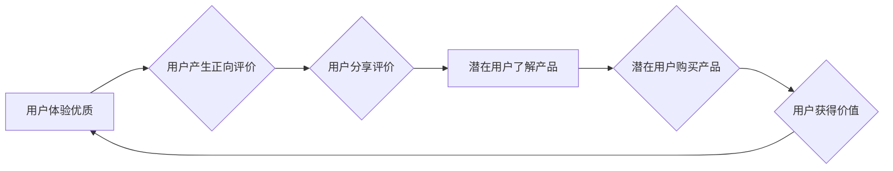

                 

## 知识付费创业中的用户口碑营销策略

> 关键词：知识付费、口碑营销、用户体验、内容价值、社区建设、信任机制、数据分析

### 1. 背景介绍

知识付费行业近年来蓬勃发展，从在线课程、电子书到付费咨询，各种知识产品层出不穷。然而，在竞争激烈的市场环境下，如何有效吸引用户并建立品牌忠诚度成为知识付费创业者面临的重大挑战。传统广告营销模式逐渐失效，用户对内容质量和价值的追求日益提高，口碑营销逐渐成为知识付费行业不可或缺的营销策略。

口碑营销的核心在于用户对产品或服务的真实评价和推荐，它能够有效提升用户信任度，降低购买门槛，并促进品牌传播。对于知识付费创业者而言，用户口碑的积累和传播是建立品牌声誉、提升用户粘性和促进业务增长的关键。

### 2. 核心概念与联系

#### 2.1 用户口碑营销

用户口碑营销是指通过用户自身对产品或服务的评价和推荐，来影响其他潜在用户的购买决策。它是一种基于信任和真实体验的营销方式，能够有效提升用户对品牌的信任度和好感度。

#### 2.2 知识付费

知识付费是指以知识、技能、经验等为核心内容，通过付费的方式获取知识和服务的商业模式。它涵盖了在线课程、电子书、付费咨询、会员服务等多种形式。

#### 2.3 联系

知识付费与用户口碑营销之间存在着密切的联系。用户口碑能够有效促进知识付费产品的推广和销售。

**Mermaid 流程图**



### 3. 核心算法原理 & 具体操作步骤

#### 3.1 算法原理概述

用户口碑营销的核心算法原理在于分析用户行为数据，识别用户对产品或服务的评价趋势，并通过精准的推荐和传播策略，引导用户产生正向评价并将其传播给潜在用户。

#### 3.2 算法步骤详解

1. **数据收集:** 收集用户行为数据，包括用户浏览记录、购买记录、评价反馈、社交互动等。
2. **数据清洗:** 对收集到的数据进行清洗和处理，去除无效数据和噪声数据，确保数据质量。
3. **数据分析:** 利用数据挖掘和机器学习算法，分析用户行为数据，识别用户对产品或服务的评价趋势和情感倾向。
4. **用户画像:** 根据用户行为数据，构建用户画像，了解用户的兴趣爱好、需求特征和购买习惯。
5. **精准推荐:** 基于用户画像和评价趋势，对用户进行精准推荐，引导用户接触与其兴趣相符的产品或服务。
6. **口碑传播:** 通过社交媒体、用户社区等平台，引导用户分享评价和推荐产品或服务，扩大用户口碑的影响力。
7. **效果监测:** 定期监测用户口碑营销的效果，分析用户评价趋势和转化率，并根据实际情况调整营销策略。

#### 3.3 算法优缺点

**优点:**

* 基于真实用户体验，提升用户信任度。
* 成本相对较低，效果可持续。
* 能够精准触达目标用户，提高营销效率。

**缺点:**

* 需要投入时间和精力进行数据收集和分析。
* 用户口碑传播速度难以控制，难以保证营销效果的稳定性。
* 需要建立良好的用户关系和信任机制。

#### 3.4 算法应用领域

用户口碑营销算法广泛应用于电商、教育、旅游、金融等各个领域，能够有效提升品牌声誉、促进用户转化和提高客户满意度。

### 4. 数学模型和公式 & 详细讲解 & 举例说明

#### 4.1 数学模型构建

用户口碑营销可以构建一个基于网络传播的数学模型，其中用户可以看作是网络节点，评价和推荐可以看作是网络链接。

**模型假设:**

* 用户之间存在着相互连接的关系。
* 用户对产品的评价会影响其他用户的购买决策。
* 用户的评价和推荐行为服从一定的概率分布。

**模型公式:**

$$
P(u_i \text{购买产品}) = \sum_{j \in N(u_i)} P(u_j \text{推荐产品}) \cdot W_{ij}
$$

其中:

* $u_i$ 表示第 $i$ 个用户。
* $N(u_i)$ 表示与 $u_i$ 相互连接的用户集合。
* $P(u_j \text{推荐产品})$ 表示第 $j$ 个用户推荐产品的概率。
* $W_{ij}$ 表示 $u_i$ 对 $u_j$ 的信任度。

#### 4.2 公式推导过程

该公式表示用户 $u_i$ 购买产品的概率等于所有与 $u_i$ 相互连接的用户 $u_j$ 推荐产品的概率乘以 $u_i$ 对 $u_j$ 的信任度之和。

#### 4.3 案例分析与讲解

假设用户 $A$ 和用户 $B$ 互为好友，用户 $B$ 对某个知识付费产品进行了积极的评价，并推荐给用户 $A$。根据上述公式，用户 $A$ 购买该产品的概率会受到用户 $B$ 推荐的影响，并且该影响程度取决于用户 $A$ 对用户 $B$ 的信任度。

### 5. 项目实践：代码实例和详细解释说明

#### 5.1 开发环境搭建

* 语言：Python
* 库：pandas, numpy, scikit-learn

#### 5.2 源代码详细实现

```python
import pandas as pd
from sklearn.feature_extraction.text import TfidfVectorizer

# 数据加载
data = pd.read_csv('user_feedback.csv')

# 文本特征提取
vectorizer = TfidfVectorizer()
text_features = vectorizer.fit_transform(data['feedback'])

# 用户画像构建
user_profiles = {}
for index, row in data.iterrows():
    user_id = row['user_id']
    feedback = row['feedback']
    # ... 用户画像构建逻辑 ...
    user_profiles[user_id] = user_profile

# 算法模型训练
# ... 算法模型训练逻辑 ...

# 精准推荐
def recommend_products(user_id):
    # ... 精准推荐逻辑 ...

# 口碑传播
def spread_口碑(product_id):
    # ... 口碑传播逻辑 ...
```

#### 5.3 代码解读与分析

* 数据加载：从CSV文件加载用户反馈数据。
* 文本特征提取：使用TF-IDF算法提取用户反馈文本的特征向量。
* 用户画像构建：根据用户反馈数据构建用户画像，例如用户兴趣、偏好等。
* 算法模型训练：训练机器学习模型，用于预测用户对产品的评价和推荐行为。
* 精准推荐：根据用户画像和模型预测，推荐与用户兴趣相符的产品。
* 口碑传播：通过社交媒体等平台，引导用户分享评价和推荐产品。

#### 5.4 运行结果展示

* 用户评价趋势分析
* 推荐产品效果评估
* 口碑传播效果监测

### 6. 实际应用场景

#### 6.1 在线课程平台

* 利用用户评价数据，推荐与用户学习兴趣相符的课程。
* 通过用户社区，引导用户分享学习心得和经验，促进知识传播。

#### 6.2 电子书平台

* 根据用户阅读记录和评价，推荐与用户阅读习惯相符的电子书。
* 建立用户书友圈，鼓励用户之间进行书评和讨论。

#### 6.3 付费咨询服务

* 利用用户评价数据，推荐与用户需求相符的咨询专家。
* 建立用户评价体系，提升用户对咨询服务的信任度。

#### 6.4 未来应用展望

* 人工智能技术将进一步提升用户口碑营销的精准度和效率。
* 社交媒体和移动互联网的发展将为用户口碑营销提供更广阔的传播平台。
* 用户体验将成为知识付费行业的核心竞争力，用户口碑营销将更加注重用户体验的提升。

### 7. 工具和资源推荐

#### 7.1 学习资源推荐

* 《口碑营销》
* 《网络传播学》
* 《数据挖掘与机器学习》

#### 7.2 开发工具推荐

* Python
* pandas
* scikit-learn
* TensorFlow

#### 7.3 相关论文推荐

* "The Impact of Online Reviews on Consumer Purchasing Decisions"
* "A Framework for Understanding Online Word-of-Mouth Marketing"
* "The Role of Trust in Online Consumer Reviews"

### 8. 总结：未来发展趋势与挑战

#### 8.1 研究成果总结

用户口碑营销在知识付费行业具有重要的应用价值，能够有效提升用户信任度、促进用户转化和提高品牌声誉。

#### 8.2 未来发展趋势

* 人工智能技术将进一步提升用户口碑营销的精准度和效率。
* 社交媒体和移动互联网将为用户口碑营销提供更广阔的传播平台。
* 用户体验将成为知识付费行业的核心竞争力，用户口碑营销将更加注重用户体验的提升。

#### 8.3 面临的挑战

* 如何有效收集和分析用户反馈数据。
* 如何建立用户信任机制，防止虚假评价和恶意攻击。
* 如何平衡用户口碑营销与品牌控制，避免负面评价对品牌形象造成损害。

#### 8.4 研究展望

未来研究将重点关注以下几个方面：

* 开发更智能、更精准的用户口碑营销算法。
* 研究用户口碑营销与其他营销策略的协同效应。
* 探讨用户口碑营销在不同文化背景下的差异性。

### 9. 附录：常见问题与解答

* **如何收集用户反馈数据？**

可以通过在线问卷调查、用户评论、社交媒体互动等方式收集用户反馈数据。

* **如何分析用户反馈数据？**

可以使用文本挖掘、情感分析、机器学习等技术分析用户反馈数据，识别用户评价趋势和情感倾向。

* **如何建立用户信任机制？**

可以通过实名认证、评价体系、用户社区等方式建立用户信任机制，防止虚假评价和恶意攻击。


作者：禅与计算机程序设计艺术 / Zen and the Art of Computer Programming 
<end_of_turn>

