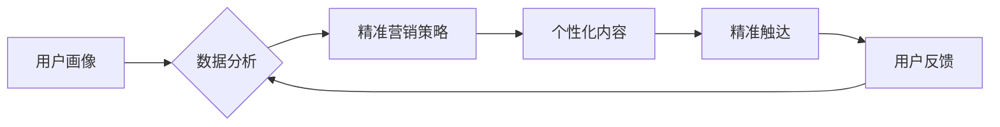

                 

## 知识付费创业中的用户画像与精准营销

> 关键词：用户画像、精准营销、知识付费、数据分析、机器学习、个性化推荐

## 1. 背景介绍

知识付费行业近年来蓬勃发展，从在线课程、直播带货到付费咨询，各种知识付费模式层出不穷。然而，在竞争日益激烈的市场环境下，如何精准触达目标用户、提升用户转化率，成为知识付费创业者面临的重大挑战。

用户画像与精准营销是解决这一问题的关键。用户画像是指对目标用户进行深入分析，构建出其特征、需求、行为等多维度的描述，而精准营销则是基于用户画像，通过个性化内容和营销策略，精准触达目标用户，提高营销效率。

## 2. 核心概念与联系

### 2.1 用户画像

用户画像是知识付费创业的核心基础，它帮助我们了解用户的：

* **基本信息**: 年龄、性别、职业、教育背景、收入水平等
* **兴趣爱好**: 学习领域、知识需求、阅读习惯、消费偏好等
* **行为特征**: 学习时长、课程评价、购买行为、互动方式等
* **心理特征**: 学习目标、价值观、学习动机、痛点需求等

### 2.2 精准营销

精准营销是指根据用户画像，制定个性化的营销策略，通过合适的渠道和内容，精准触达目标用户。

**用户画像与精准营销的联系**

用户画像为精准营销提供数据支撑，精准营销则通过数据分析和反馈，不断完善用户画像，形成一个良性循环。

**Mermaid 流程图**



## 3. 核心算法原理 & 具体操作步骤

### 3.1 算法原理概述

用户画像构建和精准营销策略制定通常依赖于机器学习算法。常见的机器学习算法包括：

* **聚类算法**: 将用户根据相似特征进行分组，构建用户画像。例如K-Means聚类算法。
* **推荐算法**: 根据用户的历史行为和偏好，推荐相关知识付费产品。例如协同过滤算法、内容基准算法。
* **预测算法**: 预测用户的学习行为和购买意愿。例如逻辑回归算法、决策树算法。

### 3.2 算法步骤详解

**用户画像构建**

1. **数据收集**: 收集用户基本信息、学习行为、互动行为等数据。
2. **数据清洗**: 去除无效数据、缺失值等，保证数据质量。
3. **特征工程**: 将原始数据转换为可用于机器学习算法的特征。
4. **模型训练**: 选择合适的聚类算法，训练模型，将用户进行分组。
5. **模型评估**: 评估模型的性能，调整模型参数，提高模型精度。

**精准营销策略制定**

1. **目标设定**: 明确营销目标，例如提升用户转化率、增加用户粘性等。
2. **用户细分**: 根据用户画像，将用户细分为不同的群体。
3. **内容定制**: 为不同的用户群体定制个性化的营销内容。
4. **渠道选择**: 选择合适的营销渠道，例如邮件营销、社交媒体广告等。
5. **效果监测**: 监测营销效果，根据数据反馈调整策略。

### 3.3 算法优缺点

**聚类算法**:

* **优点**: 可以发现用户之间的潜在关系，构建用户画像。
* **缺点**: 对数据质量要求高，容易受到噪声数据的影响。

**推荐算法**:

* **优点**: 可以根据用户的兴趣推荐相关产品，提高用户体验。
* **缺点**: 需要大量的历史数据进行训练，容易陷入冷启动问题。

**预测算法**:

* **优点**: 可以预测用户的行为，帮助制定精准营销策略。
* **缺点**: 模型的准确性依赖于数据的质量和特征选择。

### 3.4 算法应用领域

* **电商**: 用户画像构建、精准推荐、个性化营销
* **教育**: 用户画像构建、学习路径推荐、个性化辅导
* **金融**: 用户画像构建、风险评估、精准营销
* **医疗**: 用户画像构建、疾病预测、个性化治疗

## 4. 数学模型和公式 & 详细讲解 & 举例说明

### 4.1 数学模型构建

用户画像构建可以利用聚类算法，例如K-Means算法，构建用户画像。K-Means算法的目标是将数据点划分为K个簇，每个簇中的数据点彼此相似，而不同簇的数据点彼此差异较大。

**K-Means算法的数学模型**:

* **距离度量**: 使用欧氏距离或其他距离度量来衡量数据点之间的相似性。
* **聚类中心**: 每个簇的聚类中心是该簇中所有数据点的平均值。
* **迭代更新**: 算法迭代地更新聚类中心和数据点的簇分配，直到聚类结果收敛。

### 4.2 公式推导过程

**K-Means算法的迭代更新公式**:

* **更新聚类中心**:

$$
\mu_k = \frac{1}{n_k} \sum_{i=1}^{n_k} x_i
$$

其中，$\mu_k$ 是第k个簇的聚类中心，$x_i$ 是第i个属于第k个簇的数据点，$n_k$ 是第k个簇中数据点的数量。

* **更新数据点簇分配**:

$$
c_i = argmin_k ||x_i - \mu_k||^2
$$

其中，$c_i$ 是第i个数据点的簇分配，$k$ 是簇的索引，$||x_i - \mu_k||^2$ 是第i个数据点与第k个簇聚类中心的欧氏距离平方。

### 4.3 案例分析与讲解

假设我们有以下用户数据：

| 用户ID | 年龄 | 性别 | 收入 | 学习时长 |
|---|---|---|---|---|
| 1 | 25 | 男 | 5000 | 10小时 |
| 2 | 30 | 女 | 8000 | 20小时 |
| 3 | 28 | 男 | 6000 | 15小时 |
| 4 | 35 | 女 | 10000 | 30小时 |
| 5 | 22 | 男 | 4000 | 5小时 |

我们使用K-Means算法将用户进行聚类，假设我们设定K=2。

经过算法迭代，最终得到两个簇：

* **簇1**: 用户ID 1, 3, 5，年龄较低，收入较低，学习时长较短。
* **簇2**: 用户ID 2, 4，年龄较高，收入较高，学习时长较长。

我们可以根据这两个簇的特点，制定不同的营销策略。例如，对簇1的用户，可以推荐价格更优惠的课程，而对簇2的用户，可以推荐更高级的课程。

## 5. 项目实践：代码实例和详细解释说明

### 5.1 开发环境搭建

* Python 3.x
* scikit-learn 库

### 5.2 源代码详细实现

```python
from sklearn.cluster import KMeans
import pandas as pd

# 加载用户数据
data = pd.read_csv('user_data.csv')

# 选择特征进行聚类
features = ['年龄', '收入', '学习时长']
X = data[features]

# 使用K-Means算法进行聚类
kmeans = KMeans(n_clusters=2)
kmeans.fit(X)

# 获取聚类结果
labels = kmeans.labels_
data['簇'] = labels

# 查看聚类结果
print(data)
```

### 5.3 代码解读与分析

* **加载用户数据**: 使用pandas库加载用户数据。
* **选择特征**: 选择用户年龄、收入、学习时长等特征进行聚类。
* **使用K-Means算法**: 使用scikit-learn库中的KMeans算法进行聚类，设定聚类数量为2。
* **获取聚类结果**: 获取聚类结果，并将结果存储在data['簇']列中。
* **查看聚类结果**: 打印聚类结果，查看每个用户的簇分配。

### 5.4 运行结果展示

运行代码后，会输出包含用户ID、年龄、收入、学习时长和簇分配的表格。

## 6. 实际应用场景

### 6.1 知识付费平台

* **用户画像**: 根据用户的学习行为、课程评价、购买记录等数据，构建用户画像，了解用户的学习兴趣、学习习惯、付费意愿等。
* **精准推荐**: 基于用户画像，推荐用户感兴趣的课程、学习资源和付费服务。
* **个性化营销**: 为不同用户群体定制个性化的营销内容和活动，提高用户转化率和用户粘性。

### 6.2 在线教育机构

* **学员画像**: 根据学员的学习进度、学习成绩、互动行为等数据，构建学员画像，了解学员的学习能力、学习目标、学习痛点等。
* **个性化辅导**: 为不同学员提供个性化的学习辅导和指导，提高学员的学习效率和学习效果。
* **招生营销**: 根据潜在学员的兴趣爱好和学习需求，精准推送招生信息和课程推荐，提高招生转化率。

### 6.3 知识付费内容创作者

* **粉丝画像**: 根据粉丝的互动行为、评论内容、分享记录等数据，构建粉丝画像，了解粉丝的兴趣爱好、价值观、学习需求等。
* **内容创作**: 根据粉丝画像，创作更符合粉丝需求的内容，提高内容的吸引力和传播力。
* **粉丝运营**: 为不同粉丝群体制定不同的运营策略，提高粉丝粘性和粉丝价值。

### 6.4 未来应用展望

随着人工智能技术的不断发展，用户画像与精准营销将在知识付费行业发挥更重要的作用。未来，我们可以期待：

* 更精准的用户画像构建，能够更深入地了解用户的需求和行为。
* 更个性化的营销策略，能够为每个用户提供定制化的学习体验。
* 更智能的营销自动化，能够更高效地触达目标用户。

## 7. 工具和资源推荐

### 7.1 学习资源推荐

* **机器学习**:
    * 《机器学习》 - 周志华
    * scikit-learn 官方文档: https://scikit-learn.org/stable/
* **数据分析**:
    * 《Python数据分析》 - Wes McKinney
    * pandas 官方文档: https://pandas.pydata.org/docs/

### 7.2 开发工具推荐

* **Python**: https://www.python.org/
* **Jupyter Notebook**: https://jupyter.org/
* **scikit-learn**: https://scikit-learn.org/stable/

### 7.3 相关论文推荐

* **用户画像构建**:
    * "A Survey on User Profiling Techniques" - ACM Computing Surveys
* **精准营销**:
    * "Personalized Marketing: A Review" - Journal of Interactive Marketing

## 8. 总结：未来发展趋势与挑战

### 8.1 研究成果总结

用户画像与精准营销是知识付费行业发展的重要趋势，能够帮助知识付费平台、在线教育机构和内容创作者更好地了解用户需求，提供更个性化的服务，提高用户体验和商业价值。

### 8.2 未来发展趋势

* **更精准的用户画像**: 利用更先进的人工智能算法和数据分析技术，构建更精准的用户画像，深入了解用户的需求和行为。
* **更个性化的营销策略**: 基于用户画像，制定更个性化的营销策略，为每个用户提供定制化的学习体验。
* **更智能的营销自动化**: 利用人工智能技术，实现营销自动化的流程，更高效地触达目标用户。

### 8.3 面临的挑战

* **数据隐私**: 用户数据隐私保护是一个重要的挑战，需要制定合理的隐私政策和数据安全措施。
* **算法偏见**: 机器学习算法可能会存在偏见，导致用户画像不准确，需要不断改进算法模型，减少算法偏见。
* **用户体验**: 过度精准的营销可能会导致用户体验下降，需要平衡精准营销和用户体验。

### 8.4 研究展望

未来，用户画像与精准营销的研究将继续深入，探索更先进的算法模型、更有效的营销策略和更人性化的用户体验。


## 9. 附录：常见问题与解答

**Q1: 如何构建用户画像？**

**A1:** 用户画像构建需要收集用户数据，进行数据清洗和特征工程，然后选择合适的聚类算法进行聚类分析。

**Q2: 如何选择合适的聚类算法？**

**A2:** 选择聚类算法需要根据数据的特点和业务需求进行选择。常见的聚类算法包括K-Means算法、DBSCAN算法、层次聚类算法等。

**Q3: 如何评估聚类结果？**

**A3:** 可以使用聚类指标，例如Silhouette score、Dunn index等，来评估聚类结果的质量。

**Q4: 如何利用用户画像进行精准营销？**

**A4:** 可以根据用户画像，制定个性化的营销策略，例如推荐相关课程、推送个性化广告、提供定制化服务等。

**Q5: 如何保护用户数据隐私？**

**A5:** 需要制定合理的隐私政策和数据安全措施，确保用户数据的安全和隐私。


作者：禅与计算机程序设计艺术 / Zen and the Art of Computer Programming 
<end_of_turn>

