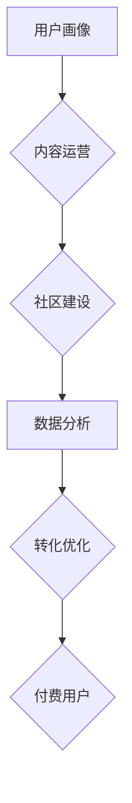

                 

## 知识付费平台的用户增长黑客策略

> 关键词：知识付费平台、用户增长、黑客策略、用户画像、内容运营、社区建设、数据分析、转化优化、付费用户

## 1. 背景介绍

知识付费平台近年来发展迅速，成为新兴的互联网经济模式。随着人们对知识的需求不断增长，以及互联网技术的不断发展，知识付费平台的用户规模和市场规模都在持续扩大。然而，在激烈的市场竞争中，如何有效地获取用户，提升用户粘性和转化率，成为知识付费平台面临的重大挑战。

本篇文章将从用户增长黑客策略的角度出发，探讨知识付费平台如何通过数据驱动、内容运营、社区建设等手段，实现用户增长和商业化目标。

## 2. 核心概念与联系

**2.1 知识付费平台用户增长黑客策略概述**

用户增长黑客策略是指通过一系列数据驱动、创意、技术手段，快速、高效地获取和留存用户，并最终转化为付费用户的策略。

**2.2 用户增长黑客策略核心要素**

* **用户画像:** 深入了解目标用户的需求、兴趣、行为习惯等，精准定位用户群体。
* **内容运营:**  提供优质、有价值、符合用户需求的内容，吸引用户关注和参与。
* **社区建设:**  打造活跃的知识分享社区，增强用户粘性和互动性。
* **数据分析:**  利用数据分析工具，监测用户行为，优化运营策略。
* **转化优化:**  提升用户转化率，引导用户成为付费用户。

**2.3 用户增长黑客策略架构**



## 3. 核心算法原理 & 具体操作步骤

**3.1 算法原理概述**

知识付费平台的用户增长黑客策略并非单一的算法，而是基于数据分析、用户行为模型、内容推荐算法等多项技术手段的综合应用。

**3.2 算法步骤详解**

1. **用户画像构建:**  通过用户注册信息、浏览记录、购买行为等数据，构建用户画像，包括用户年龄、性别、职业、兴趣爱好、知识需求等。
2. **内容推荐算法:**  根据用户画像和行为数据，推荐用户感兴趣的内容，提高用户参与度和粘性。常用的算法包括协同过滤、内容过滤、混合推荐等。
3. **社区建设策略:**  打造活跃的知识分享社区，鼓励用户互动交流，建立用户粘性。可以采用话题讨论、问答互动、直播分享等方式。
4. **数据分析与优化:**  利用数据分析工具，监测用户行为数据，分析用户增长趋势、内容受欢迎程度、社区活跃度等，并根据数据反馈不断优化运营策略。
5. **转化优化策略:**  针对不同用户群体，制定个性化的转化策略，引导用户成为付费用户。可以采用试用、限时优惠、会员体系等方式。

**3.3 算法优缺点**

* **优点:**  数据驱动、精准定位、高效提升用户增长。
* **缺点:**  需要大量数据支持、算法模型需要不断优化、用户隐私保护需要重视。

**3.4 算法应用领域**

* 知识付费平台
* 在线教育平台
* 社交媒体平台
* 电商平台

## 4. 数学模型和公式 & 详细讲解 & 举例说明

**4.1 数学模型构建**

用户增长模型可以采用基于马尔科夫链的模型，描述用户在不同阶段的转换概率。

**4.2 公式推导过程**

假设用户存在以下几个状态：

*  S0: 未注册用户
*  S1: 注册用户
*  S2: 关注用户
*  S3: 付费用户

则用户状态转换概率矩阵可以表示为：

$$
P = \begin{bmatrix}
0 & p_{01} & 0 & 0 \\
0 & 0 & p_{12} & 0 \\
0 & 0 & 0 & p_{23} \\
0 & 0 & 0 & 0
\end{bmatrix}
$$

其中：

*  $p_{01}$: 未注册用户注册的概率
*  $p_{12}$: 注册用户关注的概率
*  $p_{23}$: 关注用户付费的概率

**4.3 案例分析与讲解**

假设一个知识付费平台，注册用户转化为关注用户的概率为 0.2，关注用户转化为付费用户的概率为 0.1。则用户状态转换概率矩阵为：

$$
P = \begin{bmatrix}
0 & 0.2 & 0 & 0 \\
0 & 0 & 0.2 & 0 \\
0 & 0 & 0 & 0.1 \\
0 & 0 & 0 & 0
\end{bmatrix}
$$

通过分析这个矩阵，我们可以了解用户在不同阶段的转换概率，并根据实际情况调整运营策略，提高用户转化率。

## 5. 项目实践：代码实例和详细解释说明

**5.1 开发环境搭建**

*  操作系统: Linux/macOS/Windows
*  编程语言: Python
*  数据分析工具: Pandas, NumPy, Scikit-learn
*  数据库: MySQL/PostgreSQL

**5.2 源代码详细实现**

```python
import pandas as pd
from sklearn.cluster import KMeans

# 加载用户数据
data = pd.read_csv('user_data.csv')

# 数据预处理
# ...

# 构建用户画像模型
kmeans = KMeans(n_clusters=5)
data['user_cluster'] = kmeans.fit_predict(data[['age', 'gender', 'occupation', 'interest']])

# 分析用户画像
user_clusters = data.groupby('user_cluster').agg({'age': 'mean', 'gender': 'count', 'occupation': 'count', 'interest': 'count'})
print(user_clusters)

# 推荐内容算法
# ...

# 社区建设策略
# ...

# 转化优化策略
# ...
```

**5.3 代码解读与分析**

*  代码首先加载用户数据，并进行数据预处理。
*  然后使用KMeans算法构建用户画像模型，将用户分为不同的群组。
*  通过分析不同用户群组的特征，可以了解用户需求和偏好，为内容推荐和社区建设提供依据。
*  代码还展示了推荐内容算法、社区建设策略和转化优化策略的示例，可以根据实际情况进行调整和完善。

**5.4 运行结果展示**

运行代码后，可以得到用户画像分析结果，以及推荐内容、社区建设和转化优化策略的建议。

## 6. 实际应用场景

**6.1 知识付费平台用户增长案例分析**

*  **案例一:**  在线编程课程平台通过用户画像分析发现，大部分用户是初学者，对基础知识需求较高。平台根据这一发现，开发了针对初学者的基础课程，并通过社交媒体推广，吸引了大量新用户。
*  **案例二:**  在线写作课程平台通过社区建设策略，打造了写作交流社区，鼓励用户分享写作经验和作品，提升用户粘性和互动性。

**6.2 知识付费平台用户增长黑客策略应用**

*  **精准用户定位:**  通过用户画像分析，精准定位目标用户群体，制定针对性的营销策略。
*  **内容个性化推荐:**  根据用户兴趣和需求，推荐个性化的课程和内容，提高用户参与度和转化率。
*  **社区互动增强:**  打造活跃的知识分享社区，鼓励用户互动交流，建立用户粘性。
*  **数据驱动优化:**  利用数据分析工具，监测用户行为数据，不断优化运营策略。

**6.3 未来应用展望**

随着人工智能技术的不断发展，知识付费平台的用户增长黑客策略将更加智能化、个性化。例如，可以利用机器学习算法，预测用户未来的学习需求，并提供更精准的课程推荐。

## 7. 工具和资源推荐

**7.1 学习资源推荐**

*  **书籍:**  《用户增长黑客》、《数据驱动营销》
*  **在线课程:**  Coursera, Udemy, edX

**7.2 开发工具推荐**

*  **数据分析工具:**  Python (Pandas, NumPy, Scikit-learn), R, Tableau
*  **数据库:**  MySQL, PostgreSQL, MongoDB

**7.3 相关论文推荐**

*  《The Lean Startup》
*  《Growth Hacking: A Practical Guide to User Acquisition》

## 8. 总结：未来发展趋势与挑战

**8.1 研究成果总结**

本篇文章探讨了知识付费平台的用户增长黑客策略，包括用户画像构建、内容运营、社区建设、数据分析和转化优化等方面。通过数据驱动、创意和技术手段的综合应用，可以有效提升用户增长和商业化目标。

**8.2 未来发展趋势**

*  **人工智能技术应用:**  利用人工智能技术，实现更精准的用户画像分析、内容推荐和个性化服务。
*  **用户体验优化:**  不断提升用户体验，打造更便捷、更人性化的平台。
*  **多元化内容形式:**  探索更多元的知识付费形式，满足用户多样化的需求。

**8.3 面临的挑战**

*  **用户隐私保护:**  在数据分析和用户画像构建过程中，需要充分考虑用户隐私保护问题。
*  **内容质量保证:**  需要不断提升内容质量，提供真正有价值的知识和服务。
*  **商业模式创新:**  需要探索更可持续的商业模式，实现平台的长期发展。

**8.4 研究展望**

未来，知识付费平台的用户增长黑客策略将更加智能化、个性化和多元化。随着技术的不断发展，知识付费平台将成为未来教育和知识传播的重要模式。

## 9. 附录：常见问题与解答

**9.1 如何构建用户画像？**

用户画像可以通过用户注册信息、浏览记录、购买行为等数据进行构建。可以使用数据分析工具，对用户数据进行聚类分析，将用户分为不同的群组，并分析每个群组的特点。

**9.2 如何提高用户转化率？**

可以采用试用、限时优惠、会员体系等方式，引导用户成为付费用户。还可以根据用户画像，提供个性化的推荐和服务，提升用户体验。

**9.3 如何打造活跃的社区？**

可以采用话题讨论、问答互动、直播分享等方式，鼓励用户互动交流。还可以邀请专家学者进行线上讲座，吸引更多用户参与。


作者：禅与计算机程序设计艺术 / Zen and the Art of Computer Programming 
<end_of_turn>

