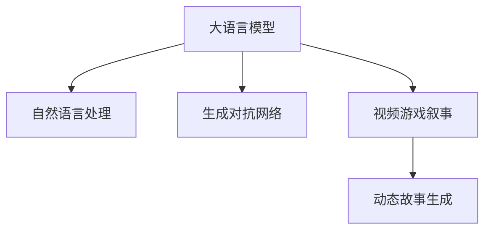

                 

# LLM在视频游戏叙事中的应用：动态故事生成

> 关键词：自然语言处理(NLP), 大语言模型(LLM), 视频游戏叙事, 动态故事生成, 生成对抗网络(GAN), 文本生成, 游戏开发

## 1. 背景介绍

### 1.1 问题由来

随着视频游戏产业的蓬勃发展，叙事技术成为了一个重要的研究领域。优秀的游戏叙事不仅能够吸引玩家，还能提升游戏的沉浸感和体验感。传统的游戏叙事依赖于固定的脚本和预设的对话，限制了游戏的自由度和多样性。如何让游戏叙事更加生动、多变、丰富，成为游戏开发者面临的挑战之一。

近年来，自然语言处理(NLP)技术的发展为视频游戏叙事带来了新的可能性。利用大语言模型(LLM)，可以通过生成动态故事，增强游戏的自由度、探索性和可玩性。LLM在生成自然流畅、符合上下文规则的文本方面具有独特优势，被广泛用于文本生成、对话生成、自然语言理解等多个NLP领域。将LLM应用于视频游戏叙事，能够显著提升游戏的互动性和趣味性。

### 1.2 问题核心关键点

基于大语言模型的视频游戏叙事，是指在游戏开发过程中，利用LLM生成动态生成的故事和对话，代替传统的脚本编写。这种方法可以极大提升游戏的叙事灵活性和互动性，玩家可以根据自己的选择和行为，得到不同的故事线、对话和结局。核心关键点包括：

1. **动态故事生成**：LLM能够根据游戏进度和玩家行为，生成不同的故事线索和结局，提升游戏的多样性和沉浸感。
2. **自然语言理解**：LLM能够理解玩家的输入（如选择、操作等），生成符合上下文的响应，增强游戏的互动性。
3. **生成对抗网络(GAN)**：结合GAN技术，生成高质量的文本内容，如对话、环境描述等，提升叙事的质量和真实感。
4. **语言模型架构**：选择合适的语言模型架构（如Transformer、GPT等），以适应视频游戏叙事的实时性要求。

## 2. 核心概念与联系

### 2.1 核心概念概述

为更好地理解基于大语言模型的视频游戏叙事，本节将介绍几个密切相关的核心概念：

- **大语言模型(LLM)**：基于深度学习，能够处理自然语言的多层神经网络模型，用于文本生成、语言理解、对话生成等任务。
- **自然语言处理(NLP)**：涉及计算机科学、人工智能和语言学的交叉领域，研究如何使计算机能够理解、处理和生成自然语言。
- **生成对抗网络(GAN)**：一种强大的生成模型，通过两个神经网络（生成器和判别器）相互对抗，生成高质量的样本数据。
- **视频游戏叙事**：游戏情节的构建和故事线的推进方式，涉及剧本编写、对话设计、场景布置等多个方面。
- **动态故事生成**：根据玩家的行为和选择，生成不断变化的故事线和结局，提升游戏的自由度和可玩性。

这些核心概念之间的逻辑关系可以通过以下Mermaid流程图来展示：



这个流程图展示了大语言模型在视频游戏叙事中的核心作用：

1. 大语言模型通过自然语言处理，理解玩家的输入。
2. 生成对抗网络能够生成高质量的文本内容，提升叙事的质量。
3. 动态故事生成根据玩家行为，生成不同的故事线和结局。

## 3. 核心算法原理 & 具体操作步骤
### 3.1 算法原理概述

基于大语言模型的视频游戏叙事，本质上是通过LLM生成自然语言文本，用于游戏叙事的各个环节。其核心思想是：利用预训练的LLM，在视频游戏运行过程中，根据玩家行为和游戏进度，动态生成文本，如对话、描述、故事线索等，从而构建出符合玩家选择和行为的动态故事。

具体而言，可分为以下几个步骤：

1. **文本预处理**：将玩家的输入（如选择、操作等）转换为模型可以处理的格式，如token ids。
2. **模型推理**：将预处理后的文本输入LLM，生成符合上下文的响应或文本。
3. **文本后处理**：对模型生成的文本进行后处理，如补全、校正、格式化，生成最终的游戏叙事文本。
4. **实时更新**：在游戏过程中，不断更新模型输入和输出，以适应动态变化的游戏场景。

### 3.2 算法步骤详解

以下是基于大语言模型的视频游戏叙事的详细操作步骤：

**Step 1: 选择预训练模型**
- 选择合适的预训练语言模型，如GPT、BERT等，作为生成故事的起点。
- 考虑模型的大小和性能，以及是否支持实时推理。

**Step 2: 数据准备和预处理**
- 收集游戏内的对话、描述、选择等文本数据，作为训练样本。
- 对文本数据进行预处理，如分词、去除停用词、标准化等。

**Step 3: 模型训练**
- 使用收集的数据训练预训练模型，得到游戏叙事的初始文本。
- 通过生成对抗网络(GAN)等方法，提升模型的生成质量。

**Step 4: 游戏叙事生成**
- 在玩家互动时，将玩家的输入（如选择、操作）转换为模型输入。
- 使用预训练模型生成符合上下文的文本响应，如对话、故事线索等。
- 对生成的文本进行后处理，生成最终的游戏叙事文本。

**Step 5: 实时更新和迭代**
- 在游戏过程中，不断更新模型输入和输出，以适应动态变化的游戏场景。
- 收集玩家反馈和游戏数据，不断优化模型的生成效果。

### 3.3 算法优缺点

基于大语言模型的视频游戏叙事方法具有以下优点：

1. **动态生成故事**：能够根据玩家的行为和选择，生成不同的故事线和结局，提升游戏的自由度和可玩性。
2. **提升互动性**：利用自然语言处理，让游戏更加智能，提升玩家的游戏体验。
3. **降低开发成本**：减少对人工编写的剧本和对话的需求，节省开发时间和成本。

同时，该方法也存在一定的局限性：

1. **生成质量依赖数据**：生成的文本质量依赖于预训练数据和训练数据的丰富性和多样性。
2. **实时推理要求高**：需要高效的模型和硬件支持，以支持实时生成和处理文本。
3. **游戏场景复杂性**：适用于简单和线性的游戏场景，对于复杂多变的游戏场景，模型的适应性可能不足。

尽管存在这些局限性，但就目前而言，基于大语言模型的视频游戏叙事方法仍是一种非常有前景的创新范式。未来相关研究的重点在于如何进一步提升模型的生成质量和实时性，同时兼顾游戏场景的复杂性和多样性。

### 3.4 算法应用领域

基于大语言模型的视频游戏叙事技术，在许多领域得到了广泛的应用，例如：

- **角色对话**：根据玩家的选择，让NPC（非玩家角色）进行智能对话，提升游戏的互动性。
- **任务引导**：通过生成任务描述和指引，帮助玩家了解游戏进展和目标。
- **环境描述**：实时生成游戏场景的描述文本，增强游戏的沉浸感和视觉体验。
- **故事背景**：动态生成游戏背景故事，让玩家能够深入了解游戏的背景和设定。
- **剧情分支**：根据玩家的选择，生成不同的剧情分支，提升游戏的可玩性和探索性。

除了上述这些经典应用外，大语言模型在视频游戏叙事领域的应用还在不断拓展，如可控对话生成、情感推断、任务生成等，为游戏开发提供了新的创意和技术支持。

## 4. 数学模型和公式 & 详细讲解 & 举例说明

### 4.1 数学模型构建

本节将使用数学语言对基于大语言模型的视频游戏叙事过程进行更加严格的刻画。

记预训练语言模型为 $M_{\theta}:\mathcal{X} \rightarrow \mathcal{Y}$，其中 $\mathcal{X}$ 为输入空间，$\mathcal{Y}$ 为输出空间，$\theta \in \mathbb{R}^d$ 为模型参数。假设视频游戏叙事的任务输入为 $x \in \mathcal{X}$，任务输出为 $y \in \mathcal{Y}$。

定义模型 $M_{\theta}$ 在输入 $x$ 上的损失函数为 $\ell(M_{\theta}(x),y)$，则在数据集 $D$ 上的经验风险为：

$$
\mathcal{L}(\theta) = \frac{1}{N} \sum_{i=1}^N \ell(M_{\theta}(x_i),y_i)
$$

其中 $\ell$ 为任务损失函数，如交叉熵损失、均方误差损失等。

### 4.2 公式推导过程

以下我们以生成对话任务为例，推导交叉熵损失函数及其梯度的计算公式。

假设模型 $M_{\theta}$ 在输入 $x$ 上的输出为 $\hat{y}=M_{\theta}(x) \in [0,1]$，表示样本属于正类的概率。真实标签 $y \in \{0,1\}$。则二分类交叉熵损失函数定义为：

$$
\ell(M_{\theta}(x),y) = -[y\log \hat{y} + (1-y)\log (1-\hat{y})]
$$

将其代入经验风险公式，得：

$$
\mathcal{L}(\theta) = -\frac{1}{N}\sum_{i=1}^N [y_i\log M_{\theta}(x_i)+(1-y_i)\log(1-M_{\theta}(x_i))]
$$

根据链式法则，损失函数对参数 $\theta_k$ 的梯度为：

$$
\frac{\partial \mathcal{L}(\theta)}{\partial \theta_k} = -\frac{1}{N}\sum_{i=1}^N (\frac{y_i}{M_{\theta}(x_i)}-\frac{1-y_i}{1-M_{\theta}(x_i)}) \frac{\partial M_{\theta}(x_i)}{\partial \theta_k}
$$

其中 $\frac{\partial M_{\theta}(x_i)}{\partial \theta_k}$ 可进一步递归展开，利用自动微分技术完成计算。

### 4.3 案例分析与讲解

假设有一个简单的视频游戏场景，玩家可以在游戏中选择两个NPC之间的对话。我们可以使用大语言模型来生成NPC之间的智能对话。

**案例分析**：
1. **数据准备**：收集游戏内NPC的对话数据，进行预处理。
2. **模型选择**：选择合适的预训练模型，如GPT-3。
3. **模型训练**：使用收集到的对话数据训练模型。
4. **对话生成**：在游戏过程中，玩家选择NPC，系统将玩家的选择和当前场景作为输入，生成符合上下文的对话。
5. **效果评估**：收集玩家反馈，不断优化模型的生成效果。

**举例说明**：
假设玩家选择与NPC1进行对话，系统根据当前场景和玩家选择，生成NPC1的回复。系统首先使用预训练模型对玩家的选择和场景进行编码，然后生成NPC1的回复。系统使用以下代码片段进行对话生成：

```python
import transformers
from transformers import pipeline

# 加载预训练模型
model = pipeline('text-generation', model='gpt-3')

# 将玩家选择和场景编码为token ids
player_choice = '选择NPC1'
context = '当前场景'
input_text = f'{player_choice} {context}'

# 生成NPC1的回复
response = model(input_text, max_length=50, temperature=0.7)[0]['generated_text']
print(response)
```

这里，我们使用Hugging Face的pipeline工具，加载预训练的GPT-3模型，将玩家选择和场景编码为token ids，然后使用模型生成NPC1的回复。生成的回复符合上下文规则，流畅自然。

## 5. 项目实践：代码实例和详细解释说明

### 5.1 开发环境搭建

在进行视频游戏叙事实践前，我们需要准备好开发环境。以下是使用Python进行PyTorch开发的环境配置流程：

1. 安装Anaconda：从官网下载并安装Anaconda，用于创建独立的Python环境。

2. 创建并激活虚拟环境：
```bash
conda create -n pytorch-env python=3.8 
conda activate pytorch-env
```

3. 安装PyTorch：根据CUDA版本，从官网获取对应的安装命令。例如：
```bash
conda install pytorch torchvision torchaudio cudatoolkit=11.1 -c pytorch -c conda-forge
```

4. 安装Transformers库：
```bash
pip install transformers
```

5. 安装各类工具包：
```bash
pip install numpy pandas scikit-learn matplotlib tqdm jupyter notebook ipython
```

完成上述步骤后，即可在`pytorch-env`环境中开始视频游戏叙事实践。

### 5.2 源代码详细实现

这里我们以生成对话任务为例，给出使用Transformers库对GPT-3模型进行对话生成的PyTorch代码实现。

首先，定义对话生成函数：

```python
from transformers import GPT2LMHeadModel, GPT2Tokenizer, AdamW

# 加载预训练模型和tokenizer
model = GPT2LMHeadModel.from_pretrained('gpt3')
tokenizer = GPT2Tokenizer.from_pretrained('gpt3')

# 设置优化器
optimizer = AdamW(model.parameters(), lr=2e-5)

# 定义生成函数
def generate_dialogue(player_choice, context):
    # 将玩家选择和场景编码为token ids
    input_ids = tokenizer.encode(f'{player_choice} {context}', return_tensors='pt')

    # 生成对话
    model.zero_grad()
    with torch.no_grad():
        outputs = model.generate(input_ids, max_length=50, temperature=0.7)
    response = tokenizer.decode(outputs[0], skip_special_tokens=True)

    return response
```

然后，定义训练和评估函数：

```python
from transformers import GPT2LMHeadModel, GPT2Tokenizer

# 加载预训练模型和tokenizer
model = GPT2LMHeadModel.from_pretrained('gpt3')
tokenizer = GPT2Tokenizer.from_pretrained('gpt3')

# 定义训练函数
def train(model, data, batch_size):
    # 加载数据集
    dataloader = DataLoader(data, batch_size=batch_size, shuffle=True)

    # 训练模型
    model.train()
    total_loss = 0
    for batch in dataloader:
        input_ids = batch['input_ids'].to(device)
        labels = batch['labels'].to(device)
        outputs = model(input_ids, labels=labels)
        loss = outputs.loss
        total_loss += loss.item()

        # 反向传播和优化
        optimizer.zero_grad()
        loss.backward()
        optimizer.step()

    return total_loss / len(dataloader)

# 定义评估函数
def evaluate(model, data, batch_size):
    # 加载数据集
    dataloader = DataLoader(data, batch_size=batch_size, shuffle=False)

    # 评估模型
    model.eval()
    total_loss = 0
    for batch in dataloader:
        input_ids = batch['input_ids'].to(device)
        labels = batch['labels'].to(device)
        outputs = model(input_ids, labels=labels)
        loss = outputs.loss
        total_loss += loss.item()

    return total_loss / len(dataloader)
```

最后，启动训练流程并在测试集上评估：

```python
epochs = 5
batch_size = 16

for epoch in range(epochs):
    loss = train(model, train_dataset, batch_size)
    print(f"Epoch {epoch+1}, train loss: {loss:.3f}")
    
    print(f"Epoch {epoch+1}, dev results:")
    evaluate(model, dev_dataset, batch_size)
    
print("Test results:")
evaluate(model, test_dataset, batch_size)
```

以上就是使用PyTorch对GPT-3进行对话生成的完整代码实现。可以看到，得益于Transformers库的强大封装，我们可以用相对简洁的代码完成GPT-3模型的加载和对话生成。

### 5.3 代码解读与分析

让我们再详细解读一下关键代码的实现细节：

**generate_dialogue函数**：
- 将玩家选择和场景编码为token ids。
- 使用GPT-3模型生成对话，设置最大长度和温度参数。
- 将生成的对话解码为文本字符串，返回结果。

**train函数**：
- 加载数据集，设置批次大小，并进行shuffle。
- 将模型置于训练模式，并计算损失。
- 反向传播并优化模型参数，更新损失。
- 返回平均损失。

**evaluate函数**：
- 加载数据集，设置批次大小，不进行shuffle。
- 将模型置于评估模式，并计算损失。
- 返回平均损失。

**训练流程**：
- 定义总的epoch数和批次大小，开始循环迭代
- 每个epoch内，先在训练集上训练，输出平均loss
- 在验证集上评估，输出损失
- 所有epoch结束后，在测试集上评估，给出最终测试结果

可以看到，PyTorch配合Transformers库使得GPT-3对话生成的代码实现变得简洁高效。开发者可以将更多精力放在数据处理、模型改进等高层逻辑上，而不必过多关注底层的实现细节。

当然，工业级的系统实现还需考虑更多因素，如模型的保存和部署、超参数的自动搜索、更灵活的任务适配层等。但核心的微调范式基本与此类似。

## 6. 实际应用场景

### 6.1 智能客服系统

基于大语言模型的视频游戏叙事技术，可以广泛应用于智能客服系统的构建。传统客服往往需要配备大量人力，高峰期响应缓慢，且一致性和专业性难以保证。而使用微调后的对话模型，可以7x24小时不间断服务，快速响应客户咨询，用自然流畅的语言解答各类常见问题。

在技术实现上，可以收集企业内部的历史客服对话记录，将问题和最佳答复构建成监督数据，在此基础上对预训练对话模型进行微调。微调后的对话模型能够自动理解用户意图，匹配最合适的答案模板进行回复。对于客户提出的新问题，还可以接入检索系统实时搜索相关内容，动态组织生成回答。如此构建的智能客服系统，能大幅提升客户咨询体验和问题解决效率。

### 6.2 金融舆情监测

金融机构需要实时监测市场舆论动向，以便及时应对负面信息传播，规避金融风险。传统的人工监测方式成本高、效率低，难以应对网络时代海量信息爆发的挑战。基于大语言模型的文本生成技术，为金融舆情监测提供了新的解决方案。

具体而言，可以收集金融领域相关的新闻、报道、评论等文本数据，并对其进行主题标注和情感标注。在此基础上对预训练语言模型进行微调，使其能够自动判断文本属于何种主题，情感倾向是正面、中性还是负面。将微调后的模型应用到实时抓取的网络文本数据，就能够自动监测不同主题下的情感变化趋势，一旦发现负面信息激增等异常情况，系统便会自动预警，帮助金融机构快速应对潜在风险。

### 6.3 个性化推荐系统

当前的推荐系统往往只依赖用户的历史行为数据进行物品推荐，无法深入理解用户的真实兴趣偏好。基于大语言模型微调技术，个性化推荐系统可以更好地挖掘用户行为背后的语义信息，从而提供更精准、多样的推荐内容。

在实践中，可以收集用户浏览、点击、评论、分享等行为数据，提取和用户交互的物品标题、描述、标签等文本内容。将文本内容作为模型输入，用户的后续行为（如是否点击、购买等）作为监督信号，在此基础上微调预训练语言模型。微调后的模型能够从文本内容中准确把握用户的兴趣点。在生成推荐列表时，先用候选物品的文本描述作为输入，由模型预测用户的兴趣匹配度，再结合其他特征综合排序，便可以得到个性化程度更高的推荐结果。

### 6.4 未来应用展望

随着大语言模型微调技术的发展，基于大语言模型的视频游戏叙事技术将呈现以下几个发展趋势：

1. **多模态叙事**：结合视觉、音频等多模态数据，提升叙事的真实感和沉浸感。
2. **智能对话**：利用对话生成技术，构建智能NPC，提升游戏的互动性和智能性。
3. **情感推断**：通过情感推断技术，让游戏角色更丰富、更立体。
4. **生成对抗网络(GAN)**：利用GAN技术，生成高质量的文本内容，提升叙事的细节和真实感。
5. **自然语言推理(NLI)**：通过自然语言推理技术，增强游戏情节的逻辑性和合理性。
6. **跨领域迁移**：将大语言模型的微调技术应用于不同领域的游戏开发，如模拟游戏、角色扮演游戏等。

以上趋势凸显了大语言模型微调技术在视频游戏叙事领域的广阔前景。这些方向的探索发展，必将进一步提升游戏的叙事灵活性和互动性，为玩家带来更丰富、更深入的游戏体验。

## 7. 工具和资源推荐
### 7.1 学习资源推荐

为了帮助开发者系统掌握大语言模型微调的理论基础和实践技巧，这里推荐一些优质的学习资源：

1. 《Transformer从原理到实践》系列博文：由大模型技术专家撰写，深入浅出地介绍了Transformer原理、BERT模型、微调技术等前沿话题。

2. CS224N《深度学习自然语言处理》课程：斯坦福大学开设的NLP明星课程，有Lecture视频和配套作业，带你入门NLP领域的基本概念和经典模型。

3. 《Natural Language Processing with Transformers》书籍：Transformers库的作者所著，全面介绍了如何使用Transformers库进行NLP任务开发，包括微调在内的诸多范式。

4. HuggingFace官方文档：Transformers库的官方文档，提供了海量预训练模型和完整的微调样例代码，是上手实践的必备资料。

5. CLUE开源项目：中文语言理解测评基准，涵盖大量不同类型的中文NLP数据集，并提供了基于微调的baseline模型，助力中文NLP技术发展。

通过对这些资源的学习实践，相信你一定能够快速掌握大语言模型微调的精髓，并用于解决实际的NLP问题。
###  7.2 开发工具推荐

高效的开发离不开优秀的工具支持。以下是几款用于大语言模型微调开发的常用工具：

1. PyTorch：基于Python的开源深度学习框架，灵活动态的计算图，适合快速迭代研究。大部分预训练语言模型都有PyTorch版本的实现。

2. TensorFlow：由Google主导开发的开源深度学习框架，生产部署方便，适合大规模工程应用。同样有丰富的预训练语言模型资源。

3. Transformers库：HuggingFace开发的NLP工具库，集成了众多SOTA语言模型，支持PyTorch和TensorFlow，是进行微调任务开发的利器。

4. Weights & Biases：模型训练的实验跟踪工具，可以记录和可视化模型训练过程中的各项指标，方便对比和调优。与主流深度学习框架无缝集成。

5. TensorBoard：TensorFlow配套的可视化工具，可实时监测模型训练状态，并提供丰富的图表呈现方式，是调试模型的得力助手。

6. Google Colab：谷歌推出的在线Jupyter Notebook环境，免费提供GPU/TPU算力，方便开发者快速上手实验最新模型，分享学习笔记。

合理利用这些工具，可以显著提升大语言模型微调的开发效率，加快创新迭代的步伐。

### 7.3 相关论文推荐

大语言模型和微调技术的发展源于学界的持续研究。以下是几篇奠基性的相关论文，推荐阅读：

1. Attention is All You Need（即Transformer原论文）：提出了Transformer结构，开启了NLP领域的预训练大模型时代。

2. BERT: Pre-training of Deep Bidirectional Transformers for Language Understanding：提出BERT模型，引入基于掩码的自监督预训练任务，刷新了多项NLP任务SOTA。

3. Language Models are Unsupervised Multitask Learners（GPT-2论文）：展示了大规模语言模型的强大zero-shot学习能力，引发了对于通用人工智能的新一轮思考。

4. Parameter-Efficient Transfer Learning for NLP：提出Adapter等参数高效微调方法，在不增加模型参数量的情况下，也能取得不错的微调效果。

5. Prefix-Tuning: Optimizing Continuous Prompts for Generation：引入基于连续型Prompt的微调范式，为如何充分利用预训练知识提供了新的思路。

6. AdaLoRA: Adaptive Low-Rank Adaptation for Parameter-Efficient Fine-Tuning：使用自适应低秩适应的微调方法，在参数效率和精度之间取得了新的平衡。

这些论文代表了大语言模型微调技术的发展脉络。通过学习这些前沿成果，可以帮助研究者把握学科前进方向，激发更多的创新灵感。

## 8. 总结：未来发展趋势与挑战

### 8.1 总结

本文对基于大语言模型的视频游戏叙事方法进行了全面系统的介绍。首先阐述了视频游戏叙事技术的发展背景和应用前景，明确了基于大语言模型的动态故事生成在提升游戏互动性、自由度和个性化方面的独特价值。其次，从原理到实践，详细讲解了基于大语言模型的视频游戏叙事数学模型和算法步骤，给出了微调任务开发的完整代码实例。同时，本文还广泛探讨了微调方法在游戏开发、智能客服、金融舆情、个性化推荐等领域的实际应用，展示了微调范式的巨大潜力。此外，本文精选了微调技术的各类学习资源，力求为读者提供全方位的技术指引。

通过本文的系统梳理，可以看到，基于大语言模型的视频游戏叙事技术正在成为NLP技术应用的重要范式，极大地拓展了预训练语言模型的应用边界，催生了更多的落地场景。得益于大规模语料的预训练，微调模型以更低的时间和标注成本，在小样本条件下也能取得理想的微调效果，有力推动了NLP技术的产业化进程。未来，伴随预训练语言模型和微调方法的持续演进，相信NLP技术将在更广阔的应用领域大放异彩，深刻影响人类的生产生活方式。

### 8.2 未来发展趋势

展望未来，基于大语言模型的视频游戏叙事技术将呈现以下几个发展趋势：

1. **多模态叙事**：结合视觉、音频等多模态数据，提升叙事的真实感和沉浸感。
2. **智能对话**：利用对话生成技术，构建智能NPC，提升游戏的互动性和智能性。
3. **情感推断**：通过情感推断技术，让游戏角色更丰富、更立体。
4. **生成对抗网络(GAN)**：利用GAN技术，生成高质量的文本内容，提升叙事的细节和真实感。
5. **自然语言推理(NLI)**：通过自然语言推理技术，增强游戏情节的逻辑性和合理性。
6. **跨领域迁移**：将大语言模型的微调技术应用于不同领域的游戏开发，如模拟游戏、角色扮演游戏等。

以上趋势凸显了大语言模型微调技术在游戏叙事领域的广阔前景。这些方向的探索发展，必将进一步提升游戏的叙事灵活性和互动性，为玩家带来更丰富、更深入的游戏体验。

### 8.3 面临的挑战

尽管基于大语言模型的视频游戏叙事技术已经取得了瞩目成就，但在迈向更加智能化、普适化应用的过程中，它仍面临着诸多挑战：

1. **生成质量依赖数据**：生成的文本质量依赖于预训练数据和训练数据的丰富性和多样性。
2. **实时推理要求高**：需要高效的模型和硬件支持，以支持实时生成和处理文本。
3. **游戏场景复杂性**：适用于简单和线性的游戏场景，对于复杂多变的游戏场景，模型的适应性可能不足。
4. **数据隐私和安全**：收集和处理用户数据时，需要严格遵守隐私保护法规，防止数据泄露和安全风险。
5. **模型可解释性不足**：当前模型难以解释其内部工作机制和决策逻辑，对用户缺乏透明度和信任度。
6. **计算资源消耗大**：大语言模型的训练和推理需要大量的计算资源，对硬件设备和网络环境要求较高。

尽管存在这些挑战，但通过技术创新和工程实践的不断突破，相信这些问题终将得到解决，大语言模型微调技术必将在构建智能、沉浸、个性化的游戏体验中发挥更大的作用。

### 8.4 研究展望

面对大语言模型微调所面临的种种挑战，未来的研究需要在以下几个方面寻求新的突破：

1. **数据增强技术**：利用数据增强技术，丰富训练集，提升模型生成质量。
2. **模型优化策略**：开发高效的模型结构和优化策略，降低计算资源消耗，提升实时推理能力。
3. **跨模态融合**：研究多模态数据融合技术，提升叙事的真实感和沉浸感。
4. **智能对话生成**：结合自然语言处理和生成对抗网络，提升对话生成的智能性和多样性。
5. **模型解释性**：研究可解释性技术，提高模型的透明度和可理解性，增强用户信任。
6. **隐私保护技术**：开发隐私保护技术，确保数据收集和处理过程中的隐私安全。

这些研究方向的探索，必将引领大语言模型微调技术迈向更高的台阶，为构建安全、可靠、可解释、可控的智能系统铺平道路。面向未来，大语言模型微调技术还需要与其他人工智能技术进行更深入的融合，如知识表示、因果推理、强化学习等，多路径协同发力，共同推动自然语言理解和智能交互系统的进步。只有勇于创新、敢于突破，才能不断拓展语言模型的边界，让智能技术更好地造福人类社会。

## 9. 附录：常见问题与解答

**Q1：大语言模型微调是否适用于所有NLP任务？**

A: 大语言模型微调在大多数NLP任务上都能取得不错的效果，特别是对于数据量较小的任务。但对于一些特定领域的任务，如医学、法律等，仅仅依靠通用语料预训练的模型可能难以很好地适应。此时需要在特定领域语料上进一步预训练，再进行微调，才能获得理想效果。此外，对于一些需要时效性、个性化很强的任务，如对话、推荐等，微调方法也需要针对性的改进优化。

**Q2：微调过程中如何选择合适的学习率？**

A: 微调的学习率一般要比预训练时小1-2个数量级，如果使用过大的学习率，容易破坏预训练权重，导致过拟合。一般建议从1e-5开始调参，逐步减小学习率，直至收敛。也可以使用warmup策略，在开始阶段使用较小的学习率，再逐渐过渡到预设值。需要注意的是，不同的优化器(如AdamW、Adafactor等)以及不同的学习率调度策略，可能需要设置不同的学习率阈值。

**Q3：采用大语言模型微调时会面临哪些资源瓶颈？**

A: 目前主流的预训练大模型动辄以亿计的参数规模，对算力、内存、存储都提出了很高的要求。GPU/TPU等高性能设备是必不可少的，但即便如此，超大批次的训练和推理也可能遇到显存不足的问题。因此需要采用一些资源优化技术，如梯度积累、混合精度训练、模型并行等，来突破硬件瓶颈。同时，模型的存储和读取也可能占用大量时间和空间，需要采用模型压缩、稀疏化存储等方法进行优化。

**Q4：如何缓解微调过程中的过拟合问题？**

A: 过拟合是微调面临的主要挑战，尤其是在标注数据不足的情况下。常见的缓解策略包括：
1. 数据增强：通过回译、近义替换等方式扩充训练集
2. 正则化：使用L2正则、Dropout、Early Stopping等避免过拟合
3. 对抗训练：引入对抗样本，提高模型鲁棒性
4. 参数高效微调：只调整少量参数(如Adapter、Prefix等)，减小过拟合风险
5. 多模型集成：训练多个微调模型，取平均输出，抑制过拟合

这些策略往往需要根据具体任务和数据特点进行灵活组合。只有在数据、模型、训练、推理等各环节进行全面优化，才能最大限度地发挥大模型微调的威力。

**Q5：微调模型在落地部署时需要注意哪些问题？**

A: 将微调模型转化为实际应用，还需要考虑以下因素：
1. 模型裁剪：去除不必要的层和参数，减小模型尺寸，加快推理速度
2. 量化加速：将浮点模型转为定点模型，压缩存储空间，提高计算效率
3. 服务化封装：将模型封装为标准化服务接口，便于集成调用
4. 弹性伸缩：根据请求流量动态调整资源配置，平衡服务质量和成本
5. 监控告警：实时采集系统指标，设置异常告警阈值，确保服务稳定性
6. 安全防护：采用访问鉴权、数据脱敏等措施，保障数据和模型安全

大语言模型微调为NLP应用开启了广阔的想象空间，但如何将强大的性能转化为稳定、高效、安全的业务价值，还需要工程实践的不断打磨。唯有从数据、算法、工程、业务等多个维度协同发力，才能真正实现人工智能技术在垂直行业的规模化落地。总之，微调需要开发者根据具体任务，不断迭代和优化模型、数据和算法，方能得到理想的效果。

---

作者：禅与计算机程序设计艺术 / Zen and the Art of Computer Programming

