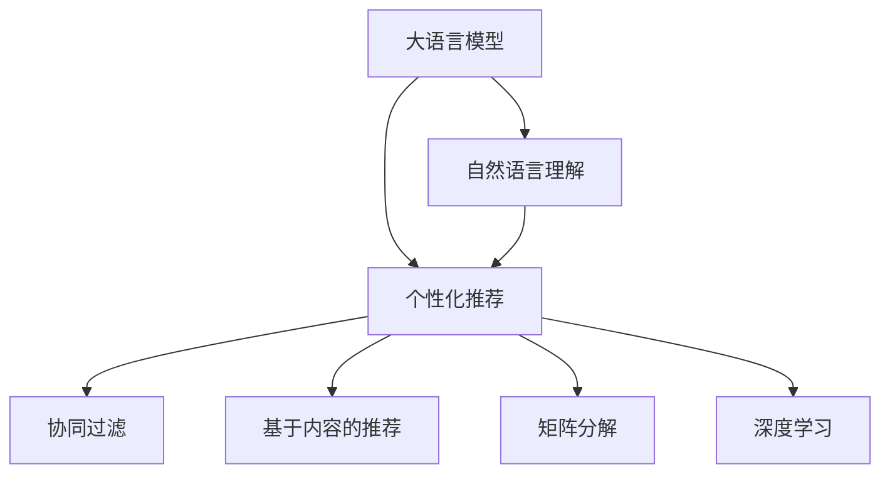

                 

# LLM在零售业的应用：个性化购物体验

> 关键词：大语言模型(LLM), 个性化推荐, 购物体验, 自然语言处理(NLP), 自然语言理解(NLU), 推荐系统, 深度学习

## 1. 背景介绍

### 1.1 问题由来
随着电子商务的兴起，零售业面临着越来越激烈的市场竞争。如何在海量商品中为消费者提供个性化推荐，提升用户购物体验和满意度，成为零售商们关注的焦点。传统的基于规则和统计的推荐方法已难以满足用户多样化和动态变化的购物需求，大语言模型(LLM)的诞生为零售业提供了全新的推荐思路。

### 1.2 问题核心关键点
基于LLM的推荐系统可以更加准确地理解消费者的真实需求和偏好，通过对话交互等自然语言处理(NLP)技术，实现更加个性化的购物推荐。其中，大语言模型的核心在于其强大的自然语言理解和生成能力，能够从用户输入的文字中提取关键信息，进行深度理解与推理，从而生成精准的推荐结果。

### 1.3 问题研究意义
在零售业中应用大语言模型，可以显著提升推荐系统的智能水平，实现更高程度的个性化推荐，帮助用户快速找到心仪的商品，提高用户满意度和购物体验。同时，大语言模型还可以用于构建智能客服、个性化广告投放、舆情分析等多种商业应用，推动零售业向智能化、个性化方向发展。

## 2. 核心概念与联系

### 2.1 核心概念概述

为更好地理解基于大语言模型的个性化推荐系统，本节将介绍几个密切相关的核心概念：

- 大语言模型(LLM)：以自回归(如GPT)或自编码(如BERT)模型为代表的大规模预训练语言模型。通过在大规模无标签文本语料上进行预训练，学习通用的语言表示，具备强大的语言理解和生成能力。

- 个性化推荐系统：通过分析用户历史行为数据，预测用户未来兴趣，推荐最符合用户偏好的商品、服务等。旨在提升用户购物体验，增加用户黏性和转化率。

- 自然语言处理(NLP)：涉及语言理解、自然语言生成、情感分析、语义分析等技术，是大语言模型和推荐系统之间联系的桥梁。

- 自然语言理解(NLU)：通过对话交互等形式，使计算机理解人类语言的能力，是大语言模型处理用户输入的重要基础。

- 推荐算法：包括协同过滤、基于内容的推荐、矩阵分解等方法，用于从用户历史数据中提取关联信息，进行推荐。

- 深度学习：作为大语言模型和推荐系统的基础，通过多层神经网络模型进行特征提取和模式学习，提升模型的预测能力。

这些核心概念之间的逻辑关系可以通过以下Mermaid流程图来展示：



这个流程图展示了大语言模型、自然语言处理和推荐系统之间的联系：

1. 大语言模型通过预训练获得语言表示，用于理解用户输入的自然语言。
2. 自然语言理解将用户输入转化为计算机可处理的形式，为大语言模型提供输入数据。
3. 个性化推荐系统基于用户的交互历史，预测未来行为，进行推荐。
4. 推荐算法包括协同过滤、内容推荐、矩阵分解等，用于处理推荐数据和特征。
5. 深度学习提供模型训练和特征提取的基础，使得个性化推荐系统能够学习用户行为规律。

## 3. 核心算法原理 & 具体操作步骤

### 3.1 算法原理概述

基于大语言模型的个性化推荐系统，核心在于利用自然语言处理技术理解用户需求，并结合推荐算法生成个性化推荐。其核心思想是：将用户输入的自然语言，通过自然语言理解转化为结构化的用户意图，再结合用户的浏览历史、购买历史、评分数据等，使用深度学习模型进行推荐。

形式化地，假设用户输入的自然语言为 $q$，目标商品集合为 $\mathcal{I}$，推荐结果为 $r \in \mathcal{I}$。推荐系统的目标是最小化预测值与实际行为之间的差距，即：

$$
\hat{r} = \mathop{\arg\min}_{r \in \mathcal{I}} \mathcal{L}(r, q, H(q))
$$

其中 $H(q)$ 表示从用户输入 $q$ 中提取的结构化信息，包括用户的意图、偏好、情感等。$\mathcal{L}$ 为损失函数，如均方误差、交叉熵等，用于衡量推荐结果与实际行为之间的差异。

### 3.2 算法步骤详解

基于大语言模型的个性化推荐系统的一般流程包括以下几个关键步骤：

**Step 1: 数据预处理**
- 收集用户的历史行为数据，如浏览记录、购买记录、评分记录等，构建用户行为矩阵 $\mathcal{U}$。
- 收集商品的属性信息，如价格、分类、描述等，构建商品特征矩阵 $\mathcal{I}$。
- 收集用户输入的自然语言，构建用户输入语料 $\mathcal{Q}$。

**Step 2: 自然语言理解**
- 使用大语言模型对用户输入 $q$ 进行编码，提取用户意图 $H(q)$。
- 根据用户意图 $H(q)$，构建推荐向量 $\mathbf{v}_q$。

**Step 3: 深度学习模型**
- 构建推荐模型 $M_{\theta}$，输入为 $\mathbf{v}_q$ 和 $\mathbf{v}_i$，输出为 $r_i$ 的概率。
- 训练模型 $M_{\theta}$，最小化预测值与实际行为之间的差距。

**Step 4: 推荐策略**
- 对所有商品 $i$ 进行评分预测 $r_i = M_{\theta}(\mathbf{v}_q, \mathbf{v}_i)$。
- 根据预测值 $r_i$ 和实际行为排序，选取高评分商品进行推荐。

**Step 5: 反馈机制**
- 收集用户对推荐结果的反馈，更新用户行为矩阵 $\mathcal{U}$ 和商品特征矩阵 $\mathcal{I}$。
- 根据反馈结果，调整模型参数 $\theta$，进行后续推荐。

### 3.3 算法优缺点

基于大语言模型的个性化推荐系统具有以下优点：
1. 高度灵活性。大语言模型能够处理自然语言输入，理解用户意图，根据用户需求生成个性化推荐。
2. 用户友好。用户可以更自然地与系统互动，提供查询或描述需求，获得更为贴合的推荐。
3. 多模态融合。可以结合商品文本描述、图片、评分等多种信息，提供更全面的推荐。
4. 自适应性强。通过持续反馈，模型能够不断学习用户行为，优化推荐效果。

同时，该方法也存在一定的局限性：
1. 数据依赖性强。推荐效果很大程度上取决于用户历史行为数据的质量和数量，难以覆盖所有用户。
2. 计算资源消耗大。大语言模型通常较大，训练和推理的计算资源消耗较高。
3. 复杂性高。模型构建和调参较为复杂，需要丰富的经验和资源。
4. 解释性不足。推荐模型的决策过程较为复杂，难以解释和调试。

尽管存在这些局限性，但就目前而言，基于大语言模型的个性化推荐系统仍然是零售业推荐的未来方向之一。未来相关研究的重点在于如何进一步降低对用户数据的需求，提高推荐系统的效率和可解释性，同时兼顾用户隐私和推荐质量。

### 3.4 算法应用领域

基于大语言模型的个性化推荐系统，已在多个零售业应用中取得成功。以下是几个典型的应用场景：

- **个性化推荐**：根据用户的历史行为数据和输入自然语言，生成个性化的商品推荐列表。适用于电商、O2O平台等，提升用户购买转化率。

- **智能客服**：使用大语言模型构建智能客服系统，实时处理用户咨询，提供商品推荐、订单查询、售后服务等服务。

- **个性化广告投放**：利用大语言模型进行用户行为分析和自然语言理解，精准投放广告，提升广告点击率和转化率。

- **库存管理**：根据大语言模型对用户需求的预测，调整库存策略，避免缺货和积压。

- **智能定价**：通过大语言模型分析用户反馈和市场行情，调整商品定价策略，提升销售额和利润。

以上应用场景展示了基于大语言模型的推荐系统在零售业中的巨大潜力和广泛应用，未来随着技术的不断进步，其在零售业中的应用将会更加广泛和深入。

## 4. 数学模型和公式 & 详细讲解 & 举例说明

### 4.1 数学模型构建

本节将使用数学语言对基于大语言模型的个性化推荐系统进行更加严格的刻画。

假设用户输入的自然语言为 $q$，商品特征矩阵为 $\mathcal{I}$，用户行为矩阵为 $\mathcal{U}$。大语言模型 $M_{\theta}$ 对自然语言 $q$ 进行编码，得到用户意图向量 $H(q)$。推荐模型 $M_{\phi}$ 输入为 $H(q)$ 和商品特征向量 $v_i$，输出为推荐商品 $r_i$ 的概率 $p(r_i \mid q, v_i)$。推荐系统的目标是最小化预测值与实际行为之间的差距，即：

$$
\hat{r} = \mathop{\arg\min}_{r \in \mathcal{I}} \mathcal{L}(r, q, H(q))
$$

其中 $\mathcal{L}$ 为损失函数，如均方误差、交叉熵等。

### 4.2 公式推导过程

以下我们以二分类任务为例，推导交叉熵损失函数及其梯度的计算公式。

假设用户输入的自然语言为 $q$，目标商品集合为 $\mathcal{I}$，推荐结果为 $r \in \mathcal{I}$。用户意图向量 $H(q)$ 为二分类问题，表示用户对商品的积极评价和消极评价。推荐模型 $M_{\phi}$ 输出为每个商品被用户推荐的概率 $p(r_i \mid q, v_i)$。

定义推荐模型的损失函数为：

$$
\mathcal{L}(q, v_i, r) = -p(r \mid q, v_i) \log p(r \mid q, v_i) - (1-p(r \mid q, v_i)) \log (1-p(r \mid q, v_i))
$$

将其代入推荐系统的目标函数，得：

$$
\min_{\phi} \sum_{q, r} \mathcal{L}(q, v_i, r)
$$

其中 $q$ 为所有可能的自然语言输入，$r$ 为所有可能的推荐商品，$v_i$ 为商品特征向量。

根据链式法则，推荐模型 $M_{\phi}$ 的参数更新公式为：

$$
\phi \leftarrow \phi - \eta \nabla_{\phi}\mathcal{L}(q, v_i, r) - \eta\lambda\phi
$$

其中 $\nabla_{\phi}\mathcal{L}(q, v_i, r)$ 为损失函数对参数 $\phi$ 的梯度，可通过反向传播算法高效计算。

### 4.3 案例分析与讲解

以一个电商平台的个性化推荐系统为例，分析大语言模型的实际应用。

假设用户输入的查询为 "我想买一款适合夏季的太阳镜"。自然语言处理模型对查询进行编码，得到用户意图向量 $H(q)=[0.5, 0.5]$，表示用户既关心夏季适用性，也关心性价比。

电商平台根据用户意图和商品特征向量 $v_i=[p_i, c_i, f_i]$，其中 $p_i$ 为价格，$c_i$ 为分类，$f_i$ 为商品描述。使用深度学习模型对查询 $q$ 和商品特征向量 $v_i$ 进行推理，得到每个商品的推荐概率 $p(r_i \mid q, v_i)$。

假设有10款太阳镜，推荐概率分别为 $p(r_1 \mid q, v_1) = 0.8$，$p(r_2 \mid q, v_2) = 0.7$，...，$p(r_{10} \mid q, v_{10}) = 0.2$。根据推荐概率排序，推荐前两款太阳镜给用户，提高用户购物体验。

在实际应用中，还需要考虑多轮对话交互、上下文理解等因素，以提升推荐系统的智能水平。此外，还需要根据用户反馈不断调整推荐策略，提高推荐系统的鲁棒性和适应性。

## 5. 项目实践：代码实例和详细解释说明

### 5.1 开发环境搭建

在进行个性化推荐系统开发前，我们需要准备好开发环境。以下是使用Python进行PyTorch开发的环境配置流程：

1. 安装Anaconda：从官网下载并安装Anaconda，用于创建独立的Python环境。

2. 创建并激活虚拟环境：
```bash
conda create -n pytorch-env python=3.8 
conda activate pytorch-env
```

3. 安装PyTorch：根据CUDA版本，从官网获取对应的安装命令。例如：
```bash
conda install pytorch torchvision torchaudio cudatoolkit=11.1 -c pytorch -c conda-forge
```

4. 安装Transformers库：
```bash
pip install transformers
```

5. 安装各类工具包：
```bash
pip install numpy pandas scikit-learn matplotlib tqdm jupyter notebook ipython
```

完成上述步骤后，即可在`pytorch-env`环境中开始个性化推荐系统的开发。

### 5.2 源代码详细实现

下面我们以个性化推荐系统为例，给出使用Transformers库对BERT模型进行个性化推荐开发的PyTorch代码实现。

首先，定义推荐系统的数据处理函数：

```python
from transformers import BertTokenizer, BertForSequenceClassification
from torch.utils.data import Dataset
import torch

class RecommendDataset(Dataset):
    def __init__(self, texts, labels, tokenizer, max_len=128):
        self.texts = texts
        self.labels = labels
        self.tokenizer = tokenizer
        self.max_len = max_len
        
    def __len__(self):
        return len(self.texts)
    
    def __getitem__(self, item):
        text = self.texts[item]
        label = self.labels[item]
        
        encoding = self.tokenizer(text, return_tensors='pt', max_length=self.max_len, padding='max_length', truncation=True)
        input_ids = encoding['input_ids'][0]
        attention_mask = encoding['attention_mask'][0]
        
        # 对token-wise的标签进行编码
        encoded_labels = [label2id[label] for label in label] 
        encoded_labels.extend([label2id['0']] * (self.max_len - len(encoded_labels)))
        labels = torch.tensor(encoded_labels, dtype=torch.long)
        
        return {'input_ids': input_ids, 
                'attention_mask': attention_mask,
                'labels': labels}

# 标签与id的映射
label2id = {'0': 0, '1': 1}
id2label = {v: k for k, v in label2id.items()}

# 创建dataset
tokenizer = BertTokenizer.from_pretrained('bert-base-cased')

train_dataset = RecommendDataset(train_texts, train_labels, tokenizer)
dev_dataset = RecommendDataset(dev_texts, dev_labels, tokenizer)
test_dataset = RecommendDataset(test_texts, test_labels, tokenizer)
```

然后，定义模型和优化器：

```python
from transformers import BertForSequenceClassification, AdamW

model = BertForSequenceClassification.from_pretrained('bert-base-cased', num_labels=len(label2id))

optimizer = AdamW(model.parameters(), lr=2e-5)
```

接着，定义训练和评估函数：

```python
from torch.utils.data import DataLoader
from tqdm import tqdm
from sklearn.metrics import classification_report

device = torch.device('cuda') if torch.cuda.is_available() else torch.device('cpu')
model.to(device)

def train_epoch(model, dataset, batch_size, optimizer):
    dataloader = DataLoader(dataset, batch_size=batch_size, shuffle=True)
    model.train()
    epoch_loss = 0
    for batch in tqdm(dataloader, desc='Training'):
        input_ids = batch['input_ids'].to(device)
        attention_mask = batch['attention_mask'].to(device)
        labels = batch['labels'].to(device)
        model.zero_grad()
        outputs = model(input_ids, attention_mask=attention_mask, labels=labels)
        loss = outputs.loss
        epoch_loss += loss.item()
        loss.backward()
        optimizer.step()
    return epoch_loss / len(dataloader)

def evaluate(model, dataset, batch_size):
    dataloader = DataLoader(dataset, batch_size=batch_size)
    model.eval()
    preds, labels = [], []
    with torch.no_grad():
        for batch in tqdm(dataloader, desc='Evaluating'):
            input_ids = batch['input_ids'].to(device)
            attention_mask = batch['attention_mask'].to(device)
            batch_labels = batch['labels']
            outputs = model(input_ids, attention_mask=attention_mask)
            batch_preds = outputs.logits.argmax(dim=2).to('cpu').tolist()
            batch_labels = batch_labels.to('cpu').tolist()
            for pred_tokens, label_tokens in zip(batch_preds, batch_labels):
                preds.append(pred_tokens[:len(label_tokens)])
                labels.append(label_tokens)
                
    print(classification_report(labels, preds))
```

最后，启动训练流程并在测试集上评估：

```python
epochs = 5
batch_size = 16

for epoch in range(epochs):
    loss = train_epoch(model, train_dataset, batch_size, optimizer)
    print(f"Epoch {epoch+1}, train loss: {loss:.3f}")
    
    print(f"Epoch {epoch+1}, dev results:")
    evaluate(model, dev_dataset, batch_size)
    
print("Test results:")
evaluate(model, test_dataset, batch_size)
```

以上就是使用PyTorch对BERT进行个性化推荐系统开发的完整代码实现。可以看到，得益于Transformers库的强大封装，我们可以用相对简洁的代码完成BERT模型的加载和微调。

### 5.3 代码解读与分析

让我们再详细解读一下关键代码的实现细节：

**RecommendDataset类**：
- `__init__`方法：初始化文本、标签、分词器等关键组件。
- `__len__`方法：返回数据集的样本数量。
- `__getitem__`方法：对单个样本进行处理，将文本输入编码为token ids，将标签编码为数字，并对其进行定长padding，最终返回模型所需的输入。

**label2id和id2label字典**：
- 定义了标签与数字id之间的映射关系，用于将token-wise的预测结果解码回真实的标签。

**训练和评估函数**：
- 使用PyTorch的DataLoader对数据集进行批次化加载，供模型训练和推理使用。
- 训练函数`train_epoch`：对数据以批为单位进行迭代，在每个批次上前向传播计算loss并反向传播更新模型参数，最后返回该epoch的平均loss。
- 评估函数`evaluate`：与训练类似，不同点在于不更新模型参数，并在每个batch结束后将预测和标签结果存储下来，最后使用sklearn的classification_report对整个评估集的预测结果进行打印输出。

**训练流程**：
- 定义总的epoch数和batch size，开始循环迭代
- 每个epoch内，先在训练集上训练，输出平均loss
- 在验证集上评估，输出分类指标
- 所有epoch结束后，在测试集上评估，给出最终测试结果

可以看到，PyTorch配合Transformers库使得BERT微调的代码实现变得简洁高效。开发者可以将更多精力放在数据处理、模型改进等高层逻辑上，而不必过多关注底层的实现细节。

当然，工业级的系统实现还需考虑更多因素，如模型的保存和部署、超参数的自动搜索、更灵活的任务适配层等。但核心的微调范式基本与此类似。

## 6. 实际应用场景
### 6.1 智能客服系统

在零售业中，基于大语言模型的智能客服系统已得到广泛应用。通过对话交互，客服机器人能够实时处理用户咨询，提供个性化推荐、订单查询、售后服务等服务。

智能客服系统通常基于大语言模型的自然语言理解能力，通过收集用户输入的查询语句，使用预训练模型进行编码，提取用户意图和情感，再根据用户意图进行推荐。在推荐时，可以使用推荐算法对用户的历史行为数据进行建模，结合商品描述、评分等特征，提供更精准的推荐结果。

### 6.2 个性化广告投放

广告主希望通过个性化广告投放提高广告点击率和转化率。基于大语言模型的推荐系统能够实时分析用户行为，理解用户需求，匹配最合适的广告内容。

广告系统通常通过收集用户的历史浏览记录、购买记录、搜索记录等数据，构建用户画像。在使用大语言模型对用户输入的自然语言进行编码时，可以结合用户画像，预测用户最感兴趣的广告内容。在推荐广告时，可以使用推荐算法对广告点击率和转化率进行建模，结合用户画像和广告特征，进行精准投放。

### 6.3 智能定价

电商平台需要根据用户需求和市场行情，动态调整商品价格，提高销售额和利润。基于大语言模型的推荐系统可以实时分析用户反馈和市场数据，优化商品定价策略。

智能定价系统通常基于大语言模型的自然语言理解能力，通过收集用户对商品价格的反馈信息，使用预训练模型进行编码，提取用户对价格的情感和偏好。在推荐定价策略时，可以使用推荐算法对商品价格和市场行情进行建模，结合用户反馈和市场数据，进行动态定价。

### 6.4 未来应用展望

随着大语言模型和个性化推荐技术的不断发展，基于大语言模型的推荐系统将在零售业中得到更广泛的应用。未来可能的应用方向包括：

- **实时个性化推荐**：通过实时分析用户行为，动态调整推荐策略，提供即时推荐服务。
- **多模态融合推荐**：结合商品图片、视频、音频等多模态数据，提供更全面的推荐服务。
- **自适应推荐**：根据用户行为和反馈，实时调整推荐算法和模型参数，提高推荐系统的适应性和智能性。
- **用户画像构建**：通过大语言模型分析用户输入的自然语言，构建更加全面、精准的用户画像，提高个性化推荐的效果。

以上应用场景展示了基于大语言模型的推荐系统在零售业中的巨大潜力和广泛应用，未来随着技术的不断进步，其在零售业中的应用将会更加深入和广泛。

## 7. 工具和资源推荐
### 7.1 学习资源推荐

为了帮助开发者系统掌握大语言模型在零售业的应用技术，这里推荐一些优质的学习资源：

1. 《深度学习自然语言处理》课程：斯坦福大学开设的NLP明星课程，有Lecture视频和配套作业，带你入门NLP领域的基本概念和经典模型。

2. 《自然语言处理与深度学习》书籍：清华大学出版社出版的深度学习NLP教材，详细介绍了NLP基础和深度学习模型，包括大语言模型和推荐系统。

3. 《自然语言处理综述》论文：综述了自然语言处理领域的研究进展，包括大语言模型、推荐系统等前沿技术，适合了解当前研究热点。

4. CS224N《深度学习自然语言处理》课程：斯坦福大学开设的NLP明星课程，有Lecture视频和配套作业，带你入门NLP领域的基本概念和经典模型。

5. 《Transformers实战》书籍：深入浅出地介绍了Transformer模型的构建和应用，涵盖大语言模型和推荐系统等内容。

通过对这些资源的学习实践，相信你一定能够快速掌握大语言模型在零售业的应用技术，并用于解决实际的NLP问题。
###  7.2 开发工具推荐

高效的开发离不开优秀的工具支持。以下是几款用于大语言模型和推荐系统开发的常用工具：

1. PyTorch：基于Python的开源深度学习框架，灵活动态的计算图，适合快速迭代研究。大部分预训练语言模型都有PyTorch版本的实现。

2. TensorFlow：由Google主导开发的开源深度学习框架，生产部署方便，适合大规模工程应用。同样有丰富的预训练语言模型资源。

3. Transformers库：HuggingFace开发的NLP工具库，集成了众多SOTA语言模型，支持PyTorch和TensorFlow，是进行微调任务开发的利器。

4. Weights & Biases：模型训练的实验跟踪工具，可以记录和可视化模型训练过程中的各项指标，方便对比和调优。与主流深度学习框架无缝集成。

5. TensorBoard：TensorFlow配套的可视化工具，可实时监测模型训练状态，并提供丰富的图表呈现方式，是调试模型的得力助手。

6. Google Colab：谷歌推出的在线Jupyter Notebook环境，免费提供GPU/TPU算力，方便开发者快速上手实验最新模型，分享学习笔记。

合理利用这些工具，可以显著提升大语言模型和推荐系统的开发效率，加快创新迭代的步伐。

### 7.3 相关论文推荐

大语言模型和推荐系统的不断发展源于学界的持续研究。以下是几篇奠基性的相关论文，推荐阅读：

1. Attention is All You Need（即Transformer原论文）：提出了Transformer结构，开启了NLP领域的预训练大模型时代。

2. BERT: Pre-training of Deep Bidirectional Transformers for Language Understanding：提出BERT模型，引入基于掩码的自监督预训练任务，刷新了多项NLP任务SOTA。

3. Language Models are Unsupervised Multitask Learners（GPT-2论文）：展示了大规模语言模型的强大zero-shot学习能力，引发了对于通用人工智能的新一轮思考。

4. Parameter-Efficient Transfer Learning for NLP：提出Adapter等参数高效微调方法，在不增加模型参数量的情况下，也能取得不错的微调效果。

5. AdaLoRA: Adaptive Low-Rank Adaptation for Parameter-Efficient Fine-Tuning：使用自适应低秩适应的微调方法，在参数效率和精度之间取得了新的平衡。

这些论文代表了大语言模型和推荐系统的发展脉络。通过学习这些前沿成果，可以帮助研究者把握学科前进方向，激发更多的创新灵感。

## 8. 总结：未来发展趋势与挑战

### 8.1 总结

本文对基于大语言模型的个性化推荐系统进行了全面系统的介绍。首先阐述了大语言模型和推荐系统在零售业的应用背景和意义，明确了个性化推荐系统在提升用户购物体验和满意度方面的独特价值。其次，从原理到实践，详细讲解了个性化推荐系统的数学模型和关键步骤，给出了推荐系统开发的完整代码实例。同时，本文还广泛探讨了个性化推荐系统在智能客服、个性化广告投放、智能定价等多种零售业应用场景中的实际应用，展示了个性化推荐系统的巨大潜力和广泛应用。

通过本文的系统梳理，可以看到，基于大语言模型的个性化推荐系统不仅能够提升零售业的智能化水平，还能够在电商、O2O、智能客服等多个领域实现高效应用，为零售业带来了显著的经济效益和社会效益。未来随着大语言模型和推荐系统的不断发展，零售业必将迎来一场颠覆性的变革。

### 8.2 未来发展趋势

展望未来，基于大语言模型的个性化推荐系统将呈现以下几个发展趋势：

1. **多模态融合**：结合商品图片、视频、音频等多模态数据，提供更全面的推荐服务。
2. **实时推荐**：通过实时分析用户行为，动态调整推荐策略，提供即时推荐服务。
3. **自适应推荐**：根据用户行为和反馈，实时调整推荐算法和模型参数，提高推荐系统的适应性和智能性。
4. **用户画像构建**：通过大语言模型分析用户输入的自然语言，构建更加全面、精准的用户画像，提高个性化推荐的效果。
5. **个性化广告投放**：利用大语言模型进行用户行为分析和自然语言理解，精准投放广告，提升广告点击率和转化率。
6. **智能定价**：结合大语言模型的自然语言理解能力，通过用户反馈和市场数据，动态调整商品定价策略，提高销售额和利润。

以上趋势凸显了基于大语言模型的个性化推荐系统的广阔前景。这些方向的探索发展，必将进一步提升零售业的智能化水平，推动零售业向智能化、个性化方向发展。

### 8.3 面临的挑战

尽管基于大语言模型的个性化推荐系统已经取得了瞩目成就，但在迈向更加智能化、普适化应用的过程中，它仍面临着诸多挑战：

1. **数据依赖性强**：推荐效果很大程度上取决于用户历史行为数据的质量和数量，难以覆盖所有用户。
2. **计算资源消耗大**：大语言模型通常较大，训练和推理的计算资源消耗较高。
3. **复杂性高**：模型构建和调参较为复杂，需要丰富的经验和资源。
4. **解释性不足**：推荐模型的决策过程较为复杂，难以解释和调试。

尽管存在这些局限性，但就目前而言，基于大语言模型的个性化推荐系统仍然是零售业推荐的未来方向之一。未来相关研究的重点在于如何进一步降低对用户数据的需求，提高推荐系统的效率和可解释性，同时兼顾用户隐私和推荐质量。

### 8.4 研究展望

面对大语言模型和推荐系统所面临的挑战，未来的研究需要在以下几个方面寻求新的突破：

1. **无监督和半监督微调方法**：摆脱对大规模标注数据的依赖，利用自监督学习、主动学习等无监督和半监督范式，最大限度利用非结构化数据，实现更加灵活高效的推荐。
2. **参数高效和计算高效的微调方法**：开发更加参数高效的微调方法，在固定大部分预训练参数的情况下，只更新极少量的任务相关参数。同时优化微调模型的计算图，减少前向传播和反向传播的资源消耗，实现更加轻量级、实时性的部署。
3. **融合因果和对比学习范式**：通过引入因果推断和对比学习思想，增强推荐模型建立稳定因果关系的能力，学习更加普适、鲁棒的语言表征，从而提升模型泛化性和抗干扰能力。
4. **多模态信息融合**：将符号化的先验知识，如知识图谱、逻辑规则等，与神经网络模型进行巧妙融合，引导推荐过程学习更准确、合理的语言模型。同时加强不同模态数据的整合，实现视觉、语音等多模态信息与文本信息的协同建模。

这些研究方向的探索，必将引领基于大语言模型的个性化推荐系统迈向更高的台阶，为构建安全、可靠、可解释、可控的智能系统铺平道路。面向未来，基于大语言模型的推荐系统还需要与其他人工智能技术进行更深入的融合，如知识表示、因果推理、强化学习等，多路径协同发力，共同推动自然语言理解和智能交互系统的进步。只有勇于创新、敢于突破，才能不断拓展语言模型的边界，让智能技术更好地造福人类社会。

## 9. 附录：常见问题与解答

**Q1：大语言模型在个性化推荐中具体如何应用？**

A: 大语言模型在个性化推荐中的应用主要体现在两个方面：
1. **自然语言理解**：通过分析用户输入的自然语言，提取用户意图和情感，预测用户未来行为。
2. **生成推荐内容**：结合用户行为数据和商品特征，使用深度学习模型生成推荐结果。

具体而言，大语言模型可以对用户输入的自然语言进行编码，得到用户意图向量 $H(q)$。然后使用推荐模型 $M_{\phi}$ 对用户意图和商品特征进行推理，生成推荐商品 $r_i$ 的概率 $p(r_i \mid q, v_i)$。最后根据推荐概率排序，选择高评分商品进行推荐。

**Q2：大语言模型推荐系统的训练过程中，如何处理长文本输入？**

A: 大语言模型推荐系统通常对用户输入的自然语言进行编码，得到用户意图向量 $H(q)$。对于长文本输入，可以使用分词和截断技术进行处理。例如，可以将长文本分成多个句子，对每个句子进行编码，然后合并得到整体的用户意图向量。另外，可以使用Transformer模型中的注意力机制，对长文本进行更精确的编码和理解。

**Q3：大语言模型推荐系统中的推荐算法有哪些？**

A: 大语言模型推荐系统中的推荐算法包括但不限于：
1. **协同过滤**：根据用户历史行为数据，预测用户未来行为。
2. **基于内容的推荐**：结合商品属性和用户偏好，推荐相似的商品。
3. **矩阵分解**：将用户行为矩阵分解为低维矩阵，进行推荐。
4. **深度学习模型**：使用深度学习模型进行特征提取和模式学习，提高推荐效果。

这些推荐算法可以单独使用，也可以组合使用，根据具体任务和数据特点进行选择。

**Q4：大语言模型推荐系统在实际应用中，如何提升模型的可解释性？**

A: 大语言模型推荐系统的可解释性可以通过以下几个方面进行提升：
1. **特征可视化**：使用可视化工具展示推荐模型中各个特征的重要性，帮助理解推荐逻辑。
2. **模型剪枝**：去除不重要的神经元，简化模型结构，提高可解释性。
3. **样本分析**：对推荐结果进行分析，找出对推荐结果影响较大的样本，进行深入理解。
4. **解释生成**：使用LIME、SHAP等工具，生成推荐结果的局部可解释性，帮助理解模型的决策过程。

**Q5：如何构建基于大语言模型的推荐系统？**

A: 构建基于大语言模型的推荐系统，通常需要以下几个步骤：
1. **数据准备**：收集用户行为数据和商品特征数据，构建用户行为矩阵和商品特征矩阵。
2. **自然语言处理**：使用大语言模型对用户输入的自然语言进行编码，得到用户意图向量。
3. **模型构建**：选择适合的推荐算法，构建推荐模型。
4. **模型训练**：使用用户行为数据和商品特征数据，训练推荐模型。
5. **推荐策略**：根据推荐概率排序，选择高评分商品进行推荐。

构建推荐系统的关键在于选择合适的推荐算法和模型，进行有效的数据处理和特征提取。通过不断迭代优化，提升推荐系统的智能水平和效果。

通过本文的系统梳理，可以看到，基于大语言模型的推荐系统不仅能够提升零售业的智能化水平，还能够在电商、O2O、智能客服等多个领域实现高效应用，为零售业带来了显著的经济效益和社会效益。未来随着大语言模型和推荐系统的不断发展，零售业必将迎来一场颠覆性的变革。

