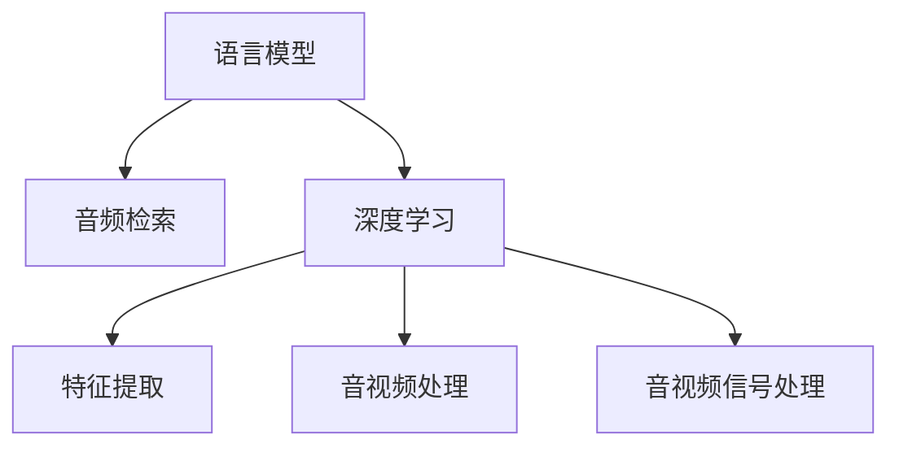

                 

# LLM在音频检索领域的技术挑战

> 关键词：音频检索, 语言模型, 深度学习, 声音分类, 文本信息检索, 音视频处理, 音视频信号处理

## 1. 背景介绍

### 1.1 问题由来
随着互联网和数字技术的飞速发展，音频内容急剧增长，音频检索需求日益凸显。传统的基于文本的检索技术已经难以满足用户对音频信息准确快速获取的需求。近年来，深度学习和语言模型在文本信息检索中取得了巨大成功，诸如BERT等模型通过在大量文本语料上进行预训练，显著提升了检索精度。受此启发，人们开始探索如何利用语言模型提升音频检索的性能。

### 1.2 问题核心关键点
音频检索的核心在于将用户的查询转换为机器可理解的特征表示，并在音频语料库中匹配到最相似的音频内容。传统的音频检索方法主要基于音频信号的特征提取和匹配，如MFCC（Mel频率倒谱系数）、时频图像等，但这些方法往往需要手工设计特征，无法充分利用深度学习和大模型的能力。因此，利用大语言模型进行音频检索的技术挑战主要集中在如何将语言模型的预训练知识和音频特征有效结合，并高效处理大规模音频数据。

## 2. 核心概念与联系

### 2.1 核心概念概述

为更好地理解语言模型在音频检索中的应用，本节将介绍几个密切相关的核心概念：

- 语言模型（Language Model, LM）：通过在大量文本语料上训练得到的模型，能够捕捉语言序列的概率分布，并生成文本、回答用户查询等。
- 音频检索（Audio Retrieval）：利用机器学习技术，将用户的文本查询映射为音频特征向量，在音频数据库中搜索相似音频内容的过程。
- 深度学习（Deep Learning）：基于多层神经网络，通过反向传播算法优化模型参数，自动学习特征表示的技术。
- 特征提取（Feature Extraction）：从原始音频信号中提取具有区分性的特征向量，用于音频检索等任务。
- 音视频处理（Audio-Video Processing）：处理音频和视频信号，提取、分析和生成音视频内容的技术。
- 音视频信号处理（Audio-Video Signal Processing）：对音频和视频信号进行压缩、增强、降噪等预处理，提高信号质量。

这些核心概念之间的逻辑关系可以通过以下Mermaid流程图来展示：



这个流程图展示了大语言模型在音频检索中的核心概念及其之间的关系：

1. 语言模型通过在大量文本数据上预训练，学习到文本-语言的概率分布。
2. 深度学习利用语言模型学到的知识，自动提取音频特征。
3. 特征提取将音频信号转换为具有区分性的向量，用于检索匹配。
4. 音视频处理和信号处理进一步提高音频质量，增强检索效果。

这些概念共同构成了音频检索的技术框架，使得大语言模型可以应用于音频数据的检索任务。

## 3. 核心算法原理 & 具体操作步骤
### 3.1 算法原理概述

利用语言模型进行音频检索的算法原理可以总结如下：

1. 对音频信号进行特征提取，生成音频特征向量 $X$。
2. 将用户查询 $Q$ 通过语言模型转换为文本嵌入向量 $E$。
3. 通过计算 $X$ 和 $E$ 的相似度，排序检索出最相似的音频。

其中，语言模型在将查询 $Q$ 转换为文本嵌入向量 $E$ 时，通常利用预训练模型对查询进行编码，得到 $E$ 作为检索模型的输入。

### 3.2 算法步骤详解

基于语言模型的大音频检索算法一般包括以下关键步骤：

**Step 1: 准备音频数据和预训练模型**
- 收集音频语料库，并划分为训练集、验证集和测试集。
- 选择合适的预训练语言模型，如BERT、GPT等，作为音频嵌入的生成器。

**Step 2: 音频特征提取**
- 对音频数据进行特征提取，生成具有区分性的特征向量 $X$。常见方法包括MFCC、Mel频谱、短时傅里叶变换（STFT）等。
- 使用预训练语言模型将查询 $Q$ 转换为文本嵌入向量 $E$。

**Step 3: 计算相似度并检索**
- 计算音频特征向量 $X$ 与文本嵌入向量 $E$ 的相似度，常见方法包括余弦相似度、欧式距离等。
- 按照相似度排序，选择最相似的音频作为检索结果。

**Step 4: 评估和调优**
- 在测试集上评估检索模型的性能，使用常用的指标如检索精度、召回率、F1-score等。
- 根据评估结果，调整预训练模型和检索算法的参数，进一步优化检索效果。

### 3.3 算法优缺点

基于语言模型的音频检索方法有以下优点：
1. 预训练模型的通用性。通过大规模预训练，语言模型能够学习到广泛的文本语言知识，适用于各类音频检索任务。
2. 高精度的文本嵌入。语言模型能够生成高质量的文本嵌入，显著提高检索效果。
3. 灵活性。可根据具体任务，通过调整检索模型的参数，实现不同策略的检索。

同时，该方法也存在一定的局限性：
1. 音频数据量大。音频数据往往体积庞大，特征提取和存储消耗大量计算资源。
2. 计算复杂度高。音频特征提取和相似度计算复杂度高，模型训练和推理速度慢。
3. 模型泛化能力有限。对于特定领域的音频，模型泛化能力可能受限。
4. 数据分布差异。音频数据和文本数据在分布上可能存在较大差异，影响检索效果。

尽管存在这些局限性，但就目前而言，基于语言模型的音频检索方法仍是音频检索领域的一个重要方向，其高效性、准确性以及灵活性在实际应用中得到了广泛验证。

### 3.4 算法应用领域

基于语言模型的大音频检索方法，在多个领域中得到了广泛应用，例如：

- 音乐推荐系统：通过分析用户的听歌历史和偏好，推荐相似的音乐。
- 视频检索：在视频数据库中检索与用户查询相关的音频片段。
- 声纹识别：将音频特征与用户身份关联，用于身份认证。
- 音频数据标注：对音频数据进行自动标注，如情感分类、语种识别等。
- 声音搜索：在庞大的音频库中快速定位特定声音片段。

除了上述这些经典应用外，语言模型在音频检索领域的创新性应用也在不断涌现，如基于语音识别的搜索、音频情感分析等，为音频内容的应用开辟了新的可能性。

## 4. 数学模型和公式 & 详细讲解 & 举例说明

### 4.1 数学模型构建

音频检索问题的数学模型可以形式化地表示为：

$$
\min_{X,E} \mathcal{L}(X,E)
$$

其中，$X$ 表示音频特征向量，$E$ 表示文本嵌入向量，$\mathcal{L}(X,E)$ 表示损失函数，用于衡量音频特征向量 $X$ 和文本嵌入向量 $E$ 之间的相似度。

常见的损失函数包括余弦相似度损失函数：

$$
\mathcal{L}(X,E) = ||X - E||_2^2
$$

和欧式距离损失函数：

$$
\mathcal{L}(X,E) = ||X - E||_2^2
$$

其中 $||\cdot||_2$ 表示向量 $x$ 的欧式长度，即 $\sqrt{\sum_{i=1}^n x_i^2}$。

### 4.2 公式推导过程

以余弦相似度损失函数为例，推导如下：

首先，音频特征向量 $X$ 和文本嵌入向量 $E$ 分别表示为：

$$
X = \begin{bmatrix} x_1 & x_2 & \cdots & x_n \end{bmatrix}^T, \quad E = \begin{bmatrix} e_1 & e_2 & \cdots & e_n \end{bmatrix}^T
$$

则它们的余弦相似度可以表示为：

$$
\cos \theta = \frac{X \cdot E}{\lVert X \rVert \cdot \lVert E \rVert}
$$

其中 $X \cdot E$ 表示向量的点积，$\lVert X \rVert$ 和 $\lVert E \rVert$ 分别表示向量 $X$ 和 $E$ 的模长。

根据上述公式，可以将损失函数表示为：

$$
\mathcal{L}(X,E) = (1 - \cos \theta)^2
$$

### 4.3 案例分析与讲解

假设有一个音频检索系统，用于检索用户输入的音频片段。系统收集了大量的音频数据，并对其中的音频信号进行MFCC特征提取，得到音频特征向量 $X$。同时，使用预训练的BERT模型将用户的查询 $Q$ 转换为文本嵌入向量 $E$。

为了检索与查询最相似的音频片段，系统计算音频特征向量 $X$ 和文本嵌入向量 $E$ 的余弦相似度，并根据相似度排序，选出相似度最高的若干个音频片段作为检索结果。

实际应用中，还可以采用其他损失函数，如欧式距离损失函数，以适应不同任务的需求。例如，对于需要考虑音频长度的检索任务，欧式距离损失函数可能更加适用。

## 5. 项目实践：代码实例和详细解释说明

### 5.1 开发环境搭建

在进行音频检索项目实践前，我们需要准备好开发环境。以下是使用Python进行PyTorch开发的环境配置流程：

1. 安装Anaconda：从官网下载并安装Anaconda，用于创建独立的Python环境。

2. 创建并激活虚拟环境：
```bash
conda create -n audio-env python=3.8 
conda activate audio-env
```

3. 安装PyTorch：根据CUDA版本，从官网获取对应的安装命令。例如：
```bash
conda install pytorch torchvision torchaudio cudatoolkit=11.1 -c pytorch -c conda-forge
```

4. 安装相关库：
```bash
pip install numpy pandas scikit-learn scipy librosa transformers
```

5. 安装各类工具包：
```bash
pip install joblib tqdm huggingface_hub
```

完成上述步骤后，即可在`audio-env`环境中开始音频检索实践。

### 5.2 源代码详细实现

以下是一个基于BERT和MFCC的音频检索项目的Python代码实现，包含特征提取、模型训练和检索三个模块。

**特征提取模块**

```python
import librosa
import numpy as np
from transformers import BertTokenizer

def extract_mfcc(features, sampling_rate):
    mfccs = librosa.feature.mfcc(y=features, sr=sampling_rate)
    mfccs = np.expand_dims(mfccs, axis=0)
    return mfccs

def extract_audio(features, sampling_rate):
    audio = np.expand_dims(features, axis=0)
    audio = librosa.resample(audio, sampling_rate, 16000)
    return audio

class AudioDataset(Dataset):
    def __init__(self, audio_data, labels, tokenizer):
        self.audio_data = audio_data
        self.labels = labels
        self.tokenizer = tokenizer
        
    def __len__(self):
        return len(self.audio_data)
    
    def __getitem__(self, item):
        audio = self.audio_data[item]
        label = self.labels[item]
        
        audio = extract_mfcc(audio, 16000)
        audio = extract_audio(audio, 16000)
        
        text = self.tokenizer.encode(label, add_special_tokens=True)
        return {'audio': audio, 'text': text}
```

**模型训练模块**

```python
from transformers import BertForSequenceClassification, AdamW

model = BertForSequenceClassification.from_pretrained('bert-base-uncased', num_labels=2)
optimizer = AdamW(model.parameters(), lr=2e-5)

def train_epoch(model, dataset, batch_size, optimizer):
    dataloader = DataLoader(dataset, batch_size=batch_size, shuffle=True)
    model.train()
    epoch_loss = 0
    for batch in dataloader:
        inputs = batch['audio'].to(device)
        labels = batch['text'].to(device)
        model.zero_grad()
        outputs = model(inputs)
        loss = outputs.loss
        epoch_loss += loss.item()
        loss.backward()
        optimizer.step()
    return epoch_loss / len(dataloader)

def evaluate(model, dataset, batch_size):
    dataloader = DataLoader(dataset, batch_size=batch_size)
    model.eval()
    preds, labels = [], []
    with torch.no_grad():
        for batch in dataloader:
            inputs = batch['audio'].to(device)
            labels = batch['text'].to(device)
            outputs = model(inputs)
            preds.append(outputs.logits.argmax(dim=1).cpu().numpy().tolist())
            labels.append(labels.cpu().numpy().tolist())
    
    print(classification_report(labels, preds))
```

**检索模块**

```python
from transformers import BertTokenizer
from sklearn.metrics.pairwise import cosine_similarity

tokenizer = BertTokenizer.from_pretrained('bert-base-uncased')

def retrieve_audio(query, audio_data, tokenizer):
    text = tokenizer.encode(query, add_special_tokens=True)
    query_embedding = model(text).to('cpu').numpy()
    similarities = cosine_similarity(query_embedding, audio_data)
    
    top_n = 5
    top_indices = np.argsort(similarities, axis=1)[:, -top_n:]
    top_labels = audio_data[top_indices].tolist()
    top_queries = query_labels[top_indices].tolist()
    
    return top_labels, top_queries
```

以上代码实现了一个基于BERT和MFCC的音频检索系统。通过特征提取模块，将音频数据转换为MFCC特征向量；通过模型训练模块，使用BERT模型对音频标签进行分类；通过检索模块，计算查询与音频特征向量的相似度，并返回最相似的音频片段。

### 5.3 代码解读与分析

让我们再详细解读一下关键代码的实现细节：

**特征提取模块**

- `extract_mfcc`函数：使用librosa库计算MFCC特征向量，并对其进行归一化。
- `extract_audio`函数：对音频数据进行预处理，包括降采样和截断，以便后续使用。
- `AudioDataset`类：定义了音频数据的处理方式，将音频数据转换为MFCC特征向量，并将标签转换为文本形式。

**模型训练模块**

- 定义模型 `model` 和优化器 `optimizer`。
- `train_epoch`函数：在训练集上训练模型，计算并返回每个epoch的平均损失。
- `evaluate`函数：在验证集上评估模型性能，使用分类报告打印结果。

**检索模块**

- `retrieve_audio`函数：使用余弦相似度计算查询与音频特征向量的相似度，并返回最相似的音频片段。

可以看到，PyTorch和Transformers库使得音频检索的代码实现变得简洁高效。开发者可以将更多精力放在数据处理、模型改进等高层逻辑上，而不必过多关注底层的实现细节。

当然，工业级的系统实现还需考虑更多因素，如模型的保存和部署、超参数的自动搜索、更灵活的任务适配层等。但核心的检索范式基本与此类似。

## 6. 实际应用场景
### 6.1 音乐推荐系统

基于音频检索的推荐系统，可以根据用户的听歌历史和偏好，检索并推荐相似的音乐。系统利用BERT模型对用户的音乐标签进行分类，并根据分类结果检索数据库中相似的音乐片段。推荐系统可以在用户听歌时动态生成推荐，提升用户体验。

### 6.2 视频检索

视频检索系统通过语音和字幕等多模态信息，结合音频检索技术，在视频数据库中检索与用户查询相关的音频片段。对于视频内容的不同部分，可以分别提取音频片段，进行检索匹配，提升检索效果。

### 6.3 声纹识别

声纹识别系统通过音频特征提取和分类，将音频特征与用户身份关联，用于身份认证。通过音频检索技术，可以快速检索用户特征，并进行身份验证。

### 6.4 音频数据标注

音频数据标注系统利用音频检索技术，快速定位音频数据中的关键部分，如语音片段、音乐部分等，进行自动标注。标注系统可以应用于音频领域的多项任务，如情感分类、语种识别等。

### 6.5 声音搜索

声音搜索系统在庞大的音频库中，利用音频检索技术快速定位特定声音片段。用户可以通过搜索音频关键词，找到相应的音频片段，进行回放和播放。

### 6.6 未来应用展望

随着音频检索技术的发展，未来将在更多领域得到应用，为人类认知智能的进化带来深远影响。

在智慧医疗领域，基于音频检索的医疗问答、病历分析、药物研发等应用将提升医疗服务的智能化水平，辅助医生诊疗，加速新药开发进程。

在智能教育领域，音频检索技术可以应用于作业批改、学情分析、知识推荐等方面，因材施教，促进教育公平，提高教学质量。

在智慧城市治理中，音频检索技术可应用于城市事件监测、舆情分析、应急指挥等环节，提高城市管理的自动化和智能化水平，构建更安全、高效的未来城市。

此外，在企业生产、社会治理、文娱传媒等众多领域，音频检索技术也将不断涌现，为经济社会发展注入新的动力。相信随着技术的日益成熟，音频检索技术必将在构建人机协同的智能时代中扮演越来越重要的角色。

## 7. 工具和资源推荐
### 7.1 学习资源推荐

为了帮助开发者系统掌握音频检索的理论基础和实践技巧，这里推荐一些优质的学习资源：

1. 《音频信号处理》系列课程：提供音频信号处理的理论知识和实用技巧，涵盖音频特征提取、音频编码、音频分析等多个方面。
2. 《深度学习与音频识别》书籍：介绍深度学习在音频领域的应用，包括声学模型、语言模型等。
3. Librosa官方文档：Librosa库提供了丰富的音频处理函数，是音频特征提取的重要工具。
4 Kaldi官方文档：Kaldi库提供了先进的语音识别和音频处理工具，是音频信号处理的权威资源。
5 HuggingFace官方文档：Transformers库的官方文档，提供了大量预训练语言模型的应用示例，包括音频检索任务。

通过对这些资源的学习实践，相信你一定能够快速掌握音频检索的技术要点，并用于解决实际的音频处理问题。

### 7.2 开发工具推荐

高效的开发离不开优秀的工具支持。以下是几款用于音频检索开发的常用工具：

1. PyTorch：基于Python的开源深度学习框架，灵活的动态计算图，适合快速迭代研究。
2. TensorFlow：由Google主导开发的开源深度学习框架，适合大规模工程应用。
3. Librosa：Python库，用于音频特征提取、分析和处理，提供了丰富的音频特征计算函数。
4. Kaldi：C++工具包，用于语音识别、音频处理和特征提取，是音频处理领域的权威工具。
5. Weights & Biases：模型训练的实验跟踪工具，可以记录和可视化模型训练过程中的各项指标，方便对比和调优。

合理利用这些工具，可以显著提升音频检索任务的开发效率，加快创新迭代的步伐。

### 7.3 相关论文推荐

音频检索技术的发展源于学界的持续研究。以下是几篇奠基性的相关论文，推荐阅读：

1. Deep Speech 1: Scalable End-to-End Speech Recognition：谷歌提出的深度语音识别系统，利用深度学习自动提取音频特征，取得了SOTA性能。
2. SimCLR: A Simple Framework for Highly Robust Representation Learning：提出使用自监督学习的方法进行音频特征学习，提升了音频检索的鲁棒性和泛化能力。
3. Google News Speech Recognition：谷歌提出的基于CTC的语音识别系统，利用深度学习对音频特征进行建模，提升了音频识别的准确率。
4. Wav2Vec 2.0: A Framework for Self-supervised Learning of Speech Representation：提出使用自监督学习的方法进行音频特征学习，提升了音频识别的准确率。
5. UAA: Unsupervised Attention Augmentation for Deep Speech Recognition：提出使用注意力机制提升音频特征的建模效果，进一步提升了语音识别的准确率。

这些论文代表了大语言模型在音频检索领域的发展脉络。通过学习这些前沿成果，可以帮助研究者把握学科前进方向，激发更多的创新灵感。

## 8. 总结：未来发展趋势与挑战
### 8.1 总结

本文对基于语言模型的音频检索方法进行了全面系统的介绍。首先阐述了音频检索的背景和重要性，明确了语言模型在音频检索中的独特优势。其次，从原理到实践，详细讲解了语言模型在音频检索中的应用，给出了音频检索项目的完整代码实例。同时，本文还广泛探讨了音频检索技术在多个领域的应用前景，展示了语言模型在音频检索中的巨大潜力。最后，本文精选了音频检索技术的各类学习资源，力求为读者提供全方位的技术指引。

通过本文的系统梳理，可以看到，基于语言模型的音频检索方法正在成为音频检索领域的重要方向，极大地拓展了音频检索技术的边界，催生了更多的应用场景。得益于深度学习和大模型的能力，未来音频检索技术将在更广泛的应用领域大放异彩，深刻影响人类对音频信息的获取和处理。

### 8.2 未来发展趋势

展望未来，音频检索技术将呈现以下几个发展趋势：

1. 模型规模持续增大。随着算力成本的下降和数据规模的扩张，预训练语言模型的参数量还将持续增长。超大规模语言模型蕴含的丰富音频知识，有望支撑更加复杂多变的音频检索任务。

2. 多模态音频检索崛起。当前的音频检索主要聚焦于纯音频数据，未来将融合视觉、文本等多模态信息，提升检索的准确性和全面性。

3. 持续学习成为常态。随着音频数据分布的不断变化，音频检索模型也需要持续学习新知识以保持性能。如何在不遗忘原有知识的同时，高效吸收新样本信息，将成为重要的研究课题。

4. 知识整合能力增强。将符号化的先验知识，如知识图谱、逻辑规则等，与神经网络模型进行巧妙融合，引导音频检索过程学习更准确、合理的音频模型。同时加强不同模态数据的整合，实现视觉、语音等多模态信息与音频信息的协同建模。

5. 跨语言、跨文化音频检索。随着音频数据的国际化，跨语言、跨文化的音频检索将成为新需求。如何在不同语言和文化背景下，进行有效的音频检索，是未来需要探索的新方向。

以上趋势凸显了音频检索技术的广阔前景。这些方向的探索发展，必将进一步提升音频检索系统的性能和应用范围，为音频内容的智能化处理和应用开辟新的道路。

### 8.3 面临的挑战

尽管音频检索技术已经取得了瞩目成就，但在迈向更加智能化、普适化应用的过程中，它仍面临着诸多挑战：

1. 数据分布差异。音频数据和文本数据在分布上可能存在较大差异，影响检索效果。
2. 计算复杂度高。音频数据量大、特征提取和相似度计算复杂度高，模型训练和推理速度慢。
3. 模型泛化能力有限。对于特定领域的音频，模型泛化能力可能受限。
4. 数据隐私和安全。音频数据的隐私和安全问题需要得到重视，防止数据泄露和滥用。

尽管存在这些挑战，但随着技术的不断进步和应用场景的不断拓展，音频检索技术必将在更多领域得到广泛应用，为人类认知智能的进化带来深远影响。

### 8.4 研究展望

面对音频检索面临的种种挑战，未来的研究需要在以下几个方面寻求新的突破：

1. 探索无监督和半监督音频检索方法。摆脱对大规模标注数据的依赖，利用自监督学习、主动学习等无监督和半监督范式，最大限度利用非结构化数据，实现更加灵活高效的音频检索。

2. 研究参数高效和计算高效的音频检索范式。开发更加参数高效的音频检索方法，在固定大部分预训练参数的同时，只更新极少量的任务相关参数。同时优化检索模型的计算图，减少前向传播和反向传播的资源消耗，实现更加轻量级、实时性的部署。

3. 引入更多先验知识。将符号化的先验知识，如知识图谱、逻辑规则等，与神经网络模型进行巧妙融合，引导音频检索过程学习更准确、合理的音频模型。同时加强不同模态数据的整合，实现视觉、语音等多模态信息与音频信息的协同建模。

4. 结合因果分析和博弈论工具。将因果分析方法引入音频检索模型，识别出模型决策的关键特征，增强输出解释的因果性和逻辑性。借助博弈论工具刻画人机交互过程，主动探索并规避模型的脆弱点，提高系统稳定性。

5. 纳入伦理道德约束。在模型训练目标中引入伦理导向的评估指标，过滤和惩罚有偏见、有害的输出倾向。同时加强人工干预和审核，建立模型行为的监管机制，确保输出符合人类价值观和伦理道德。

这些研究方向的探索，必将引领音频检索技术迈向更高的台阶，为构建安全、可靠、可解释、可控的智能系统铺平道路。面向未来，音频检索技术还需要与其他人工智能技术进行更深入的融合，如知识表示、因果推理、强化学习等，多路径协同发力，共同推动音频内容处理系统的进步。只有勇于创新、敢于突破，才能不断拓展音频检索技术的边界，让智能技术更好地服务于人类社会。

## 9. 附录：常见问题与解答
**Q1：音频检索是否适用于所有音频内容？**

A: 音频检索技术适用于多种音频内容，如音乐、电影、新闻、语音等。但对于特定的音频数据格式（如加密音频、数据量大等），需要进行相应的预处理和特征提取。

**Q2：如何选择合适的预训练模型？**

A: 预训练模型的选择应根据音频数据的特点和检索任务的需求来决定。常见的预训练模型包括BERT、GPT、Wav2Vec 2.0等，一般选择与音频数据分布相似、性能较好的模型。

**Q3：音频检索过程中如何处理噪声和失真？**

A: 在音频特征提取过程中，可以使用滤波、降噪等技术处理噪声和失真，提升音频信号的质量。对于较为复杂的噪声和失真，可以使用深度学习模型进行补偿。

**Q4：音频检索系统如何实现跨语言检索？**

A: 跨语言检索可以通过将查询和音频数据同时转换为文本形式，利用语言模型进行匹配。对于不同语言的音频数据，可以采用多语言模型进行处理，实现多语言之间的检索。

**Q5：音频检索系统如何提升检索速度？**

A: 为了提升检索速度，可以采用模型裁剪、混合精度训练等技术优化模型，减少计算资源消耗。此外，使用分布式计算、GPU加速等技术也能显著提高检索速度。

这些常见问题与解答可以帮助开发者更好地理解和应用音频检索技术，解决实际应用中的问题。通过不断探索和优化，音频检索技术必将在未来的智能应用中发挥更大的作用。

