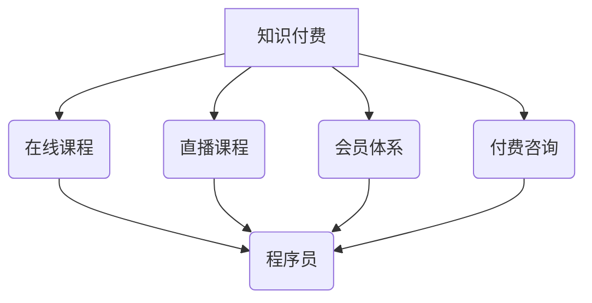

                 

## 知识付费时代程序员的创业机遇

> 关键词：知识付费、程序员、创业、技术博客、在线教育、技能培训、市场需求、技术趋势

### 1. 背景介绍

随着互联网技术的飞速发展和数字化转型的加速，知识经济时代已悄然到来。在这个时代，知识成为最宝贵的资源，而拥有专业技能的程序员群体则成为了知识经济的主角。知识付费作为一种新型的商业模式，在知识经济时代迅速崛起，为程序员提供了新的创业机遇。

**1.1 知识付费的兴起**

知识付费是指以知识、技能、经验等为核心内容，通过线上平台向用户提供付费学习服务的商业模式。其核心价值在于为用户提供高质量、有针对性的知识和技能培训，帮助用户提升自身价值，实现个人成长和职业发展。

**1.2 程序员的优势**

程序员群体拥有丰富的技术知识和实践经验，他们对技术领域有着深刻的理解和洞察力。同时，程序员也具备良好的逻辑思维能力、解决问题的能力和沟通能力，这些都是知识付费领域成功的关键要素。

**1.3 知识付费市场潜力**

知识付费市场规模持续增长，预计未来几年将保持高速发展态势。随着人们对知识和技能的重视程度不断提高，以及线上学习平台的不断完善，知识付费市场将迎来更大的发展机遇。

### 2. 核心概念与联系

**2.1 知识付费模式**

知识付费模式主要包括以下几种类型：

* **在线课程:** 提供视频、音频、文档等多种形式的学习内容，用户可以通过付费订阅或购买课程进行学习。
* **直播课程:** 实时互动教学，用户可以与老师和同学进行交流，并获得即时的答疑服务。
* **会员体系:** 用户通过付费成为会员，可以获得一系列的学习资源和服务，例如课程折扣、专属社区、导师指导等。
* **付费咨询:** 用户可以付费咨询专业人士，获得针对性的技术指导和解决方案。

**2.2 程序员的创业路径**

程序员可以通过以下几种方式进行知识付费创业：

* **独立创作者:** 开发自己的课程、博客、公众号等，通过线上平台进行知识传播和销售。
* **平台合作:** 与在线教育平台合作，开发和销售课程，分享平台的流量和资源。
* **技术社区:** 参与技术社区的运营和管理，提供技术支持和培训服务，积累用户和口碑。

**2.3 核心概念关系图**



### 3. 核心算法原理 & 具体操作步骤

**3.1 算法原理概述**

知识付费平台的运营需要涉及到许多算法，例如推荐算法、用户画像算法、内容分发算法等。这些算法的目的是为了提高用户体验，提升平台的活跃度和用户粘性。

**3.2 算法步骤详解**

* **推荐算法:** 

    * 收集用户行为数据，例如用户浏览记录、学习历史、评价反馈等。
    * 利用机器学习算法，分析用户兴趣和偏好，推荐相关的课程和内容。
    * 基于用户反馈，不断优化推荐算法的准确性和个性化程度。

* **用户画像算法:**

    * 收集用户基本信息、学习行为、兴趣爱好等数据。
    * 利用数据挖掘和统计分析技术，构建用户画像，了解用户的学习特点、需求和痛点。
    * 根据用户画像，提供个性化的学习建议和服务。

* **内容分发算法:**

    * 根据课程质量、用户评价、平台规则等因素，对课程进行排序和分发。
    * 利用算法模型，预测课程的受欢迎程度，优先推荐优质内容。
    * 通过A/B测试等方式，不断优化内容分发策略，提高用户参与度。

**3.3 算法优缺点**

* **优点:**

    * 能够精准推荐用户感兴趣的内容，提高用户学习效率。
    * 能够帮助平台了解用户需求，提供更个性化的服务。
    * 能够提高平台的活跃度和用户粘性。

* **缺点:**

    * 需要大量的数据支持，算法模型的训练和优化需要专业技术。
    * 算法可能会存在偏差，导致推荐结果不准确。
    * 算法可能会过度依赖用户行为数据，忽略用户的真实需求。

**3.4 算法应用领域**

* **在线教育平台:** 推荐课程、用户画像、内容分发等。
* **电商平台:** 商品推荐、用户画像、个性化营销等。
* **社交媒体平台:** 内容推荐、用户匹配、广告投放等。

### 4. 数学模型和公式 & 详细讲解 & 举例说明

**4.1 数学模型构建**

知识付费平台的推荐算法通常基于协同过滤或内容过滤等数学模型。

* **协同过滤:** 基于用户的历史行为数据，预测用户对特定课程的兴趣。

* **内容过滤:** 基于课程的特征和用户兴趣，推荐匹配的用户。

**4.2 公式推导过程**

协同过滤算法中常用的公式包括：

* **余弦相似度:** 用于计算用户之间或课程之间的相似度。

$$
\text{相似度} = \frac{\mathbf{u} \cdot \mathbf{v}}{\|\mathbf{u}\| \|\mathbf{v}\| }
$$

其中，$\mathbf{u}$ 和 $\mathbf{v}$ 分别表示两个用户的评分向量或课程的特征向量。

* **预测评分:** 基于用户和课程的相似度，预测用户对课程的评分。

$$
\hat{r}_{u,i} = \bar{r}_u + \frac{\sum_{j \in N(u)} \frac{r_{u,j} \cdot s_{u,j}}{\sum_{k \in N(u)} s_{u,k}} (r_{j,i} - \bar{r}_j)}{\sum_{j \in N(u)} \frac{s_{u,j}}{\sum_{k \in N(u)} s_{u,k}}}
$$

其中，$\hat{r}_{u,i}$ 表示用户 $u$ 对课程 $i$ 的预测评分，$r_{u,j}$ 表示用户 $u$ 对课程 $j$ 的实际评分，$s_{u,j}$ 表示用户 $u$ 和课程 $j$ 的相似度，$\bar{r}_u$ 和 $\bar{r}_j$ 分别表示用户 $u$ 和课程 $j$ 的平均评分。

**4.3 案例分析与讲解**

假设有一个在线教育平台，用户 $A$ 和用户 $B$ 都学习过课程 $X$ 和课程 $Y$，用户 $A$ 对课程 $X$ 的评分为 5 分，对课程 $Y$ 的评分为 4 分，用户 $B$ 对课程 $X$ 的评分为 4 分，对课程 $Y$ 的评分为 5 分。

利用余弦相似度公式，可以计算用户 $A$ 和用户 $B$ 的相似度。

$$
\text{相似度} = \frac{(5, 4) \cdot (4, 5)}{\sqrt{5^2 + 4^2} \sqrt{4^2 + 5^2}} = \frac{20 + 20}{\sqrt{41} \sqrt{41}} = \frac{40}{41}
$$

可见，用户 $A$ 和用户 $B$ 的相似度较高。

利用预测评分公式，可以预测用户 $A$ 对课程 $Z$ 的评分。

$$
\hat{r}_{A,Z} = \bar{r}_A + \frac{\sum_{j \in N(A)} \frac{r_{A,j} \cdot s_{A,j}}{\sum_{k \in N(A)} s_{A,k}} (r_{j,Z} - \bar{r}_j)}{\sum_{j \in N(A)} \frac{s_{A,j}}{\sum_{k \in N(A)} s_{A,k}}}
$$

其中，$r_{A,j}$ 表示用户 $A$ 对课程 $j$ 的实际评分，$s_{A,j}$ 表示用户 $A$ 和课程 $j$ 的相似度，$\bar{r}_A$ 表示用户 $A$ 的平均评分，$r_{j,Z}$ 表示用户 $j$ 对课程 $Z$ 的实际评分。

### 5. 项目实践：代码实例和详细解释说明

**5.1 开发环境搭建**

* Python 3.x
* Flask 或 Django 等 Web 框架
* 数据库 (例如 MySQL, PostgreSQL)
* Redis 或 Memcached 等缓存服务

**5.2 源代码详细实现**

以下是一个简单的 Python 代码示例，演示了如何使用 Flask 框架构建一个简单的知识付费平台：

```python
from flask import Flask, render_template, request

app = Flask(__name__)

# 模拟课程数据
courses = [
    {'id': 1, 'title': 'Python 入门', 'price': 99},
    {'id': 2, 'title': '机器学习基础', 'price': 199},
]

@app.route('/')
def index():
    return render_template('index.html', courses=courses)

@app.route('/course/<int:course_id>')
def course_detail(course_id):
    course = next((c for c in courses if c['id'] == course_id), None)
    return render_template('course_detail.html', course=course)

if __name__ == '__main__':
    app.run(debug=True)
```

**5.3 代码解读与分析**

* 该代码使用 Flask 框架构建了一个简单的 Web 应用。
* `index()` 函数渲染首页，显示所有课程列表。
* `course_detail()` 函数渲染课程详情页面，根据课程 ID 显示对应的课程信息。

**5.4 运行结果展示**

运行该代码后，访问 `http://127.0.0.1:5000/`，即可看到一个简单的知识付费平台首页。

### 6. 实际应用场景

**6.1 在线教育平台**

知识付费平台可以为在线教育平台提供丰富的课程内容，满足用户多样化的学习需求。

**6.2 技术社区**

技术社区可以利用知识付费平台，提供技术培训和咨询服务，提升社区的价值和活跃度。

**6.3 个人品牌建设**

程序员可以利用知识付费平台，打造自己的个人品牌，分享技术经验和知识，获得收入。

**6.4 未来应用展望**

* **个性化学习:** 基于用户画像和学习行为数据，提供更加个性化的学习路径和内容推荐。
* **沉浸式学习:** 利用 VR/AR 等技术，打造更加沉浸式的学习体验。
* **元宇宙学习:** 在元宇宙环境中，构建虚拟课堂和学习社区，提供更加互动和丰富的学习体验。

### 7. 工具和资源推荐

**7.1 学习资源推荐**

* **在线课程平台:** Coursera, Udemy, edX, Udacity
* **技术博客:** Hacker News, Stack Overflow, Medium
* **开源社区:** GitHub, GitLab

**7.2 开发工具推荐**

* **Web 框架:** Flask, Django, Spring Boot
* **数据库:** MySQL, PostgreSQL, MongoDB
* **缓存服务:** Redis, Memcached

**7.3 相关论文推荐**

* **协同过滤算法:** "Collaborative Filtering: A User-Based Approach" by Goldberg et al. (1992)
* **内容过滤算法:** "Content-Based Recommendation Systems" by Ricci et al. (2011)
* **推荐系统综述:** "Recommender Systems: A Survey" by Adomavicius and Tuzhilin (2005)

### 8. 总结：未来发展趋势与挑战

**8.1 研究成果总结**

知识付费平台的发展已经取得了显著成果，为程序员提供了新的创业机遇。

**8.2 未来发展趋势**

* **个性化学习:** 更加注重用户个性化需求，提供定制化的学习路径和内容推荐。
* **沉浸式学习:** 利用 VR/AR 等技术，打造更加沉浸式的学习体验。
* **元宇宙学习:** 在元宇宙环境中，构建虚拟课堂和学习社区，提供更加互动和丰富的学习体验。

**8.3 面临的挑战**

* **内容质量:** 确保平台上的课程内容质量高，能够满足用户的学习需求。
* **用户体验:** 提供良好的用户体验，提升用户粘性和活跃度。
* **商业模式:** 探索更加可持续的商业模式，实现平台的盈利和发展。

**8.4 研究展望**

未来，知识付费平台将继续朝着更加个性化、沉浸式、元宇宙化的方向发展。

### 9. 附录：常见问题与解答

* **如何选择合适的知识付费平台？**

    * 考虑平台的课程质量、用户评价、商业模式等因素。
    * 选择与自身专业领域相关的平台。

* **如何打造自己的知识付费品牌？**

    * 积累丰富的技术经验和知识。
    * 创作高质量的课程内容。
    * 积极参与技术社区，建立个人品牌。

* **如何推广自己的知识付费课程？**

    * 利用社交媒体平台进行推广。
    * 与其他平台合作，进行资源共享。
    * 参加行业活动，进行线下推广。


作者：禅与计算机程序设计艺术 / Zen and the Art of Computer Programming 
<end_of_turn>

