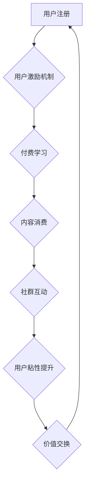

                 

## 知识付费赚钱的用户激励与社群建设

> 关键词：知识付费、用户激励、社群建设、用户粘性、内容运营、社区生态、付费用户、会员体系、价值交换

## 1. 背景介绍

知识付费作为一种新型的商业模式，近年来发展迅速，成为互联网经济的重要组成部分。它以知识、技能、经验等为核心产品，通过线上平台向用户提供付费学习服务。随着互联网普及和人们对自我提升的追求不断增强，知识付费市场呈现出巨大的发展潜力。

然而，知识付费市场竞争激烈，用户获取信息和学习资源的门槛不断降低，如何有效吸引用户付费，提升用户粘性，构建可持续发展的社区生态成为知识付费平台面临的重大挑战。

## 2. 核心概念与联系

**2.1 用户激励机制**

用户激励机制是指通过各种方式鼓励用户参与平台活动、付费学习，并提升用户体验和忠诚度的策略。

**2.2 社群建设**

社群建设是指围绕知识付费内容，构建一个用户互动、交流学习的线上社区，促进用户之间的连接和协作，形成良好的社区氛围和生态。

**2.3 价值交换**

价值交换是知识付费的核心原则，是指用户通过付费获得优质的知识和服务，而平台则通过用户付费获得收益，双方实现互利共赢。

**2.4  用户粘性**

用户粘性是指用户对平台的依赖程度和持续使用意愿。高用户粘性意味着用户更愿意付费、参与社区活动，并成为平台的忠实粉丝。

**2.5  内容运营**

内容运营是指围绕用户需求，持续创作和更新优质的知识付费内容，并通过多种方式推广和传播，吸引用户关注和付费。

**Mermaid 流程图**



## 3. 核心算法原理 & 具体操作步骤

**3.1 算法原理概述**

知识付费平台的用户激励与社群建设并非简单的算法问题，而是需要综合考虑用户行为、内容价值、平台运营等多方面因素的复杂系统工程。

**3.2 算法步骤详解**

1. **用户画像分析:** 通过用户行为数据，构建用户画像，了解用户的兴趣爱好、学习习惯、付费意愿等特征。
2. **个性化推荐:** 基于用户画像，推荐个性化的知识付费内容，提高用户匹配度和学习兴趣。
3. **激励机制设计:** 设计多层次、多维度的用户激励机制，例如积分奖励、等级晋升、专属福利等，鼓励用户付费学习和参与社区活动。
4. **社群运营策略:** 构建活跃的社群氛围，组织线上线下活动，促进用户互动交流，形成良好的社区生态。
5. **内容运营策略:** 持续创作和更新优质的知识付费内容，满足用户需求，并通过多种方式推广和传播，吸引更多用户关注。

**3.3 算法优缺点**

* **优点:** 可以提高用户参与度、付费率和用户粘性，构建可持续发展的社区生态。
* **缺点:** 需要大量的数据和计算资源，算法设计需要不断优化和迭代，才能有效应对用户行为的变化和市场竞争。

**3.4 算法应用领域**

* 在线教育平台
* 知识付费社区
* 内容创作平台
* 社交媒体平台

## 4. 数学模型和公式 & 详细讲解 & 举例说明

**4.1 数学模型构建**

用户粘性可以采用以下数学模型进行衡量：

$$
\text{用户粘性} = \frac{\text{平均用户活跃天数}}{\text{平台总运营天数}}
$$

其中，平均用户活跃天数是指用户在平台上进行任何类型的活动（例如学习、评论、分享等）的天数，平台总运营天数是指平台上线以来的总天数。

**4.2 公式推导过程**

用户粘性公式的推导过程基于以下假设：

* 用户活跃度越高，用户粘性越高。
* 平台运营时间越长，用户粘性越稳定。

**4.3 案例分析与讲解**

假设一个知识付费平台，平均用户活跃天数为 15 天，平台总运营天数为 365 天，则该平台的用户粘性为：

$$
\text{用户粘性} = \frac{15}{365} = 0.041
$$

这意味着用户平均每天在平台上进行活动的时间占平台运营时间的 4.1%。

## 5. 项目实践：代码实例和详细解释说明

**5.1 开发环境搭建**

* 操作系统：Windows/macOS/Linux
* 编程语言：Python
* 开发工具：VS Code/PyCharm
* 数据库：MySQL/PostgreSQL

**5.2 源代码详细实现**

```python
# 用户激励机制示例代码

class User:
    def __init__(self, user_id, name):
        self.user_id = user_id
        self.name = name
        self.points = 0

    def earn_points(self, points):
        self.points += points

    def redeem_points(self, points):
        if self.points >= points:
            self.points -= points
            print(f"{self.name} redeemed {points} points.")
        else:
            print(f"{self.name} does not have enough points.")

# 社群互动示例代码

class Community:
    def __init__(self):
        self.users = []

    def add_user(self, user):
        self.users.append(user)

    def create_discussion(self, topic):
        print(f"New discussion created: {topic}")

    def join_discussion(self, user, topic):
        print(f"{user.name} joined the discussion on {topic}")

# 内容运营示例代码

class Content:
    def __init__(self, title, author):
        self.title = title
        self.author = author

    def publish(self):
        print(f"{self.title} by {self.author} has been published.")

# 示例代码执行

user1 = User(1, "Alice")
user2 = User(2, "Bob")

community = Community()
community.add_user(user1)
community.add_user(user2)

community.create_discussion("Python Programming")
community.join_discussion(user1, "Python Programming")

content1 = Content("Machine Learning", "John Doe")
content1.publish()
```

**5.3 代码解读与分析**

以上代码示例展示了知识付费平台的用户激励、社群互动和内容运营的基本逻辑。

* 用户激励机制：通过积分奖励机制，鼓励用户参与平台活动，例如学习、评论、分享等。
* 社群互动：通过创建讨论组和加入讨论组的功能，促进用户之间的交流学习。
* 内容运营：通过发布优质的知识付费内容，吸引用户关注和付费。

**5.4 运行结果展示**

运行以上代码，将输出以下结果：

```
New discussion created: Python Programming
Alice joined the discussion on Python Programming
Machine Learning by John Doe has been published.
```

## 6. 实际应用场景

**6.1 在线教育平台**

在线教育平台可以利用用户激励机制，例如积分奖励、等级晋升、专属福利等，鼓励用户付费学习课程，并通过社群建设，构建学习交流社区，提升用户粘性。

**6.2 知识付费社区**

知识付费社区可以围绕特定主题或领域，聚集专业人士和爱好者，通过付费会员制度，提供优质的知识资源和服务，并通过社群运营，打造活跃的知识分享平台。

**6.3 内容创作平台**

内容创作平台可以利用用户激励机制，例如点赞、评论、打赏等，鼓励用户创作优质内容，并通过社群建设，构建内容创作者和用户之间的互动关系，提升平台活跃度。

**6.4 社交媒体平台**

社交媒体平台可以利用用户激励机制，例如关注、点赞、分享等，鼓励用户参与平台活动，并通过社群建设，打造兴趣小组和社群，提升用户粘性。

**6.5 未来应用展望**

随着人工智能、大数据等技术的不断发展，知识付费平台的用户激励与社群建设将更加智能化、个性化和互动化。例如，基于用户行为数据，平台可以提供更精准的个性化推荐和激励方案，并利用人工智能技术，构建更加智能化的社群管理系统，提升用户体验和平台运营效率。

## 7. 工具和资源推荐

**7.1 学习资源推荐**

* **书籍:**
    * 《用户激励设计》
    * 《社群运营实战》
    * 《内容运营指南》
* **在线课程:**
    * Coursera: 用户激励与行为设计
    * Udemy: 社群运营与管理
    * Skillshare: 内容运营策略

**7.2 开发工具推荐**

* **数据库:** MySQL, PostgreSQL
* **编程语言:** Python, JavaScript
* **开发框架:** Django, Flask, React

**7.3 相关论文推荐**

* **用户激励机制:**
    * "A Framework for Designing Effective User Incentive Mechanisms"
    * "The Psychology of User Incentives"
* **社群建设:**
    * "Building Online Communities: A Guide to Creating and Managing Successful Communities"
    * "The Social Network Effect: How Communities Drive Growth"

## 8. 总结：未来发展趋势与挑战

**8.1 研究成果总结**

知识付费平台的用户激励与社群建设是一个不断发展和完善的领域。通过用户画像分析、个性化推荐、多层次激励机制、活跃社群运营等策略，可以有效提升用户参与度、付费率和用户粘性，构建可持续发展的社区生态。

**8.2 未来发展趋势**

* **智能化:** 利用人工智能技术，实现更精准的个性化推荐和激励方案，以及更智能化的社群管理系统。
* **个性化:** 针对不同用户群体，提供个性化的内容和服务，满足用户多样化的需求。
* **互动化:** 鼓励用户参与平台活动，构建更加活跃和丰富的社群互动体验。

**8.3 面临的挑战**

* **用户获取成本:** 知识付费市场竞争激烈，用户获取成本不断提高。
* **用户留存率:** 用户粘性难以提升，用户流失率较高。
* **内容质量:** 优质内容的创作和更新需要持续投入，保证内容质量和用户体验。

**8.4 研究展望**

未来研究方向包括：

* **更有效的用户激励机制设计:** 探索新的激励方式，例如 gamification、社交货币等，提高用户参与度和付费意愿。
* **更智能的社群运营策略:** 利用人工智能技术，实现更精准的社群管理和用户运营，提升社群活跃度和用户粘性。
* **更个性化的内容推荐:** 基于用户行为数据和兴趣偏好，提供更精准的个性化内容推荐，满足用户多样化的需求。


## 9. 附录：常见问题与解答

**9.1 如何提高用户付费率？**

* 提供优质、有价值的内容
* 设计合理的付费模式
* 利用用户激励机制，鼓励用户付费
* 构建活跃的社群氛围，提升用户粘性

**9.2 如何构建活跃的社群？**

* 定期组织线上线下活动
* 鼓励用户互动交流
* 提供优质的社群服务
* 管理社群氛围，营造积极向上的氛围

**9.3 如何保证内容质量？**

* 严格审核内容质量
* 鼓励用户反馈和参与
* 建立内容创作规范
* 持续更新和迭代内容

作者：禅与计算机程序设计艺术 / Zen and the Art of Computer Programming 


<end_of_turn>

