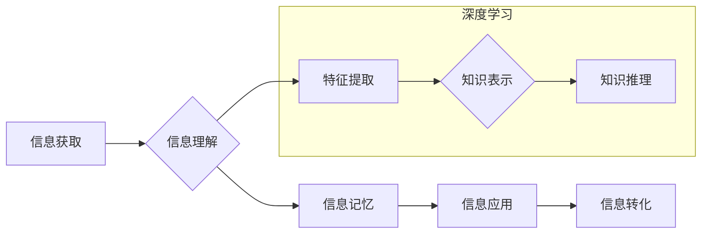

                 

## 知识吸收率:比阅读量更重要的指标

> 关键词：知识吸收率、深度学习、信息获取、学习效率、认知科学、知识图谱、神经网络、机器学习

## 1. 背景介绍

在信息爆炸的时代，我们每天接触的海量信息让人眼花缭乱。阅读已成为获取知识的重要途径，但仅仅阅读大量信息并不能保证我们真正理解和掌握知识。 

传统上，人们往往将学习量与阅读量等同起来，认为阅读越多，学习效果越好。然而，现实情况并非如此。大量研究表明，**知识吸收率**才是决定学习成效的关键指标。

知识吸收率是指个体从信息中获取和理解知识的能力，它反映了我们对信息的深度理解和应用能力。 

## 2. 核心概念与联系

### 2.1 知识吸收率的定义

知识吸收率是一个多维度的概念，它不仅包括信息的获取量，还涉及信息的理解、记忆、应用和转化等多个环节。

* **信息获取:** 能够从各种信息源中获取所需的信息。
* **信息理解:** 能够理解信息的含义、逻辑关系和内在联系。
* **信息记忆:** 能够将理解的信息存储在记忆中，并能够在需要时回忆起来。
* **信息应用:** 能够将所学知识应用到实际问题中，解决问题并创造新的价值。
* **信息转化:** 能够将所学知识转化为自己的知识体系，并进行创新和发展。

### 2.2 知识吸收率与深度学习的关系

深度学习作为一种机器学习方法，其核心是构建复杂的网络结构，通过大量的训练数据来学习和提取知识。深度学习模型的学习过程可以看作是一种模拟人类知识吸收的过程。

* **特征提取:** 深度学习模型通过多层神经网络结构，从原始数据中提取出重要的特征信息。
* **知识表示:** 深度学习模型将提取的特征信息转化为抽象的知识表示，例如概念、关系和规则。
* **知识推理:** 深度学习模型能够基于已有的知识表示进行推理和推导，得出新的结论。

**Mermaid 流程图**



## 3. 核心算法原理 & 具体操作步骤

### 3.1 算法原理概述

知识吸收率的评估是一个复杂的问题，需要考虑多种因素，例如个体认知能力、学习方式、信息类型和学习环境等。目前，还没有一种完美的算法可以准确地衡量知识吸收率。

然而，一些研究者提出了多种方法来评估知识吸收率，例如：

* **测试评估:** 通过测试来评估个体对知识的理解和应用能力。
* **行为观察:** 通过观察个体学习行为来评估其知识吸收程度。
* **认知模型:** 建立认知模型来模拟个体的知识吸收过程，并通过模型参数来评估知识吸收率。

### 3.2 算法步骤详解

以测试评估为例，评估知识吸收率的步骤如下：

1. **设计测试题:** 根据目标知识点设计测试题，涵盖知识的各个方面，例如概念理解、应用能力和批判性思维等。
2. **进行测试:** 让个体完成测试，并记录其答题情况。
3. **评分标准:** 制定评分标准，根据个体的答题情况进行评分。
4. **计算知识吸收率:** 将个体的得分与满分进行比较，计算出其知识吸收率。

### 3.3 算法优缺点

* **优点:** 测试评估方法相对简单易行，能够量化评估知识吸收率。
* **缺点:** 测试评估方法容易受到个体应试能力的影响，不能完全反映个体的真实知识水平。

### 3.4 算法应用领域

知识吸收率的评估方法广泛应用于教育、培训、科研等领域，例如：

* **教育领域:** 评估学生的学习效果，改进教学方法。
* **培训领域:** 评估培训课程的有效性，优化培训内容。
* **科研领域:** 评估研究成果的价值，指导科研方向。

## 4. 数学模型和公式 & 详细讲解 & 举例说明

### 4.1 数学模型构建

我们可以用一个简单的数学模型来表示知识吸收率：

$$
Knowledge Absorption Rate = \frac{Understood Knowledge}{Total Knowledge}
$$

其中：

* **Understood Knowledge:** 指的是个体理解和掌握的知识量。
* **Total Knowledge:** 指的是个体接触到的总知识量。

### 4.2 公式推导过程

这个公式的推导过程很简单，它直接反映了知识吸收率的定义：

知识吸收率 = 理解的知识量 / 总的知识量

### 4.3 案例分析与讲解

假设一个学生学习了100个知识点，他能够理解和掌握其中的70个知识点，那么他的知识吸收率为：

$$
Knowledge Absorption Rate = \frac{70}{100} = 0.7 = 70\%
$$

## 5. 项目实践：代码实例和详细解释说明

### 5.1 开发环境搭建

为了演示知识吸收率的评估方法，我们可以使用Python语言开发一个简单的测试系统。

所需的开发环境包括：

* Python 3.x
* Jupyter Notebook

### 5.2 源代码详细实现

```python
# 知识点列表
knowledge_points = ["概念1", "概念2", "概念3", ..., "概念N"]

# 测试题库
test_questions = {
    "概念1": ["问题1", "问题2"],
    "概念2": ["问题3", "问题4"],
    # ...
}

# 用户答题记录
user_answers = {}

# 测试函数
def conduct_test(user_answers):
    # 评估用户答题情况
    # 计算知识吸收率
    pass

# 主程序
if __name__ == "__main__":
    # 用户答题
    for knowledge_point in knowledge_points:
        for question in test_questions[knowledge_point]:
            user_answer = input(f"请输入对{question}的答案: ")
            user_answers[knowledge_point] = user_answer

    # 进行测试评估
    conduct_test(user_answers)
```

### 5.3 代码解读与分析

这段代码定义了一个简单的测试系统，包括知识点列表、测试题库、用户答题记录和测试函数。

* 知识点列表包含所有需要测试的知识点。
* 测试题库包含每个知识点的测试题。
* 用户答题记录用于存储用户的答题情况。
* 测试函数用于评估用户的答题情况并计算知识吸收率。

### 5.4 运行结果展示

运行该代码后，系统会提示用户输入对每个测试问题的答案。

用户输入完所有答案后，系统会进行测试评估，并输出用户的知识吸收率。

## 6. 实际应用场景

### 6.1 在线教育平台

在线教育平台可以利用知识吸收率的评估方法来个性化推荐学习内容，并根据用户的学习进度和效果进行调整。

### 6.2 人工智能训练

在人工智能训练过程中，知识吸收率可以用来评估模型的学习效果，并指导模型的训练参数调整。

### 6.3 知识图谱构建

知识图谱构建过程中，知识吸收率可以用来评估知识图谱的完整性和准确性。

### 6.4 未来应用展望

随着人工智能技术的不断发展，知识吸收率的评估方法将得到更广泛的应用，例如：

* **个性化学习:** 根据个体的知识吸收率，定制个性化的学习方案。
* **智能推荐:** 基于知识吸收率，推荐更适合个体学习的内容。
* **知识发现:** 利用知识吸收率，发现新的知识和模式。

## 7. 工具和资源推荐

### 7.1 学习资源推荐

* **书籍:**
    * 《深度学习》
    * 《机器学习》
    * 《认知科学导论》
* **在线课程:**
    * Coursera
    * edX
    * Udacity

### 7.2 开发工具推荐

* **Python:** 
* **Jupyter Notebook:** 
* **TensorFlow:** 
* **PyTorch:**

### 7.3 相关论文推荐

* **Attention Is All You Need**
* **BERT: Pre-training of Deep Bidirectional Transformers for Language Understanding**
* **Knowledge Graph Embedding: A Survey**

## 8. 总结：未来发展趋势与挑战

### 8.1 研究成果总结

近年来，在知识吸收率的研究领域取得了显著进展，例如：

* 深度学习模型在知识表示和推理方面取得了突破。
* 知识图谱技术在知识组织和检索方面发挥了重要作用。
* 认知科学研究为理解人类知识吸收过程提供了新的视角。

### 8.2 未来发展趋势

未来，知识吸收率的研究将朝着以下方向发展：

* **更精准的评估方法:** 开发更精准、更全面的知识吸收率评估方法。
* **个性化学习:** 基于知识吸收率，实现个性化学习方案。
* **跨模态知识吸收:** 研究跨模态（文本、图像、音频等）知识吸收机制。

### 8.3 面临的挑战

知识吸收率的研究还面临着一些挑战：

* **复杂性:** 知识吸收是一个复杂的过程，涉及多种因素。
* **数据获取:** 获取高质量的知识吸收数据是一个难题。
* **伦理问题:** 如何确保知识吸收技术的公平性和可解释性是一个需要认真考虑的伦理问题。

### 8.4 研究展望

尽管面临挑战，但知识吸收率的研究前景广阔。相信随着技术的不断发展，我们将能够更好地理解和掌握知识，并将其应用于各个领域，推动社会进步。

## 9. 附录：常见问题与解答

### 9.1 如何提高知识吸收率？

* **主动学习:** 积极参与学习过程，提出问题，思考和总结。
* **深度理解:** 不仅要记住知识点，还要理解其内在逻辑和联系。
* **多渠道学习:** 利用多种学习方式，例如阅读、听课、实践等。
* **知识复习:** 定期复习已学知识，巩固记忆。

### 9.2 知识吸收率与智商的关系是什么？

知识吸收率和智商有一定的相关性，但并非完全等同。智商反映的是个体的认知能力，而知识吸收率反映的是个体获取和理解知识的能力。

### 9.3 知识吸收率的评估方法有哪些局限性？

目前，还没有一种完美的知识吸收率评估方法，评估结果容易受到多种因素的影响，例如个体应试能力、测试题的质量、学习环境等。


作者：禅与计算机程序设计艺术 / Zen and the Art of Computer Programming 
<end_of_turn>

