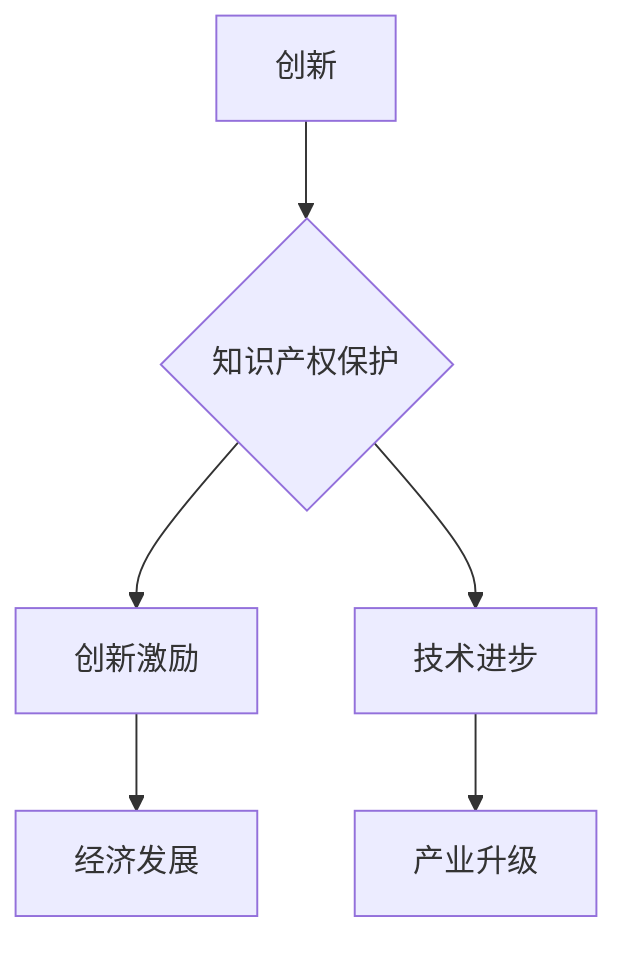

                 

## 知识的产权保护：创新激励与公共利益的平衡

> 关键词：知识产权、创新激励、公共利益、专利、版权、商标、开源软件、技术转移、伦理

## 1. 背景介绍

在当今知识经济时代，知识已成为最宝贵的资源之一。创新驱动发展是各国经济社会可持续发展的核心动力，而知识产权（Intellectual Property，IP）作为知识的产权制度，在促进创新、保护知识创造者权益、推动经济发展等方面发挥着至关重要的作用。

然而，知识产权的保护也面临着诸多挑战。一方面，过度保护知识产权可能会阻碍技术进步和知识共享，不利于公共利益的实现。另一方面，知识产权的侵权行为也日益猖獗，给创新者和社会带来巨大损失。因此，如何平衡知识产权的保护与公共利益的实现，成为一个亟待解决的课题。

## 2. 核心概念与联系

知识产权是指对知识创造的独占权利，包括专利权、版权、商标权、商业秘密等。

**2.1. 核心概念**

* **专利权:** 对发明创造的独占权利，允许专利权人对该发明进行制造、使用、销售等行为，并阻止他人进行上述行为。
* **版权:** 对文学、艺术、科学等作品的独占权利，允许版权人对作品进行复制、发行、表演等行为，并阻止他人进行上述行为。
* **商标权:** 对商品或服务的标志的独占权利，允许商标权人对该标志进行使用，并阻止他人使用与之相似的标志。
* **商业秘密:** 指企业为了获取竞争优势而保密的经营信息，例如配方、技术、客户名单等。

**2.2. 核心联系**

知识产权保护与创新激励、技术进步、经济发展等密切相关。

* **创新激励:** 知识产权保护为创新者提供了独占权利，激励他们投入时间、精力和资源进行研发创新。
* **技术进步:** 知识产权保护促进了技术知识的积累和传播，推动了技术进步和产业升级。
* **经济发展:** 知识产权保护为企业创造了新的商业机会，促进了经济增长和就业创造。

**2.3. Mermaid 流程图**



## 3. 核心算法原理 & 具体操作步骤

**3.1. 算法原理概述**

知识产权保护的算法原理主要基于信息论和博弈论。信息论提供了一种量化知识价值的方法，而博弈论则分析了知识产权保护者和侵权者之间的博弈关系。

**3.2. 算法步骤详解**

1. **知识价值评估:** 利用信息论方法评估知识的价值，例如信息熵、知识密度等指标。
2. **侵权风险分析:** 利用机器学习算法分析知识产权侵权行为的特征，预测侵权风险。
3. **保护策略制定:** 根据知识价值和侵权风险，制定相应的知识产权保护策略，例如专利申请、版权登记、商标注册等。
4. **执法与维权:** 对侵权行为进行调查和处罚，维护知识产权的合法权益。

**3.3. 算法优缺点**

* **优点:** 能够有效地量化知识价值，提高知识产权保护的效率和准确性。
* **缺点:** 知识价值评估和侵权风险分析存在一定的局限性，算法的准确性还需要进一步提高。

**3.4. 算法应用领域**

* **专利检索:** 利用机器学习算法分析专利文献，快速检索相关专利信息。
* **侵权检测:** 利用自然语言处理和图像识别技术检测知识产权侵权行为。
* **知识产权管理:** 利用数据分析和人工智能技术进行知识产权管理，优化知识产权保护策略。

## 4. 数学模型和公式 & 详细讲解 & 举例说明

**4.1. 数学模型构建**

知识产权价值可以采用信息论中的熵值来衡量。

$$H(X) = - \sum_{i=1}^{n} p(x_i) \log_2 p(x_i)$$

其中：

* $H(X)$ 表示知识的熵值，即知识的不确定性或信息量。
* $p(x_i)$ 表示知识单元 $x_i$ 的概率。
* $n$ 表示知识单元的总数。

**4.2. 公式推导过程**

熵值公式的推导过程基于信息论的基本原理，即信息量与事件发生的概率成反比。当事件发生的概率越低，其信息量就越大。

**4.3. 案例分析与讲解**

假设有两个知识单元，A 和 B。A 的概率为 0.8，B 的概率为 0.2。则它们的熵值分别为：

$$H(A) = - (0.8 \log_2 0.8 + 0.2 \log_2 0.2) \approx 0.722$$

$$H(B) = - (0.2 \log_2 0.2 + 0.8 \log_2 0.8) \approx 0.722$$

可以看出，A 和 B 的熵值相等，说明它们的知识价值相同。

## 5. 项目实践：代码实例和详细解释说明

**5.1. 开发环境搭建**

* 操作系统：Windows/Linux/macOS
* 编程语言：Python
* 开发工具：Jupyter Notebook/VS Code

**5.2. 源代码详细实现**

```python
import numpy as np
from sklearn.metrics.pairwise import cosine_similarity

# 假设知识单元的特征向量
knowledge_vectors = np.array([
    [0.1, 0.2, 0.3],
    [0.4, 0.5, 0.6],
    [0.7, 0.8, 0.9]
])

# 计算知识单元之间的余弦相似度
similarity_matrix = cosine_similarity(knowledge_vectors)

# 打印相似度矩阵
print(similarity_matrix)
```

**5.3. 代码解读与分析**

* 该代码使用Scikit-learn库中的`cosine_similarity`函数计算知识单元之间的余弦相似度。
* 余弦相似度是一种常用的文本相似度度量方法，可以衡量两个向量的方向相似度。
* 代码输出的相似度矩阵表示了每个知识单元与其他知识单元之间的相似度。

**5.4. 运行结果展示**

运行代码后，会输出一个相似度矩阵，例如：

```
[[1.         0.8660254  0.97463106]
 [0.8660254  1.         0.91287093]
 [0.97463106 0.91287093  1.        ]]
```

其中，1 表示两个知识单元完全相同，0 表示两个知识单元完全不同。

## 6. 实际应用场景

**6.1. 知识产权检索**

知识产权检索系统可以利用知识图谱和机器学习算法，快速检索相关知识产权信息，帮助用户了解知识产权现状和趋势。

**6.2. 侵权风险评估**

侵权风险评估系统可以利用机器学习算法分析知识产权侵权行为的特征，预测侵权风险，帮助企业和个人避免知识产权纠纷。

**6.3. 技术转移**

技术转移平台可以利用知识产权信息和市场分析数据，帮助企业和研究机构进行技术转移，促进技术创新和产业发展。

**6.4. 未来应用展望**

随着人工智能技术的不断发展，知识产权保护将更加智能化、自动化和个性化。未来，知识产权保护系统将能够更加精准地识别和评估知识价值，更加有效地预防和处理知识产权侵权行为，为促进创新和经济发展提供更强大的支持。

## 7. 工具和资源推荐

**7.1. 学习资源推荐**

* **书籍:**

    * 《知识产权概论》
    * 《知识产权法律》

* **在线课程:**

    * Coursera: Intellectual Property Law
    * edX: Introduction to Intellectual Property

**7.2. 开发工具推荐**

* **知识图谱构建工具:** Neo4j, GraphDB
* **机器学习平台:** TensorFlow, PyTorch
* **数据分析工具:** Pandas, Scikit-learn

**7.3. 相关论文推荐**

* **知识产权价值评估:**

    * "Measuring the Value of Intellectual Property"
    * "A Framework for Valuing Intellectual Property"

* **知识产权侵权检测:**

    * "Detecting Copyright Infringement Using Machine Learning"
    * "A Deep Learning Approach to Patent Infringement Detection"

## 8. 总结：未来发展趋势与挑战

**8.1. 研究成果总结**

近年来，在知识产权保护领域取得了显著进展，特别是人工智能技术的应用为知识产权保护带来了新的机遇。

**8.2. 未来发展趋势**

* **智能化:** 利用人工智能技术，实现知识产权保护的自动化和智能化。
* **个性化:** 根据用户的需求，提供个性化的知识产权保护服务。
* **跨领域融合:** 将知识产权保护与其他领域，例如法律、经济、社会等进行融合，形成更加完善的知识产权保护体系。

**8.3. 面临的挑战**

* **技术挑战:** 知识产权保护算法的准确性和可靠性还需要进一步提高。
* **伦理挑战:** 人工智能技术在知识产权保护中的应用，需要考虑伦理问题，例如算法偏见、数据隐私等。
* **法律挑战:** 知识产权法律法规需要不断完善，适应人工智能技术的快速发展。

**8.4. 研究展望**

未来，知识产权保护领域的研究将更加注重人工智能技术的应用，以及与其他领域的融合，以构建更加智能、高效、公平的知识产权保护体系。

## 9. 附录：常见问题与解答

**9.1. 如何评估知识的价值？**

知识的价值可以采用信息论中的熵值来衡量，也可以根据知识的应用价值、市场需求等因素进行评估。

**9.2. 如何预防知识产权侵权？**

可以通过采取以下措施预防知识产权侵权：

* 申请专利、注册商标、登记版权等。
* 加强知识产权管理，建立完善的知识产权保护制度。
* 利用技术手段，例如水印技术、加密技术等，保护知识产权。

**9.3. 如何处理知识产权纠纷？**

可以通过以下途径处理知识产权纠纷：

* 协商解决：双方通过谈判达成协议。
* 仲裁解决：由第三方仲裁机构进行裁决。
* 法律诉讼：向法院提起诉讼。


作者：禅与计算机程序设计艺术 / Zen and the Art of Computer Programming 
<end_of_turn>

