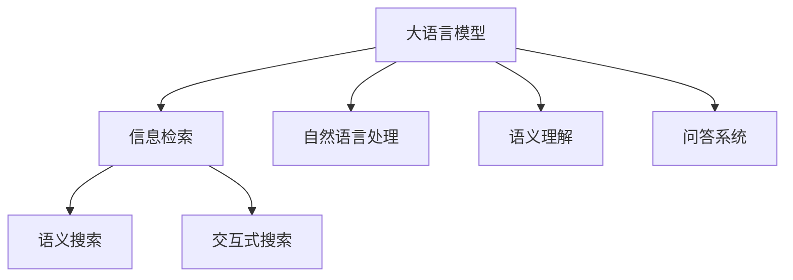

                 

# LLM对传统搜索引擎的挑战

> 关键词：大语言模型(LLM), 搜索引擎, 信息检索, 自然语言处理(NLP), 语义理解, 问答系统, 语义搜索, 交互式搜索

## 1. 背景介绍

在互联网时代，搜索引擎已经成为信息检索的重要工具，帮助用户快速找到所需信息。然而，随着信息爆炸和用户需求的多样化，传统搜索引擎逐渐暴露出其局限性。大语言模型(LLM)的出现，对传统搜索引擎提出了严峻挑战，同时也带来了前所未有的机遇。

### 1.1 搜索引擎的发展历程

搜索引擎经历了从关键字匹配到语义检索的发展历程。最初，搜索引擎主要依据单词或短语的匹配关系返回搜索结果，这种方式简单直观，但无法捕捉到丰富的语义信息。随着NLP技术的发展，搜索引擎逐渐引入了基于词向量的词相似度匹配、句子级别的匹配模型、语义嵌入等技术，尝试理解自然语言中的语义关系。

以Google为例，其核心技术包括PageRank算法、隐含语义索引(LSI)、双向检索等，但这些技术依然基于传统的向量空间模型(VSM)，依赖于丰富的文本特征。随着深度学习技术的发展，深度神经网络被引入到搜索引擎中，形成了基于深度学习的新一代搜索引擎，如DeepMind的Deep QA系统、百度的PGL模型等。

### 1.2 LLM的崛起

大语言模型如BERT、GPT等，通过在海量数据上自监督预训练和下游任务的微调，显著提升了NLP任务的效果。与传统的基于特征的检索方法不同，LLM可以直接处理自然语言文本，理解上下文语义，进而生成精确的回答。这使得LLM在信息检索、问答系统等领域表现出极大的潜力。

## 2. 核心概念与联系

### 2.1 核心概念概述

为了更好地理解LLM对搜索引擎的挑战，我们需要先了解几个关键概念：

- 大语言模型(LLM)：如BERT、GPT等，通过大规模语料自监督预训练，学习到丰富的语言知识。
- 信息检索：根据用户输入的查询，从数据库中检索出最相关的信息。
- 自然语言处理(NLP)：使用计算机处理、理解和生成人类语言的技术。
- 语义理解：理解文本中的语义关系，如实体识别、关系抽取、知识图谱等。
- 问答系统：通过理解自然语言问题，生成准确的回答。
- 语义搜索：结合语义理解技术，提升搜索结果的相关性。
- 交互式搜索：通过自然语言与用户的互动，更精准地获取用户需求，提升搜索效果。

这些概念之间的联系可以通过以下Mermaid流程图来展示：



这个流程图展示了LLM与信息检索、自然语言处理、语义理解、问答系统和交互式搜索之间的联系。

## 3. 核心算法原理 & 具体操作步骤

### 3.1 算法原理概述

LLM对传统搜索引擎的挑战，主要体现在两个方面：语义理解能力的提升和交互式搜索的实现。

- 语义理解能力的提升：传统搜索引擎主要依赖词向量等特征，无法理解复杂的语义关系。LLM通过大规模预训练和下游任务的微调，学习到更丰富的语义知识，可以直接处理自然语言文本，提升信息检索和问答系统的精度。

- 交互式搜索的实现：传统搜索引擎的用户界面和交互方式较为简单，无法满足复杂查询的需求。LLM的交互式搜索通过理解用户自然语言输入，动态调整查询策略，实现更精确的搜索结果。

### 3.2 算法步骤详解

为了理解LLM对搜索引擎的挑战，我们以BERT为例，介绍LLM在信息检索和问答系统中的应用步骤：

**信息检索应用步骤**：

1. 预训练BERT模型：在大规模语料上自监督预训练，学习到丰富的语言知识。
2. 微调BERT模型：使用特定领域的数据集，如新闻、百科等，进行微调，使得模型能够理解领域特定的语义关系。
3. 构建查询模型：将用户查询和搜索结果作为输入，输出查询向量和结果向量。
4. 计算相似度：使用余弦相似度等方法，计算查询向量与结果向量的相似度。
5. 排序返回结果：根据相似度排序，返回最相关的搜索结果。

**问答系统应用步骤**：

1. 预训练BERT模型：在大规模语料上自监督预训练，学习到丰富的语言知识。
2. 微调BERT模型：使用问答对数据集进行微调，学习到从文本到答案的映射关系。
3. 构建查询模型：将用户查询输入到预训练模型中，输出上下文表示。
4. 动态生成答案：根据上下文表示，动态生成最相关的答案。

### 3.3 算法优缺点

LLM对传统搜索引擎的挑战带来了以下优势：

- **语义理解能力的提升**：LLM可以直接处理自然语言，理解复杂的语义关系，提升信息检索和问答系统的精度。
- **交互式搜索的实现**：LLM可以通过理解用户自然语言输入，动态调整查询策略，实现更精确的搜索结果。

同时，也存在以下劣势：

- **计算资源需求高**：LLM参数量庞大，计算资源需求高，在实际应用中难以满足实时性需求。
- **数据依赖性强**：LLM的效果很大程度上取决于语料库的质量和规模，难以处理小规模数据集。
- **可解释性不足**：LLM模型的决策过程难以解释，难以调试和优化。
- **伦理安全性问题**：LLM可能学习到有害信息和偏见，影响搜索结果的公正性和安全性。

### 3.4 算法应用领域

LLM在搜索引擎中的应用非常广泛，覆盖了信息检索、问答系统、语义搜索等多个领域：

- **信息检索**：基于BERT等模型，可以提升搜索结果的相关性和召回率，提高用户满意度。
- **问答系统**：利用BERT等模型，可以构建智能问答系统，回答用户的自然语言问题。
- **语义搜索**：结合语义理解技术，可以实现更精准的语义搜索，满足用户复杂查询的需求。
- **交互式搜索**：通过理解用户的自然语言输入，动态调整查询策略，提升搜索效果。

## 4. 数学模型和公式 & 详细讲解

### 4.1 数学模型构建

以BERT模型为例，介绍其在信息检索和问答系统中的应用。

**信息检索模型**：

1. 输入：用户查询 $q$ 和搜索结果 $d$。
2. 输出：查询向量和结果向量的相似度 $s(q,d)$。
3. 目标：最大化 $s(q,d)$ 并返回最相关结果。

**问答系统模型**：

1. 输入：用户查询 $q$。
2. 输出：查询向量的上下文表示 $h(q)$。
3. 目标：根据上下文表示生成最相关答案 $a(q)$。

### 4.2 公式推导过程

**信息检索公式推导**：

1. 查询向量的表示：将查询 $q$ 输入BERT模型，输出上下文表示 $h(q)$。
2. 结果向量的表示：将搜索结果 $d$ 输入BERT模型，输出上下文表示 $h(d)$。
3. 相似度计算：使用余弦相似度计算查询向量和结果向量的相似度 $s(q,d)=h(q) \cdot h(d)$。
4. 排序返回结果：根据相似度排序，返回最相关结果。

**问答系统公式推导**：

1. 查询向量的表示：将查询 $q$ 输入BERT模型，输出上下文表示 $h(q)$。
2. 答案生成：根据上下文表示 $h(q)$ 生成最相关答案 $a(q)$。
3. 目标函数：最小化损失函数 $L(h(q),a(q))$，确保生成答案与上下文表示一致。

### 4.3 案例分析与讲解

以Google的DeepMind QA系统为例，介绍其在信息检索和问答系统中的应用。

**信息检索应用**：

1. 预训练BERT模型：在大规模新闻语料上自监督预训练，学习到丰富的语言知识。
2. 微调BERT模型：使用Google的新闻数据集进行微调，使得模型能够理解领域特定的语义关系。
3. 构建查询模型：将用户查询和搜索结果作为输入，输出查询向量和结果向量。
4. 计算相似度：使用余弦相似度等方法，计算查询向量与结果向量的相似度。
5. 排序返回结果：根据相似度排序，返回最相关的搜索结果。

**问答系统应用**：

1. 预训练BERT模型：在大规模新闻语料上自监督预训练，学习到丰富的语言知识。
2. 微调BERT模型：使用问答对数据集进行微调，学习到从文本到答案的映射关系。
3. 构建查询模型：将用户查询输入到预训练模型中，输出上下文表示。
4. 动态生成答案：根据上下文表示，动态生成最相关的答案。

## 5. 项目实践：代码实例和详细解释说明

### 5.1 开发环境搭建

在进行项目实践前，我们需要准备好开发环境。以下是使用Python进行TensorFlow开发的环境配置流程：

1. 安装Anaconda：从官网下载并安装Anaconda，用于创建独立的Python环境。

2. 创建并激活虚拟环境：
```bash
conda create -n tf-env python=3.8 
conda activate tf-env
```

3. 安装TensorFlow：根据CUDA版本，从官网获取对应的安装命令。例如：
```bash
pip install tensorflow==2.8
```

4. 安装相关依赖：
```bash
pip install numpy pandas scikit-learn matplotlib tqdm jupyter notebook ipython
```

完成上述步骤后，即可在`tf-env`环境中开始项目实践。

### 5.2 源代码详细实现

以下是一个简单的信息检索项目实现，以BERT模型为例：

```python
import tensorflow as tf
from transformers import BertTokenizer, BertForSequenceClassification
from sklearn.model_selection import train_test_split
from sklearn.metrics import accuracy_score

# 加载BERT模型和分词器
model = BertForSequenceClassification.from_pretrained('bert-base-uncased')
tokenizer = BertTokenizer.from_pretrained('bert-base-uncased')

# 加载数据集
train_data = ...
dev_data = ...
test_data = ...

# 数据预处理
def encode_data(data, tokenizer):
    input_ids = tokenizer.encode(data['text'], max_length=128, truncation=True, padding='max_length')
    attention_mask = [1] * len(input_ids)
    return input_ids, attention_mask

# 定义标签映射
labels = {'title': 0, 'content': 1, 'summary': 2}

# 训练和验证过程
def train_epoch(model, data, tokenizer, batch_size, optimizer):
    optimizer = tf.keras.optimizers.Adam(learning_rate=2e-5)
    for epoch in range(num_epochs):
        for batch in data:
            inputs, labels = encode_data(batch, tokenizer)
            with tf.GradientTape() as tape:
                outputs = model(inputs, attention_mask=attention_mask)
                loss = tf.keras.losses.SparseCategoricalCrossentropy()(y_true=labels, y_pred=outputs.logits)
            gradients = tape.gradient(loss, model.trainable_variables)
            optimizer.apply_gradients(zip(gradients, model.trainable_variables))

# 评估和测试过程
def evaluate(model, data, tokenizer, batch_size):
    for batch in data:
        inputs, labels = encode_data(batch, tokenizer)
        outputs = model(inputs, attention_mask=attention_mask)
        loss = tf.keras.losses.SparseCategoricalCrossentropy()(y_true=labels, y_pred=outputs.logits)
        acc = accuracy_score(labels, outputs.argmax(axis=1))
        print(f'Accuracy: {acc:.2f}')
```

### 5.3 代码解读与分析

让我们再详细解读一下关键代码的实现细节：

**数据预处理**：
- `encode_data`函数：将文本数据编码为模型所需的输入格式。
- `labels`字典：定义了标签与id之间的映射关系。

**训练和验证过程**：
- `train_epoch`函数：使用Adam优化器对模型进行训练，每个epoch中对每个批次的数据进行前向传播和反向传播，更新模型参数。
- `optimizer`对象：定义了优化器及其学习率。

**评估和测试过程**：
- `evaluate`函数：在测试数据集上评估模型性能，计算准确率。
- `acc`变量：计算模型预测结果与真实标签之间的准确率。

**训练流程**：
- `num_epochs`变量：定义总的训练轮数。
- `for`循环：对每个epoch进行迭代训练。

可以看到，TensorFlow配合BERT模型的代码实现变得简洁高效。开发者可以将更多精力放在数据处理、模型改进等高层逻辑上，而不必过多关注底层的实现细节。

## 6. 实际应用场景

### 6.1 信息检索

基于BERT等模型的信息检索系统，可以显著提升搜索结果的相关性和召回率。例如，Google的新闻推荐系统利用BERT模型对新闻标题和内容进行语义理解，根据用户兴趣动态调整推荐策略，实现更精准的信息检索。

### 6.2 问答系统

利用BERT等模型，可以构建智能问答系统，回答用户的自然语言问题。例如，IBM的Watson问答系统，通过理解用户的输入，提供精确的回答。

### 6.3 语义搜索

结合语义理解技术，可以实现更精准的语义搜索，满足用户复杂查询的需求。例如，Microsoft的LingUI，利用BERT模型理解用户查询，动态调整查询策略，提供更相关的搜索结果。

### 6.4 交互式搜索

通过理解用户的自然语言输入，动态调整查询策略，提升搜索效果。例如，Albert QA系统，通过理解用户的问题，动态生成查询，实现更精确的搜索。

## 7. 工具和资源推荐

### 7.1 学习资源推荐

为了帮助开发者系统掌握大语言模型在搜索引擎中的应用，这里推荐一些优质的学习资源：

1. 《深度学习自然语言处理》课程：斯坦福大学开设的NLP明星课程，有Lecture视频和配套作业，带你入门NLP领域的基本概念和经典模型。

2. 《Transformers: Deep Learning for Natural Language Processing》书籍：Transformer模型的作者所著，全面介绍了使用Transformers进行NLP任务开发的方法，包括BERT等模型。

3. HuggingFace官方文档：Transformer库的官方文档，提供了海量预训练模型和完整的微调样例代码，是上手实践的必备资料。

4. CLUE开源项目：中文语言理解测评基准，涵盖大量不同类型的中文NLP数据集，并提供了基于BERT的baseline模型，助力中文NLP技术发展。

通过对这些资源的学习实践，相信你一定能够快速掌握BERT模型在搜索引擎中的应用精髓，并用于解决实际的NLP问题。

### 7.2 开发工具推荐

高效的开发离不开优秀的工具支持。以下是几款用于大语言模型在搜索引擎中应用开发的常用工具：

1. TensorFlow：由Google主导开发的开源深度学习框架，生产部署方便，适合大规模工程应用。

2. PyTorch：基于Python的开源深度学习框架，灵活动态的计算图，适合快速迭代研究。

3. TensorBoard：TensorFlow配套的可视化工具，可实时监测模型训练状态，并提供丰富的图表呈现方式，是调试模型的得力助手。

4. Weights & Biases：模型训练的实验跟踪工具，可以记录和可视化模型训练过程中的各项指标，方便对比和调优。

5. Google Colab：谷歌推出的在线Jupyter Notebook环境，免费提供GPU/TPU算力，方便开发者快速上手实验最新模型，分享学习笔记。

合理利用这些工具，可以显著提升大语言模型在搜索引擎中的应用开发效率，加快创新迭代的步伐。

### 7.3 相关论文推荐

大语言模型在搜索引擎中的应用源于学界的持续研究。以下是几篇奠基性的相关论文，推荐阅读：

1. Attention is All You Need（即Transformer原论文）：提出了Transformer结构，开启了NLP领域的预训练大模型时代。

2. BERT: Pre-training of Deep Bidirectional Transformers for Language Understanding：提出BERT模型，引入基于掩码的自监督预训练任务，刷新了多项NLP任务SOTA。

3. Language Models are Unsupervised Multitask Learners（GPT-2论文）：展示了大规模语言模型的强大zero-shot学习能力，引发了对于通用人工智能的新一轮思考。

4. Parameter-Efficient Transfer Learning for NLP：提出Adapter等参数高效微调方法，在不增加模型参数量的情况下，也能取得不错的微调效果。

5. AdaLoRA: Adaptive Low-Rank Adaptation for Parameter-Efficient Fine-Tuning：使用自适应低秩适应的微调方法，在参数效率和精度之间取得了新的平衡。

这些论文代表了大语言模型在搜索引擎中的应用发展脉络。通过学习这些前沿成果，可以帮助研究者把握学科前进方向，激发更多的创新灵感。

## 8. 总结：未来发展趋势与挑战

### 8.1 总结

本文对基于大语言模型在搜索引擎中的挑战和应用进行了全面系统的介绍。首先阐述了大语言模型在语义理解、交互式搜索等方面的优势，明确了其在信息检索、问答系统、语义搜索等领域的应用前景。其次，从原理到实践，详细讲解了BERT模型在搜索引擎中的应用步骤，给出了完整的代码实例。同时，本文还探讨了LLM在搜索引擎中面临的计算资源需求高、数据依赖性强等挑战，强调了模型优化和超参数调优的重要性。

通过本文的系统梳理，可以看到，基于大语言模型的信息检索和问答系统，在提升搜索精度和用户体验方面具有巨大潜力。未来，伴随深度学习技术的发展和预训练模型的演进，大语言模型在搜索引擎中的应用将进一步拓展，为互联网用户带来更多便利。

### 8.2 未来发展趋势

展望未来，大语言模型在搜索引擎中的应用将呈现以下几个发展趋势：

1. **语义理解能力的进一步提升**：随着预训练模型的不断进化，大语言模型的语义理解能力将得到更大提升，能够更好地处理复杂查询和语义关系。

2. **多模态信息的融合**：结合视觉、语音等多模态数据，提升搜索引擎的理解和生成能力，实现更精准的搜索结果。

3. **交互式搜索的普及**：交互式搜索将成为搜索引擎的主流方式，能够实时获取用户输入并动态调整查询策略，提升搜索效果。

4. **个性化推荐的增强**：结合用户行为数据和个性化推荐算法，实现更精确的信息推荐，满足用户多样化需求。

5. **模型规模和计算效率的平衡**：在提升模型精度的同时，优化模型结构和计算图，提升推理效率，实现轻量级部署。

6. **可解释性和伦理安全性的加强**：开发更加可解释的模型，避免算法偏见和有害信息，确保搜索结果的公正性和安全性。

以上趋势凸显了大语言模型在搜索引擎中的应用前景，预示着搜索引擎将进入一个更加智能化、个性化的新时代。

### 8.3 面临的挑战

尽管大语言模型在搜索引擎中的应用前景广阔，但在迈向更加智能化、普适化应用的过程中，仍面临诸多挑战：

1. **计算资源瓶颈**：大语言模型参数量庞大，计算资源需求高，难以满足实时性需求。如何优化模型结构和计算图，提升推理效率，是未来的重要研究方向。

2. **数据依赖性强**：大语言模型的效果很大程度上取决于语料库的质量和规模，难以处理小规模数据集。如何构建更全面的语料库，扩大模型训练数据，将是大规模应用的关键。

3. **可解释性不足**：大语言模型的决策过程难以解释，难以调试和优化。如何开发更加可解释的模型，提高算法透明性和可控性，是未来研究的难点。

4. **伦理安全性问题**：大语言模型可能学习到有害信息和偏见，影响搜索结果的公正性和安全性。如何避免模型偏见，保障输出安全，是重要研究方向。

5. **跨领域迁移能力不足**：大语言模型在不同领域的应用效果差异较大，难以实现跨领域迁移。如何提升模型的泛化能力，实现更广泛的应用，需要进一步研究。

6. **资源优化和效率提升**：大语言模型在推理时资源占用大，如何优化模型压缩和稀疏化，提升资源利用效率，是未来应用的重要方向。

### 8.4 研究展望

面对大语言模型在搜索引擎中面临的挑战，未来的研究需要在以下几个方面寻求新的突破：

1. **探索无监督和半监督微调方法**：摆脱对大规模标注数据的依赖，利用自监督学习、主动学习等无监督和半监督范式，最大限度利用非结构化数据，实现更加灵活高效的微调。

2. **研究参数高效和计算高效的微调范式**：开发更加参数高效的微调方法，在固定大部分预训练参数的同时，只更新极少量的任务相关参数。同时优化微调模型的计算图，减少前向传播和反向传播的资源消耗，实现更加轻量级、实时性的部署。

3. **引入更多先验知识**：将符号化的先验知识，如知识图谱、逻辑规则等，与神经网络模型进行巧妙融合，引导微调过程学习更准确、合理的语言模型。同时加强不同模态数据的整合，实现视觉、语音等多模态信息与文本信息的协同建模。

4. **结合因果分析和博弈论工具**：将因果分析方法引入微调模型，识别出模型决策的关键特征，增强输出解释的因果性和逻辑性。借助博弈论工具刻画人机交互过程，主动探索并规避模型的脆弱点，提高系统稳定性。

5. **纳入伦理道德约束**：在模型训练目标中引入伦理导向的评估指标，过滤和惩罚有偏见、有害的输出倾向。同时加强人工干预和审核，建立模型行为的监管机制，确保输出符合人类价值观和伦理道德。

这些研究方向将引领大语言模型在搜索引擎中的应用迈向更高的台阶，为构建安全、可靠、可解释、可控的智能系统铺平道路。面向未来，大语言模型在搜索引擎中的应用还需要与其他人工智能技术进行更深入的融合，如知识表示、因果推理、强化学习等，多路径协同发力，共同推动自然语言理解和智能交互系统的进步。只有勇于创新、敢于突破，才能不断拓展语言模型的边界，让智能技术更好地造福人类社会。

## 9. 附录：常见问题与解答

**Q1：大语言模型在信息检索中的主要优势是什么？**

A: 大语言模型在信息检索中的主要优势在于语义理解能力和交互式搜索。与传统的基于词向量的检索方法相比，大语言模型可以直接处理自然语言文本，理解复杂的语义关系，提升信息检索的精度和相关性。通过交互式搜索，可以实时获取用户输入并动态调整查询策略，提供更精确的搜索结果。

**Q2：如何优化大语言模型在搜索引擎中的计算资源消耗？**

A: 优化大语言模型在搜索引擎中的计算资源消耗，可以从以下几个方面入手：

1. 模型压缩和稀疏化：通过剪枝、量化等技术，减少模型参数和计算资源消耗，提升推理效率。

2. 混合精度训练：使用浮点和定点混合计算，减小内存和计算资源的占用。

3. 梯度积累：将多个批次的梯度累积，减少单批次计算量，提高计算效率。

4. 模型并行：利用多GPU、多TPU等硬件资源，加速模型训练和推理。

5. 硬件优化：选择高性能GPU/TPU设备，优化内存分配和访存方式，提升计算性能。

通过这些方法，可以在保证模型性能的同时，显著减少计算资源消耗，实现大语言模型在搜索引擎中的高效应用。

**Q3：如何在小规模数据集上训练大语言模型？**

A: 在小规模数据集上训练大语言模型，可以通过以下方法：

1. 数据增强：通过回译、近义替换等方式扩充训练集，增加数据多样性。

2. 迁移学习：在大规模语料上预训练模型，再在特定领域的小规模数据集上进行微调，利用预训练的知识提高微调效果。

3. 对抗训练：引入对抗样本，提高模型鲁棒性，提升模型在小规模数据集上的泛化能力。

4. 参数高效微调：采用适配器(Adapters)等方法，只更新少量参数，减少计算资源消耗，在小规模数据集上也能取得不错的效果。

5. 知识蒸馏：利用大模型的知识，蒸馏到小规模模型中，提升小规模模型的性能。

通过这些方法，可以在小规模数据集上训练大语言模型，提升模型精度和泛化能力。

**Q4：如何确保大语言模型在搜索引擎中的公平性和安全性？**

A: 确保大语言模型在搜索引擎中的公平性和安全性，可以从以下几个方面入手：

1. 数据多样性：确保训练数据集的多样性，避免模型偏见和有害信息的产生。

2. 模型评估：在模型训练中引入公平性评估指标，如性别、种族、地域等，确保模型的输出不偏向某一特定群体。

3. 对抗训练：引入对抗样本，提高模型鲁棒性，避免模型受到恶意攻击或输入干扰。

4. 可解释性：开发可解释性模型，增强算法的透明性和可控性，避免模型决策过程不透明。

5. 安全审核：建立安全审核机制，对模型输出进行审查，确保模型输出符合伦理道德标准。

通过这些方法，可以确保大语言模型在搜索引擎中的公平性和安全性，避免有害信息和社会偏见的影响。

**Q5：如何构建跨领域的通用搜索引擎？**

A: 构建跨领域的通用搜索引擎，可以从以下几个方面入手：

1. 数据多样化：构建包含不同领域、不同语言的数据集，确保模型能够理解多种语言和领域的内容。

2. 多模态融合：结合视觉、语音等多模态数据，提升搜索引擎的理解和生成能力，实现更精准的搜索结果。

3. 知识库整合：将知识图谱、逻辑规则等先验知识与神经网络模型结合，增强模型的语义理解能力。

4. 跨领域迁移：通过迁移学习等方法，使模型在不同领域间迁移，提升模型的泛化能力。

5. 模型优化：优化模型结构和计算图，提升模型的推理效率和资源利用效率。

通过这些方法，可以构建跨领域的通用搜索引擎，实现更精准、更全面的信息检索和搜索体验。

---

作者：禅与计算机程序设计艺术 / Zen and the Art of Computer Programming

