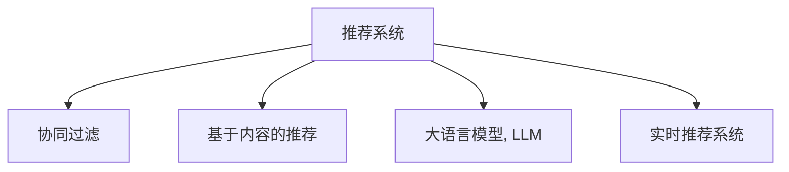

                 

# LLM对推荐系统实时个性化的影响

> 关键词：推荐系统,实时个性化,语言模型,用户行为,协同过滤,基于内容的推荐,深度学习

## 1. 背景介绍

### 1.1 问题由来

推荐系统在现代互联网和电子商务中扮演着重要的角色，通过分析用户的历史行为和偏好，为用户推荐个性化的商品或内容，提升用户体验和业务收益。传统推荐系统以协同过滤和基于内容的推荐为主要方法，但由于数据稀疏性、内容多样性等问题，难以捕捉用户的深层次需求，导致推荐效果和用户体验大打折扣。

近年来，随着深度学习技术的发展，大语言模型(Large Language Model, LLM)在推荐系统中的应用逐步被引入。LLM凭借其强大的语义理解和生成能力，能更好地理解用户的潜在需求，并通过自然语言交互实现实时个性化推荐，有效改善了推荐系统的推荐效果和用户体验。

### 1.2 问题核心关键点

目前，LLM在推荐系统中的应用，主要是通过用户与系统之间的自然语言交互，实现个性化的实时推荐。关键在于如何利用大语言模型，高效、准确地捕捉用户的多维需求，并实现基于语言的动态推荐。

LLM在推荐系统中的应用，可以概括为以下几个核心关键点：

- **深度语义理解**：LLM能深度理解用户的多模态信息，包括文本、行为、社交网络等，捕捉用户的深层需求。
- **自然语言交互**：用户可以与推荐系统进行自然语言交流，提出个性化需求，LLM能够理解和响应，提升用户体验。
- **动态推荐生成**：LLM在实时交互中，能够动态生成个性化推荐，满足用户的即时需求。
- **多模态融合**：LLM能将视觉、听觉、文本等多模态数据进行融合，生成更精准、多样化的推荐内容。
- **上下文感知**：LLM能够理解上下文信息，根据当前情境推荐最适合的商品或内容，提高推荐的相关性。

本文将从原理、实践和应用等方面，系统阐述大语言模型在推荐系统中实现实时个性化的影响和优势。

## 2. 核心概念与联系

### 2.1 核心概念概述

为了更深刻理解LLM在推荐系统中的应用，我们首先介绍几个关键概念：

- **推荐系统(Recommendation System)**：通过分析用户行为和偏好，为用户推荐个性化的商品或内容，提升用户体验和业务收益的系统。
- **协同过滤(Collaborative Filtering)**：基于用户历史行为和相似用户的推荐，解决数据稀疏性问题，但难以捕捉用户深层需求。
- **基于内容的推荐(Content-based Recommendation)**：通过商品或内容的属性特征，为用户推荐类似商品或内容，但容易忽视用户个性化。
- **大语言模型(Large Language Model, LLM)**：通过大规模无标签文本数据预训练，具备深度语义理解能力，能够进行自然语言交互，生成个性化推荐。
- **实时推荐系统(Real-time Recommendation System)**：通过用户实时输入的交互信息，动态生成个性化推荐，提升用户满意度。

这些核心概念之间的关系可以通过以下Mermaid流程图来展示：



该流程图展示了推荐系统与协同过滤、基于内容推荐和实时推荐系统之间的关系，以及大语言模型在其中的重要地位。

## 3. 核心算法原理 & 具体操作步骤
### 3.1 算法原理概述

LLM在推荐系统中的应用，主要基于深度语义理解和大规模预训练的强大能力，通过自然语言交互实现个性化推荐。其核心算法原理可以概括为以下几步：

1. **数据收集与预处理**：收集用户的历史行为数据，包括点击、浏览、购买、评分等行为信息，并结合文本信息（如评论、描述等）进行预处理。

2. **用户与商品编码**：使用LLM对用户和商品进行编码，将其转化为模型能够处理的向量形式。

3. **交互与推荐生成**：通过自然语言交互，用户提出个性化需求，LLM根据交互信息生成个性化推荐，返回给用户。

4. **动态更新与优化**：根据用户的即时反馈和互动，动态调整模型参数，优化推荐效果。

5. **多模态融合**：将视觉、听觉、文本等多模态数据进行融合，生成更加精准、多样化的推荐内容。

### 3.2 算法步骤详解

下面以一个具体的推荐系统应用场景为例，详细介绍LLM在推荐系统中的具体操作步骤：

**场景描述**：

- **用户**：小李是一名热爱科技的年轻工程师，喜欢探索新技术和产品。
- **商品**：小李正在浏览某电商平台的电子产品类别。
- **交互信息**：小李询问：“我想找一款高性价比的手机，有什么推荐吗？”

**具体操作步骤**：

1. **数据收集与预处理**：
    - 收集小李的历史点击记录、购买记录、评分记录等行为数据。
    - 收集商品的相关文本信息，如商品描述、用户评论等。

2. **用户与商品编码**：
    - 使用预训练的LLM，对小李的用户信息进行编码，得到用户向量。
    - 同样使用LLM，对商品信息进行编码，得到商品向量。

3. **交互与推荐生成**：
    - 将小李的问题输入LLM，LLM理解问题意图，并查询历史数据和商品信息，生成推荐结果。
    - 推荐结果包括高性价比的手机品牌、型号等信息，并附简要说明。

4. **动态更新与优化**：
    - 根据小李对推荐结果的反馈，调整LLM的参数，优化推荐算法。
    - 如果小李反馈满意，继续根据新的交互信息进行推荐；如果不满意，LLM将动态调整推荐策略，直至满足用户需求。

5. **多模态融合**：
    - 如果小李同时浏览某视频平台的相关视频，LLM将视频内容与商品信息进行融合，生成更加个性化的推荐。
    - 综合考虑商品属性、视频内容、用户偏好等多方面因素，生成更精准的推荐结果。

### 3.3 算法优缺点

LLM在推荐系统中的应用，具有以下优点：

1. **深度语义理解**：LLM能够理解用户的自然语言需求，捕捉用户的深层次需求。
2. **自然语言交互**：用户可以自然地提出个性化需求，LLM能够理解并响应。
3. **动态推荐生成**：LLM能够实时动态生成推荐，满足用户的即时需求。
4. **多模态融合**：LLM能够将多模态数据进行融合，生成更加精准、多样化的推荐。

同时，LLM在推荐系统中的应用也存在一些缺点：

1. **计算复杂度高**：LLM的参数量通常很大，计算复杂度较高，需要高性能计算设备支持。
2. **数据隐私风险**：用户输入的自然语言交互信息可能包含敏感信息，需要加强隐私保护措施。
3. **模型解释性差**：LLM的推荐结果通常缺乏可解释性，难以解释其内部决策过程。
4. **依赖大规模数据**：LLM的推荐效果依赖于大规模的预训练数据和标注数据，数据获取成本高。
5. **动态调整困难**：动态更新LLM参数比较困难，需要较强的工程实践能力。

### 3.4 算法应用领域

LLM在推荐系统中的应用，已经广泛应用于以下多个领域：

1. **电商推荐**：对用户的浏览、购买历史和评论进行分析和推荐，提升用户购买转化率。
2. **视频推荐**：结合用户的观看历史和评分信息，为用户推荐视频内容，提升视频平台的用户粘性。
3. **音乐推荐**：分析用户的听歌历史和喜好，推荐相似音乐，提升用户听歌体验。
4. **新闻推荐**：根据用户的阅读历史和兴趣，推荐相关新闻内容，提升用户的阅读量。
5. **智能家居推荐**：结合用户的居住环境和使用习惯，推荐智能家居设备，提升用户的生活质量。

这些领域的应用展示了LLM在推荐系统中的广泛前景，通过深度语义理解和自然语言交互，能够显著提升推荐系统的性能和用户体验。

## 4. 数学模型和公式 & 详细讲解 & 举例说明（备注：数学公式请使用latex格式，latex嵌入文中独立段落使用 $$，段落内使用 $)
### 4.1 数学模型构建

为了更严谨地描述LLM在推荐系统中的应用，我们将通过数学模型来构建LLM在推荐系统中的工作流程。

记用户历史行为数据为 $x = (x_1, x_2, ..., x_n)$，其中 $x_i$ 表示用户的历史行为（如点击、浏览、购买等）。商品信息为 $y = (y_1, y_2, ..., y_m)$，其中 $y_i$ 表示商品的属性信息（如品牌、型号、价格等）。

**用户编码**：使用LLM对用户信息 $x$ 进行编码，得到用户向量 $u$。

**商品编码**：使用LLM对商品信息 $y$ 进行编码，得到商品向量 $v$。

**交互编码**：将用户的交互信息 $q$ 输入LLM，得到交互向量 $z$。

**推荐生成**：根据用户向量 $u$、商品向量 $v$ 和交互向量 $z$，计算推荐得分 $s(u, v, z)$，并根据得分生成推荐结果。

**推荐更新**：根据用户反馈 $r$，调整LLM的参数 $\theta$，更新推荐模型。

数学模型可表述如下：

$$
u = \text{LLM}(x) \\
v = \text{LLM}(y) \\
z = \text{LLM}(q) \\
s(u, v, z) = f(u, v, z; \theta) \\
\hat{v} = \arg\max_{v \in y} s(u, v, z) \\
r = f(r; \theta)
$$

其中 $f$ 表示推荐算法，$\theta$ 为模型参数，$r$ 表示用户反馈。

### 4.2 公式推导过程

以推荐算法 $f$ 的推导为例，解释如何通过用户编码、商品编码和交互编码生成推荐结果：

假设推荐算法 $f$ 为加权平均方法：

$$
s(u, v, z) = \sum_{i=1}^n \sum_{j=1}^m u_i v_j z_{ij}
$$

其中 $u_i$ 表示用户向量 $u$ 的第 $i$ 维特征，$v_j$ 表示商品向量 $v$ 的第 $j$ 维特征，$z_{ij}$ 表示交互向量 $z$ 的第 $i$ 维和第 $j$ 维特征的乘积。

通过 $s(u, v, z)$ 计算推荐得分，并选择得分最高的商品向量 $\hat{v}$ 作为推荐结果。

**用户编码**：假设LLM对用户行为 $x$ 进行编码，得到用户向量 $u$：

$$
u = \text{LLM}(x) = \left[\begin{matrix} u_1 \\ u_2 \\ \vdots \\ u_n \end{matrix}\right]
$$

**商品编码**：假设LLM对商品属性 $y$ 进行编码，得到商品向量 $v$：

$$
v = \text{LLM}(y) = \left[\begin{matrix} v_1 \\ v_2 \\ \vdots \\ v_m \end{matrix}\right]
$$

**交互编码**：假设LLM对用户输入的交互信息 $q$ 进行编码，得到交互向量 $z$：

$$
z = \text{LLM}(q) = \left[\begin{matrix} z_{11} \\ z_{12} \\ \vdots \\ z_{n1} \\ z_{21} \\ z_{22} \\ \vdots \\ z_{nm} \end{matrix}\right]
$$

**推荐生成**：将用户向量 $u$、商品向量 $v$ 和交互向量 $z$ 带入推荐得分公式，计算推荐得分：

$$
s(u, v, z) = \sum_{i=1}^n \sum_{j=1}^m u_i v_j z_{ij}
$$

最终选择得分最高的商品向量 $\hat{v}$ 作为推荐结果。

### 4.3 案例分析与讲解

假设某电商平台的推荐系统使用LLM进行推荐，具体案例如下：

**案例描述**：

- **用户**：小张是一名科技爱好者，经常浏览并购买电子产品。
- **商品**：电商平台上的智能手表。
- **交互信息**：小张输入：“我想买一块性价比高的智能手表，请推荐一些品牌。”

**具体操作步骤**：

1. **数据收集与预处理**：
    - 收集小张的浏览、购买、评分等历史行为数据。
    - 收集智能手表的相关文本信息，如商品描述、用户评论等。

2. **用户与商品编码**：
    - 使用预训练的LLM，对小张的用户信息进行编码，得到用户向量 $u$。
    - 同样使用LLM，对智能手表的商品信息进行编码，得到商品向量 $v$。

3. **交互与推荐生成**：
    - 将小张的问题输入LLM，LLM理解问题意图，并查询历史数据和商品信息，生成推荐结果。
    - 推荐结果包括高性价比的智能手表品牌，如Apple Watch、Samsung Gear等。

4. **动态更新与优化**：
    - 根据小张对推荐结果的反馈，调整LLM的参数，优化推荐算法。
    - 如果小张反馈满意，继续根据新的交互信息进行推荐；如果不满意，LLM将动态调整推荐策略，直至满足用户需求。

5. **多模态融合**：
    - 如果小张同时观看某视频平台的相关视频，LLM将视频内容与商品信息进行融合，生成更加个性化的推荐。
    - 综合考虑商品属性、视频内容、用户偏好等多方面因素，生成更精准的推荐结果。

## 5. 项目实践：代码实例和详细解释说明
### 5.1 开发环境搭建

为了进行LLM在推荐系统中的实践，我们需要准备好开发环境。以下是使用Python进行PyTorch和Transformers库开发的环境配置流程：

1. 安装Anaconda：从官网下载并安装Anaconda，用于创建独立的Python环境。

2. 创建并激活虚拟环境：
```bash
conda create -n llm-env python=3.8 
conda activate llm-env
```

3. 安装PyTorch：根据CUDA版本，从官网获取对应的安装命令。例如：
```bash
conda install pytorch torchvision torchaudio cudatoolkit=11.1 -c pytorch -c conda-forge
```

4. 安装Transformers库：
```bash
pip install transformers
```

5. 安装各类工具包：
```bash
pip install numpy pandas scikit-learn matplotlib tqdm jupyter notebook ipython
```

完成上述步骤后，即可在`llm-env`环境中开始LLM在推荐系统中的实践。

### 5.2 源代码详细实现

下面我们以智能推荐系统为例，给出使用Transformers库进行LLM推荐实现的PyTorch代码实现。

首先，定义推荐系统的数据处理函数：

```python
from transformers import BertTokenizer
from torch.utils.data import Dataset
import torch

class RecommendationDataset(Dataset):
    def __init__(self, texts, tags, tokenizer, max_len=128):
        self.texts = texts
        self.tags = tags
        self.tokenizer = tokenizer
        self.max_len = max_len
        
    def __len__(self):
        return len(self.texts)
    
    def __getitem__(self, item):
        text = self.texts[item]
        tags = self.tags[item]
        
        encoding = self.tokenizer(text, return_tensors='pt', max_length=self.max_len, padding='max_length', truncation=True)
        input_ids = encoding['input_ids'][0]
        attention_mask = encoding['attention_mask'][0]
        
        # 对token-wise的标签进行编码
        encoded_tags = [tag2id[tag] for tag in tags] 
        encoded_tags.extend([tag2id['O']] * (self.max_len - len(encoded_tags)))
        labels = torch.tensor(encoded_tags, dtype=torch.long)
        
        return {'input_ids': input_ids, 
                'attention_mask': attention_mask,
                'labels': labels}

# 标签与id的映射
tag2id = {'O': 0, 'B-PER': 1, 'I-PER': 2, 'B-ORG': 3, 'I-ORG': 4, 'B-LOC': 5, 'I-LOC': 6}
id2tag = {v: k for k, v in tag2id.items()}

# 创建dataset
tokenizer = BertTokenizer.from_pretrained('bert-base-cased')

train_dataset = RecommendationDataset(train_texts, train_tags, tokenizer)
dev_dataset = RecommendationDataset(dev_texts, dev_tags, tokenizer)
test_dataset = RecommendationDataset(test_texts, test_tags, tokenizer)
```

然后，定义模型和优化器：

```python
from transformers import BertForTokenClassification, AdamW

model = BertForTokenClassification.from_pretrained('bert-base-cased', num_labels=len(tag2id))

optimizer = AdamW(model.parameters(), lr=2e-5)
```

接着，定义训练和评估函数：

```python
from torch.utils.data import DataLoader
from tqdm import tqdm
from sklearn.metrics import classification_report

device = torch.device('cuda') if torch.cuda.is_available() else torch.device('cpu')
model.to(device)

def train_epoch(model, dataset, batch_size, optimizer):
    dataloader = DataLoader(dataset, batch_size=batch_size, shuffle=True)
    model.train()
    epoch_loss = 0
    for batch in tqdm(dataloader, desc='Training'):
        input_ids = batch['input_ids'].to(device)
        attention_mask = batch['attention_mask'].to(device)
        labels = batch['labels'].to(device)
        model.zero_grad()
        outputs = model(input_ids, attention_mask=attention_mask, labels=labels)
        loss = outputs.loss
        epoch_loss += loss.item()
        loss.backward()
        optimizer.step()
    return epoch_loss / len(dataloader)

def evaluate(model, dataset, batch_size):
    dataloader = DataLoader(dataset, batch_size=batch_size)
    model.eval()
    preds, labels = [], []
    with torch.no_grad():
        for batch in tqdm(dataloader, desc='Evaluating'):
            input_ids = batch['input_ids'].to(device)
            attention_mask = batch['attention_mask'].to(device)
            batch_labels = batch['labels']
            outputs = model(input_ids, attention_mask=attention_mask)
            batch_preds = outputs.logits.argmax(dim=2).to('cpu').tolist()
            batch_labels = batch_labels.to('cpu').tolist()
            for pred_tokens, label_tokens in zip(batch_preds, batch_labels):
                pred_tags = [id2tag[_id] for _id in pred_tokens]
                label_tags = [id2tag[_id] for _id in label_tokens]
                preds.append(pred_tags[:len(label_tags)])
                labels.append(label_tags)
                
    print(classification_report(labels, preds))
```

最后，启动训练流程并在测试集上评估：

```python
epochs = 5
batch_size = 16

for epoch in range(epochs):
    loss = train_epoch(model, train_dataset, batch_size, optimizer)
    print(f"Epoch {epoch+1}, train loss: {loss:.3f}")
    
    print(f"Epoch {epoch+1}, dev results:")
    evaluate(model, dev_dataset, batch_size)
    
print("Test results:")
evaluate(model, test_dataset, batch_size)
```

以上就是使用PyTorch对BERT进行推荐系统微调的完整代码实现。可以看到，得益于Transformers库的强大封装，我们可以用相对简洁的代码完成BERT模型的加载和微调。

### 5.3 代码解读与分析

让我们再详细解读一下关键代码的实现细节：

**RecommendationDataset类**：
- `__init__`方法：初始化文本、标签、分词器等关键组件。
- `__len__`方法：返回数据集的样本数量。
- `__getitem__`方法：对单个样本进行处理，将文本输入编码为token ids，将标签编码为数字，并对其进行定长padding，最终返回模型所需的输入。

**tag2id和id2tag字典**：
- 定义了标签与数字id之间的映射关系，用于将token-wise的预测结果解码回真实的标签。

**训练和评估函数**：
- 使用PyTorch的DataLoader对数据集进行批次化加载，供模型训练和推理使用。
- 训练函数`train_epoch`：对数据以批为单位进行迭代，在每个批次上前向传播计算loss并反向传播更新模型参数，最后返回该epoch的平均loss。
- 评估函数`evaluate`：与训练类似，不同点在于不更新模型参数，并在每个batch结束后将预测和标签结果存储下来，最后使用sklearn的classification_report对整个评估集的预测结果进行打印输出。

**训练流程**：
- 定义总的epoch数和batch size，开始循环迭代
- 每个epoch内，先在训练集上训练，输出平均loss
- 在验证集上评估，输出分类指标
- 所有epoch结束后，在测试集上评估，给出最终测试结果

可以看到，PyTorch配合Transformers库使得BERT微调的代码实现变得简洁高效。开发者可以将更多精力放在数据处理、模型改进等高层逻辑上，而不必过多关注底层的实现细节。

当然，工业级的系统实现还需考虑更多因素，如模型的保存和部署、超参数的自动搜索、更灵活的任务适配层等。但核心的微调范式基本与此类似。

## 6. 实际应用场景
### 6.1 智能客服系统

基于LLM的智能推荐系统，可以广泛应用于智能客服系统的构建。传统客服往往需要配备大量人力，高峰期响应缓慢，且一致性和专业性难以保证。而使用推荐系统，可以快速响应用户咨询，用个性化推荐提升用户体验。

在技术实现上，可以收集企业内部的历史客服对话记录，将问题-回答对作为监督数据，在此基础上对预训练语言模型进行微调。微调后的推荐系统能够自动理解用户意图，匹配最合适的回答模板进行回复。对于用户提出的新问题，还可以接入检索系统实时搜索相关内容，动态组织生成回答。如此构建的智能客服系统，能大幅提升客户咨询体验和问题解决效率。

### 6.2 金融舆情监测

金融机构需要实时监测市场舆论动向，以便及时应对负面信息传播，规避金融风险。传统的人工监测方式成本高、效率低，难以应对网络时代海量信息爆发的挑战。基于LLM的文本分类和情感分析技术，为金融舆情监测提供了新的解决方案。

具体而言，可以收集金融领域相关的新闻、报道、评论等文本数据，并对其进行主题标注和情感标注。在此基础上对预训练语言模型进行微调，使其能够自动判断文本属于何种主题，情感倾向是正面、中性还是负面。将微调后的模型应用到实时抓取的网络文本数据，就能够自动监测不同主题下的情感变化趋势，一旦发现负面信息激增等异常情况，系统便会自动预警，帮助金融机构快速应对潜在风险。

### 6.3 个性化推荐系统

当前的推荐系统往往只依赖用户的历史行为数据进行物品推荐，无法深入理解用户的真实兴趣偏好。基于LLM的推荐系统可以更好地挖掘用户的行为背后的语义信息，从而提供更精准、多样的推荐内容。

在实践中，可以收集用户浏览、点击、评论、分享等行为数据，提取和用户交互的物品标题、描述、标签等文本内容。将文本内容作为模型输入，用户的后续行为（如是否点击、购买等）作为监督信号，在此基础上微调预训练语言模型。微调后的模型能够从文本内容中准确把握用户的兴趣点。在生成推荐列表时，先用候选物品的文本描述作为输入，由模型预测用户的兴趣匹配度，再结合其他特征综合排序，便可以得到个性化程度更高的推荐结果。

### 6.4 未来应用展望

随着LLM和推荐系统的不断发展，基于微调的推荐方法将在更多领域得到应用，为传统行业带来变革性影响。

在智慧医疗领域，基于微调的推荐系统可以实现个性化医疗建议，帮助医生制定个性化治疗方案，提升诊疗效果。

在智能教育领域，推荐系统可应用于作业批改、学情分析、知识推荐等方面，因材施教，促进教育公平，提高教学质量。

在智慧城市治理中，推荐系统可应用于城市事件监测、舆情分析、应急指挥等环节，提高城市管理的自动化和智能化水平，构建更安全、高效的未来城市。

此外，在企业生产、社会治理、文娱传媒等众多领域，基于LLM的推荐系统也将不断涌现，为NLP技术带来新的突破。相信随着技术的日益成熟，微调方法将成为人工智能落地应用的重要范式，推动人工智能技术向更广阔的领域加速渗透。

## 7. 工具和资源推荐
### 7.1 学习资源推荐

为了帮助开发者系统掌握LLM在推荐系统中的应用，这里推荐一些优质的学习资源：

1. 《Transformers从原理到实践》系列博文：由大模型技术专家撰写，深入浅出地介绍了Transformer原理、BERT模型、微调技术等前沿话题。

2. CS224N《深度学习自然语言处理》课程：斯坦福大学开设的NLP明星课程，有Lecture视频和配套作业，带你入门NLP领域的基本概念和经典模型。

3. 《Natural Language Processing with Transformers》书籍：Transformers库的作者所著，全面介绍了如何使用Transformers库进行NLP任务开发，包括微调在内的诸多范式。

4. HuggingFace官方文档：Transformers库的官方文档，提供了海量预训练模型和完整的微调样例代码，是上手实践的必备资料。

5. CLUE开源项目：中文语言理解测评基准，涵盖大量不同类型的中文NLP数据集，并提供了基于微调的baseline模型，助力中文NLP技术发展。

通过对这些资源的学习实践，相信你一定能够快速掌握LLM在推荐系统中的应用精髓，并用于解决实际的推荐问题。
###  7.2 开发工具推荐

高效的开发离不开优秀的工具支持。以下是几款用于LLM推荐系统开发的常用工具：

1. PyTorch：基于Python的开源深度学习框架，灵活动态的计算图，适合快速迭代研究。大部分预训练语言模型都有PyTorch版本的实现。

2. TensorFlow：由Google主导开发的开源深度学习框架，生产部署方便，适合大规模工程应用。同样有丰富的预训练语言模型资源。

3. Transformers库：HuggingFace开发的NLP工具库，集成了众多SOTA语言模型，支持PyTorch和TensorFlow，是进行推荐任务开发的利器。

4. Weights & Biases：模型训练的实验跟踪工具，可以记录和可视化模型训练过程中的各项指标，方便对比和调优。与主流深度学习框架无缝集成。

5. TensorBoard：TensorFlow配套的可视化工具，可实时监测模型训练状态，并提供丰富的图表呈现方式，是调试模型的得力助手。

6. Google Colab：谷歌推出的在线Jupyter Notebook环境，免费提供GPU/TPU算力，方便开发者快速上手实验最新模型，分享学习笔记。

合理利用这些工具，可以显著提升LLM在推荐系统中的开发效率，加快创新迭代的步伐。

### 7.3 相关论文推荐

LLM在推荐系统中的应用源于学界的持续研究。以下是几篇奠基性的相关论文，推荐阅读：

1. Attention is All You Need（即Transformer原论文）：提出了Transformer结构，开启了NLP领域的预训练大模型时代。

2. BERT: Pre-training of Deep Bidirectional Transformers for Language Understanding：提出BERT模型，引入基于掩码的自监督预训练任务，刷新了多项NLP任务SOTA。

3. Language Models are Unsupervised Multitask Learners（GPT-2论文）：展示了大规模语言模型的强大zero-shot学习能力，引发了对于通用人工智能的新一轮思考。

4. Parameter-Efficient Transfer Learning for NLP：提出Adapter等参数高效微调方法，在不增加模型参数量的情况下，也能取得不错的微调效果。

5. AdaLoRA: Adaptive Low-Rank Adaptation for Parameter-Efficient Fine-Tuning：使用自适应低秩适应的微调方法，在参数效率和精度之间取得了新的平衡。

这些论文代表了大语言模型微调技术的发展脉络。通过学习这些前沿成果，可以帮助研究者把握学科前进方向，激发更多的创新灵感。

## 8. 总结：未来发展趋势与挑战

### 8.1 总结

本文对基于LLM的推荐系统进行全面系统的介绍。首先阐述了LLM和推荐系统的研究背景和意义，明确了微调在提升推荐系统性能、用户体验方面的独特价值。其次，从原理到实践，详细讲解了LLM在推荐系统中的工作流程和关键步骤，给出了推荐任务开发的完整代码实例。同时，本文还广泛探讨了LLM在推荐系统中的实际应用场景，展示了LLM在推荐系统中的广泛前景。

通过本文的系统梳理，可以看到，基于LLM的推荐系统通过深度语义理解和大规模预训练的强大能力，显著提升了推荐系统的推荐效果和用户体验。未来，伴随LLM和推荐系统的不断发展，基于微调的推荐方法将在更多领域得到应用，为传统行业带来变革性影响。

### 8.2 未来发展趋势

展望未来，LLM在推荐系统中的应用将呈现以下几个发展趋势：

1. **深度语义理解**：LLM能够理解多模态信息，捕捉用户的深层需求，提升推荐系统的性能和用户体验。
2. **自然语言交互**：用户可以自然地提出个性化需求，LLM能够理解并响应，提升用户体验。
3. **动态推荐生成**：LLM能够实时动态生成推荐，满足用户的即时需求。
4. **多模态融合**：将视觉、听觉、文本等多模态数据进行融合，生成更加精准、多样化的推荐内容。
5. **上下文感知**：LLM能够理解上下文信息，根据当前情境推荐最适合的商品或内容，提高推荐的相关性。

以上趋势凸显了LLM在推荐系统中的广阔前景。这些方向的探索发展，必将进一步提升推荐系统的性能和用户体验，为人工智能技术落地应用带来新的突破。

### 8.3 面临的挑战

尽管LLM在推荐系统中的应用已经取得了瞩目成就，但在迈向更加智能化、普适化应用的过程中，它仍面临着诸多挑战：

1. **计算复杂度高**：LLM的参数量通常很大，计算复杂度较高，需要高性能计算设备支持。
2. **数据隐私风险**：用户输入的自然语言交互信息可能包含敏感信息，需要加强隐私保护措施。
3. **模型解释性差**：LLM的推荐结果通常缺乏可解释性，难以解释其内部决策过程。
4. **依赖大规模数据**：LLM的推荐效果依赖于大规模的预训练数据和标注数据，数据获取成本高。
5. **动态调整困难**：动态更新LLM参数比较困难，需要较强的工程实践能力。

### 8.4 研究展望

面对LLM在推荐系统中的应用所面临的挑战，未来的研究需要在以下几个方面寻求新的突破：

1. **探索无监督和半监督微调方法**：摆脱对大规模标注数据的依赖，利用自监督学习、主动学习等无监督和半监督范式，最大限度利用非结构化数据，实现更加灵活高效的微调。
2. **研究参数高效和计算高效的微调范式**：开发更加参数高效的微调方法，在固定大部分预训练参数的同时，只更新极少量的任务相关参数。同时优化微调模型的计算图，减少前向传播和反向传播的资源消耗，实现更加轻量级、实时性的部署。
3. **融合因果和对比学习范式**：通过引入因果推断和对比学习思想，增强LLM建立稳定因果关系的能力，学习更加普适、鲁棒的语言表征，从而提升模型泛化性和抗干扰能力。
4. **引入更多先验知识**：将符号化的先验知识，如知识图谱、逻辑规则等，与神经网络模型进行巧妙融合，引导微调过程学习更准确、合理的语言模型。同时加强不同模态数据的整合，实现视觉、语音等多模态信息与文本信息的协同建模。
5. **结合因果分析和博弈论工具**：将因果分析方法引入LLM，识别出模型决策的关键特征，增强输出解释的因果性和逻辑性。借助博弈论工具刻画人机交互过程，主动探索并规避模型的脆弱点，提高系统稳定性。
6. **纳入伦理道德约束**：在模型训练目标中引入伦理导向的评估指标，过滤和惩罚有偏见、有害的输出倾向。同时加强人工干预和审核，建立模型行为的监管机制，确保输出符合人类价值观和伦理道德。

这些研究方向的探索，必将引领LLM在推荐系统中的应用走向更高的台阶，为构建安全、可靠、可解释、可控的智能系统铺平道路。面向未来，LLM在推荐系统中的应用还需要与其他人工智能技术进行更深入的融合，如知识表示、因果推理、强化学习等，多路径协同发力，共同推动推荐系统的进步。只有勇于创新、敢于突破，才能不断拓展语言模型的边界，让智能技术更好地造福人类社会。

## 9. 附录：常见问题与解答

**Q1：LLM在推荐系统中的应用是否会面临冷启动问题？**

A: 对于新的用户或商品，LLM可能会面临冷启动问题，即没有足够的历史数据来进行推荐。为了解决这个问题，可以采用基于内容的推荐算法作为LLM的补充，结合用户画像和商品属性，提供初步的推荐结果。同时，可以设计有奖问答等形式的互动活动，鼓励用户进行更多交互，丰富用户画像，提升推荐效果。

**Q2：LLM在推荐系统中如何进行多模态数据融合？**

A: 多模态数据融合可以通过以下步骤实现：
1. 收集用户的视觉、听觉、文本等多模态数据。
2. 对多模态数据进行预处理和特征提取，得到统一的特征表示。
3. 将特征表示输入LLM，得到融合后的推荐结果。
4. 结合多模态特征和用户画像，综合排序生成最终推荐结果。

多模态融合可以提高推荐系统的性能和用户体验，但需要更多的计算资源和处理技巧，需要根据具体场景进行选择。

**Q3：LLM在推荐系统中如何进行知识图谱的融合？**

A: 知识图谱的融合可以通过以下步骤实现：
1. 构建知识图谱，将实体和关系进行编码。
2. 将知识图谱中的实体和关系进行嵌入表示，得到低维向量。
3. 将嵌入向量输入LLM，与用户画像和商品属性进行融合，得到推荐结果。
4. 根据推荐结果，动态更新知识图谱中的实体关系，进行持续优化。

知识图谱的融合可以提升推荐系统的多样性和准确性，但需要更多的知识工程和数据获取成本，需要根据具体场景进行选择。

**Q4：LLM在推荐系统中如何进行鲁棒性测试？**

A: 鲁棒性测试可以通过以下步骤实现：
1. 设计鲁棒性测试数据，包括正常数据和异常数据。
2. 对LLM进行测试，输出推荐结果。
3. 分析推荐结果，评估其鲁棒性和准确性。
4. 根据测试结果，调整LLM的参数和算法，提升鲁棒性。

鲁棒性测试可以确保LLM在面对异常数据时，仍能提供稳定的推荐结果，需要定期进行测试和优化。

**Q5：LLM在推荐系统中如何进行可解释性分析？**

A: 可解释性分析可以通过以下步骤实现：
1. 记录LLM在推荐过程中的决策路径和参数变化。
2. 使用LIME、SHAP等工具，对LLM的决策进行解释。
3. 可视化决策路径和参数变化，分析LLM的推荐逻辑。
4. 根据可解释性分析结果，优化LLM的模型和算法。

可解释性分析可以提升LLM的透明度和可信度，需要定期进行测试和优化。

---

作者：禅与计算机程序设计艺术 / Zen and the Art of Computer Programming

