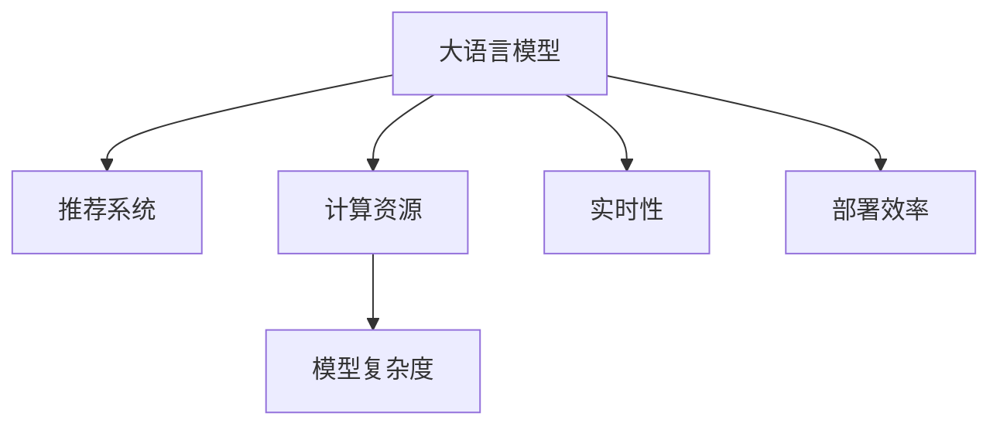

                 

# LLM对推荐系统实时性的影响

> 关键词：大语言模型,推荐系统,实时性,计算资源,模型复杂度,部署效率,用户行为预测

## 1. 背景介绍

### 1.1 问题由来

随着互联网技术的发展，推荐系统在各个在线平台的应用越来越广泛，如电商平台、视频网站、社交网络等。推荐系统通过分析用户的浏览、点击、购买等行为数据，为用户推荐个性化的商品、内容、广告等，极大地提高了用户体验和平台收益。然而，推荐系统的高实时性要求和用户行为预测的复杂性，使得其在推荐精度和效率上仍面临诸多挑战。

最近，大语言模型（Large Language Model, LLM）在自然语言处理领域取得了突破性进展。LLM通过在海量文本数据上进行预训练，获得了强大的语言理解和生成能力，能够在理解自然语言方面超越传统的机器学习模型。由于LLM具有泛化能力强、理解深度深等特点，许多推荐系统开始探索利用LLM进行用户行为预测，提升推荐效果。

### 1.2 问题核心关键点

尽管LLM在推荐系统中的应用展现出巨大潜力，但其高计算资源需求、模型复杂度和部署效率问题，在实时性要求较高的推荐场景中尤为突出。这些问题如果不能得到有效解决，将会严重影响推荐系统的效果和用户体验。

为了更好地理解LLM对推荐系统实时性的影响，本文将从以下几个方面展开讨论：

- LLM在推荐系统中的作用和优势
- LLM对推荐系统计算资源需求的影响
- LLM模型复杂度与推荐系统实时性之间的关系
- LLM部署效率与推荐系统实时性的关系
- LLM在推荐系统实时性优化中的具体应用

## 2. 核心概念与联系

### 2.1 核心概念概述

为更好地理解LLM对推荐系统实时性的影响，本节将介绍几个密切相关的核心概念：

- 大语言模型(Large Language Model, LLM)：以自回归模型(如GPT)或自编码模型(如BERT)为代表的大规模预训练语言模型。通过在海量文本数据上进行预训练，学习通用的语言表示，具备强大的语言理解和生成能力。

- 推荐系统(Recommender System)：利用用户的历史行为数据，通过机器学习模型预测用户可能感兴趣的商品、内容等，并为用户推荐。常见的推荐算法包括基于协同过滤、基于内容推荐、混合推荐等。

- 实时性(Real-time)：推荐系统需要快速响应用户的请求，在数秒或更短时间内生成推荐结果。实时性要求高，需优化计算资源和模型复杂度。

- 计算资源(Computational Resource)：推荐系统推荐过程涉及大量的数据处理和模型计算，需要足够的计算资源支持。

- 模型复杂度(Model Complexity)：推荐系统模型复杂度通常与模型的深度、参数量、计算图结构等有关。高复杂度模型计算量大，实时性较差。

- 部署效率(Deployment Efficiency)：推荐系统模型的部署效率直接影响其在实际应用中的实时性。部署效率高，实时性更好。

这些核心概念之间的逻辑关系可以通过以下Mermaid流程图来展示：



这个流程图展示了大语言模型与推荐系统之间的关键联系：

1. 大语言模型通过预训练获得语言理解能力，能够理解用户行为数据。
2. 推荐系统利用大语言模型的理解能力，进行用户行为预测。
3. 推荐系统的计算资源需求与模型复杂度有关，模型复杂度影响推荐系统的实时性。
4. 大语言模型部署效率决定推荐系统的部署速度，影响实时性。

这些概念共同构成了大语言模型在推荐系统中的应用框架，使其能够在推荐系统实时性提升和推荐效果优化中发挥重要作用。

## 3. 核心算法原理 & 具体操作步骤
### 3.1 算法原理概述

LLM在推荐系统中的主要作用是理解用户行为数据，并基于这些理解进行预测。具体而言，LLM通过在用户的历史行为数据上进行预训练，学习到通用的语言模式和用户行为规律。然后，在大规模无标签文本数据上进行预训练，获得强大的语言表示能力。最后，通过微调等技术，将预训练模型适配到特定的推荐任务上，预测用户可能感兴趣的商品、内容等。

形式化地，假设用户的历史行为数据为 $X=\{x_1, x_2, ..., x_N\}$，其中 $x_i$ 为历史行为序列。LLM通过预训练获得语言表示函数 $F_\theta$，然后对 $X$ 进行预训练，获得用户行为表示 $Z=\{z_1, z_2, ..., z_N\}$。最后，对 $Z$ 进行微调，获得推荐模型 $M_\phi$，预测用户未来行为 $Y=\{y_1, y_2, ..., y_M\}$。

其中，$z_i = F_\theta(x_i)$，$y_i = M_\phi(z_i)$。推荐模型 $M_\phi$ 通常为一个二分类模型，预测用户对某商品感兴趣的概率。

### 3.2 算法步骤详解

基于LLM的推荐系统通常包括以下几个关键步骤：

**Step 1: 收集用户行为数据**
- 收集用户的历史行为数据，如浏览记录、点击记录、购买记录等。
- 清洗和标注数据，去除无效或噪声数据。

**Step 2: 预训练LLM**
- 使用大规模无标签文本数据，如维基百科、新闻等，对LLM进行预训练。
- 通过掩码语言模型、下一句预测等自监督任务训练LLM。
- 获取预训练权重 $F_\theta$。

**Step 3: 用户行为预训练**
- 使用用户行为数据 $X$，对LLM进行预训练，获得用户行为表示 $Z$。
- 在预训练过程中，使用掩码语言模型、语义相似性等自监督任务。

**Step 4: 微调推荐模型**
- 使用推荐任务的数据集，对预训练后的LLM进行微调，获得推荐模型 $M_\phi$。
- 通常使用交叉熵损失函数，训练模型进行二分类预测。

**Step 5: 预测推荐结果**
- 对于新用户的当前行为数据 $x_t$，使用预训练和微调后的模型，预测其对某商品的兴趣 $y_t$。
- 根据 $y_t$ 的评分，推荐相应的商品或内容。

### 3.3 算法优缺点

基于LLM的推荐系统具有以下优点：

1. 理解能力强大：LLM具备强大的语言理解和生成能力，能够更好地理解用户行为数据。
2. 预测精度高：LLM在理解用户行为规律后，可以准确预测用户对商品的兴趣。
3. 鲁棒性强：LLM可以通过微调适应不同的推荐任务，具有较强的泛化能力。

同时，该方法也存在一定的局限性：

1. 计算资源需求高：预训练和微调LLM需要大量的计算资源，容易导致资源瓶颈。
2. 模型复杂度高：LLM通常具有亿级参数，导致模型复杂度高，实时性较差。
3. 部署效率低：LLM在实际部署中需要较高的部署效率，否则会影响实时性。
4. 数据需求量大：LLM需要大量的无标签文本数据进行预训练，对数据需求量较大。

尽管存在这些局限性，但就目前而言，基于LLM的推荐方法在推荐精度上仍具有明显优势，值得深入研究和应用。

### 3.4 算法应用领域

基于LLM的推荐系统在许多领域中得到了广泛的应用，例如：

- 电商推荐：根据用户浏览和购买历史，推荐商品。
- 视频推荐：根据用户观看记录，推荐视频内容。
- 音乐推荐：根据用户听歌历史，推荐歌曲。
- 新闻推荐：根据用户阅读记录，推荐新闻文章。

除了这些经典应用外，LLM在个性化推荐、内容生成、智能问答等更多场景中也有着创新性的应用，极大地提升了推荐系统的推荐效果和用户体验。

## 4. 数学模型和公式 & 详细讲解 & 举例说明
### 4.1 数学模型构建

本节将使用数学语言对基于LLM的推荐系统进行更加严格的刻画。

记用户的历史行为数据为 $X=\{x_1, x_2, ..., x_N\}$，其中 $x_i$ 为历史行为序列。LLM通过预训练获得语言表示函数 $F_\theta$，对 $X$ 进行预训练，获得用户行为表示 $Z=\{z_1, z_2, ..., z_N\}$。最后，对 $Z$ 进行微调，获得推荐模型 $M_\phi$，预测用户未来行为 $Y=\{y_1, y_2, ..., y_M\}$。

其中，$z_i = F_\theta(x_i)$，$y_i = M_\phi(z_i)$。推荐模型 $M_\phi$ 通常为一个二分类模型，预测用户对某商品感兴趣的概率。

### 4.2 公式推导过程

以下我们以电商推荐为例，推导LLM推荐模型的数学公式。

假设用户的历史行为数据为 $X=\{x_1, x_2, ..., x_N\}$，其中 $x_i$ 为浏览记录。预训练后，得到用户行为表示 $Z=\{z_1, z_2, ..., z_N\}$。微调后，得到推荐模型 $M_\phi$。对于新用户当前行为 $x_t$，使用微调后的LLM预测其对某商品 $j$ 的兴趣 $y_t^j$。

具体而言，假设LLM的预训练权重为 $F_\theta$，微调后的推荐模型权重为 $\phi$，则用户行为表示 $z_i$ 为：

$$
z_i = F_\theta(x_i)
$$

推荐模型 $M_\phi$ 的输出 $y_t^j$ 为：

$$
y_t^j = M_\phi(z_t)
$$

其中 $M_\phi$ 为一个二分类模型，通常使用神经网络进行训练。预测用户对商品 $j$ 感兴趣的概率 $p_t^j$ 为：

$$
p_t^j = \sigma(M_\phi(z_t))
$$

其中 $\sigma$ 为激活函数，通常使用sigmoid函数。最终，推荐结果 $y_t$ 为：

$$
y_t = \max_j p_t^j
$$

根据上述公式，LLM推荐系统能够基于用户的历史行为数据，预测其对特定商品的兴趣，从而实现个性化推荐。

### 4.3 案例分析与讲解

以电商推荐为例，LLM推荐系统的工作流程如下：

1. 收集用户的历史浏览记录 $X$，去除无效数据。
2. 使用大规模无标签文本数据对LLM进行预训练，获得预训练权重 $F_\theta$。
3. 使用用户行为数据对LLM进行预训练，获得用户行为表示 $Z$。
4. 对预训练后的LLM进行微调，获得推荐模型 $M_\phi$。
5. 对于新用户的当前浏览记录 $x_t$，使用预训练和微调后的LLM，预测其对商品 $j$ 的兴趣 $y_t^j$。
6. 根据 $y_t^j$ 的评分，推荐商品 $j$ 给用户。

例如，假设用户历史浏览记录为 $\{x_1, x_2, x_3\}$，预训练后得到用户行为表示 $Z=\{z_1, z_2, z_3\}$，微调后得到推荐模型 $M_\phi$。对于用户当前浏览记录 $x_4$，使用微调后的LLM预测其对商品 $j$ 的兴趣 $y_4^j$。具体计算过程如下：

- 预训练：$F_\theta(x_1) = z_1$，$F_\theta(x_2) = z_2$，$F_\theta(x_3) = z_3$
- 用户行为预训练：$z_4 = F_\theta(x_4)$
- 微调：$y_4^j = M_\phi(z_4)$
- 推荐：$y_4 = \max_j y_4^j$

根据上述计算过程，LLM推荐系统能够根据用户的历史行为数据，预测其对特定商品的兴趣，实现个性化推荐。

## 5. 项目实践：代码实例和详细解释说明
### 5.1 开发环境搭建

在进行LLM推荐系统开发前，我们需要准备好开发环境。以下是使用Python进行PyTorch开发的环境配置流程：

1. 安装Anaconda：从官网下载并安装Anaconda，用于创建独立的Python环境。

2. 创建并激活虚拟环境：
```bash
conda create -n pytorch-env python=3.8 
conda activate pytorch-env
```

3. 安装PyTorch：根据CUDA版本，从官网获取对应的安装命令。例如：
```bash
conda install pytorch torchvision torchaudio cudatoolkit=11.1 -c pytorch -c conda-forge
```

4. 安装Transformers库：
```bash
pip install transformers
```

5. 安装各类工具包：
```bash
pip install numpy pandas scikit-learn matplotlib tqdm jupyter notebook ipython
```

完成上述步骤后，即可在`pytorch-env`环境中开始LLM推荐系统开发。

### 5.2 源代码详细实现

下面我们以电商推荐为例，给出使用Transformers库对BERT模型进行LLM推荐系统的PyTorch代码实现。

首先，定义推荐任务的数据处理函数：

```python
from transformers import BertTokenizer
from torch.utils.data import Dataset
import torch

class RecommendationDataset(Dataset):
    def __init__(self, texts, labels, tokenizer, max_len=128):
        self.texts = texts
        self.labels = labels
        self.tokenizer = tokenizer
        self.max_len = max_len
        
    def __len__(self):
        return len(self.texts)
    
    def __getitem__(self, item):
        text = self.texts[item]
        label = self.labels[item]
        
        encoding = self.tokenizer(text, return_tensors='pt', max_length=self.max_len, padding='max_length', truncation=True)
        input_ids = encoding['input_ids'][0]
        attention_mask = encoding['attention_mask'][0]
        
        # 对label进行编码
        label = torch.tensor(label, dtype=torch.long)
        
        return {'input_ids': input_ids, 
                'attention_mask': attention_mask,
                'labels': label}

# 标签与id的映射
label2id = {0: 0, 1: 1}
id2label = {v: k for k, v in label2id.items()}

# 创建dataset
tokenizer = BertTokenizer.from_pretrained('bert-base-cased')

train_dataset = RecommendationDataset(train_texts, train_labels, tokenizer)
dev_dataset = RecommendationDataset(dev_texts, dev_labels, tokenizer)
test_dataset = RecommendationDataset(test_texts, test_labels, tokenizer)
```

然后，定义模型和优化器：

```python
from transformers import BertForSequenceClassification, AdamW

model = BertForSequenceClassification.from_pretrained('bert-base-cased', num_labels=2)

optimizer = AdamW(model.parameters(), lr=2e-5)
```

接着，定义训练和评估函数：

```python
from torch.utils.data import DataLoader
from tqdm import tqdm
from sklearn.metrics import accuracy_score

device = torch.device('cuda') if torch.cuda.is_available() else torch.device('cpu')
model.to(device)

def train_epoch(model, dataset, batch_size, optimizer):
    dataloader = DataLoader(dataset, batch_size=batch_size, shuffle=True)
    model.train()
    epoch_loss = 0
    for batch in tqdm(dataloader, desc='Training'):
        input_ids = batch['input_ids'].to(device)
        attention_mask = batch['attention_mask'].to(device)
        labels = batch['labels'].to(device)
        model.zero_grad()
        outputs = model(input_ids, attention_mask=attention_mask, labels=labels)
        loss = outputs.loss
        epoch_loss += loss.item()
        loss.backward()
        optimizer.step()
    return epoch_loss / len(dataloader)

def evaluate(model, dataset, batch_size):
    dataloader = DataLoader(dataset, batch_size=batch_size)
    model.eval()
    preds, labels = [], []
    with torch.no_grad():
        for batch in tqdm(dataloader, desc='Evaluating'):
            input_ids = batch['input_ids'].to(device)
            attention_mask = batch['attention_mask'].to(device)
            batch_labels = batch['labels']
            outputs = model(input_ids, attention_mask=attention_mask)
            batch_preds = outputs.logits.argmax(dim=2).to('cpu').tolist()
            batch_labels = batch_labels.to('cpu').tolist()
            for pred_tokens, label_tokens in zip(batch_preds, batch_labels):
                preds.append(pred_tokens)
                labels.append(label_tokens)
                
    print(accuracy_score(labels, preds))
```

最后，启动训练流程并在测试集上评估：

```python
epochs = 5
batch_size = 16

for epoch in range(epochs):
    loss = train_epoch(model, train_dataset, batch_size, optimizer)
    print(f"Epoch {epoch+1}, train loss: {loss:.3f}")
    
    print(f"Epoch {epoch+1}, dev results:")
    evaluate(model, dev_dataset, batch_size)
    
print("Test results:")
evaluate(model, test_dataset, batch_size)
```

以上就是使用PyTorch对BERT进行LLM推荐系统的完整代码实现。可以看到，得益于Transformers库的强大封装，我们可以用相对简洁的代码完成BERT模型的加载和微调。

### 5.3 代码解读与分析

让我们再详细解读一下关键代码的实现细节：

**RecommendationDataset类**：
- `__init__`方法：初始化文本、标签、分词器等关键组件。
- `__len__`方法：返回数据集的样本数量。
- `__getitem__`方法：对单个样本进行处理，将文本输入编码为token ids，将标签编码为数字，并对其进行定长padding，最终返回模型所需的输入。

**label2id和id2label字典**：
- 定义了标签与数字id之间的映射关系，用于将预测结果解码回真实的标签。

**训练和评估函数**：
- 使用PyTorch的DataLoader对数据集进行批次化加载，供模型训练和推理使用。
- 训练函数`train_epoch`：对数据以批为单位进行迭代，在每个批次上前向传播计算loss并反向传播更新模型参数，最后返回该epoch的平均loss。
- 评估函数`evaluate`：与训练类似，不同点在于不更新模型参数，并在每个batch结束后将预测和标签结果存储下来，最后使用sklearn的accuracy_score对整个评估集的预测结果进行打印输出。

**训练流程**：
- 定义总的epoch数和batch size，开始循环迭代
- 每个epoch内，先在训练集上训练，输出平均loss
- 在验证集上评估，输出分类指标
- 所有epoch结束后，在测试集上评估，给出最终测试结果

可以看到，PyTorch配合Transformers库使得BERT微调的代码实现变得简洁高效。开发者可以将更多精力放在数据处理、模型改进等高层逻辑上，而不必过多关注底层的实现细节。

当然，工业级的系统实现还需考虑更多因素，如模型的保存和部署、超参数的自动搜索、更灵活的任务适配层等。但核心的微调范式基本与此类似。

## 6. 实际应用场景
### 6.1 电商推荐

在电商推荐系统中，大语言模型可以帮助电商平台预测用户的购买意愿，提升推荐效果。通过收集用户的历史浏览和购买记录，大语言模型能够理解用户的偏好和行为模式，从而推荐用户感兴趣的商品。

例如，电商平台可以收集用户的浏览记录 $X=\{x_1, x_2, ..., x_N\}$，对大语言模型进行预训练，获得用户行为表示 $Z=\{z_1, z_2, ..., z_N\}$。然后对预训练后的模型进行微调，获得推荐模型 $M_\phi$。对于新用户当前浏览记录 $x_t$，使用微调后的LLM预测其对商品 $j$ 的兴趣 $y_t^j$。根据 $y_t^j$ 的评分，推荐商品 $j$ 给用户。

电商推荐系统通过利用大语言模型的强大理解能力，能够更加精准地推荐商品，提高用户满意度，增加销售额。

### 6.2 视频推荐

视频推荐系统通过分析用户的观看记录，为用户推荐感兴趣的视频内容。大语言模型可以帮助系统理解视频的语义信息，进行推荐。

例如，视频推荐系统可以收集用户的历史观看记录 $X=\{x_1, x_2, ..., x_N\}$，对大语言模型进行预训练，获得用户行为表示 $Z=\{z_1, z_2, ..., z_N\}$。然后对预训练后的模型进行微调，获得推荐模型 $M_\phi$。对于新用户当前观看记录 $x_t$，使用微调后的LLM预测其对视频内容 $j$ 的兴趣 $y_t^j$。根据 $y_t^j$ 的评分，推荐视频内容 $j$ 给用户。

视频推荐系统通过利用大语言模型的强大理解能力，能够更加精准地推荐视频内容，提高用户满意度和观看时间。

### 6.3 新闻推荐

新闻推荐系统通过分析用户的阅读记录，为用户推荐感兴趣的新闻内容。大语言模型可以帮助系统理解新闻的语义信息，进行推荐。

例如，新闻推荐系统可以收集用户的历史阅读记录 $X=\{x_1, x_2, ..., x_N\}$，对大语言模型进行预训练，获得用户行为表示 $Z=\{z_1, z_2, ..., z_N\}$。然后对预训练后的模型进行微调，获得推荐模型 $M_\phi$。对于新用户当前阅读记录 $x_t$，使用微调后的LLM预测其对新闻内容 $j$ 的兴趣 $y_t^j$。根据 $y_t^j$ 的评分，推荐新闻内容 $j$ 给用户。

新闻推荐系统通过利用大语言模型的强大理解能力，能够更加精准地推荐新闻内容，提高用户满意度和阅读时长。

### 6.4 未来应用展望

随着大语言模型和微调方法的不断发展，基于LLM的推荐系统将在更多领域得到应用，为推荐系统带来变革性影响。

在智慧医疗领域，基于LLM的医疗推荐系统可以推荐合适的治疗方案，帮助医生制定个性化的治疗计划。

在智能教育领域，LLM推荐系统可以推荐合适的学习资源，帮助学生找到适合自己的学习材料。

在智慧城市治理中，LLM推荐系统可以推荐合适的城市活动，帮助居民找到参与社区活动的机会。

此外，在金融、娱乐、旅游等众多领域，基于LLM的推荐系统也将不断涌现，为推荐系统带来新的发展方向。相信随着技术的日益成熟，LLM推荐系统必将在推荐效果和用户体验上取得更大的突破。

## 7. 工具和资源推荐
### 7.1 学习资源推荐

为了帮助开发者系统掌握LLM推荐系统的理论基础和实践技巧，这里推荐一些优质的学习资源：

1. 《深度学习推荐系统》书籍：全面介绍推荐系统的基础理论和经典算法，包括基于协同过滤、矩阵分解、深度学习等推荐模型。

2. 《推荐系统实践》书籍：深入探讨推荐系统在实际应用中的技术和工程挑战，包括数据处理、模型训练、部署等。

3. 《Large Language Models for Recommendation Systems》论文：综述了LLM在推荐系统中的应用，包括预训练、微调、推荐模型等。

4. CS343《机器学习》课程：斯坦福大学开设的机器学习经典课程，涵盖了推荐系统的基础理论和算法。

5. 《Transformers from the Ground Up》博客：由大语言模型技术专家撰写，深入浅出地介绍了Transformer原理、BERT模型、微调技术等前沿话题。

通过这些资源的学习实践，相信你一定能够快速掌握LLM推荐系统的精髓，并用于解决实际的推荐问题。

### 7.2 开发工具推荐

高效的开发离不开优秀的工具支持。以下是几款用于LLM推荐系统开发的常用工具：

1. PyTorch：基于Python的开源深度学习框架，灵活动态的计算图，适合快速迭代研究。大部分预训练语言模型都有PyTorch版本的实现。

2. TensorFlow：由Google主导开发的开源深度学习框架，生产部署方便，适合大规模工程应用。同样有丰富的预训练语言模型资源。

3. Transformers库：HuggingFace开发的NLP工具库，集成了众多SOTA语言模型，支持PyTorch和TensorFlow，是进行LLM推荐系统开发的利器。

4. Weights & Biases：模型训练的实验跟踪工具，可以记录和可视化模型训练过程中的各项指标，方便对比和调优。与主流深度学习框架无缝集成。

5. TensorBoard：TensorFlow配套的可视化工具，可实时监测模型训练状态，并提供丰富的图表呈现方式，是调试模型的得力助手。

6. Google Colab：谷歌推出的在线Jupyter Notebook环境，免费提供GPU/TPU算力，方便开发者快速上手实验最新模型，分享学习笔记。

合理利用这些工具，可以显著提升LLM推荐系统的开发效率，加快创新迭代的步伐。

### 7.3 相关论文推荐

大语言模型和推荐系统的研究源于学界的持续研究。以下是几篇奠基性的相关论文，推荐阅读：

1. Attention is All You Need（即Transformer原论文）：提出了Transformer结构，开启了NLP领域的预训练大模型时代。

2. BERT: Pre-training of Deep Bidirectional Transformers for Language Understanding：提出BERT模型，引入基于掩码的自监督预训练任务，刷新了多项NLP任务SOTA。

3. Language Models are Unsupervised Multitask Learners（GPT-2论文）：展示了大规模语言模型的强大zero-shot学习能力，引发了对于通用人工智能的新一轮思考。

4. Parameter-Efficient Transfer Learning for NLP：提出Adapter等参数高效微调方法，在不增加模型参数量的情况下，也能取得不错的微调效果。

5. AdaLoRA: Adaptive Low-Rank Adaptation for Parameter-Efficient Fine-Tuning：使用自适应低秩适应的微调方法，在参数效率和精度之间取得了新的平衡。

6. Large Scale Language Model Fine-Tuning for Recommendation Systems：介绍了一种基于大规模语言模型的推荐系统方法，在多个数据集上取得了优异的效果。

这些论文代表了大语言模型推荐系统的发展脉络。通过学习这些前沿成果，可以帮助研究者把握学科前进方向，激发更多的创新灵感。

## 8. 总结：未来发展趋势与挑战
### 8.1 总结

本文对基于LLM的推荐系统实时性影响进行了全面系统的介绍。首先阐述了LLM在推荐系统中的作用和优势，明确了LLM推荐系统在提高推荐效果上的潜力。其次，从计算资源需求、模型复杂度、部署效率等多个角度，分析了LLM对推荐系统实时性的影响。最后，探讨了LLM在推荐系统实时性优化中的具体应用，展示了其巨大的应用前景。

通过本文的系统梳理，可以看到，基于LLM的推荐系统正在成为推荐系统的重要范式，极大地拓展了预训练语言模型的应用边界，催生了更多的落地场景。得益于大语言模型的强大理解能力，推荐系统在推荐精度和个性化推荐上取得了显著进步。然而，LLM的高计算资源需求、模型复杂度和部署效率问题，仍需要在实际应用中进一步优化。

### 8.2 未来发展趋势

展望未来，基于LLM的推荐系统将呈现以下几个发展趋势：

1. 模型规模持续增大。随着算力成本的下降和数据规模的扩张，预训练语言模型的参数量还将持续增长。超大规模语言模型蕴含的丰富语言知识，有望支撑更加复杂多变的推荐任务。

2. 微调方法日趋多样。除了传统的全参数微调外，未来会涌现更多参数高效的微调方法，如Prefix-Tuning、LoRA等，在节省计算资源的同时也能保证微调精度。

3. 持续学习成为常态。随着数据分布的不断变化，推荐系统模型也需要持续学习新知识以保持性能。如何在不遗忘原有知识的同时，高效吸收新样本信息，将成为重要的研究课题。

4. 标注样本需求降低。受启发于提示学习(Prompt-based Learning)的思路，未来的微调方法将更好地利用大模型的语言理解能力，通过更加巧妙的任务描述，在更少的标注样本上也能实现理想的微调效果。

5. 模型通用性增强。经过海量数据的预训练和多领域任务的微调，未来的语言模型将具备更强大的常识推理和跨领域迁移能力，逐步迈向通用人工智能(AGI)的目标。

以上趋势凸显了基于LLM的推荐系统的前景。这些方向的探索发展，必将进一步提升推荐系统的性能和用户体验，为推荐系统的智能化、个性化、实时化提供新的技术路径。

### 8.3 面临的挑战

尽管基于LLM的推荐系统在推荐精度上具有明显优势，但在迈向更加智能化、普适化应用的过程中，它仍面临着诸多挑战：

1. 计算资源瓶颈。尽管通过模型裁剪、量化加速等技术，可以降低模型的计算资源需求，但仍无法完全避免。

2. 模型复杂度高。预训练语言模型通常具有亿级参数，导致模型复杂度高，实时性较差。

3. 部署效率低。预训练语言模型在实际部署中需要较高的部署效率，否则会影响实时性。

4. 数据需求量大。LLM需要大量的无标签文本数据进行预训练，对数据需求量较大。

尽管存在这些局限性，但就目前而言，基于LLM的推荐方法在推荐精度上仍具有明显优势，值得深入研究和应用。

### 8.4 未来突破

面对基于LLM的推荐系统所面临的种种挑战，未来的研究需要在以下几个方面寻求新的突破：

1. 探索无监督和半监督微调方法。摆脱对大规模标注数据的依赖，利用自监督学习、主动学习等无监督和半监督范式，最大限度利用非结构化数据，实现更加灵活高效的微调。

2. 研究参数高效和计算高效的微调范式。开发更加参数高效的微调方法，在固定大部分预训练参数的同时，只更新极少量的任务相关参数。同时优化微调模型的计算图，减少前向传播和反向传播的资源消耗，实现更加轻量级、实时性的部署。

3. 融合因果和对比学习范式。通过引入因果推断和对比学习思想，增强推荐系统模型建立稳定因果关系的能力，学习更加普适、鲁棒的语言表征，从而提升模型泛化性和抗干扰能力。

4. 引入更多先验知识。将符号化的先验知识，如知识图谱、逻辑规则等，与神经网络模型进行巧妙融合，引导微调过程学习更准确、合理的语言模型。同时加强不同模态数据的整合，实现视觉、语音等多模态信息与文本信息的协同建模。

5. 结合因果分析和博弈论工具。将因果分析方法引入推荐系统模型，识别出模型决策的关键特征，增强输出解释的因果性和逻辑性。借助博弈论工具刻画人机交互过程，主动探索并规避模型的脆弱点，提高系统稳定性。

6. 纳入伦理道德约束。在模型训练目标中引入伦理导向的评估指标，过滤和惩罚有偏见、有害的输出倾向。同时加强人工干预和审核，建立模型行为的监管机制，确保输出符合人类价值观和伦理道德。

这些研究方向的探索，必将引领基于LLM的推荐系统走向更高的台阶，为推荐系统的智能化、个性化、实时化提供新的技术路径。只有勇于创新、敢于突破，才能不断拓展语言模型的边界，让智能技术更好地造福人类社会。

## 9. 附录：常见问题与解答

**Q1：大语言模型推荐系统是否适用于所有推荐场景？**

A: 大语言模型推荐系统在许多推荐场景中都能取得不错的效果，特别是对于数据量较小的场景。但对于一些特定领域的推荐场景，如医疗、金融等，由于数据隐私和安全要求，可能不适合直接使用大语言模型推荐系统。此时需要在特定领域语料上进一步预训练，再进行微调。

**Q2：如何缓解大语言模型推荐系统中的计算资源瓶颈？**

A: 缓解大语言模型推荐系统中的计算资源瓶颈，可以采用以下几种方法：

1. 模型裁剪：去除不必要的层和参数，减小模型尺寸，加快推理速度。

2. 量化加速：将浮点模型转为定点模型，压缩存储空间，提高计算效率。

3. 混合精度训练：使用混合精度训练技术，减少计算量，提高训练速度。

4. 模型并行：采用分布式训练和模型并行技术，提高计算效率，降低资源消耗。

5. 硬件优化：使用GPU/TPU等高性能设备，提升训练和推理效率。

**Q3：大语言模型推荐系统中的模型复杂度与实时性之间的关系？**

A: 大语言模型推荐系统中的模型复杂度与实时性之间存在一定的矛盾关系。高复杂度模型通常需要更多的计算资源，导致实时性较差。为了提高实时性，需要优化模型结构，减少参数量，降低计算复杂度。

**Q4：大语言模型推荐系统在部署效率上的挑战？**

A: 大语言模型推荐系统在部署效率上也面临一些挑战：

1. 模型大小：大语言模型通常具有亿级参数，导致模型文件较大，部署和加载时间较长。

2. 计算资源：部署大语言模型需要较高的计算资源，尤其是在GPU/TPU等高性能设备上部署。

3. 优化技术：需要对模型进行优化，如剪枝、量化、分块等，以降低计算量和内存消耗。

4. 工具支持：需要开发和优化部署工具，如TensorFlow Serving、ONNX等，以提高部署效率。

**Q5：如何提高大语言模型推荐系统的实时性？**

A: 提高大语言模型推荐系统的实时性，可以采用以下几种方法：

1. 模型优化：对模型进行裁剪、量化、分块等优化，减小模型尺寸，降低计算量。

2. 硬件加速：使用GPU/TPU等高性能设备，提升计算效率。

3. 分布式训练：采用分布式训练技术，加速模型训练和推理。

4. 缓存技术：采用缓存技术，如模型缓存、数据缓存等，减少计算和加载时间。

5. 延迟优化：优化网络延迟，如减少数据传输、采用局部部署等，提升系统响应速度。

综上所述，大语言模型推荐系统具有广泛的应用前景，但其高计算资源需求、模型复杂度和部署效率问题仍需进一步优化。只有在数据、模型、工程、业务等多个维度协同发力，才能真正实现人工智能技术在推荐系统中的规模化落地。相信随着技术的不断进步，大语言模型推荐系统必将在推荐效果和用户体验上取得更大的突破。

